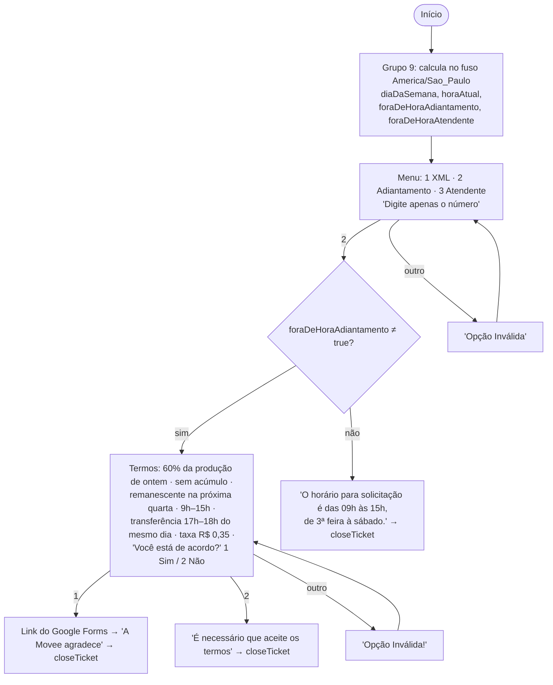
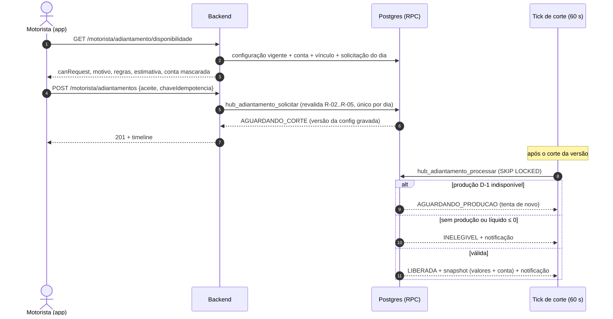
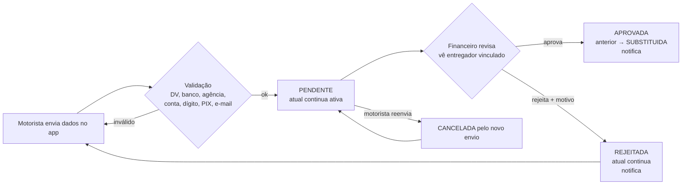
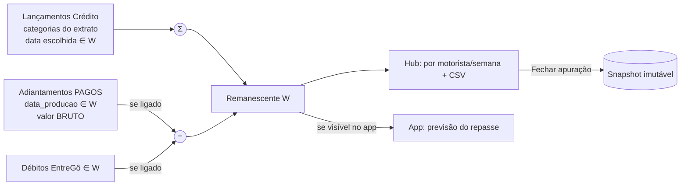
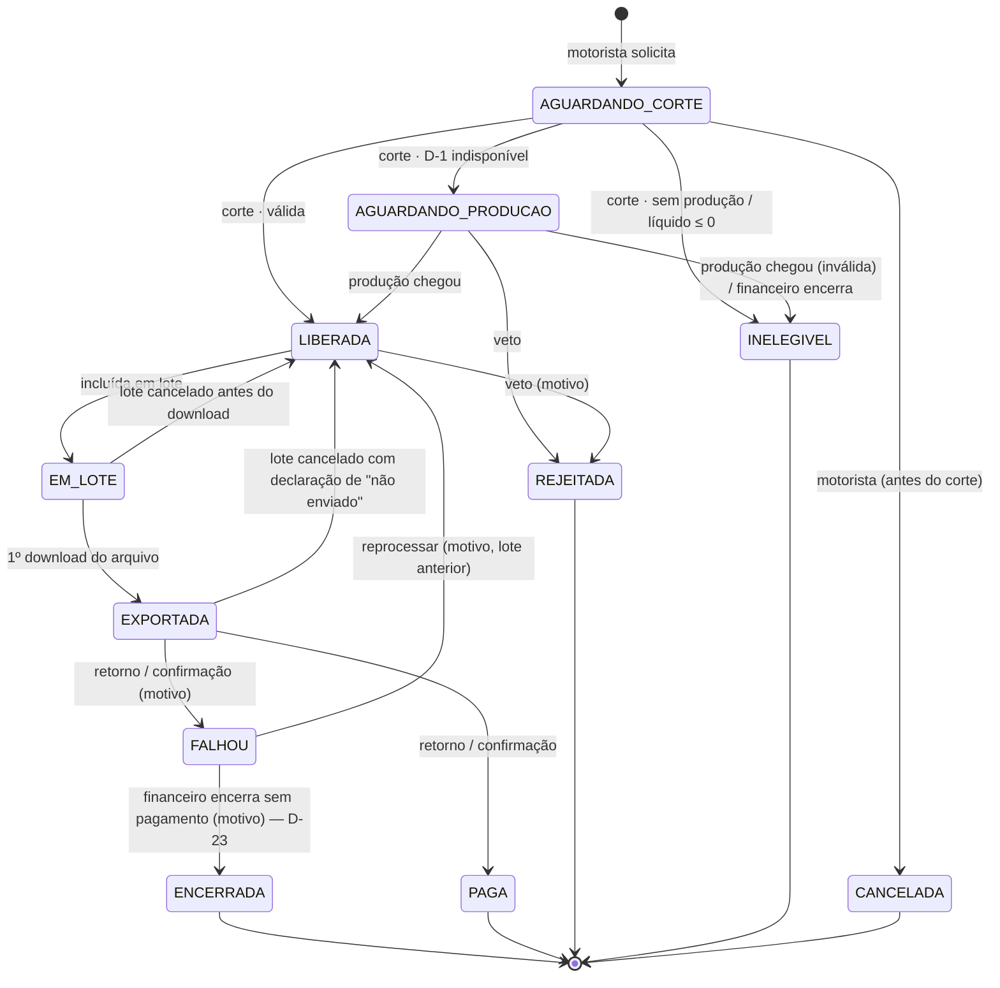
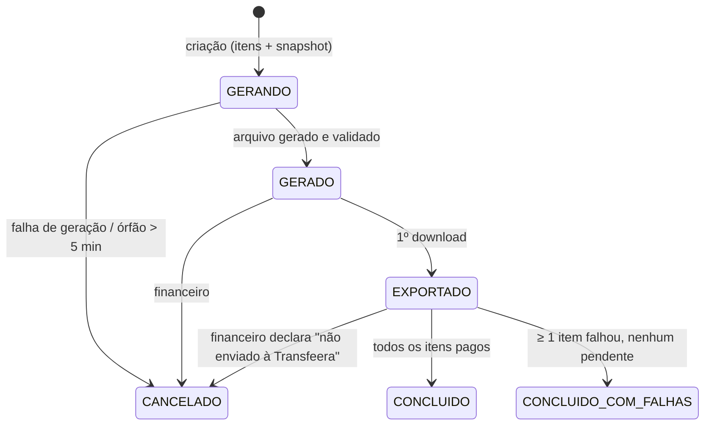
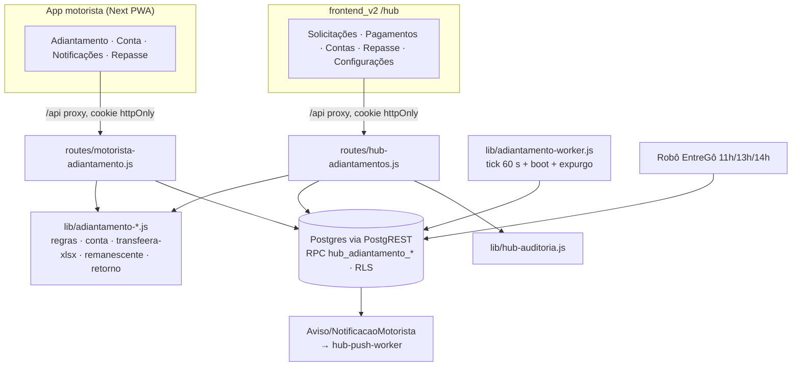

# Adiantamento pelo app, dados bancários e exportação Transfeera — Plano (Etapa A)

> **Status:** Etapa A concluída e **APROVADA pelo operador em 2026-09-17** (plano, protótipo
> e propostas Q-N). A Etapa B começou com `/feature-00c adiantamento-motorista`, com
> atomic-commit desligado; a entrada está em [`BRIEFING-AGENTE-00C.md`](BRIEFING-AGENTE-00C.md).
> Houve **ajuste em relação à §27:**
> - A execução roda na **raiz da sessão**, e não em worktree, porque o `session-scope`
>   exige que o alvo seja a raiz.
> - O comando é o `/feature-00c`, e não o `/agente-00c`: o estado do push-motorista
>   bloqueia o init deste, e a pasta de specs dele colidiria com documentos versionados.
>
> Na Etapa A não houve código definitivo, migration, banco, API, job, deploy nem uso do
> `agente-00c`.
>
> **Fontes:**
> - `docs/documentos_apoio/novas_features_hub_e_app_motorista.txt` (doc 1)
> - `docs/documentos_apoio/exportacao_adiantamento_transfeera.txt` (doc 2)
> - `typebot-export-meu-typebot-a23lntl.json`
> - `conta_bancária_drivers.xlsx`
> - `modelo_transfeera.xlsx`
> - o código deste repositório
> - o modelo público oficial da Transfeera (`s3.amazonaws.com/transfeeradata/planilha-padrao.xlsx`)
> - a Central de Ajuda da Transfeera ([pagamentos por planilha](https://suporte.transfeera.com/pagamentos-planilha/),
>   [Pix por planilha](https://suporte.transfeera.com/pagamentos-pix-por-planilha/))
>
> **Protótipo navegável (dados fictícios):** [`prototipo/index.html`](prototipo/index.html).
>
> ⚠️ **Dados pessoais:** este documento não reproduz nome, CPF, CNPJ nem conta de pessoa
> real. As planilhas de apoio foram lidas só por estrutura, contagem e forma
> (`999.999.999-99`).

---

## 0. Como ler

| Seção | Conteúdo | Itens do doc 1 §34 / doc 2 "Resultado esperado" |
|---|---|---|
| 1 | Decisões do operador (registro das respostas de 2026-09-17) | 7 |
| 2 | Diagnóstico da aplicação | doc1 1 |
| 3–4 | Typebot e comparação de regras | doc1 2, 3 |
| 5–7 | Planilhas e mapeamento Transfeera | doc1 4, 5, 6 · doc2 1–8 |
| 8–9 | Regras consolidadas e questões | doc1 7, 8, 9 |
| 10–11 | Fluxos e máquinas de estado | doc1 10, 11 · doc2 11 |
| 12–15 | Dados, configurações, lote, Excel | doc1 12–15 · doc2 9, 10, 15, 16 |
| 16–19 | APIs, arquitetura, repasse, notificações | doc1 16, 17 |
| 20–22 | Segurança, permissões, auditoria | doc1 18, 19, 20 |
| 23–24 | UX/UI e protótipo | doc1 21, 22 · doc2 12, 13, 14 |
| 25–26 | Edge cases e testes | doc1 23, 24 · doc2 16 |
| 27 | Plano de implementação (Etapa B, `agente-00c`) | doc1 25 |
| 28–29 | Riscos e achados fora do escopo | — |

---

## 1. Decisões do operador (2026-09-17)

Respostas dadas ao longo desta etapa. Valem como requisito e **não** devem ser
reinterpretadas na Etapa B.

| ID | Decisão |
|---|---|
| D-01 | **Fonte da produção D-1 é parametrizável no hub.** Opções: Financeiro por `data_lancamento`, Financeiro por `data_referencia`, Performance (`taxas` das corridas aceitas por `data_periodo`). |
| D-02 | **Categorias que compõem a produção são parametrizáveis no hub.** São os valores da coluna `descricao` do relatório Financeiro; só entra o que a operadora escolher. |
| D-03 | **Liberação automática com veto.** Depois do corte o sistema calcula; se a solicitação for válida, vira *liberada*. O financeiro pode rejeitá-la, com motivo obrigatório, antes de ela entrar num lote. |
| D-04 | **Janela de solicitação.** Dias habilitados parametrizáveis (inicial: segunda a sábado; domingo desabilitado). Abertura parametrizável (inicial 09:00). Corte parametrizável (inicial 15:00). |
| D-05 | **Taxa fixa por solicitação**, em R$, parametrizável (inicial R$ 0,35). |
| D-06 | **Arredondamento** de produção × percentual: centavos, meio para cima. |
| D-07 | **Pré-requisito para solicitar:** vínculo conta do app ↔ entregador **e** conta bancária aprovada. Na aprovação bancária, o financeiro vê e confirma o entregador vinculado; essa é a checagem humana. |
| D-08 | **Carga inicial:** as 1.731 contas da planilha entram como **pendentes de revisão**. |
| D-09 | **O sistema calcula o remanescente do repasse semanal.** |
| D-10 | **Remanescente parametrizável.** Período de apuração em **janela semanal configurável** (dia de início, dia de fim, dia do repasse). Tipos de desconto ligáveis: **adiantamentos** e **débitos EntreGô**. |
| D-11 | **O remanescente desconta o valor BRUTO do adiantamento.** A taxa é cobrada uma única vez, no pagamento do adiantamento. Exemplo aprovado: repasse R$ 1.000,00 − bruto R$ 129,40 = **R$ 870,60**. |
| D-12 | **Um adiantamento é descontado no período que contém a sua data de produção (D-1).** |
| D-13 | **O remanescente aparece no hub.** A exibição no app é **parametrizável** (liga/desliga). |
| D-14 | **No máximo 1 solicitação por motorista por dia, sem acúmulo.** O motorista pode **cancelar até o horário de corte**. |
| D-15 | **Central de notificações** com eventos do sistema **e** os Avisos do hub para **todo o público escolhido**, inclusive quem não ativou push. |
| D-16 | **Confirmação de pagamento por importação do retorno da Transfeera.** O operador vai enviar um arquivo real. Até lá, a marcação é manual por lote, com exceções. |
| D-17 | **Novo papel `financeiro`** com todas as permissões do módulo. `admin_plataforma` e `admin_entidade` também as recebem. |
| D-18 | **Coluna Email:** campo opcional "e-mail para comprovante" no cadastro bancário. Se estiver vazio, a coluna sai vazia. |
| D-19 | **Tipo de conta:** só **Conta Corrente** e **Conta Poupança**. |
| D-20 | **ID integração:** `ADV-<nº da solicitação>` (ex.: `ADV-000123`). |
| D-21 | **Descrição Pix:** manter o texto atual do financeiro, `Antecipação entregador mei DD.MM.AA_<Nome>`, com a data da produção. |
| D-22 | **Data de agendamento:** sai vazia (doc 2 §8). |
| D-23 | *(2026-09-17, durante a Etapa B)* **O fechamento da apuração semanal é recusado enquanto houver pendentes.** Pendente é toda solicitação com produção no período que ainda não foi finalizada: aguardando corte, aguardando produção, liberada, em lote, exportada ou falhou. **Novo estado `ENCERRADA`:** o financeiro encerra, com motivo obrigatório, uma falha que não será mais paga. Não bloqueiam o fechamento: paga, rejeitada, inelegível, cancelada e encerrada. O fechamento desconta o bruto das pagas. Substitui a proposta Q-N3 para o fechamento. |

---

## 2. Diagnóstico da aplicação

### 2.1 App do motorista (`app_homologacao/frontend_motorista`)

- **Stack:** Next 16.2.3, React 19.2.4 e Tailwind 4.
  - PWA com Serwist 9: `app/sw.ts` compilado para `public/sw.js`.
  - Componentes escritos à mão; não há Radix nem Base UI.
  - Não há biblioteca de formulário: a validação é manual, com `useState`.
  - Ícones Material Symbols Rounded; fonte Plus Jakarta Sans.
- **Navegação:**
  - Rotas: `/login`, `/cadastro`, `/movimento` (home e `start_url`), `/validar` e `/avisos/[id]`.
  - Não existe bottom nav, menu, perfil, página `/avisos` (lista), `error.tsx` nem `loading.tsx`.
  - A guarda de autenticação roda só no cliente (`app/(app)/layout.tsx`).
- **Autenticação:**
  - Login por **CNPJ do prestador + senha** em `POST /motorista/login` (`backend/routes/motorista.js:299`).
  - Em produção, o login consulta a tabela legada `Motorista`. O caminho `ContaMotorista` está desligado: `HUB_MOTORISTA_LOGIN_CONTA_ATIVA` não é definida em produção.
  - JWT com `aud:'motorista'` e payload `{cnpjPrestador, nome}`. Não há id numérico no token.
  - Cookies `accessToken`/`refreshToken` httpOnly (15 min / 7 dias).
  - O refresh roda num `setInterval` de 10 min.
  - **Lacuna:** ao abrir o app, ele só chama `/verify-auth`, sem tentar refresh. Reabrir o app depois de 15 min provavelmente leva ao login (§29).
- **Estado:**
  - Dois contexts: `auth-context` e `tenant-theme-context`.
  - Fetch manual via `lib/api-client.ts`, com timeout de 15 s. Não há SWR nem React Query.
- **Design system (`app/globals.css`):**
  - Tokens EntreGô: creme `#f9f2e8`, marinho `#0f1849`, azul `#2c67ea`, menta `#2ceabc`, verde `#009b7f`, amarelo `#ffb72a`, vermelho `#e5484d`.
  - Raio `0.875rem`; tema escuro pela classe `.dark`.
  - Componentes em `components/ui` (button, badge, input, skeleton, copy-button, count-up).
  - Cards `glass rounded-2xl`; coluna única `max-w-md`.
- **Notificações:**
  - Web Push VAPID. O card de ativação fica na home.
  - O `push` do service worker mostra `{avisoId, titulo, corpo}` e o toque abre `/avisos/:id`.
  - **Não existe histórico, estado lido/não lido, badge, "marcar como lida" nem lista.**
  - `AvisoEntrega` é o estado de **entrega** do push, não de leitura.
  - Um aviso só é visível para quem tem `PushInscricao`: motorista sem push nunca vê aviso algum (`infra/hub/migrations/0061_push_avisos.sql:313-334, 367-370`).
- **Acessibilidade:**
  - Há `aria-label`/`aria-invalid`, foco visível e `prefers-reduced-motion`.
  - Falhas:
    - `userScalable:false` (bloqueia o zoom);
    - alvos de toque de 36 px;
    - o CTA `warm` tem contraste de **1,54:1** no meio do gradiente;
    - o badge "warning" usa a cor menta (§29).
- **Adiantamento, conta bancária e PIX:** nada existe.

### 2.2 Backend (`app_homologacao/backend`)

- **Stack:** Express 4 em Node 20 (imagem `Dockerfile.hub`).
  - Não há ORM, biblioteca de validação, logger nem fila externa.
  - A persistência é via **PostgREST**, com JWT por requisição (`lib/hub-postgrest.js`, `lib/hub-postgrest-jwt.js`) e RLS por `hub_jwt_escopo_ids()`.
  - A atomicidade vive **dentro de funções SQL** `SECURITY DEFINER`; não há transação multi-statement no Node.
- **Rotas do hub:** `/api/v1/*`.
  - Cadeia de guarda: `requireModuloAtivo` → `requirePermission` → reconferência na entidade ativa (`resolverContextoEntidade`).
  - Envelope de erro `{erro:'CODIGO'}`: `DADOS_INVALIDOS`, `PERMISSAO_NEGADA`, `ENTIDADE_NAO_SELECIONADA`, `LIMITE_EXCEDIDO`…
  - Listas no formato `{itens,total,page,pageSize}`.
- **RBAC:** tabelas `Papel`, `Permissao`, `PapelPermissao`, `Modulo`, `ModuloEntidade` e `UsuarioEntidade`, com um papel por usuário por entidade.
  - Permissões no padrão `<modulo>.<acao>`. Existem 39 hoje.
  - Um módulo aparece no `/me` se estiver ativo na entidade **e** o usuário tiver alguma permissão com o prefixo `<modulo>.`.
  - Módulos novos entram por migration idempotente, no padrão `0062_modulo_avisos.sql`.
- **Idempotência e concorrência:**
  - hash sha256 com 409 nas importações;
  - `UNIQUE (id_empresa, hash_linha)`;
  - índice único parcial como mutex;
  - `chave_idempotencia uuid` nos avisos;
  - `FOR UPDATE SKIP LOCKED` com lease no worker de push.
  - **Não há advisory lock.**
- **Jobs:**
  - Worker de push em processo, com `setInterval` de 24 h para expurgo — o único do backend.
  - Processador de importação disparado por requisição.
  - Timers systemd no host: robô EntreGô às 11h/13h/14h e enriquecimento a cada 5 min.
- **Auditoria:** `lib/hub-auditoria.js` → `"Auditoria"`.
  - Imutável; retenção de 12 meses.
  - Omite valores que pareçam CPF, CNPJ ou e-mail, e chaves de segredo.
  - Nunca lança exceção; em falha registra `AUDITORIA_PERDIDA`.
- **Fuso horário:**
  - O container roda em **UTC** (sem `TZ`).
  - O hub filtra datas em UTC.
  - **Não existe cálculo de "ontem"/D-1 no backend**; só o robô calcula D-1, com `Intl` em `America/Sao_Paulo`.
- **Arquivos:**
  - **Não existe exportação Excel.** O `xlsx` (SheetJS CE 0.18.5) só lê o upload legado.
  - As exportações do hub são **CSV em streaming**, com `Content-Disposition` (`routes/hub-faturamento.js`).
  - Uploads vão para o volume `envio_massa_hub_uploads`, com permissões 0700/0600.
- **Migrations:** a última é `0065_push_registrar_resultado_lock_aviso.sql`; **a próxima livre é `0066`**.
  - Em produção, as tabelas do hub ficam **dentro do `chatmasterveloz`**, então migration exige o rito integral.

### 2.3 Hub (`app_homologacao/frontend_v2/app/hub`)

- **Stack e marca:** Tailwind 4, Base UI (`Select` exige `items`) e shadcn `base-nova`.
  - Mesmos tokens EntreGô. No hub, o `--primary` é `#2c66e9` e o `--success` é `#00715e` (ambos ajustados para AA).
  - Tema padrão **escuro**.
- **Menu:** vem dos dados (`/me.modulos`, ordenados por `ordem`).
  - Rota `/hub/dashboard/<codigo>`, com sidebar ≥lg e gaveta abaixo disso.
  - Não há breadcrumb nem abas (`Tabs` não existe em `components/ui`).
- **Permissões no front:** checagem inline, `permissoes.includes('x.y')`, em variáveis `podeX`.
  - Na maioria dos casos a ação fica **escondida**.
  - Não há guarda de rota por módulo: vale o 403 do backend.
- **Listas:**
  - Montadas à mão com `Table`, `CabecalhoOrdenavel`, `PaginationControls` (20 por página, no servidor), `ListSkeleton` e `EmptyState`.
  - Cards abaixo de `md`.
  - Filtros com `FilterBar`, `SelectFiltro` e `PeriodFilter` (inputs `date` nativos).
  - Sincronização com a URL via `use-filtros-url` (só em motoristas e importações).
  - **Seleção em massa só existe no envio em massa.**
- **Formulários:** manuais, com `aria-invalid` + `aria-describedby` + `role=alert`.
  - Confirmação destrutiva com `AlertDialog`.
  - Ação reversível resolvida com toast "Desfazer".
  - Chave de idempotência por abertura do diálogo (`aviso-dialog.tsx`).
- **Downloads:** `fetch` → `blob` → nome lido do `Content-Disposition` → `<a download>` (`lib/hub/faturamento-api.ts:100-121`).
  - O proxy `app/api/[...path]` repassa o corpo em stream.
- **Qualidade:**
  - larguras nomeadas (verificadas por teste);
  - alvo de toque de 44 px;
  - AA nos dois temas;
  - axe ≥ 95;
  - detector impeccable com 0 achados;
  - rótulo pt-BR para toda permissão (`rotulo-permissao.test.ts`).

### 2.4 De onde vem a "produção" (hub)

- **Financeiro** (`FaturamentoLancamento`, 0013):
  - Um lançamento de crédito por linha, com `valor numeric(12,2)`, `descricao` (categoria, texto livre), `tipo` (`Credito`/`Debito`).
  - Três datas: `data_lancamento`, `data_referencia` (competência) e `data_repasse`.
  - É append-only.
  - Medição no arquivo real de 27/08/2026:
    - `data_lancamento` foi 100% o próprio dia;
    - `data_referencia` foi 73% D, 26% D-1 e ~1% mais antigo;
    - `data_repasse` foi 100% a quarta seguinte (02/09);
    - `tipo` foi 100% `Credito`.
  - "Valor por Hora Online" chega com um dia de atraso.
  - Lançamentos "Percentual atingido de …" vêm **sem entregador** (`entregador_id` nulo).
- **Performance** (`PerformanceTurno`, 0014): grão turno × dia.
  - `taxas_centavos` = soma das taxas das corridas **aceitas**.
  - Linhas "gêmeas" não são deduplicadas (0051).
- **Chegada dos dados:** o robô importa **D-1** às 11h/13h/14h (America/Sao_Paulo); a produção de ontem costuma estar no hub por volta das **11h10**.
  - Se as três janelas falharem, o dia não entra sozinho.
  - Correções do portal entram como **linhas novas** (append-only).
- **Identidade:** claim `cnpjPrestador` → `ContaMotorista.cnpj_prestador` → `Entregador.motorista_id` → fatos.
  - O vínculo é por **semelhança de nome** (automático, ≥ 0,9, candidato único) ou **manual** no hub.
  - Índice único global: **no máximo um entregador por conta**.
  - `Entregador` não tem CPF em coluna; o CPF só existe em `dados_entrego_json` (enriquecimento).
- **Dados bancários:** não existem em nenhuma tabela.

> **Sinalização pedida pelo doc 1 §3:** o sistema atual **não** tem produção D-1 por
> motorista. A tela Financeiro do hub chama de "dia" o `data_lancamento`, e por
> competência (`data_referencia`) ontem está **incompleto** no dia seguinte. Por isso a
> fonte ficou parametrizável (D-01), e a tela de configuração avisa sobre essa
> incompletude.

---

## 3. Análise do Typebot (fluxo "Solicitação de adiantamento")

### 3.1 Fluxo reconstruído



- **Regra efetiva** (grupo 9, `foraDeHoraAdiantamento`):
  - `hour < 9 || hour > 15` → fora do horário. Como `hour > 15` não pega as 15h, **na prática aceita até 15:59**.
  - Também fora: `Domingo` ou `Segunda-feira`.
- **Integrações:**
  - diretivas da plataforma de atendimento: `#{"queueId":"61"}` (opção XML) e `#{"closeTicket":"1"}`;
  - link externo do Google Forms (o formulário não foi analisado, porque o conteúdo não está no export).
  - Não há cálculo, API nem banco. **O fechamento e o pagamento são manuais.**
- Há uma aresta órfã: vem do bloco `a93wg1…`, que não existe mais, e aponta para o grupo "fora de horário".

### 3.2 Classificação

**A. Regras que permanecem**
- percentual sobre a produção de ontem (60%, agora parametrizável);
- sem acúmulo (dia não pedido não soma);
- taxa fixa por solicitação (R$ 0,35, agora parametrizável);
- aceite explícito dos termos antes de solicitar;
- janela com abertura e fechamento no fuso `America/Sao_Paulo`;
- transferência prevista no mesmo dia, entre 17h e 18h (texto informativo parametrizável);
- remanescente no repasse semanal (agora calculado, D-09).

**B. Regras substituídas**
- dias: terça a sábado → **segunda a sábado, parametrizável**;
- fronteira do horário: `hour > 15` (aceita 15:59) → **corte exato e exclusivo, 15:00:00 bloqueia**;
- Google Forms → **solicitação e cadastro bancário no app**;
- cálculo e liberação manuais → **automáticos após o corte, com veto** (D-03);
- "havendo saldo" → **regras de elegibilidade explícitas** (§8);
- mensagem única de fora de horário → **mensagem por motivo, com próxima oportunidade**;
- controle manual do pagamento → **lote formal + Excel Transfeera + retorno**.

**C. Particularidades que deixam de existir no app**
- menu numérico ("Digite apenas o número") e os laços de "Opção Inválida";
- `queueId`/`closeTicket` e encerramento de ticket;
- "A Movee agradece seu contato";
- *typing emulation*;
- a pergunta "Sim/Não" por texto (vira confirmação com caixa de aceite);
- a regra de horário de atendente (`foraDeHoraAtendente`, seg–sex 8h–18h30), que continua só no Typebot e não se aplica ao app.

---

## 4. Regras atuais × novas

| Tema | Typebot (hoje) | App (novo) |
|---|---|---|
| Dias | ter–sáb (fixo) | seg–sáb, parametrizável (D-04) |
| Abertura | 09:00 (fixo) | 09:00, parametrizável |
| Corte | "15h", mas aceita até 15:59 (bug) | 15:00:00 exclusivo, parametrizável |
| Relógio | do servidor do Typebot | do backend, `America/Sao_Paulo` explícito |
| Produção | "da data de ontem", apurada à mão | D-1 calendário, fonte e categorias parametrizáveis |
| Percentual | 60% (texto) | parametrizável, versionado |
| Taxa | R$ 0,35 (texto) | fixa, parametrizável, versionada |
| Arredondamento | não definido | centavos, meio para cima |
| Aceite | "1 Sim / 2 Não" | caixa de aceite; o texto aceito fica gravado |
| Quantidade | não controlada | 1 por dia; cancelável até o corte |
| Pagamento | manual, 17h–18h | lote + Excel Transfeera; a previsão aparece no app |
| Remanescente | "próxima quarta" (manual) | calculado (D-09 a D-13) |
| Transparência | uma mensagem | tela de regras, estados, timeline e notificações |

---

## 5. Análise de `conta_bancária_drivers.xlsx` (só estrutura)

- **Estrutura:** aba `Planilha1` com 1.731 linhas de dados.
  - 10 colunas: `Nome`, `ID`, `CPFEntregador`, `Nome titular`, `CPF/CNPJ do titular da Conta`, `Banco`, `Agência`, `Conta`, `Dígito`, `Tipo Conta`.
  - **Não há** chave PIX, e-mail nem PF/PJ explícito.
- **`ID`:** UUID, 1.731 distintos. **Hipótese não confirmada:** é o `Entregador.id_externo` da EntreGô. A carga (F8) mede a taxa de casamento antes de gravar qualquer coisa.
- **`CPFEntregador`:**
  - 1.730 no formato `999.999.999-99`;
  - 1 com separador trocado;
  - 1 CPF repetido (duas linhas);
  - 1 CPF com dígito verificador inválido.
- **Titular:**
  - 867 CPF e **864 CNPJ** (MEI).
  - Em 864 linhas o documento do titular é igual ao CPF do entregador; em 3 linhas o titular é **outra pessoa física**.
  - Formatos variados: 9 casos, com espaço à esquerda ou à direita, `/` no lugar de `-`, e espaços.
  - Todos passam no dígito verificador depois de limpos.
  - `Nome titular` é igual a `Nome` em 1.722 linhas; nas linhas com CNPJ, o nome é o da pessoa, não a razão social.
- **`Banco`:**
  - 1.719 códigos numéricos (COMPE) e 30 bancos distintos. Os principais são 260, 77, 33, 104, 336, 341, 237, 380, 323 e 1.
  - **9 escritos por nome** (7 "Recargapay…", 1 "Stone…", 1 "Pagseguro…").
  - **1 com 8 dígitos**, formato de ISPB.
- **`Agência`:** **1.253 com 1 dígito** (ex.: o Nubank aparece como `1` em 888 linhas e como `0001` em 47).
  - Santander e Itaú aparecem com 3 dígitos, o que indica **zeros à esquerda já perdidos na origem**.
  - 84 agências estão como texto (82 com zero à esquerda).
- **`Conta` e `Dígito`:** já vêm **separados**.
  - Dígito de 0 a 9; não há `X`.
  - 24 contas e 24 dígitos em texto com zero à esquerda.
- **`Tipo Conta`:** exatamente `Conta Corrente` (1.643) ou `Conta Poupança` (88). São os mesmos textos do modelo Transfeera.

**Consequências para a carga (F8):**
- normalizar o documento (só dígitos + dígito verificador);
- agência com 4 dígitos (zeros à esquerda);
- banco por código COMPE, com tradução explícita de nome e ISPB pela lista do BCB;
- recusar e reportar o que não normalizar.

A planilha está protegida pelo `.gitignore:13`.

---

## 6. Análise de `modelo_transfeera.xlsx` × modelo oficial

**Arquivo do operador:** gravado pelo Excel e modificado em 2026-09-16.
- **Estrutura:**
  - uma aba, `Página1`;
  - `A1:L1` **mesclada**, com a instrução "Mantenha sempre o cabeçalho original da planilha e esta linha, mantendo os titulos e a ordem dos campos";
  - **linha 2** com 12 cabeçalhos;
  - **linha 3** com exemplo real;
  - linhas 4 a 1217 só com formatação;
  - `_FilterDatabase` em A1:N291.
- **Não tem:** fórmulas, validação de dados, formatação condicional nem tabelas.
- **Formatos:**
  - A1: texto branco em negrito sobre vermelho;
  - cabeçalhos com formato texto (`@`) em negrito;
  - B (CPF/CNPJ) com formato texto;
  - I (Valor) com moeda `"R$" #,##0.00` (negativo em vermelho);
  - demais células no formato Geral, com borda.

| Col. | Cabeçalho (exato) | Exemplo da linha 3 (tipo) |
|---|---|---|
| A | `Nome ou Razão Social` | nome de pessoa (texto) |
| B | `CPF ou CNPJ` | CPF **com máscara** `999.999.999-99` (texto) |
| C | `Email (opcional)` | vazio |
| D | `Banco` | `33` (**número**) |
| E | `Agência` | `577` (**número**, zero perdido) |
| F | `Conta` | `1063195` (número) |
| G | `Dígito da conta` | `2` (número) |
| H | `Tipo de Conta (Corrente ou Poupança)` | `Conta Corrente` (texto) |
| I | `Valor` | `129.4` (número, moeda) |
| J | `ID integração (opcional)` | igual à coluna L (texto) |
| K | `Data de agendamento (opcional)` | vazio |
| L | `Descrição Pix (opcional)` | `Antecipação entregador mei 15.09.26_<Nome>` (texto) |

**Modelo oficial público** (`planilha-padrao.xlsx`) — mesmo nome de aba, **mesma linha 1,
mesmos 12 cabeçalhos na mesma ordem**, mesma mescla `A1:L1`. Diferenças que importam:
- Banco, Agência, Conta e Dígito vêm como **texto** (`'104'`, `'123'`, `'1111'`, `'1'`), ou seja, texto é aceito pelo importador.
- A dica de tipo de conta diz "Corrente, poupança ou pagamento".
- A data de agendamento vem como texto `16/04/2030` (DD/MM/AAAA).
- O CPF vem com máscara (`000.000.000-00`).
- O valor vem como número.

**Central de Ajuda da Transfeera:**
- Campos obrigatórios: Nome/Razão Social, CPF/CNPJ, Banco, Agência, Conta, Dígito, Tipo de conta e Valor.
- E-mail: se preenchido, o favorecido recebe o comprovante.
- ID integração: "campo opcional… controle interno". **Sem limite nem unicidade documentados.**
- Data de agendamento: opcional.
- Descrição Pix: **até 140 caracteres**.
- **Até 5.000 linhas por planilha**; xlsx ou csv.
- Documento aceito com ou sem máscara (dito na página de Pix).
- Fluxo: importar → **"FECHAR LOTE"**, que é **irreversível** e retém o saldo.
- Existe um **modelo separado** para "transferências com chave PIX" (Tipo de chave, Chave PIX…). O modelo usado aqui é o de dados bancários, que **não tem coluna de chave PIX** (doc 2 §2).

⚠️ **O modelo do operador contém nome e CPF de uma pessoa real na linha 3 e NÃO está
no `.gitignore`** (a regra `!docs/documentos_apoio/modelo_*.xlsx` o libera). O
repositório é **público**. Portanto:
- ele **não** será versionado como está;
- o contrato de exportação vira uma fixture **sanitizada** (só aba, linha 1, linha 2 e mescla);
- a F0 acrescenta o arquivo ao `.gitignore`.

---

## 7. Mapeamento Transfeera (contrato de exportação)

### 7.1 Campo interno → coluna

| # | Coluna Transfeera | Origem interna | Tipo na célula | Obrigatório | Regra |
|---|---|---|---|---|---|
| 1 | `Nome ou Razão Social` | `ContaBancariaMotorista.titular_nome` | texto | sim | aparado; 1–120 caracteres |
| 2 | `CPF ou CNPJ` | `titular_documento` | texto | sim | armazenado só com dígitos; exportado **com máscara** (`999.999.999-99` / `99.999.999/9999-99`), como no modelo do operador |
| 3 | `Email (opcional)` | `email_comprovante` | texto | não | vazio quando ausente (D-18) |
| 4 | `Banco` | `banco_codigo` (COMPE) | **texto** | sim | ver §7.3 e V-1 |
| 5 | `Agência` | `agencia` | **texto** | sim | 4 dígitos com zeros à esquerda, sem dígito de agência (V-2) |
| 6 | `Conta` | `conta` | **texto** | sim | só dígitos, sem o dígito verificador, zeros preservados |
| 7 | `Dígito da conta` | `conta_digito` | **texto** | sim | 1 caractere `[0-9]`; `X` só depois da V-3 |
| 8 | `Tipo de Conta (Corrente ou Poupança)` | `tipo_conta` (`CORRENTE`/`POUPANCA`) | texto | sim | `Conta Corrente` / `Conta Poupança` (D-19) |
| 9 | `Valor` | `AdiantamentoSolicitacao.valor_liquido` | **número** | sim | 2 casas, formato `"R$" #,##0.00`, > 0 |
| 10 | `ID integração (opcional)` | `'ADV-' + lpad(id, 6, '0')` | texto | — | D-20; estável entre lotes |
| 11 | `Data de agendamento (opcional)` | — | vazio | — | D-22 |
| 12 | `Descrição Pix (opcional)` | `'Antecipação entregador mei ' + DD.MM.AA(data_producao) + '_' + titular_nome` | texto | — | D-21; cortado em 140 caracteres (§9 Q-N11) |

A chave PIX **não** é exportada. Ela existe só no cadastro interno (doc 2 §2 e §4).

### 7.2 Campos internos que ainda não existem

Hoje **todos** faltam: não há tabela bancária. Serão criados em `ContaBancariaMotorista`:
`titular_nome`, `titular_documento`, `titular_tipo` (PF/PJ, derivado do tamanho do
documento), `banco_codigo`, `banco_nome`, `agencia`, `conta`, **`conta_digito`**
(separado), `tipo_conta`, `chave_pix_tipo`, `chave_pix` e `email_comprovante`. O valor
líquido, o ID de integração e a data de produção vêm de `AdiantamentoSolicitacao`.

### 7.3 Estratégias

- **Conta e dígito:** são **campos separados desde o formulário** (doc 2 §3–4). O exportador não faz parsing algum.
- **Código bancário:**
  - lista estática **COMPE** versionada no repo, gerada do arquivo público do BCB (participantes do STR), com data de extração;
  - o app mostra "código – nome" com busca;
  - o banco guarda o código (3 dígitos) e o nome como snapshot;
  - o exportador escreve **texto**.
  - O formato exato (`033` ou `33`) é a **validação V-1**. O modelo do operador usa o número `33`, o oficial usa o texto `104`. Se `033` for recusado, a troca é uma linha no mapeador.
  - Na carga, nome ou ISPB são traduzidos pela mesma lista; o que não casar é recusado.
- **Tipo de conta:** enum interno `CORRENTE`/`POUPANCA` → `Conta Corrente`/`Conta Poupança`, os textos já provados na operação.
- **ID integração:** `ADV-000123`.
  - Liga a linha do Excel à solicitação; o lote e o motorista vêm por relação.
  - Numa reexportação por falha, o ID **se mantém**, o que deixa duplicidade visível na Transfeera.
  - Não há limite documentado; o formato tem 10 caracteres, só ASCII.
- **Descrição Pix:** texto atual do financeiro, com a data da produção. Não é identificador; a rastreabilidade usa o ID integração.
- **Data de agendamento:** vazia. Se um dia for usada, o formato do modelo oficial é `DD/MM/AAAA` (texto).
- **Validações de aceite na Transfeera (antes de liberar, feitas pelo operador):**
  - importar um arquivo gerado pelo sistema, com 3 a 5 linhas reais, na aba Importação;
  - conferir a leitura;
  - **não** clicar em "FECHAR LOTE";
  - excluir o lote de teste.
  - Cobre:
    - **V-1:** banco com 3 dígitos;
    - **V-2:** agência com zero à esquerda (texto);
    - **V-3:** dígito `X`, se houver caso real;
    - **V-4:** documento com máscara;
    - **V-5:** Descrição Pix com acento;
    - **V-6:** o formato interno extra que o SheetJS grava (§15).

---

## 8. Regras consolidadas

| ID | Regra | Fonte |
|---|---|---|
| R-01 | `data_producao = data_solicitacao − 1 dia` calendário, no fuso da configuração (inicial `America/Sao_Paulo`). Não se usa último dia útil, último dia habilitado nem última produção. | doc 1 §3 |
| R-02 | Uma solicitação só é criada se: o dia da semana de hoje está habilitado **e** `abertura ≤ agora < corte` (ex.: 08:59:59 bloqueia; 09:00:00 permite; 14:59:59 permite; 15:00:00 bloqueia). A decisão é do backend, com o relógio do servidor. | D-04, doc 1 §5 |
| R-03 | Os dias habilitados dizem **quando se pode pedir**; não mudam a R-01 (segunda → domingo). | doc 1 §4 |
| R-04 | Pré-requisitos: módulo ativo para o grupo Movee (`mesmoGrupoQue(_, 6)`), conta do app ativa, **vínculo com entregador** e **conta bancária APROVADA**, sem outra solicitação não cancelada no dia. | D-07, D-14 |
| R-05 | Aceite obrigatório. O texto aceito é gerado da configuração vigente e gravado com a solicitação (hash + versão). | Typebot |
| R-06 | A solicitação fica com a **versão da configuração vigente na criação**. Mudar a configuração depois não altera solicitações já criadas. | doc 1 §9 |
| R-07 | Cálculo após o corte da versão da solicitação: `producao` = soma da fonte (D-01), só com as categorias da versão (D-02) e só lançamentos `Credito` do entregador vinculado; `bruto = round_half_up(producao × pct / 100, 2)`; `liquido = bruto − taxa`. | D-01, D-02, D-05, D-06 |
| R-08 | Só se calcula se a produção de D-1 estiver **disponível**: existe dado da fonte naquela data para a empresa e não há importação em andamento desse tipo. Se não estiver, a solicitação vai para `AGUARDANDO_PRODUCAO` (pendência), com nova tentativa a cada ciclo. | §2.4 |
| R-09 | Com a produção disponível: `producao = 0` → `INELEGIVEL` (`SEM_PRODUCAO`); `liquido ≤ 0` → `INELEGIVEL` (`VALOR_INSUFICIENTE`); caso contrário → `LIBERADA`. | doc 1 §20 |
| R-10 | Ao ser liberada, a solicitação guarda um **snapshot** da conta bancária aprovada. Na exportação, se a conta aprovada vigente mudou, surge a pendência `CONTA_ALTERADA`, resolvida por ação explícita do financeiro. | doc 1 §10 |
| R-11 | O financeiro pode **rejeitar** (veto, motivo obrigatório) uma solicitação `LIBERADA` ou `AGUARDANDO_PRODUCAO`. | D-03 |
| R-12 | O motorista pode **cancelar** a própria solicitação só em `AGUARDANDO_CORTE`. | D-14 |
| R-13 | Uma solicitação pode estar **em no máximo um item de lote ativo** (garantido no banco). Exportado ≠ pago. | doc 2 §19–20 |
| R-14 | Reprocessar só a partir de `FALHOU`, com motivo, usuário e referência ao lote anterior. A solicitação volta a `LIBERADA` e pode entrar em um novo lote. | doc 2 §19 |
| R-15 | Remanescente de um motorista no período W = créditos das categorias do extrato com a data escolhida dentro de W − (se ligado) **bruto** dos adiantamentos pagos com `data_producao` em W − (se ligado) débitos EntreGô em W. | D-09 a D-12 |
| R-16 | Taxa cobrada **uma vez**: no líquido do adiantamento. O remanescente desconta o bruto. | D-11 |
| R-17 | Lote com no máximo **5.000 linhas** (limite da Transfeera). | Central de Ajuda |
| R-18 | Toda regra exibida no app vem do backend (`GET /disponibilidade`). O app não guarda regra administrável. | doc 1 §6–7 |
| R-19 | Fechar a apuração de um período é recusado (`409 APURACAO_COM_PENDENCIAS`, com contagem por status) enquanto existir solicitação com `data_producao` no período em `AGUARDANDO_CORTE`, `AGUARDANDO_PRODUCAO`, `LIBERADA`, `EM_LOTE`, `EXPORTADA` ou `FALHOU`. `FALHOU → ENCERRADA` pelo financeiro, com motivo obrigatório, quando a falha não será mais paga. | D-23 |

---

## 9. Questões

### 9.1 Bloqueantes (impedem o go-live, não o desenvolvimento)

| ID | Questão | Quem responde |
|---|---|---|
| Q-B1 | **Arquivo real de retorno da Transfeera.** Sem ele o importador (F9) não é construído (D-16). Colocar em `docs/documentos_apoio/`, que fica fora do git. | operador |
| Q-B2 | **Valores iniciais** da janela de apuração (dia de início, duração e dia do repasse) e das categorias do extrato semanal. | financeiro |
| Q-B3 | **Valores iniciais** da fonte e das categorias da produção (D-01, D-02). A tela lista as categorias reais encontradas nos últimos 90 dias. | financeiro |
| Q-B4 | **Resultado das validações V-1 a V-6** (upload de teste sem fechar o lote). | operador |
| Q-B5 | **Casamento `ID` da planilha ↔ `Entregador.id_externo`**, medido pela F8 em modo de simulação, só leitura, rodado pelo operador (é produção). | operador |
| Q-B6 | **O backfill de vínculos rodou em produção?** Sem `ContaMotorista` + vínculo, o motorista não pode solicitar (D-07). Verificar com consulta de leitura, rodada pelo operador. | operador |

### 9.2 Não bloqueantes (com proposta; a aprovação do plano aprova as propostas)

| ID | Questão | Proposta |
|---|---|---|
| Q-N1 | Depois de cancelar, pode pedir de novo no mesmo dia? | **Sim**, até o corte (o índice único ignora `CANCELADA`). |
| Q-N2 | Texto da previsão de pagamento | Parametrizável; inicial "entre 17h e 18h de hoje" (Typebot). |
| Q-N3 | A previsão do remanescente desconta adiantamentos já exportados e ainda não confirmados? | **Sim**, mas marcados como "em processamento". **Fechamento: decidido pela D-23** — recusado enquanto houver solicitação não finalizada no período. |
| Q-N4 | Remanescente negativo | Mostrar negativo com alerta. Não acumula para a semana seguinte sem regra definida. |
| Q-N5 | Aprovar em massa as contas da carga inicial? | Sim, com filtro "origem = carga inicial e sem alertas" e confirmação com contagem. |
| Q-N6 | Push para eventos do sistema (conta aprovada/rejeitada, adiantamento liberado/pago/falhou)? | **Sim**, reaproveitando o pipeline de Avisos (§19). |
| Q-N7 | Retenção | Bytes do Excel no banco até 90 dias após concluir ou cancelar o lote; o snapshot das linhas fica. Histórico de notificações acompanha o Aviso (90 dias, como hoje). |
| Q-N8 | Público "toda a base" no histórico | Todas as `ContaMotorista` ativas do grupo Movee. "Por empresa" = contas vinculadas a entregadores da empresa. |
| Q-N9 | Sinal dos débitos EntreGô | Descontar `abs(valor)` e **validar com o primeiro débito real** (nenhum nos arquivos medidos). |
| Q-N10 | Débitos também reduzem a produção D-1? | **Não**: a produção soma só `Credito`; débitos entram só no remanescente. |
| Q-N11 | Nome em Descrição Pix e coluna A | O nome do titular da conta (no exemplo do operador os dois coincidem). |
| Q-N12 | Titular diferente do motorista | Permitido, com alerta na revisão (3 casos reais). |
| Q-N13 | Feriados | Sem regra; só o dia da semana conta (doc 1 §3 proíbe "último dia útil"). |
| Q-N14 | Solicitação que não obtiver produção até 23:59 | Fica em `AGUARDANDO_PRODUCAO` como pendência. O financeiro recalcula (depois de importar) ou encerra com motivo. |
| Q-N15 | Nome e ordem do módulo | "Adiantamentos", ordem 35 (depois de Faturamento). |
| Q-N16 | Corrigir na mesma entrega a sessão do app que cai após 15 min | **Sim** (tentar o refresh ao abrir); o fluxo financeiro depende disso. |
| Q-N17 | Log `[proxy-debug]` do frontend_v2 grava o começo do header `Cookie` | PR separado, com autorização própria (§29). |
| Q-N18 | Tipos de chave PIX | CPF, CNPJ, e-mail, telefone e aleatória (mesmos do modelo PIX da Transfeera). |
| Q-N19 | Nome do arquivo | `transfeera_adiantamentos_<AAAA-MM-DD da criação do lote>_lote-<NNNNNN>.xlsx` |

---

## 10. Fluxos

### 10.1 Solicitação



### 10.2 Alteração de dados bancários



### 10.3 Lote e exportação

```mermaid
sequenceDiagram
  autonumber
  actor F as Financeiro (hub)
  participant B as Backend
  participant DB as Postgres (RPC)
  F->>B: POST /adiantamentos/lotes/previa {ids}
  B->>DB: valida cada solicitação (§14.3)
  B-->>F: aptos, pendências com motivos, quantidade, total
  F->>B: POST /adiantamentos/lotes {ids, quantidadeEsperada, totalEsperado, chaveIdempotencia}
  B->>DB: hub_adiantamento_lote_criar (FOR UPDATE em ordem de id)
  DB-->>B: lote GERANDO + itens (snapshot das 12 colunas)
  B->>B: gera xlsx do snapshot + valida estrutura (§15.4)
  alt gerou e validou
    B->>DB: hub_adiantamento_lote_arquivo (bytes, sha256) → GERADO
    B-->>F: lote nº, quantidade, total, "Baixar arquivo Transfeera"
  else falhou
    B->>DB: hub_adiantamento_lote_cancelar(falha_geracao) → itens liberados
    B-->>F: erro persistente, nada exportado
  end
  F->>B: GET /adiantamentos/lotes/:id/arquivo
  B->>DB: registra download (1º → EXPORTADO; solicitações → EXPORTADA)
  B-->>F: xlsx (no-store)
  Note over F: upload manual na Transfeera → FECHAR LOTE
  F->>B: retorno (F9) ou confirmação manual por lote
  B->>DB: itens pago/falhou → solicitações PAGA/FALHOU → notificações
```

### 10.4 Remanescente



---

## 11. Máquinas de estado

### 11.1 Solicitação (`AdiantamentoSolicitacao.status`)



- **Estados propostos no doc 1 §14 e como ficaram:**
  - `REQUESTED` e `WAITING_CUTOFF` viraram um estado só (`AGUARDANDO_CORTE`); o evento "Solicitação recebida" fica na timeline.
  - `CALCULATING` é **transitório dentro da transação** e não é persistido.
  - `ELIGIBLE` e `READY_FOR_PAYMENT` viraram `LIBERADA`, porque a liberação é automática (D-03).
  - `EXPORTED_FOR_PAYMENT` virou `EXPORTADA`, que **é mantido**, como o doc 1 pede. O app o mostra como "Pagamento em processamento".
  - `PROCESSING_PAYMENT` não tem sinal próprio (o upload é manual); `EXPORTADA` cobre esse momento.
- **Estados acrescentados:**
  - `EM_LOTE` (doc 2 §20);
  - `AGUARDANDO_PRODUCAO` (a pendência da R-08);
  - `INELEGIVEL` (separado de `REJEITADA`, que é o veto humano).
- **Onde as transições são garantidas:** na função SQL, por uma tabela de transições; um trigger rejeita qualquer outra.
- **Rastro:** toda transição grava um `AdiantamentoEvento`, que alimenta a timeline e a auditoria.

**Timeline no app:**

| Etapa exibida | Estado |
|---|---|
| Solicitação recebida | `AGUARDANDO_CORTE` |
| Aguardando fechamento | `AGUARDANDO_CORTE` |
| Produção calculada | cálculo feito |
| Adiantamento liberado | `LIBERADA` |
| Incluído para pagamento | `EM_LOTE` |
| Pagamento em processamento (o doc 1 chama de "Pagamento processado") | `EXPORTADA` |
| Pagamento realizado | `PAGA` |

Ramos da timeline: rejeição, inelegível, falha, pendência de produção e cancelada.

### 11.2 Lote (`AdiantamentoLote.status`)



Avaliação dos estados do doc 1 §23:

| Estado proposto | Decisão |
|---|---|
| `DRAFT`/`READY` | Não usados: a prévia é calculada na hora e não persiste, e a confirmação cria o lote. |
| `FAILED` | Virou `CANCELADO` com motivo `falha_geracao`, para não ficar lote sem arquivo. |
| `PROCESSING` | Sem sinal próprio (upload manual). |

**Downloads repetidos** entregam **os mesmos bytes** e são auditados; cada um soma no
contador.

### 11.3 Conta bancária (`ContaBancariaMotorista.status`)

| Estado | Entra quando | Pode ir para |
|---|---|---|
| `PENDENTE` | o motorista envia ou a carga inicial grava | `APROVADA`, `REJEITADA`, `CANCELADA` (novo envio do motorista) |
| `APROVADA` | o financeiro aprova | `SUBSTITUIDA` (outra aprovada) |
| `REJEITADA` | o financeiro rejeita (motivo obrigatório) | — |
| `SUBSTITUIDA` | outra conta do mesmo entregador é aprovada | — |
| `CANCELADA` | o motorista reenvia com uma pendente em aberto | — |

No banco: no máximo **uma `APROVADA`** e **uma `PENDENTE`** por entregador (índices
únicos parciais).

---

## 12. Modelo de dados (migrations `0066+`, série única do hub)

> Esboço para aprovação; o DDL final sai na F1. Convenções da série:
> - tabelas `"PascalCase"`;
> - `id_empresa` com RLS por `hub_jwt_escopo_ids()`;
> - dinheiro em `numeric(12,2)`, datas de negócio em `date`, instantes em `timestamptz`;
> - migrations idempotentes;
> - funções `hub_adiantamento_*` com `SECURITY DEFINER` e `REVOKE`/`GRANT` explícitos.

### 12.1 `AdiantamentoConfiguracao` (versionada, só inserção)

| Coluna | Tipo | Nota |
|---|---|---|
| `id` | bigserial | |
| `id_empresa` | int | escopo (grupo Movee) |
| `versao` | int | `UNIQUE (id_empresa, versao)` |
| `vigente_desde` | timestamptz | padrão `now()`; pode ser futura |
| `timezone` | text | `America/Sao_Paulo` (lista fechada) |
| `dias_habilitados` | smallint[] | 0=dom … 6=sáb; inicial `{1,2,3,4,5,6}` |
| `horario_abertura` / `horario_corte` | time | 09:00 / 15:00; `CHECK abertura < corte` |
| `percentual` | numeric(5,2) | 60.00; `CHECK 0 < p ≤ 100` |
| `taxa_fixa` | numeric(12,2) | 0.35; `CHECK ≥ 0` |
| `fonte_producao` | text | `financeiro_lancamento` \| `financeiro_referencia` \| `performance_taxas` |
| `categorias_producao` | text[] | valores de `descricao`; obrigatório para as fontes financeiras |
| `previsao_pagamento_texto` | text | "entre 17h e 18h de hoje" |
| `descricao_pix_modelo` | text | `Antecipação entregador mei {data_producao:DD.MM.AA}_{nome}` |
| `apuracao_dia_inicio` | smallint | janela semanal de 7 dias (D-10) |
| `apuracao_dias_ate_repasse` | smallint | dias entre o fim da janela e o repasse |
| `apuracao_data_base` | text | `data_lancamento` \| `data_referencia` |
| `categorias_extrato` | text[] | categorias do remanescente |
| `desconto_adiantamentos` / `desconto_debitos` | boolean | D-10 |
| `repasse_visivel_app` | boolean | D-13 |
| `criado_por` / `criado_em` | int / timestamptz | quem alterou |
| `motivo` | text | justificativa da alteração (opcional) |

A versão vigente é a de maior `vigente_desde ≤ now()`. Editar = inserir uma nova versão,
com checagem otimista (`versaoEsperada`).

### 12.2 `ContaBancariaMotorista`

Colunas:
- `id`, `id_empresa`;
- `entregador_id` (FK `Entregador`);
- `conta_motorista_id` (FK, nulo na carga);
- `origem` (`APP`/`CARGA_INICIAL`), `status` (§11.3);
- os campos da §7.2, com CHECKs de formato:
  - `titular_documento ~ '^\d{11}$|^\d{14}$'`;
  - `agencia ~ '^\d{4}$'`;
  - `conta ~ '^\d{1,20}$'`;
  - `conta_digito ~ '^[0-9X]$'`;
  - `banco_codigo ~ '^\d{3}$'`;
- `motivo_rejeicao`;
- `entregador_confirmado_id` (o que o financeiro viu na aprovação);
- `solicitada_em`, `revisada_em`, `revisada_por`;
- `alertas` (jsonb: titular diferente, CPF não conferido…).

Índices: `UNIQUE (entregador_id) WHERE status='APROVADA'` e
`UNIQUE (entregador_id) WHERE status='PENDENTE'`.

### 12.3 `AdiantamentoSolicitacao`

**Identificação:**
- `id` (bigserial — base do `ADV-NNNNNN`), `id_empresa`;
- `conta_motorista_id`, `cnpj_prestador` (snapshot), `entregador_id`;
- `configuracao_id` (FK, R-06).

**Datas:** `data_solicitacao`, `data_producao` (`CHECK = data_solicitacao − 1`),
`solicitada_em`.

**Aceite:** `aceite_texto_sha256`.

**Estado:** `status`, `motivo_status`, `chave_idempotencia`.

**Snapshot do cálculo:**
- `fonte_producao`, `categorias_producao`;
- `producao_valor`, `producao_lancamentos`, `producao_por_categoria` (jsonb);
- `percentual`, `valor_bruto`, `taxa`, `valor_liquido`;
- `calculado_em`, `tentativas_producao`.

**Snapshot da conta:** `conta_bancaria_id`.

**Índices:**
- `UNIQUE (conta_motorista_id, data_solicitacao) WHERE status <> 'CANCELADA'`;
- `UNIQUE (entregador_id, data_producao) WHERE status <> 'CANCELADA'`;
- `UNIQUE (conta_motorista_id, chave_idempotencia)`.

### 12.4 `AdiantamentoEvento` (só inserção)

Colunas: `id`, `solicitacao_id`, `status_de`, `status_para`, `ocorrido_em`, `ator_tipo`
(`motorista`/`sistema`/`usuario`), `ator_usuario_id`, `motivo`, `lote_id`.

### 12.5 `AdiantamentoLote` e `AdiantamentoLoteItem`

- **`AdiantamentoLote`:**
  - identificação e estado: `id` (número do lote), `id_empresa`, `status` (§11.2);
  - criação: `criado_por`, `criado_em`, `chave_idempotencia` (`UNIQUE (criado_por, chave)`);
  - totais: `quantidade`, `valor_total numeric(14,2)`;
  - arquivo: `arquivo_nome`, `arquivo bytea`, `arquivo_sha256`, `arquivo_bytes`, `gerado_em`;
  - downloads: `primeiro_download_em`, `downloads`;
  - encerramento: `cancelado_em/por/motivo`, `concluido_em`.
- **`AdiantamentoLoteItem`:**
  - vínculo: `id`, `lote_id`, `solicitacao_id`, `linha` (linha do Excel, começa em 3; `UNIQUE (lote_id, linha)`);
  - **snapshot das 12 colunas**, como texto já formatado, e `valor numeric(12,2)`;
  - `conta_bancaria_id`;
  - situação: `situacao` (`incluido`/`pago`/`falhou`/`cancelado`), `situacao_motivo`, `situacao_em`, `situacao_por`, `origem_situacao` (`retorno`/`manual`);
  - `item_anterior_id` (reprocessamento).
- **Garantias:**
  - **`UNIQUE (solicitacao_id) WHERE situacao IN ('incluido','pago')`**: uma solicitação nunca está em dois lotes ativos nem é paga duas vezes (edge 13);
  - `valor_total = Σ valor` e `quantidade = count(*)`, conferidos na função e em teste.

### 12.6 `NotificacaoMotorista`

- **Colunas:**
  - `id`, `conta_motorista_id`, `cnpj_prestador`;
  - `categoria` (`adiantamento`/`pagamento`/`conta_bancaria`/`sistema`/`aviso`);
  - `titulo` (≤ 60), `corpo` (≤ 180);
  - `link` (allowlist: `/adiantamento`, `/adiantamento/:id`, `/conta-bancaria`, `/avisos/:id`, `/repasse`);
  - `aviso_id` (FK `Aviso`, `ON DELETE CASCADE`);
  - `criada_em`, `lida_em`.
- **Índices:** `(conta_motorista_id, criada_em DESC)` e parcial `WHERE lida_em IS NULL` (badge).
- **Mudança em `Aviso`:** colunas `origem` (`hub`/`sistema`) e `categoria`; `criado_por` passa a aceitar nulo para `origem='sistema'`.

### 12.7 `ApuracaoRepasse` e `ApuracaoRepasseItem` (snapshot ao fechar)

- **`ApuracaoRepasse`:** `id`, `id_empresa`, `periodo_inicio`, `periodo_fim`, `data_repasse`, `configuracao_id`, `fechado_por`, `fechado_em`; `UNIQUE (id_empresa, periodo_inicio)`.
- **`ApuracaoRepasseItem`:** `apuracao_id`, `entregador_id`, `creditos`, `adiantamentos`, `debitos`, `remanescente`, `detalhe jsonb` (ids das solicitações descontadas).

### 12.8 RBAC, módulo e papel

Uma migration, no padrão da 0062:
- módulo `adiantamentos` (ordem 35);
- 10 permissões (§21);
- papel `financeiro` (escopo entidade, `is_sistema=true`);
- concessão a `financeiro`, `admin_plataforma` e `admin_entidade`;
- `ModuloEntidade` para a empresa 6;
- **versão inicial** de `AdiantamentoConfiguracao` com os valores de D-04, D-05, D-21 e Q-N2.
  - Os campos das Q-B2 e Q-B3 ficam **nulos**, e o módulo recusa solicitações até o financeiro preenchê-los.

---

## 13. Configurações (proposta de tela e contrato)

- **Tela:** Hub → Adiantamentos → **Configurações**, com permissão `adiantamentos.configurar` para editar e `adiantamentos.consultar` para ver. Seções:
  1. **Quando o motorista pode pedir:** dias da semana (chips liga/desliga), abertura, corte e fuso (somente leitura: America/Sao_Paulo).
  2. **Cálculo:**
     - fonte da produção (três opções, cada uma com o aviso medido na §2.4);
     - categorias (lista das categorias reais dos últimos 90 dias, com indicação "sem motorista identificado" para as que não podem ser atribuídas);
     - percentual;
     - taxa fixa;
     - exemplo calculado ao vivo (R$ 215,67 → 129,40 → 129,05).
  3. **Pagamento:** texto da previsão e modelo da Descrição Pix (pré-visualização com 140 caracteres).
  4. **Repasse semanal:** início da janela, dias até o repasse, data base, categorias do extrato, descontos (adiantamentos/débitos) e "mostrar no app".
  5. **Histórico de versões:** versão, vigência, quem alterou, o que mudou (diff) e motivo.
- **Salvar:**
  - cria a versão N+1, **com resumo do impacto** antes de confirmar ("Solicitações já criadas continuam na versão N");
  - `409 VERSAO_DESATUALIZADA` se outra pessoa salvou antes;
  - grava na auditoria `adiantamento.configuracao_alterada` com o diff.
- **Contrato `GET /motorista/adiantamento/disponibilidade`** (adaptado do doc 1 §7; em camelCase, como as rotas do motorista):

```json
{
  "canRequest": true,
  "reason": null,
  "requestDate": "2026-09-17",
  "productionDate": "2026-09-16",
  "timezone": "America/Sao_Paulo",
  "openingTime": "09:00",
  "cutoffTime": "15:00",
  "enabledDays": [1, 2, 3, 4, 5, 6],
  "percentage": 60,
  "fee": "0.35",
  "paymentForecast": "entre 17h e 18h de hoje",
  "nextAvailableAt": null,
  "estimate": { "available": true, "production": "215.67", "gross": "129.40", "fee": "0.35", "net": "129.05", "final": false },
  "bankAccount": { "status": "APROVADA", "bank": "260 – Nu Pagamentos", "masked": "Ag. 0001 · CC ••••4521-7" },
  "todayRequest": null,
  "configVersion": 3
}
```

- **`reason`:**
  - `DAY_NOT_ALLOWED`, `BEFORE_OPENING`, `AFTER_CUTOFF`, `ALREADY_REQUESTED`;
  - `NO_BANK_ACCOUNT`, `BANK_ACCOUNT_PENDING`, `NOT_LINKED`;
  - `NOT_CONFIGURED`, `MODULE_DISABLED`, `OUTSIDE_GROUP`.
- **`nextAvailableAt`:** próximo dia habilitado + abertura, no fuso configurado (ex.: `"2026-09-18T09:00:00-03:00"`).
- **Valores monetários:** trafegam como **string decimal**, sem ponto flutuante.

---

## 14. Lote de pagamento

### 14.1 Tela e fluxo

Hub → Adiantamentos → **Pagamentos**:
1. Lista das `LIBERADA`, com filtros e seleção por página ou "todas as N do filtro".
2. **Revisar**: resumo (selecionadas, aptas, com pendência, total apto) e prévia das linhas.
3. Pendências com motivo legível e link para corrigir (conta, veto, recalcular).
4. **Gerar arquivo Transfeera**.
   - Mostra a confirmação "Gerar lote com 149 pagamentos, total R$ 48.320,55?".
   - O lote é criado **só com as aptas**; as pendentes ficam de fora e permanecem visíveis.
5. Tela do lote: nº, data, responsável, quantidade, total, nome do arquivo, **Baixar arquivo Transfeera**, downloads e histórico.
6. Depois do upload: importar retorno (F9) ou "Confirmar pagamento" (todos pagos, com exceções marcadas como falha e motivo).

### 14.2 Anti-duplicidade (doc 1 §22, doc 2 §19)

- Índice único parcial em `AdiantamentoLoteItem` (§12.5).
- `hub_adiantamento_lote_criar`:
  - trava as solicitações `FOR UPDATE` **em ordem de id** (sem deadlock entre dois usuários);
  - exige `status='LIBERADA'`;
  - confere `quantidadeEsperada`/`totalEsperado` contra o recalculado e devolve `409 PREVIA_DESATUALIZADA` com a lista, se divergir.
  - Dois financeiros gerando ao mesmo tempo: um vence e o outro recebe `409 SOLICITACOES_EM_OUTRO_LOTE` com os ids (edge 17).
- Chave de idempotência por abertura do diálogo; o duplo clique devolve o mesmo lote.
- ID integração estável `ADV-NNNNNN`.
- Reexportação **só** por dois caminhos explícitos:
  - (a) **cancelar o lote**, antes ou depois do download (depois dele exige declarar "não enviado à Transfeera"); os itens voltam a `LIBERADA` e entram num novo lote;
  - (b) **reprocessar** uma solicitação `FALHOU`.
  - Ambos exigem motivo e ficam auditados.

### 14.3 Validação por solicitação (pendências)

`STATUS_INVALIDO` (não `LIBERADA`, o que inclui já exportada, paga, rejeitada ou
cancelada) · `JA_EM_LOTE` · `DUPLICADA_NA_SELECAO` · `VALOR_INVALIDO` (≤ 0 ou nulo) ·
`CONTA_AUSENTE` · `CONTA_NAO_APROVADA` · `CONTA_ALTERADA` · `NOME_AUSENTE` ·
`DOCUMENTO_INVALIDO` (DV) · `BANCO_INVALIDO` (fora da lista COMPE) · `AGENCIA_INVALIDA` ·
`CONTA_INVALIDA` · `DIGITO_AUSENTE` · `TIPO_CONTA_INVALIDO` · `EMAIL_INVALIDO` · e, no
nível do lote, `LIMITE_5000`.

A chave PIX não é validada aqui, porque não é exportada; ela é validada no cadastro.

---

## 15. Estratégia de exportação Excel

### 15.1 Biblioteca

Usar o **`xlsx` (SheetJS CE 0.18.5), já instalado**: nenhuma dependência nova.
**Provado no scratchpad em 2026-09-17**, com o arquivo relido:
- aba `Página1`;
- `A1:L1` mesclada;
- células de texto preservando `033`, `0001`, `0012345` e `0`;
- valor numérico com o formato `"R$" #,##0.00` gravado (`numFmtId 60`).

Limitações:
- A versão CE **não grava** fonte, cor ou borda. O cabeçalho sai sem o vermelho e sem o negrito do modelo. Isso **não é estrutural** para o importador, mas é uma diferença visual.
- A SheetJS inclui um formato interno a mais, que nenhuma célula usa (`numFmtId 56`); entra na **V-6**.
- As CVEs conhecidas da 0.18.5 (poluição de protótipo e ReDoS) são **na leitura** de arquivos. Por isso o importador de retorno (F9) decide o leitor quando o arquivo real chegar.

Alternativa, se o visual idêntico for exigido: cirurgia no XML de um template sanitizado.
Custa mais código e **não** está no plano.

### 15.2 Geração

- Função pura `montarPlanilhaTransfeera(itens)`: recebe o snapshot dos itens e devolve o buffer.
  - Linha 1 = instrução; linha 2 = os 12 cabeçalhos exatos; linha 3 em diante = itens.
  - Colunas B, D, E, F e G (e todas as de texto) com tipo `s`; a coluna I com tipo `n` e o formato de moeda.
  - Larguras copiadas do modelo.
  - **Nenhuma linha ilustrativa.**
- **A geração acontece uma vez**, logo depois da criação do lote.
  - Os bytes ficam em `AdiantamentoLote.arquivo`: são poucos KB (150 linhas ≈ 15 KB), não viram arquivo em disco e não ficam numa URL pública.
  - O download devolve **os mesmos bytes** (edge 19), com o sha256 conferido.
- **Nome:** `transfeera_adiantamentos_2026-09-17_lote-000123.xlsx`.
  - A data é a da criação do lote no fuso da configuração; o número é único.
  - Não há sobrescrita possível.

### 15.3 Zeros, tipos e casas (doc 1 §25, doc 2 §17)

- Nenhum campo de código passa por `Number()`.
- O banco guarda texto com `CHECK` de formato; o snapshot guarda texto formatado.
- O teste confere o tipo de cada célula relida (`t === 's'`).
- O valor é `numeric` no banco e é convertido para número só na célula, com arredondamento a 2 casas conferido.

### 15.4 Validação estrutural antes de liberar o download (doc 1 §26, doc 2 §16)

`validarPlanilhaTransfeera(buffer, contrato)` relê o buffer e confere:
- **estrutura:**
  - nome da aba = `Página1` e só uma aba;
  - `A1` = instrução exata e mescla `A1:L1`;
  - linha 2 = 12 cabeçalhos exatos, na ordem, e nenhuma célula além de `L`;
- **linhas:**
  - quantidade de linhas = itens;
  - Σ valores = `valor_total`;
  - IDs de integração únicos;
  - obrigatórios preenchidos;
  - tipos de célula conforme a §7.1.
- **Contrato:** `backend/lib/fixtures/transfeera-contrato.json`, só com aba, linha 1, cabeçalhos e mescla, **sem dados pessoais**. É extraído por um script do `modelo_transfeera.xlsx` local; um teste falha se o arquivo local existir e divergir da fixture.
- **Em caso de falha:** o lote é cancelado (`falha_geracao`), nada é baixável, e a falha é registrada na auditoria sem o conteúdo.

### 15.5 Segurança do arquivo

Ver §20.

---

## 16. APIs propostas

### 16.1 App do motorista

Montadas em `/motorista`, com `authenticateMotorista` e limiter por `cnpjPrestador`.

| Método e caminho | Função |
|---|---|
| `GET /adiantamento/disponibilidade` | §13 |
| `GET /adiantamento/regras` | texto das regras vigentes (tela de regras) |
| `POST /adiantamentos` `{aceite, chaveIdempotencia}` | solicitar (201/200) |
| `GET /adiantamentos?pagina=` | histórico |
| `GET /adiantamentos/:id` | detalhe + timeline |
| `POST /adiantamentos/:id/cancelar` | só `AGUARDANDO_CORTE` antes do corte |
| `GET /conta-bancaria` | aprovada (mascarada), pendente e última rejeição |
| `POST /conta-bancaria/solicitacoes` | nova solicitação de alteração |
| `GET /bancos?q=` | lista COMPE |
| `GET /notificacoes?pagina=` · `GET /notificacoes/nao-lidas` | histórico e contador |
| `POST /notificacoes/:id/lida` · `POST /notificacoes/lidas` | marcar uma / todas |
| `GET /repasse` | previsão (404 se `repasse_visivel_app=false`) |

A rota `GET /avisos/:id` passa a autorizar pela linha de `NotificacaoMotorista` (D-15),
não só por `AvisoEntrega`.

### 16.2 Hub

Montadas em `/api/v1/adiantamentos`, com `requireModuloAtivo('adiantamentos')` e
permissão por rota.

| Método e caminho | Permissão |
|---|---|
| `GET /` (filtros: `de`, `ate`, `busca`, `status`, `exportado`, `pago`, `pendencia`; `page`/`pageSize`; ordenação) | `consultar` |
| `GET /:id` | `consultar` |
| `POST /:id/rejeitar` `{motivo}` · `POST /:id/recalcular` · `POST /:id/encerrar` `{motivo}` · `POST /:id/atualizar-conta` `{motivo}` | `gerenciar` |
| `POST /:id/reprocessar` `{motivo}` | `reprocessar` |
| `GET /configuracoes` · `GET /configuracoes/categorias` | `consultar` |
| `PUT /configuracoes` `{versaoEsperada, …}` | `configurar` |
| `GET /contas` · `GET /contas/:id` | `contas_consultar` (dados completos só com `contas_revisar`, auditado) |
| `POST /contas/:id/aprovar` `{entregadorConfirmadoId}` · `POST /contas/:id/rejeitar` `{motivo}` · `POST /contas/aprovar-lote` `{ids}` | `contas_revisar` |
| `POST /lotes/previa` `{ids}` · `GET /lotes` · `GET /lotes/:id` | `pagamentos_consultar` |
| `POST /lotes` `{ids, quantidadeEsperada, totalEsperado, chaveIdempotencia}` | `lote_criar` |
| `GET /lotes/:id/arquivo` | **`exportar`** |
| `POST /lotes/:id/cancelar` `{motivo, naoEnviadoATransfeera}` | `reprocessar` |
| `POST /lotes/:id/confirmacao` `{falhas:[{id,motivo}]}` · `POST /lotes/:id/retorno` (F9) | `pagamento_confirmar` |
| `GET /repasse?periodo=` · `GET /repasse/exportar` (CSV) | `pagamentos_consultar` |
| `POST /repasse/:periodo/fechar` | `pagamento_confirmar` |

**Erros** (padrão do hub): `{erro:'CODIGO', motivo?}` — `DADOS_INVALIDOS`,
`TRANSICAO_INVALIDA`, `VERSAO_DESATUALIZADA`, `PREVIA_DESATUALIZADA`,
`SOLICITACOES_EM_OUTRO_LOTE`, `LOTE_ACIMA_DO_LIMITE`, `ARQUIVO_INDISPONIVEL`,
`LIMITE_EXCEDIDO`.

**Listas:** `{itens,total,page,pageSize}`.

---

## 17. Arquitetura



- **Cálculo do dinheiro em SQL** (`numeric`, `round()` = meio para cima em positivos), dentro da função que muda o estado: uma fonte só, sem ponto flutuante. A lib JS só formata e valida.
- **Tick de corte:**
  - `setInterval` de 60 s no processo do backend, no mesmo padrão do worker de push;
  - roda também no boot;
  - chama `hub_adiantamento_processar(limite=200)`, que usa `FOR UPDATE SKIP LOCKED` e, portanto, é seguro mesmo com mais de uma réplica (hoje há 1).
  - O mesmo worker cancela lotes `GERANDO` há mais de 5 min e expurga bytes de arquivo com mais de 90 dias.
- **Fuso:**
  - todo "hoje", "ontem" e "agora" passa por `lib/adiantamento-regras.js` (`Intl` com o `timezone` da configuração), porque o **container roda em UTC**;
  - o banco recebe `data_solicitacao` calculada em SQL (`(now() AT TIME ZONE tz)::date`) e o Node só a confere.
- **Estado de sessão do app:**
  - o entregador é resolvido **no servidor a cada requisição** (`cnpj → ContaMotorista → Entregador`);
  - nada depende de claim que o `/refresh` descarte, o que evita a bomba descrita no CLAUDE.md.
- **Notificações:** eventos do sistema criam `Aviso(origem='sistema', individual)`, a linha de histórico e as entregas de push, pela mesma função; o `hub-push-worker` existente entrega (Q-N6).
- **Timeouts:** o proxy e o `api-client` seguem os limites atuais (15 s). A geração de lote tem limite de 5.000 linhas, o que mantém a geração abaixo de ~1 s.

---

## 18. Remanescente semanal

- **Janela W:** 7 dias a partir de `apuracao_dia_inicio`; `data_repasse = fim + apuracao_dias_ate_repasse`.
  - Exemplo ilustrativo, **não é o valor inicial** (Q-B2): início quinta, repasse 0 dias após o fim de quarta.
- **Por entregador:**
  - créditos (R-15);
  - menos os adiantamentos **pagos** com `data_producao ∈ W` (bruto, D-11/D-12);
  - menos os débitos (se ligados);
  - na previsão, também os exportados ainda não confirmados, sinalizados (Q-N3).
- **Hub** (`Adiantamentos → Repasse`):
  - seletor de período, lista por motorista (créditos, adiantamentos, débitos, remanescente) e detalhe com as solicitações descontadas;
  - **Exportar CSV** (lib `hub-csv.js`, que já protege contra injeção de fórmula);
  - **Fechar apuração**, que grava um snapshot imutável e registra na auditoria. É **recusado enquanto houver pendentes** no período (R-19/D-23). A tela lista as pendências, com atalhos para confirmar o pagamento, reprocessar ou encerrar a falha.
- **App** (se `repasse_visivel_app`):
  - "Previsão do repasse de quarta, 23/09";
  - total, lista dos adiantamentos descontados e a observação "valores podem mudar até o fechamento".

---

## 19. Central de notificações

- **App:**
  - item "Notificações" na navegação inferior, com badge de não lidas;
  - lista com filtros por categoria e "Não lidas";
  - data e hora (`dd/mm/aaaa hh:mm`, fuso da configuração);
  - título, conteúdo e ícone da categoria;
  - toque abre o deep link e marca como lida;
  - "Marcar todas como lidas".
- **Avisos do hub (D-15):**
  - `hub_aviso_criar` passa a criar a linha de histórico para **todo o público** (contas do app, Q-N8) e as entregas de push só para quem tem inscrição;
  - a prévia de alcance mostra "N motoristas · M com push".
- **Eventos do sistema** (título e corpo com no máximo 60/180 caracteres):

| Evento | Categoria |
|---|---|
| Adiantamento liberado | `adiantamento` |
| Inelegível (motivo) | `adiantamento` |
| Rejeitado (motivo) | `adiantamento` |
| Pagamento em processamento | `pagamento` |
| Pagamento realizado | `pagamento` |
| Pagamento falhou | `pagamento` |
| Conta aprovada | `conta_bancaria` |
| Conta rejeitada (motivo) | `conta_bancaria` |

- **Retenção:** acompanha o `Aviso` (90 dias, Q-N7). A página do adiantamento guarda o histórico completo da solicitação independentemente disso.

---

## 20. Segurança

- **Autenticação e escopo:**
  - hub com cookie httpOnly e entidade ativa do token;
  - app com `aud:'motorista'` e entregador resolvido no servidor;
  - **nenhum id de motorista, empresa ou conta vem do corpo da requisição** para decidir escopo (constitution §II).
- **Arquivo Excel:**
  - só gera quem tem `lote_criar` e só baixa quem tem `exportar`;
  - gera e baixa só pelo proxy autenticado; **sem URL pública nem assinada**;
  - `Cache-Control: no-store` e `Content-Disposition: attachment`;
  - quem gerou, quando, quantidade, valor e ids ficam na auditoria;
  - cada download é auditado;
  - os bytes **nunca** vão para log, auditoria ou mensagem de erro;
  - os bytes são expurgados em 90 dias (Q-N7).
- **Dados bancários:**
  - mascarados em listas (`***.***.***-41`, `••••4521-7`);
  - dados completos só na revisão (`contas_revisar`), com o evento `conta_bancaria.visualizada`;
  - o app mostra ao motorista só a própria conta.
- **Validação na fronteira:**
  - dígito verificador de CPF/CNPJ;
  - banco na lista COMPE;
  - formatos com regex no Node **e** CHECK no banco;
  - e-mail e chave PIX por tipo;
  - motivo com tamanho máximo;
  - `ids` limitados a 5.000.
- **Abuso:**
  - limiter por `cnpjPrestador` nas rotas do app (solicitar 10/15 min; conta bancária 5/15 min);
  - limiter por `sub` na prévia e na geração de lote;
  - chaves de idempotência.
- **Planilha de retorno (F9):** tamanho máximo, tipo e leitor decididos com o arquivo real. SheetJS 0.18.5 tem CVEs de leitura: usar CSV, se a Transfeera oferecer, ou isolar o parse.
- **Repositório público:** fixture sanitizada; `modelo_transfeera.xlsx` vai para o `.gitignore` (F0); nenhuma planilha real é commitada.

---

## 21. Permissionamento

Nomenclatura real do projeto: `<modulo>.<acao>`, e o prefixo decide se o módulo aparece
no menu.

| Permissão | Equivalente no doc | Concede |
|---|---|---|
| `adiantamentos.consultar` | `advance.view`, `advance.settings.view` | listas, detalhe, configurações (leitura) |
| `adiantamentos.gerenciar` | `advance.manage` | veto, recalcular, encerrar pendência, atualizar conta do snapshot |
| `adiantamentos.configurar` | `advance.settings.manage` | salvar nova versão da configuração |
| `adiantamentos.contas_consultar` | `bank_account.view` | lista de contas (mascarada) |
| `adiantamentos.contas_revisar` | `bank_account.review` | ver completo, aprovar/rejeitar, aprovar em massa |
| `adiantamentos.pagamentos_consultar` | `advance.payment.view` | pagamentos, lotes, prévia, repasse |
| `adiantamentos.lote_criar` | `advance.payment.create_batch` | criar lote (gera o arquivo) |
| `adiantamentos.exportar` | `advance.payment.export` | **baixar** o arquivo Transfeera |
| `adiantamentos.reprocessar` | `advance.payment.reprocess` | reprocessar falha, cancelar lote |
| `adiantamentos.pagamento_confirmar` | — | retorno, confirmação manual, fechar apuração |

- `bank_account.manage` **não** foi criado, porque o financeiro não edita a conta do motorista (doc 1 §16). A carga inicial é script do operador. Criar quando houver necessidade real.
- Ver pagamentos (`pagamentos_consultar`) ≠ exportar (`exportar`) (doc 1 §31, doc 2 §22).
- **Papéis:**
  - `financeiro` recebe as 10;
  - `admin_plataforma` e `admin_entidade` recebem as 10;
  - `operador` e `leitura` não recebem nenhuma.
- **Front:** checagem inline `podeX`, como no resto do hub. Rótulos novos em `rotulo-permissao.ts`, porque o teste exige.

---

## 22. Auditoria

Via `registrarAuditoria`. `detalhes` nunca leva documento, conta nem conteúdo do arquivo;
o sanitizador já omite CPF, CNPJ e e-mail.

| Ação | Detalhes |
|---|---|
| `adiantamento.solicitado` / `.cancelado` | solicitação, data de produção, versão da config |
| `adiantamento.calculado` | solicitação, resultado, produção, bruto, taxa, líquido, fonte |
| `adiantamento.aguardando_producao` / `.encerrado` / `.recalculado` | solicitação, motivo |
| `adiantamento.rejeitado` | solicitação, motivo |
| `adiantamento.reprocessado` | solicitação, lote anterior, motivo |
| `adiantamento.configuracao_alterada` | versão de → para, diff |
| `conta_bancaria.solicitada` / `.aprovada` / `.rejeitada` / `.visualizada` | conta, entregador, motivo |
| `adiantamento.lote_criado` | lote, usuário, quantidade, valor total, **ids das solicitações** |
| `adiantamento.lote_arquivo_gerado` | lote, sha256, bytes, linhas |
| `adiantamento.lote_arquivo_baixado` | lote, nº do download |
| `adiantamento.lote_cancelado` | lote, motivo, declaração de não envio |
| `adiantamento.pagamento_confirmado` / `.pagamento_falhou` | lote, ids, origem (retorno/manual) |
| `adiantamento.retorno_importado` | lote, linhas, casadas, divergentes |
| `adiantamento.apuracao_fechada` | período, motoristas, total |

Eventos iniciados pelo motorista precisam de ramo próprio na policy de INSERT da
`Auditoria` (como a 0063 fez para `push_chave_*`). A F1 cobre isso.

---

## 23. UX/UI

- **App motorista:**
  - navegação inferior com 4 itens: Início, Adiantamento, Notificações (badge) e Conta;
  - telas em coluna única `max-w-md`, com os tokens e componentes existentes;
  - **nunca esconder** o adiantamento: o estado indisponível explica o motivo e a próxima oportunidade, calculados pelo backend;
  - valores com `tabular-nums`; a estimativa é marcada "estimativa — valor final calculado às 15:00";
  - aceite em caixa de seleção com o texto das regras vigentes;
  - timeline vertical com ícone **e** texto por etapa (o status nunca é só cor);
  - formulário bancário com banco pesquisável, agência de 4 dígitos, conta e dígito lado a lado, tipo em rádio, PIX opcional com tipo e e-mail opcional;
  - resumo "como vai aparecer para o financeiro" antes de enviar.
  - **Correções no que for tocado:**
    - alvos de toque ≥ 44 px;
    - CTA sem o gradiente de 1,54:1;
    - badge de atenção com o token `--warning`;
    - erros com `role=alert`;
    - `userScalable` liberado (§29).
- **Hub:**
  - módulo "Adiantamentos" com abas por link (Solicitações, Pagamentos, Contas bancárias, Repasse, Configurações), exibidas conforme a permissão;
  - listas no padrão existente (tabela + cards abaixo de `md`, `FilterBar`, `PeriodFilter`, filtros na URL, 20 por página, ordenação no servidor);
  - seleção em massa com contador fixo;
  - pendências com motivo em texto;
  - ações de consequência com `AlertDialog`;
  - erros de ação persistentes (não em toast);
  - larguras nomeadas, AA nos dois temas, axe ≥ 95 e impeccable com 0 achados.
- **Textos:** do lado de quem usa. Exemplos:
  - "Hoje não é um dia disponível para novas solicitações."
  - "O prazo para solicitação de hoje terminou às 15:00. Próxima oportunidade: sexta-feira, 18/09, das 09:00 às 15:00."

---

## 24. Protótipo

[`prototipo/index.html`](prototipo/index.html): arquivo único, abre no navegador, com
dados **fictícios** e os tokens reais dos dois apps (claro e escuro).

- **App (M01–M16):**
  - M01 Início · M02 Notificações · M03 Adiantamento disponível · M04 Dia indisponível
  - M05 Prazo encerrado · M06 Solicitação · M07 Aguardando processamento · M08 Pagamento em processamento
  - M09 Pagamento concluído · M10 Histórico · M11 Detalhes · M12 Dados bancários
  - M13 Alteração bancária · M14 Rejeição · M15 Regras · M16 Previsão do repasse
- **Hub (H01–H15):**
  - H01 Solicitações · H02 Detalhes · H03 Configurações · H04 Dias permitidos
  - H05 Horário de corte · H06 Dados bancários · H07 Aprovação/rejeição · H08 Pagamentos
  - H09 Criação de lote · H10 Prévia do lote · H11 Pendências · H12 Download Transfeera
  - H13 Histórico de lotes · H14 Repasse semanal · H15 Confirmação e retorno

---

## 25. Edge cases → como são tratados

| # | Caso | Tratamento | Teste |
|---|---|---|---|
| 1 | Solicitação em dia habilitado | cria em `AGUARDANDO_CORTE` | unit regras + integração |
| 2 | Dia desabilitado | `DAY_NOT_ALLOWED` + próxima oportunidade | unit |
| 3 | Exatamente 15:00:00 | bloqueia (`AFTER_CUTOFF`); 14:59:59 permite | unit (fronteiras nos dois lados, abertura também) |
| 4 | Após o corte | `AFTER_CUTOFF` | unit + integração |
| 5 | Segunda usando domingo | `data_producao` = domingo | unit (inclui virada de mês e de ano) |
| 6 | Configuração alterada | solicitação mantém a versão; nova vale só para as novas | integração |
| 7 | Motorista sem produção | `INELEGIVEL SEM_PRODUCAO`; D-1 não importado → `AGUARDANDO_PRODUCAO` | integração |
| 8 | Sem conta | `NO_BANK_ACCOUNT` (não solicita) | unit + integração |
| 9 | Conta pendente | `BANK_ACCOUNT_PENDING` (primeira conta) · pedido normal se já existe aprovada | integração |
| 10 | Conta rejeitada | continua a anterior; sem anterior, `NO_BANK_ACCOUNT` | integração |
| 11 | Duplicidade de solicitação | índice único + idempotência → 200 com a mesma | integração (paralelo) |
| 12 | Pagamento já exportado | pendência `STATUS_INVALIDO` | integração |
| 13 | Mesma solicitação em dois lotes | índice único parcial | integração |
| 14 | Excel com motorista inválido | pendência; fora do arquivo | unit + integração |
| 15 | Valor zero | `INELEGIVEL` no cálculo; pendência `VALOR_INVALIDO` | unit |
| 16 | CPF/CNPJ inválido | recusado no cadastro; pendência `DOCUMENTO_INVALIDO` | unit |
| 17 | Dois usuários gerando lote | um vence; o outro recebe 409 com os ids | integração (paralelo) |
| 18 | Erro ao criar o Excel | lote `CANCELADO falha_geracao`; solicitações voltam a `LIBERADA` | integração (falha injetada) |
| 19 | Download repetido | mesmos bytes (sha256), auditado, contador | integração |
| 20 | Reexportação intencional | cancelar lote (declaração) ou reprocessar falha, com motivo | integração |
| 21 | Zero à esquerda (agência/conta/dígito/banco) | texto do form ao arquivo; célula `t='s'` | unit xlsx |
| 22 | Cancelar após o corte | 409 `TRANSICAO_INVALIDA` | integração |
| 23 | Importação de ontem em andamento no corte | espera (R-08) | integração |
| 24 | Correção da EntreGô depois do cálculo | não altera solicitação calculada (snapshot) | integração |
| 25 | Lote acima de 5.000 | `LOTE_ACIMA_DO_LIMITE` | unit |
| 26 | Conta alterada entre a liberação e o lote | pendência `CONTA_ALTERADA` → ação explícita | integração |
| 27 | Relógio do celular errado | ignorado; só o servidor decide | e2e (mock de data no cliente) |
| 28 | Nome com acento ou caractere especial | preservado; Descrição Pix cortada em 140 | unit xlsx |

---

## 26. Estratégia de testes

**Unit** (`node --test`, com as listas explícitas do `package.json` e o
`checar-testes-orfaos`):
- **`adiantamento-regras`:** janela e fronteiras, D-1, próxima oportunidade, texto de regras, arredondamento meio para cima (`129,345 → 129,35`; `129,344 → 129,34`), líquido ≤ 0.
- **`adiantamento-conta`:**
  - DV de CPF e CNPJ, com e sem máscara;
  - COMPE;
  - agência (normalização para 4 dígitos);
  - conta e dígito;
  - PIX por tipo;
  - e-mail.
- **`adiantamento-transfeera-xlsx`** (doc 1 §37, doc 2 §23):
  - **Estrutura:** aba `Página1`, linha 1 preservada, linha 2 preservada, exatamente 12 colunas, ordem, mescla, nenhuma coluna extra.
  - **Mapeamento:** as 12 colunas, uma a uma.
  - **Dados:** CPF, CNPJ, agência com zero, conta com zero, dígito zero, valor decimal, Conta Corrente, Conta Poupança, opcionais vazios, caractere especial, 140 caracteres.
  - **Lote:** quantidade de linhas, soma = total, duplicidade de ID, registro inválido rejeitado pelo validador.
  - **Contrato:** fixture sanitizada = modelo local, quando o modelo estiver presente.
- **`adiantamento-remanescente`:**
  - janela;
  - bruto × líquido: o caso aprovado dá 870,60;
  - débitos;
  - negativo.

**Integração** (novo driver `infra/hub/testes/hub-adiantamentos-integration.sh`, com
stack `hub-test-*` efêmero e migrations aplicadas):
- RPCs e transições válidas e inválidas;
- RLS por empresa;
- tick (corte, produção indisponível, inelegível, liberada);
- índices únicos (**concorrência real**: duas criações de lote em paralelo; duas solicitações em paralelo);
- idempotência;
- download repetido;
- cancelamento e reprocessamento;
- confirmação;
- notificações (avisos para público sem push);
- auditoria sem PII (`scan-auditoria-sensivel.sh`).

**Frontend:**
- vitest dos hooks `useXxx` (disponibilidade, formulário bancário, seleção de lote, prévia);
- rótulos de permissão;
- larguras.

**E2E** (Playwright via driver, nunca no host):
- hub: configurar → revisar conta → selecionar → prévia com pendência → gerar → baixar (arquivo relido e validado no teste) → confirmar;
- app: disponível, indisponível, prazo encerrado, solicitar, cancelar, timeline, conta, notificações (API com stub, como o `motorista-push`).
- Inclui axe ≥ 95 e contraste nos dois temas.

**Aceitação manual:** V-1 a V-6 na Transfeera, feitas pelo operador (§7.3).

**Gates do rito** (CLAUDE.md), relatados com números:
- `tsc`;
- suítes unit;
- `next build` dos dois frontends;
- impeccable com 0 achados;
- E2E do hub;
- lint contra a baseline;
- baselines conhecidas: integração com 2 falhas herdadas e `rls-importacoes` com 3.

---

## 27. Plano detalhado de implementação (Etapa B — `agente-00c`)

Só depois da aprovação explícita deste plano **e** do protótipo. O `agente-00c` recebe
este `PLANO.md`, o protótipo, as decisões D-01..D-22, as propostas Q-N aprovadas e os
critérios de aceite abaixo, via `docs/plans/adiantamento-motorista/BRIEFING-AGENTE-00C.md`
(escrito na aprovação).

**Condições de execução:**
- **worktree próprio** (`.claude/worktrees/adiantamento-motorista`), porque outra sessão pode estar ativa;
- branch `feat/adiantamento-motorista`;
- **commit, PR, merge e deploy com autorização por etapa**;
- o passo 10 do orquestrador segue proibido (hook `commit-msg`);
- migrations novas só no stack `hub-test`/`hub-homolog` (exceção `hub-*`); em produção, **rito integral**.

| Fase | Entrega | Critérios de aceite |
|---|---|---|
| F0 | Preparação | worktree e branch; `.gitignore` cobre `modelo_transfeera.xlsx`; fixture de contrato sanitizada + script de extração; lista COMPE versionada com data de extração |
| F1 | Banco (`0066+`) | tabelas da §12, índices, CHECKs, RLS, funções `hub_adiantamento_*`, trigger de transições, módulo, permissões, papel `financeiro`, config inicial; `migrate.sh` idempotente (duas execuções); integração verde |
| F2 | Libs puras | `adiantamento-regras`, `-conta`, `-transfeera-xlsx`, `-remanescente` com a bateria da §26; zero dependência nova |
| F3 | Backend app | rotas da §16.1; tick; limiters; sessão do app (Q-N16); contratos em camelCase e valores em string |
| F4 | Backend hub | rotas da §16.2; geração e validação do xlsx; download auditado; confirmação manual; repasse com CSV e fechamento; README do backend atualizado (constitution §III) |
| F5 | Notificações | `Aviso.origem`, histórico para todo o público, eventos do sistema com push, `GET /avisos/:id` pelo histórico; alcance "N · M com push" |
| F6 | UI app | M01–M16 conforme o protótipo; navegação inferior; a11y corrigida nas telas tocadas |
| F7 | UI hub | H01–H15 conforme o protótipo; abas por permissão; seleção em massa; E2E |
| F8 | Carga inicial | script com `--simular` (só leitura, relatório de casamento e recusas, sem PII no stdout; relatório 0600 fora do git) e `--gravar` (pendentes, `origem=CARGA_INICIAL`); rodado **pelo operador** |
| F9 | Retorno Transfeera | **só depois da Q-B1**: layout medido no arquivo real, casamento por `ID integração`, divergências listadas, idempotente |
| F10 | Verificação | gates do rito com números; V-1 a V-6 na Transfeera; checklist dos 28 edge cases |
| F11 | Entrega | commit → PR → merge → build `<rótulo>-<sha7>` → deploy (migrations no `chatmasterveloz` pelo operador + `SIGUSR1` no PostgREST → backend → frontend_v2 → app) → prova do bundle |
| F12 | Go-live operacional | financeiro preenche Q-B2/Q-B3; carga (F8) + revisão/aprovação em massa; piloto com 1 motorista; ajuste do Typebot (opção 2 aponta para o app — fora do código) |

---

## 28. Riscos

| Risco | Mitigação |
|---|---|
| Vínculo conta↔entregador por semelhança de nome paga a pessoa errada | D-07: aprovação bancária mostra e confirma o entregador; alerta de titular diferente |
| Produção por competência incompleta no dia | aviso na configuração; fonte parametrizável (D-01) |
| Robô falha nas três janelas | `AGUARDANDO_PRODUCAO` + pendência visível + recálculo manual |
| Correções da EntreGô somam linhas | o snapshot congela o cálculo; o remanescente só fecha por ação explícita |
| Performance com linhas gêmeas conta em dobro | aviso na opção `performance_taxas` |
| Importador da Transfeera recusa um formato | V-1..V-6 antes do go-live; mapeador isolado |
| 1.731 contas pendentes travam o go-live | aprovação em massa (Q-N5); piloto |
| Container em UTC | todo cálculo de data centralizado + testes de fronteira |
| Débitos com sinal desconhecido | Q-N9 |
| Arquivo com PII no repositório público | fixture sanitizada + `.gitignore` (F0) |
| Classificador bloqueia `service update` ou spawn do `agente-00c` | não contornar; entregar o comando ao operador |

## 29. Achados fora do escopo (registrar, não corrigir sem autorização)

1. `frontend_v2/app/api/[...path]/route.ts:43-47`: o `console.log('[proxy-debug]')` registra os primeiros 120 caracteres do header `Cookie` em **toda** requisição (Q-N17).
2. **App motorista, sessão:** o app não tenta refresh ao abrir e o logout não limpa cookies com o access expirado (Q-N16).
3. **App motorista, acessibilidade:** `userScalable:false`; contraste do CTA `warm` de 1,54:1; badge "warning" em menta; alvos de 36 px.
4. `motorista-push.js` responde `{erro}`, mas o `api-client` do app lê `message`/`error`, então a mensagem vira "Erro <status>".
5. `/token/refresh` do motorista descarta `entregadorUuid` (caminho `ContaMotorista`), o mesmo padrão do incidente da `entidade_ativa`.
6. Upload legado lê xlsx com SheetJS 0.18.5 (CVEs de leitura).
7. `modelo_transfeera.xlsx` com dado pessoal real está **fora** do `.gitignore`, num repositório público.
8. Expurgo mensal da `Auditoria` em produção: o runbook prevê cron, mas não há agendamento visível no host.

---

## 30. Gate de aprovação

Etapa A concluída. **Pare aqui.** Para seguir à Etapa B são necessários:

1. aprovação explícita deste plano (incluindo as propostas Q-N);
2. aprovação do protótipo;
3. autorização para escrever o briefing e iniciar o `agente-00c` em worktree.

As questões Q-B1 a Q-B6 não impedem o desenvolvimento, mas impedem o go-live.
