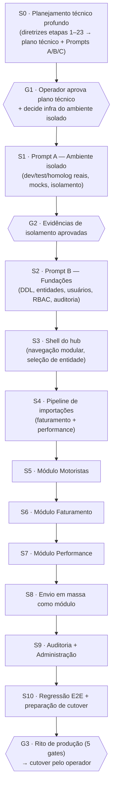

# Plano Mestre — Hub de Módulos de Gestão de Frota (Moveelog)

> **Documento de orquestração** do desenvolvimento autônomo de ponta a ponta.
> Define **como** o trabalho será executado (sessões, skills, gates, economia de token).
> O **conteúdo técnico** (modelo de dados, APIs, arquitetura detalhada) será produzido pela
> Sessão S0 seguindo [`docs/documentos_apoio/diretrizes_customizacao.txt`](../../documentos_apoio/diretrizes_customizacao.txt),
> que é a fonte normativa de escopo e ordem das etapas.

**Status:** proposto · **Data:** 2026-07-04 · **Autor:** Claude (job em background) · **Aprovação pendente:** operador (Paulo)

---

## 1. Visão

O sistema atual (envio em massa + recebimento e validação de notas + gestão de motoristas)
evolui para uma **plataforma modular de gestão de frota**. O envio em massa deixa de ser a
aplicação principal e vira **um módulo** do hub. Módulos iniciais previstos pelas diretrizes:

| Módulo | Origem |
|---|---|
| Autenticação / Usuários / Papéis e Permissões | novo (evolui o login atual) |
| Entidades (matriz/filial/operação) | evolui `Empresa` + grupos (`mesmoGrupoQue`) já existentes |
| Motoristas | evolui a base `Motorista` + telas atuais |
| Faturamento | **novo** — alimentado por importação de CSV |
| Performance | **novo** — alimentado por importação de CSV |
| Importações (pipeline + histórico) | novo (generaliza o `/upload` atual) |
| Envio em massa | **migração do sistema atual para dentro do hub** |
| Auditoria | novo |
| Administração da plataforma | novo |

### Fatos já levantados (reconhecimento 2026-07-04, dados mascarados)

- `Faturamento.zip` → `2026-07-03.csv` (~858 KB, **4.014 linhas/dia**, separador `;`):
  lançamentos financeiros por entregador — `data_do_lancamento_financeiro`,
  `data_do_periodo_de_referencia`, `data_do_repasse`, `periodo`, `praca`, `subpraca`, `origem`,
  `id_da_pessoa_entregadora`, `recebedor`, `tipo`, `valor`, `descricao`, `atingido`,
  `percentual_de_tempo_disponivel`, `percentual_de_aceitacao`, `percentual_de_conclusao`,
  `criterio_*`, `margem_fee_porcentagem`.
- `Performance_.zip` → `2026-07-03.csv` (~494 KB, **2.720 linhas/dia**, separador `;`):
  métricas operacionais por entregador/turno — `data_do_periodo`, `periodo`,
  `duracao_do_periodo`, `numero_minimo_de_entregadores_regulares_na_escala`, `tag`,
  `id_da_pessoa_entregadora`, `pessoa_entregadora`, `praca`, `sub_praca`, `origem`,
  `tempo_disponivel_escalado/absoluto`, `numero_de_corridas_ofertadas/aceitas/rejeitadas/
  completadas/canceladas_pela_pessoa_entregadora`, `numero_de_pedidos_aceitos_e_concluidos`,
  `soma_das_taxas_das_corridas_aceitas`.
- **Chave natural comum**: `id_da_pessoa_entregadora` + praça/subpraça + período → viabiliza o
  modelo unificado motorista ↔ faturamento ↔ performance.
- **Contêm dados pessoais** (nome do entregador, id externo, valores) → LGPD: nunca commitá-los,
  nunca colá-los em contexto de sessão, anonimizar para seeds de teste.
- Stack atual: backend Node 14 (Express + PostgREST sobre `chatmasterveloz`), frontend_v2
  Next.js (node 20-alpine, standalone), Docker Swarm no host `VPSTodo`, Traefik, registry
  `registry.todo-tips.com`.

---

## 2. Restrições invioláveis (herdam de CLAUDE.md e da memória do projeto)

1. **"Homologação" atual É produção.** Os serviços `envio-massa-homologacao_*`, o banco
   `chatmasterveloz` e os domínios `app.moveelog.com.br` / `app.motorista.moveelog.com.br`
   atendem clientes reais. Todo o desenvolvimento do hub ocorre **fora** deles até o cutover.
2. **Cláusula pétrea:** o agente não executa escrita no ambiente vivo. Entrega artefatos
   (código, PRs, DDLs, runbooks); o operador aplica — salvo exceção pontual, auditada e
   consumível concedida por escrito para uma mudança específica (rito dos 5 gates).
3. **Nunca buildar pesado no host VPSTodo sem cap** (incidente de starvation 2026-06-11).
   Builds sob rito: swap 4G temporário + `docker build --memory=2g`; preferir buildar no
   ambiente isolado quando ele existir.
4. As diretrizes exigem: **nenhuma alteração funcional antes do ambiente isolado criado e
   validado por evidências** (checkpoint obrigatório). Este plano respeita essa ordem.
5. DDL sempre idempotente/aditiva; migrations testadas primeiro no ambiente isolado; nunca
   `docker stack deploy`; rollback anotado antes de qualquer `service update`.

---

## 3. Ferramentas do processo (obrigatórias em todas as sessões)

| Skill | Papel no processo |
|---|---|
| **`/context-mode:context-mode`** | Gestão de memória/token em TODAS as sessões. Regras na §5. |
| **`/feature-00c`** | Pipeline SDD autônoma (specify→clarify→plan→checklist→create-tasks→execute-task→review-task) para **cada feature** das fases S2–S9. Estado em `feature-00c-state/<short-name>/`. Retomada com `/feature-00c-resume`. |
| **`/ui-ux-pro-max`** | Design/implementação de todas as páginas novas do hub (shell, dashboards, telas de módulo). Design system EntreGô 2.0 preservado (azul/menta/creme, Plus Jakarta Sans, Tailwind v4 `@theme`). |

Gotchas conhecidos que TODA sessão de implementação deve herdar (estão na memória do projeto,
repetidos aqui para sessões frescas):

- Comentário `{/* */}` logo após `return (` quebra build turbopack — grepar antes de buildar.
- `Select` do painel é **Base UI** (não Radix) → `items` no Root para exibir rótulo.
- Query PostgREST `in.(...)` com muitos valores estoura header → paginar em lotes de 100.
- Coluna de CNPJ difere por tabela (`Empresa.cnpj` vs `cnpj_prestador`/`cnpj_tomador`).
- `mesmoGrupoQue(idEmpresa, 6, cache)` — nunca `id_empresa === 6` estrito.
- Erros da FastAPI de validação: negócio (4xx `detail`) ≠ infra (502) — não mascarar.
- runtime feature-00c: reconcile-wave pode avançar `execute-task→review-task` cedo demais em
  fases multi-tarefa — guardar o ponteiro após cada onda; review-task com modelo pequeno pode
  confabular fechamento — o orquestrador-pai confere.

---

## 4. Roteiro de sessões (espinha dorsal)

Cada sessão é **uma sessão fresca do Claude Code**, iniciada com o prompt pronto da §7.
`G#` são **gates humanos** — o operador aprova antes da sessão seguinte.



### S0 — Planejamento técnico profundo (sem código)

- **Executa integralmente** `diretrizes_customizacao.txt` (etapas 1–23 + 20 entregáveis +
  Prompts A/B/C), na ordem obrigatória do documento.
- Análise dos CSVs **inteira dentro do sandbox context-mode** (`ctx_execute_file` /
  `ctx_execute` python): tipos, chaves, duplicidades, qualidade, volume, relações — só
  estatísticas e exemplos mascarados entram no contexto/relatório.
- Diagnóstico do repo e do Docker por subagentes `Explore` + `ctx_batch_execute` (nunca
  despejar árvores de arquivos no contexto principal).
- **Saída:** `docs/plans/hub-frota/01-plano-tecnico.md` (os 20 entregáveis, com Mermaid ER,
  matriz de mapeamento CSV→tabelas, catálogo de tabelas, APIs) e
  `docs/plans/hub-frota/prompts/prompt-A.md`, `prompt-B.md`, `prompt-C.md` — todos
  autossuficientes, via PR.
- **Proibido:** alterar código, banco, containers, `.env`, stacks (regras de execução 1–32
  das diretrizes).
- **Critério de conclusão:** PR aberto com o plano técnico completo; nenhuma escrita fora de
  `docs/`.

### G1 — Decisão de infraestrutura (operador)

Decisão pendente que **só o operador pode tomar** (custo): onde vive o ambiente isolado.

- **Alternativa A (recomendada pelas diretrizes e por este plano): VPS separada.** Motivos:
  o host VPSTodo já sofreu starvation com build; RAM ~15 GB já disputada; isolamento por
  hardware elimina o risco nº 1 (afetar produção). Uma VPS 4 GB/2 vCPU basta para
  dev+homolog do hub (volumes observados: ~7 mil linhas CSV/dia).
- **Alternativa B (fallback): mesmo host com isolamento Docker completo** — projeto/stack/
  redes/volumes/banco/credenciais/portas/domínio distintos + `limits` de CPU/RAM em todos os
  serviços + regra "nunca buildar imagem neste host" (buildar em outra máquina e dar push).
- **Alternativa C (complementar): ambientes efêmeros** para PRs via compose local — avaliar
  na S0.

### S1 — Prompt A: ambiente isolado (infra, sem mudança funcional)

- Cria dev/test/homolog **reais** (o nome do ambiente atual é histórico): compose por
  ambiente, `APP_ENV` com validação fail-safe (homolog apontando para banco de produção →
  aborta na inicialização), banco exclusivo com credenciais próprias, mocks/allowlist/limite
  para envio em massa, identificação visual de ambiente, backup/restauração/rollback.
- Seeds **anonimizados** derivados dos CSVs (processo repetível e irreversível, gerado no
  sandbox context-mode).
- **Saída:** infra as-code no repo (PR) + runbook + **evidências dos 20 testes de isolamento**
  (etapa 11 das diretrizes) coladas pelo operador se a infra for na VPSTodo, ou executadas
  pelo agente se for em VPS separada (lá não vale a cláusula pétrea, que protege o host de
  produção).
- **Critério de conclusão (G2):** checklist de isolamento 20/20 com evidência por item.

### S2 — Prompt B: fundações (via `/feature-00c`, só no ambiente isolado)

- Feature `hub-fundacoes`: migrations das tabelas fundamentais (entidades, usuários,
  usuários×entidades, papéis, permissões, módulos, auditoria), autenticação (hash seguro,
  sessões, revogação, rate limit por IP+credencial — reaproveitar lição do trust-proxy),
  RBAC com validação **no backend**, associação dos dados existentes (Empresa/grupos →
  entidades) de forma aditiva e reversível.
- Compatibilidade: a aplicação atual continua funcionando intocada em produção; as tabelas
  novas são aditivas no banco do ambiente isolado.

### S3 — Shell do hub (via `/feature-00c` + `/ui-ux-pro-max`)

- Feature `hub-shell`: layout modular do painel — menu principal por módulo controlado por
  permissão, seleção de entidade, perfil/logout, dashboard inicial, badge de ambiente,
  **registro de módulos** (estrutura de navegação data-driven que permite plugar módulos
  futuros sem tocar no shell).
- Design via `/ui-ux-pro-max` sobre o design system EntreGô 2.0 existente (não é re-skin).

### S4 — Pipeline de importações (via `/feature-00c`)

- Feature `hub-importacoes`: fluxo completo da etapa 18 das diretrizes (upload → validação →
  hash/duplicidade → armazenamento do original → processamento em lote com transação →
  linhas válidas/inválidas → resumo → reprocessamento → idempotência → auditoria), com
  status `pending…cancelled`, tela de importações (etapa 19) e os dois parsers concretos
  (faturamento e performance, matriz de mapeamento da S0).
- Volume atual (~4k+2,7k linhas/dia) dispensa fila externa; desenhar interface de
  processamento que permita plugar fila depois (registrar como decisão).

### S5 — Módulo Motoristas (via `/feature-00c`)

- Feature `hub-motoristas`: evolui a base `Motorista` e as telas atuais para o hub —
  unificação com `id_da_pessoa_entregadora` (vínculo motorista ↔ id externo dos CSVs),
  CRUD com permissões, isolamento por entidade, preservando as regras do grupo Movee e o
  app motorista intocado.

### S6 / S7 — Módulos Faturamento e Performance (via `/feature-00c` + `/ui-ux-pro-max`)

- Consultas por entidade/período/praça/motorista, KPIs e visualizações (skill `dataviz` para
  gráficos), exportação. Granularidade e campos calculados conforme matriz da S0.
- S7 reusa os componentes de S6 (tabelas, filtros de período) — a spec de S6 deve extrair
  esses componentes como compartilhados.

### S8 — Envio em massa como módulo (via `/feature-00c`)

- Feature `hub-envio-massa`: incorpora o sistema atual ao shell — rotas sob o layout do hub,
  autenticação/permissões novas, isolamento por entidade, **zero regressão funcional**
  (etapa 19 das diretrizes: preservar funcionalidades, compatibilidade temporária de rotas).
- Maior risco de regressão do roteiro → E2E obrigatório cobrindo upload, movimento,
  validação de nota (1 e lote), app motorista.

### S9 — Auditoria + Administração (via `/feature-00c`)

- Feature `hub-auditoria-admin`: trilha de auditoria (login, importações, alterações,
  envios), telas de administração de usuários/papéis/entidades/módulos.

### S10 — Regressão + preparação de cutover

- Suíte E2E completa no ambiente isolado (etapa 23), teste de migrations em cópia
  anonimizada, runbook de cutover com rollback encadeado, checklist dos 5 gates.
- **G3:** operador executa o cutover em produção pelo rito (o agente entrega o runbook e
  acompanha; não executa — cláusula pétrea).

---

## 5. Protocolo de sessão — economia de token (obrigatório)

Toda sessão (S0–S10) segue este protocolo:

**Abertura**

1. Ler APENAS: `CLAUDE.md` (automático), este plano mestre, o briefing da própria sessão em
   `docs/plans/hub-frota/` e — em retomadas — `ctx_search(sort: "timeline")` para recuperar
   decisões/erros/prompts anteriores **antes de perguntar ao usuário ou reler arquivos**.
2. Não reler o plano técnico inteiro: cada briefing de sessão gerado pela S0 é
   autossuficiente (escopo, proibições, ordem, testes, evidências, critérios de aceite).

**Durante**

3. Pesquisa/diagnóstico: `ctx_batch_execute(commands, queries)` com labels descritivos —
   nunca despejar `find`/`grep`/logs crus no contexto.
4. Análise de arquivos grandes (CSVs, logs, planilhas): `ctx_execute_file`/`ctx_execute` —
   só o derivado (`console.log`/`print`) entra no contexto. **Os CSVs de
   faturamento/performance nunca entram no contexto em bruto** (token + LGPD).
5. Edições de arquivo: sempre `Write`/`Edit` nativos (sandbox não persiste).
6. Investigação ruidosa → subagente (`Explore`); no contexto principal ficam só conclusões.
7. Artefatos (specs, DDL, runbooks) → arquivos no repo; no chat, só caminho + 1 linha.
8. Pipeline `/feature-00c` já gerencia seu próprio estado em `feature-00c-state/` — não
   duplicar esse estado no contexto; em interrupção, retomar com `/feature-00c-resume`.

**Fechamento**

9. Atualizar o **diário da fase**: `docs/plans/hub-frota/DIARIO.md` (apêndice de ~10 linhas
   por sessão: o que fechou, decisões, pendências, ponteiros). É o handoff entre sessões.
10. Commit + push + PR (draft) da fase; 1 PR por fase (empilhar só se inevitável, e então
    re-target antes do merge — lição dos PRs #39–41).
11. Memória persistente: **só ponteiros** (nome da fase, branch, PR, status) — nunca
    conteúdo do plano.

**Orçamento de contexto:** ao passar de ~70% de uso, encerrar a onda atual, atualizar
`DIARIO.md` e o estado do feature-00c, e continuar em sessão fresca com o resume — não
atravessar compaction no meio de uma onda de execução.

---

## 6. Convenções de engenharia

- **Branches:** `feat/hub-<fase>` (ex.: `feat/hub-fundacoes`); planejamento em `docs/…`.
- **PRs:** draft ao final de cada fase; corpo termina com o rodapé padrão do projeto; merge
  só com aprovação do operador (governança do CLAUDE.md).
- **Imagens:** tag por fase (ex.: `:hub-fundacoes`), nunca `latest`; rollback = tag anterior
  anotada antes do update.
- **Migrations:** numeradas e idempotentes em `db/` (convenção atual 0NN), aplicadas primeiro
  no ambiente isolado; produção só via rito no cutover.
- **Testes:** cada feature-00c exige unit + E2E no ambiente isolado antes do review-task
  fechar; evidências anexadas ao PR.

---

## 7. Prompts prontos para iniciar cada sessão

> Colar num Claude Code fresco na raiz do repo. Os prompts das fases S1–S10 serão refinados
> pela S0 (Prompts A/B/C e derivados); os abaixo são as versões de partida.

### S0 — Planejamento técnico

```text
Use /context-mode:context-mode durante toda a sessão para gestão de memória/token.
Leia docs/plans/hub-frota/00-plano-mestre-orquestracao.md (§S0 e §5) e execute
INTEGRALMENTE docs/documentos_apoio/diretrizes_customizacao.txt (etapas 1–23, ordem
obrigatória, 20 entregáveis, Prompts A/B/C). Analise os ZIPs de faturamento e performance
exclusivamente dentro do sandbox do context-mode (nunca cole dados pessoais no contexto ou
no relatório — use exemplos mascarados). Não altere código, banco, containers ou .env.
Saídas: docs/plans/hub-frota/01-plano-tecnico.md + docs/plans/hub-frota/prompts/prompt-{A,B,C}.md
+ briefings autossuficientes por fase (S2–S10) em docs/plans/hub-frota/briefings/.
Ao final: atualize docs/plans/hub-frota/DIARIO.md, commit em branch docs/hub-frota-plano-tecnico,
push e PR draft.
```

### S1 — Ambiente isolado (após G1)

```text
Use /context-mode:context-mode durante toda a sessão. Execute
docs/plans/hub-frota/prompts/prompt-A.md (ambiente isolado) com a decisão de infra do
operador: [VPS SEPARADA | MESMO HOST]. Proibido: qualquer mudança funcional na aplicação e
qualquer escrita no ambiente vivo do cliente (cláusula pétrea — se a infra for na VPSTodo,
entregue comandos/runbook para o operador executar e analise a saída colada).
Critério de saída: evidências dos 20 testes de isolamento. Atualize DIARIO.md, PR draft.
```

### S2–S9 — Features (após G2; uma por sessão, na ordem)

```text
Use /context-mode:context-mode durante toda a sessão. Rode
/feature-00c docs/plans/hub-frota/briefings/<briefing-da-fase>.md
Todo desenvolvimento ocorre SOMENTE no ambiente isolado validado na S1. Para páginas/telas,
o design deve ser feito via /ui-ux-pro-max sobre o design system EntreGô 2.0 existente.
Siga o protocolo da §5 do plano mestre (context-mode para pesquisa/análise, subagentes para
investigação ruidosa, DIARIO.md no fechamento, PR draft por fase). Se o contexto passar de
~70%, feche a onda, salve estado e retome com /feature-00c-resume em sessão fresca.
```

### S10 — Regressão e cutover

```text
Use /context-mode:context-mode durante toda a sessão. Execute o briefing
docs/plans/hub-frota/briefings/s10-regressao-cutover.md: suíte E2E completa no ambiente
isolado, teste de migrations em cópia anonimizada, runbook de cutover com rollback
encadeado e checklist dos 5 gates. O cutover em produção é executado PELO OPERADOR.
```

---

## 8. Backlog priorizado (sem estimativas em horas)

| # | Item | Fase | Tam. | Prioridade | Depende de | Risco |
|---|---|---|---|---|---|---|
| 1 | Plano técnico completo + prompts | S0 | L | P0 | — | baixo |
| 2 | Ambiente isolado + evidências | S1 | L | P0 | G1 | médio (infra) |
| 3 | Fundações: DDL/auth/RBAC/auditoria-base | S2 | XL | P0 | G2 | alto (base de tudo) |
| 4 | Shell do hub (navegação modular) | S3 | M | P0 | S2 | médio |
| 5 | Pipeline de importações + telas | S4 | XL | P1 | S2 | alto (idempotência) |
| 6 | Módulo Motoristas | S5 | M | P1 | S3 | médio |
| 7 | Módulo Faturamento | S6 | M | P1 | S4 | baixo |
| 8 | Módulo Performance | S7 | M | P1 | S4, S6 | baixo |
| 9 | Envio em massa como módulo | S8 | L | P1 | S3 | **alto (regressão)** |
| 10 | Auditoria + Administração | S9 | M | P2 | S2 | baixo |
| 11 | Regressão E2E + runbook cutover | S10 | L | P0 | S2–S9 | alto |
| 12 | Gestão de veículos | futuro | M | P3 | dados justificarem | baixo |

---

## 9. Riscos e decisões pendentes

| Tipo | Item | Mitigação / dono |
|---|---|---|
| Infra | Onde vive o ambiente isolado (custo de VPS) | **Decisão do operador em G1** |
| Infra | Build no VPSTodo → starvation | Buildar fora do host; se inevitável, swap 4G + `--memory=2g` |
| Dados | CSVs contêm dados pessoais (LGPD) | Análise só no sandbox; seeds anonimizados; ZIPs nunca commitados |
| Dados | Formato dos CSVs pode variar entre exportações | Validação de cabeçalho no pipeline + versionamento do layout |
| Migração | Backend legado Node 14 | Evolução incremental (diretrizes proíbem reescrita sem evidência); avaliar upgrade na S0 como decisão separada |
| Migração | Associação Empresa/grupos → entidades | DDL aditiva + backfill idempotente, testado em cópia anonimizada |
| Negócio | Regras do grupo Movee (app motorista) intocáveis | S5/S8 preservam `mesmoGrupoQue` e roteamento FastAPI; E2E cobre |
| Segurança | RBAC substituindo checagens ad-hoc | Autorização SEMPRE no backend; frontend só esconde UI |
| Processo | Pipeline autônoma avança fase cedo (gotcha feature-00c) | Orquestrador-pai confere ponteiro após cada onda |

---

## 10. Critérios de aceite globais

1. Produção do cliente permanece intocada durante S0–S10 (evidência: imagens/serviços/banco
   inalterados fora do cutover).
2. Ambiente isolado com 20/20 testes de isolamento evidenciados antes de qualquer feature.
3. Cada fase: PR + testes verdes + evidências no PR + entrada no `DIARIO.md`.
4. Envio em massa dentro do hub sem regressão (E2E do fluxo atual completo verde).
5. Importações idempotentes: reimportar o mesmo arquivo não duplica dados.
6. Autorização validada no backend em todos os endpoints novos; dados isolados por entidade.
7. Cutover executado pelo operador via rito dos 5 gates, com rollback documentado e testado.
