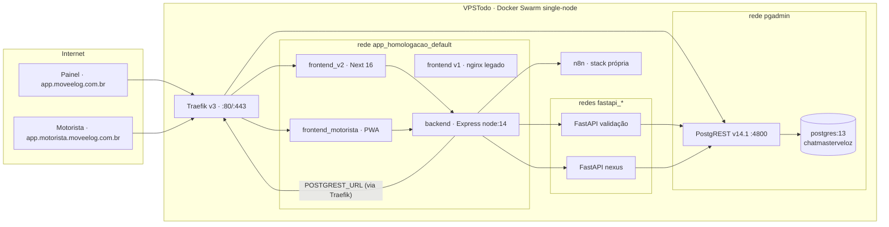
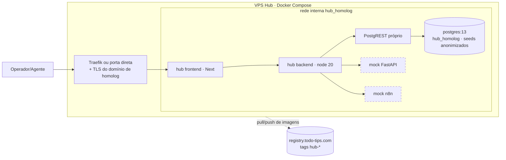
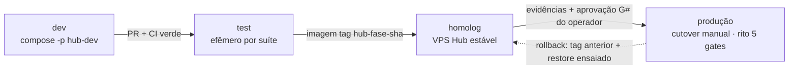
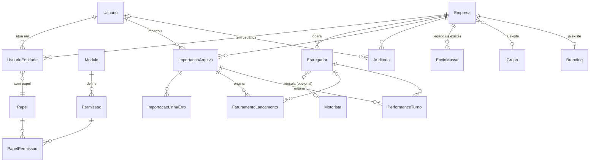

# Plano Técnico — Hub de Gestão de Frota (Sessão S0)

> Produzido pela Sessão S0 conforme
> [`docs/documentos_apoio/diretrizes_customizacao.txt`](../../documentos_apoio/diretrizes_customizacao.txt)
> (etapas 1–23, ordem obrigatória) e
> [`00-plano-mestre-orquestracao.md`](00-plano-mestre-orquestracao.md) (§S0 e §5).
> **Nenhum código, banco, container ou `.env` foi alterado nesta sessão.**
> Dados dos CSVs analisados **exclusivamente no sandbox context-mode**; todos os exemplos
> abaixo estão mascarados (LGPD).

**Status:** proposto · **Data:** 2026-07-05 · **Autor:** Claude (S0) · **Aprovação pendente:** operador (G1)

**Regra terminológica** (plano mestre §2): o ambiente hoje chamado de "homologação"
(`envio-massa-homologacao_*`, banco `chatmasterveloz`, `*.moveelog.com.br`) **É produção**.
Quando este documento fala em "homologação", refere-se **sempre ao novo ambiente isolado**
que será criado na S1 — nunca aos recursos existentes.

### Cobertura das etapas das diretrizes

| Etapa das diretrizes | Seção deste documento |
|---|---|
| 1 Diagnóstico do repositório | §2 |
| 2 Diagnóstico Docker | §3 |
| 3 Plano do ambiente isolado (alternativas) | §4.1–4.3 |
| 4 Regras obrigatórias de isolamento | §4.4 |
| 5 Estrutura Docker recomendada | §4.5 |
| 6 Banco de homologação | §4.6 |
| 7 Prevenção de operações reais | §4.7 |
| 8 Validação de variáveis e segredos | §4.8 |
| 9 Fluxo Git e CI/CD | §4.9 |
| 10 Migrations seguras | §4.10 |
| 11 Testes de isolamento | §4.11 |
| Checkpoint obrigatório | §6.1 |
| 12 Análise dos ZIPs | §7 |
| 13 Arquitetura modular | §8 |
| 14 Entidades, usuários e autenticação | §11 |
| 15 Controle de permissões | §11 |
| 16 Modelo de dados | §9 |
| 17 Mapeamento faturamento/performance | §10 |
| 18 Pipeline de importação | §12 |
| 19 Interface modular | §13 |
| 20 Segurança | §11.6 e §12.5 |
| 21 Performance e escalabilidade | §12.6 |
| 22 Migrations e implantação futura | §15 |
| 23 Testes | §15 e §17 |
| Entregáveis 1–20 | §1–§20 (mesma numeração) |

---

## 1. Resumo executivo

**Estado atual.** Aplicação de envio em massa de pagamentos a entregadores + validação de
NFS-e, em produção no host `VPSTodo` (Docker Swarm single-node, Traefik v3, registry
próprio). Backend Express monolítico (`server.js`, 2.585 linhas) sobre **PostgREST**
(banco `chatmasterveloz`, postgres:13); painel `frontend_v2` (Next.js 16, Tailwind v4,
Base UI, design system EntreGô 2.0) e PWA do motorista (Next.js 16 + serwist).
Multi-tenant real já existe (tabelas `Empresa`/`Grupo`, escopo por `id_grupo`,
white-label por tenant), mas **login é a própria `Empresa`** (não há usuários
individuais), não há RBAC, não há CI/CD e as migrations vivem em **duas séries paralelas
manuais**.

**Estado desejado.** Plataforma modular de gestão de frota ("hub"): autenticação por
usuário, entidades (matriz/filial), papéis e permissões, gestão de motoristas
(entregadores), módulos de **Faturamento** e **Performance** alimentados por importação
idempotente de CSVs diários (~4.000 + ~2.700 linhas/dia), histórico de importações,
auditoria, administração — e o envio em massa atual preservado como **um módulo** do hub.

**Estratégia.** (1) Criar **ambiente isolado real** (dev/test/homolog) **antes de qualquer
mudança funcional** — recomendação: **VPS separada** (§4.3); (2) evoluir incrementalmente
sobre a base existente (auth-cookie, helpers de grupo, design system, pipeline de upload),
sem reescrita; (3) desenvolver S2–S10 exclusivamente no ambiente isolado, com testes e
evidências por fase; (4) cutover único ao final, executado pelo operador sob o rito dos
5 gates, com rollback ensaiado.

**Riscos principais.** Backend Node 14 (EOL); host de produção sem folga (1,4 GiB RAM
livre, disco 85%) — **não** comporta o ambiente isolado com segurança; dados pessoais nos
CSVs (LGPD) exigem seeds anonimizados; regressão do envio em massa no re-embed (S8);
migrations manuais sem runner. Detalhe em §18.

**Recomendação principal.** Aprovar a **Alternativa A (VPS separada)** no gate G1 e
executar o Prompt A (S1) antes de qualquer outra coisa. Nenhuma implementação funcional
antes do checkpoint de isolamento (§6.1) estar 20/20 com evidências.

---

## 2. Diagnóstico do repositório

Fatos levantados por inspeção read-only (subagente Explore, 2026-07-05); `arquivo:linha`
citados onde relevante. **FATO** salvo indicação de inferência.

### 2.1 Stack

| Camada | Tecnologia | Evidência |
|---|---|---|
| Backend | Node.js (imagem `node:14`, EOL) + Express `^4.17.1` | `app_homologacao/backend/Dockerfile`, `package.json` |
| Acesso a dados | **PostgREST via HTTP** (`node-fetch` + JWT `role: authenticated`, exp 30 min) — sem ORM, sem `pg` | `server.js:99–116` |
| Banco | PostgreSQL 13 (`pgadmin_db`), banco `chatmasterveloz` | `docker service inspect` |
| Painel | `frontend_v2`: Next.js 16.2.3, React 19.2.4, TS 5, Tailwind v4, Base UI ^1.3.0 + shadcn, next-themes, sonner | `frontend_v2/package.json` |
| App motorista | `frontend_motorista`: mesmo stack + serwist (PWA) | `frontend_motorista/package.json` |
| Legado | `frontend/` v1 estático (nginx) ainda no ar | compose + Traefik |
| Autenticação | JWT em cookies (access 15 min / refresh 7 d), bcrypt, dummy-hash anti-enumeração, express-rate-limit (por IP+conta no motorista) | `server.js:79–228`, `routes/motorista.js:198` |
| Uploads | multer (XLSX movimento; XML em lote 2 MB/arquivo, máx. 100) | `server.js:33–42` |
| Integrações | FastAPI de validação NFS-e (não-nexus/nexus), n8n (processamento/mensagens) | `server.js:2372–2380`, `N8N_API_TOKEN` |

### 2.2 Estrutura e funcionamento

- `app_homologacao/backend` — API Express; rotas parcialmente modularizadas
  (`routes/motorista.js`, `grupo.js`, `branding.js`, `admin-motorista.js`), restante no
  `server.js` monolítico.
- **Envio em massa** (fluxo atual): `POST /upload` (XLSX → linhas em `EnvioMassa`;
  se grupo Movee, cura a base `Motorista` via `upsertMotoristasFromLote`, `server.js:1318/1561/1796`)
  → `POST /start-process` (n8n) → `GET /process-status` → validação NFS-e
  (`POST /validate-xml-batch` em lote; `POST /validar-nota` unitário no app motorista)
  → `POST /close-movimento`. Roteamento FastAPI por `mesmoGrupoQue(idEmpresa, 6)`:
  grupo Movee → não-nexus; demais → nexus.
- **Multi-tenant atual:** `Empresa` (login; Movee = id 6) + `Grupo` + `Empresa.id_grupo`;
  `resolveScope`/`resolveEmpresaAlvo`/`mesmoGrupoQue` (`routes/grupo.js`) são o critério
  canônico de escopo; `login_unico_ativo` por grupo; white-label via tabela `Branding` +
  `tenant-theme-context`.
- **Pontos de entrada:** Traefik → `app.moveelog.com.br` (painel), `app.motorista.moveelog.com.br`
  (PWA), `envmassapihomologacao.todo-tips.com` (API), + hosts legados `*.todo-tips.com`.

### 2.3 Débitos técnicos (fatos)

1. **Node 14 EOL** no backend.
2. `server.js` com 2.585 linhas (auth + upload + XLSX/XML + integrações + export juntos).
3. **Duas séries de migrations manuais com números colidindo**: `app_homologacao/backend/db/`
   (001–010, com lacunas 004–007) e `docs/sql/` (001–007). Sem runner; aplicação manual +
   `SIGUSR1` no PostgREST.
4. **Sem CI/CD** (`.github/workflows/` inexistente); lint só nos frontends.
5. URLs das FastAPI **hardcoded** no código (não parametrizadas por env).
6. Regra de tenant "Movee id=6" espalhada (mitigada por `mesmoGrupoQue`, exige disciplina).
7. Frontend v1 legado ainda em produção.
8. `npm test` roda só 2 dos 8 arquivos de teste do backend (cobertura de script parcial).
9. Proxy Next com logs `[proxy-debug]` de prefixo de cookie (revisar em hardening).

### 2.4 Componentes reutilizáveis para o hub

| Componente | Reúso no hub |
|---|---|
| Auth JWT-cookie + bcrypt + refresh + rate-limit | Base do módulo Auth (S2) — estende para `Usuario` |
| `resolveScope`/`mesmoGrupoQue`/`resolveEmpresaAlvo` + `Empresa`/`Grupo` | Base do módulo Entidades e do isolamento por entidade |
| Design system EntreGô 2.0 (`components/ui/*`, brand, tenant-theme) | Shell do hub e todas as telas novas (S3+) |
| Proxy genérico `app/api/[...path]/route.ts` | Reusado como está em todos os módulos |
| `POST /upload` + `upsertMotoristasFromLote` + `import-button`/`process-controls` | Semente do pipeline de importações (S4 generaliza) |
| Integração FastAPI (roteamento + negócio-vs-infra) | Serviço de validação do módulo envio em massa |
| `data-table`, `filters`, `pagination-controls`, `stats-cards`, dialogs | Telas de Motoristas/Faturamento/Performance |

### 2.5 Riscos para a evolução

- Regressão do envio em massa ao re-embutir no hub (fluxo crítico do cliente) — mitigação: S8 com E2E completo do fluxo atual.
- Acoplamento ao PostgREST (GRANTs implícitos — o 42501 da migration `003-...-grants.sql` é o precedente).
- Migração do modelo "login = Empresa" para "usuários por entidade" sem quebrar o legado (estratégia em §11.5).

---

## 3. Diagnóstico Docker

Levantado por subagente com comandos **somente de leitura**; segredos nunca exibidos
(apenas nomes de variáveis). **FATO** salvo indicação.

### 3.1 Orquestração

- **Docker Swarm** single-node (`VPSTodo`, manager/leader, engine 29.2.1). **Portainer** presente.
- **Traefik v3.5.3** é o único serviço com portas no host (**80/443**, modo host);
  provider Swarm (`exposedbydefault=false`), ACME HTTP-01 (`letsencryptresolver`),
  certificados no volume `volume_swarm_certificates`. Log level DEBUG (atenção: verboso).

### 3.2 Serviços da aplicação (todos 1/1)

| Serviço | Imagem:tag | Rede |
|---|---|---|
| `envio-massa-homologacao_backend_homologacao` | `envio-massa-backend:upload-motorista-paginacao` | `app_homologacao_default` |
| `envio-massa-homologacao_frontend_v2_homologacao` | `envio-massa-frontend-v2:motoristas-filtros` | `app_homologacao_default` |
| `envio-massa-homologacao_frontend_motorista_homologacao` | `app-motorista-frontend:login-429-trustproxy` | `app_homologacao_default` |
| `envio-massa-homologacao_frontend_homologacao` (v1) | `envio-massa-frontend:homologacao` (nginx) | `app_homologacao_default` |
| `fast-api-homologacao_fastapi_homologacao_app` | `fast-api-homologacao:1.0.0` | `fastapi_homologacao` |
| `fast-api-homologacao-nexus_*_nexus_app` | `fast-api-homologacao-nexus:1.0.0` | `fastapi_homologacao_nexus` |
| `pgadmin_db` | `postgres:13` | `pgadmin` |
| `pgadmin_postgrest` | `postgrest/postgrest:v14.1` | `pgadmin` |
| `pgadmin_pgadmin` | `dpage/pgadmin4:9.12` | `pgadmin` |

Terceiros no mesmo host (fora do escopo, não tocar): `fia_*`, `n8n_*`, `sdr-whatsapp_*`,
`metanoia-*` (containers standalone, portas 8093/8094), `infra-registry_registry`,
`postgres_postgres` (postgres:14 — **não** é o banco da app; inferência: outro uso/legado).

### 3.3 Banco, redes e dependências

- Banco da app: `chatmasterveloz` em `pgadmin_db` (postgres:13), volume `pgadmin_pg_data`.
  Acesso da app **via PostgREST** (porta interna 4800, exposto por Traefik em
  `postgrest.todo-tips.com`); backend e FastAPIs usam `POSTGREST_URL` + `POSTGREST_API_KEY`.
- **Não há rede overlay comum entre backend (`app_homologacao_default`) e
  PostgREST/banco (`pgadmin`)** — o Traefik participa das 6 redes e é o ponto de costura.
  *Inferência a confirmar na S1:* `POSTGREST_URL` aponta para a URL pública via Traefik.
  Consequência para o ambiente isolado: replicar essa rota **ou** (melhor) colocar
  backend+PostgREST na mesma rede interna, sem depender de DNS público.
- FastAPIs rodam com **bind mounts do host** (`/var/lib/fastapi_homologacao*/app`,
  `credentials.json`) — código vem do host, não só da imagem; isso terá de ser replicado
  (ou versionado) no ambiente isolado.
- Backend/frontends **sem volumes** (uploads multer são efêmeros no container) e **sem
  healthchecks** (Swarm só detecta crash de processo); restart `condition=any` (app) /
  `on-failure` (fastapi/db).

### 3.4 Build/deploy e env

- Deploy vigente: `docker build` → `docker push registry.todo-tips.com/...` →
  `docker service update --with-registry-auth --image <tag> <serviço>`. **Nunca**
  `docker stack deploy` (o compose do repo é histórico e divergente; um deploy por ele
  apagaria env/labels).
- Segredos vivem **inline no runtime dos serviços** (não há Docker secrets).
  Nomes (valores mascarados): backend — `NODE_ENV`, `POSTGREST_URL`, `POSTGREST_API_KEY`,
  `JWT_SECRET`, `JWT_REFRESH_SECRET`, `N8N_API_TOKEN`, `FASTAPI_VALIDATION_TOKEN`,
  `GRUPO_PROPRIETARIO`; frontends — `BACKEND_URL`; PostgREST — `PGRST_*`; FastAPI —
  `POSTGREST_URL/API_KEY`, `GOOGLE_APPLICATION_CREDENTIALS` (+ `NEXUS_URL` no nexus).
- `frontend_v2/Dockerfile` tem `ENV BACKEND_URL` **hardcoded** para a API de produção —
  conferir/parametrizar antes de buildar para o ambiente isolado.

### 3.5 Recursos do host (por que não desenvolver aqui)

- RAM 15 GiB (7,6 usado; **~1,4 livre**), swap 8 GiB (2 em uso), 8 vCPU, disco `/` 150 GB
  com **85% usado (23 GB livres)**. Incidente documentado de starvation do Swarm ao rodar
  `next build` no host (mitigação atual: swap temporário + `--memory=2g`).
- Portas publicadas no host: só 80/443 (Traefik) + 8093/8094 (metanoia). Um ambiente
  isolado no mesmo host teria portas livres, mas competiria por RAM/disco escassos.

---

## 4. Plano do ambiente isolado

### 4.1 Alternativa A — VPS separada (recomendada)

| Critério | Avaliação |
|---|---|
| Isolamento | Máximo: falha humana ou técnica não alcança produção (hosts distintos) |
| Segurança | Cláusula pétrea preservada por construção; o agente pode operar livremente na VPS nova (a cláusula protege o host de produção) — acelera S1–S10 |
| Custo | 1 VPS ~4 vCPU / 8 GB RAM / 80 GB (build Next precisa de ~4 GB; folga para Postgres+stack) |
| Manutenção | Baixa: mesma família de SO/Docker; sem Swarm obrigatório (compose basta) |
| Semelhança com produção | Alta no que importa (mesmas imagens, postgres:13, PostgREST v14.1, Traefik opcional) |
| Complexidade | Provisionar VPS + DNS de homolog (subdomínio dedicado) |
| Riscos | Deriva de configuração vs. produção — mitigada por infra-as-code no repo (S1) |

### 4.2 Alternativa B — mesmo host com isolamento Docker (contingência)

Exigências mínimas se G1 optar por ela: projeto/stack `hub-dev` distinto; serviços,
containers, redes (`hub_dev_net`), volumes (`hub_dev_pg_data`), banco (`hub_dev`),
usuário/senha de banco, portas, domínio, `.env` e credenciais **todos próprios**;
`--memory`/`--cpus` capados (lição do incidente de starvation); logs separados.
**Contras decisivos:** ~1,4 GiB RAM livre e disco 85% (§3.5); builds Next proibitivos;
cláusula pétrea impede o agente de executar — todo comando passaria pelo operador
(latência enorme em S2–S10); blast radius humano. **Não recomendada.**

### 4.3 Alternativa C — ambiente efêmero (complementar)

Adotar **dentro** da VPS da Alternativa A: projeto compose descartável por execução de
suíte (`docker compose -p hub-test-<runid> ... up -d; ... down -v`) para testes de
integração/E2E e validação de migrations em banco limpo. Não substitui a homolog estável.

**Recomendação final: A (VPS separada), com C dentro dela.** B só como contingência
explícita do operador, com as exigências acima registradas como risco.

### 4.4 Regras obrigatórias de isolamento (etapa 4)

O ambiente isolado **não compartilha com produção**: banco, schema, usuário/senha de
banco, volumes (banco e uploads), diretórios de arquivos, cache, filas, sessões, tokens,
chaves (`JWT_SECRET`/`JWT_REFRESH_SECRET`/`POSTGREST_API_KEY`/`PGRST_JWT_SECRET` **novos**),
credenciais, webhooks, buckets, domínio, redes internas, arquivos `.env`, logs e backups.

Recursos externos que poderiam tentar compartilhamento — decisão para cada um:

| Recurso | Compartilhar? | Tratamento |
|---|---|---|
| FastAPI validação NFS-e | **Não** | Mock/stub local (§4.7); consulta real de NFS-e é operação externa real |
| n8n (mensagens) | **Não** | Mock HTTP local; `N8N_API_TOKEN` de produção nunca copiado |
| Registry `registry.todo-tips.com` | **Sim (leitura/push de tags `hub-*`)** | Único compartilhamento aceito: imagens são artefatos imutáveis; tags do hub têm prefixo próprio; risco registrado: nunca dar push em tags usadas pela produção |
| Google credentials (FastAPI) | **Não** | Mock dispensa credencial |
| DNS/domínio | **Não** | Subdomínio dedicado de homolog (decisão G1), jamais `*.moveelog.com.br` |

### 4.5 Estrutura Docker recomendada (etapa 5)

Estrutura-alvo no repo (S1 cria; nomes seguem a convenção existente do repo):

```text
app_homologacao/
  backend/Dockerfile          (existente — produção)
  backend/Dockerfile.hub      (novo: node 20 LTS — ver §15 nota Node)
  ...
infra/hub/
  compose.hub.dev.yml         (dev: app + db + postgrest + mocks)
  compose.hub.test.yml        (test: efêmero, tmpfs, -p hub-test-<runid>)
  compose.hub.homolog.yml     (homolog estável na VPS)
  .env.hub.dev.example        (sem segredos, com placeholders)
  .env.hub.test.example
  .env.hub.homolog.example
  mocks/                      (fastapi-mock, n8n-mock: servidores HTTP mínimos)
  scripts/preflight.sh        (validação pré-up: §4.8)
```

1. **Compartilhado:** Dockerfiles de app (mesma imagem em test/homolog; dev pode usar target dev).
2. **Por ambiente:** um compose + um `.env` por ambiente; nada de override implícito.
3. **Sem duplicação:** âncoras YAML/`extends` para serviços comuns; diferenças só em env/portas/volumes.
4. **Identificação do ambiente:** `APP_ENV` obrigatório em todos os serviços (§4.8) + label `com.moveelog.env`.
5. **Projetos:** `-p hub-dev` / `-p hub-test-<runid>` / `-p hub-homolog` — nunca o projeto default.
6. **Containers/volumes/redes:** prefixo do projeto já garante `hub_dev_*`, `hub_homolog_*` etc.
7. **Imagens:** `registry.todo-tips.com/hub-backend:<fase>-<sha>` — tag imutável por fase+commit.
8. **Proibir `latest`:** preflight falha se alguma imagem do compose não tiver tag explícita ≠ latest.
9. **Validação pré-up:** `docker compose -f <arquivo> -p <projeto> --env-file <env> config` no preflight + checagens da §4.8.
10. **Comando canônico (sempre explícito, nunca genérico):**
    `docker compose -f infra/hub/compose.hub.homolog.yml -p hub-homolog --env-file .env.hub.homolog up -d`
11. **Homolog não afeta produção por construção:** hosts distintos (Alternativa A); e mesmo em B, projeto/portas/redes/volumes próprios + preflight que aborta se detectar recurso de produção (§4.8).

### 4.6 Banco de homologação (etapa 6)

| Item | Definição |
|---|---|
| Imagem | `postgres:13` (paridade com produção para fidelidade de migrations; upgrade de PG é decisão separada pós-cutover — §18) |
| Banco / usuário | `hub_homolog` / `hub_homolog` (dev: `hub_dev`; test: `hub_test` efêmero) |
| Senha | Exclusiva, gerada na S1, só no `.env` da VPS (fora do git) |
| Host/porta | Serviço `db` na rede interna do projeto; porta **não publicada** (acesso via `docker compose exec`) |
| Volume | `hub_homolog_pg_data` (test: tmpfs/anonimo com `down -v`) |
| PostgREST | `postgrest/postgrest:v14.1` próprio, `PGRST_JWT_SECRET` novo, na mesma rede interna (corrige o acoplamento via URL pública de produção) |
| Backup/restauração | `pg_dump -Fc` diário via cron na VPS + teste de `pg_restore` mensal; script versionado |
| Migrations | Série única (§9.6) aplicadas por script idempotente + `SIGUSR1` no PostgREST |
| Seeds | **Sintéticos + anonimizados** (abaixo); jamais dump bruto de produção |
| Reset | `compose down -v && up && migrate && seed` documentado no runbook |
| Versão do schema | Tabela `SchemaMigration` (id, nome, aplicado_em) — parte da série única |

**Anonimização (obrigatória, irreversível, repetível):** gerador versionado
(`infra/hub/scripts/gen-seeds.py`) que roda **no sandbox context-mode** sobre os CSVs
reais e emite seeds com: nomes → fake determinístico; UUIDs externos → UUIDs novos
(mapa via HMAC com salt **descartado** após a geração — irreversível); valores
financeiros → perturbação ±20%; CNPJs → válidos porém fictícios; praças/subpraças/períodos
mantidos (não são dados pessoais). Auditável (código no repo), testável (asserções de
não-vazamento: nenhum nome/UUID original presente na saída).

### 4.7 Prevenção de operações reais (etapa 7)

Integrações com efeito real e estratégia por integração:

| Integração | Efeito real | Estratégia no ambiente isolado |
|---|---|---|
| n8n (disparo de mensagens do envio em massa) | Mensagens reais a entregadores | **Mock HTTP** (`mocks/n8n-mock`) que registra payloads e responde sucesso; token de produção ausente |
| FastAPI validação NFS-e (não-nexus e nexus) | Consulta real de notas | **Stub** (`mocks/fastapi-mock`) com respostas canônicas (válida / inválida / erro de negócio / timeout) para exercitar o tratamento negócio-vs-infra |
| PostgREST | — (interno) | Instância própria (§4.6) |
| E-mail/SMS | n/a hoje | Se surgir no hub (recuperação de senha), usar mailpit local |
| Webhooks externos | n/a observado | Preflight bloqueia URLs de produção em env não produtivo |

**Proteções obrigatórias do envio em massa em homolog (10/10):**
1. Modo simulação (`ENVIO_DRY_RUN=true` default em todo `APP_ENV != production`);
2. provider mock (acima); 3. feature flag `ENVIO_REAL_HABILITADO=false`;
4. allowlist de destinatários (`ENVIO_ALLOWLIST`, vazia = bloqueia tudo);
5. limite máximo por lote (`ENVIO_MAX_MENSAGENS`, ex. 10);
6. bloqueio + 7. registro em `Auditoria` de tentativas fora da allowlist;
8. identificação visual do ambiente (banner §13.2); 9. confirmação adicional na UI antes
de qualquer disparo; 10. credenciais de produção ausentes por construção (env exclusivo +
preflight).

### 4.8 Validação de variáveis e segredos (etapa 8)

- `.env.hub.<env>.example` **sem segredos** no git; reais só na VPS (`chmod 600`), rotação
  documentada no runbook.
- `APP_ENV ∈ {development, test, homologation, production}` obrigatório.
- **Fail-safe na inicialização do backend** (e no `preflight.sh`) — aborta se:
  - `APP_ENV != production` **e** `POSTGREST_URL` contém `postgrest.todo-tips.com` (ou o host do banco de produção);
  - `APP_ENV != production` **e** `BACKEND_URL`/domínio contém `moveelog.com.br`;
  - `APP_ENV != production` **e** qualquer um de `N8N_API_TOKEN`/`FASTAPI_VALIDATION_TOKEN` igual ao fingerprint de produção (comparação por hash registrado, nunca pelo valor);
  - `APP_ENV != production` **e** algum volume/bind aponta para caminho de produção (`/var/lib/fastapi_homologacao*`, volume `pgadmin_pg_data`);
  - `APP_ENV = production` **e** `ENVIO_DRY_RUN=true` ou credenciais com sufixo `-dev` (proteção inversa);
  - `APP_ENV` ausente.

### 4.9 Fluxo Git e CI/CD (etapa 9)

Projeto de porte pequeno/médio, um operador: **manter trunk-based simples** (como hoje):
`main` protegida + branches `feat/hub-<fase>` + PR com revisão (`/code-review`) + merge
pelo operador. Sem branch develop (complexidade desnecessária).

Pipeline (GitHub Actions, novo — hoje não existe CI) em dois workflows:

1. **`ci.yml` (por PR):** install → lint (backend ganha ESLint na S2) → typecheck
   (frontends) → testes unitários (`node --test`, TODOS os arquivos) → testes de
   integração/banco em compose efêmero (Alternativa C) → build → build de imagem →
   `docker compose config` dos composes do hub → scan de vulnerabilidade (trivy) →
   E2E headless contra o compose efêmero → health checks.
2. **`deploy-homolog.yml` (manual/por tag):** push da imagem → deploy na VPS homolog
   (ssh + compose canônico) → smoke pós-deploy.

**Produção nunca entra no pipeline**: cutover é manual, pelo operador, sob o rito dos
5 gates (aprovação explícita, rollback à mão). Hotfix: branch de `main` + mesmo caminho.

### 4.10 Migrations seguras (etapa 10)

Toda migration do hub, antes de qualquer aplicação em produção (cutover):
1. aplica em **banco vazio** (compose test); 2. aplica em **banco com dados** (homolog);
3. aplica em **cópia anonimizada** (S10); 4. validação de integridade (contagens, FKs);
5. avaliação de locks (DDL aditiva; `CREATE INDEX CONCURRENTLY` quando em tabela grande);
6. avaliação de downtime (metas: zero — só DDL aditiva até o cutover);
7. compatibilidade N/N+1 (app antiga convive com schema novo — colunas novas nullable/default);
8. backup (`pg_dump -Fc`) antes; 9. restauração ensaiada; 10. rollback documentado por
migration (down ou compensação); 11. migration corretiva preferível a editar aplicada;
12. expand-and-contract para qualquer mudança em tabela usada pelo legado (`EnvioMassa`,
`Motorista`, `Empresa`): expand (S2–S9) → migrate dados → contract (pós-cutover, fase futura).

### 4.11 Testes de isolamento (etapa 11) — os 20, com comando e evidência esperada

Executáveis na S1 (nenhum é destrutivo). Na Alternativa A, os itens 1–2 e 19 são
verificados por construção (hosts distintos) + conferência de env.

| # | Comprovação | Comando (na VPS homolog, salvo indicado) | Evidência esperada |
|---|---|---|---|
| 1 | Banco de produção intocado | Operador no VPSTodo: `docker service ps pgadmin_db --format '{{.Name}} {{.CurrentState}}'` + `SELECT max(id) FROM "EnvioMassa"` antes/depois da S1 | Estado/contagens idênticos |
| 2 | Volumes de produção não montados | `docker inspect $(docker ps -q) --format '{{.Name}} {{json .Mounts}}' \| grep -c pgadmin_pg_data` | `0` |
| 3 | Redes separadas | `docker network ls` na VPS | Só redes `hub_*` (+default) |
| 4 | Containers com nomes distintos | `docker ps --format '{{.Names}}'` | Todos `hub_homolog_*` |
| 5 | Projetos/stacks distintos | `docker compose ls` | `hub-homolog` (nunca `envio-massa-homologacao`) |
| 6 | Credenciais diferentes | diff de **hashes** dos segredos (nunca valores): `sha256sum <(echo $JWT_SECRET)` vs fingerprint de produção fornecido pelo operador | Hashes distintos |
| 7 | Portas sem conflito | `ss -tlnp` na VPS | Sem colisão; host de produção inalterado |
| 8 | Domínio diferente | `curl -sI https://<dominio-homolog>/login` | 200 no domínio novo; `app.moveelog.com.br` continua servido pelo host antigo (dig) |
| 9 | Logs separados | `docker compose -p hub-homolog logs --tail 5` | Só serviços do hub |
| 10 | Arquivos separados | inspect dos mounts dos serviços hub | Só volumes `hub_*` |
| 11 | Filas não compartilhadas | n/a (não há fila externa) — evidência: compose sem broker; mock n8n local | Config |
| 12 | Cache não compartilhado | idem (sem redis na app) | Config |
| 13 | Sessões não compartilhadas | login em homolog não vale em produção (cookie de domínio distinto + `JWT_SECRET` distinto): decodificar cookie de homolog com secret de prod falha | Verificação assinada pelo operador |
| 14 | Webhooks não apontam para produção | `grep -R 'moveelog\|todo-tips' infra/hub/.env.hub.homolog` (rodado pelo operador; sem exibir valores) | Nenhuma URL de produção (exceto registry, decisão §4.4) |
| 15 | Nenhuma mensagem real | disparo de envio em homolog → mock n8n loga, nada sai | Log do mock com o payload |
| 16 | Nenhum dado real modificado | item 1 + banco homolog contém apenas seeds anonimizados (`SELECT count(*)`) | Contagens de seed |
| 17 | Migrations só em homolog | `SELECT * FROM "SchemaMigration"` em homolog vs consulta equivalente em produção (operador) | Tabela nem existe em produção |
| 18 | Identificação visual | screenshot do banner de ambiente (§13.2) | Banner "HOMOLOGAÇÃO" |
| 19 | Homolog não alcança produção | do host homolog: `psql "host=<ip-prod> port=5432" …` → recusa/timeout (porta nem publicada) + preflight passa | Conexão impossível |
| 20 | Backup/restauração funciona | `pg_dump -Fc hub_homolog > b.dump && createdb hub_restore && pg_restore -d hub_restore b.dump && diff contagens` | Contagens iguais |

---

## 5. Diagramas de infraestrutura

### 5.1 Infra atual (produção — VPSTodo)



### 5.2 Infra proposta (ambiente isolado — VPS separada)



Produção permanece exatamente como na §5.1, intocada até o cutover (G3).

### 5.3 Fluxo de promoção entre ambientes



---

## 6. Matriz dos ambientes

| Dimensão | development | test | homologation | production (existente) |
|---|---|---|---|---|
| Finalidade | Iteração diária | Suítes automatizadas | Validação estável/E2E/aceite | Clientes reais |
| Onde | VPS Hub | VPS Hub (efêmero) | VPS Hub | VPSTodo (Swarm) |
| Código/branch | branch da fase | branch do PR | `main` pós-merge | `main` + tag da fase (cutover) |
| Imagem/tag | build local `hub-*-dev` | `hub-<fase>-<sha>` | `hub-<fase>-<sha>` | tags atuais (`:motoristas-filtros` etc.) |
| Banco | `hub_dev` | `hub_test` (tmpfs, `down -v`) | `hub_homolog` | `chatmasterveloz` |
| Usuário do banco | `hub_dev` | `hub_test` | `hub_homolog` | (o de produção — jamais copiado) |
| Volumes | `hub_dev_*` | anônimos/tmpfs | `hub_homolog_*` | `pgadmin_pg_data` etc. |
| Redes | `hub_dev_net` | por projeto efêmero | `hub_homolog_net` | overlays atuais |
| Portas | altas, só localhost | dinâmicas | 80/443 da VPS Hub | 80/443 VPSTodo |
| Domínio | `localhost` | n/a | subdomínio de homolog (G1) | `*.moveelog.com.br` |
| Credenciais | próprias fracas | descartáveis | próprias fortes | de produção (intocadas) |
| Integrações | mocks | mocks | mocks (sempre) | reais |
| Atualização | contínua | por execução | por fase (deploy manual/CI) | só no cutover (rito) |
| Reset | livre | automático | documentado (runbook) | **proibido** |
| Backup | não | não | diário + restore testado | responsabilidade do operador |
| Acesso | agente+operador | CI | agente+operador | **só operador** (cláusula pétrea) |
| `APP_ENV` | `development` | `test` | `homologation` | `production` |

### 6.1 ✅ Checkpoint obrigatório antes do planejamento funcional

O planejamento funcional (§7 em diante) só é executável (S2+) depois que a S1 entregar,
com evidência: estratégia de isolamento aplicada (§4.3); banco exclusivo (§4.6); volumes,
redes e credenciais exclusivos (§4.4); arquivos de configuração exclusivos (§4.5);
proteção contra integrações reais (§4.7); backup + restauração + rollback (§4.6, §4.10);
**20/20 testes de isolamento** (§4.11); critérios de aceite do ambiente (§17.1).
**Gate G2 = este checkpoint aprovado pelo operador.** Este documento respeita a ordem: as
seções seguintes são *planejamento*, não implementação.

---

## 7. Diagnóstico dos ZIPs (faturamento e performance)

Análise integral no sandbox context-mode (python/stdlib), 2026-07-05. Arquivos de
2026-07-03 (1 dia). **Exemplos mascarados**; nenhum dado pessoal neste documento.

### 7.1 Conteúdo e formato

| ZIP | Arquivo interno | Formato | Linhas | Colunas | Encoding | Separador | Decimal |
|---|---|---|---|---|---|---|---|
| `Faturamento.zip` | `2026-07-03.csv` | CSV | 4.014 | 20 | UTF-8 com BOM | `;` | vírgula (`25,19`) |
| `Performance_.zip` | `2026-07-03.csv` | CSV | 2.720 | 19 | UTF-8 com BOM | `;` | ponto (`44.82`) |

Sem abas (não é XLSX); 0 linhas malformadas nos dois; sem aspas problemáticas.
*Atenção: os dois arquivos usam separador decimal **diferente** — o parser não pode ser único.*

### 7.2 Faturamento — colunas, tipos e semântica observada

Granularidade: **1 linha = 1 lançamento financeiro** (crédito) de um entregador (ou de um
agregado) num dia de referência.

| Coluna | Tipo observado | Nulos | Observações (valores analisados, não só nomes) |
|---|---|---|---|
| `data_do_lancamento_financeiro` | date ISO | 0% | 1 valor no arquivo (o dia do arquivo) |
| `data_do_periodo_de_referencia` | date ISO | 0% | D e D-1 (competência) |
| `data_do_repasse` | date ISO | 0% | D+5 (data futura de pagamento) |
| `periodo` | texto (17 turnos) | 5,3% | Ex.: `ALMOCO 11H30-15H29`, `JANTAR CPS 18H30-21H29` |
| `praca` | texto (7) | 5,2% | `SAO PAULO` + variantes `SAO PAULO - <ZONA> (ZONA)` — **hierarquia embutida no texto** |
| `subpraca` | texto (9) | 20,4% | Regiões de SP |
| `origem` | texto (9) | **96,5%** | Nome de estabelecimento/hub; quase sempre vazio |
| `id_da_pessoa_entregadora` | **UUID v4** | **4,5%** | 691 distintos; ex. mascarado: `d9752e…` |
| `recebedor` | texto | 0% | Nome de pessoa (ex. mascarado: `F*** S***`); 692 distintos — 1:1 com o UUID quando presente |
| `tipo` | texto | 0% | Só `Credito` neste arquivo (débitos podem existir em outros dias — **inferência a confirmar** com mais arquivos) |
| `valor` | decimal vírgula | 0% | 0,01–2.308,35; média 25,19; sem negativos |
| `descricao` | texto (10 categorias) | 0% | Ver §7.4 |
| `atingido` | decimal | **97,4%** | Só em linhas de bônus |
| `percentual_de_tempo_disponivel` | decimal | 97,4% | idem |
| `percentual_de_aceitacao` | decimal | 97,4% | idem |
| `percentual_de_conclusao` | decimal | 97,4% | idem |
| `criterio_tempo_disponivel` | decimal | 97,4% | Metas (ex. 80,0) |
| `criterio_rotas_aceitas` | decimal | 97,4% | Metas (ex. 90,0) |
| `criterio_rotas_concluidas` | decimal | 97,4% | Metas (ex. 95,0) |
| `margem_fee_porcentagem` | **texto estruturado** | 97,4% | Ex.: `MIN: 30.0, INTER: 33` — precisa parse próprio |

### 7.3 Performance — colunas, tipos e semântica observada

Granularidade: **1 linha = métricas de 1 entregador em 1 turno** de 1 dia (por subpraça).

| Coluna | Tipo observado | Nulos | Observações |
|---|---|---|---|
| `data_do_periodo` | date ISO | 0% | 1 valor (o dia) |
| `periodo` | texto (16 turnos) | 0% | Mesmo domínio do faturamento (15 em comum) |
| `duracao_do_periodo` | `HH:MM:SS` | 0% | 10 valores (2h29–3h59) |
| `numero_minimo_de_entregadores_regulares_na_escala` | int | 0% | 1–429 — atributo do turno/subpraça, **não** do entregador (desnormalizado) |
| `tag` | texto | 0% | Só `REGULAR` neste arquivo |
| `id_da_pessoa_entregadora` | UUID v4 | **0%** | 755 distintos |
| `pessoa_entregadora` | texto | 0% | Nome completo (mascarado: `E*** d*** S***`) |
| `praca` | texto | 0% | Só `SAO PAULO` (sem as variantes "(ZONA)" do faturamento) |
| `sub_praca` | texto (12) | 18,6% | 9 em comum com faturamento + 2 exclusivas (`… (MINI BTU FD)`) |
| `origem` | texto (8) | **98,7%** | Estabelecimento/hub |
| `tempo_disponivel_escalado` | decimal ponto | 0% | 0–100,14 → **percentual** (15 linhas >100) |
| `tempo_disponivel_absoluto` | `HH:MM:SS` | 0% | 100% no formato hora |
| `numero_de_corridas_ofertadas/aceitas/rejeitadas/completadas/canceladas_pela_pessoa_entregadora` | int | 0% | Consistência: `aceitas+rejeitadas ≤ ofertadas` em 100%; `completadas ≤ aceitas` em 100% |
| `numero_de_pedidos_aceitos_e_concluidos` | int | 0% | > corridas_completadas em 535 linhas → **vários pedidos por corrida** (fato) |
| `soma_das_taxas_das_corridas_aceitas` | int | 0% | **Centavos** (máx. 13.254 → R$ 132,54 plausível vs. média de valor no faturamento) — *inferência forte; confirmar com o cliente* |

### 7.4 Categorias de lançamento (faturamento) — agregados do dia

| `descricao` | n | Soma (R$) | Natureza |
|---|---|---|---|
| Corridas concluidas | 1.558 | 61.960,69 | Transacional por entregador |
| Valor por Hora Online | 885 | 3.940,40 | Transacional |
| Promocao entregador | 609 | 7.365,50 | Incentivo |
| Tempo de espera na origem | 436 | 774,95 | Compensação |
| Gorjeta | 209 | 1.821,33 | Repasse |
| ROUTE_WITH_OCCURRENCE | 124 | 925,73 | Ocorrência (rótulo técnico cru) |
| Percentual atingido de rotas completas | 105 | 22.485,39 | **Bônus por meta** (linhas com os campos `criterio_*`/percentuais preenchidos) |
| Percentual atingido de hora online | 67 | 1.193,02 | Bônus por meta |
| Garantido Entregador | 14 | 494,55 | Garantia de piso |
| Percentual atingido de garantido | 7 | 164,17 | Bônus por meta |

### 7.5 Chaves, duplicidade e qualidade

- **Não existe chave natural de negócio única** no faturamento:
  `id+data_ref+tipo+descricao+valor` ainda tem 61 colisões (linhas iguais que diferem só
  em `periodo`, inclusive `periodo` vazio) — lançamentos legitimamente repetidos.
  **A linha inteira é única (4.014/4.014)** → dedupe por **hash da linha normalizada**.
- Performance: `id+data+periodo+sub_praca` tem 14 colisões **legítimas** (métricas
  diferentes — provavelmente re-escala/hub distinto); linha inteira única (2.720/2.720)
  → mesmo mecanismo de hash.
- **179 linhas de faturamento (4,5%) sem UUID de entregador** — todas de bônus
  "Percentual atingido de *", com `recebedor` de 1 palavra → *inferência:* bônus
  agregados/por praça, não vinculáveis a um entregador. O modelo precisa aceitar
  lançamento **sem** entregador.
- Campos de percentual/critério: preenchidos só nas 105 linhas de "Percentual atingido de
  rotas completas" (e parcialmente nos demais bônus) → colunas esparsas, manter nullable.
- `margem_fee_porcentagem` é texto estruturado (`MIN: x, INTER: y`) → persistir cru +
  parsear em 2 colunas derivadas.
- Inconsistências entre arquivos: decimal vírgula vs. ponto; `subpraca` vs. `sub_praca`;
  `praca` com hierarquia textual no faturamento e plana na performance.

### 7.6 Dados pessoais (LGPD)

Nome do entregador (`recebedor`, `pessoa_entregadora`), UUID externo (pseudônimo — ainda
é dado pessoal), valores financeiros individuais. Consequências: ZIPs/CSVs **nunca** no
git nem no contexto de sessão; seeds só anonimizados (§4.6); relatórios de erro de
importação não podem vazar linha bruta para logs (§12.5); retenção/exclusão em §18.

### 7.7 Relação entre os dois arquivos e volume

- **657 UUIDs em comum** (de 691 no faturamento e 755 na performance) no mesmo dia;
  34 só no faturamento (recebem sem rodar turno — ex. gorjeta/bônus retroativo), 98 só na
  performance (rodaram sem lançamento no dia) → **dimensão comum `Entregador`**, chaves de
  fato independentes.
- Subpraças: 9/9 do faturamento ⊂ performance; períodos: 15 em comum (17 vs 16).
- **Nenhum CNPJ nos CSVs** → o vínculo com a base `Motorista` atual (chave
  `cnpj_prestador`) **não é automático**. Decisão pendente §18 (D3).
- Volume: ~6,7 mil linhas/dia ≈ **~2,5 M linhas/ano** (somados). Postgres com índices
  certos resolve sem partição no primeiro ano; §12.6.

---

## 8. Arquitetura modular

### 8.1 Módulos e responsabilidades

| Módulo | Responsabilidade | Depende de |
|---|---|---|
| **Auth** | Login/logout/refresh/recuperação, sessões, rate-limit | — |
| **Entidades** | CRUD de entidades (matriz/filial), grupo, branding | Auth |
| **Usuários & RBAC** | Usuários, papéis, permissões, vínculo usuário↔entidade | Auth, Entidades |
| **Motoristas** | Cadastro/gestão de entregadores + vínculo com login do app motorista | Entidades |
| **Importações** | Pipeline genérico de arquivos (faturamento, performance, envio em massa) | Entidades, Auditoria |
| **Faturamento** | Consulta/agregados de lançamentos importados | Importações, Motoristas |
| **Performance** | Consulta/agregados de métricas por turno | Importações, Motoristas |
| **Envio em massa** | Fluxo atual completo (upload→processo→validação→fechamento) | Entidades, (Importações a prazo) |
| **Auditoria** | Trilha de eventos de todos os módulos | — (todos escrevem nela) |
| **Administração** | Config da plataforma, módulos por entidade, feature flags | RBAC |
| Veículos | *Adiado*: os CSVs não têm nenhum dado de veículo — sem justificativa hoje (diretriz: só quando os dados justificarem) | — |

**Dependências proibidas:** módulos funcionais não se importam entre si diretamente
(Faturamento não chama Performance); ninguém depende de Envio em massa; todos acessam
dados **da própria entidade** via helpers de escopo centrais (`resolveScope`) — nunca
query com `id_empresa` vindo do body (regra SC-004 já vigente).

### 8.2 Materialização na stack atual (evolução incremental, sem reescrita)

- **Backend:** continuar Express, quebrando por rota: `routes/hub/{auth,entidades,usuarios,rbac,motoristas,importacoes,faturamento,performance,auditoria,admin}.js`, montados sob `/api/v1/*`. `server.js` atual permanece intocado servindo o legado até o S8. Middlewares novos: `requirePermission('modulo.acao')`, `auditar(acao, recurso)`.
- **Frontend:** um único Next (evolução do `frontend_v2`) com shell modular (§13); módulos = grupos de rotas + entrada de navegação controlada por permissão.
- **Novos módulos futuros:** adicionar linha em `Modulo` (§9), rota backend + grupo de rotas frontend + permissões `modulo.*` — sem tocar módulos existentes.
- **Reaproveitados:** §2.4. **Refatorados:** upload XLSX (vira importação tipada), auth (Empresa→Usuario, §11.5), URLs FastAPI (para env).

### 8.3 Isolamento por entidade

Estratégia: **coluna `id_empresa` + escopo obrigatório no backend** (padrão já existente),
com **RLS do Postgres como reforço na S2** (PostgREST suporta nativamente: policies por
claim do JWT). Schemas/bancos separados: rejeitados (um só cliente-plataforma com
entidades irmãs; custo operacional injustificado). Justificativa completa §11.3.

---

## 9. Modelo de dados

Convenções: nomes de tabela em PascalCase (padrão do banco atual); `id BIGSERIAL PK`;
timestamps `timestamptz` `criado_em DEFAULT now()` / `atualizado_em`; soft delete apenas
onde indicado (`ativo boolean` — padrão da base atual — em cadastros; fatos importados são
**append-only**, sem delete lógico); todas as tabelas novas com `id_empresa` exceto as
globais de RBAC/plataforma. Série de migration única: **`app_homologacao/backend/db/` a
partir de `011_`** (decisão D1, §18 — congela `docs/sql/`).

### 9.1 Diagrama ER (Mermaid)



### 9.2 Catálogo de tabelas novas

Formato compacto; colunas de auditoria (`criado_em`, `atualizado_em`, `criado_por`)
presentes em todas — omitidas abaixo. FK sempre com índice.

**`Usuario`** — pessoas que acessam o hub (hoje o login é a própria `Empresa`).
`id` · `email citext UNIQUE NOT NULL` · `senha_hash text NOT NULL` (bcrypt) ·
`nome text NOT NULL` · `ativo bool DEFAULT true` · `tentativas_login int DEFAULT 0` ·
`bloqueado_ate timestamptz NULL` · `token_recuperacao_hash text NULL` +
`token_recuperacao_expira timestamptz NULL`.
Origem: migração dos logins de `Empresa` (§11.5) + cadastro. Sem soft delete além de `ativo`.

**`UsuarioEntidade`** — vínculo N:N com papel por entidade.
`usuario_id FK Usuario` · `empresa_id FK Empresa` · `papel_id FK Papel` ·
`ativo bool DEFAULT true` · `UNIQUE (usuario_id, empresa_id)`.
Justifica: 1 usuário em várias filiais com papéis distintos (requisito etapa 14).

**`Papel`** — `nome text UNIQUE` · `escopo text CHECK (escopo IN ('global','entidade'))` ·
`descricao` · `is_sistema bool DEFAULT false` (papéis semente não deletáveis).
Semente: `admin_plataforma` (global), `admin_entidade`, `operador`, `leitura`.

**`Permissao`** — `codigo text UNIQUE` no formato `modulo.acao`
(ex.: `motoristas.view`, `importacoes.create`, `envio_massa.send`, `usuarios.manage`) ·
`modulo_id FK Modulo` · `descricao`. Ações do domínio: view/list/create/update/delete/
import/export/send/approve/manage.

**`PapelPermissao`** — `papel_id FK` · `permissao_id FK` · `UNIQUE (papel_id, permissao_id)`.
Modelo de precedência: **união de grants, sem negação** (simplicidade; negação explícita
rejeitada — ver §11.2).

**`Modulo`** — registro para shell data-driven e administração:
`codigo text UNIQUE` (`dashboard|motoristas|faturamento|performance|importacoes|envio_massa|usuarios|auditoria|admin`) ·
`nome` · `icone` · `ordem int` · `ativo bool`.
**`ModuloEntidade`** — habilita módulo por entidade: `modulo_id FK` · `empresa_id FK` ·
`ativo bool` · `UNIQUE (modulo_id, empresa_id)`.

**`Entregador`** — dimensão pessoa-entregadora dos CSVs (≠ `Motorista`, que é a base de
login do app motorista; ver D3 em §18).
`id` · `id_empresa FK Empresa NOT NULL` · `id_externo uuid NOT NULL` (o
`id_da_pessoa_entregadora`) · `nome text` · `motorista_id FK Motorista NULL` (vínculo
opcional, ver D3) · `ativo bool` · `UNIQUE (id_empresa, id_externo)`.
Índices: `(id_empresa, nome)` para busca.

**`ImportacaoArquivo`** — cabeçalho de cada importação.
`id` · `id_empresa FK` · `tipo text CHECK (tipo IN ('faturamento','performance'))`
(extensível a `envio_massa` no futuro) · `nome_arquivo text` · `hash_sha256 char(64) NOT NULL` ·
`tamanho_bytes bigint` · `status text CHECK (status IN
('pending','validating','processing','completed','completed_with_errors','failed','cancelled'))` ·
`total_linhas int` · `linhas_validas int` · `linhas_invalidas int` ·
`data_referencia date` (extraída do conteúdo) · `iniciado_em/concluido_em timestamptz` ·
`erro_resumo text` · `criado_por FK Usuario`.
`UNIQUE (id_empresa, tipo, hash_sha256)` → **duplicidade de arquivo bloqueada por constraint**.
Índices: `(id_empresa, tipo, data_referencia DESC)`.

**`ImportacaoLinhaErro`** — `importacao_id FK` · `numero_linha int` · `motivo text` ·
`campo text NULL` · `valor_mascarado text NULL` (**nunca** a linha bruta — LGPD §7.6).
Índice `(importacao_id)`.

**`FaturamentoLancamento`** — fato append-only, granularidade = linha do CSV.
`id` · `id_empresa FK NOT NULL` · `importacao_id FK NOT NULL` ·
`entregador_id FK Entregador NULL` (§7.5: 4,5% sem entregador) ·
`recebedor_agregado text NULL` (rótulo do bônus agregado quando sem entregador) ·
`data_lancamento date NOT NULL` · `data_referencia date NOT NULL` · `data_repasse date` ·
`periodo text NULL` · `praca text` · `subpraca text` · `origem text NULL` ·
`tipo text NOT NULL` (Credito/Debito) · `valor numeric(12,2) NOT NULL` ·
`descricao text NOT NULL` (categoria §7.4) ·
`atingido numeric(8,2) NULL` · `pct_tempo_disponivel/pct_aceitacao/pct_conclusao numeric(8,2) NULL` ·
`criterio_tempo_disponivel/criterio_rotas_aceitas/criterio_rotas_concluidas numeric(8,2) NULL` ·
`margem_fee_raw text NULL` · `margem_fee_min/margem_fee_inter numeric(8,2) NULL` (derivadas) ·
`hash_linha char(64) NOT NULL` · `UNIQUE (id_empresa, hash_linha)` → **idempotência por linha**.
Índices: `(id_empresa, data_referencia)` · `(id_empresa, entregador_id, data_referencia)` ·
`(id_empresa, descricao)`. Sem delete lógico (correção = reimportação/estorno).

**`PerformanceTurno`** — fato append-only, granularidade = entregador×turno×dia(×subpraça).
`id` · `id_empresa FK NOT NULL` · `importacao_id FK NOT NULL` · `entregador_id FK NOT NULL` ·
`data_periodo date NOT NULL` · `periodo text NOT NULL` · `duracao interval` ·
`min_entregadores_escala int` · `tag text` · `praca text` · `subpraca text NULL` ·
`origem text NULL` · `tempo_disponivel_pct numeric(6,2)` · `tempo_disponivel interval` ·
`corridas_ofertadas/aceitas/rejeitadas/completadas/canceladas int NOT NULL DEFAULT 0` ·
`pedidos_concluidos int` · `taxas_centavos int` ·
`hash_linha char(64) NOT NULL` · `UNIQUE (id_empresa, hash_linha)`.
Índices: `(id_empresa, data_periodo)` · `(id_empresa, entregador_id, data_periodo)`.

**`Auditoria`** — `id` · `id_empresa FK NULL` (eventos globais) · `usuario_id FK NULL` ·
`acao text NOT NULL` (`login.sucesso`, `importacao.criada`, `motorista.editado`,
`envio.bloqueado_allowlist`…) · `recurso text` · `recurso_id text` ·
`detalhes jsonb` (**sem dados sensíveis**; diffs mascarados) · `ip inet` · `criado_em`.
Índices: `(id_empresa, criado_em DESC)` · `(acao)`. Append-only (sem update/delete).

**`SessaoRefresh`** — revogação de sessões (etapa 14):
`id` · `usuario_id FK` · `token_hash char(64) UNIQUE` · `expira_em` · `revogado_em NULL` ·
`user_agent text` · `ip inet`.

**`SchemaMigration`** — `nome text UNIQUE` · `aplicado_em timestamptz`.

### 9.3 Tabelas existentes (preservadas; mudanças expand-only)

| Tabela | Situação no hub |
|---|---|
| `Empresa` | Vira a "entidade" do hub (matriz/filial). Expand: nada obrigatório na S2 (login legado continua por `pass` até migração §11.5) |
| `Grupo`, `Branding` | Preservadas como estão (grupo de CNPJs e white-label) |
| `Motorista` | Preservada (base de login do app motorista, exclusiva grupo Movee). Relação com `Entregador` via `Entregador.motorista_id` (D3) |
| `EnvioMassa`, `ProcessControl` | Intocadas até S8; S8 integra sem alterar schema |

Tabelas descartadas (com justificativa): documentos/contatos/endereços de motorista (sem
fonte de dados hoje), veículos (§8.1), transportadoras/operações (entidade cobre),
itens de faturamento (o CSV já é o grão), períodos como tabela (domínio pequeno e
instável nos CSVs — fica texto + normalização §10.2).

---

## 10. Matriz de mapeamento CSV → banco

### 10.1 Matriz completa

Colunas: transformação (T) e validação (V). Obrigatório = na origem.

| ZIP | Arquivo | Coluna original | Tabela destino | Coluna destino | Tipo | T | V | Obrig. |
|---|---|---|---|---|---|---|---|---|
| Faturamento | `*.csv` | data_do_lancamento_financeiro | FaturamentoLancamento | data_lancamento | date | ISO direto | data válida | sim |
| Faturamento | | data_do_periodo_de_referencia | FaturamentoLancamento | data_referencia | date | ISO direto | data válida | sim |
| Faturamento | | data_do_repasse | FaturamentoLancamento | data_repasse | date | ISO direto | ≥ data_referencia | sim |
| Faturamento | | periodo | FaturamentoLancamento | periodo | text | trim, uppercase | — | não |
| Faturamento | | praca | FaturamentoLancamento | praca | text | trim; extrair zona se sufixo "(ZONA)" | — | não |
| Faturamento | | subpraca | FaturamentoLancamento | subpraca | text | trim | — | não |
| Faturamento | | origem | FaturamentoLancamento | origem | text | trim | — | não |
| Faturamento | | id_da_pessoa_entregadora | Entregador (upsert) → FaturamentoLancamento.entregador_id | uuid → FK | parse UUID; upsert `(id_empresa, id_externo)` | UUID v4 válido | não (4,5% vazios) |
| Faturamento | | recebedor | Entregador.nome (quando há UUID) / recebedor_agregado (sem UUID) | text | trim | não vazio | sim |
| Faturamento | | tipo | FaturamentoLancamento | tipo | text | trim | ∈ {Credito, Debito} (alerta se novo valor) | sim |
| Faturamento | | valor | FaturamentoLancamento | valor | numeric(12,2) | **vírgula→ponto** | > 0; ≤ teto configurável | sim |
| Faturamento | | descricao | FaturamentoLancamento | descricao | text | trim | não vazio (categoria nova = warning, não erro) | sim |
| Faturamento | | atingido | FaturamentoLancamento | atingido | numeric | vírgula→ponto | 0–1000 | não |
| Faturamento | | percentual_de_* (3) | FaturamentoLancamento | pct_* | numeric | idem | 0–1000 | não |
| Faturamento | | criterio_* (3) | FaturamentoLancamento | criterio_* | numeric | idem | 0–1000 | não |
| Faturamento | | margem_fee_porcentagem | FaturamentoLancamento | margem_fee_raw + margem_fee_min/inter | text + numeric | regex `MIN: (x), INTER: (y)` | parse ok ou só raw | não |
| Faturamento | | *(linha inteira)* | FaturamentoLancamento | hash_linha | char(64) | sha256 da linha normalizada | UNIQUE(id_empresa, hash) | — |
| Performance | `*.csv` | data_do_periodo | PerformanceTurno | data_periodo | date | ISO | data válida | sim |
| Performance | | periodo | PerformanceTurno | periodo | text | trim, uppercase | — | sim |
| Performance | | duracao_do_periodo | PerformanceTurno | duracao | interval | `HH:MM:SS` | parse ok | sim |
| Performance | | numero_minimo_de_entregadores… | PerformanceTurno | min_entregadores_escala | int | int direto | ≥ 0 | sim |
| Performance | | tag | PerformanceTurno | tag | text | trim | — | sim |
| Performance | | id_da_pessoa_entregadora | Entregador (upsert) → PerformanceTurno.entregador_id | uuid → FK | como no faturamento | UUID válido | **sim** |
| Performance | | pessoa_entregadora | Entregador.nome | text | trim | não vazio | sim |
| Performance | | praca / sub_praca / origem | PerformanceTurno | praca/subpraca/origem | text | trim (**nota: header difere** `sub_praca`) | — | praca sim |
| Performance | | tempo_disponivel_escalado | PerformanceTurno | tempo_disponivel_pct | numeric(6,2) | **ponto decimal** direto | 0–150 | sim |
| Performance | | tempo_disponivel_absoluto | PerformanceTurno | tempo_disponivel | interval | `HH:MM:SS` | parse ok | sim |
| Performance | | numero_de_corridas_* (5) | PerformanceTurno | corridas_* | int | int | ≥0; aceitas+rejeitadas ≤ ofertadas; completadas ≤ aceitas (warning se violar) | sim |
| Performance | | numero_de_pedidos_aceitos_e_concluidos | PerformanceTurno | pedidos_concluidos | int | int | ≥ 0 | sim |
| Performance | | soma_das_taxas_das_corridas_aceitas | PerformanceTurno | taxas_centavos | int | int (já centavos — D4 §18) | ≥ 0 | sim |
| Performance | | *(linha inteira)* | PerformanceTurno | hash_linha | char(64) | sha256 normalizado | UNIQUE(id_empresa, hash) | — |

### 10.2 Decisões da matriz

- **Granularidade:** o grão do CSV é preservado (lançamento; entregador-turno). Nada é
  pré-agregado na escrita.
- **Chaves:** arquivo → `UNIQUE(id_empresa, tipo, hash_sha256)`; linha →
  `UNIQUE(id_empresa, hash_linha)` (hash da linha normalizada: trim, uppercase em campos
  de domínio, decimal canônico). Reimportar o mesmo arquivo = 0 inserções (idempotência).
- **Normalização:** praça/subpraça/período ficam **texto** no fato (domínio pequeno mas
  instável entre arquivos — §7.5); catálogo dimensional só se relatórios exigirem depois.
  `Entregador` é a única dimensão upsertada na importação.
- **Histórico/reimportação/correção:** fatos append-only; correção = nova importação
  (linhas novas entram, idênticas são ignoradas pelo hash); estorno futuro entra como
  lançamento `Debito`. `ImportacaoArquivo` guarda o metadado completo (quem/quando/hash/contagens).
- **Calculados na escrita:** hash_linha, margem_fee_min/inter, entregador_id. **Calculados
  na consulta:** agregados (somatórios por dia/categoria/entregador, taxas de
  aceitação/conclusão) — voláteis por filtro, não persistir; §12.6 cobre índices.
- **Particionamento:** não no primeiro ano (~2,5 M linhas/ano bem servidas por índice);
  reavaliar quando `FaturamentoLancamento` > ~10 M (partição por range mensal em
  `data_referencia`) — gatilho registrado no backlog.

---

## 11. Autenticação, entidades e permissões

### 11.1 Entidade

"Entidade" no hub = **`Empresa`** existente (matriz ou filial; grupo via `Grupo`/
`id_grupo`) — confirmado pelos dados: os CSVs são da operação Movee; o multi-tenant atual
já modela matriz/filial/grupo. Não criar tabela nova de "organização" (evolução
incremental; diretriz etapa 14 pede confirmar significado no repositório — confirmado).

### 11.2 Modelo de autenticação e RBAC

- **Autenticação:** mantém o padrão JWT-cookie atual (access 15 min + refresh 7 d,
  bcrypt ≥ 12, dummy-hash anti-enumeração, rate-limit por IP+conta) — agora sobre
  `Usuario`. Refresh persistido com hash em `SessaoRefresh` → **revogação real** de
  sessão (logout global, troca de senha revoga tudo). Recuperação de senha por token
  de uso único com expiração (hash em `Usuario`). Controle de tentativas +
  `bloqueado_ate` (15 min após 5 falhas). Auditoria de login (sucesso/falha) em `Auditoria`.
  MFA/SSO: colunas não criadas agora; o desenho (tabela `Usuario` separada + `SessaoRefresh`)
  não bloqueia adoção futura.
- **RBAC:** papéis por entidade via `UsuarioEntidade.papel_id` + papéis globais
  (`Papel.escopo='global'`, para `admin_plataforma`). Permissões `modulo.acao` (§9.2).
  **Precedência:** união dos grants do papel na entidade ativa + grants globais.
  **Sem herança entre papéis e sem negação explícita** — decisão consciente: com 4 papéis
  semente e permissões por módulo, herança/negação só adicionam ambiguidade; se um caso
  real exigir exceção por usuário, criar papel específico (rejeitado: grants por usuário
  direto — dificulta auditoria).
- **Cache de permissões:** claims **não** vão no JWT (revogação imediata ao trocar papel);
  cache in-memory no backend por `(usuario, empresa)` com TTL 60 s; invalidação no update
  de papel.
- **Backend é a autoridade:** `requirePermission()` em todo endpoint novo; frontend apenas
  esconde navegação/ações (`GET /api/v1/me` retorna módulos+permissões da entidade ativa).
  Autorização no frontend nunca é suficiente (regra explícita das diretrizes).

### 11.3 Isolamento por entidade — avaliação das opções

| Opção | Avaliação |
|---|---|
| Coluna `id_empresa` (+ escopo no backend) | **Adotada** — padrão já existente (`resolveScope`), custo zero de migração |
| RLS | **Adotada como reforço (S2)** — PostgREST propaga claims do JWT para policies; protege contra bug de escopo no backend |
| Schemas por entidade | Rejeitada — dezenas de entidades irmãs de um mesmo negócio; migrations multiplicadas |
| Bancos separados | Rejeitada — idem, e quebra consultas de grupo (matriz vê filiais) |

Consultas de grupo (matriz enxerga filiais) continuam via `resolveScope` — RLS usa claim
com a lista de entidades do escopo.

### 11.4 Sessões e troca de entidade

Login → lista de entidades do usuário (`UsuarioEntidade`) → seleção (ou única automática)
→ claim `empresa_ativa` no access token (re-emitido na troca). Todos os endpoints derivam
a entidade do **token**, nunca de parâmetro (padrão `resolveEmpresaAlvo` mantido).

### 11.5 Migração do login legado (Empresa.pass → Usuario)

Expand-and-contract (§4.10): **expand (S2)** — criar `Usuario` etc.; migration de dados
gera 1 `Usuario` por `Empresa` com login ativo (mesmo email; **mesmo hash bcrypt**
copiado — ninguém troca senha), vínculo `UsuarioEntidade` como `admin_entidade`;
**convivência (S2–S10)** — `/login` legado continua contra `Empresa.pass` (produção
intocada); hub usa `/api/v1/auth/login` contra `Usuario`; **contract (pós-cutover)** —
`/login` legado passa a delegar para `Usuario` e `Empresa.pass` é congelada (remoção em
fase futura, nunca no cutover).

### 11.6 Segurança (etapa 20 — consolidação)

Hash bcrypt (cost ≥ 12) · política de senha (mínimo 10 + verificação de força no
frontend, `isStrongPassword` já existe) · brute force: rate-limit por IP+conta +
`bloqueado_ate` · recuperação com token único/expirável/hash-only · expiração 15 min/7 d ·
revogação via `SessaoRefresh` · autorização backend (§11.2) · proteção de rotas (middleware
+ RLS) · upload: extensão+MIME+tamanho máx.+conteúdo (§12) · path traversal: nome de
arquivo nunca usado em path (id interno) · **CSV injection: prefixar `'` em células
iniciadas por `= + - @` nos exports** · SQL injection: PostgREST parametriza; validação de
filtros no backend · arquivos maliciosos: parse com limites (linhas/tamanho), rejeição de
binário · logs sem dados sensíveis (mascaramento central; lição do `[proxy-debug]`) ·
segregação por entidade (§11.3) · auditoria (§9.2) · LGPD: §7.6, retenção/exclusão como
decisão pendente D5 (§18), anonimização §4.6.

---

## 12. Pipeline de importação

### 12.1 Fluxo (30 pontos da etapa 18 consolidados)

```
[UI] tipo (faturamento|performance) → upload CSV/ZIP
  → validações imediatas: extensão (.csv/.zip) → tamanho (≤ 20 MB) → conteúdo (é CSV? é ZIP com 1 CSV?)
  → sha256 do arquivo → duplicado? (UNIQUE id_empresa+tipo+hash) → 409 com link da importação original
  → armazena original em volume privado (uploads/importacoes/<id>) → cria ImportacaoArquivo (status=pending)
  → [processamento síncrono em chunks] status=validating: cabeçalhos esperados? encoding? separador?
  → status=processing: por linha → normaliza (§10) → valida → lote de 500 → upsert Entregador + insert fato
     (ON CONFLICT (id_empresa, hash_linha) DO NOTHING → idempotência por linha)
  → erros por linha → ImportacaoLinhaErro (motivo + campo + valor mascarado)
  → status final: completed | completed_with_errors | failed  (cancelled se usuário cancelar antes de processing)
  → resumo (total/válidas/inválidas/duração) + Auditoria + métricas em log estruturado
```

- **Transação/rollback:** cada lote em transação; falha estrutural (cabeçalho errado,
  >50% linhas inválidas) → `failed` e **nenhuma** linha persiste (rollback do processamento);
  falhas pontuais → linha vai para erros e o resto segue (`completed_with_errors`).
- **Reprocessamento:** permitido para `failed`/`cancelled` (reusa o arquivo armazenado);
  para `completed*`, reimportar o mesmo arquivo é no-op (hash) — correção entra por arquivo novo.
- **Cancelamento:** possível em `pending/validating`; em `processing`, cancela entre lotes.
- **Idempotência:** dupla — arquivo (hash) e linha (hash_linha).
- **Concorrência:** lock advisory por `(id_empresa, tipo)` — 1 importação ativa por tipo
  por entidade; demais aguardam em `pending`.
- **Filas:** **não** nesta escala (4 k linhas ≈ segundos em lote de 500). Interface
  `ImportJob` isolada para plugar fila depois sem refazer o pipeline (gatilho: arquivo
  > 50 k linhas ou timeout de request).
- **Progresso:** `GET /importacoes/:id` retorna contadores atualizados por lote (UI faz
  polling — padrão `use-process-status` já existente).
- **Arquivos grandes:** streaming de parse (linha a linha, sem carregar tudo), limite
  20 MB (config), rejeição clara acima.

### 12.2 Estados

`pending → validating → processing → completed | completed_with_errors | failed`;
`cancelled` a partir de pending/validating/processing (entre lotes). (`queued` reservado
para quando/se houver fila.)

### 12.3 Histórico e tela

§13 (tela de importações) cobre listagem, detalhe, erros com download CSV, reprocessar,
cancelar, responsável, duração, status, acesso ao original (permissão `importacoes.export`).

### 12.4 Generalização do upload legado

O `POST /upload` (XLSX de movimentos) permanece intocado até S8; na S8 ele é registrado
como tipo de importação (`envio_massa`) reutilizando `ImportacaoArquivo` para histórico —
sem mudar o parser existente (redução de risco de regressão).

### 12.5 Segurança do pipeline

Upload autenticado + `importacoes.create` · MIME/extensão/tamanho · nome de arquivo
sanitizado (armazenamento por id) · ZIP: máx. 1 entrada, rejeita path traversal
(`../`), zip bomb (limite descomprimido 100 MB) · linha bruta nunca em log/erro
(`valor_mascarado`) · original acessível só com permissão · LGPD §7.6.

### 12.6 Performance e escalabilidade (etapa 21, dimensionada pelo volume real)

Volume: 6,7 k linhas/dia; ~2,5 M/ano; picos de importação = 1 arquivo/dia/tipo.
- **Escrita:** lotes de 500 via PostgREST bulk insert (o `/upload` atual já insere lotes
  maiores sem fila — evidência de suficiência); ON CONFLICT DO NOTHING.
- **Leitura:** índices §9.2 cobrem os filtros das telas (entidade+data, entidade+entregador+data,
  entidade+categoria); paginação **obrigatória** (`Range` do PostgREST) + filtros de data
  default (últimos 30 dias); busca por nome de entregador via índice em `Entregador`.
- **Agregados** (dashboards): queries na leitura com esses índices; se o dashboard pesar
  (>1 s), criar view materializada diária `mv_faturamento_dia` — **não antes** (complexidade
  sem justificativa atual).
- Timeout de importação: 120 s; retentativa por lote (1×) em erro transiente; sem cache
  de app; observabilidade: log estruturado por importação (duração, linhas/s) + `Auditoria`.
- Arquivamento/partição: gatilhos definidos (§10.2); nada agora.

---

## 13. Plano da interface

### 13.1 Estrutura (evolução do frontend_v2; design system EntreGô 2.0 preservado; toda tela nova via `/ui-ux-pro-max`)

| Rota | Página | Permissão | Estados obrigatórios |
|---|---|---|---|
| `/login` | Login (existente, aponta para /api/v1) | pública | loading/erro/rate-limited |
| `/recuperar-senha` + `/redefinir-senha` | Recuperação | pública | enviado/expirado/sucesso |
| `/selecionar-entidade` | Seleção de entidade (multi-vínculo) | autenticado | lista/única→redirect |
| `/dashboard` | Visão geral (cards por módulo habilitado) | `dashboard.view` | vazio/loading/erro |
| `/motoristas` | Lista+filtros (reusa data-table/filters) | `motoristas.list` | vazio/busca-sem-resultado |
| `/motoristas/:id` | Detalhe/edição + vínculo Entregador | `motoristas.view/update` | — |
| `/faturamento` | Lista+filtros (data, categoria, entregador) + cards de totais | `faturamento.list` | vazio/período-sem-dados |
| `/performance` | Lista+filtros + agregados por turno | `performance.list` | idem |
| `/importacoes` | Histórico + upload | `importacoes.list/create` | §13.3 |
| `/importacoes/:id` | Detalhe: progresso, válidas/inválidas, erros (download), reprocessar/cancelar, original | `importacoes.view` | processing (polling)/erros |
| `/envio-massa/*` | Módulo atual re-hospedado (telas existentes do dashboard atual) | `envio_massa.*` | os atuais |
| `/usuarios` | CRUD usuários + vínculos/papéis | `usuarios.manage` | — |
| `/papeis` | Papéis×permissões (matriz de checkboxes) | `usuarios.manage` | — |
| `/auditoria` | Trilha filtrável | `auditoria.list` | — |
| `/configuracoes/*` | Aparência (existente), grupo (existente), módulos por entidade | `admin.manage` | — |

Componentes novos: `ModuleNav` (sidebar data-driven de `GET /me` — módulo visível só com
permissão), `EntitySwitcher` (evolui `empresa-selector`), `EnvBadge`, `ImportWizard`,
`PermissionGate` (client helper; **decorativo** — a autoridade é o backend).

### 13.2 Identificação de ambiente

Banner fixo + favicon alternativo quando `APP_ENV != production` ("HOMOLOGAÇÃO — dados
fictícios", cor de alerta do DS). Vem de env pública do Next (`NEXT_PUBLIC_APP_ENV`).

### 13.3 Tela de importações — requisitos (etapa 19, todos)

Selecionar tipo · enviar arquivo (drag&drop) · validação imediata (extensão/tamanho com
mensagem específica) · progresso (polling, barra por contadores) · registros válidos ·
inválidos (tabela nº linha/campo/motivo) · baixar relatório de erros (CSV) · histórico
paginado (tipo/status/responsável/duração/data) · reprocessar (`failed/cancelled`) ·
cancelar (quando §12.2 permite) · responsável · duração · status com cor · acesso ao
original (permissão) · duplicado → aviso com link da importação original.

### 13.4 Módulo de envio em massa na interface (etapa 19, 8 pontos)

1. **Incorporação:** telas atuais do dashboard migram para o grupo de rotas
   `/envio-massa/*` dentro do shell (mesmos componentes; ajuste de layout/navegação).
2. **Preservação:** o fluxo (upload XLSX → processo → validação XML → fechamento) não
   muda; componentes `import-button`/`process-controls`/`xml-validation-card` reusados.
3. **Rotas alteradas:** apenas as do frontend (novo grupo de rotas + navegação);
   endpoints backend atuais **inalterados** (o proxy repassa).
4. **Autenticação:** cookie novo do hub (Usuario); o backend legado aceita o token novo
   via adaptador de compatibilidade (claims `empresaId/id_grupo` mantidas no novo token).
5. **Permissões:** `envio_massa.view/create/send/approve` mapeadas nas ações das telas +
   middleware nos endpoints legados (S8, mudança mínima: `requirePermission` na frente).
6. **Isolamento por entidade:** já existe (`resolveScope`); permanece a autoridade.
7. **Compatibilidade temporária:** painel atual continua em produção até o cutover; hub
   roda em homolog; nenhum usuário migra antes do G3.
8. **Regressões:** E2E do fluxo completo (baseado nos scripts existentes em `docs/specs/`)
   rodando no hub em homolog como critério de saída da S8 + regressão na S10.

---

## 14. APIs e contratos

Padrões: prefixo `/api/v1`; autenticação por cookie JWT (exceto marcadas públicas);
entidade ativa do token; erros JSON `{ "error": { "code", "message", "details?" } }`;
códigos: 400 validação, 401 sem sessão, 403 sem permissão, 404 fora do escopo, 409
conflito/duplicidade, 422 arquivo inválido, 429 rate-limit, 5xx infra. Paginação
`?page/&per_page` (máx. 100) + `X-Total-Count`.

| Método | Rota | Finalidade | Permissão | Entrada principal | Resposta ok |
|---|---|---|---|---|---|
| POST | `/auth/login` | Login (rate-limited) | pública | `{email, senha}` | 200 + cookies; `{usuario, entidades[]}` |
| POST | `/auth/refresh` | Renova access | cookie refresh | — | 200 + cookie |
| POST | `/auth/logout` | Revoga sessão atual | autenticado | — | 204 |
| POST | `/auth/recuperar-senha` | Token de recuperação | pública (rate-limited) | `{email}` | 202 (sempre, anti-enumeração) |
| POST | `/auth/redefinir-senha` | Redefine com token | pública | `{token, senha}` | 204 (revoga sessões) |
| GET | `/me` | Usuário, entidades, entidade ativa, módulos+permissões | autenticado | — | `{usuario, entidade_ativa, modulos[], permissoes[]}` |
| POST | `/me/entidade` | Troca entidade ativa (re-emite token) | autenticado | `{empresa_id}` | 200 |
| GET/POST | `/usuarios` · GET/PUT/DELETE `/usuarios/:id` | CRUD usuários da entidade | `usuarios.manage` | — | usuário sem hash |
| POST | `/usuarios/:id/vinculos` · DELETE `/usuarios/:id/vinculos/:empresaId` | Vínculo usuário↔entidade+papel | `usuarios.manage` | `{empresa_id, papel_id}` | 201/204 |
| GET | `/papeis` · POST/PUT `/papeis/:id` · PUT `/papeis/:id/permissoes` | Papéis e grants | `usuarios.manage` | `{permissao_ids[]}` | — |
| GET | `/entidades` | Entidades do escopo (grupo) | autenticado | — | lista |
| GET/POST/PUT | `/motoristas`… | CRUD entregadores + vínculo Motorista (evolui admin-motorista) | `motoristas.*` | filtros: nome, ativo, subpraça | paginado |
| POST | `/importacoes` | Upload (multipart: `tipo`, `file`) | `importacoes.create` | CSV/ZIP ≤ 20 MB | 201 `{id, status}`; 409 duplicado `{importacao_original_id}`; 422 inválido |
| GET | `/importacoes` | Histórico (filtros tipo/status/data) | `importacoes.list` | — | paginado |
| GET | `/importacoes/:id` | Detalhe + progresso (polling) | `importacoes.view` | — | `{status, contadores, duração}` |
| GET | `/importacoes/:id/erros` | Erros paginados (+ `?format=csv`) | `importacoes.view` | — | lista/CSV |
| GET | `/importacoes/:id/original` | Download do arquivo | `importacoes.export` | — | stream |
| POST | `/importacoes/:id/reprocessar` | Reprocessa failed/cancelled | `importacoes.create` | — | 202; 409 estado inválido |
| POST | `/importacoes/:id/cancelar` | Cancela | `importacoes.create` | — | 202; 409 |
| GET | `/faturamento` | Lançamentos (filtros: data range, categoria, entregador, subpraça) | `faturamento.list` | — | paginado |
| GET | `/faturamento/resumo` | Agregados (por dia/categoria/entregador) | `faturamento.view` | `?de&ate&group_by` | totais |
| GET | `/performance` | Turnos (filtros idem) | `performance.list` | — | paginado |
| GET | `/performance/resumo` | Agregados (aceitação, conclusão, tempo) | `performance.view` | — | totais |
| GET | `/auditoria` | Trilha (filtros ação/usuário/data) | `auditoria.list` | — | paginado |
| GET/PUT | `/admin/modulos` · `/admin/entidades/:id/modulos` | Módulos da plataforma/por entidade | `admin.manage` | — | — |
| — | *(legado)* `/login`, `/upload`, `/envio-massa`, `/validate-xml-batch`… | Inalterados até S8; S8 adiciona `requirePermission` | — | — | — |

Contratos detalhados (body/response JSON Schema por endpoint) são gerados por fase pelo
`/feature-00c` (spec-kit `contracts/`), com esta tabela como fonte.

---

## 15. Plano por fases

Roteiro do plano mestre §4 mantido (S1–S10, gates G1/G2/G3). Por fase: objetivo, tarefas,
dependências, áreas afetadas, migrations, testes, riscos, critério de conclusão.
Briefings autossuficientes por fase em [`briefings/`](briefings/) — fonte operacional das
sessões. Resumo:

| Fase | Objetivo | Migrations | Testes exigidos | Risco central | Critério de conclusão |
|---|---|---|---|---|---|
| S1 (Prompt A) | Ambiente isolado completo (infra-as-code, mocks, seeds anonimizados, backup/restore) | — (só infra) | 20 testes de isolamento | deriva de config | G2: 20/20 com evidência |
| S2 (Prompt B) | Fundações: DDL 011+ (Usuario→SchemaMigration), auth Usuario, RBAC, RLS, auditoria, migração login | 011–016 (expand-only) | unit auth/RBAC/escopo + integração banco + E2E login/troca-entidade | base de tudo; RLS×PostgREST | suíte verde + RBAC auditável |
| S3 | Shell do hub: ModuleNav data-driven, EntitySwitcher, EnvBadge, dashboard | — | E2E navegação por permissão | UX/permissões inconsistentes | shell navegável com módulos por permissão |
| S4 | Pipeline de importações + telas (faturamento e performance ingest) | 017 (se ajuste) | unit parser/validação + integração idempotência + E2E upload→conclusão + reimport no-op | idempotência | importar os 2 CSVs reais (na homolog, dados anonimizados) 100% válidos; reimport = 0 novas |
| S5 | Módulo Motoristas (Entregador + vínculo Motorista + telas) | 018 (se ajuste) | unit vínculo + E2E CRUD | D3 (vínculo sem CNPJ) | CRUD + filtros + vínculo funcionando |
| S6 | Módulo Faturamento (consulta/agregados/export) | — | E2E filtros/totais/export (CSV injection) | performance de agregados | telas com dados importados reais-anonimizados |
| S7 | Módulo Performance (consulta/agregados) | — | idem S6 | idem | idem |
| S8 | Envio em massa como módulo (§13.4) | — | **E2E fluxo completo atual** + permissões | **regressão do fluxo do cliente** | E2E 100% + zero mudança nos endpoints |
| S9 | Auditoria + Administração (telas + módulos por entidade) | 019 (se ajuste) | E2E trilha/admin | baixo | trilha completa das ações S2–S8 |
| S10 | Regressão geral + ensaio de cutover | — | suíte completa + migrations em cópia anonimizada + restore + carga (1 ano sintético ≈ 2,5 M linhas) | subestimar cutover | runbook de cutover com rollback ensaiado e checklist dos 5 gates |

**Implantação futura (etapa 22):** sequência do cutover (executado **pelo operador**, G3):
backup completo → migrations 011+ no banco de produção (já validadas 3× §4.10) → deploy
das imagens do hub (`service update`, tags novas) → smoke → janela de observação →
rollback documentado (tags anteriores + restore). Criação da entidade inicial/admin/papéis
vem das migrations de seed (S2). Compatibilidade com a app antiga garantida por
expand-only + convivência §11.5. **Nada é excluído no cutover** (contract é fase futura).

---

## 16. Backlog priorizado

| # | Item | Fase | Tam. | Prio. | Depende | Risco | Resultado esperado |
|---|---|---|---|---|---|---|---|
| 1 | Plano técnico + prompts + briefings (este PR) | S0 | L | P0 | — | baixo | G1 destravado |
| 2 | VPS + compose por ambiente + mocks + preflight | S1 | L | P0 | G1 | médio | ambiente sobe com 1 comando |
| 3 | Seeds anonimizados + backup/restore | S1 | M | P0 | 2 | médio | seeds sem dado real (asserção automática) |
| 4 | Evidências 20/20 isolamento | S1 | S | P0 | 2,3 | baixo | G2 |
| 5 | DDL fundações (011+) + migração login | S2 | XL | P0 | G2 | alto | schema + Usuario/RBAC no ar em homolog |
| 6 | RLS + requirePermission + auditoria base | S2 | L | P0 | 5 | alto | defesa em profundidade ativa |
| 7 | Shell do hub (nav, switcher, badge) | S3 | M | P0 | 5 | médio | navegação modular por permissão |
| 8 | Pipeline importações (backend) | S4 | XL | P1 | 5 | alto | 2 tipos idempotentes |
| 9 | Telas de importações | S4 | M | P1 | 7,8 | médio | §13.3 completo |
| 10 | Módulo Motoristas | S5 | M | P1 | 7,8 | médio | CRUD + vínculo |
| 11 | Módulo Faturamento | S6 | M | P1 | 8 | baixo | consulta/agregados/export |
| 12 | Módulo Performance | S7 | M | P1 | 8 | baixo | idem |
| 13 | Envio em massa no hub | S8 | L | P1 | 7 | **alto** | zero regressão (E2E) |
| 14 | Auditoria + Administração | S9 | M | P1 | 5 | baixo | trilha + config módulos |
| 15 | Regressão + ensaio cutover + carga | S10 | L | P0 | 5–14 | alto | runbook G3 pronto |
| 16 | CI GitHub Actions (ci.yml) | S1–S2 | M | P1 | 2 | baixo | PR só mergeia verde |
| 17 | Partição/view materializada | futuro | M | P3 | gatilhos §10.2/§12.6 | baixo | só se volume exigir |
| 18 | Gestão de veículos | futuro | M | P3 | dados existirem | baixo | — |
| 19 | Node 20 no backend do hub (D2) | S2 | S | P1 | G1 | médio | hub roda em runtime suportado |
| 20 | MFA/SSO | futuro | L | P3 | S2 | baixo | — |

### 16.1 Evidências que as sessões de implementação devem apresentar (entregável 19)

- **S1:** saída dos comandos da tabela §4.11 (20 itens), `docker compose config` de cada
  ambiente, log do preflight abortando combinação perigosa (teste negativo), dump+restore
  com contagens, asserção do gerador de seeds (0 vazamentos).
- **S2:** suíte unit/integração verde (saída completa), `SELECT` de `SchemaMigration`,
  demonstração de RLS negando acesso cruzado (query com claim de outra entidade → 0 linhas),
  E2E login/troca de senha/revogação, print da auditoria de login.
- **S3:** E2E de navegação com 2 usuários de papéis distintos (menus diferentes), axe ≥ 95.
- **S4:** importação dos 2 CSVs anonimizados com resumo (contagens), reimportação = 0
  inserções (log), arquivo corrompido → `failed` sem linhas, relatório de erros baixado.
- **S5–S7:** E2E por tela (CRUD/filtros/export), contagens batendo com o banco.
- **S8:** E2E do fluxo completo de envio em massa (upload→processo mock→validação mock→
  fechamento) verde + diff vazio dos endpoints legados.
- **S9:** trilha de auditoria contendo eventos reais das fases anteriores.
- **S10:** suíte completa verde, migrations aplicadas em cópia anonimizada (tempo/locks
  medidos), teste de carga (tempos de resposta p95), runbook de cutover com rollback
  ensaiado (evidência do rollback executado em homolog).
- **Todas:** PR + entrada no `DIARIO.md` + testes no CI verdes.

---

## 17. Critérios de aceite

### 17.1 Do ambiente isolado (G2)

1. 20/20 testes de isolamento (§4.11) com evidência por item; 2. produção intocada
(evidência item 1); 3. `up` reprodutível com um comando canônico por ambiente; 4. preflight
aborta as 6 combinações perigosas (§4.8) — teste negativo demonstrado; 5. backup/restore
executados com sucesso; 6. seeds carregados sem nenhum dado pessoal real (asserção do
gerador); 7. mocks respondem e registram (nenhuma integração real alcançável).

### 17.2 Da plataforma (G3 — herdando plano mestre §10)

1. Produção intocada durante S0–S10; 2. cada fase com PR + testes + evidências + diário;
3. envio em massa sem regressão (E2E completo verde); 4. importações idempotentes
(reimportar = 0 duplicatas); 5. autorização backend em 100% dos endpoints novos
(`requirePermission` + RLS); 6. dados isolados por entidade (teste de acesso cruzado
negado); 7. auditoria cobrindo login, importações, CRUDs e envios; 8. cutover só pelo
operador com rito dos 5 gates e rollback testado; 9. LGPD: nenhum dado pessoal real em
git/logs/contexto de sessão; 10. axe ≥ 95 e design system EntreGô 2.0 nas telas novas.

---

## 18. Riscos e decisões pendentes

### Riscos por categoria

| Cat. | Risco | Prob./Impacto | Mitigação |
|---|---|---|---|
| Infra | VPS Hub diverge de produção (versões) | M/M | pinar imagens (postgres:13, postgrest v14.1); paridade checada no preflight |
| Infra | Build Next continua pesado | A/B | buildar na VPS Hub ou CI (nunca no VPSTodo) |
| Dados | CSVs de outros dias mudarem colunas/domínios (`tipo=Debito`, novos períodos) | M/M | validação de cabeçalho estrita + categoria nova = warning; coletar mais dias antes da S4 (D6) |
| Dados | Interpretação errada de `soma_das_taxas` (centavos) e `tempo_disponivel_escalado` (%) | M/M | D4: confirmar com o cliente antes da S4 |
| Segurança | RLS×PostgREST mal configurado dá falsa confiança | B/A | testes de acesso cruzado automatizados (S2) |
| Segurança | Vazamento de dado pessoal em log/erro de importação | M/A | `valor_mascarado`, revisão de logs na S4, sem linha bruta |
| Migração | Regressão do envio em massa na S8 | M/A | endpoints intocados + E2E completo + S10 |
| Migração | Cutover subestimado (migrations em banco grande) | M/A | ensaio S10 em cópia anonimizada com medição |
| Negócio | Vínculo Entregador↔Motorista ambíguo (sem CNPJ nos CSVs) | A/M | D3; telas funcionam sem vínculo |
| Perf. | Agregados lentos com 1+ ano de dados | B/M | índices §9.2; gatilho de view materializada definido |

### Decisões pendentes (o operador decide; nenhuma bloqueia a S1 exceto D0)

- **D0 (G1):** infra do ambiente isolado — **recomendação: VPS separada** (§4.3) + qual
  subdomínio de homolog usar.
- **D1:** série única de migrations = `app_homologacao/backend/db/` a partir de **011**,
  congelando `docs/sql/` (recomendação do plano mestre §6 — **adotada por este plano**;
  ratificar no G1).
- **D2:** runtime do backend do hub = **Node 20 LTS** (recomendado; muda `Dockerfile.hub`,
  não o legado). Produção do legado permanece node:14 até o cutover.
- **D3:** vínculo `Entregador↔Motorista` — CSVs não têm CNPJ; opções: (a) manual na tela
  de motoristas (recomendado para começar), (b) por nome normalizado (sugerir candidatos,
  humano confirma), (c) planilha de-para fornecida pelo cliente. Recomendação: **a+b**.
- **D4:** confirmar semânticas com o cliente: `soma_das_taxas...` em centavos;
  `tempo_disponivel_escalado` como %; significado exato de `atingido` e `margem_fee`.
- **D5 (LGPD):** política de retenção/exclusão dos dados de faturamento/performance e do
  arquivo original (proposta: reter originais 90 dias, fatos por 5 anos; anonimizar
  entregadores inativos > 2 anos).
- **D6:** obter mais dias de CSV (idealmente 1 semana + 1 virada de mês) antes da S4 para
  validar estabilidade do schema.
- **D7:** destino do frontend v1 legado no cutover (proposta: manter no ar, fora do hub,
  até decisão de desligamento).

---

## 19. Evidências a coletar — consolidação

Ver §16.1 (por fase). Regra geral: evidência = saída de comando/print anexada ao PR da
fase + entrada no `DIARIO.md`; evidências que só o operador pode coletar (produção) são
listadas no PR como pendência dele (cláusula pétrea preservada).

## 20. Prompts para novas sessões

Os três prompts autossuficientes exigidos estão em arquivos próprios (fonte operacional;
cada um com escopo, proibições, ordem, testes, evidências, critérios de aceite,
dependência da aprovação anterior e instrução de parada segura):

- [`prompts/prompt-A.md`](prompts/prompt-A.md) — **Ambiente isolado** (S1). Não autoriza
  nenhuma mudança funcional.
- [`prompts/prompt-B.md`](prompts/prompt-B.md) — **Banco, autenticação e fundações** (S2).
  Depende da aprovação de A (G2).
- [`prompts/prompt-C.md`](prompts/prompt-C.md) — **Importações, interface e módulos
  funcionais** (S3–S10). Depende da aprovação de A e B; orquestra os briefings
  [`briefings/s3…s10`](briefings/).

Toda implementação futura começa pelo Prompt A (regra de execução 31 das diretrizes).
