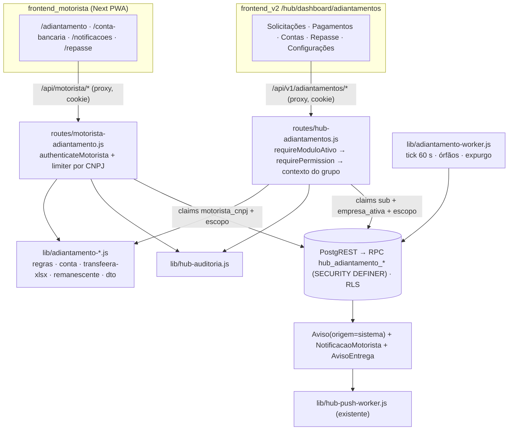

# Implementation Plan: Adiantamento pelo App, Dados Bancários e Exportação Transfeera

**Feature**: `adiantamento-motorista` | **Date**: 2026-09-17 | **Spec**: [spec.md](spec.md)

> **Fontes, nesta ordem:** [`BRIEFING-AGENTE-00C.md`](../../plans/adiantamento-motorista/BRIEFING-AGENTE-00C.md)
> → [`PLANO.md`](../../plans/adiantamento-motorista/PLANO.md) (desenho aprovado pelo
> operador em 2026-09-17, §10–§26) → [`prototipo/index.html`](../../plans/adiantamento-motorista/prototipo/index.html)
> → `spec.md`. Este plano **materializa** o desenho aprovado na stack existente; não o
> reprojeta. Onde o código real obrigou a ajustar um detalhe técnico, há Decisão
> auditada (`dec-013`..`dec-024`) e a justificativa em [research.md](research.md).
> Nenhuma regra financeira ou de negócio foi alterada.

## Summary

O motorista do grupo Movee passa a pedir o adiantamento pelo app (no máximo 1 por dia,
janela e regras vindas do servidor), cadastra a conta bancária para revisão do
financeiro e acompanha tudo numa timeline e numa central de notificações que não depende
de push. Depois do corte, um tick de 60 s no backend calcula a produção D-1 em SQL
(`numeric`, meio para cima), libera ou marca inelegível e congela o snapshot. O
financeiro, no hub, parametriza as regras em versões, revisa contas, monta lotes só com
as solicitações aptas, gera e baixa o Excel no layout Transfeera de 12 colunas (validado
antes do download), confirma o pagamento manualmente por lote e acompanha o remanescente
semanal.

Abordagem: toda regra de estado e de dinheiro vive em funções SQL `SECURITY DEFINER` na
série única de migrations (`0066+`); o Node valida a borda, monta o Excel com o `xlsx` já
instalado, audita e expõe as rotas; os dois frontends seguem os padrões atuais. Sem
dependência nova, sem serviço novo.

## Technical Context

**Language/Version**: Node 20 (imagem de produção do backend = `Dockerfile.hub`, `node:20-alpine`); TypeScript + React 19.2.4 nos dois frontends
**Primary Dependencies**: backend Express ^4.17.1, express-rate-limit ^6.11.2, jsonwebtoken ^8.5.1, xlsx ^0.18.5 (SheetJS CE); `frontend_v2` Next 16.2.3, Tailwind 4, `@base-ui/react` ^1.3.0 (não Radix), shadcn; `frontend_motorista` Next 16.2.3, Serwist 9, componentes próprios
**Storage**: Postgres do hub via PostgREST (JWT HS256 por requisição, `role authenticated`, RLS por `hub_jwt_escopo_ids()`); migrations `infra/hub/migrations/0066+`; bytes do Excel em `bytea` com expurgo em 90 dias
**Testing**: `node --test` com lista explícita no `package.json` do backend (+ `scripts/checar-testes-orfaos.js`); vitest no `frontend_v2`; runner nativo (`node --experimental-strip-types --test`) no `frontend_motorista`; drivers `infra/hub/testes/*.sh` para integração e Playwright (container oficial)
**Target Platform**: containers existentes (backend, `frontend_v2`, app motorista); verificação só em `hub-test-*`/`hub-homolog` (fonte: briefing §4 item 1; constitution §V; dec-013)
**Project Type**: web-service + 2 web apps (monorepo `app_homologacao/`)
**Performance Goals**: geração de lote com até 5.000 linhas abaixo de ~1 s (PLANO §17); lote de 500 do início ao download em < 5 min de uso (SC-003); tick de 60 s com lote de 200 solicitações
**Constraints**: container em UTC — todo "hoje/ontem/agora" com o fuso da configuração; dinheiro nunca em ponto flutuante; timeouts de 15 s no proxy e no `api-client`; `ids` ≤ 5.000; nenhum dado pessoal em teste, log ou auditoria
**Scale/Scope**: grupo Movee (empresa 6); base inicial de 1.731 contas bancárias (carga F8); ~150 pagamentos por lote como ordem de grandeza (PLANO §14.1)

**NEEDS CLARIFICATION restantes**: 0. Nenhum eixo estrutural decidido aqui: a feature
herda a stack do projeto (dec-013).

## Constitution Check

*GATE: passou antes do Phase 0; re-checado depois do Phase 1 (abaixo).*
Constitution v1.1.0 (`docs/constitution.md`).

| Princípio | Status | Notas |
|-----------|--------|-------|
| I. Segurança de autenticação e segredos (MUST) | PASS | Reusa os cookies httpOnly do app (`accessToken` 15 min / `refreshToken` 7 d, `sameSite Strict`) e do hub. Nenhum token em `localStorage`/query. Segredo novo: nenhum (a claim `hub_adiantamento_worker` usa o `PGRST_JWT_SECRET` existente). |
| II. Isolamento multi-tenant (MUST) | PASS | Escopo sempre resolvido no servidor: hub pela entidade ativa do token (`resolverContextoAdiantamentos`) — grupo inteiro só quando a entidade ativa é a empresa-pai 6; filial vê só a própria empresa (dec-022; o módulo de avisos usa o grupo inteiro para qualquer entidade do grupo, e aqui isso não é copiado); app pela claim de CNPJ → `ContaMotorista` → `Entregador` no SQL. Nenhum id de empresa, conta ou entregador vem do corpo (dec-015). RLS em todas as tabelas novas. |
| III. Contratos de API e proxy de cookies (MUST + SHOULD) | PASS | Os dois fronts falam só pelo proxy `/api/*` com `credentials: 'include'`. `backend/README.md` ganha as rotas novas e as mudanças (`/motorista/logout`, `/motorista/avisos/:id`, alcance de avisos) na mesma entrega (F3/F4). |
| IV. Qualidade e revisão (MUST + SHOULD) | PARCIAL | Branch, Conventional Commits e PR ficam com a sessão pai e o operador (F11, fora desta execução). A superfície nova (dados bancários, arquivo de pagamento) passa pelo gate `owasp-security` antes das tarefas. ~~O importador de planilha de terceiros (F9) está fora desta rodada~~ — implementado via dec-129 (FASE 9, converge onda-037/11.21): `POST /lotes/:id/retorno` casa por ID de integração e reusa `hub_adiantamento_lote_confirmar` (nenhuma superfície de escrita nova), mas o gate `owasp-security` original NUNCA cobriu especificamente essa rota (foi rodado antes de FASE 9 existir) — pendente rodar o gate sobre o importador antes de dar PASS pleno aqui. A carga (F8) valida cada linha e recusa o que não normaliza. |
| V. Deploy conteinerizado e convivência (MUST) | PASS | Nenhum serviço, porta ou container novo em produção: o tick roda dentro do backend. Migrations e stacks só em `hub-*`; produção fica com o rito integral do operador. |
| Padrões de qualidade | PASS | Mensagens pt-BR por código (`{erro}` → mapa no cliente); `AbortController`/timeout do `api-client` mantidos. |

**Re-check pós-design**: o design não acrescenta serviço, fila, ORM nem dependência. As
duas adições de mecanismo — trigger de transições (sem precedente no repo, mas exigido
pela PLANO §11.1) e claim de worker (precedente `hub_push_worker`) — são as menores que
cumprem os requisitos. Nenhum princípio MUST é tocado. **Complexity Tracking: N/A.**

## Regras que o código carrega literalmente

| Regra | Onde fica | Fonte |
|---|---|---|
| Arredondamento meio para cima: `bruto = round(producao * percentual / 100, 2)` em `numeric`; `liquido = bruto − taxa` (`129,345 → 129,35`; `129,344 → 129,34`) | `hub_adiantamento_processar` | D-06, R-07, FR-010 |
| Janela: dia habilitado **e** `abertura <= agora < corte`, no fuso da versão (`08:59:59 ✗ · 09:00:00 ✓ · 14:59:59 ✓ · 15:00:00 ✗`); container em UTC | `hub_adiantamento_janela` (SQL) e `lib/adiantamento-regras.js` (só exibição) | D-04, R-02, FR-002 |
| D-1 calendário: `data_producao = data_solicitacao − 1`, sem dia útil nem feriado | CHECK + função de janela | R-01, R-03, Q-N13, FR-008 |
| Produção só com lançamentos `Credito` das categorias da versão da solicitação; débitos nunca reduzem a produção | `hub_adiantamento_producao` | D-01, D-02, Q-N10, FR-009 |
| Produção indisponível → `AGUARDANDO_PRODUCAO` e nova tentativa a cada ciclo | tick | R-08, FR-011 |
| 1 solicitação não cancelada por dia; cancelar só em `AGUARDANDO_CORTE` e antes do corte; pode pedir de novo depois de cancelar | índices únicos parciais + transições | D-14, Q-N1, FR-001, FR-004 |
| Conta e dígito sempre separados; agência com 4 dígitos; banco COMPE de 3 dígitos; tudo texto | CHECKs + validação no Node | PLANO §7.3, FR-015, FR-016 |
| Layout Transfeera de 12 colunas, aba `Página1`, mescla `A1:L1`, `ADV-NNNNNN`, agendamento vazio, Descrição Pix ≤ 140 | `lib/adiantamento-transfeera-xlsx.js` + fixture | PLANO §6–§7, D-18..D-22, FR-055 |
| Anti-duplicidade: `UNIQUE (conta_motorista_id, data_solicitacao)`, `UNIQUE (entregador_id, data_producao)` (ambos `WHERE status <> 'CANCELADA'`), `UNIQUE (conta_motorista_id, chave_idempotencia)`, `UNIQUE (solicitacao_id) WHERE situacao IN ('incluido','pago')`, `UNIQUE (criado_por, chave_idempotencia)` no lote | migrations | PLANO §12.3, §12.5, FR-050, FR-051 |
| Lote `GERANDO → GERADO → EXPORTADO → CONCLUIDO / CONCLUIDO_COM_FALHAS`, `CANCELADO` (falha, órfão > 5 min, financeiro; depois do download só com "não enviado") | funções de lote + trigger | PLANO §11.2 |
| Tick de 60 s em processo, no boot também, `FOR UPDATE SKIP LOCKED`, limite 200 | `lib/adiantamento-worker.js` | PLANO §17, FR-049 |
| Bytes do Excel no banco, mesmos bytes em todo download, expurgo 90 dias após concluir/cancelar | lote + worker | Q-N7, FR-030, FR-052 |
| Remanescente desconta o **bruto**; adiantamento entra no período da sua `data_producao` | `hub_adiantamento_repasse` | D-11, D-12, FR-037 |
| ~~F9 (importador de retorno) fora desta rodada~~ — **superado por dec-129** (operador entregou arquivo real em 2026-09-18, FASE 9). Rota e leitor criados: `lib/adiantamento-retorno-transfeera.js` + `POST /lotes/:id/retorno`; spec.md ganhou FR-056/SC-011 (converge onda-037, 11.20/11.21) | rota + leitor implementados | D-16 (superada por dec-129), briefing §3 |

## Arquitetura



Fluxos, estados e desenho de tela: PLANO §10, §11, §13, §14, §18, §19, §23 e protótipo
(M01–M16, H01–H15). Detalhe de dados em [data-model.md](data-model.md); contratos em
[contracts/](contracts/).

## Project Structure

### Documentation (this feature)

```text
docs/specs/adiantamento-motorista/
├── spec.md
├── plan.md              # este arquivo
├── research.md          # Phase 0
├── data-model.md        # Phase 1
├── quickstart.md        # Phase 1
└── contracts/
    ├── motorista-api.md     # /motorista/* (existente + novo)
    ├── hub-api.md           # /api/v1/adiantamentos (+ mudança em avisos)
    ├── sql-rpc.md           # funções hub_adiantamento_* e alterações
    └── transfeera-xlsx.md   # contrato do arquivo de exportação
```

### Source Code (repository root)

Legenda: **N** = novo, **A** = alterado. Diretórios verificados no repositório em
2026-09-17.

```text
.gitignore                                          A  F0: cobrir docs/documentos_apoio/modelo_transfeera.xlsx (hoje liberado pela linha 15)
infra/hub/
├── migrations/
│   ├── 0066_adiantamento_tabelas.sql               N  F1: tabelas, índices, CHECKs, RLS, grants
│   ├── 0067_adiantamento_funcoes.sql               N  F1: funções internas, trigger de transições, RPCs
│   ├── 0068_notificacao_motorista.sql              N  F5: NotificacaoMotorista, Aviso.origem/categoria, hub_aviso_* alteradas
│   ├── 0069_auditoria_adiantamento.sql             N  F1: ramos da policy de INSERT (motorista, worker)
│   └── 0070_modulo_adiantamentos.sql               N  F1: módulo (ordem 35), 10 permissões, papel financeiro, config v1
│                                                      (numeração final decidida na F1; a série é única e contínua)
├── scripts/scan-auditoria-sensivel.sh              —  usado pelo driver novo (sem mudança)
└── testes/
    ├── hub-adiantamentos-integration.sh            N  F10: stack hub-test-*, migrate 2×, concorrência real
    ├── hub-adiantamentos-e2e-browser.sh            N  F7/F10: Playwright do hub (container oficial)
    └── hub-motorista-adiantamento-e2e-browser.sh   N  F6/F10: Playwright do app (padrão motorista-push)

app_homologacao/backend/
├── server.js                                       A  montar /api/v1/adiantamentos; pendurar rotas do app; iniciar o tick
├── README.md                                       A  rotas novas e alteradas (constitution §III)
├── package.json                                    A  novos arquivos nas listas explícitas de teste
├── routes/
│   ├── motorista-adiantamento.js                   N  F3: §16.1
│   ├── hub-adiantamentos.js                        N  F4: §16.2
│   ├── motorista.js                                A  F3: logout sem exigir access válido (Q-N16)
│   └── hub-avisos.js                               A  F5: alcance com comPush; SEM_DESTINATARIOS
├── lib/
│   ├── adiantamento-regras.js                      N  F2: janela, D-1, próxima oportunidade, texto das regras + sha256
│   ├── adiantamento-conta.js                       N  F2: DV CPF/CNPJ, COMPE, agência, conta, dígito, PIX, e-mail, máscaras
│   ├── adiantamento-transfeera-xlsx.js             N  F2: montar + validar
│   ├── adiantamento-remanescente.js                N  F2: período de apuração, linhas, CSV
│   ├── adiantamento-dto.js                         N  F3/F4: snake_case → camelCase, dinheiro em string
│   ├── adiantamento-worker.js                      N  F3: tick, órfãos, expurgo
│   ├── hub-postgrest-jwt.js                        A  F3: claim adiantamentoWorker → hub_adiantamento_worker
│   └── fixtures/                                   N  (diretório novo)
│       ├── transfeera-contrato.json                N  F0: sanitizado
│       └── bancos-compe.json                       N  F0: lista BCB com data de extração
├── scripts/
│   ├── extrair-contrato-transfeera.js              N  F0
│   └── carga-contas-bancarias.js                   N  F8: --simular / --gravar (rodado pelo operador)
└── tests/
    ├── adiantamento-regras-unit.test.js            N
    ├── adiantamento-conta-unit.test.js             N
    ├── adiantamento-transfeera-xlsx-unit.test.js   N
    ├── adiantamento-remanescente-unit.test.js      N
    ├── adiantamento-rotas-unit.test.js             N  (rotas com PostgREST falso, padrão hub-avisos-rotas-unit)
    ├── carga-contas-bancarias-unit.test.js         N
    └── hub-adiantamentos-integration.test.js       N  (entra no EXIGEM_AMBIENTE do checar-testes-orfaos)

app_homologacao/frontend_v2/
├── app/hub/dashboard/adiantamentos/
│   ├── page.tsx                                    N  H01 Solicitações
│   ├── [id]/page.tsx                               N  H02 Detalhe
│   ├── pagamentos/page.tsx                         N  H08–H11 seleção, prévia, pendências, gerar
│   ├── lotes/page.tsx                              N  H13 histórico
│   ├── lotes/[id]/page.tsx                         N  H12, H15 download e confirmação
│   ├── contas/page.tsx                             N  H06–H07
│   ├── repasse/page.tsx                            N  H14
│   └── configuracoes/page.tsx                      N  H03–H05
├── components/hub/
│   ├── adiantamentos-abas.tsx                      N  abas por link, filtradas por permissão (não há Tabs em components/ui)
│   └── adiantamento-*.tsx                          N  diálogos (rejeitar, aprovar conta, gerar lote, cancelar lote, confirmar, fechar apuração)
├── lib/hub/
│   ├── adiantamentos-api.ts                        N  cliente + tipos + download (padrão faturamento-api.ts:100-121)
│   ├── rotulo-permissao.ts                         A  rótulos por código + alto impacto (ver contracts/hub-api.md)
│   ├── module-nav.ts                               A  ícone e descrição do módulo `adiantamentos`
│   └── larguras.ts                                 A  larguras nomeadas das telas novas (se preciso)
├── hooks/use-selecao-lote.ts                       N  seleção por página / "todas do filtro"
├── playwright.config.hub-adiantamentos.ts          N
├── playwright.config.motorista-adiantamento.ts     N
├── tests/e2e-hub-adiantamentos/                    N
└── tests/e2e-motorista-adiantamento/               N

app_homologacao/frontend_motorista/
├── app/layout.tsx                                  A  viewport sem userScalable:false (a11y nas telas tocadas)
├── app/(app)/layout.tsx                            A  tentar refresh antes do login (FR-053)
├── app/(app)/adiantamento/page.tsx                 N  M03–M07
├── app/(app)/adiantamento/[id]/page.tsx            N  M08, M09, M11
├── app/(app)/adiantamento/historico/page.tsx       N  M10
├── app/(app)/adiantamento/regras/page.tsx          N  M15
├── app/(app)/conta-bancaria/page.tsx               N  M12, M14
├── app/(app)/conta-bancaria/alterar/page.tsx       N  M13
├── app/(app)/notificacoes/page.tsx                 N  M02
├── app/(app)/repasse/page.tsx                      N  M16
├── app/(app)/movimento/page.tsx                    A  M01: card do adiantamento do dia + últimas notificações
├── components/bottom-nav.tsx                       N  Início · Adiantamento · Notificações (badge) · Conta
├── components/adiantamento/                        N  timeline, cartão de valores, formulário bancário
├── lib/api-client.ts                               A  ler {erro} (FR-054)
├── lib/adiantamento-api.ts                         N  cliente + tipos
├── lib/erros-adiantamento.ts                       N  código → mensagem pt-BR
├── lib/conta-bancaria-form.ts                      N  validação/máscara puras (testadas pelo runner nativo)
└── package.json                                    A  novos *.test.ts no script test
```

**Structure Decision**: seguir exatamente os lugares que o código já usa — rotas do app
penduradas no router do motorista (`server.js:2847`), rotas do hub em
`/api/v1/<recurso>`, lógica pura em `backend/lib/`, uma pasta estática por módulo em
`app/hub/dashboard/<codigo>/` (não existe rota dinâmica de módulo; `module-nav.ts:159-162`)
e telas do app no grupo `(app)`, que já tem o guarda de sessão.

## Convenções de Borda

| Camada | Case style | Validação | Fonte da verdade |
|--------|------------|-----------|------------------|
| Colunas do banco (PostgreSQL) | `snake_case`; tabelas `"PascalCase"` | CHECK + índice único + trigger de transições | `infra/hub/migrations/0066+` |
| Parâmetros de RPC | `p_snake_case` | tipos da função + `RAISE EXCEPTION '<CODIGO>'` | `contracts/sql-rpc.md` |
| Claims do JWT do PostgREST | `snake_case` (`motorista_cnpj`, `hub_adiantamento_worker`) | funções `hub_jwt_*` | `backend/lib/hub-postgrest-jwt.js` |
| DTO do backend | `camelCase` | validação manual na rota (sem biblioteca, como o resto do backend) | `backend/lib/adiantamento-dto.js` |
| Payload da API do app | `camelCase`; `GET /disponibilidade` com as chaves em inglês do contrato aprovado (PLANO §13) | rota + teste de roundtrip | `contracts/motorista-api.md` |
| Payload da API do hub | `camelCase`; listas `{itens,total,page,pageSize}` | rota + teste de roundtrip | `contracts/hub-api.md` |
| Erros | `{erro:'CODIGO_MAIUSCULO', motivo?}` | mapa pt-BR no cliente | contratos |
| Dinheiro | string decimal `"129.05"` (2 casas, ponto) na API; `numeric` no banco; número só dentro da célula do Excel | regex `^-?\d+\.\d{2}$` no teste de roundtrip | contratos |
| Datas | `YYYY-MM-DD` (negócio); ISO 8601 com offset do fuso da configuração (instantes) | parse estrito | contratos |
| Query/path | `camelCase` nos parâmetros (`pageSize`, `naoLidas`); caminhos em `kebab-case` (`conta-bancaria`, `aprovar-lote`) | router Express | contratos |
| Frontend (TS) | `camelCase`; tipos declarados em `*-api.ts` | teste que parseia o payload real capturado | `frontend_v2/lib/hub/adiantamentos-api.ts`, `frontend_motorista/lib/adiantamento-api.ts` |

**Mapper layer (DB ↔ DTO)**: `backend/lib/adiantamento-dto.js`, no padrão de
`lib/hub-faturamento-dto.js` (`mapFaturamentoListItem`, `:121`). ORM: **não** (PostgREST).

**Validação**: não há Zod no projeto; a validação de request é manual na rota (padrão do
backend), com os formatos repetidos em CHECK no banco; a de response é o teste de
roundtrip (quickstart, cenário 11). Sem schema compartilhado entre os três projetos (não
existe pacote comum no repo).

## Fases de implementação (PLANO §27, recorte do briefing §3)

| Fase | Entrega | Critério de aceite (resumo) |
|---|---|---|
| F0 | `.gitignore`; fixture de contrato sanitizada + script; lista COMPE com data de extração | `git check-ignore` cobre o modelo; fixture sem dado pessoal; lista com fonte e data |
| F1 | migrations `0066+` (tabelas, índices, CHECKs, RLS, funções, trigger, policy de auditoria, módulo, permissões, papel, config v1) | `migrate.sh` duas vezes sem erro; integração verde |
| F2 | libs puras (`regras`, `conta`, `transfeera-xlsx`, `remanescente`) | bateria da PLANO §26; zero dependência nova |
| F3 | rotas do app, tick, limiters, sessão (Q-N16), claim do worker | contratos em camelCase e dinheiro em string; README |
| F4 | rotas do hub, geração/validação/download, confirmação manual, repasse + CSV + fechamento | cenários 4–8 do quickstart; README |
| F5 | notificações: `Aviso.origem`, histórico para todo o público, eventos do sistema, `/avisos/:id` pelo histórico, "N · M com push" | cenário 9 |
| F6 | UI do app M01–M16, navegação inferior, a11y nas telas tocadas | E2E do app; axe ≥ 95; AA nos dois temas; alvos ≥ 44 px |
| F7 | UI do hub H01–H15, abas por permissão, seleção em massa, rótulos | E2E do hub; impeccable 0 achados; larguras nomeadas |
| F8 | script de carga `--simular`/`--gravar` (implementar e testar; **não** rodar em produção) | relatório 0600 fora do git, sem PII no stdout; recusas listadas |
| F10 | verificação | gates com números; checklist dos 28 edge cases |

Fora desta execução: **F9** (bloqueada por Q-B1, sem inventar layout), **F11/F12**
(commit, PR, merge, build, deploy, go-live — sessão pai e operador), V-1..V-6 (operador).

## Gates de verificação (relatar com números)

- `tsc --noEmit` nos dois frontends; `npm test` no backend (lista explícita +
  `node scripts/checar-testes-orfaos.js`), `npm run test:hub:unit`, `npm test` no
  `frontend_v2` (vitest) e no `frontend_motorista` (runner nativo);
- driver novo `hub-adiantamentos-integration.sh` (concorrência real de lote e de
  solicitação) e `scan-auditoria-sensivel.sh` verde;
- `next build` do `frontend_v2` e do `frontend_motorista` (com `df -h /` ≥ 20 GB, swap
  ativa, `--memory=2g` em builds docker);
- lint comparado com a baseline;
- E2E pelos drivers, com o `package-lock.json` revertido depois;
- baselines herdadas: `test:hub:integration` 11/13 e `hub-rls-importacoes-integration.sh`
  15 PASS / 3 FAIL não contam como regressão.

## Segurança (gate `owasp-security`, revisão de desenho)

Nenhum achado crítico ou alto. Os de severidade média foram resolvidos no próprio desenho.

| # | Achado (OWASP 2025 / API 2023) | Sev. | Tratamento no plano |
|---|---|---|---|
| S1 | RBAC só no Node: as RPCs `SECURITY DEFINER` com `GRANT` a `authenticated` confiam nas claims; quem tivesse um JWT do PostgREST chamaria a RPC sem passar pelo `requirePermission` (A01, API5) | média | segunda barreira no SQL (`hub_adiantamento_tem_permissao`) nas RPCs que movem dinheiro ou expõem dado bancário completo (dec-023) |
| S2 | Escopo do grupo inteiro para qualquer entidade do grupo (padrão de avisos) contraria a constitution §II para filiais (A01, API1) | média | grupo inteiro só para a empresa-pai 6; filial = própria empresa (dec-022) |
| S3 | `SELECT` direto em dado bancário e nos bytes do arquivo (A01, A02) | média | sem `SELECT` direto em `ContaBancariaMotorista` e `NotificacaoMotorista`; `arquivo` fora do grant por coluna; tudo por RPC com mascaramento no SQL (dec-023) |
| S4 | Troca da conta bancária por sessão roubada para desviar pagamento (A07, API6) | baixa | aprovação humana obrigatória (D-07), alerta de titular diferente, pendência `CONTA_ALTERADA` para o que já foi liberado; a revisão (H07) mostra a conta aprovada atual ao lado da nova |
| S5 | Injeção via modelo da Descrição Pix, nome do titular ou fonte da produção (A05) | baixa | modelo aceita só `{data_producao:DD.MM.AA}` e `{nome}` (outros `{…}` recusados); nome sem caracteres de controle; células de texto `t:'s'` (nunca fórmula); fonte da produção por ramos estáticos no SQL, sem SQL dinâmico; CSV do repasse com `escaparCelulaCsvInjection` |
| S6 | Atribuição em massa (API3) | baixa | `PUT /configuracoes` e `POST /conta-bancaria/solicitacoes` copiam só os campos do contrato |
| S7 | Corrida entre cancelamento e tick no corte (A06) | baixa | as duas funções travam a linha (`FOR UPDATE`) e o cancelamento reconfere o corte sob a trava |
| S8 | Consumo de recurso (API4) | baixa | `ids` ≤ 5.000, limiters por CNPJ e por `sub`, tick com limite 200, geração < ~1 s |
| S9 | Dados sensíveis em log/auditoria/push (A09) | baixa | `detalhes` sem documento/conta/bytes, `scan-auditoria-sensivel.sh` no driver; rota de conta bancária nunca registra o corpo; payload Web Push é cifrado de ponta a ponta (RFC 8291) e leva só título e corpo |
| S10 | SheetJS 0.18.5 com CVEs de leitura (A03) | info | só relê o buffer gerado pelo próprio processo; a carga (F8) lê a planilha do operador, localmente; o leitor de arquivo de terceiros fica para a F9 |
| S11 | Pré-existentes: `jwt.verify` sem `algorithms` (`routes/motorista.js:161`); logout sem revogação no servidor; `[proxy-debug]` loga os primeiros 120 caracteres do header `Cookie` (`frontend_v2/app/api/[...path]/route.ts:43-47`) | baixa | fora do escopo; o último já é a Q-N17 (PR separado, decisão do operador). Os 120 caracteres não chegam à assinatura de um JWT, então não são credencial utilizável, mas vazam parte das claims. Recomendado resolver antes do go-live (F12) |

## Pontos para confirmação do operador (não bloqueiam o desenvolvimento)

1. **Fechamento da apuração com adiantamentos ainda não pagos** — **DECIDIDO pelo
   operador (D-23, dec-038)**. O fechamento é **recusado** (`409 APURACAO_COM_PENDENCIAS`,
   com contagem por status) enquanto houver solicitação com `data_producao` no período em
   `AGUARDANDO_CORTE`, `AGUARDANDO_PRODUCAO`, `LIBERADA`, `EM_LOTE`, `EXPORTADA` ou
   `FALHOU`. O estado novo `ENCERRADA` (`FALHOU → ENCERRADA`, com motivo, pelo financeiro
   com `adiantamentos.reprocessar`) finaliza uma falha que não será paga. O snapshot
   desconta o bruto das `PAGA`. Substitui a leitura da dec-020.
2. **Valores padrão dos interruptores do repasse** (`descontar adiantamentos` ligado,
   `descontar débitos` desligado, `mostrar no app` desligado): tirados do protótipo H14;
   o financeiro confirma no go-live (F12), junto com Q-B2/Q-B3.
3. ~~**Lista COMPE (F0)**~~ — **resolvido, não é mais risco de bloqueio.** O arquivo
   público do BCB já está no disco:
   `docs/documentos_apoio/ParticipantesSTR-2026-09-17.csv` (extração 2026-09-17, UTF-8
   com BOM, colunas `ISPB, Nome_Reduzido, Número_Código, Participa_da_Compe,
   Acesso_Principal, Nome_Extenso, Início_da_Operação`, 474 linhas de dados). A F0 MUST
   usar este arquivo tal como está — sem baixar nada — para gerar
   `lib/fixtures/bancos-compe.json` com a data de extração 2026-09-17. Observação:
   "RecargaPay" (presente na planilha de exemplo da Transfeera com 7 contas) NÃO consta
   como participante do STR nesta lista — confirmado por busca no arquivo, 0
   ocorrências. Na carga (F8), contas cujo banco não bater com um participante da lista
   MUST ser recusadas/reportadas como banco não identificado, nunca mapeadas por
   suposição (Constitution VI — sem fonte, sem dado).

## Riscos e dependências

| Risco / dependência | Tratamento |
|---|---|
| Q-B1..Q-B6 (retorno real, valores iniciais, V-1..V-6, casamento da carga, backfill de vínculos) | não bloqueiam o desenvolvimento; bloqueiam o go-live (PLANO §9.1) |
| Trigger de máquina de estados sem precedente no repo | teste de integração com todas as transições válidas e uma amostra das inválidas |
| Regra de janela existe em SQL (decide) e em JS (exibe) | mesma bateria de fronteiras nos dois lados (quickstart, cenário 2) |
| `lpad` do Postgres trunca ids com mais de 6 dígitos | função `hub_adiantamento_integration_id` com o ramo sem truncar (research D10) |
| Mudança em `hub_aviso_criar` afeta o módulo de avisos em produção | regressão do driver `hub-push-avisos-integration.sh` e do E2E `hub-avisos-e2e-browser.sh` |
| Leitura do buffer gerado com SheetJS 0.18.5 (CVEs de leitura) | só lê arquivo gerado pelo próprio processo; leitor de arquivo de terceiros fica para a F9 |
| Demais riscos | PLANO §28 |

## Achados fora do escopo (registrar, não corrigir sem autorização)

- PLANO §29 itens 1, 3 (fora das telas tocadas), 5, 6, 7 (este entra na F0), 8.
- `authenticateMotorista` não fixa `algorithms` no `jwt.verify`
  (`backend/routes/motorista.js:161`) — defesa em profundidade recomendada.
- As respostas CSV do hub não definem `Cache-Control` (o download do Excel define
  `no-store`).
- As listas do hub usam `items` na maioria dos módulos e `itens` em avisos e nesta
  feature (dec-014).

## Complexity Tracking

N/A — nenhuma violação de princípio da constitution.

## Artefatos

| Arquivo | Status |
|---------|--------|
| docs/specs/adiantamento-motorista/plan.md | Criado |
| docs/specs/adiantamento-motorista/research.md | Criado |
| docs/specs/adiantamento-motorista/data-model.md | Criado |
| docs/specs/adiantamento-motorista/contracts/motorista-api.md | Criado |
| docs/specs/adiantamento-motorista/contracts/hub-api.md | Criado |
| docs/specs/adiantamento-motorista/contracts/sql-rpc.md | Criado |
| docs/specs/adiantamento-motorista/contracts/transfeera-xlsx.md | Criado |
| docs/specs/adiantamento-motorista/quickstart.md | Criado |
| docs/specs/adiantamento-motorista/spec.md | Alterado (FR-013 alinhado à PLANO §19, dec-019) |
