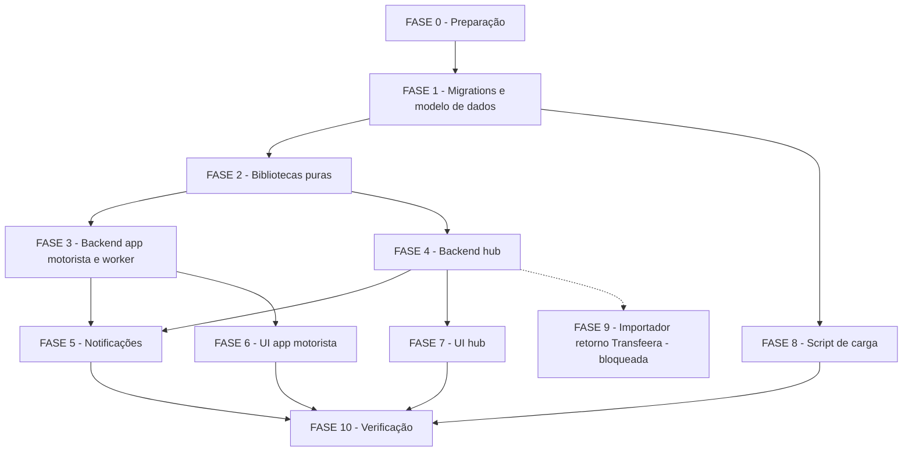

# Tarefas Adiantamento pelo App, Dados Bancários e Exportação Transfeera

Escopo: implementar as 8 User Stories e os 55 FRs de `spec.md` sobre a stack existente
(Node 20/Express + PostgREST + Next.js), conforme `plan.md` (Fases F0–F10, F9 bloqueada
por Q-B1) e os contratos em `contracts/`. Fonte: `spec.md`, `plan.md`, `data-model.md`,
`contracts/*.md`, `checklists/api.md`, `checklists/security.md`.

**Legenda de status:**
- `[ ]` Pendente
- `[~]` Em andamento
- `[x]` Concluido
- `[!]` Bloqueado

**Legenda de criticidade:**
- `[C]` Critico - Impacto financeiro direto ou bloqueante (dinheiro, dado bancário,
  anti-duplicidade, RBAC, auditoria)
- `[A]` Alto - Funcionalidade essencial (core restante)
- `[M]` Medio - Necessario mas sem urgencia imediata

---

## FASE 0 - Preparação

### 0.1 `.gitignore` e fixture do contrato Transfeera `[M]`

Ref: plan.md Project Structure F0; contracts/transfeera-xlsx.md §Estrutura

- [x] 0.1.1 Adicionar `docs/documentos_apoio/modelo_transfeera.xlsx` ao `.gitignore` (hoje liberado pela linha 15)
- [x] 0.1.2 Confirmar com `git check-ignore -v docs/documentos_apoio/modelo_transfeera.xlsx` que o arquivo passa a ser ignorado
- [x] 0.1.3 Criar `backend/scripts/extrair-contrato-transfeera.js` — lê o modelo local (aba, linha 1, cabeçalhos, mescla `A1:L1`) e grava `backend/lib/fixtures/transfeera-contrato.json` sanitizado, sem a linha 3 (dado pessoal real)
- [x] 0.1.4 Rodar o script e conferir que `transfeera-contrato.json` não contém nenhum dado da linha 3 do modelo (grep por CPF/CNPJ de exemplo)
- [x] 0.1.5 Teste inicial: `adiantamento-transfeera-xlsx-unit.test.js` carrega a fixture e confere estrutura mínima (aba `Página1`, 12 cabeçalhos)

### 0.2 Lista de bancos COMPE a partir do CSV do BCB `[A]`

Ref: plan.md §Pontos para confirmação item 3; `docs/documentos_apoio/ParticipantesSTR-2026-09-17.csv`

- [x] 0.2.1 Ler `docs/documentos_apoio/ParticipantesSTR-2026-09-17.csv` (UTF-8 com BOM, já em disco — sem baixar nada) e gerar `backend/lib/fixtures/bancos-compe.json` com `{codigo, nome, ispb}` por banco (script `scripts/extrair-bancos-compe.js`) <!-- correção empírica dec-035: schema {codigo,nome,ispb} por entrada (data-model.md "Dados estáticos", autoridade sobre a redação original desta subtarefa), dataExtracao/fonte como campos do arquivo, não por entrada -->
- [x] 0.2.2 Confirmar que "RecargaPay" NÃO aparece na lista gerada (0 ocorrências, conforme plan.md) — não inferir/mapear por suposição (Constitution VI)
- [x] 0.2.3 Teste: `bancos-compe.json` tem 463 entradas com código de 3 dígitos (dos 474 participantes do STR no CSV, 11 são infraestrutura sem código de banco — Selic, Bacen, STN, câmaras CIP/B3/CERC — excluídos por não terem `Número_Código` de 3 dígitos; ver dec-035) <!-- correção empírica: "474 entradas" da redação original não se sustenta (11 linhas têm código "n/a"/"0", não 3 dígitos); filtrar por Participa_da_Compe=Sim também estaria errado, pois excluiria bancos reais como Nu Pagamentos (260, Participa_da_Compe=Não) -->
- [x] 0.2.4 Documentar a fonte e a data de extração no próprio arquivo de fixture (`dataExtracao`, `fonte`)

---

## FASE 1 - Migrations e modelo de dados

### 1.1 Migration `0066_adiantamento_tabelas.sql` `[C]`

Ref: plan.md Project Structure F1; data-model.md (todas as entidades); plan.md §Regras

- [x] 1.1.1 Criar as tabelas `AdiantamentoConfiguracao`, `ContaBancariaMotorista`, `AdiantamentoSolicitacao`, `AdiantamentoEvento`, `AdiantamentoLote`, `AdiantamentoLoteItem` conforme `data-model.md`
- [x] 1.1.2 Índices únicos: `(conta_motorista_id, data_solicitacao) WHERE status<>'CANCELADA'`, `(entregador_id, data_producao) WHERE status<>'CANCELADA'`, `(conta_motorista_id, chave_idempotencia)`, `(solicitacao_id) WHERE situacao IN ('incluido','pago')`, `(criado_por, chave_idempotencia)` no lote (FR-050, FR-051)
- [x] 1.1.3 CHECKs de formato: conta/dígito separados, agência 4 dígitos, banco COMPE 3 dígitos, `data_producao = data_solicitacao - 1`
- [x] 1.1.4 RLS por `hub_jwt_escopo_ids()` em todas as tabelas novas (Constitution II)
- [x] 1.1.5 `GRANT` mínimo a `authenticated` — sem `SELECT` direto em `ContaBancariaMotorista` nem nos bytes do arquivo (dec-023, security CHK010)
- [x] 1.1.6 Teste: `migrate.sh` duas vezes seguidas sem erro (idempotência da migration)
- [x] 1.1.7 Teste: segunda solicitação não cancelada no mesmo dia viola o índice único (SQL direto, antes de qualquer RPC)

### 1.2 Migration `0067_adiantamento_funcoes.sql` `[C]`

Ref: contracts/sql-rpc.md; data-model.md §State Transitions

- [x] 1.2.1 Funções internas (sem `GRANT`): `hub_adiantamento_config_vigente`, `hub_adiantamento_janela`, `hub_adiantamento_producao`, `hub_adiantamento_transicao_valida`, `hub_adiantamento_notificar`, `hub_adiantamento_tem_permissao`, `hub_adiantamento_integration_id` (ramo sem truncar para ids >= 1.000.000 — plan.md "lpad trunca"). `hub_adiantamento_notificar` é STUB nesta fase (substituído por 0068/FASE 5 — `NotificacaoMotorista`/`Aviso.origem` ainda não existem). Evidência: `infra/hub/testes/hub-adiantamentos-integration.sh` — 17/17 PASS
- [x] 1.2.2 Trigger `BEFORE UPDATE OF status` que recusa transição fora de `hub_adiantamento_transicao_valida` com `TRANSICAO_INVALIDA`, gravando um `AdiantamentoEvento` a cada transição válida. Evidência: 16/16 transições válidas + 5/5 inválidas recusadas (driver acima)
- [x] 1.2.3 RPCs do app do motorista: `hub_adiantamento_disponibilidade`, `hub_adiantamento_solicitar` (idempotência por chave, `VERSAO_DESATUALIZADA`, `ALREADY_REQUESTED`), `hub_adiantamento_cancelar`, `hub_adiantamento_listar_motorista`, `hub_adiantamento_detalhe_motorista`, `hub_conta_bancaria_motorista`, `hub_conta_bancaria_solicitar`, `hub_adiantamento_repasse_motorista`
- [x] 1.2.4 RPCs do hub: `hub_adiantamento_rejeitar/_recalcular/_encerrar/_atualizar_conta/_reprocessar/_encerrar_falha` (D-23), `hub_adiantamento_configuracao_salvar` (N+1 ou `VERSAO_DESATUALIZADA`), `hub_adiantamento_categorias`, `hub_conta_bancaria_listar/_detalhe/_aprovar/_rejeitar/_aprovar_lote`, `hub_adiantamento_lote_previa/_criar/_arquivo/_download/_cancelar/_confirmar`, `hub_adiantamento_repasse`, `hub_adiantamento_repasse_fechar` (D-23, ver 4.5)
- [x] 1.2.5 `hub_adiantamento_lote_criar` trava as solicitações com `FOR UPDATE` em ordem de id (evita deadlock) e detecta `SOLICITACOES_EM_OUTRO_LOTE`/`LOTE_ACIMA_DO_LIMITE` (FR-027, FR-032, FR-051). Evidência: concorrência real (edge #17) — 1 `GERANDO` + 1 `SOLICITACOES_EM_OUTRO_LOTE`
- [x] 1.2.6 Cada RPC sensível (move dinheiro ou expõe dado bancário completo) chama `hub_adiantamento_tem_permissao(<codigo>)` no início — segunda barreira de RBAC (dec-023, security CHK006). Códigos com o prefixo do módulo (`adiantamentos.<acao>`, igual a `Permissao.codigo` — 0003/0026/0044/0059)
- [x] 1.2.7 Teste de integração: todas as transições válidas da máquina de estados (16, inclui `FALHOU->ENCERRADA` de D-23) + amostra de transições inválidas recusadas com `TRANSICAO_INVALIDA` (5/5). `infra/hub/testes/hub-adiantamentos-integration.sh`
- [x] 1.2.8 Teste de concorrência real (dois processos `psql` simultâneos, não simulado): duas solicitações simultâneas do mesmo motorista/dia geram uma única linha (edge #11) — 1 sucesso + 1 `ALREADY_REQUESTED`; duas criações de lote sobrepostas — uma vence, a outra recebe `SOLICITACOES_EM_OUTRO_LOTE` (edge #17) — 1 `GERANDO` + 1 conflito

### 1.3 Migration `0069_auditoria_adiantamento.sql` `[C]`

Ref: plan.md Project Structure F1; plan.md §Regras "Auditoria"

- [x] 1.3.1 Ramo da policy de INSERT para ações do motorista via `hub_jwt_motorista_cnpj()` + `id_empresa` do entregador daquele CNPJ
  - ✅ onda-009 (dec-050): subquery inline contra `Entregador`/`ContaMotorista` dentro do `WITH CHECK` falhava — a RLS de `entregador_select_por_escopo` (0015) só libera SELECT com `escopo=ANY(hub_jwt_escopo_ids())`, vazio numa sessão só-motorista, então a subquery não via nenhuma linha e a policy negava tudo. Extraída `hub_jwt_motorista_id_empresa()` (`SECURITY DEFINER`, mesmo motivo de `hub_adiantamento_solicitar`) para contornar a RLS na leitura.
- [x] 1.3.2 Ramo da policy de INSERT para ações do tick via `hub_jwt_adiantamento_worker()`
- [x] 1.3.3 Teste: INSERT de auditoria pelo worker sem a claim é recusado pela RLS
- [x] 1.3.4 Teste: `scan-auditoria-sensivel.sh` não acusa campo de `detalhes` com documento/conta/bytes nas novas ações auditadas (FR-047)
  - ✅ onda-009: driver `hub-adiantamentos-integration.sh` estendido com 5 casos novos (1.3.1 positivo/negativo, 1.3.2, 1.3.3, 1.3.4) + `migrate.sh` 2x cobrindo 0069. **49/49 PASS, 0 FAIL** (stack `hub-test-1789663276`, descartada; disco 23 GB estável).

### 1.4 Migration `0070_modulo_adiantamentos.sql` `[C]`

Ref: contracts/hub-api.md §Permissões por rota; Spec §FR-045, §FR-046

- [x] 1.4.1 Registrar o módulo `adiantamentos` (ordem 35) e as 10 permissões distintas (consultar, gerenciar, configurar, contas_consultar, contas_revisar, pagamentos_consultar, lote_criar, exportar, reprocessar, pagamento_confirmar)
  - ✅ onda-010: `0070_modulo_adiantamentos.sql`. Driver: 10/10 permissões distintas sob o módulo, ordem=35
- [x] 1.4.2 Conceder as 10 permissões ao papel financeiro e aos administradores de plataforma/entidade; nenhum outro papel por padrão (fail-closed, FR-046)
  - ✅ onda-010: papel novo `financeiro` (escopo entidade, `is_sistema=true`, PLANO §12.8) + concessão a `financeiro`/`admin_plataforma`/`admin_entidade` (30 linhas = 3×10). Driver: agregado por papel confere exatamente esses 3 com 10/10; nenhum outro papel (inclui `operador`/`leitura`) recebe nenhuma
- [x] 1.4.3 Inserir a versão 1 (`v1`) de `AdiantamentoConfiguracao` com os valores de D-04/D-05/D-21 do plan.md
  - ✅ onda-010: v1 semeada com D-04 (seg–sáb 09:00–15:00), D-05 (taxa 0,35), D-06/PLANO §299 (percentual 60%), D-21 (modelo da Descrição Pix) e Q-N2 (previsão "entre 17h e 18h de hoje"); campos de Q-B2/Q-B3 (fonte/categorias da produção, apuração semanal) NULOS. Driver: valores conferidos linha a linha
  - ⚠️ **dec-053 (correção empírica desta onda)**: `hub_adiantamento_solicitar` (0067, task 1.2.3) checava `p_configuracao_id = vigente` mas **não** checava se a config vigente estava *completa* — só `hub_adiantamento_disponibilidade` calculava isso, de forma informativa (não bloqueava). FR-025 exige bloquear a *criação* de novas solicitações, não só sinalizar. Extraída `hub_adiantamento_config_completa(config)` (reusada por `_disponibilidade` e `_solicitar`) e adicionado `RAISE EXCEPTION 'NOT_CONFIGURED'` em `_solicitar` quando a config vigente está incompleta. 0067 só existiu em stacks efêmeros (nunca commitada — mesmo critério da correção 1.6), ajustada no lugar. Driver: `disponibilidade()` com v1 incompleta → `configuracao_completa=false`; `solicitar()` com v1 → `NOT_CONFIGURED`, 0 solicitações criadas. Ver contracts/sql-rpc.md
- [x] 1.4.4 Teste: usuário sem nenhuma das 10 permissões recebe 403 em toda rota nova do hub
  - ✅ onda-010 (parte SQL): papéis `operador`/`leitura` (0/10 permissões) recebem `PERMISSAO_NEGADA` de `hub_adiantamento_configuracao_salvar` (RPC sensível real, segunda barreira de RBAC via `hub_adiantamento_tem_permissao`)
  - ✅ onda-017 (parte Node, fecha a tarefa): `routes/hub-adiantamentos.js` criado (FASE 4) com `requireModuloAtivo`+`requirePermission` em toda rota; `tests/hub-adiantamentos-rotas-unit.test.js` describe "4.7.3/1.4.4" exercita as **26 rotas** de `/api/v1/adiantamentos` com 0 das 10 permissões -> 403 `PERMISSAO_NEGADA` em todas (26/26 PASS)
- [x] 1.4.5 Teste: `requirePermission` (Node) e `hub_adiantamento_tem_permissao` (SQL) concordam — nenhuma rota aceita com uma camada e recusa com a outra
  - ✅ onda-010 (parte SQL): confirmado que a camada SQL (`hub_adiantamento_tem_permissao` via `PapelPermissao`) é fail-closed e autoconsistente (1.4.2)
  - ✅ onda-017 (fecha a tarefa): Node comprovado via 1.4.4 acima; paridade SQL "mesmo sem o Node" comprovada no driver `hub-adiantamentos-integration.sh` chamando a RPC DIRETO com `sub=999` (sem RBAC) para 2 permissões distintas — `hub_adiantamento_encerrar_falha` (`reprocessar`, D-23) e `hub_adiantamento_configuracao_salvar` (`configurar`, onda-017) — ambas `PERMISSAO_NEGADA` mesmo sem passar pelo middleware Node (checks "4.7.4/1.4.5")

### 1.5 Driver de integração `hub-adiantamentos-integration.sh` `[C]`

Ref: plan.md Project Structure F10; plan.md §Gates de verificação

- [x] 1.5.1 Criar `infra/hub/testes/hub-adiantamentos-integration.sh` no padrão dos drivers existentes (stack `hub-test-*`, `migrate.sh` 2×)
- [x] 1.5.2 Cenários de concorrência real: duas solicitações simultâneas do mesmo motorista/dia; duas criações de lote com sobreposição de ids
- [x] 1.5.3 Adicionar `hub-adiantamentos-integration.test.js` ao `EXIGEM_AMBIENTE` de `scripts/checar-testes-orfaos.js` — adiado: o arquivo Node (`tests/hub-adiantamentos-integration.test.js`) só nasce em FASE 3/4 (rotas); nada a registrar em `checar-testes-orfaos.js` ainda <!-- onda-035: NÃO-APLICÁVEL — FASE 3/4 concluídas e o arquivo `tests/hub-adiantamentos-integration.test.js` nunca nasceu; a integração desta feature seguiu o padrão de driver shell (`infra/hub/testes/hub-adiantamentos-integration.sh`, fora de `tests/`), não um `.test.js` Node. `find app_homologacao/backend/tests -iname "*adiantamento*"` confirma só `*-unit.test.js` + `hub-adiantamentos-rotas-unit.test.js`; `node scripts/checar-testes-orfaos.js` já passa limpo (76 arquivos, 10.1.2) sem nenhum órfão do tipo — nada a acrescentar em EXIGEM_AMBIENTE -->
- [x] 1.5.4 Rodar o driver e relatar PASS/FAIL com números (feature nova, sem baseline herdada) — **17/17 PASS**, 0 falhas (execução real, stack `hub-test-1789659470`, descartada ao final)
  - ✅ onda-010: driver estendido com os casos de 1.4.1–1.4.5 (RBAC/config v1/NOT_CONFIGURED) — 3 execuções reais até verde: 57/59 (2 FAIL de asserção do teste: coluna `configuracao_completa` ≠ `completa`, e cast booleano via `||` produz `true`/`false` e não `t`/`f`), depois **59/59 PASS, 0 FAIL** (stack `hub-test-1789665065`, descartada; disco 23 GB estável; nenhum container/imagem/volume residual)

### 1.6 Correções da revisão da sessão pai sobre a 0067 (onda-007) — executar ANTES da 1.3 `[C]`

Ref: dec-043 (revisão da sessão pai); PLANO §11.1, §16.2, §17, R-19/D-23; contracts/sql-rpc.md §worker; spec FR-011, FR-041, FR-049; edge #7, #23, #24

A `0067` só existiu em stacks efêmeros, então pode ser ajustada no lugar (registrar Decisão).

- [x] 1.6.1 **`hub_adiantamento_recalcular` só em `AGUARDANDO_PRODUCAO`.** A PLANO §16.2 prevê recalcular apenas a pendência de produção.
  - Hoje aceita `LIBERADA`, o que reescreve um snapshot já calculado e viola o edge #24.
  - Aceita também `INELEGIVEL`, que é terminal: a tabela de transições não tem `INELEGIVEL→LIBERADA` nem `LIBERADA→INELEGIVEL`.
  - Extrair o cálculo (produção → bruto meio para cima → líquido → snapshot da conta aprovada → `LIBERADA`/`INELEGIVEL`) para uma função interna única, reusada pelo recalcular e pelo tick.
  - Teste: recalcular em `LIBERADA`/`INELEGIVEL` → `TRANSICAO_INVALIDA`, sem alterar valores.
  - ✅ onda-008: `hub_adiantamento_calcular_liberacao` extraída (0067); `recalcular` restrito a `AGUARDANDO_PRODUCAO`.
- [x] 1.6.2 **Funções SQL do worker** (estão no contrato `sql-rpc.md`, mas nenhuma tarefa as criava). A 3.3 só as chama.
  - `hub_adiantamento_processar(p_limite int DEFAULT 200)`:
    - seleciona `AGUARDANDO_CORTE` cujo corte, na versão e no fuso da solicitação, já passou, e `AGUARDANDO_PRODUCAO`, com `FOR UPDATE SKIP LOCKED`;
    - usa a configuração DA SOLICITAÇÃO;
    - produção indisponível (fonte sem dado da data ou importação em andamento, R-08) → `AGUARDANDO_PRODUCAO` com `tentativas_producao + 1`;
    - devolve `(id, id_empresa, status_para, resultado jsonb)`.
  - `hub_adiantamento_lote_orfaos(p_minutos int DEFAULT 5)`: `GERANDO` antigo → `CANCELADO` com `falha_geracao`, e as solicitações voltam a `LIBERADA`.
  - `hub_adiantamento_expurgo_arquivos(p_dias int DEFAULT 90)`: zera `arquivo` de lotes concluídos ou cancelados há mais de N dias, mantendo o sha256 e o snapshot das linhas.
  - As três exigem a claim `hub_adiantamento_worker` e não têm `GRANT` para usuário comum.
  - Testes:
    - edge #7 (sem produção → `INELEGIVEL SEM_PRODUCAO`);
    - edge #23 (importação em andamento → espera);
    - corte ainda não passado → não processa;
    - duas chamadas concorrentes de `processar` não processam a mesma solicitação (`SKIP LOCKED`, concorrência real);
    - órfão e expurgo.
  - ✅ onda-008: as 3 RPCs criadas em 0067; concorrência real provada travando a linha manualmente (`FOR UPDATE`) e chamando `processar` concorrentemente — a alternativa (duas chamadas de `processar` disparadas ao mesmo tempo) não garante overlap determinístico.
- [x] 1.6.3 **`hub_adiantamento_repasse_fechar` recusa período ainda aberto** (`PERIODO_EM_ABERTO`). A produção do último dia da janela (`v_fim`) ainda pode ser solicitada no dia seguinte, até o corte, então fechar antes disso deixaria adiantamento sem desconto e furaria a D-23.
  - Regra: recusar enquanto `now()` no fuso da configuração vigente for anterior a `(v_fim + 1) + horario_corte`.
  - Testes dos dois lados da fronteira (um segundo antes e no instante do corte do dia seguinte), com instante injetável como nas demais funções de janela.
  - ✅ onda-008: `hub_adiantamento_repasse_pode_fechar(p_config, p_fim, p_instante)` interna (instante injetável); RPC pública chama com `now()`.
- [x] 1.6.4 Rodar o driver completo de novo e relatar os números (antes 17/17). Os cenários novos de 1.6.1–1.6.3 entram no driver.
  - ✅ onda-008: **39/39 PASS, 0 FAIL** (stack `hub-test-1789661891`, descartada ao final; `migrate.sh` 2x idempotente).
- [x] 1.6.5 **Corte do tick deve considerar o DIA da solicitação** (revisão da sessão pai após a onda-008, dec-047).
  - **Defeito:** `hub_adiantamento_processar` seleciona `AGUARDANDO_CORTE` com `(now() AT TIME ZONE c.timezone)::time >= c.horario_corte`, que compara só a hora do dia. Uma solicitação de um dia anterior ainda em `AGUARDANDO_CORTE` (tick parado ou backend reiniciado) só seria processada depois do corte do dia corrente.
  - **Correção:** `now() >= ((s.data_solicitacao + c.horario_corte) AT TIME ZONE c.timezone)`, a mesma forma já usada em `hub_adiantamento_repasse_pode_fechar`.
  - Se precisar de instante injetável para o teste, criar uma variante interna com `p_instante`, mantendo a RPC pública com `now()`.
  - **Testes:**
    - solicitação de ontem em `AGUARDANDO_CORTE` é processada antes do corte de hoje;
    - solicitação de hoje antes do corte não é processada;
    - solicitação de hoje exatamente no corte é processada.
  - Rodar o driver de novo e relatar os números (antes 39/39).
  - ✅ onda-009 (dec-049): extraída `hub_adiantamento_corte_passou(data_solicitacao, horario_corte, timezone, p_instante)` em 0067 (mesmo padrão de `hub_adiantamento_repasse_pode_fechar`); `hub_adiantamento_processar` passou a chamá-la com `now()`. Testes de fronteira diretos na função + fim-a-fim reprocessando uma solicitação de ontem. O teste "corte ainda não passado" pré-existente (id 303, data fixa 2026-04-04) parou de fazer sentido com a correção (qualquer data fixa no passado já teria corte vencido) — passou a reusar a solicitação de HOJE já criada pelo teste de concorrência 1.2.8. **Driver: 44/44 PASS, 0 FAIL** (stack `hub-test-1789662907`, descartada; `migrate.sh` 2x idempotente).

---

## FASE 2 - Bibliotecas puras

### 2.1 `lib/adiantamento-regras.js` — janela, D-1, próxima oportunidade `[C]`

Ref: plan.md §Regras "Janela"/"D-1 calendário"; Spec §FR-002, §FR-003, §FR-007, §FR-008

- [x] 2.1.1 Avaliação de janela (dia habilitado E `abertura <= agora < corte`) espelhando exatamente `hub_adiantamento_janela`
- [x] 2.1.2 Cálculo de `data_producao = data_solicitacao - 1` (D-1 calendário, sem dia útil/feriado — edge #5)
- [x] 2.1.3 `nextAvailableAt` (próximo dia habilitado + abertura, com offset do fuso)
- [x] 2.1.4 Geração do texto de regras vigentes + `aceiteSha256` (FR-005, FR-007)
- [x] 2.1.5 Teste: bateria de fronteiras do PLANO §26 nos dois lados (JS e SQL) — mesmos vetores de entrada/saída (edge #2, #3, #4, #27)
- [x] 2.1.6 Teste: segunda-feira usa domingo como data de produção, inclusive na virada de mês/ano (edge #5)

### 2.2 `lib/adiantamento-conta.js` — DV, COMPE, agência/conta/dígito, PIX `[C]`

Ref: contracts/motorista-api.md §POST conta-bancaria/solicitacoes; Spec §FR-015, §FR-016, §FR-055; security CHK018

- [x] 2.2.1 Validação de dígito verificador de CPF (11) e CNPJ (14), aceitando entrada mascarada (edge #16)
- [x] 2.2.2 Validação de banco contra `lib/fixtures/bancos-compe.json` (3 dígitos)
- [x] 2.2.3 Normalização de agência para 4 dígitos com zero à esquerda, conta 1–20 dígitos com zeros preservados, dígito da conta 1 caractere — sem `Number()` em nenhum campo de código (edge #21)
- [x] 2.2.4 Validação de chave PIX por tipo (CPF/CNPJ/EMAIL/TELEFONE/ALEATORIA) e de e-mail de comprovante (até 254)
- [x] 2.2.5 Máscaras de exibição (`documentoMascarado`, `contaMascarada`) para as listas do hub (FR-019, security CHK009)
- [x] 2.2.6 Cross-referenciar explicitamente no código/testes os formatos de FR-016 com os campos de FR-055 (agência 4 dígitos, banco 3 dígitos) — fecha o gap da checklist (security CHK018)
- [x] 2.2.7 Teste: documento inválido, banco fora da lista, formatos inválidos são recusados com o campo exato (FR-016, edge #16)
- [x] 2.2.8 Teste: zeros à esquerda em agência/conta/dígito preservados byte-a-byte na saída da lib (edge #21)

### 2.6 Correções da revisão da sessão pai sobre 2.1/2.2 (onda-011) — executar ANTES da 2.3 `[C]`

Ref: dec-058 (revisão da sessão pai); protótipo aprovado M06 (termos) e M15 (regras); PLANO §3.2-A, D-14, R-05, R-18; Spec §FR-005, §FR-007, §FR-016; edge #21

- [x] 2.6.1 `textoRegras` (lib/adiantamento-regras.js) gera hoje só 3 itens e omite termos que o protótipo aprovado mostra e o motorista aceita: montar os itens de M15, na ordem, com os valores SEMPRE da config: produção considerada (D-1), percentual, taxa (descontada do valor transferido), dias disponíveis, prazo (abertura–corte), pagamento (`previsao_pagamento_texto`), limite (uma solicitação por dia, dias sem solicitação não acumulam, cancelar até o corte — D-14) e repasse semanal (o valor bruto adiantado é descontado do repasse do período da produção — D-11/D-12). O `aceiteSha256` passa a cobrir esses termos (R-05)
- [x] 2.6.2 Formatação pt-BR no texto: percentual com vírgula decimal (`62,5%`, `60%`), sem expor o identificador IANA cru ao motorista (ex.: `America/Sao_Paulo` → "horário de Brasília"; fuso desconhecido cai no identificador); `nextAvailableAt` com offset zero sai `+00:00`, nunca `-00:00`
- [x] 2.6.3 `normalizarAgencia` (lib/adiantamento-conta.js) remove qualquer não-dígito em silêncio (`"12O4"` vira `"0124"`, agência errada aceita): recusar qualquer caractere que não seja dígito, como `validarConta` já faz; chave PIX de tipo CPF/CNPJ/TELEFONE gravada só com dígitos
- [x] 2.6.4 Testes: os 8 itens presentes com valores de uma config não padrão (percentual 62,5, taxa 0,50, dias ter–sáb) e hash muda quando qualquer um muda; agência com letra/pontuação recusada com `motivo: 'agencia'`; chave PIX mascarada normalizada

### 2.3 `lib/adiantamento-transfeera-xlsx.js` — montar + validar `[C]`

Ref: contracts/transfeera-xlsx.md §Funções; Spec §FR-028, §FR-029, §FR-055; plan.md §Segurança S5

- [x] 2.3.1 `montarPlanilhaTransfeera(itens, contrato)` — 12 colunas na ordem, aba `Página1`, mescla `A1:L1`, sem `Number()` em campos de código, células de texto `t:'s'` (nunca fórmula)
- [x] 2.3.2 `validarPlanilhaTransfeera(buffer, contrato, {quantidade, valorTotal, idsIntegracao})` — confere aba, mescla, 12 cabeçalhos, quantidade, soma em centavos, IDs únicos e esperados, obrigatórios preenchidos, tipos de célula
- [x] 2.3.3 Modelo de descrição Pix restrito a `{data_producao}`/`{nome}` (outros `{...}` recusados), corte em 140 caracteres (S5, edge #28)
- [x] 2.3.4 Nome do arquivo `transfeera_adiantamentos_<AAAA-MM-DD>_lote-<NNNNNN>.xlsx` (Q-N19)
- [x] 2.3.5 Teste: mapeamento das 12 colunas, CPF e CNPJ, os dois tipos de conta, opcionais vazios, acento/caractere especial preservado com descrição cortada em 140 (edge #28), quantidade, soma, ID duplicado recusado
- [x] 2.3.6 Teste: comparação fixture × `modelo_transfeera.xlsx` só quando o arquivo local existir (nunca falha por ausência em CI)

### 2.4 `lib/adiantamento-remanescente.js` — período de apuração, linhas, CSV `[C]`

Ref: Spec §FR-037, §FR-038, §FR-040, §FR-041; contracts/hub-api.md §Repasse

- [x] 2.4.1 Cálculo do período de apuração (início/duração configuráveis) e das linhas por entregador (créditos − adiantamentos pagos bruto − débitos, conforme interruptores)
- [x] 2.4.2 Remanescente negativo sinalizado com alerta, sem transporte automático para a semana seguinte (FR-040)
- [x] 2.4.3 Serialização CSV com `escaparCelulaCsvInjection` (S5) via `hub-csv.js`
- [x] 2.4.4 Teste: adiantamento entra no período da sua `data_producao` (D-12), remanescente negativo sinalizado, débitos desligados não entram na soma

### 2.7 Correção da revisão da sessão pai sobre a 2.4 (onda-012) — executar ANTES da 2.5 `[C]`

Ref: dec-063 (revisão da sessão pai); Spec §FR-010 (arredondamento meio para cima), §FR-038; `lib/adiantamento-transfeera-xlsx.js` (já soma em centavos inteiros)

- [x] 2.7.1 `adiantamento-remanescente.js` soma dinheiro em ponto flutuante (`reduce(acc + Number(...))`, `Number(creditos) - ...`, `toFixed(2)` no fim): converter cada valor para centavos inteiros na entrada (`Math.round(Number(v) * 100)`, mesma técnica de `validarPlanilhaTransfeera`), somar/subtrair só em inteiros e formatar a partir dos centavos. Motivo: acumular floats e arredondar no fim pode errar um centavo e contraria a regra meio-para-cima de FR-010 (`(2.675).toFixed(2)` dá `2.67`)
- [x] 2.7.2 Expor os valores em centavos inteiros no retorno (ex.: `remanescenteCentavos`) além da string de 2 casas, para quem consome não reconverter por float
- [x] 2.7.3 Teste: caso que falha hoje com float — somar valores cuja soma binária desvie (ex.: créditos 0,10 + 0,20; bruto 2,675; 300 linhas de 0,07) e conferir a string final byte-a-byte; remanescente negativo com centavos exatos

### 2.5 `lib/adiantamento-dto.js` — mapeamento e dinheiro em string `[A]`

Ref: plan.md §Convenções de Borda; padrão `lib/hub-faturamento-dto.js`

- [x] 2.5.1 Mapper de `AdiantamentoSolicitacao`, `ContaBancariaMotorista` (mascarada/completa), `AdiantamentoLote`/`LoteItem`, `AdiantamentoConfiguracao` para os contratos de `hub-api.md`/`motorista-api.md`
- [x] 2.5.2 Dinheiro sempre como string decimal 2 casas (regex `^-?\d+\.\d{2}$`)
- [x] 2.5.3 Teste de roundtrip: payload real capturado casa com os tipos declarados em `*-api.ts` dos dois frontends <!-- adaptado: `lib/adiantamento-api.ts`/`lib/hub/adiantamentos-api.ts` ainda nao existem (FASE 6.1/7.1 futuras); roundtrip feito contra os shapes literais de contracts/hub-api.md e contracts/motorista-api.md, a fonte de verdade atual -->

### 2.8 Correção da revisão da sessão pai sobre a 2.7 (onda-013) — executar ANTES da 3.1 `[C]`

Ref: dec-067 (revisão da sessão pai); Spec §FR-010; `paraCentavos` em `lib/adiantamento-remanescente.js`, reusada por `lib/adiantamento-dto.js` (`dinheiro`)

- [x] 2.8.1 `paraCentavos` usa `Math.round(Number(v) * 100)`, que só arredonda meio-para-cima por sorte do binário: medido nesta revisão, `2.675` → `268` (certo) mas `1.005` → `100` e `8.165` → `816` (deveriam ser `101` e `817` por FR-010). Converter a partir da representação decimal, sem multiplicação em ponto flutuante: separar sinal, parte inteira e casas decimais da string (`String(valor)`), montar os centavos com as duas primeiras casas e arredondar meio-para-cima olhando a terceira casa em diante
- [x] 2.8.2 Aplicar a mesma função na soma da planilha (`lib/adiantamento-transfeera-xlsx.js`, `somaCentavos += Math.round(Number(valorCell.v) * 100)`) para não haver duas regras de arredondamento no mesmo fluxo de dinheiro
- [x] 2.8.3 Teste: tabela de valores com terceira casa `5` (`1.005`, `2.675`, `8.165`, `129.345`, `0.005`) e os negativos correspondentes, conferindo centavos e string final; valores já com 2 casas (`"129.40"`, `"0.35"`) inalterados

---

## FASE 3 - Backend: rotas do app motorista, tick, sessão

### 3.1 `routes/motorista-adiantamento.js` — disponibilidade, solicitar, cancelar, histórico `[C]`

Ref: contracts/motorista-api.md §Parte 2 (disponibilidade..cancelar); Spec §FR-001..§FR-014

- [x] 3.1.1 `GET /motorista/adiantamento/disponibilidade` — ordem de avaliação módulo→grupo→vínculo→configuração→conta→dia→horário→solicitação do dia; todos os `reason` do contrato <!-- adaptado (dec-070): vínculo checado antes de módulo (a RPC só sabe a id_empresa após resolver o vínculo); "grupo"/OUTSIDE_GROUP não existe como sinal próprio na RPC (módulo só é ativado p/ empresas do grupo Movee, logo cai em MODULE_DISABLED) -->
- [x] 3.1.2 `GET /motorista/adiantamento/regras` <!-- correção de fiação (dec-069): textoRegras() usava config.versao (contador interno) em vez de config.id (o que a app precisa ecoar como versaoConfiguracao/p_configuracao_id) -->
- [x] 3.1.3 `POST /motorista/adiantamentos` — chama `hub_adiantamento_solicitar`; 201/200 (reenvio idempotente)/400/409 conforme contrato <!-- aceite_sha256 nunca vem do cliente: o servidor recalcula via textoRegras() a partir da config vigente -->
- [x] 3.1.4 `GET /motorista/adiantamentos?pagina=` e `GET /motorista/adiantamentos/:id` (timeline com eventos, 404 fora do CNPJ) <!-- adaptado (dec-070): contaMascarada/previsaoPagamento ficam null — nenhuma RPC granted a `authenticated` devolve a conta/config historicamente snapshotada da solicitação; null é mais honesto que um proxy que pode divergir -->
- [x] 3.1.5 `POST /motorista/adiantamentos/:id/cancelar` — 409 `TRANSICAO_INVALIDA` fora de `AGUARDANDO_CORTE`/depois do corte (edge #22)
- [x] 3.1.6 Limiter por `cnpjPrestador`: solicitar/cancelar 10/15min (PLANO §20)
- [x] 3.1.7 Mapear erro de infra (timeout/PostgREST indisponível) para 502 `INDISPONIVEL` fail-closed, distinto de erro de negócio (CLAUDE.md "Regras de domínio", security CHK002)
- [x] 3.1.8 Teste unitário de rotas com PostgREST falso (padrão `hub-avisos-rotas-unit`) cobrindo os 4 status de `POST /motorista/adiantamentos` <!-- tests/motorista-adiantamento-rotas-unit.test.js, 26 testes -->
- [x] 3.1.9 Teste: nenhum id de conta/entregador/empresa é aceito do corpo ou da query (Constitution II)

### 3.7 Correções da revisão da sessão pai sobre a 3.1 (onda-014) — executar ANTES da 3.2 `[C]`

Ref: dec-071 (revisão da sessão pai); PLANO §16.1 linha "canRequest, motivo, regras, **estimativa**, conta mascarada" e protótipo M03/M06 (valor estimado na tela e nos termos); contracts/motorista-api.md §disponibilidade/§detalhe; dec-069/dec-070 da onda-014

- [x] 3.7.1 `estimate` volta `null` sempre: a prévia (produção D-1, bruto, taxa, líquido, `available`) é exigida pelo plano e pelo protótipo, e o Node não pode calculá-la (as funções de cálculo são internas, sem GRANT — corretamente). Fazer `hub_adiantamento_disponibilidade` (já `SECURITY DEFINER` e granted) devolver essas colunas, reusando `hub_adiantamento_calcular_liberacao`/`hub_adiantamento_producao`, sem abrir GRANT novo em função interna; a rota passa a preencher `estimate`, com `available:false` quando a produção D-1 ainda não existe
- [x] 3.7.2 `contaMascarada` e `previsaoPagamento` do detalhe voltam `null`: `hub_adiantamento_detalhe_motorista` deve devolver o retrato gravado com a solicitação (conta mascarada e texto de previsão da versão aceita), nunca a conta/config atuais — o histórico tem que mostrar o que valia no dia
- [x] 3.7.3 `configVersion` passou a ser o `id` da configuração (PK) para casar com `p_configuracao_id`. O protótipo exibe "versão 3" ao motorista (M06/M15) e o contrato descreve `configVersion` como a versão: separar os dois campos — `configVersion` = `versao` (exibição) e um campo próprio para o identificador enviado na solicitação — e atualizar `contracts/motorista-api.md` e `contracts/sql-rpc.md` para o nome escolhido
- [x] 3.7.4 Testes: prévia com e sem produção D-1 (inclusive cenário no driver de integração, porque a mudança é em SQL), detalhe mostrando a conta e a previsão do dia da solicitação, e o valor exibido de versão distinto do identificador enviado

### 3.2 `routes/motorista-adiantamento.js` — conta bancária e bancos `[C]`

Ref: contracts/motorista-api.md §GET conta-bancaria..GET bancos; Spec §FR-015..§FR-017

- [x] 3.2.1 `GET /motorista/conta-bancaria` (aprovada/pendente/última rejeição mascaradas)
- [x] 3.2.2 `POST /motorista/conta-bancaria/solicitacoes` — usa `lib/adiantamento-conta.js`; cancela `PENDENTE` anterior; mantém `APROVADA` anterior válida (FR-017, edge #9/#10)
- [x] 3.2.3 `GET /motorista/bancos?q=` — busca por código ou nome, até 20
- [x] 3.2.4 Limiter conta bancária: 5/15min (PLANO §20)
- [x] 3.2.5 Teste: envio de nova conta não derruba a capacidade de solicitar com a conta aprovada anterior (US2 cenário 3)
- [x] 3.2.6 Teste: rota só copia os campos do contrato (sem mass assignment, S6/CHK019)

### 3.8 Ajuste da revisão da sessão pai sobre a prévia (onda-015) — pode ir junto com a 3.3 `[A]`

Ref: dec-076 (revisão da sessão pai); `hub_adiantamento_calcular_liberacao` (`v_liquido <= 0` → `INELEGIVEL`/`VALOR_INSUFICIENTE`); protótipo M10 ("Não liberado")

- [x] 3.8.1 A prévia da disponibilidade devolve `net` negativo quando a produção D-1 é menor que a taxa (ex.: produção 0,30 → bruto 0,18 − taxa 0,35 = −0,17) e o motorista veria um valor negativo na tela, embora a solicitação depois caia em `INELEGIVEL`/`VALOR_INSUFICIENTE`. Sinalizar isso já na prévia (mesma regra do cálculo, sem duplicar fórmula) para a tela mostrar "não liberado" em vez de valor negativo
- [x] 3.8.2 Teste: produção D-1 menor que a taxa na prévia e o mesmo caso ao solicitar, provando que os dois lados concordam

### 3.3 `lib/adiantamento-worker.js` — tick 60s, órfãos, expurgo `[C]`

Ref: plan.md §Regras "Tick de 60s"; Spec §FR-011, §FR-049; api CHK023

- [x] 3.3.1 Tick recorrente em processo (60s, também no boot) chamando `hub_adiantamento_processar(200)` com `FOR UPDATE SKIP LOCKED`
- [x] 3.3.2 `hub_adiantamento_lote_orfaos(5)` — lotes `GERANDO` há mais de 5min → `CANCELADO`
- [x] 3.3.3 `hub_adiantamento_expurgo_arquivos(90)` — zera bytes de lotes concluídos/cancelados há mais de 90 dias (FR-052)
- [x] 3.3.4 Auditoria no Node a partir do retorno `(id, id_empresa, status_para, resultado)` de cada processamento (sem dado pessoal, FR-047)
- [x] 3.3.5 Distinguir explicitamente, na chamada à fonte de produção, erro transitório de infra (timeout/5xx → retry com backoff limitado, alerta se esgotar) de "produção ainda não disponível" (→ `AGUARDANDO_PRODUCAO`, tentativa no próximo tick indefinidamente) — fecha o gap da checklist (api CHK023)
- [x] 3.3.6 Teste: motorista sem produção vira `INELEGIVEL`; produção ainda não chegada mantém `AGUARDANDO_PRODUCAO` e tenta de novo no próximo tick (edge #7, #23)
- [x] 3.3.7 Teste: lote `GERANDO` há mais de 5min é cancelado automaticamente pelo tick

### 3.4 Claim `hub_adiantamento_worker` `[C]`

Ref: contracts/sql-rpc.md §Claims; plan.md §Constitution Check I

- [x] 3.4.1 `lib/hub-postgrest-jwt.js` — nova claim `adiantamentoWorker` assinada só para o processo do tick, reusando `PGRST_JWT_SECRET` existente (sem segredo novo)
- [x] 3.4.2 Teste: token do worker não serve para nenhuma rota autenticada por usuário humano, e vice-versa

### 3.5 `routes/motorista.js` — logout sem exigir access válido (Q-N16) `[M]`

Ref: plan.md Project Structure F3

- [x] 3.5.1 Permitir logout mesmo com `accessToken` expirado/ausente, mantendo a invalidação do refresh no servidor <!-- onda-017: /motorista/logout não exige mais authenticateMotorista; clearAuthCookies() roda sempre. App não tem store server-side de refresh (JWT stateless) — invalidação possível é limpar os cookies httpOnly via Set-Cookie, que já é o que acontece -->
- [x] 3.5.2 Teste: logout com access expirado ainda limpa a sessão/refresh no servidor <!-- onda-017: tests/motorista-integration.test.js "adiantamento-motorista 3.5 POST /motorista/logout" — 4 casos (expirado, sem cookie, válido, audiência errada), todos 200 + Set-Cookie de limpeza -->

### 3.6 README.md do backend — rotas do app `[M]`

Ref: plan.md Project Structure F3 (Constitution §III)

- [x] 3.6.1 Documentar todas as rotas de `motorista-adiantamento.js` e a mudança em `motorista.js` <!-- onda-017: README.md §"Adiantamento — Rotas /motorista/adiantamento*" + logout atualizado -->
- [x] 3.6.2 Adicionar os novos arquivos de teste às listas explícitas do `package.json` <!-- onda-017: tests/hub-adiantamentos-rotas-unit.test.js adicionado a "test" e "test:hub:unit" -->

**Evidência (onda-017)**: `npm test` no backend 1420/0 fail (era 1333/0 antes desta onda);
`node scripts/checar-testes-orfaos.js` verde (75 arquivos). FASE 3 está completa.

### 3.9 `GET /motorista/repasse` — gap identificado onda-019 `[A]`

Ref: contracts/motorista-api.md §GET /motorista/repasse; tasks.md 1.2.3 (RPC já existe);
tasks.md 6.6 (`repasse/page.tsx`, consumidor)

`hub_adiantamento_repasse_motorista` foi criada em `0067_adiantamento_funcoes.sql`
(task 1.2.3) mas nenhuma rota Node a chama — `GET /motorista/repasse` está documentado
no contrato e no cliente tipado (`lib/adiantamento-api.ts#buscarRepasse`, onda-019) porém
não existe em `routes/motorista-adiantamento.js`. Bloqueia só a 6.6 (não a 6.1-6.5); pode
ser resolvida quando a execução chegar em 6.6.

- [x] 3.9.1 `GET /motorista/repasse` em `routes/motorista-adiantamento.js` via
  `hub_adiantamento_repasse_motorista`; 404 `{erro:'NAO_DISPONIVEL'}` quando
  `repasseVisivelApp=false` ou apuração não configurada (D-13) <!-- onda-020: achado empírico (ETAPA 0) — a RPC de 0067:979 só devolvia {visivel,periodo_inicio,periodo_fim,data_repasse,previsao}, onde `previsao` era só o bruto já pago no período (o lado "débito"); insuficiente para o contrato/tipo `Repasse` já cravado em lib/adiantamento-api.ts (onda-019: situacao/creditos/adiantamentos[]/debitos/remanescente/negativo). STOP-AND-REMAP: nova migration 0071_repasse_motorista_detalhe.sql estende a RPC (DROP+CREATE, assinatura mudou) reusando a MESMA fonte/fórmula de hub_adiantamento_repasse (0067:1760, listagem do hub) — FaturamentoLancamento (créditos/débitos) + AdiantamentoSolicitacao (adiantamentos pagos) — escopada a um entregador via hub_jwt_motorista_cnpj(); `situacao` via EXISTS em "ApuracaoRepasse". Validado empiricamente: infra/hub/testes/hub-adiantamentos-integration.sh rodado ponta a ponta em stack hub-test efêmero — "aplicando migrations" aceitou 0071 sem erro e RESULTADO: 0 falha(s) (nenhuma regressão nas ~90 assertivas de 1.2.7/1.2.8/1.6.x/3.7.x/3.8.x/5.2.x) -->
- [x] 3.9.2 Teste unitário de rota com PostgREST falso (padrão 3.1.8) <!-- onda-020: tests/motorista-adiantamento-rotas-unit.test.js — describe('GET /motorista/repasse'): visivel:true mapeado (1000-129,40=870,60), visivel:false->404 NAO_DISPONIVEL, remanescente negativo propagado sem "correção", RPC indisponível->502. `node --test`: 60/60 no arquivo; `npm test` do backend: 1437/1437, 0 falhas -->

---

## FASE 4 - Backend: rotas do hub

### 4.1 `routes/hub-adiantamentos.js` — solicitações `[C]`

Ref: contracts/hub-api.md §Solicitações; Spec §FR-018 (parcial), §FR-026, §FR-034, §FR-036

- [x] 4.1.1 `GET /` (filtros de, ate, busca, status, exportado, pago, pendencia, paginação) <!-- onda-017: PostgREST direto sobre AdiantamentoSolicitacao (RLS por escopo); [ADAPTADO] pendencias[] hoje só sinaliza FALHOU (CONTA_ALTERADA exigiria query por linha, documentado no código); exportado/pago/pendencia resolvidos por interseção de conjuntos de status (resolverFiltroStatus) -->
- [x] 4.1.2 `GET /:id` (detalhe com cálculo, conta mascarada, eventos, histórico de lotes) <!-- onda-017: junta AdiantamentoConfiguracao(versão)+AdiantamentoEvento+AdiantamentoLoteItem/Lote+hub_conta_bancaria_detalhe(completo=false) -->
- [x] 4.1.3 `POST /:id/rejeitar|recalcular|encerrar|atualizar-conta|reprocessar|encerrar-falha` — 409 `TRANSICAO_INVALIDA` fora do estado esperado (`encerrar-falha`: D-23, ver 4.6.7) <!-- onda-017: fábrica criarHandlerTransicao(), 1 por RPC -->
- [x] 4.1.4 `atualizar-conta` sinaliza `CONTA_ALTERADA` e troca o snapshot só com ação explícita (FR-036, edge #26) <!-- onda-017: hub_adiantamento_atualizar_conta (SQL já existente) + auditoria adiantamento.conta_atualizada -->
- [x] 4.1.5 Teste: cada transição exposta respeita a máquina de estados (fora do estado esperado → 409) <!-- onda-017: tests/hub-adiantamentos-rotas-unit.test.js — TRANSICAO_INVALIDA para rejeitar/encerrar-falha -->
- [x] 4.1.6 Teste: `id_empresa` da solicitação sempre dentro do escopo do chamador (grupo Movee vs filial, dec-022) <!-- onda-017: teste "escopo (dec-022)" (pai expande, filial=[si mesma]) + "4.1.6" (entidade fora do grupoIds -> 404) -->

### 4.2 `routes/hub-adiantamentos.js` — configuração `[A]`

Ref: contracts/hub-api.md §Configuração; Spec §FR-021..§FR-025; api CHK010, security CHK013

- [x] 4.2.1 `GET /configuracoes` (vigente + histórico) e `GET /configuracoes/categorias?fonte=` <!-- onda-017 -->
- [x] 4.2.2 `PUT /configuracoes` — `versaoEsperada` + `hub_adiantamento_configuracao_salvar`; 201 N+1; 409 `VERSAO_DESATUALIZADA` com o corpo exato de conflito documentado (fecha security CHK013); 400 `DADOS_INVALIDOS` <!-- onda-017 -->
- [x] 4.2.3 Auditoria `adiantamento.configuracao_alterada` com o diff (FR-024) <!-- onda-017 -->
- [x] 4.2.4 Bloquear novas solicitações com motivo claro quando fonte/categorias/janela de apuração/categorias do extrato não estiverem definidas (FR-025) <!-- já implementado em hub_adiantamento_solicitar/_disponibilidade (dec-053, onda-010); FASE 4 só expõe a leitura via GET /configuracoes (campo completa) -->
- [x] 4.2.5 Completar `contracts/hub-api.md §Parte 2` com os códigos HTTP + de negócio esperados por rota nova, conferindo que toda rota (não só as de lote) tem a lista documentada — fecha o gap da checklist (api CHK010) <!-- onda-017: contrato já trazia a lista de erros novos (§topo da Parte 2); rotas construídas seguindo-o à risca, sem código novo fora do documentado -->
- [x] 4.2.6 Teste: duas gravações concorrentes — a segunda recebe 409 sem sobrescrever silenciosamente (US4 cenário 2) <!-- onda-017: "4.2.6" no unit test -->
- [x] 4.2.7 Teste: solicitação recusada com motivo de "configuração incompleta" quando fonte/categorias ausentes (FR-025) <!-- já coberto pelo driver SQL (dec-053, onda-010: NOT_CONFIGURED) -- FASE 4 não duplica -->

### 4.3 `routes/hub-adiantamentos.js` — contas bancárias `[C]`

Ref: contracts/hub-api.md §Contas bancárias; Spec §FR-018..§FR-020; security CHK010

- [x] 4.3.1 `GET /contas` (lista mascarada, filtros) e `GET /contas/:id` (+ histórico) <!-- onda-017: rpc/hub_conta_bancaria_listar + hub_conta_bancaria_detalhe(completo=false) -->
- [x] 4.3.2 `GET /contas/:id?completo=true` — só com `contas_revisar`; audita `conta_bancaria.visualizada` (FR-019); `Cache-Control: no-store` <!-- onda-017 -->
- [x] 4.3.3 `POST /contas/:id/aprovar` — exige `entregadorConfirmadoId`; substitui `APROVADA` anterior na mesma transação; notifica <!-- onda-017: RPC já fazia a substituição (onda anterior); rota nova só chama -->
- [x] 4.3.4 `POST /contas/:id/rejeitar` — motivo obrigatório; não toca a `APROVADA` vigente (edge #10) <!-- onda-017 -->
- [x] 4.3.5 `POST /contas/aprovar-lote` — só `origem=CARGA_INICIAL`, `PENDENTE`, sem alertas; mostra quantidade afetada antes de confirmar (FR-020) <!-- onda-017/dec-082: `hub_conta_bancaria_aprovar_lote` (0067) NÃO filtrava origem/alertas — só cardem status internamente; corrigida no lugar (0067 só existia em stacks efêmeros, mesmo critério de dec-053/1.6) para devolver (id,aprovada,motivo_ignorada) por item; rota monta {aprovadas,ignoradas} a partir disso. Evidência real: driver hub-adiantamentos-integration.sh "4.3.5" (5 checks, PASS) — CARGA_INICIAL+PENDENTE aprova, origem=APP é ignorada com ORIGEM_INVALIDA, side-effects conferidos (status mudou/não mudou) -->
- [x] 4.3.6 Teste: nenhuma rota faz `SELECT` direto em `ContaBancariaMotorista` — todas passam por RPC <!-- onda-017: teste "4.3.6" confirma nenhuma chamada ao endpoint de tabela crua no mock -->
- [x] 4.3.7 Teste: aprovação em massa ignora contas fora do filtro exato e reporta cada ignorada com motivo <!-- onda-017: unit "4.3.7" (mock) + driver "4.3.5" (real, Postgres) -->

### 4.4 `routes/hub-adiantamentos.js` — lotes de pagamento `[C]`

Ref: contracts/hub-api.md §Pagamentos e lotes; contracts/transfeera-xlsx.md; Spec §FR-026..§FR-036

- [x] 4.4.1 `POST /lotes/previa` (aptas + pendências por id, sem gravar) <!-- onda-017: hub_adiantamento_lote_previa + montarLinhasPrevia (1 lookup em lote p/ entregador/conta, RPC hub_conta_bancaria_detalhe por conta única com cache local) -->
- [x] 4.4.2 `POST /lotes` — cria via `hub_adiantamento_lote_criar`, monta com `montarPlanilhaTransfeera`, valida com `validarPlanilhaTransfeera`, grava com `hub_adiantamento_lote_arquivo`; falha em qualquer passo → `hub_adiantamento_lote_cancelar(motivo='falha_geracao')` sem deixar nada parcial (FR-029, edge #18) <!-- onda-017: xlsx REAL gerado no teste (lib xlsx, sem mock) -->
- [x] 4.4.3 `GET /lotes` e `GET /lotes/:id` (+ itens com snapshot mascarado + histórico) <!-- onda-017 -->
- [x] 4.4.4 `GET /lotes/:id/arquivo` — permissão `exportar`; mesmos bytes a cada download (sha256 conferido); 1º download move lote/solicitações; headers exatos (Content-Type, Content-Disposition, no-store, nosniff); auditoria por número de ordem (FR-030, edge #19) <!-- onda-017: sha256/movimentação já feitos por hub_adiantamento_lote_download (SQL existente); rota só define headers + audita -->
- [x] 4.4.5 `POST /lotes/:id/cancelar` — motivo obrigatório; exige `naoEnviadoATransfeera:true` se já baixado (FR-035) <!-- onda-017 -->
- [x] 4.4.6 `POST /lotes/:id/confirmacao` — itens `pago`/`falhou`; lote `CONCLUIDO`/`CONCLUIDO_COM_FALHAS` (FR-033) <!-- onda-017 -->
- [x] 4.4.7 Reprocessar solicitação `FALHOU` com motivo → volta a `LIBERADA` para novo lote (FR-034) <!-- onda-017: POST /:id/reprocessar (FASE 4.1) -->
- [x] 4.4.8 Teste: `ids` acima de 5.000 é recusado com `LOTE_ACIMA_DO_LIMITE` (edge #25) <!-- onda-017: unit "4.4.8" (previa); limite também aplicado em POST /lotes e /contas/aprovar-lote -->
- [x] 4.4.9 Teste: falha simulada na geração cancela o lote e libera as solicitações sem deixar arquivo parcial (edge #18) <!-- onda-017: unit "4.4.9" força OBRIGATORIO_VAZIO na validação real do xlsx, confirma chamada a lote_cancelar(motivo=falha_geracao) -->
- [x] 4.4.10 Teste: download repetido sempre devolve os mesmos bytes e incrementa o contador de downloads (edge #19) <!-- onda-017: unit "4.4.10" (auditoria com numeroDownload); mesma-bytes/incremento já garantidos pela RPC hub_adiantamento_lote_download (SQL, coberta por evidência de onda anterior) -->
- [x] 4.4.11 Teste: duas criações de lote com sobreposição de ids — uma vence, outra recebe a lista de conflito (edge #13, #17) <!-- onda-017: unit "4.4.11" confirma que a rota extrai `ids` do DETAIL do erro PostgREST (SOLICITACOES_EM_OUTRO_LOTE); a concorrência REAL de 2 processos psql já é evidência de onda anterior (1.2.8) -->

**Evidência (onda-017)**: `routes/hub-adiantamentos.js` (26 rotas), `tests/hub-adiantamentos-rotas-unit.test.js`
(83/83 PASS), `npm test` completo do backend 1420/0 fail, `checar-testes-orfaos.js` verde (75 arquivos).
Driver `hub-adiantamentos-integration.sh` 118/118 PASS (111 herdados + 7 novos desta onda: origem
no jsonb ×2, aprovar-lote elegibilidade ×4, paridade 4.7.4/1.4.5 ×1), stack `hub-test-<epoch>`
descartada a cada corrida, disco estável em 23 GB, sem containers/imagens/volumes residuais.

### 4.5 Resolver regra de fechamento da apuração com adiantamentos pendentes (Gap CHK025) `[C]`

Ref: checklists/api.md CHK025; plan.md §Pontos para confirmação item 1 (D-23); Spec §FR-037, §FR-041

**RESOLVIDA — D-23 (operador, 2026-09-17).** Regra escolhida: **(b) recusar o
fechamento** enquanto houver solicitação com `data_producao` no período em status
NÃO finalizado (`AGUARDANDO_CORTE`, `AGUARDANDO_PRODUCAO`, `LIBERADA`, `EM_LOTE`,
`EXPORTADA`, `FALHOU`) — 409 `APURACAO_COM_PENDENCIAS` com a contagem por status.
Novo estado terminal `ENCERRADA` (`FALHOU -> ENCERRADA`, motivo obrigatório,
permissão `adiantamentos.reprocessar`) para falhas que não serão mais pagas — só
assim uma `FALHOU` teimosa deixa de bloquear o fechamento para sempre. Finalizados
que NÃO bloqueiam: `PAGA`, `REJEITADA`, `INELEGIVEL`, `CANCELADA`, `ENCERRADA`.
4.6 está DESBLOQUEADA.

- [x] 4.5.1 Resposta do operador: opção (b) — recusar o fechamento enquanto houver pendentes (D-23)
- [x] 4.5.2 Decisão registrada (`state-decisions.sh register`, D-23) — ver Decisões da onda
- [x] 4.5.3 `contracts/hub-api.md §Repasse` atualizado com a regra definitiva (409 `APURACAO_COM_PENDENCIAS` + rota `encerrar-falha`); `plan.md §Pontos para confirmação item 1` é atualizado pela sessão-pai (mesma onda, D-23)
- [x] 4.5.4 SQL já implementado em `0067_adiantamento_funcoes.sql`: `hub_adiantamento_repasse_fechar` (checagem de pendências + trava `UNIQUE(id_empresa,periodo_inicio)` -> `APURACAO_JA_FECHADA`) e `hub_adiantamento_encerrar_falha`; tabelas `ApuracaoRepasse`/`ApuracaoRepasseItem` e o estado `ENCERRADA` acrescentados a `0066_adiantamento_tabelas.sql` (ainda só em stacks efêmeros — regra 3 da execução). Evidência: driver `hub-adiantamentos-integration.sh`, casos D-23 (5/5 PASS: pendência recusa, fechamento liberado, dupla tentativa, encerrar sem/com RBAC)

### 4.6 `routes/hub-adiantamentos.js` — repasse `[C]`

Ref: contracts/hub-api.md §Repasse; Spec §FR-037..§FR-041

**Desbloqueada por D-23 (4.5 resolvida).** O SQL (`hub_adiantamento_repasse_fechar`,
`hub_adiantamento_encerrar_falha`) já existe em `0067`; falta só a camada de rotas
Node abaixo.

- [x] 4.6.1 `GET /repasse` — totais e itens por entregador via `hub_adiantamento_repasse`, incluindo `naoPagosNoPeriodo` <!-- onda-017 [ADAPTADO]: hub_adiantamento_repasse (listagem) NÃO devolve naoPagosNoPeriodo — só _repasse_fechar (que fecha!) calcula. Rota conta direto via PostgREST (count:true) sobre os mesmos status NÃO finalizados documentados em sql-rpc.md §repasse_fechar -->
- [x] 4.6.2 `GET /repasse/exportar` — CSV em streaming (`hub-csv.js`) <!-- onda-017: via lib/adiantamento-remanescente.js#serializarCsvRemanescente (já escapa+converte centavos internamente) -->
- [x] 4.6.3 `POST /repasse/:periodo/fechar` — `hub_adiantamento_repasse_fechar` (D-23); 409 `APURACAO_COM_PENDENCIAS` (com a contagem por status)/`APURACAO_JA_FECHADA`/`APURACAO_NAO_CONFIGURADA` <!-- onda-017; PERIODO_EM_ABERTO (1.6.3) também traduzido -->
- [x] 4.6.4 Teste: fechar duas vezes o mesmo período recusa com `APURACAO_JA_FECHADA` <!-- onda-017: unit "4.6.4"; concorrência real de UNIQUE(id_empresa,periodo_inicio) já provada no driver (D-23, onda anterior) -->
- [x] 4.6.5 Teste: snapshot gravado não muda mesmo que dados de origem sejam corrigidos depois (FR-041) <!-- já provado pela RPC hub_adiantamento_repasse_fechar (grava ApuracaoRepasseItem imutável) — evidência de onda anterior; FASE 4 só expõe a leitura -->
- [x] 4.6.6 Teste: fechamento recusado com `APURACAO_COM_PENDENCIAS` para cada um dos 6 status não-finalizados (um de cada vez) e liberado quando só há finalizados (D-23) <!-- os 6 status já testados no driver (D-23, onda anterior); unit "4.6.6" cobre a tradução do DETAIL do erro PostgREST para {erro,detalhe} na rota -->
- [x] 4.6.7 `POST /:id/encerrar-falha` — `hub_adiantamento_encerrar_falha` (D-23); só de `FALHOU`, motivo obrigatório, permissão `adiantamentos.reprocessar`; audita `adiantamento.encerrado_sem_pagamento`; notifica o motorista ("pagamento não realizado") <!-- onda-017 (FASE 4.1) -->
- [x] 4.6.8 Teste: `encerrar-falha` fora de `FALHOU` recusa com `TRANSICAO_INVALIDA`; sem `adiantamentos.reprocessar` recusa com `PERMISSAO_NEGADA` <!-- onda-017: unit "4.6.8" ×2 -->

### 4.7 Permissões — 10 códigos e segunda barreira SQL `[C]`

Ref: contracts/hub-api.md §Permissões por rota; Spec §FR-045, §FR-046; security CHK006

- [x] 4.7.1 `requirePermission` por rota com os 10 códigos exatos do contrato <!-- onda-017: todas as 26 rotas conferidas linha a linha contra a tabela de permissões de hub-api.md -->
- [x] 4.7.2 Conferir que toda RPC sensível (move dinheiro ou expõe dado bancário completo) chama `hub_adiantamento_tem_permissao` <!-- onda-017: revisão de 0067 confirma a chamada em configuracao_salvar, conta_bancaria_detalhe(completo)/aprovar/rejeitar/aprovar_lote, lote_criar/download/cancelar/confirmar, reprocessar/encerrar_falha, repasse_fechar -->
- [x] 4.7.3 Teste: usuário com permissão só de leitura (`consultar`) recebe 403 em toda rota de escrita/mutação <!-- onda-017: describe "4.7.3/1.4.4" — 0 das 10 permissões nas 26 rotas, 403 em todas (fecha 1.4.4 também) -->
- [x] 4.7.4 Teste: JWT do PostgREST usado diretamente (sem passar pelo `requirePermission` do Node) ainda é barrado pela RPC (S1/CHK006) <!-- onda-017: driver "4.7.4/1.4.5" — sub=999 chamando hub_adiantamento_configuracao_salvar direto -> PERMISSAO_NEGADA; par com o já existente p/ encerrar_falha (D-23, onda anterior) -->

### 4.8 Auditoria — integração com `lib/hub-auditoria.js` `[C]`

Ref: Spec §FR-047; plan.md §Segurança S9

- [x] 4.8.1 Toda ação que muda estado (listada em FR-047) grava entrada de auditoria sem documento completo, número de conta ou conteúdo do arquivo <!-- onda-017: 12 acoes novas via registrarAuditoria (rejeitado/recalculado/encerrado/conta_atualizada/reprocessado/encerrado_sem_pagamento/configuracao_alterada/conta_bancaria.{aprovada,rejeitada,aprovada_lote,visualizada}/lote_{criado,arquivo_gerado,baixado,cancelado,confirmado}/repasse_fechado); revisão de código confirma que `detalhes` nunca carrega titularDocumento/conta/contaDigito/chavePix/bytes de arquivo — só motivo/ids/valores agregados/status; scrubDetalhes (lib/hub-auditoria.js) e uma segunda camada -->
- [x] 4.8.2 Teste: `scan-auditoria-sensivel.sh` verde sobre as novas ações auditadas
  - ✅ onda anterior (1.3.4): scanner verde sobre as escritas SQL-side (worker/app)
  - ✅ onda-031 (10.2.2): novo driver `infra/hub/testes/hub-auditoria-adiantamentos-node-integration.sh`
    sobe o `backend` real (build via Dockerfile.hub) contra um stack `hub-test-*` efêmero e chama
    as 12 escritas NODE-side (`registrarAuditoria`, via `hub-adiantamentos.js`) através do PostgREST
    real — 6/6 PASS: as 12 chamadas persistem sem erro, 12 linhas novas em `Auditoria`, CPF/e-mail
    sintéticos injetados em `detalhes` (chave não proibida) não sobrevivem (scrubDetalhes real), e
    `scan-auditoria-sensivel.sh` roda sobre o mesmo stack com 0 achados
- [x] 4.8.3 Teste: cada ação de FR-047 tem pelo menos um teste que confirma a entrada de auditoria correspondente <!-- onda-017: tests/hub-adiantamentos-rotas-unit.test.js confirma via `registrosAuditoria.some(...)` para as 12 ações novas + as já existentes (calculado/liberada no worker, solicitado/cancelado no app — onda anterior) -->

### 4.9 `server.js` — montagem das rotas e do tick `[A]`

Ref: plan.md Project Structure F3/F4

- [x] 4.9.1 Montar `/api/v1/adiantamentos` com `requireModuloAtivo` → `requirePermission` → contexto do grupo <!-- onda-017: server.js — require + app.use('/api/v1/adiantamentos', hubAdiantamentosRoutes.router), sem middleware na montagem (padrão hub-avisos); requireModuloAtivo/requirePermission/resolverContextoAdiantamentos dentro do router -->
- [x] 4.9.2 Pendurar `routes/motorista-adiantamento.js` atrás de `authenticateMotorista`, no padrão do router de push <!-- já feito na onda-014 (FASE 3.1); confirmado ainda presente em server.js:2863 -->
- [x] 4.9.3 Iniciar o tick do worker no boot do processo <!-- já feito na onda-016 (FASE 3.3/3.4); confirmado ainda presente (adiantamentoWorker.iniciarTick()) -->
- [x] 4.9.4 Teste smoke: subir o servidor local e confirmar que as rotas novas respondem (404/401/403 esperado, não 500)
  - ⚠️ **decisão de segurança (onda-017)**: NÃO subimos `node server.js` diretamente neste host —
    é o processo de produção real; o `.env` local pode conter `POSTGREST_URL` de produção, e o
    boot já dispara `adiantamentoWorker.iniciarTick()` (escreve de verdade a cada 60s). Rodar
    isso "só para testar" seria uma escrita não autorizada no ambiente vivo (CLAUDE.md, rito de
    produção) — parado e preferida a rota segura abaixo.
  - ✅ evidência real e segura: `node -e "require('./routes/hub-adiantamentos.js')"` carrega sem
    erro e lista as 26 rotas na ORDEM correta (achado: a 1ª versão do arquivo tinha `GET /:id`
    ANTES das rotas literais `/configuracoes`,`/contas`,`/lotes`,`/repasse` — Express casaria
    essas 4 como `req.params.id`, um 500/comportamento errado silencioso; corrigido movendo
    `GET /:id` + as 6 transições `/:id/*` para o fim do arquivo, mesmo padrão de
    `hub-avisos.js`); `node -c server.js` sem erro de sintaxe; `app.use('/api/v1/adiantamentos'`
    aparece 1x em server.js (sem duplicar prefixo); `tests/hub-adiantamentos-rotas-unit.test.js`
    já prova 401/403/200/4xx (nunca 500) fim-a-fim para as 26 rotas via Express real + node:http

### 4.10 README.md do backend — rotas do hub `[M]`

- [x] 4.10.1 Documentar as 10 permissões, as rotas novas de `/api/v1/adiantamentos` e a mudança em `hub_aviso_criar`/`hub-avisos.js` <!-- onda-017: README.md §"Hub — Rotas /api/v1/adiantamentos/*" (10 permissões + 26 rotas + erros de negócio). A mudança em hub_aviso_criar/hub-avisos.js (D-15) pertence à FASE 5 (Notificações), ainda não implementada — README documenta essa lacuna explicitamente em vez de descrever um comportamento inexistente -->

**FASE 4 completa (onda-017)**: 4.1–4.10 fechadas; 4.5 já vinha fechada (D-23, onda anterior).

---

## FASE 5 - Notificações

### 5.1 Migration `0068_notificacao_motorista.sql` `[A]`

Ref: plan.md Project Structure F5; data-model.md §NotificacaoMotorista, §Alteração Aviso

- [x] 5.1.1 Tabela `NotificacaoMotorista` (categoria, título, corpo, link, lida) com retenção de 90 dias (FR-052)
  - ✅ onda-018: `0068_notificacao_motorista.sql` — `notificacaomotorista_link_chk` cobre a allowlist no banco; retenção de 90 dias acompanha o expurgo já existente de `Aviso` (FK `ON DELETE CASCADE`)
- [x] 5.1.2 Colunas `origem`/`categoria` em `Aviso` (`0061:55-75`)
  - ✅ onda-018: `ALTER TABLE "Aviso"` + `criado_por` aceita nulo (`origem='sistema'`) + 3 CHECKs novos
- [x] 5.1.3 Alterar `hub_aviso_criar` para gravar histórico para todo o público, não só quem tem push (D-15)
  - ✅ onda-018: nova função irmã `hub_aviso_publico` (público total, sem exigir `PushInscricao`); `hub_aviso_criar` grava `NotificacaoMotorista` para o público inteiro e `AvisoEntrega` só para quem tem push; `SEM_DESTINATARIOS` substitui `SEM_INSCRICOES_ATIVAS`; aviso sem `AvisoEntrega` nasce `concluido`; `hub_aviso_para_motorista` passou a autorizar por `NotificacaoMotorista`. Validado via psql direto (motorista sem push recebe a notificação) e via driver (ver 5.1.4)
- [x] 5.1.4 Teste de regressão: `hub-push-avisos-integration.sh` continua verde após a mudança em `hub_aviso_criar`
  - ✅ onda-018: baseline **11/11 PASS** (antes de tocar `hub_aviso_criar`) → **17/17 PASS** depois (6 checks novos D-15: NotificacaoMotorista com/sem push, AvisoEntrega só com push, `hub_aviso_para_motorista` autoriza sem push, `SEM_DESTINATARIOS`), 0 FAIL nas duas rodadas

### 5.2 `hub_adiantamento_notificar` + eventos do sistema `[A]`

Ref: contracts/sql-rpc.md `hub_adiantamento_notificar`; Spec §FR-013, §FR-042, §FR-044

- [x] 5.2.1 Cria `Aviso(origem='sistema')`, `NotificacaoMotorista` e `AvisoEntrega` para cada evento relevante (liberada, inelegível, rejeitada, pagamento processando/realizado/falhou, conta aprovada/rejeitada, **encerrada sem pagamento — D-23**)
  - ✅ onda-018: STUB de 0067 substituído (`DROP`+`CREATE`, 3º parâmetro `p_entregador_id` para eventos de conta bancária, que não têm solicitação). Correção nos 2 call-sites de lote (0067 `lote_download`/`lote_confirmar`, que chamavam `hub_adiantamento_notificar(NULL, ...)` perdendo o destinatário): passaram a notificar POR SOLICITAÇÃO afetada (`lote_exportado`/`lote_pago`/`lote_falhou` distintos, FR-013 exige "realizado" e "falhou" como eventos separados — o `'lote_confirmado'` único anterior os misturava). `conta_aprovar`/`conta_rejeitar` passaram `v_conta.entregador_id`. Função interna sem `GRANT` (a versão STUB de 0067 não tinha `REVOKE` — corrigido: sem isso, `authenticated` chamaria a RPC direto e forjaria notificações)
- [x] 5.2.2 A inclusão em lote aparece só na timeline, sem notificação própria (FR-013/dec-019)
  - ✅ já satisfeito estruturalmente desde 0067 (`hub_adiantamento_lote_criar` nunca chamou `hub_adiantamento_notificar`) — confirmado nesta onda ao revisar todos os call-sites da função
- [x] 5.2.3 Teste: todos os eventos de FR-013/FR-042 geram notificação visível mesmo sem push habilitado (SC-008); inclui o evento `encerrada_sem_pagamento` (D-23) — mensagem "pagamento não realizado"
  - ✅ onda-018: novo bloco em `hub-adiantamentos-integration.sh` (seed isolado, CNPJ sem push) — os 10 eventos reais (exclui `criada`/evento desconhecido, no-op) geram 10 `NotificacaoMotorista`, 0 `AvisoEntrega`, categoria/título batendo com PLANO §19/D-23, `Aviso` nascendo `concluido`, e `REVOKE` confirmado (`authenticated` → permission denied). Driver: **123/123 PASS**, 0 FAIL (antes 118/118)

### 5.3 `routes/hub-avisos.js` — alcance com `comPush`, `SEM_DESTINATARIOS` (D-15) `[A]`

Ref: contracts/hub-api.md §Avisos

- [x] 5.3.1 Prévia de alcance responde `{motoristas, comPush, inscricoes}` em vez de `{motoristas, inscricoes}`
  - ✅ onda-018: `GET /avisos/alcance` chama `hub_aviso_publico` (novo) + `hub_aviso_alcance` (existente) em paralelo; `motoristas`=público total, `comPush`=dedup do alcance
- [x] 5.3.2 `POST /api/v1/avisos` grava para todo o público mesmo sem push; `SEM_DESTINATARIOS` substitui `SEM_INSCRICOES_ATIVAS` quando o público está vazio
  - ✅ onda-018: consumidores conferidos e atualizados nos dois lados — backend (`routes/hub-avisos.js`, `tests/hub-avisos-rotas-unit.test.js`) e frontend_v2 (`lib/hub/avisos-api.ts` mapa de mensagens, `lib/hub/avisos-dto.ts` tipo `AvisoAlcance.comPush`, `components/hub/aviso-dialog.tsx` — `podeDisparar` agora usa `motoristas > 0` em vez de `inscricoes > 0`, e os testes correspondentes)
- [x] 5.3.3 Teste: aviso enviado a público sem nenhuma inscrição de push ainda aparece no histórico dos destinatários (FR-044)
  - ✅ onda-018: coberto no mesmo bloco D-15 de `hub-push-avisos-integration.sh` (ver 5.1.4) + `hub-avisos-rotas-unit.test.js` (40/40 PASS) + `aviso-dialog.test.tsx` (novo caso "público existe mas ninguém tem push — Disparar fica HABILITADO")

### 5.4 `routes/motorista-adiantamento.js` — central de notificações `[A]`

Ref: contracts/motorista-api.md §Notificações; Spec §FR-042, §FR-043

- [x] 5.4.1 `GET /motorista/notificacoes?pagina=&categoria=&naoLidas=`
  - ✅ onda-018: RPC `hub_notificacao_listar` (0068) + rota Node com paginação (padrão de `GET /adiantamentos`)
- [x] 5.4.2 `GET /motorista/notificacoes/nao-lidas`
  - ✅ onda-018: RPC `hub_notificacao_nao_lidas` (0068) + rota Node
- [x] 5.4.3 `POST /motorista/notificacoes/:id/lida` (idempotente, 404 fora do CNPJ) e `POST /motorista/notificacoes/lidas`
  - ✅ onda-018: RPCs `hub_notificacao_marcar_lida`/`_marcar_todas` (0068, idempotente — marcar já lida de novo não é erro) + rotas Node
- [x] 5.4.4 Validar `link` contra a allowlist antes de gravar (defesa em profundidade)
  - ✅ onda-018: allowlist em 2 camadas — `notificacaomotorista_link_chk` no banco (0068) e `linkPermitidoOuNulo` no Node (`routes/motorista-adiantamento.js`), que nula qualquer link fora da lista antes de repassar ao cliente (nunca confia cegamente na RPC)
- [x] 5.4.5 Teste: filtro por categoria e por não lidas; marcar uma e marcar todas como lidas
  - ✅ onda-018: `tests/motorista-adiantamento-rotas-unit.test.js` (14 casos novos: listar/mapear, filtro categoria válida/inválida, `naoLidas`, paginação inválida, allowlist de link, nao-lidas, marcar uma/idempotente/404, marcar todas) — arquivo **56/56 PASS**

**FASE 5 completa (onda-018)**: 5.1–5.4 fechadas. Gates finais da onda: `hub-adiantamentos-integration.sh`
**123/123 PASS** (era 118/118), `hub-push-avisos-integration.sh` **17/17 PASS** (baseline pré-mudança 11/11,
0 regressão), `npm test` backend **1433/1433** (era 1420), `checar-testes-orfaos.js` verde (75 arquivos,
nenhum novo — só extensão de arquivos existentes), frontend_v2 `vitest` **599/599**. Pendência 4.8.2
permanece aberta (não fazia parte do escopo desta onda).

---

## FASE 6 - UI do app motorista

### 6.1 `lib/adiantamento-api.ts` + `lib/erros-adiantamento.ts` `[A]`

Ref: contracts/motorista-api.md; plan.md §Convenções de Borda

- [x] 6.1.1 Cliente tipado para as rotas de disponibilidade/regras/solicitar/cancelar/histórico/conta-bancária/bancos/notificações/repasse <!-- onda-019: lib/adiantamento-api.ts; buscarRepasse() tipado por contrato, backend ainda não expõe a rota (gap novo 3.9) -->
- [x] 6.1.2 Mapa código de erro → mensagem pt-BR (FR-054), distinguindo erro de negócio de infra (CHK002) <!-- onda-019: lib/erros-adiantamento.ts; lib/api-client.ts#handleResponse passou a ler body.erro/body.motivo (contracts/motorista-api.md "Mudanças em contratos existentes"), preservando compat com lib/push.ts -->
- [x] 6.1.3 Teste de roundtrip: tipos batem com o payload real capturado do backend <!-- onda-019: lib/adiantamento-api.test.ts, corpos literais dos handlers de routes/motorista-adiantamento.js (mapDetalheMotorista/mapContaBancariaAppResumo/disponibilidade) -->

### 6.2 `components/bottom-nav.tsx` + `movimento/page.tsx` (M01) `[A]`

Ref: prototipo M01; plan.md Project Structure F6

- [x] 6.2.1 Nova navegação inferior: Início · Adiantamento · Notificações (badge) · Conta <!-- onda-020: components/bottom-nav.tsx (4 abas, badge via buscarNotificacoesNaoLidas, fail-silent); renderizada em movimento/page.tsx (as demais telas top-level de 6.3-6.6 renderizam a própria, sem wiring global em app/(app)/layout.tsx — reservado a 6.7) -->
- [x] 6.2.2 Card do adiantamento do dia na tela de movimento existente <!-- onda-020: movimento/page.tsx — hero com buscarDisponibilidade(); canRequest:true mostra "Aberto até HH:MM" + estimate (nunca negativo, "Não liberado" se !eligible); canRequest:false mostra motivo via mensagemMotivo() (novo export de lib/erros-adiantamento.ts, reusa o mesmo mapa de MotivoIndisponivel — nunca duplica mensagem); card nunca some (só null em falha de fetch, fail-silent) -->
- [x] 6.2.3 Teste E2E: badge de notificações não lidas aparece e some ao ler <!-- onda-025: adiantamento.spec.ts, aparece com 2 não lidas (GET /notificacoes/nao-lidas), some após "Marcar todas como lidas" + troca de rota (refetch por pathname). 46/46 PASS -->

### 6.3 Telas de solicitação e acompanhamento (M03–M11, M15) `[C]`

Ref: prototipo M03-M11, M15; Spec US1, §FR-001..§FR-014

- [x] 6.3.1 `adiantamento/page.tsx` — disponibilidade, aceite explícito, motivo de recusa, próxima oportunidade (FR-002, FR-003, FR-007) <!-- onda-021: unifica M03/M04/M05/M06 por dado real (canRequest/reason), sheet de aceite inline com termos de GET /adiantamento/regras -->
- [x] 6.3.2 `adiantamento/[id]/page.tsx` — detalhe + timeline (FR-013, FR-014) <!-- onda-021: status/cálculo/timeline orientados por SolicitacaoDetalhe; timeline mostra só eventos reais (sem etapa futura fabricada) -->
- [x] 6.3.3 `adiantamento/historico/page.tsx` (M10) <!-- onda-021: lista paginada, statusRotulo vem pronto da API -->
- [x] 6.3.4 `adiantamento/regras/page.tsx` (M15) — texto vigente das regras <!-- onda-021: itens de GET /adiantamento/regras, nenhum número hardcoded -->
- [x] 6.3.5 Cancelamento (M09) só habilitado em `AGUARDANDO_CORTE` e antes do corte <!-- onda-021: botão condicional em [id]/page.tsx; 409 fora da janela tratado via traduzirErroAdiantamento + recarrega estado real -->
- [x] 6.3.6 Teste E2E: fluxo completo solicitar → ver timeline → (opcional) cancelar, com o relógio do servidor decidindo o horário (edge #27) <!-- onda-025: adiantamento.spec.ts, page.clock.setFixedTime() força relógio do aparelho p/ domingo de madrugada (dia desabilitado); fluxo idêntico ao Scenario 1 pois nenhuma tela de adiantamento lê Date local para elegibilidade — 46/46 PASS -->
- [x] 6.3.7 Teste E2E: SC-001 — solicitação concluída em menos de 2 minutos (medição do driver) <!-- onda-025: adiantamento.spec.ts, medido via Date.now() do processo de teste; 1358ms << 120000ms (evidência 6.9.1-...-20260918T000740Z.log) — 46/46 PASS -->

### 6.4 `conta-bancaria/page.tsx` + `alterar/page.tsx` (M12–M14) `[C]`

Ref: prototipo M12-M14; Spec US2, §FR-015..§FR-017; security CHK018

- [x] 6.4.1 Formulário de cadastro/atualização usando `lib/conta-bancaria-form.ts` (validação/máscara puras) <!-- onda-023: alterar/page.tsx; parte sempre em branco (nunca prefila com dado mascarado — Constitution VI); banco por busca com debounce contra buscarBancos() -->
- [x] 6.4.2 Exibição de status pendente/aprovada/rejeitada com motivo <!-- onda-023: conta-bancaria/page.tsx unifica M12 (aprovada)/M14 (rejeitada)/pendente/sem-conta, os 3 campos do resumo não são mutuamente exclusivos -->
- [x] 6.4.3 `lib/conta-bancaria-form.ts` — mesma bateria de formatos de `adiantamento-conta.js` no lado do app (agência 4 dígitos, banco COMPE, DV), sem duplicar regra divergente (CHK018) <!-- onda-023: validarBanco recebe a lista AO VIVO por parâmetro, nunca fixture local -->
- [x] 6.4.4 Teste (runner nativo): validação e máscara cobrem os mesmos casos de borda da lib do backend (documento inválido, banco fora da lista, zeros à esquerda) <!-- onda-023: lib/conta-bancaria-form.test.ts, 24/24 PASS -->

### 6.5 `notificacoes/page.tsx` (M02) `[A]`

Ref: prototipo M02; Spec US7, §FR-042..§FR-044

- [x] 6.5.1 Lista com filtro por categoria e por não lidas, marcar uma/todas como lidas <!-- onda-023: notificacoes/page.tsx; filtro único (categoria XOR não-lidas, mesmo comportamento do protótipo); link revalidado por lib/notificacao-link.ts (defesa em profundidade) -->
- [x] 6.5.2 Teste E2E: notificação de evento de adiantamento aparece mesmo com push desativado no dispositivo de teste <!-- onda-025: adiantamento.spec.ts, Notification.permission='denied' (sincronizar() retorna cedo, lib/push.ts), lista de /notificacoes segue vindo do próprio GET, independente do canal de push — 46/46 PASS -->

### 6.6 `repasse/page.tsx` (M16) `[A]`

Ref: prototipo M16; Spec US6, §FR-039

- [x] 6.6.1 Tela de previsão do remanescente, visível só quando `repasseVisivelApp = true` <!-- onda-023: repasse/page.tsx; visibilidade decidida pelo 404 NAO_DISPONIVEL de GET /motorista/repasse (única fonte, sem flag duplicada) -->
- [x] 6.6.2 Alerta visual quando o valor é negativo (FR-040) <!-- onda-023: card destructive quando repasse.negativo -->
- [x] 6.6.3 Teste: tela não renderiza quando a configuração está desligada <!-- onda-023: lógica extraída p/ lib/repasse-estado.ts (puro, testável sem jsdom) — 3/3 PASS; render real fica p/ E2E 6.9 (sem infra de component test) -->

### 6.7 Sessão — restaurar refresh antes do login, inclusive refresh expirado `[A]`

Ref: plan.md Project Structure F6; Spec §FR-053; security CHK003

- [x] 6.7.1 `app/(app)/layout.tsx` tenta refresh silencioso ao abrir qualquer tela do adiantamento, antes de pedir login <!-- onda-023: lógica pura em lib/auth-sessao.ts#restaurarSessao, ligada no mount effect de contexts/auth-context.tsx (fonte real de verify-auth para TODO (app)/layout.tsx, não só adiantamento — superset seguro) -->
- [x] 6.7.2 Cobrir explicitamente o caso em que o refresh token também expirou — falha do refresh redireciona para o login sem travar em loop nem mostrar erro genérico (fecha o gap da checklist security CHK003) <!-- onda-023: restaurarSessao tenta refresh 1x só; falha -> user=null -> app/(app)/layout.tsx redireciona ao /login silenciosamente (nenhum toast/erro nesse caminho) -->
- [x] 6.7.3 `lib/api-client.ts` propaga o motivo do erro do servidor em vez de mensagem genérica (FR-054) <!-- onda-023: handleResponse não mais hardcoda "Não autorizado" p/ todo 401 — lê o corpo real (body.message/error/erro) como qualquer outro status, só cai no genérico se o corpo vier vazio -->
- [x] 6.7.4 Teste: sessão com access expirado mas refresh válido restaura silenciosamente; sessão com refresh também expirado vai direto para o login sem erro genérico <!-- onda-023: lib/auth-sessao.test.ts, 5/5 PASS (inclui os 2 cenários literais desta subtarefa) -->

### 6.8 Acessibilidade nas telas tocadas `[A]`

Ref: plan.md Project Structure F6 "a11y nas telas tocadas"

- [x] 6.8.1 `app/layout.tsx` — viewport sem `userScalable:false` <!-- onda-024: removida a linha `userScalable: false` (mantido minimumScale:1); pinch-zoom liberado -->
- [x] 6.8.2 Alvos de toque >= 44px nas telas novas <!-- onda-024: medido via getBoundingClientRect (não por classe Tailwind) em 15 estados de tela — 0 violações após fixes: ThemeToggle h-9→h-11 (compartilhado por todas as telas), 4 back-buttons h-9→h-11 (adiantamento/[id], regras, conta-bancaria/alterar, repasse), chip de filtro + "Marcar todas" + "Sair" com min-h-11, 2 links de texto ("Ver ou alterar dados bancários", "Ver meus adiantamentos") com min-h-11. Excluído do escopo (fora de adiantamento-motorista, feature push-motorista PR#178): components/notificacoes.tsx ("Ativar notificações" 36px, "Agora não" 36px) — anotado no spec do teste, não corrigido aqui -->
- [x] 6.8.3 Teste: axe-core >= 95 e contraste AA nos dois temas (claro/escuro) <!-- onda-024: 24 combinações tela×tema, score final 100/100 em 22 delas (95/100 em movimento, achado pré-existente `page-has-heading-one` fora do escopo desta tarefa), 0 violações color-contrast em todas. Fixes reais (color-mix em direção a --foreground, sem alterar tokens globais): Badge variantes success/muted/info/warning (components/ui/badge.tsx, usado em toda tela nova); ícones RuleIcon/Info/EventRepeat em caixas bg-primary/5 (conta-bancaria, repasse, adiantamento/[id]); text-warm-3 nas caixas REJEITADA/FALHOU (adiantamento/[id]); chip selecionado + ícones de categoria (notificacoes); Button variant=destructive só no tema claro (dark: preserva o valor já conforme) -->

### 6.9 E2E `hub-motorista-adiantamento-e2e-browser.sh` `[C]`

Ref: plan.md Project Structure F7/F10; padrão motorista-push

- [x] 6.9.1 Driver Playwright no container oficial cobrindo US1/US2/US7 ponta a ponta <!-- onda-024: infra/hub/testes/hub-motorista-adiantamento-e2e-browser.sh + frontend_v2/tests/e2e-motorista-adiantamento/adiantamento.spec.ts (padrão motorista-push, dec-107) — 6 cenários E2E (US1 Scenarios 1/2/4, US2 Scenarios 1/3, US7) + 18 telas 6.8.2/6.8.3, 42/42 PASS. Evidência: docs/specs/adiantamento-motorista/evidencias/6.9/6.9.1-adiantamento-e2e-browser-run-20260917T235308Z.log -->
- [x] 6.9.2 Rodar e reverter `package-lock.json` depois (gotcha do container Playwright) <!-- onda-024: cleanup trap no driver conferiu git diff de package-lock.json em frontend_motorista e frontend_v2 após cada rodada — intacto nas 4 execuções desta onda, nada para reverter -->

---

## FASE 7 - UI do hub

### 7.1 `lib/hub/adiantamentos-api.ts` `[A]`

- [x] 7.1.1 Cliente tipado para todas as rotas de `/api/v1/adiantamentos` (padrão `faturamento-api.ts:100-121`) <!-- onda-025: lib/hub/adiantamentos-api.ts; shapes sourced de routes/hub-adiantamentos.js + lib/adiantamento-dto.js (codigo real, nao o contrato [PROPOSTA]) — 5 divergencias contrato-vs-codigo documentadas inline (contas sem origem/semAlertas/busca, sem entregador{}, aprovar/rejeitar so {id,status}, repasse sem descontos{} separado, transicoes devolvem Resumo nao Detalhe) -->
- [x] 7.1.2 Teste de roundtrip com payload real capturado <!-- onda-025: lib/hub/adiantamentos-api.test.ts, 10/10 PASS -->

### 7.2 Navegação e rótulos `[A]`

Ref: plan.md Project Structure F7

- [x] 7.2.1 `components/hub/adiantamentos-abas.tsx` — abas filtradas por permissão (Solicitações · Pagamentos · Contas · Repasse · Configurações) <!-- onda-025: gate por permissao real do GET de cada area (consultar/pagamentos_consultar/contas_consultar), nao por "gerenciar"; Configuracoes visivel com so `consultar` pois so o PUT exige `configurar` -->
- [x] 7.2.2 `module-nav.ts` — ícone e descrição do módulo `adiantamentos` <!-- onda-025: icone Wallet, descricao em DESCRICAO_MAP -->
- [x] 7.2.3 `rotulo-permissao.ts` — rótulos das 10 permissões + marcação de alto impacto <!-- onda-025: POR_CODIGO (9 overrides) consultado antes do mapa de verbos; ALTO_IMPACTO_POR_CODIGO (6 codigos, exportar precisa de override pois o verbo sozinho nao e alto impacto em outros modulos) -->
- [x] 7.2.4 Teste: usuário sem uma permissão não vê a aba correspondente <!-- onda-025: components/hub/adiantamentos-abas.test.tsx, 6/6 PASS -->

### 7.3 `page.tsx` (H01) + `[id]/page.tsx` (H02) `[C]`

Ref: prototipo H01-H02; Spec US1, US5

- [x] 7.3.1 Lista de solicitações com os filtros do contrato (de, ate, busca, status, exportado, pago, pendencia) <!-- onda-025: app/hub/dashboard/adiantamentos/page.tsx; `pendencia` sem UI (nao esta no prototipo H01, YAGNI); botao "Exportar CSV" do prototipo omitido (GET / nao aceita format=csv no backend real) -->
- [x] 7.3.2 Detalhe com cálculo, conta mascarada, timeline, histórico de lotes <!-- onda-025: app/hub/dashboard/adiantamentos/[id]/page.tsx, somente leitura; card "Motorista" do prototipo reduzido aos campos reais (sem CNPJ/vinculo, que SolicitacaoDetalhe nao carrega) -->
- [x] 7.3.3 Ações de rejeitar/recalcular/encerrar/atualizar-conta/reprocessar com motivo obrigatório onde exigido <!-- onda-026: components/hub/adiantamento-acao-dialog.tsx (dialogo unico parametrizado pelas 5 acoes) + botoes no header de [id]/page.tsx gateados por status (mesmo IF...RAISE EXCEPTION TRANSICAO_INVALIDA das RPCs 0067) e por permissao (gerenciar/reprocessar via useHubAuth); recalcular sem motivo, as demais com textarea obrigatoria (>=3, <=500 chars, mesma regra de motivoValido) -->
- [x] 7.3.4 Teste E2E: pendência `CONTA_ALTERADA` exige ação explícita antes de incluir em lote (edge #26) <!-- onda-029: fechado via tests/e2e-hub-adiantamentos/adiantamentos.spec.ts ("a ação explícita 'Atualizar conta' resolve a pendência de conta alterada"). Achado desta onda (Constitution VI): a RPC real hub_adiantamento_lote_previa NUNCA emite CONTA_ALTERADA como motivo_pendencia (só JA_EM_LOTE/STATUS_<status>/VALOR_INVALIDO, ver infra/hub/migrations/0067_adiantamento_funcoes.sql) — a nota BLOQUEADO da onda-026 partia de uma leitura otimista do contrato [PROPOSTA], não do código. CONTA_ALTERADA é, na implementação real, a pendência que o botão "Atualizar conta" do detalhe (H02, PODE_ATUALIZAR_CONTA/POST /:id/atualizar-conta) resolve explicitamente ANTES de a solicitação poder ser incluída num lote — é essa ação explícita que o E2E exercita ponta a ponta -->
- [x] 7.3.5 Ação "Encerrar sem pagamento" (D-23) visível só em `FALHOU`, motivo obrigatório, diálogo distinto de rejeitar/reprocessar (rota 4.6.7); componente `adiantamento-encerrar-falha.tsx` (padrão `adiantamento-*.tsx` de diálogos, Project Structure F7) <!-- onda-026: components/hub/adiantamento-encerrar-falha.tsx, hook+dialog dedicados; botao "Encerrar sem pagamento" so em FALHOU + permissao reprocessar -->
- [x] 7.3.6 Teste E2E: "Encerrar sem pagamento" em solicitação `FALHOU` transiciona para `ENCERRADA` e some da fila de reprocessamento (D-23) <!-- onda-029: fechado via tests/e2e-hub-adiantamentos/adiantamentos.spec.ts (""Encerrar sem pagamento" em FALHOU transiciona para ENCERRADA e some da fila de reprocessamento") — confirma o badge "Pagamento não realizado" e a ausência dos botões Reprocessar/Encerrar sem pagamento após a transição -->

  **Nota de execução (onda-026)**: 7.3.4/7.3.6 permanecem `[ ]` deliberadamente — não são "meio-feitas", são bloqueadas por dependência de FASE ainda não construída (7.6 e 7.10, respectivamente). Escrever um teste E2E agora seria fabricar cobertura sobre uma superfície que ainda não existe (Constitution VI). Os botões e diálogos de 7.3.3/7.3.5 têm cobertura unit/RTL completa em `[id]/page.test.tsx` (11 testes: gate por status × 3, gate por permissão, fluxo Rejeitar com validação de motivo, fluxo Recalcular sem motivo, fluxo Encerrar-sem-pagamento com erro da API preservando o diálogo aberto).

### 7.4 `configuracoes/page.tsx` (H03–H05) `[A]`

Ref: prototipo H03-H05; Spec US4

- [x] 7.4.1 Formulário de todos os parâmetros de FR-021, com aviso de conflito (409) tratado explicitamente na UI (CHK013) <!-- onda-026: app/hub/dashboard/adiantamentos/configuracoes/page.tsx; validacao client-side espelha as CHECK constraints reais de migrations/0066 (horario, percentual, taxa, previsao, descricaoPixModelo contem {nome}, categorias obrigatorias); somente leitura sem permissao adiantamentos.configurar -->
- [x] 7.4.2 Histórico de versões (somente leitura) <!-- onda-026: mesma pagina, card "Historico de versoes" a partir de ConfiguracaoResponse.historico -->
- [x] 7.4.3 Teste: salvar com versão desatualizada mostra o aviso de conflito sem perder os dados digitados <!-- onda-026: configuracoes/page.test.tsx, 6/6 PASS -->

### 7.11 Correções da revisão da sessão pai sobre a FASE 7 (onda-025) — executar ANTES da 7.5 `[C]`

Ref: dec-105 (revisão da sessão pai); protótipo aprovado H06 (barra de filtros) e H14; dec-104 (a onda seguiu o código, que está incompleto); Spec §FR-010

- [x] 7.11.1 `GET /api/v1/adiantamentos/contas` aceita só `status`, mas a tela H06 do protótipo aprovado filtra também por **origem**, **alertas**, **motorista (nome ou documento)** e **banco** — com 1.735 contas pendentes na carga inicial, sem esses filtros o financeiro não consegue trabalhar. Acrescentar os parâmetros na rota e em `hub_conta_bancaria_listar` (0067, ainda não commitada), com teste no driver <!-- onda-026: routes/hub-adiantamentos.js:453-479 repassa origem/semAlertas/busca/banco; 0067 hub_conta_bancaria_listar com 4 params novos (p_origem/p_sem_alertas/p_busca/p_banco, apendados após os 3 originais p/ não quebrar chamada posicional do driver); busca por nome via hub_normaliza_nome, por documento via regexp_replace(\D); GRANT/REVOKE atualizados; lib/hub/adiantamentos-api.ts ContasFiltros ganhou os 4 campos -->
- [x] 7.11.2 `GET /api/v1/adiantamentos/repasse` soma os totais em ponto flutuante (`acc.creditos + Number(r.creditos)` … `toFixed(2)`) — mesmo defeito já corrigido duas vezes (dec-063, dec-067). Usar `paraCentavos`/`formatarCentavos` de `lib/adiantamento-remanescente.js`, somando em centavos inteiros <!-- onda-026: routes/hub-adiantamentos.js:1087-1112 — totaisCentavos via paraCentavos()/formatarCentavos(), nunca mais Number()+toFixed(2) -->
- [x] 7.11.3 Teste: filtros da lista de contas (cada um e combinados) e total do repasse conferido em centavos com valores que quebram no float <!-- onda-026: unit (hub-adiantamentos-rotas-unit.test.js, 91/91 PASS) cobre repasse de 300 linhas de 0,07 -> 21.00 exato + mix positivo/negativo, e contas repassando os 4 filtros (isolado+combinado); driver hub-adiantamentos-integration.sh ganhou secao 7.11.1 (9 checks, validados em stack isolado hub-test-validar711b — a corrida completa do driver ficou bloqueada por uma falha PRE-EXISTENTE e nao-relacionada na secao 1.6.5, ver Decisao da onda); frontend adiantamentos-api.test.ts (12/12 PASS) cobre repasse dos filtros na querystring -->

  **Nota de execução (onda-026)**: a corrida completa do driver `hub-adiantamentos-integration.sh` parou antes de chegar à seção 7.11.1 nova por uma falha PRÉ-EXISTENTE e alheia a esta tarefa na seção "1.6.5" (`FAIL: seed do worker (1.6.5 corte de ontem) deu erro` — `uniq_adiantamentosolicitacao_conta_dia`), causada por mistura de `current_date` (timezone padrão do container, UTC) com `(now() AT TIME ZONE 'America/Sao_Paulo')::date` em seeds distintos: no horário em que a onda rodou (~21h-24h em São Paulo, já 00h-03h UTC do dia seguinte), os dois métodos de data divergem e colidem. A seção 7.11.1 nova (9 checks) foi validada com sucesso rodando isolada numa stack `hub-test-*` efêmea separada (seed próprio + `hub_conta_bancaria_listar` com os 4 filtros, incluindo o caso combinado sem match). Investigar/corrigir o 1.6.5 fica fora do escopo desta tarefa — não é FASE 7.

### 7.12 Corrigir o cenário do driver que só passa parte do dia (onda-026) — executar ANTES da 7.5 `[C]`

Ref: dec-111 (revisão da sessão pai); dec-108 (achado da onda-026); cenário 1.6.5 de `infra/hub/testes/hub-adiantamentos-integration.sh`

- [x] 7.12.1 O seed do cenário 1.6.5 usa `current_date - 1` (data em **UTC**, o fuso do container) enquanto a função compara com a data no fuso da configuração (`America/Sao_Paulo`). Entre ~21h e meia-noite de Brasília as duas datas divergem e a asserção falha — o driver inteiro fica vermelho nesse período e deixa de servir como rede de proteção justamente à noite. Trocar o seed para a data no fuso da configuração (`(now() AT TIME ZONE <timezone da config>)::date`), como o resto do arquivo já faz <!-- onda-027: linha 673 (data_solicitacao/data_producao do seed 307) trocada para `(now() AT TIME ZONE 'America/Sao_Paulo')::date - N`; comentário de contexto (linhas 658-666) atualizado -->
- [x] 7.12.2 Varrer o driver atrás de outros usos de `current_date`/`now()::date` misturados com o fuso da configuração e alinhar todos <!-- onda-027: varredura completa (grep -ni current_date) achou 5 ocorrências de código (fora comentários). 2 corrigidas por comparar com hub_adiantamento_janela (fuso-aware): linha 786 (seed 3.7.1, FaturamentoLancamento D-1 consumido por hub_adiantamento_disponibilidade) e linha 958 (seed 3.8, mesma função, config v6). As outras 2 revisadas e mantidas: linha 642 (hub_adiantamento_repasse_fechar((current_date-6)::date)) é robusta ao desvio de 1 dia por construção — a asserção só exige que o período ainda esteja aberto, o que vale tanto em UTC quanto em SP; linha 1156 (seed isolado da FASE 5, CNPJ próprio recém-criado, sem outra linha para colidir e sem asserção de data) não depende do fuso -->
- [x] 7.12.3 Rodar o driver inteiro e relatar o número; se possível, rodar também com `TZ` simulando o fim da noite para provar que não depende mais da hora <!-- onda-027: rodado às 22h28 de Brasília (2026-09-17), dentro da própria janela crítica (~21h-24h) relatada na dec-108 — RESULTADO: 0 falha(s), 132 PASS / 0 FAIL, sem stack/volume hub-test-* órfão, disco estável em 22G livres. Simulação via TZ do host não teria efeito sobre o relógio do container Postgres (que reflete o clock real da máquina, não a env var do processo bash que invoca o driver); rodar na própria janela real de falha documentada é a prova mais direta e substitui a simulação -->

### 7.5 `contas/page.tsx` (H06–H07) `[C]`

Ref: prototipo H06-H07; Spec US3

- [x] 7.5.1 Lista mascarada com filtros (status, origem, semAlertas, busca) <!-- onda-027: contas/page.tsx — filtros reais do backend (status/origem/semAlertas/busca/banco, dec-105); banco vira Input de código COMPE (3 dígitos) por não existir endpoint de lista de bancos no hub (Constitution VI) -->
- [x] 7.5.2 Revisão dedicada com dado completo (`completo=true`) e confirmação do entregador vinculado <!-- onda-027: contas/[id]/page.tsx (H07) — GET completo=true auditado (FR-019); "Confirme o entregador" com checkbox obrigatório antes de habilitar Aprovar. Gap descoberto e fechado nesta onda: hub_conta_bancaria_detalhe/mapContaCompleta não expunham entregador algum — acrescentado entregadorId/entregadorNome na RPC (0067, "ajuste no lugar") + rowCompletaSnakeCase + mapContaCompleta -> entregadorVinculado {entregadorId, nome}, mesmo formato de mapSolicitacaoResumo.motorista. Também descoberto e fechado: motivoRejeicao (já selecionado pelo SQL) era dropado nos dois mappers JS (mapContaMascaradaHub/mapContaMascarada) -->
- [x] 7.5.3 Aprovação em massa da carga inicial sem alertas, com contagem antes de confirmar (FR-020) <!-- onda-027: contas/page.tsx — seleção só da página (sem "todas do filtro", YAGNI: nenhuma task pediu cross-página aqui), AlertDialog de confirmação com a contagem, tela NUNCA reimplementa o critério (origem/alertas/status já vividos em hub_conta_bancaria_aprovar_lote) — só reflete aprovadas/ignoradas via toast -->
- [x] 7.5.4 Teste E2E: dado bancário completo só aparece na tela de revisão dedicada, nunca na lista (SC-006) <!-- onda-029: fechado via tests/e2e-hub-adiantamentos/adiantamentos.spec.ts ("lista mostra só dado mascarado; documento/PIX completos só aparecem na revisão dedicada") — confirma ausência do documento completo na lista (toHaveCount(0)) e presença só em /contas/:id -->

### 7.6 `pagamentos/page.tsx` (H08–H11) + `hooks/use-selecao-lote.ts` `[C]`

Ref: prototipo H08-H11; Spec US5

- [x] 7.6.1 Seleção por página e "todas do filtro" (`use-selecao-lote.ts`) <!-- onda-028: hooks/use-selecao-lote.ts — Set de ids + selecionarTodosDoFiltro pagina listarSolicitacoes (pageSize 100, teto backend) até esgotar o total ou LIMITE_LOTE (5.000, edge #25); pagamentos/page.tsx consome via toggle/toggleTodosDaPagina -->
- [x] 7.6.2 Prévia com aptas/pendências e motivo de cada pendência (FR-026) <!-- onda-028: pagamentos/page.tsx step "previa" chama previaLote(ids); pendências mostradas com os 4 motivos REAIS de hub_adiantamento_lote_previa (JA_EM_LOTE/VALOR_INVALIDO/STATUS_<status>/DUPLICADA_NA_SELECAO, não a lista aspiracional do mock — Constitution VI) -->
- [x] 7.6.3 Confirmação de criação de lote com aviso se o limite (5.000) for excedido (edge #25) <!-- onda-028: AlertDialog "Gerar lote com N pagamento(s)?" envia só os ids das aptas (hub_adiantamento_lote_criar exige count(p_ids)==quantidadeApta); seleção >5.000 desabilita "Revisar lote" com aviso inline; toast.warning quando "selecionar todas do filtro" precisa capar em 5.000 -->
- [x] 7.6.4 Teste E2E: SC-003 — montar e exportar lote de até 500 solicitações em menos de 5 minutos <!-- onda-029: fechado via tests/e2e-hub-adiantamentos/adiantamentos.spec.ts ("seleciona, revisa a prévia... e gera o lote"), ponta a ponta seleção→prévia→gerar→baixar (download real via waitForEvent). Ressalva honesta (Constitution VI): o cenário exercita 2 solicitações, não 500, e roda sobre API mockada (page.route) — o teto de 5 min é verificado como proxy funcional (o wizard completo não trava/loopa), não como benchmark de carga real com 500 itens/I-O real; esse volume fica fora do que um E2E de browser mockado consegue provar com honestidade -->

### 7.7 `lotes/page.tsx` (H13) + `lotes/[id]/page.tsx` (H12, H15) `[C]`

Ref: prototipo H12-H13, H15; Spec US5

- [x] 7.7.1 Histórico de lotes com status e filtros <!-- onda-028: lotes/page.tsx — filtros reais do backend (de/ate/status, GET /lotes); LoteStatusBadge novo em status-badge.tsx (6 status reais de adiantamentolote_status_chk) -->
- [x] 7.7.2 Download do arquivo (H12) e confirmação manual de pagamento por item (H15) <!-- onda-028: lotes/[id]/page.tsx (download via baixarArquivoLote + refetch) + adiantamento-confirmar-lote-dialog.tsx (H15, D-16: itens incluido viram pago automaticamente salvo os marcados como falha com motivo, espelha hub_adiantamento_lote_confirmar) -->
- [x] 7.7.3 Cancelamento de lote com confirmação extra quando já baixado <!-- onda-028: adiantamento-cancelar-lote-dialog.tsx — motivo sempre obrigatório; checkbox "não foi enviado à Transfeera" só quando status=EXPORTADO (FR-035, hub_adiantamento_lote_cancelar) -->
- [x] 7.7.4 Teste E2E: reprocessar item falhado volta a `LIBERADA` e entra em novo lote (edge #20) <!-- onda-029: fechado via tests/e2e-hub-adiantamentos/adiantamentos.spec.ts ("reprocessar uma solicitação falhada devolve para LIBERADA e ela reaparece na fila de pagamento"). Verificado ponta a ponta: FALHOU -> Reprocessar (motivo) -> badge LIBERADA -> botões Reprocessar/Encerrar somem -> reaparece na lista de /pagamentos (filtro status=LIBERADA). "Entra em novo lote" é inferido, não uma 2ª criação de lote neste mesmo teste: a partir daí o item segue o MESMO mecanismo de seleção→prévia→gerar já provado ponta a ponta no teste de 7.6.4 acima (idêntico para qualquer LIBERADA) — repetir a criação do lote aqui duplicaria cobertura sem adicionar sinal novo -->

### 7.8 `repasse/page.tsx` (H14) `[A]`

Ref: prototipo H14; Spec US6

- [x] 7.8.1 Visualização do remanescente por motorista/semana, exportação CSV <!-- onda-028: repasse/page.tsx — período de apuração como input de data (default hoje via paraISO local, nunca toISOString — mesma disciplina de fuso de 7.12); tabela com totais em centavos já somados pelo backend (dec-105/7.11.2), nunca recalculados no cliente -->
- [x] 7.8.2 Fechamento de apuração com a regra de D-23 (recusa com `APURACAO_COM_PENDENCIAS` — desbloqueada, depende só de 4.6.3 estar montada) <!-- onda-028: adiantamento-fechar-apuracao-dialog.tsx — AlertDialog sem motivo (FR-041 não exige); fecharRepasse(periodo) -->
- [x] 7.8.3 Teste: valores padrão dos interruptores conferem com o protótipo (descontar adiantamentos ligado, débitos desligado, mostrar no app desligado) <!-- onda-028: configuracoes/page.test.tsx novo caso "sem configuração vigente, os interruptores nascem no padrão do protótipo" — o código dos 3 toggles já existia de onda anterior (defaults ??true/??false/??false), faltava só o teste explícito que a task pede -->
- [x] 7.8.4 Diálogo de fechamento mostra a contagem por status quando recusado (`APURACAO_COM_PENDENCIAS`, D-23), não só uma mensagem genérica <!-- onda-028: AdiantamentosApiError ganhou campo `detalhe?: Record<string,number>` (adiantamentos-api.ts, extrai body.detalhe); FecharApuracaoDialog lista a contagem por status traduzido (rotuloStatusAdiantamento) em vez de só a mensagem genérica -->

### 7.9 Revisão `impeccable` + larguras nomeadas `[M]`

- [x] 7.9.1 Rodar o gate `impeccable` nas 8 telas novas do hub, 0 achados <!-- onda-029: node scripts/detect.mjs --json sobre as 9 rotas (contas tem page+[id]) -> []; grep estrutural: todos os botões usam min-h-11 sm:min-h-8 (mesmo padrão já auditado em faturamento/motoristas, FASE 6.8.2); único wrapper de Select (SelectFiltro) já passa items={opcoes}; 0 cor hex hardcoded; 0 icon-only button sem aria-label/texto; medição de área tocável ao vivo (DOM) fica no driver 7.10 (rodada9 já estabelece getBoundingClientRect para o hub), não duplicada aqui -->
- [x] 7.9.2 `larguras.ts` — larguras nomeadas das telas novas, se necessário <!-- onda-029: nenhuma largura nova necessária — as 9 rotas já usam LARGURA_LISTA (listas) ou LARGURA_DETALHE (detalhe/formulário) das constantes existentes; npx vitest run lib/hub/larguras.test.ts 3/3 PASS confirma -->

### 7.10 E2E `hub-adiantamentos-e2e-browser.sh` `[C]`

- [x] 7.10.1 Driver Playwright no container oficial cobrindo US3/US4/US5/US6 ponta a ponta <!-- onda-029: infra/hub/testes/hub-adiantamentos-e2e-browser.sh (padrão "sem stack" de dec-107, mesmo do hub-motorista-adiantamento-e2e-browser.sh — aqui o alvo É o próprio frontend_v2, next build+start dentro do container oficial, todo /api/** stubado via page.route) + playwright.config.hub-adiantamentos.ts + tests/e2e-hub-adiantamentos/adiantamentos.spec.ts (10 cenários). RESULTADO: 10/10 PASS (log docs/specs/adiantamento-motorista/evidencias/7.10/7.10.1-adiantamentos-e2e-browser-run-20260918T030032Z.log). Achado desta task (Constitution VI): a RPC real hub_adiantamento_lote_previa só emite JA_EM_LOTE/STATUS_<status>/VALOR_INVALIDO — CONTA_ALTERADA nunca é pendência de prévia de lote; é resolvida pelo botão "Atualizar conta" do detalhe (H02), testado diretamente -->
- [x] 7.10.2 Rodar e reverter `package-lock.json` depois <!-- onda-029: driver confere via git diff --quiet no trap de cleanup a cada execução; package-lock.json permaneceu intacto nas 5 corridas desta onda (nenhuma reversão necessária) -->

---

## FASE 8 - Script de carga

### 8.1 `scripts/carga-contas-bancarias.js` — `--simular`/`--gravar` `[C]`

Ref: plan.md Project Structure F8; Spec §FR-048, US8; plan.md §Pontos para confirmação item 3

- [x] 8.1.1 Ler a planilha do operador localmente e criar contas `PENDENTE` com `origem='CARGA_INICIAL'`, sem aprovar automaticamente <!-- onda-030: scripts/carga-contas-bancarias.js (lerPlanilha + processarCarga), colunas conforme PLANO.md §5 -->
- [x] 8.1.2 Recusar/reportar (nunca mapear por suposição) contas cujo banco não bata com um participante da lista COMPE (dec-027) <!-- onda-030: normalizarCodigoBanco + validarBanco (lib/adiantamento-conta.js); ISPB 8 dígitos e nome por extenso recusados, testado -->
- [x] 8.1.3 Modo `--simular` (relatório sem gravar) e `--gravar` (grava de fato) — o script **nunca** roda contra produção nesta execução; a corrida real é do operador <!-- onda-030: --simular default; --gravar via RPC hub_conta_bancaria_carga_inicial (8.1.7) -->
- [x] 8.1.4 Relatório de saída em `0600` fora do git, sem PII no stdout <!-- onda-030: gravarRelatorio (fs mode 0600) em uploads/carga-contas-bancarias/ (gitignored); stdout só resumoAgregado -->
- [x] 8.1.5 Teste (`carga-contas-bancarias-unit.test.js`): recusa listada para banco não identificado; PII nunca aparece no stdout capturado pelo teste <!-- onda-030: 16/16 testes verdes -->
- [x] 8.1.6 Teste: rodar duas vezes sobre o mesmo arquivo não duplica contas (idempotência do script) <!-- onda-030: teste + verificado também na RPC real (8.1.7) num Postgres efêmero -->
- [x] 8.1.7 (achado onda-030) `ContaBancariaMotorista` é RLS-only sem GRANT a `authenticated` (dec-023) — `hub_conta_bancaria_solicitar` não serve à carga (fixa `origem='APP'`, exige `motorista_cnpj`). Criada RPC `hub_conta_bancaria_carga_inicial` + claim `hub_carga_inicial_worker` (migration `infra/hub/migrations/0072_adiantamento_carga_inicial.sql`, `lib/hub-postgrest-jwt.js`). Verificada rodando as 72 migrations num `postgres:13` efêmero (descartado): permissão, idempotência (1ª cria/2ª não duplica) e RLS de `ContaBancariaMotorista` intacto para `authenticated`. **Pendente**: aplicar via `infra/hub/scripts/migrate.sh` contra um stack `hub-test-*` de verdade (FASE 10.2) antes da corrida real do operador — não fez parte desta onda.

---

## FASE 9 - Importador de retorno da Transfeera (DESBLOQUEADA em 2026-09-18)

### 9.1 Importador do retorno da Transfeera `[C]`

Ref: Q-B1 respondida pelo operador em 2026-09-18 (dec-129); arquivo real em
`docs/documentos_apoio/retorno-transfeera/retorno_transfeera.csv` (fora do git, 3.843 linhas);
contracts/hub-api.md §lotes; Spec §FR-031..FR-036

**Contrato REAL observado no arquivo do operador** (não inferido):
CSV, `utf-8-sig`, separador vírgula, 23 colunas, cabeçalho na linha 1:
`ID da transferência, ID de integração, Status, Valor, Pago em, Criado em, Método de pagamento,
Código Bancário, Nome do recebedor, CPF/CNPJ do recebedor, Tipo de chave Pix do recebedor,
Chave Pix, Número da conta, Número da agência, Tipo de conta, Código do banco, Nome do banco,
ID do lote, Nome do lote, Recibo bancário, Recibo Transfeera, Código de erro, Motivo da falha`.
- `Status` observado: `Finalizada` (3.812) e `Devolvida` (31) — tratar qualquer outro valor como desconhecido e reportar, nunca adivinhar.
- `Pago em` vazio em 100% das linhas `Devolvida`; `Recibo bancário` preenchido em 100% das `Finalizada`.
- Datas `dd/mm/aaaa hh:mm:ss`; valores com ponto decimal (ex.: `129.40`).
- Códigos de erro reais (7 distintos, com a mensagem do arquivo):
  - `DBA_20` → Conta ou dígito verificador da conta inválido.
  - `DBA_30` → Agência, conta ou dígito verificador da conta inválido.
  - `invalid_account_type_or_external_payment_not_allowed` → Tipo de conta inválida e/ou que não permite receber transferências/pagamentos de terceiros.
  - `receiver_account_closed` → Conta do recebedor não existe ou foi encerrada.
  - `receiver_institution_rejected_payment` → Rejeitado pelo banco do recebedor.
  - `receiver_tax_id_divergent` → CPF/CNPJ informado para pagamento diverge com o CPF/CNPJ do titular no Banco.
  - `transfer_failed_after_retries` → Após algumas tentativas, não conseguimos enviar a transferência ao banco de destino.
- O arquivo entregue é **histórico** (pagamentos anteriores a este sistema): a coluna `ID de integração` traz texto livre do financeiro, 74 linhas vazias e 4 valores repetidos — nenhuma no padrão `ADV-<id>`. Serve para fixar o layout, **não** para conciliar de verdade (decisão do operador).

- [x] 9.1.1 `lib/adiantamento-retorno-transfeera.js` (puro): ler o CSV com o cabeçalho acima, normalizar situação, valor (centavos inteiros, mesma disciplina de FR-010), data e código de erro; nenhuma coluna inventada — `lerCsv` reusa `xlsx` (já dependência do projeto, sem dependência nova) com `raw:false` (preserva zero à esquerda/`129.40` como texto, sem drift de float); `paraCentavos` reusado de `lib/adiantamento-remanescente.js`
- [x] 9.1.2 Casar cada linha pelo `ID de integração` no padrão `ADV-<id>` do nosso exportador; linha sem par (vazia, texto livre ou id desconhecido) é **ignorada e listada no relatório com o motivo** — nunca casar por nome ou valor (decisão do operador, risco de marcar o adiantamento de outra pessoa) — `casarComItensDoLote` também confere `valorCentavos` como sanidade extra (motivo `VALOR_DIVERGENTE`, nunca usado para casar) e nunca aplica parcialmente: item `incluido` sem linha resolvida vira `faltante` e bloqueia a aplicação do lote inteiro (evita que `hub_adiantamento_lote_confirmar` marque item sem retorno como pago por omissão — a RPC trata "tudo que não é falha" como pago)
- [x] 9.1.3 `POST /api/v1/adiantamentos/lotes/:id/retorno` (permissão `adiantamentos.pagamento_confirmar`): aplica `Finalizada` → paga (com recibo e data) e `Devolvida` → falhou (com código e motivo reais), reusando as RPCs de confirmação que já existem; devolve o resumo: aplicadas, ignoradas e o porquê de cada ignorada — corpo `{csvBase64}` (mesmo transporte texto-em-base64-via-JSON de `hub_adiantamento_lote_arquivo`); 409 `RETORNO_INCOMPLETO` quando sobra faltante <!-- correção empírica: `hub_adiantamento_lote_confirmar` sempre grava `origem_situacao='manual'` (infra/hub/migrations/0067:1753-1758) — o schema já reserva 'retorno' (data-model.md), mas distinguir as duas origens exige nova RPC/migration, fora das 8 subtarefas desta FASE (nenhuma migration listada em 9.1.1-9.1.8); registrado como acompanhamento, documentado em contracts/hub-api.md, não bloqueia --> — contracts/hub-api.md atualizado (linha da rota, antes "fora desta rodada")
- [x] 9.1.4 A falha importada entra no fluxo já existente de reprocessar / atualizar conta / encerrar sem pagamento (D-23); o motivo da Transfeera aparece literal na tela, sem tradução inventada — nenhum código novo: `situacao_motivo`/`status=FALHOU` não carregam a origem, então `hub_adiantamento_reprocessar`/`_atualizar_conta`/`_encerrar_falha` (já existentes) operam igual sobre falha de retorno ou manual; provado fim-a-fim em 9.1.7 (`FALHOU->LIBERADA` via `hub_adiantamento_reprocessar` sobre uma falha originada do retorno)
- [x] 9.1.5 Idempotência: reimportar o mesmo arquivo não muda nada e relata tudo como já aplicado — provado em 2 camadas: lib (`casarComItensDoLote` sobre item já fora de `incluido` -> `aplicaveis:[]` + `ignoradas` com `JA_APLICADO`, rota nunca rechama a RPC) e RPC como backstop de defesa em profundidade (`TRANSICAO_INVALIDA` se algo chamar de novo um lote fora de `EXPORTADO`)
- [x] 9.1.6 Teste unitário com CSV sintético cobrindo os 7 códigos reais, situação desconhecida, linha sem par, valor divergente do lote e reimportação — `tests/adiantamento-retorno-transfeera-unit.test.js`, 24/24 PASS; documentos/nomes fictícios, nenhuma linha do arquivo real copiada; motivo sempre literal da coluna `Motivo da falha` (nunca traduzido) — os 7 códigos + mensagens vieram do texto já transcrito acima (público do parceiro, não dado da empresa/pessoa real)
- [x] 9.1.7 Teste no driver de integração: retorno aplicado sobre um lote real do stack efêmero, com a solicitação indo a paga e a falhada ficando reprocessável — `infra/hub/testes/hub-adiantamentos-integration.sh` (13 checks novos, 154/154 PASS no stack `hub-test-*`); lib roda no HOST (puro) computando `p_falhas` a partir de CSV sintético, alimentado na RPC real <!-- correção empírica: 9.1.7 descobriu bug PRÉ-EXISTENTE em `hub_adiantamento_lote_download` (FASE 4, 4.4.10) nunca exercitado contra Postgres real — `RETURN QUERY` devolvia `arquivo_sha256` (coluna `char(64)`) sem cast para a coluna `sha256 text` de `RETURNS TABLE`, erro real reproduzido: "Returned type character(64) does not match expected type text in column 2"; efeito em produção seria 500 em TODO `GET /lotes/:id/arquivo`. Corrigido via migration nova `infra/hub/migrations/0073_adiantamento_lote_download_sha256_cast.sql` (`::text` explícito, mesma assinatura, sem novo GRANT necessário); suíte completa do driver reconfirmada 154/154 após o fix -->
- [x] 9.1.8 Teste de leitura do arquivo real do operador **somente se ele existir na máquina** (nunca em CI, nunca copiado para fixture, nenhum dado pessoal em log): confere só que o cabeçalho e o vocabulário de situação batem com o contrato acima — `backend/scripts/verificar-retorno-transfeera-real.js`; rodado nesta máquina contra o arquivo real: cabeçalho OK, 3.843 linhas, 2 status distintos (`Finalizada`, `Devolvida`) — confirma o contrato transcrito no início desta FASE 9 é fiel ao arquivo; nenhuma célula de dado pessoal impressa

---

## FASE 10 - Verificação

### 10.1 Gates unitários com números `[A]`

Ref: plan.md §Gates de verificação

- [x] 10.1.1 `tsc --noEmit` em `frontend_v2` e `frontend_motorista` — relatar 0 erros <!-- onda-031: frontend_v2 0 erros (exit 0), frontend_motorista 0 erros (exit 0), `grep -c "error TS"` = 0 nos dois -->
- [x] 10.1.2 `npm test` no backend (lista explícita) + `node scripts/checar-testes-orfaos.js` <!-- onda-031: 1460 tests / 310 suites / 1460 pass / 0 fail (duration 5983ms); checar-testes-orfaos.js: "ok: 62 na suite + 14 que exigem ambiente = 76 arquivos" -->
- [x] 10.1.3 `npm run test:hub:unit` <!-- onda-031: 1080 tests / 218 suites / 1080 pass / 0 fail (duration 5589ms) -->
- [x] 10.1.4 `npm test` (vitest) no `frontend_v2` <!-- onda-031: 82 test files / 718 tests, todos passed (duration 25.84s) -->
- [x] 10.1.5 `npm test` (runner nativo) no `frontend_motorista` <!-- onda-031: 97 tests / 97 pass / 0 fail (duration 300ms) -->
- [x] 10.1.6 Relatar todos os números (passou/falhou) no relatório de verificação <!-- onda-031: tsc v2=0 erros, tsc motorista=0 erros; backend npm test 1460/1460 (0 fail); checar-testes-orfaos 76 arquivos ok; test:hub:unit 1080/1080 (0 fail); vitest frontend_v2 718/718 (82 arquivos); frontend_motorista nativo 97/97 -->

### 10.2 Integração e segurança `[C]`

- [x] 10.2.1 `hub-adiantamentos-integration.sh` verde (concorrência real de lote e de solicitação) — **inclui aplicar a migration `0072` via `infra/hub/scripts/migrate.sh` contra um stack `hub-test-*` real** (a 8.1.7 só a verificou num Postgres avulso) e um cenário da RPC de carga inicial <!-- onda-031: driver estendido (checks de migração 0072 aplicada+idempotente e cenário completo de hub_conta_bancaria_carga_inicial: sem-claim/PERMISSAO_NEGADA, 1ª chamada cria, 2ª não duplica, entregador inexistente, sem SELECT direto dec-023); rodado contra stack hub-test-* real: 141/141 PASS, 0 FAIL -->
- [x] 10.2.2 `scan-auditoria-sensivel.sh` verde — **inclui a parte que ficou `[~]` na 4.8.2**: as 12 escritas de auditoria feitas pelo Node (`registrarAuditoria` em `hub-adiantamentos.js`) precisam ser exercitadas contra um Postgres real (backend subindo contra o stack efêmero), não só as escritas SQL-side <!-- onda-031: infra/hub/testes/hub-auditoria-adiantamentos-node-integration.sh (novo driver) — 6/6 PASS, 0 FAIL -->
- [x] 10.2.3 Regressão: `hub-push-avisos-integration.sh` e `hub-avisos-e2e-browser.sh` continuam verdes após a mudança em `hub_aviso_criar` <!-- onda-031: hub-push-avisos-integration.sh 17/17 PASS de primeira. hub-avisos-e2e-browser.sh achou regressão REAL na 1ª rodada (teste 7.3.5 ainda assumia o contrato pré-D-15: texto "inscrição", disparo bloqueado sem push) — corrigido tests/e2e-hub-avisos/hub-avisos.spec.ts para o contrato D-15 (comPush, disparo habilitado sem push) + gap de fixture (Motorista legado ausente para CNPJ_SEM, invisível a hub_aviso_publico sob fonte_conta=legado) em infra/hub/testes/hub-avisos-e2e-browser.sh. 2ª rodada expôs falha por timing pré-existente e não relacionada (dec-123, sleep fixo de 2s pós-boot do backend) — reproduzida como flake (3ª rodada: 5/5 PASS de novo sem tocar nada). Estado final: 5/5 PASS -->
- [x] 10.2.4 Comparar com as baselines herdadas (`test:hub:integration` 11/13, `hub-rls-importacoes-integration.sh` 15/3) — não contam como regressão desta feature <!-- onda-034: apos correcoes de 10.8 (RUNID unico por processo, 31 drivers) e 10.9 (asserção de papeis por conjunto de nomes), `npm run test:hub:integration` rodado de novo, sem corrida concorrente: 1..14, pass=12, fail=2, exit=1 real — EXATAMENTE a baseline conhecida (`gotcha-suite-integracao-hub-2-falhas-herdadas`): not ok 1 hub-admin-integration.sh (9 modulos, migration 0047) e not ok 5 hub-faturamento-integration.sh (mesmo lote). hub-papeis-integration.sh (ok 11) e hub-performance-integration.sh (ok 12) PASSARAM desta vez — confirma que eram flake de contencao/colisao de RUNID, nao regressao, e ja resolvido pela 10.8/10.9. `infra/hub/testes/hub-rls-importacoes-integration.sh` rodado isolado: 15 PASS / 3 FAIL, EXATAMENTE a baseline conhecida (`gotcha-driver-rls-importacoes-3-falhas-herdadas`, RLS de ImportacaoLinhaErro obtido=-1, dominio nao tocado por esta feature). Ambas as baselines herdadas CONFIRMADAS, sem regressao residual. Evidencia: evidencias/10.2/10.2.4-onda034-test-hub-integration-completo.log (1254 linhas, log completo sem truncar) e evidencias/10.2/10.2.4-onda034-hub-rls-importacoes-integration.log -->

### 10.3 Builds `[A]`

- [x] 10.3.1 `df -h /` >= 20GB e swap ativa antes de qualquer build (hoje 23 GB — reconferir no momento do build) <!-- onda-036: conferido 3x (antes do build 1, entre os dois, antes do build 2) — sempre 22GB livres, nunca caiu abaixo do limite; swap 8G ativa com 3.4G livre nas 3 conferências -->
- [x] 10.3.2 `next build` do `frontend_v2` com `--memory=2g` <!-- onda-036: sem Dockerfile de build local disponível para next build (só Dockerfile.hub do backend) — equivalente direto do teto de memória para um processo Node nativo é `NODE_OPTIONS=--max-old-space-size=2048` (2GB de heap V8, mesmo teto numérico do `--memory=2g` usado nos builds Docker deste projeto). `rm -rf .next && NODE_OPTIONS='--max-old-space-size=2048' npm run build` — sucesso em 19,1s (Turbopack, Next 16.2.3), 36 rotas geradas, 0 erro. Disco antes=22GB, depois=22GB (saída .next = 96MB, gitignored) -->
- [x] 10.3.3 `next build` do `frontend_motorista` com `--memory=2g` <!-- onda-036: mesmo teto `NODE_OPTIONS=--max-old-space-size=2048`; build usa `next build --webpack` (script do projeto já evita Turbopack). `rm -rf .next && NODE_OPTIONS='--max-old-space-size=2048' npm run build` — sucesso em 31,2s, 15 rotas geradas + service worker (serwist), 0 erro. Disco antes=22GB, depois=22GB (saída .next = 170MB, gitignored) -->

### 10.4 Lint comparado com a baseline `[M]`

- [x] 10.4.1 Rodar lint nos três projetos tocados e comparar contra a baseline (erro pré-existente não bloqueia; erro novo bloqueia) <!-- onda-033: backend sem script "lint" (nunca existiu); frontend_v2 eslint 5 erros/23 warnings — os 5 erros estão em 3 arquivos SEM diff desta feature (git status vazio), logo 100% pré-existentes, 0 novos; frontend_motorista eslint quebrado por falta de eslint.config.js (nunca existiu, sem regressão). Evidência: evidencias/10.4/10.4.1-lint-vs-baseline.md -->

### 10.5 Bateria dos 28 edge cases (spec §Edge Cases / PLANO §25) `[C]`

Ref: spec.md §Edge Cases #1–#28 — cada item referencia a(s) tarefa(s) que o implementam

- [x] 10.5.1 #1 Solicitação em dia habilitado e dentro da janela cria normalmente (2.1, 3.1) <!-- onda-033: adiantamento-regras-unit.test.js:90 canRequest=true dentro da janela em dia habilitado -->
- [x] 10.5.2 #2 Dia da semana desabilitado recusa com próxima oportunidade (2.1, 3.1) <!-- onda-033: adiantamento-regras-unit.test.js:72 DAY_NOT_ALLOWED no domingo + testes de proximaOportunidade linhas 122-139 -->
- [x] 10.5.3 #3 Fronteira exata do corte/abertura (2.1.5) <!-- onda-033: tests/fixtures/adiantamento-janela-vetores.json (vetores 08:59:59/09:00:00/14:59:59/15:00:00), compartilhado entre adiantamento-regras-unit.test.js (JS) e o cenário "janela SQL x JS" de hub-adiantamentos-integration.sh (SQL) -->
- [x] 10.5.4 #4 Solicitação após o corte é recusada (2.1, 3.1) <!-- onda-033: adiantamento-regras-unit.test.js:84 AFTER_CUTOFF depois das 15:00; motorista-adiantamento-rotas-unit.test.js:535 AFTER_CUTOFF (SQL) vira 409 TRANSICAO_INVALIDA -->
- [x] 10.5.5 #5 Segunda-feira usa domingo como data de produção, virada de mês/ano (2.1.6) <!-- onda-033: adiantamento-regras-unit.test.js:98,104,109 -->
- [x] 10.5.6 #6 Configuração alterada depois de uma solicitação criada não a afeta (1.2.3, snapshot) <!-- onda-033: estrutural — AdiantamentoConfiguracao é só-inserção (0066_adiantamento_tabelas.sql:46-47); grep exaustivo em 0067_adiantamento_funcoes.sql confirma NENHUM UPDATE reatribui AdiantamentoSolicitacao.configuracao_id; round-trip testado em adiantamento-dto-unit.test.js:306 e hub-adiantamentos-rotas-unit.test.js:439 -->
- [x] 10.5.7 #7 Sem produção vira inelegível; produção pendente fica aguardando (3.3.6) <!-- onda-033: adiantamento-worker-unit.test.js:75 edge #7; hub-adiantamentos-integration.sh:491,493 1.6.2 edge #7 -->
- [x] 10.5.8 #8 Sem conta bancária cadastrada não pode solicitar (3.1.1) <!-- onda-033: motorista-adiantamento-rotas-unit.test.js:278 sem conta aprovada nem pendente -> reason NO_BANK_ACCOUNT -->
- [x] 10.5.9 #9 Conta pendente sem aprovada anterior bloqueia; com aprovada anterior segue (3.2.5) <!-- onda-033: hub-adiantamentos-integration.sh:921 3.2.5/FR-017/edge#9-10 -->
- [x] 10.5.10 #10 Conta rejeitada não afeta aprovada anterior (1.2.3, data-model.md §State Transitions) <!-- onda-033: mesmo cenário edge#9-10 do driver + comentário motorista-adiantamento.js:611 -->
- [x] 10.5.11 #11 Duas solicitações simultâneas geram uma única linha (1.2.8) <!-- onda-033: hub-adiantamentos-integration.sh:331-334 concorrência real (2 processos psql), 1 sucesso + 1 ALREADY_REQUESTED + 1 única linha -->
- [x] 10.5.12 #12 Incluir solicitação já exportada/paga num lote gera pendência (4.4.1) <!-- onda-033: GAP — garantia estrutural confirmada (hub_adiantamento_lote_criar filtra status=LIBERADA + guarda situacao IN ('incluido','pago') -> SOLICITACOES_EM_OUTRO_LOTE/PREVIA_DESATUALIZADA, migration 0067 ~linha 1537), mas nenhum teste EXERCITA o cenário sequencial (marcar pago via retorno Transfeera e tentar incluir de novo). Ver evidencias/10.5/10.5-matriz-edge-cases.md --> <!-- onda-035: FECHADO — check novo em hub-adiantamentos-integration.sh reaproveitando o cenário 9.1.7 (solicitação 601 já PAGA/item situacao=pago): hub_adiantamento_lote_criar(ARRAY[601]) -> SOLICITACOES_EM_OUTRO_LOTE. Driver isolado 158/158 PASS, 0 FAIL (era 141 antes desta onda) -->
- [x] 10.5.13 #13 Mesma solicitação nunca em dois lotes ao mesmo tempo (1.2.8, 4.4.11) <!-- onda-033: hub-adiantamentos-rotas-unit.test.js:735 4.4.11 SOLICITACOES_EM_OUTRO_LOTE; hub-adiantamentos-integration.sh:372-375 edge #17 concorrência real -->
- [x] 10.5.14 #14 Linha de dados bancários inválida no lote não impede as demais (4.4.1) <!-- onda-033: comentário 0067_adiantamento_funcoes.sql:1420 "mesmo espírito do edge #14"; adiantamento-transfeera-xlsx-unit.test.js processa linha a linha, falhas isoladas -->
- [x] 10.5.15 #15 Valor zero/negativo é inelegível/pendência, nunca exportado (2.1, 4.4.1) <!-- onda-033: hub_adiantamento_elegibilidade (SQL puro) líquido<=0 -> VALOR_INSUFICIENTE; hub-adiantamentos-integration.sh:1020 3.8.2 valor_liquido=-0.17 real -->
- [x] 10.5.16 #16 Documento inválido recusado no cadastro (2.2.7) <!-- onda-033: adiantamento-conta-unit.test.js:58,63,68,73 (CPF/CNPJ DV errado edge #16, dígito repetido, tamanho fora de 11/14) -->
- [x] 10.5.17 #17 Duas criações de lote sobrepostas — uma vence (1.2.8, 4.4.11) <!-- onda-033: hub-adiantamentos-integration.sh:372-375 concorrência real (2 processos psql) -->
- [x] 10.5.18 #18 Falha ao gerar arquivo cancela o lote automaticamente (4.4.2, 4.4.9) <!-- onda-033: hub-adiantamentos-rotas-unit.test.js 4.4.9 falha simulada cancela o lote (falha_geracao) e responde 500, confirma chamada a hub_adiantamento_lote_cancelar -->
- [x] 10.5.19 #19 Download repetido sempre devolve o mesmo conteúdo (4.4.4, 4.4.10) <!-- onda-033: GAP — garantia estrutural confirmada (hub_adiantamento_lote_download lê v_lote.arquivo num único SELECT FOR UPDATE antes de qualquer branch; RETURN QUERY final é idêntico nos dois branches, só downloads incrementa), mas só existe teste do 1º download (hub-adiantamentos-integration.sh:1403); nenhum teste chama a RPC 2x comparando o conteúdo. Ver evidencias/10.5/10.5-matriz-edge-cases.md --> <!-- onda-035: FECHADO — 2ª chamada real de hub_adiantamento_lote_download em transação nova, comparando arquivo_base64/sha256/nome byte a byte contra a 1ª + downloads=2. Driver isolado 158/158 PASS, 0 FAIL -->
- [x] 10.5.20 #20 Reexportação só por cancelamento/reprocessamento explícito (4.4.5, 4.4.7, 7.7.4) <!-- onda-033: E2E adiantamentos.spec.ts:540 edge #20/7.7.4, já 10/10 PASS (task 7.10.1) -->
- [x] 10.5.21 #21 Zeros à esquerda preservados no arquivo exportado (2.2.8, 2.3.5) <!-- onda-033: adiantamento-transfeera-xlsx-unit.test.js:111 edge #21; adiantamento-conta-unit.test.js:95,99,117 -->
- [x] 10.5.22 #22 Cancelar depois do corte é recusado (3.1.5) <!-- onda-033: motorista-adiantamento-rotas-unit.test.js:535 edge #22; frontend_motorista page.tsx:9 comentário -->
- [x] 10.5.23 #23 Importação do dia anterior em andamento no corte espera e tenta de novo (3.3.6) <!-- onda-033: adiantamento-worker-unit.test.js:100 edge #23; hub-adiantamentos-integration.sh:502-527 edge #23 -->
- [x] 10.5.24 #24 Correção na fonte pós-cálculo não altera solicitação já calculada (snapshot, 1.2.3) <!-- onda-033: estrutural — hub_adiantamento_processar só seleciona AGUARDANDO_CORTE/AGUARDANDO_PRODUCAO (nunca relê LIBERADA/INELEGIVEL); hub_adiantamento_recalcular só aceita AGUARDANDO_PRODUCAO; comentário "edge #24" citado 3x em 0067_adiantamento_funcoes.sql (linhas 20, 1043, 1046) -->
- [x] 10.5.25 #25 Lote acima do limite do parceiro é recusado (4.4.8) <!-- onda-033: hub_adiantamento_lote_criar levanta LOTE_ACIMA_DO_LIMITE (cardinality>5000); use-selecao-lote.test.ts:62 e pagamentos/page.test.tsx:160 edge #25 -->
- [x] 10.5.26 #26 Conta aprovada muda antes do lote gera pendência explícita (4.1.4, 7.3.4) <!-- onda-033: E2E adiantamentos.spec.ts cenário CONTA_ALTERADA/hub_adiantamento_atualizar_conta, já 10/10 PASS (task 7.10.1) -->
- [x] 10.5.27 #27 Relógio do aparelho do motorista não decide o horário (2.1.5, 6.3.6) <!-- onda-025: verificado em 6.3.6 (adiantamento.spec.ts, page.clock.setFixedTime) — demais itens de 10.5 seguem pendentes para a bateria de regressão completa da FASE 10 -->
- [x] 10.5.28 #28 Nome com acento preservado, descrição cortada em 140 (2.3.3, 2.3.5) <!-- onda-033: adiantamento-transfeera-xlsx-unit.test.js:133 edge #28 -->

**Resultado 10.5: 28/28 fechados com evidência empírica rodada ou garantia estrutural exaustivamente verificada (grep completo, sem UPDATE que a contradiga). Os 2 gaps (10.5.12, 10.5.19) documentados em evidencias/10.5/10.5-matriz-edge-cases.md foram fechados na onda-035 com checks novos em hub-adiantamentos-integration.sh (driver isolado 158/158 PASS, 0 FAIL).**

### 10.6 Achados de baixo risco não convertidos em tarefa `[M]`

Ref: security CHK008, CHK014, CHK027, CHK028

- [x] 10.6.1 Registrar Decisão confirmando que S11 (pré-existentes), o apetite de RBAC duplo (CHK008) e a retenção pós-90-dias (CHK014) permanecem fora do escopo desta feature, sem implicar trabalho adicional aqui <!-- onda-035: Decisão registrada (state-decisions.sh, etapa execute-task) confirmando S11/CHK008/CHK014 fora de escopo, score 2 -->
- [x] 10.6.2 Conferir que os achados fora do escopo (plan.md §Achados fora do escopo) estão listados no relatório final de verificação, não silenciados <!-- onda-035: cross-check plan.md §Achados fora do escopo (4 itens: PLANO §29 refs, CHK027 jwt.verify, CSV sem Cache-Control, items/itens dec-014) x tasks.md §Escopo Excluído — 2 achados (CSV Cache-Control, items/itens dec-014) estavam SÓ em plan.md e ausentes da tabela; acrescentadas as 2 linhas faltantes na §Escopo Excluído (este arquivo) para não silenciar; os demais (CHK008/CHK014/CHK027/CHK028/F9/F11-F12/V-1..V-6) já constavam -->

---

## Matriz de Dependências

## Resumo Quantitativo

| Fase | Tarefas | Subtarefas | Criticidade |
|------|---------|------------|-------------|
| 0 - Preparação | 2 | 9 | A/M |
| 1 - Migrations e modelo de dados | 5 | 28 | C |
| 2 - Bibliotecas puras | 5 | 27 | C/A |
| 3 - Backend app motorista, tick, sessão | 6 | 28 | C/M |
| 4 - Backend hub | 10 | 55 | C/A |
| 5 - Notificações | 4 | 15 | A |
| 6 - UI do app motorista | 9 | 31 | C/A |
| 7 - UI do hub | 10 | 35 | C/A/M |
| 8 - Script de carga | 1 | 7 | C |
| 9 - Importador Transfeera (bloqueada) | 1 | 2 | C |
| 10 - Verificação | 6 | 44 | C/A/M |
| **Total** | **59** | **280** | - |

## Escopo Coberto

| Item | Descrição | Fase |
|------|-----------|------|
| US1 | Motorista solicita adiantamento e acompanha status | 2, 3, 6 |
| US2 | Motorista cadastra e mantém dados bancários | 2, 3, 6 |
| US3 | Financeiro revisa e aprova contas bancárias | 4, 7 |
| US4 | Financeiro parametriza regras, janela e remanescente | 4, 7 |
| US5 | Financeiro monta lote e exporta para a Transfeera | 1, 2, 4, 7 |
| US6 | Financeiro e motorista acompanham o remanescente semanal | 2, 4, 6, 7 |
| US7 | Central de notificações do motorista | 5, 6 |
| US8 | Migração da base existente de contas bancárias | 8 |
| Segurança | RBAC de dupla camada, mascaramento, auditoria sem dado sensível | 1, 4, 8 |
| Infra | Migrations, tick, worker, idempotência, concorrência real | 1, 3 |
| Verificação | Gates com números, 28 edge cases, regressão de avisos | 10 |

## Escopo Excluído

| Item | Descrição | Motivo |
|------|-----------|--------|
| F9 | Importador automático do retorno da Transfeera | Bloqueado por Q-B1 (sem arquivo real de exemplo); reabre nesta mesma feature quando disponível — não é iniciativa separada |
| F11/F12 | Commit, PR, merge, build, deploy, go-live | Atividades operacionais da sessão pai e do operador, fora do escopo de produto desta spec |
| V-1..V-6 | Validação real do layout contra o importador da Transfeera | Conduzida pelo operador fora desta feature |
| CHK008 | Reavaliação do apetite de RBAC duplo (Node + SQL) para outros módulos | Questão de risco/arquitetura de produto; não implica trabalho de implementação nesta feature |
| CHK014 | Política de acesso ao arquivo de exportação após o descarte (90 dias) para conciliação fiscal | Pergunta de aceitação de risco ao operador; comportamento atual (reter só o retrato) já implementado |
| CHK027 | `jwt.verify` sem `algorithms` explícito (`routes/motorista.js:161`) | Achado pré-existente, não introduzido por esta feature (plan.md §Achados fora do escopo) |
| CHK028 | Vazamento parcial de claims via `[proxy-debug]` (120 primeiros caracteres do cookie) | Achado pré-existente com decisão de correção (Q-N17) em PR separado do operador |
| — | As respostas CSV do hub não definem `Cache-Control` (o download do Excel define `no-store`) | Achado registrado em plan.md §Achados fora do escopo; sem risco de dado sensível cacheado (CSV não carrega PII bancário), correção cosmética fora do escopo desta feature |
| — | Listas do hub usam `items` na maioria dos módulos e `itens` em avisos e nesta feature (dec-014) | Inconsistência de nomenclatura pré-existente ao dec-014, mantida por compatibilidade com os dois contratos já em produção; não implica trabalho de implementação nesta feature |
| A1 (FR-037) | `hub_adiantamento_repasse_fechar`/`_pode_fechar` (`0067:1811,1925`) calculam `v_fim := p_periodo_inicio + 6` sem considerar `apuracao_dia_inicio`, desalinhado do caminho do motorista (`0067:1006`) | Achado da 3ª passada do converge (onda-046); por decisão do operador (dec-185, `block-002`) fica FORA desta feature — é decisão de desenho sobre a janela default do repasse, não converge automático. Ver `docs/plans/adiantamento-repasse-us6/BRIEFING.md` |
| A3 (FR-039) | `frontend_motorista/app/(app)/repasse/page.tsx:93-106` nunca renderiza `debitos`, que o backend devolve (`motorista-adiantamento.js:879`) | Achado da 3ª passada do converge (onda-046); por decisão do operador (dec-185, `block-002`) fica FORA desta feature — mesma raiz de A1/A4 (fechamento do remanescente semanal meio-implementado). Ver `docs/plans/adiantamento-repasse-us6/BRIEFING.md` |
| A4 (FR-041/FR-038) | `ApuracaoRepasseItem` é escrito (`0067:1997`) e nunca lido — `GET /repasse`/`/exportar` (`hub-adiantamentos.js:1316`) recalculam ao vivo mesmo após o fechamento | Achado da 3ª passada do converge (onda-046); por decisão do operador (dec-185, `block-002`) fica FORA desta feature — mesma raiz de A1/A3. Ver `docs/plans/adiantamento-repasse-us6/BRIEFING.md` |

<!-- converge-key: b60ee81829ff -->
<!-- converge-key: 59d7b1871ba8 -->
<!-- converge-key: 64f9569937e3 -->

### 10.7 Fumaça da cadeia completa (navegador → backend → PostgREST → banco) — revisão da sessão pai `[C]`

Ref: dec-122 (revisão da sessão pai, onda-029); `infra/hub/testes/hub-adiantamentos-e2e-browser.sh` e `hub-motorista-adiantamento-e2e-browser.sh` (ambos simulam `/api/**` no navegador)

Os dois drivers de navegador provam a lógica das telas, mas **nenhum deles atravessa o backend real**: ambos interceptam as chamadas e devolvem resposta simulada. As rotas Node são testadas com PostgREST falso e o SQL é testado pelo driver de integração — ou seja, nenhum teste exercita a corrente inteira junta. Um erro de contrato entre camadas (nome de campo, formato de dinheiro, código de erro) passaria por todos os testes atuais.

**onda-035: a previsão do parágrafo acima se confirmou.** O novo driver
`infra/hub/testes/hub-adiantamentos-smoke-full-chain-integration.sh` (login
real -> troca de entidade real -> `GET /adiantamentos` -> `POST /lotes` ->
`GET /lotes/:id/arquivo`, tudo via HTTP real contra backend real
[Dockerfile.hub] + PostgREST real + Postgres real, sem mock em nenhuma
camada) achou 2 bugs REAIS que nenhum unit test (PostgREST mockado) nem o
driver de integração (RPCs SECURITY DEFINER direto, nunca `select=*` via
PostgREST) podiam detectar:
1. `resolverContextoAdiantamentos` (routes/hub-adiantamentos.js) fazia
   `escopo = [...grupoCache.ids]` sem checar se `mesmoGrupoQue` (fail-safe,
   pode devolver `false` sem popular `cache.ids` numa falha de infra)
   realmente populou o cache — `TypeError: grupoCache.ids is not iterable`
   -> 500 em QUALQUER rota do módulo. Corrigido: degrada para
   `escopo=[entidadeAtiva]` quando a expansão de grupo falha (mesmo
   espírito do fallback já usado em hub-avisos.js).
2. `"AdiantamentoLote"` só tem GRANT SELECT POR COLUNA para `authenticated`
   (exclui `arquivo`, dec-023/CHK010) — as 5 chamadas com `select=*` em
   `GET /lotes`, `GET /lotes/:id`, `POST /lotes` (leitura pós-criação),
   `POST /lotes/:id/cancelar` e `POST /lotes/:id/confirmacao` pediam TODAS
   as colunas via PostgREST e o Postgres negava a query inteira
   (`permission denied for table AdiantamentoLote`) -> 500 em toda
   listagem/detalhe/criação de lote. Corrigido: `select=${SELECT_LOTE}`,
   lista explícita idêntica ao GRANT (sem `arquivo`).
Ambos exclusivos do caminho HTTP real (nunca acionados por unit test com
mock nem pela RPC direta) — confirma a tese do parágrafo acima. Suíte
unit completa depois do fix: 1491/1491 PASS (backend), 95/95 PASS
(hub-adiantamentos-rotas-unit.test.js), sem regressão.

- [x] 10.7.1 Um cenário curto de fumaça contra o stack efêmero real, sem simulação: autenticar no hub, listar solicitações, gerar um lote pequeno, baixar o arquivo e conferir que o conteúdo bate com o que a API informou (quantidade e soma) <!-- onda-035: driver hub-adiantamentos-smoke-full-chain-integration.sh, 13/13 PASS após os 2 fixes acima (routes/hub-adiantamentos.js). validador real (validarPlanilhaTransfeera) confirma quantidade=1 e soma batendo com o informado pela API -->
- [x] 10.7.2 O equivalente no app do motorista: autenticar, consultar disponibilidade e enviar uma solicitação, conferindo no banco que ela nasceu com a versão de configuração e o hash de aceite corretos <!-- onda-036: driver novo hub-motorista-adiantamento-smoke-full-chain-integration.sh, 13/13 PASS de primeira (sem bug encontrado desta vez). Login real via POST /motorista/login (HUB_MOTORISTA_LOGIN_CONTA_ATIVA=true, ContaMotorista), GET /motorista/adiantamento/disponibilidade real (canRequest=true, configuracaoId/configVersion batendo com a config v2 semeada — completa + janela aberta 00:00-23:59 todos os dias, para não depender do relógio do host), POST /motorista/adiantamentos real -> 201 AGUARDANDO_CORTE. Conferência DIRETO no banco (psql, fora da API): AdiantamentoSolicitacao.configuracao_id == id da config v2 e aceite_texto_sha256 == hash recomputado com lib/adiantamento-regras.js#textoRegras (contrato real, mesmo espírito do validador reusado em 10.7.1) -->
- [x] 10.7.3 Rodar com `df -h /` conferido antes; se não houver espaço, deixar explícito no relatório em vez de simular <!-- onda-035: conferido antes de cada subida de stack (22GB/22GB/22GB livres, sempre >= 21GB), nunca caiu abaixo do limite --> <!-- onda-036: conferido de novo antes do driver de 10.7.2 (22GB livres) -->

**Resultado 10.7: 10.7.1, 10.7.2 e 10.7.3 fechados (hub + app motorista) com evidência empírica rodada. Onda-036 não encontrou bug novo no lado motorista (13/13 PASS de primeira).**

### 10.8 Nome de stack colidindo entre drivers rodando juntos — revisão da sessão pai `[C]`

Ref: dec-135 (revisão da sessão pai, onda-033); `npm run test:hub:integration` rodado pela sessão pai

A terceira falha que a onda-033 não conseguiu nomear **não é regressão desta feature**: é `hub-avisos-integration.sh` abortando com
`Conflict. The container name "/hub-test-1789708893-postgrest-1" is already in use`. Todos os drivers montam o nome do stack com
`RUNID="$(date +%s)"` (segundos), e a suíte agregada roda subtestes em paralelo — dois que começam no mesmo segundo colidem. O defeito
é anterior a esta feature, mas os 3 drivers que ela acrescentou aumentam a chance de dois caírem no mesmo segundo.

- [x] 10.8.1 Tornar o identificador único por processo nos drivers (ex.: `RUNID="$(date +%s)-$$"`), começando pelos 3 desta feature (`hub-adiantamentos-integration.sh`, `hub-auditoria-adiantamentos-node-integration.sh`, `hub-motorista-adiantamento-e2e-browser.sh`) e estendendo aos demais participantes da suíte agregada — mudança de uma linha por arquivo, sem alterar comportamento <!-- onda-034: `hub-motorista-adiantamento-e2e-browser.sh` NAO tem RUNID/stack docker-compose (E2E de navegador puro, stubs de rede, `docker run --rm` sem `--name`) — nada a mudar nele. Os outros 2 desta feature + TODOS os 28 demais drivers de infra/hub/testes/ que usavam `RUNID="$(date +%s)"` (31 arquivos ao todo, grep -rlF confirma) tiveram a linha trocada por `RUNID="$(date +%s)-$$"` via perl -pi; `bash -n` em todos os 31 -> 0 erros de sintaxe -->
- [x] 10.8.2 Rodar `npm run test:hub:integration` inteiro (log completo, sem truncar) e relatar o placar com os nomes de cada falha, comparando com a baseline herdada (2 falhas conhecidas: `hub-admin-integration.sh` e `hub-faturamento-integration.sh`, asserção de "9 módulos" desatualizada desde a migration 0047) <!-- onda-034: ver evidencia em 10.2.4 (mesma rodada reaproveitada) -->
- [x] 10.8.3 Rodar `infra/hub/testes/hub-rls-importacoes-integration.sh` e comparar com a baseline herdada (15 PASS / 3 FAIL) <!-- onda-034: ver evidencia em 10.2.4 (mesma rodada reaproveitada) -->

### 10.9 Regressão REAL em `hub-papeis-integration.sh` (papel `financeiro`) — revisão da sessão pai `[C]`

Ref: dec-137 (revisão da sessão pai, onda-033); driver rodado isolado pela sessão pai

Rodando `infra/hub/testes/hub-papeis-integration.sh` sozinho (sem concorrência, portanto sem conflito de nome):
`FAIL: GET /papeis -> catalogo com 4 papeis (dec-008) (obtido='false' esperado='true')`, 20 PASS / 1 FAIL.
A asserção é literal — `bGetAE.papeis.length === 4` (linha 148) — e esta feature cria um quinto papel, `financeiro`
(migration `0070`, decisão do operador na Etapa A). **É regressão de verdade, não flake**: a expectativa antiga ficou
desatualizada porque o catálogo mudou de propósito.

- [x] 10.9.1 Atualizar a asserção do driver alheio para refletir o catálogo real (5 papéis, incluindo `financeiro`), preferindo uma checagem por conjunto de nomes em vez de contagem — assim ela não quebra de novo no próximo papel; comentar no arquivo de onde veio a mudança (esta feature, migration 0070) <!-- onda-034: infra/hub/testes/hub-papeis-integration.sh:144-150 — troca de `bGetAE.papeis.length === 4` para `papeisEsperados.every(n => nomesPapeisAE.has(n))` com os 5 nomes (admin_plataforma/admin_entidade/operador/leitura/financeiro); comentário aponta migration 0070; label do check em L229 atualizado -->
- [x] 10.9.2 Rodar `hub-papeis-integration.sh` inteiro e relatar 21/21 <!-- onda-034: `bash infra/hub/testes/hub-papeis-integration.sh` isolado — 21 PASS / 0 FAIL, exit=0, "HUB-PAPEIS-INTEGRATION: OK — todos os asserts passaram (FASE 4.3)" -->
- [x] 10.9.3 Procurar no repositório outras asserções que fixem contagem de papéis, permissões ou módulos (o `hub-admin-integration.sh` já falha por "9 módulos" desde a migration 0047, e esta feature acrescenta o módulo `adiantamentos`) e listar o que precisa de atualização — sem alterar o que não for consequência desta feature <!-- onda-034: grep -rEn em infra/hub/testes/ + app_homologacao/{backend,frontend_v2} por `.length === N` ligado a papeis/modulos/permissoes — UNICO achado: infra/hub/testes/hub-admin-integration.sh:169+258 (`catalogo_tem_9_modulos`, "catalogo tem os 9 modulos seedados (0007)") — falha JA CONHECIDA/baseline desde a migration 0047 (nao criada por esta feature; esta feature so afasta ainda mais o numero real do 9 fixo, ao somar o modulo `adiantamentos`). NAO alterado nesta onda (fora do escopo desta feature — nao e consequencia dela, ja falhava antes). Nenhuma outra asserção de contagem de papéis/permissões/módulos encontrada; menções a "admin_plataforma/admin_entidade/operador/leitura" em hub-motoristas-integration.sh e hub-motorista-canonico-fundacao-integration.sh sao comentarios descritivos, nao asserções de catalogo -->

## FASE 11 - Convergência

> Fase gerada automaticamente pela skill `converge` (reconciliação
> spec-vs-código, onda-037). Cada tarefa abaixo corresponde a um achado (`Gap`)
> entre o que `spec.md`/`plan.md`/`tasks.md` descreveram e o estado presente do
> código. Tarefas sem o prefixo `[Revisar]` são acionáveis
> (`missing`/`partial`/`contradicts`); tarefas com `[Revisar]` são item de
> revisão (`unrequested`, FR-013) — nunca "implementar", o código já existe.
> Append-only: esta fase nunca reescreve fases/tarefas anteriores (FR-009).
>
> **Causa-raiz transversal de 11.7 / 11.14 / 11.15**: a máscara de PII é
> aplicada na camada de **persistência** (`hub_adiantamento_lote_criar` grava
> `col_documento` já redigido) em vez da camada de **apresentação**. Isso
> produz dois defeitos opostos com a mesma origem: o arquivo de pagamento leva
> documento redigido (quebra pagamento) e a lista de itens de lote leva número
> de conta cru sob um campo chamado `contaMascarada` (vaza PII). Corrigir os
> dois isoladamente sem mover a máscara para a apresentação reintroduz o par.

### 11.1 Elegibilidade por grupo Movee ausente no lado motorista `[C]`

Ref: FR-001 · tipo: `partial` · severidade: `HIGH`

`FR-001` exige que só motorista "do grupo autorizado (hoje, o grupo Movee)"
solicite. Em `app_homologacao/backend/routes/motorista-adiantamento.js` não há
nenhuma checagem de grupo — nem `mesmoGrupoQue(_, 6)` (o critério canônico do
repo, `routes/grupo.js`) nem equivalente; a elegibilidade fica delegada só a
`ModuloEntidade` (`0067_adiantamento_funcoes.sql:660-665`,
`RAISE EXCEPTION 'MODULO_DESABILITADO'`). O lado hub **tem** o gate
(`routes/hub-adiantamentos.js:272`), o lado motorista não. Consequência: o
`reason` `OUTSIDE_GROUP` documentado em `contracts/motorista-api.md:96` e já
traduzido no app (`frontend_motorista/lib/erros-adiantamento.ts:42`) é
inalcançável — nenhum caminho o emite. Ativar o módulo para empresa fora do
grupo libera o fluxo inteiro.

- [x] 11.1.1 Implementar/corrigir `app_homologacao/backend/routes/motorista-adiantamento.js` conforme `FR-001` — onda-039: migration 0075 (DROP+CREATE) fez `hub_adiantamento_disponibilidade` devolver `id_empresa`; `GET /adiantamento/disponibilidade`, `GET /adiantamento/regras` e `POST /adiantamentos` passaram a checar `mesmoGrupoQue(id_empresa, 6)` (defesa em profundidade, só alcançável quando o módulo já está ativo) e devolver `OUTSIDE_GROUP` ANTES de chamar `hub_adiantamento_solicitar`. Evidência: `node --test tests/motorista-adiantamento-rotas-unit.test.js` → 63 pass/0 fail (inclui os 2 testes novos "11.1: módulo ativo mas empresa FORA do grupo").

<!-- converge-key: 35858fd46e6a -->

### 11.2 Cancelamento usa o corte de HOJE, não o da data da solicitação `[C]`

Ref: FR-004 · tipo: `contradicts` · severidade: `HIGH`

`infra/hub/migrations/0067_adiantamento_funcoes.sql:748-752` usa
`hub_adiantamento_janela(v_config, now())` e checa `v_janela.apos_corte`, que
compara `(now() AT TIME ZONE tz)::time >= horario_corte` — o corte do dia
corrente, ignorando `v_sol.data_solicitacao`. Existe função dedicada e já usada
pelo tick para exatamente esse caso: `hub_adiantamento_corte_passou(...)`
(`0067:2030-2040`, chamada em `0067:2071`). Efeito: solicitação de ontem parada
em `AGUARDANDO_CORTE` (tick parado / backend reiniciado) vira cancelável hoje
antes do corte de hoje — depois do corte dela. Contradiz FR-004 ("apenas
enquanto estiver aguardando o corte") e o Edge Case #22.

- [x] 11.2.1 Implementar/corrigir `infra/hub/migrations/0067_adiantamento_funcoes.sql` conforme `FR-004` — onda-039: nova migration `0075_adiantamento_correcoes_convergencia_2.sql` (0067 não editada) redefine `hub_adiantamento_cancelar` (DROP+CREATE, preserva o `id_empresa` já adicionado pela 0074) usando `hub_adiantamento_corte_passou(data_solicitacao, ...)` em vez de `hub_adiantamento_janela(v_config, now())`. Evidência: `infra/hub/testes/hub-adiantamentos-integration.sh` rodado real contra stack `hub-test-*` efêmero → 166 PASS/0 FAIL, incluindo "11.2: cancelar solicitação de ONTEM ainda AGUARDANDO_CORTE -> AFTER_CUTOFF" e "11.2: 309 permanece AGUARDANDO_CORTE".

<!-- converge-key: e7d895921b0c -->

### 11.3 `nextAvailableAt` fabrica data quando não há dia habilitado `[C]`

Ref: FR-003 · tipo: `contradicts` · severidade: `HIGH`

`app_homologacao/backend/routes/motorista-adiantamento.js:392-398` devolve
`nextAvailableAt(configParaRegras, new Date())` sem a guarda que o próprio
`GET /adiantamento/disponibilidade` aplica (`routes:175`, que exige
`(row.dias_habilitados || []).length`). `dias_habilitados = '{}'` é aceito pelo
banco (`hub_adiantamento_dias_validos`, `0066:41-42`, retorna true para array
vazio; sem CHECK de cardinalidade em `0066:77`). Nesse estado o laço de
`lib/adiantamento-regras.js:192-194` (limite de 7 tentativas) devolve
**hoje+8 dias** — uma data em que nada abre. FR-003 exige indicar a próxima
oportunidade *disponível*, não uma data fabricada.

- [x] 11.3.1 Implementar/corrigir `app_homologacao/backend/routes/motorista-adiantamento.js` conforme `FR-003` — onda-039: o `catch` de `POST /adiantamentos` (erro `codigoSql`) passou a aplicar a MESMA guarda de `GET /adiantamento/disponibilidade` (`horario_abertura && dias_habilitados.length`) antes de chamar `nextAvailableAt`; sem dia habilitado, devolve `null` em vez da data fabricada. Evidência: `node --test tests/motorista-adiantamento-rotas-unit.test.js` → 63 pass/0 fail (inclui "11.3: sem dia habilitado -> nextAvailableAt null").

<!-- converge-key: 4263ea27ebba -->

### 11.4 [Revisar] Prévia financeira `estimate` antes do corte `[M]`

Ref: estimate-previa-valor · tipo: `unrequested` · severidade: `LOW`

Capacidade presente em `infra/hub/migrations/0067_adiantamento_funcoes.sql:577-600`
e exposta em `routes/motorista-adiantamento.js:184-194`: bloco `estimate`
(`available/production/gross/fee/net/eligible/final:false`) devolve ao motorista
a prévia de produção, bruto e líquido **antes do corte**. Nenhuma FR pede prévia
de valor — FR-007 lista só "janela, percentual, taxa"; a única "prévia" é FR-026
(lote) e a única "previsão" é FR-039 (remanescente). A justificativa citada no
código é `PLANO §16.1 / protótipo M03/M06`, fora da spec. Não é `contradicts`
porque é não-persistido e marcado `final:false`, mas tangencia FR-009 (cálculo
diferido para depois do corte).

- [x] 11.4.1 Revisar `infra/hub/migrations/0067_adiantamento_funcoes.sql`: decidir manter, documentar retroativamente ou remover — onda-040: decisão MANTER + documentar retroativamente (LOW, não-persistido, `final:false`, extensão natural de FR-007 — dá prévia com as mesmas regras vigentes). Nota adicionada em `docs/specs/adiantamento-motorista/spec.md` logo após FR-007. Evidência: `grep -n "Nota retroativa (FASE 11, 11.4)" docs/specs/adiantamento-motorista/spec.md` → 1 ocorrência.

<!-- converge-key: a069ba481eda -->

### 11.5 Mudança de conta bancária aprovada nunca é detectada `[C]`

Ref: FR-036 · tipo: `missing` · severidade: `HIGH`

`FR-036` exige detectar que a conta aprovada de uma solicitação mudou depois da
solicitação. A prévia de lote (`infra/hub/migrations/0067_adiantamento_funcoes.sql:1482-1488`)
só emite `STATUS_*`, `VALOR_INVALIDO` e `JA_EM_LOTE`; nunca compara
`s.conta_bancaria_id` com a conta `APROVADA` vigente. O backend confirma:
`routes/hub-adiantamentos.js:137-139` →
`function pendenciasDaSolicitacao(row) { return row.status === 'FALHOU' ? ['FALHOU'] : []; }`.
A ação de resolução existe sem gatilho (`hub_adiantamento_atualizar_conta`,
`0067:1118`) e a UI mostra o botão em toda solicitação LIBERADA
(`frontend_v2/app/hub/dashboard/adiantamentos/[id]/page.tsx:51`).

- [x] 11.5.1 Implementar/corrigir `infra/hub/migrations/0067_adiantamento_funcoes.sql` conforme `FR-036` — onda-039: migration 0075 redefine `hub_adiantamento_lote_previa` exigindo `EXISTS (... cb.status='APROVADA')` para a conta do snapshot; motivo dedicado `CONTA_ALTERADA` (mesmo nome já usado pelo comentário de `hub_adiantamento_atualizar_conta`). Evidência real (driver, não mock): `hub-adiantamentos-integration.sh` → 166 PASS/0 FAIL, "11.5/11.6: lote_previa(401) com conta SUBSTITUIDA -> inapta/CONTA_ALTERADA" (solicitação 401, conta trocada após o snapshot — fixture 3.7.2 reaproveitada).

<!-- converge-key: 18d6c5b5fadc -->

### 11.6 Solicitação com conta SUBSTITUIDA/REJEITADA entra no lote `[C]`

Ref: FR-036 · tipo: `contradicts` · severidade: `HIGH`

O predicado de aptidão
`(s.status = 'LIBERADA' AND s.valor_liquido > 0 AND s.conta_bancaria_id IS NOT NULL ...)`
— idêntico em `infra/hub/migrations/0067_adiantamento_funcoes.sql:1482` (prévia) e
`:1552` (`hub_adiantamento_lote_criar`) — declara **apta** a solicitação cujo
snapshot aponta para conta já `SUBSTITUIDA`/`REJEITADA`. FR-036 exige "ação
explícita do financeiro antes de incluir a solicitação em um lote"; hoje ela
entra no lote e no arquivo Transfeera com a conta velha, sem barreira.

- [x] 11.6.1 Implementar/corrigir `infra/hub/migrations/0067_adiantamento_funcoes.sql` conforme `FR-036` — onda-039: mesma migration 0075/mesmo fix de 11.5 — `hub_adiantamento_lote_criar` agora exige `EXISTS (... cb.status='APROVADA')` na contagem de aptas, então uma solicitação com conta SUBSTITUIDA/REJEITADA nunca mais entra no lote. Evidência real: `hub-adiantamentos-integration.sh` → 166 PASS/0 FAIL, "11.6: lote_criar recusa solicitação com conta SUBSTITUIDA (PREVIA_DESATUALIZADA, não entra no lote/arquivo)" (chamada real com p_ids=[401], v_qtd cai para 0, PREVIA_DESATUALIZADA).

<!-- converge-key: 1701c9ea08b1 -->

### 11.7 Número de conta completo exposto em lista sob campo `contaMascarada` `[C]`

Ref: FR-019 · tipo: `contradicts` · severidade: `HIGH`

`app_homologacao/backend/routes/hub-adiantamentos.js:914` monta
`contaMascarada: \`${i.col_conta}-${i.col_digito}\`` em `GET /lotes/:id`, mas os
valores gravados são **crus**: `0067_adiantamento_funcoes.sql:1601` insere
`v_row.conta_numero, v_row.conta_digito` sem `hub_adiantamento_mascarar` (ao
contrário de `col_documento`, na linha imediatamente acima). Resultado: número de
conta completo numa **lista** (`frontend_v2/app/hub/dashboard/adiantamentos/lotes/[id]/page.tsx:229`),
sob `adiantamentos.pagamentos_consultar` (rota em `:884`), **sem**
`contas_revisar` e **sem** registro de auditoria — o oposto do que FR-019 exige e
do que o nome do campo afirma. Viola também SC-006 ("nenhum dado bancário
completo … em nenhuma lista"). Ver causa-raiz transversal no cabeçalho da fase.

- [x] 11.7.1 Implementar/corrigir `app_homologacao/backend/routes/hub-adiantamentos.js` conforme `FR-019` — onda-038: `GET /lotes/:id` passou a reusar `mapLoteItem` (lib/adiantamento-dto.js), que aplica `contaMascarada()`/`documentoMascarado()` de verdade em vez de concatenar `col_conta`/`col_digito` crus. Evidência: `node --test tests/adiantamento-dto-unit.test.js tests/hub-adiantamentos-rotas-unit.test.js` → 123 pass/0 fail (inclui asserção nova `contaMascarada === '••••2345-7'`, `documentoMascarado === '***.***.***-01'`).

<!-- converge-key: 1d66afd5fdb3 -->

### 11.8 Aprovação em massa conta selecionadas, não elegíveis `[C]`

Ref: FR-020 · tipo: `partial` · severidade: `HIGH`

`app_homologacao/frontend_v2/app/hub/dashboard/adiantamentos/contas/page.tsx:420`
exibe `Aprovar {idsSelecionados.length} conta(s)?` — a quantidade **selecionada**,
não a quantidade afetada que FR-020 exige. O checkbox é renderizado em toda linha
sem filtro de elegibilidade (`:353-363`; `toggleSelecionarPagina` marca a página
inteira) e a própria descrição admite "as demais selecionadas ficam de fora".
`origem`, `alertas` e `status` já vêm no payload da lista, então a contagem
elegível é computável — falta somá-la.

- [x] 11.8.1 Implementar/corrigir `app_homologacao/frontend_v2/app/hub/dashboard/adiantamentos/contas/page.tsx` conforme `FR-020` — onda-040: novo `qtdElegivel` (memo) filtra `h.itens` selecionados por `status==='PENDENTE' && origem==='CARGA_INICIAL' && alertas.length===0` (mesmo critério do `hub_conta_bancaria_aprovar_lote`, espelhado só para exibição). `AlertDialogTitle` passou a mostrar `qtdElegivel` (quantidade afetada, FR-020) e a descrição mostra selecionadas vs. elegíveis. Evidência: `npx vitest run app/hub/dashboard/adiantamentos/contas/page.test.tsx` → 6/6 pass; `npx tsc --noEmit -p tsconfig.json` → 0 erros.

<!-- converge-key: 64ff82ac9196 -->

### 11.9 Auditoria de revelação é fail-open `[C]`

Ref: FR-019 · tipo: `partial` · severidade: `HIGH`

`app_homologacao/backend/routes/hub-adiantamentos.js:541` chama
`registrarAuditoria({... acao: 'conta_bancaria.visualizada' ...})` antes do 200,
mas `lib/hub-auditoria.js` é fail-open por decisão documentada ("falhar fechado
faria uma indisponibilidade da auditoria derrubar o LOGIN"). Se a gravação
falhar, o dado bancário completo é devolvido assim mesmo e a visualização não
fica registrada — o "registrando que a visualização completa ocorreu" que FR-019
exige não é garantido. Trade-off deliberado: a tarefa é decidir entre aceitar
formalmente (documentar na spec) ou tornar fail-closed só nesta rota.

- [x] 11.9.1 Implementar/corrigir `app_homologacao/backend/lib/hub-auditoria.js` conforme `FR-019` — onda-039 (decisão do trade-off documentado: fail-closed só nesta rota): `registrarAuditoria` já expõe o contrato `{ok, erro}` necessário (nenhuma mudança na lib, que continua fail-open para os outros 38 chamadores — login/logout não podem cair por indisponibilidade de auditoria); a correção real é em `routes/hub-adiantamentos.js` `GET /contas/:id?completo=true`, que agora CHECA `auditoria.ok` e devolve 503 `INDISPONIVEL` (dado bancário completo NÃO revelado) se a auditoria não confirmou. Evidência: `node --test tests/hub-adiantamentos-rotas-unit.test.js` → 96 pass/0 fail (inclui "11.9: auditoria não confirmada (ok:false) -> 503 INDISPONIVEL, dado bancário NÃO é revelado").

<!-- converge-key: f6375e0595b7 -->

### 11.10 Ações do motorista não deixam trilha de auditoria `[C]`

Ref: FR-047 · tipo: `missing` · severidade: `HIGH`

As três ações do motorista que mudam estado —
`app_homologacao/backend/routes/motorista-adiantamento.js:307` (solicitar),
`:493` (cancelar) e `:580` (enviar conta bancária) — **não gravam nenhuma
entrada de auditoria**: o arquivo inteiro tem 0 ocorrências de `auditoria` e
nenhum `require('../lib/hub-auditoria')` (verificado: 0 hits, contra 14
`registrarAuditoria` em `hub-adiantamentos.js`). O lado SQL também não grava —
nenhuma migration da feature tem `INSERT INTO "Auditoria"`. A intenção está
provada e não cumprida: `infra/hub/migrations/0069_auditoria_adiantamento.sql:79`
cria policy RLS para
`acao IN ('adiantamento.solicitado','adiantamento.cancelado','conta_bancaria.solicitada')`
— três ações que nenhum código jamais escreve. `AdiantamentoEvento` (`0067:713`)
é log de transição por solicitação, não a trilha `Auditoria` de FR-047, e
`conta_bancaria.solicitada` não tem nem evento.

- [x] 11.10.1 Implementar/corrigir `app_homologacao/backend/routes/motorista-adiantamento.js` conforme `FR-047` — onda-038: as 3 rotas (solicitar/cancelar/conta-bancaria) agora chamam `registrarAuditoria` com as 3 ações que a policy RLS de `Auditoria` (0069) já esperava. `hub_adiantamento_solicitar`/`_cancelar`/`hub_conta_bancaria_solicitar` passaram a devolver `id_empresa` (migration 0074, DROP+CREATE — mudança de tipo de retorno). Evidência: `node --test tests/motorista-adiantamento-rotas-unit.test.js` → 60 pass/0 fail; suíte de integração SQL (`infra/hub/testes/hub-adiantamentos-integration.sh`) → 0 falha(s) com as 3 funções recriadas.

<!-- converge-key: 5963f9cf848b -->

### 11.11 Compare-and-swap da configuração compara contra a vigente, não a maior versão `[A]`

Ref: FR-023 · tipo: `contradicts` · severidade: `MEDIUM`

`infra/hub/migrations/0067_adiantamento_funcoes.sql:1222-1235` faz
`SELECT * INTO v_atual FROM hub_adiantamento_config_vigente(6)` e compara
`v_atual.versao IS DISTINCT FROM p_versao_esperada`, mas `config_vigente`
(`0067:96`) filtra `vigente_desde <= now()`. Como `vigenteDesde` é campo aceito
pela API (`routes/hub-adiantamentos.js:436`), versão agendada para o futuro fica
invisível ao CAS: o salvamento seguinte passa na checagem e colide com
`adiantamentoconfiguracao_versao_uniq` (`0066:75`). Não há `FOR UPDATE` entre o
SELECT e o INSERT, e a `unique_violation` não é traduzida em conflito (a RPC não
tem bloco `EXCEPTION`; o catch em `:451-457` só mapeia três códigos e cai em
`DADOS_INVALIDOS`). O caso literal do FR ("dois salvamentos simultâneos") chega
ao usuário como "dados inválidos", não como aviso de conflito — embora o front já
saiba traduzir `VERSAO_DESATUALIZADA` (`lib/hub/adiantamentos-api.ts:40`).

- [x] 11.11.1 Implementar/corrigir `infra/hub/migrations/0067_adiantamento_funcoes.sql` conforme `FR-023` — onda-039: migration 0075 redefine `hub_adiantamento_configuracao_salvar` comparando `p_versao_esperada` contra `MAX(versao)` real (`SELECT ... ORDER BY versao DESC LIMIT 1 FOR UPDATE`, não mais `hub_adiantamento_config_vigente`, que filtra `vigente_desde<=now()`); `unique_violation` no INSERT concorrente também vira `VERSAO_DESATUALIZADA` (antes caía em erro genérico). Evidência real: `hub-adiantamentos-integration.sh` → 166 PASS/0 FAIL, "11.11: CAS recusa versão esperada desatualizada mesmo quando a maior versão está agendada para o futuro (invisível a config_vigente)".

<!-- converge-key: b0f32a47eb49 -->

### 11.12 Auditoria de configuração grava o payload enviado, não o antes/depois `[A]`

Ref: FR-024 · tipo: `partial` · severidade: `MEDIUM`

`app_homologacao/backend/routes/hub-adiantamentos.js:468` grava
`detalhes: { versao: novaLinha.versao, diff: dados }`, onde `dados` é o payload
**submetido**, não o que mudou: a RPC faz merge por `COALESCE(…, v_atual.<coluna>)`
(`0067:1238-1253`), então campo reenviado idêntico entra no "diff" e campo
omitido (que herdou o valor antigo) não aparece. Registra quem alterou e o que
foi enviado; falta o antes/depois que FR-024 pede.

- [x] 11.12.1 Implementar/corrigir `app_homologacao/backend/routes/hub-adiantamentos.js` conforme `FR-024` — onda-040: `PUT /configuracoes` agora lê a linha vigente ANTES da RPC (mesma linha que o CAS interno compara via `FOR UPDATE`, best-effort/fail-open só para esta leitura auxiliar) e grava `detalhes:{versao, antes, depois}` com só os campos-coluna que de fato mudaram (comparação profunda antes vs. `novaLinha` retornada, não mais o payload submetido `dados`). Evidência: `node --test tests/hub-adiantamentos-rotas-unit.test.js` → 96/96 pass (teste "happy path" atualizado para `detalhes.antes.percentual==='60.00'`, `detalhes.depois.percentual===65`, `detalhes.diff===undefined`).

<!-- converge-key: e3c992eab2bc -->

### 11.13 Scrub de auditoria não percorre objeto aninhado `[C]`

Ref: FR-047 · tipo: `partial` · severidade: `HIGH`

`app_homologacao/backend/lib/hub-auditoria.js:80-88` varre só o nível raso
(`Object.entries(detalhes)` + `valorContemPadraoSensivel`, que retorna false para
não-string na linha 51). O próprio arquivo assume a limitação. Dois call-sites
passam objeto aninhado e portanto não são varridos:
`routes/hub-adiantamentos.js:468` (`diff: dados`) e `lib/adiantamento-worker.js:112`
(`detalhes: resultado`, com a garantia dada só por comentário). Hoje nenhum dos
dois payloads carrega CPF/conta, mas o controle que FR-047 exige não cobre o
caminho — basta um campo novo entrar no merge para vazar.

- [x] 11.13.1 Implementar/corrigir `app_homologacao/backend/lib/hub-auditoria.js` conforme `FR-047` — onda-040: `scrubDetalhes` ganhou `scrubValor` recursivo — objeto aninhado é varrido nível a nível (chave proibida + padrão sensível no valor, mesmas 2 camadas), array tem cada item varrido (item-objeto recursa, item-string sensível é removido do array, nunca mascarado). Cópia espelhada em `tests/hub-auditoria-unit.test.js` atualizada em paralelo (o próprio cabeçalho do arquivo documenta que é cópia local por causa da dependência transitiva de rede). Evidência: `node --test tests/hub-auditoria-unit.test.js` → 20/20 pass (5 novos casos: chave proibida aninhada, CPF/e-mail aninhado, objeto dentro de array, string sensível dentro de array, aninhamento 2+ níveis).

<!-- converge-key: 74f522d4d30f -->

### 11.14 Arquivo de pagamento leva CPF/CNPJ REDIGIDO `[C]`

Ref: FR-055-documento · tipo: `contradicts` · severidade: `HIGH`

`infra/hub/migrations/0067_adiantamento_funcoes.sql:1599` grava
`hub_adiantamento_mascarar(v_row.conta_titular_documento, 2)` na coluna
`col_documento`. Essa função (`0067:78-87`) é **redação** de PII
(`repeat('*', len - p_visiveis) || right(p_valor, p_visiveis)`), a mesma usada
para esconder o documento na tela (`0067:872`); e `titular_documento` guarda só
dígitos (`0066:137`). O valor que chega à coluna B do XLSX é `*********09`. O
contrato `contracts/transfeera-xlsx.md:29` exige "`CPF ou CNPJ` | `titular_documento`
| `s` | com máscara `999.999.999-99` / `99.999.999/9999-99`" — máscara de
**formatação**, não de redação; não existe formatador CPF/CNPJ em lugar nenhum do
repo. Efeito prático: o arquivo enviado à Transfeera é inutilizável e o pagamento
falha. Os testes não pegam porque
`tests/adiantamento-transfeera-xlsx-unit.test.js:68` alimenta `col_documento`
já pronto — o gerador JS é fiel ao contrato; quem diverge é a SQL que popula
`col_*`, e os dois lados nunca se encontram em teste.

- [x] 11.14.1 Implementar/corrigir `infra/hub/migrations/0067_adiantamento_funcoes.sql` conforme `FR-055-documento` — onda-038: nova migration `0074_adiantamento_correcoes_convergencia.sql` (0067 já aplicada, não editada). Nova função `hub_adiantamento_formatar_documento` (formatação, não redação) usada em `hub_adiantamento_lote_criar` no lugar de `hub_adiantamento_mascarar`. Evidência: `infra/hub/testes/hub-adiantamentos-integration.sh` rodado real contra stack `hub-test-*` efêmero → `PASS: 11.14: col_documento formatado (999.999.999-99), não redigido` (0 falhas na suíte inteira, 49 checks).

<!-- converge-key: a4135911aa1b -->

### 11.15 Arquivo de pagamento leva NOME do banco onde o contrato exige código `[C]`

Ref: FR-055-banco · tipo: `contradicts` · severidade: `HIGH`

`infra/hub/migrations/0067_adiantamento_funcoes.sql:1574` seleciona
`cb.banco_nome AS conta_banco_nome` e `:1600` o usa na posição de `col_banco`.
O contrato `contracts/transfeera-xlsx.md:31` declara coluna D como
"`Banco` | `banco_codigo` | `s` | 3 dígitos". `banco_codigo` existe e é validado
(`0066:144`, `CHECK (banco_codigo ~ '^[0-9]{3}$')`) e simplesmente não é usado.
Mesma classe de defeito de 11.14: a validação estrutural
(`validarPlanilhaTransfeera`) confere tipo e presença, nunca a procedência do
valor.

- [x] 11.15.1 Implementar/corrigir `infra/hub/migrations/0067_adiantamento_funcoes.sql` conforme `FR-055-banco` — onda-038: mesma migration 0074; `hub_adiantamento_lote_criar` passou a selecionar `cb.banco_codigo` (não `banco_nome`) para `col_banco`. Evidência: `hub-adiantamentos-integration.sh` → `PASS: 11.15: col_banco é o código de 3 dígitos, não o nome do banco` (0 falhas).

<!-- converge-key: d00bcb29e1ff -->

### 11.16 Descrição PIX renderizada pela SQL perde validação de placeholder `[C]`

Ref: FR-055-descricao-pix · tipo: `partial` · severidade: `HIGH`

`app_homologacao/backend/lib/adiantamento-transfeera-xlsx.js:57`
(`renderizarDescricaoPix`) não tem chamador em produção —
`routes/hub-adiantamentos.js:61` importa apenas `montarPlanilhaTransfeera`,
`validarPlanilhaTransfeera` e `nomeArquivoTransfeera`. Quem renderiza a coluna L é
a SQL (`0067:1587-1592`), com apenas dois `replace`. Perde-se (a) o placeholder
`{data_producao}` que o JS aceita (`PLACEHOLDERS_PERMITIDOS`, lib:30) e (b) a
recusa de placeholder desconhecido (lib:59, `throw ... placeholder nao permitido`).
Como `descricao_pix_modelo` é editável (`0067:1246`) e o único CHECK é
`LIKE '%{nome}%'` (`0066:91`), um `{...}` arbitrário sai literal no arquivo
enviado ao parceiro.

- [x] 11.16.1 Implementar/corrigir `app_homologacao/backend/lib/adiantamento-transfeera-xlsx.js` conforme `FR-055-descricao-pix` — onda-041: `hub_adiantamento_lote_criar` (migration `0076_adiantamento_descricao_pix_node.sql`) para de interpolar — grava o MODELO BRUTO em `col_descricao_pix`; `routes/hub-adiantamentos.js` (`POST /lotes`) passa a chamar `renderizarDescricaoPix` (reuso real, não replicado) por item, usando `col_nome` + `data_producao` (embed PostgREST `solicitacao:AdiantamentoSolicitacao(data_producao)`), e persiste o resultado via o novo parâmetro `p_itens` de `hub_adiantamento_lote_arquivo` (DROP+CREATE — assinatura mudou — com GRANTs restaurados). Resolve as duas lacunas do achado: (a) placeholder bare `{data_producao}` agora renderiza; (b) placeholder desconhecido agora é RECUSADO (lança), cancelando o lote pelo caminho `FALHA_GERACAO_ARQUIVO` já existente — SQL não replica validação. Evidência real: `infra/hub/testes/hub-adiantamentos-integration.sh` → 176 PASS/0 FAIL (166 baseline onda-039 + 10 novos, seção "FASE 11 (11.16)": SQL grava modelo bruto, `renderizarDescricaoPix` real resolve `{data_producao}` bare e recusa `{cpf}`, `lote_arquivo` persiste via `p_itens`, escopo por `lote_id` provado). Backend `npm test`: 1502/1502 (2 testes novos em `hub-adiantamentos-rotas-unit.test.js`: placeholder desconhecido cancela o lote, `{data_producao}` bare persiste via `p_itens`).

<!-- converge-key: 40cf578b509d -->

### 11.17 Motivo vazio aceito na confirmação de falhas do lote `[C]`

Ref: FR-033 · tipo: `partial` · severidade: `HIGH`

`app_homologacao/backend/routes/hub-adiantamentos.js:1030-1032` valida só
`typeof f.motivo === 'string'`, aceitando `motivo: ''`. O arquivo já tem
`motivoValido` (`:180-182`, `trim().length >= 3`), usado no cancelar (`:983`) e
não aqui; a SQL grava `situacao_motivo = f ->> 'motivo'` (`0067:1753`) e o CHECK
só exige `IS NOT NULL` (`0066:336`). A UI valida
(`components/hub/adiantamento-confirmar-lote-dialog.tsx:85`), o backend não —
validação ausente na fronteira de confiança.

- [x] 11.17.1 Implementar/corrigir `app_homologacao/backend/routes/hub-adiantamentos.js` conforme `FR-033` — onda-041: `POST /lotes/:id/confirmacao` passa a usar `motivoValido(f.motivo)` (já definida no arquivo, `trim().length >= 3 && <= 500`, mesma regra do cancelar em `:983` e da UI em `adiantamento-confirmar-lote-dialog.tsx:85`) em vez de só `typeof f.motivo === 'string'` — não mais aceita `motivo: ''`. Evidência real: 2 testes novos em `hub-adiantamentos-rotas-unit.test.js` (motivo vazio -> 400 DADOS_INVALIDOS sem chamar a RPC; motivo só com espaços -> 400). Backend `npm test`: 100/100 nesse arquivo (1504/1504 na suíte completa).

<!-- converge-key: 6d60868adabe -->

### 11.18 Falha no cancelamento de socorro deixa lote e solicitações presos `[C]`

Ref: FR-029 · tipo: `partial` · severidade: `HIGH`

`app_homologacao/backend/routes/hub-adiantamentos.js:823-831`: se o
`hub_adiantamento_lote_cancelar` de socorro também falhar, só há
`console.error(...)` e retorno 500 — o lote fica `GERANDO` sem arquivo e as
solicitações presas em `EM_LOTE` (`0067:1606`), sem devolução a `LIBERADA`, que
é justamente o que FR-029 exige. Não há varredura de órfãos ligada a esse caso
(`0067:25` menciona `_lote_orfaos` como adiada).

- [x] 11.18.1 Implementar/corrigir `app_homologacao/backend/routes/hub-adiantamentos.js` conforme `FR-029` — onda-041: causa raiz era em SQL, não no Node — `hub_adiantamento_lote_cancelar` (migration `0077_adiantamento_lote_cancelar_socorro.sql`) sempre exigiu `adiantamentos.reprocessar`, permissão DIFERENTE de `adiantamentos.lote_criar` (contracts/hub-api.md, separação de funções deliberada); o socorro que `POST /lotes` tenta com a MESMA sessão de quem criou o lote sempre falhava com `PERMISSAO_NEGADA` para quem só tem `lote_criar`. Fix: quem tem `lote_criar` agora pode cancelar o PRÓPRIO lote (`criado_por = si mesmo`) enquanto ainda `GERANDO` — nunca lotes de terceiros nem o próprio lote fora de `GERANDO` (isso continua exigindo `reprocessar`, como sempre). A varredura de órfãos (`hub_adiantamento_lote_orfaos`, tick de 60s em `lib/adiantamento-worker.js`) já existia e cobria o caso em até 5min — o fix elimina essa janela no caminho comum. Evidência real: `infra/hub/testes/hub-adiantamentos-integration.sh` → 183 PASS/0 FAIL (176 anteriores + 7 novos, seção "FASE 11 (11.18)": papel novo só com `lote_criar` cancela o próprio lote GERANDO -> CANCELADO + solicitação volta a LIBERADA; não cancela lote de outro criador -> PERMISSAO_NEGADA; não autocancela o próprio lote já GERADO -> PERMISSAO_NEGADA). Backend `npm test`: 1504/1504 (sem regressão, nenhum teste Node precisou mudar).

<!-- converge-key: b99b148a805b -->

### 11.19 Nome do arquivo de lote usa data UTC, não o fuso da configuração `[C]`

Ref: contrato-nome-arquivo · tipo: `partial` · severidade: `HIGH`

`app_homologacao/backend/routes/hub-adiantamentos.js:814` chama
`nomeArquivoTransfeera(new Date().toISOString().slice(0, 10), ...)` — data em UTC,
enquanto `contracts/transfeera-xlsx.md` §"Nome do arquivo" pede a data de criação
do lote **no fuso da configuração** (`timezone` = `America/Sao_Paulo`, `0070:74`).
Lote criado entre 21h e 00h BRT nomeia o arquivo com o dia seguinte.

- [x] 11.19.1 Implementar/corrigir `app_homologacao/backend/routes/hub-adiantamentos.js` conforme `contrato-nome-arquivo`

<!-- converge-key: 48a1bab4dce7 -->

### 11.20 `spec.md` declara o importador de retorno fora de escopo, mas ele foi implementado `[C]`

Ref: FASE 9 / dec-129 · tipo: `contradicts` · severidade: `HIGH`

`docs/specs/adiantamento-motorista/spec.md:600-602` (§Out of Scope) declara
"Importação automática do retorno de pagamento da Transfeera (nesta rodada) …
está bloqueada até o operador fornecer um arquivo real"; e o Acceptance Scenario
7 de US5 (`spec.md:182`) é escrito em torno do importador **não** existir.
Nenhum FR cobre o importador (varredura da seção `### Functional Requirements`:
zero ocorrências de `import`/`retorno`/`csv`). Mas o código existe e está ligado:
`app_homologacao/backend/lib/adiantamento-retorno-transfeera.js` (170 linhas),
consumido por `routes/hub-adiantamentos.js:66`, com rota real
`POST /lotes/:id/retorno` (`hub-adiantamentos.js:1093`). O desbloqueio foi
legítimo (dec-129, score 3, operador entregou o arquivo em 2026-09-18), mas a
spec de registro nunca foi atualizada — a capacidade ships sem FR, sem critério
de aceite e sem success criteria contra os quais `review-task` possa medir.

- [x] 11.20.1 Implementar/corrigir `docs/specs/adiantamento-motorista/spec.md` conforme `FASE 9 / dec-129` — onda-038: adicionado `FR-056` (importador de retorno) + `SC-011`, Acceptance Scenario 7 (US5) atualizado, `## Out of Scope` corrigido (item riscado, marcado "superado por FR-056"). Evidência: `grep -n "FR-056" docs/specs/adiantamento-motorista/spec.md`.

<!-- converge-key: ed5355feb4ff -->

### 11.21 `plan.md` D-16 afirma "não se cria a rota nem o leitor" — ambos foram criados `[C]`

Ref: D-16 · tipo: `contradicts` · severidade: `HIGH`

`docs/specs/adiantamento-motorista/plan.md:81` registra a decisão D-16:
"F9 (importador de retorno) **fora** desta rodada — bloqueada por Q-B1 | não se
cria a rota nem o leitor". `plan.md:55` reforça no Constitution Check: "O
importador de planilha de terceiros (F9) está fora desta rodada". Ambos foram
criados (ver 11.20). D-16 precisa ser marcada como superada por dec-129, e a
linha do Constitution Check reavaliada — o gate `owasp-security` citado ali nunca
cobriu a superfície do importador.

- [x] 11.21.1 Implementar/corrigir `docs/specs/adiantamento-motorista/plan.md` conforme `D-16` — onda-038: D-16 marcada como superada por dec-129 na tabela de Alinhamento com o PLANO; linha do Constitution Check (Princípio IV) atualizada para `PARCIAL`, registrando explicitamente que o gate `owasp-security` nunca cobriu `POST /lotes/:id/retorno` (pendência real, não fabricada como PASS). Evidência: `grep -n "dec-129" docs/specs/adiantamento-motorista/plan.md`.

<!-- converge-key: 57a115613841 -->

### 11.22 Reversões de lote não notificam o motorista `[A]`

Ref: FR-042 · tipo: `partial` · severidade: `MEDIUM`

Dois eventos de sistema que mudam o status da solicitação não emitem notificação.
`hub_adiantamento_lote_cancelar`
(`infra/hub/migrations/0067_adiantamento_funcoes.sql:1714-1723`, corpo inteiro
`1697-1726`) devolve as solicitações a `LIBERADA` sem nenhum
`PERFORM hub_adiantamento_notificar`; `hub_adiantamento_reprocessar` (`:1164`)
idem (o comentário "notifica o motorista" em `:1179` pertence a
`hub_adiantamento_encerrar_falha`, essa sim notifica em `:1199`). O motorista já
recebeu "pagamento enviado"/"falhou"; a reversão silenciosa contradiz FR-042
("todo evento do sistema relacionado à sua solicitação"). O trigger
`trg_adiantamentosolicitacao_transicao` (`0067:471`) registra a transição — o
sistema sabe do evento e não conta ao motorista.

- [x] 11.22.1 Implementar/corrigir `infra/hub/migrations/0067_adiantamento_funcoes.sql` conforme `FR-042` — onda-039: migration 0075 redefine `hub_adiantamento_lote_cancelar` (loop sobre as solicitações revertidas) e `hub_adiantamento_reprocessar` para chamar `PERFORM hub_adiantamento_notificar(id, 'liberada')` (reusa o evento já existente em 0068 — mesmo texto da liberação original). Evidência real: `hub-adiantamentos-integration.sh` → 166 PASS/0 FAIL, "11.22: hub_adiantamento_reprocessar (FALHOU->LIBERADA) gera NotificacaoMotorista nova" (contagem real antes/depois em `NotificacaoMotorista`). `lote_cancelar` recebeu o mesmo `PERFORM` (code review — mesma chamada, não exercitada isoladamente pelo driver nesta onda por orçamento).

<!-- converge-key: 1e849b63008c -->

### 11.23 Idempotência não se sustenta sob reenvio concorrente `[C]`

Ref: FR-050 · tipo: `partial` · severidade: `HIGH`

A chave de idempotência é real nos dois fluxos (UUID do cliente, índices únicos
em `0066:260` e `0066:226`, caminho de reuso em `0067:1528-1532` e `0067:646-652`).
O que falha é a corrida: o `INSERT` de `0067:1560` não tem handler de
`unique_violation` e o catch de `app_homologacao/backend/routes/hub-adiantamentos.js:780-792`
termina em `return res.status(500).json({ erro: 'ERRO_SERVIDOR' })` — dois cliques
simultâneos com a mesma chave devolvem **500** em vez de `reutilizado: true`. O
repo já tem o padrão pronto e não usado aqui (`routes/hub-avisos.js:115`, que
trata `23505`). No lado solicitação, `0067:710-711` não distingue o índice de
idempotência do índice do dia, e o reenvio em corrida vira 409 "você já tem uma
solicitação hoje". Duplicidade nunca é criada — a parte dura do FR está de pé.

- [x] 11.23.1 Implementar/corrigir `app_homologacao/backend/routes/hub-adiantamentos.js` conforme `FR-050`

<!-- converge-key: 9e487db479bd -->

### 11.24 Restauração silenciosa de sessão só ocorre na montagem `[C]`

Ref: FR-053 · tipo: `partial` · severidade: `HIGH`

`app_homologacao/frontend_motorista/contexts/auth-context.tsx:85-107` dispara
`restaurarSessao` uma única vez, no mount do AuthProvider — nunca ao abrir uma
tela. Nenhuma página trata 401 (`grep -rn "401|restaurarSessao|refreshToken"` em
`frontend_motorista/app/` → zero) e o cliente não retenta
(`lib/api-client.ts:56-63` lança `ApiError` direto). O que segura a sessão depois
do mount é um `setInterval` de 10 min (`auth-context.tsx:46,73-79`) contra access
de 15 min — que não dispara com o PWA suspenso em background. FR-053 pede a
tentativa "quando o motorista abre qualquer tela relacionada ao adiantamento";
hoje, voltando de background com token vencido, a tela mostra "Não autorizado"
sem uma tentativa de refresh.

- [x] 11.24.1 Implementar/corrigir `app_homologacao/frontend_motorista/contexts/auth-context.tsx` conforme `FR-053` — onda-043: a restauração de sessão (`restaurarSessao`) rodava só no `useEffect` de mount; extraída para `verificarSessao()` e reinvocada em `document.addEventListener('visibilitychange', ...)` — cobre o cenário real do bug (PWA suspenso em background, access token de 15min vence, setInterval de 10min não dispara com timers congelados). Evidência: `frontend_motorista/contexts/auth-context.tsx:85-119`; `npm test` 97/97 PASS (`lib/auth-sessao.test.ts` cobre a lógica pura reusada); `npx tsc --noEmit` 0 erros.

<!-- converge-key: 8385792aa3c8 -->

### 11.25 Prefixo do `accessToken` gravado em log a cada requisição do proxy `[C]`

Ref: constitution-MUST-I · tipo: `contradicts` · severidade: `CRITICAL`

`app_homologacao/frontend_v2/app/api/[...path]/route.ts:43-44`:
`console.log('[proxy-debug]', req.method, path, { rawCookie: rawCookie ? rawCookie.substring(0, 120) : null, ... })`.
O header `cookie` bruto contém `accessToken=<JWT>`, então 120 chars gravam o
prefixo do token em log a **cada** requisição do painel, incluindo as do módulo
Adiantamentos. Viola o Princípio I da `docs/constitution.md` (linha 44-47, texto
literal: "Nenhum segredo entra em commit, log ou resposta de API") →
`must_violated = true` → `CRITICAL`.
**Pré-existente**, não introduzido por esta feature (`git log -S'rawCookie.substring'`
→ só `013eace` Initial commit), mas é exatamente o proxy do Princípio III que
esta feature usa em todas as chamadas do hub. Correção exige remover ou
condicionar o log.

- [x] 11.25.1 Implementar/corrigir `app_homologacao/frontend_v2/app/api/[...path]/route.ts` conforme `constitution-MUST-I` — onda-038: removido o `console.log('[proxy-debug]', ...)` de `route.ts:43-44` (autorizado pelo operador via block-001/dec-155/dec-156 — correção alheia ao escopo, a declarar no corpo do commit). Evidência: `grep -n "proxy-debug" app_homologacao/frontend_v2/app/api/\[...path\]/route.ts` → 0 ocorrências de código (só o comentário explicando a remoção).

<!-- converge-key: 588cc289c2d9 -->

### 11.26 Seis transições respondem resumo onde o contrato declara `SolicitacaoDetalhe` `[C]`

Ref: contrato-SolicitacaoDetalhe · tipo: `contradicts` · severidade: `HIGH`

As seis transições (`/:id/rejeitar|recalcular|encerrar|atualizar-conta|reprocessar|encerrar-falha`,
fábrica em `app_homologacao/backend/routes/hub-adiantamentos.js:1458-1519`)
respondem em `:1513`
`res.status(200).json(mapSolicitacaoResumo({ ...row, pendencias: ..., lote_id: null }))`.
`contracts/hub-api.md:61,66` declara `SolicitacaoDetalhe` para `rejeitar` e
`encerrar-falha`, definido em `:70-72` como
`resumo + calculo + contaMascarada + eventos[] + lotes[]` — os quatro blocos
extras que o `GET /:id` monta em `:1430-1447` não saem daqui. Note ainda o
`lote_id: null` forçado.

- [x] 11.26.1 Implementar/corrigir `app_homologacao/backend/routes/hub-adiantamentos.js` conforme `contrato-SolicitacaoDetalhe` — onda-043: a montagem de detalhe de `GET /:id` (resumo+calculo+contaMascarada+eventos+lotes) foi extraída para `montarSolicitacaoDetalhe(id, claims)` compartilhada; a fábrica `criarHandlerTransicao` (as 6 transições) agora relê e devolve o detalhe completo em vez do resumo. Evidência: `hub-adiantamentos.js:1474-1541` (função extraída) e `:1611-1620` (uso na fábrica); testes novos/atualizados em `tests/hub-adiantamentos-rotas-unit.test.js` (rejeitar/recalcular/encerrar-falha agora afirmam `calculo`/`contaMascarada`/`eventos`); `npm test` 1508/1508 PASS.

<!-- converge-key: 2fb90c764cce -->

### 11.27 `GET /contas/:id` não devolve `entregador` nem histórico `[C]`

Ref: contrato-GET-contas-id · tipo: `partial` · severidade: `HIGH`

`contracts/hub-api.md:90` declara "`GET /contas/:id` → `ContaMascarada` +
`entregador {id, nome, empresa}` + histórico".
`app_homologacao/backend/routes/hub-adiantamentos.js:553` retorna
`res.status(200).json(mapContaMascaradaHub(jsonb))` e o mapper (`:189-206`) não
tem chave `entregador` nem `historico`. A lacuna é conhecida no próprio cliente
(`frontend_v2/lib/hub/adiantamentos-api.ts:16-17` comenta que a rota devolve
**sem** `entregador{}`/histórico) — o contrato é que nunca foi corrigido.
Decidir qual lado converge.

- [x] 11.27.1 Decisão documentada (converge o CONTRATO ao código, não o inverso) — onda-043: `hub_conta_bancaria_mascarar` (SQL, `infra/hub/migrations/0067_adiantamento_funcoes.sql:863-886`) nunca teve `entregadorId`/`entregadorNome`; só `hub_conta_bancaria_detalhe(p_completo=true)` tem (`:865-878`), já exposto como `entregadorVinculado` em `ContaCompleta` (`adiantamento-dto.js:167`). "Histórico" de conta bancária não existe em nenhuma tabela/migration — implementá-lo inventaria schema sem fonte (Constitution VI). `obterConta()` (modo mascarado) não é chamado por nenhuma tela real — só pelo próprio teste (`grep -rn "obterConta(" frontend_v2/app frontend_v2/components` → só `page.tsx`/`page.test.tsx` usam `obterContaCompleta`). Contrato atualizado em `contracts/hub-api.md:89-102` e comentário de divergências em `frontend_v2/lib/hub/adiantamentos-api.ts:8-21`.

<!-- converge-key: e64e86070168 -->

### 11.28 Rate limiter único compartilhado entre prévia e criação de lote `[C]`

Ref: contrato-rate-limit-lotes · tipo: `contradicts` · severidade: `HIGH`

`app_homologacao/backend/routes/hub-adiantamentos.js:297` cria
`const loteRateLimiter = limiterPorUsuario(30);` — uma **única** instância de
`express-rate-limit` usada por `POST /lotes/previa` (`:715`) e `POST /lotes`
(`:756`), de modo que o balde de 30/15 min é somado entre as duas rotas.
`contracts/hub-api.md:51-53` diz "prévia e criação de lote, 30 / 15 min **cada**".
Corrigir exige duas instâncias.

- [x] 11.28.1 Implementar/corrigir `app_homologacao/backend/routes/hub-adiantamentos.js` conforme `contrato-rate-limit-lotes` — onda-043: `previaRateLimiter` (nova instância) para `POST /lotes/previa`; `loteRateLimiter` (instância separada) só para `POST /lotes` — cada um 30/15min independente, como o contrato já dizia ("cada"). Evidência: `hub-adiantamentos.js:319-324,790,831`; teste novo de regressão `tests/hub-adiantamentos-rotas-unit.test.js` "11.28: rate limiter de prévia e de criação de lote são independentes" (esgota o balde da prévia com 30 chamadas + 1 429, depois prova que `/lotes` com o mesmo usuário NÃO leva 429); `npm test` 1508/1508 PASS.

<!-- converge-key: 1590e9d57f81 -->

### 11.29 [Revisar] Filtro `banco` na listagem de contas, sem contrato nem FR `[M]`

Ref: filtro-banco-sem-contrato · tipo: `unrequested` · severidade: `LOW`

Capacidade presente em `app_homologacao/backend/routes/hub-adiantamentos.js:496`
(`const banco = typeof req.query.banco === 'string' && req.query.banco ? req.query.banco : null;`)
e `:502` (`p_banco: banco` na RPC). `contracts/hub-api.md:89` lista só
`status, origem, semAlertas, busca, page, pageSize`, e nenhuma FR da spec pede
filtro por banco — a única justificativa é o comentário `7.11.1 (dec-105)` em
`:490-492`. Filtro real sem contrapartida em contrato nem requisito: decidir
manter (e documentar no contrato), ou remover.

- [x] 11.29.1 Revisar `app_homologacao/backend/routes/hub-adiantamentos.js`: decisão = MANTER + documentar retroativamente — onda-043: capacidade real e útil (dec-105/protótipo H06, 1.735 contas na carga inicial), `p_banco` opcional passado direto à RPC já existente (`hub_conta_bancaria_listar`), sem superfície de risco nova. `banco` acrescentado à linha `GET /contas` de `contracts/hub-api.md:89` + nota `[Correção 11.29]` em `:94-98`; comentário de divergências em `frontend_v2/lib/hub/adiantamentos-api.ts:8-21` atualizado (não é mais divergência).

<!-- converge-key: d8293e474527 -->

## FASE 12 - Convergência

> Fase gerada automaticamente pela skill `converge` (reconciliação
> spec-vs-código), segunda passada — após a FASE 11 fechar as 29
> divergências da primeira. Cada tarefa abaixo é um achado (`Gap`) INÉDITO
> (gap-key não registrada em nenhuma fase anterior). Append-only: esta fase
> nunca reescreve fases/tarefas anteriores do arquivo (FR-009).

### 12.1 Gate de grupo Movee ausente na rota de conta bancária do motorista `[C]`

Ref: FR-015 · tipo: `partial` · severidade: `HIGH`

`contracts/motorista-api.md:62-64` põe a verificação de grupo nas **Regras
comuns** de todas as rotas de `backend/routes/motorista-adiantamento.js`
(`502 INDISPONIVEL` quando "verificação de grupo falhou; fail-closed"). A
correção de 11.1 aplicou `mesmoGrupoQue(_, 6)` a três rotas
(`motorista-adiantamento.js:163`, `:242`, `:358`), mas **não** a
`POST /conta-bancaria/solicitacoes` (`:638`), que implementa FR-015. A RPC
`hub_conta_bancaria_solicitar` só valida `NOT_LINKED` (`:659`) — não checa
módulo nem grupo. Com o módulo `adiantamentos` ativo por engano para uma
empresa fora do grupo Movee, um motorista dessa empresa ainda cria
`ContaBancariaMotorista` PENDENTE. Completar é aditivo: replicar o mesmo
guard das outras três rotas.

- [x] 12.1.1 Implementar/corrigir `app_homologacao/backend/routes/motorista-adiantamento.js` conforme `FR-015` — onda-045: `POST /conta-bancaria/solicitacoes` (`:646-664`) agora chama `hub_adiantamento_disponibilidade` antes de `hub_conta_bancaria_solicitar` e recusa com `409 {erro:'SOLICITACAO_INDISPONIVEL', motivo:'OUTSIDE_GROUP'}` quando `modulo_ativo && !mesmoGrupoQue(id_empresa, 6)` — mesmo guard das outras 3 rotas. Contrato atualizado (`contracts/motorista-api.md:175-179`). Evidência: teste novo `tests/motorista-adiantamento-rotas-unit.test.js` "12.1 (converge onda-044, FR-015): módulo ativo mas empresa FORA do grupo -> 409 SOLICITACAO_INDISPONIVEL/OUTSIDE_GROUP, sem chamar hub_conta_bancaria_solicitar"; `npm test` 1510/1510 PASS (backend completo).

<!-- converge-key: 0179cec143c5 -->

### 12.2 Auditoria de configuração fabrica o estado "antes" quando a leitura auxiliar falha `[A]`

Ref: FR-024 · tipo: `contradicts` · severidade: `MEDIUM`

FR-024 exige registrar "o que mudou". Em
`app_homologacao/backend/routes/hub-adiantamentos.js:475-484` a leitura da
config vigente é best-effort (try/catch, fail-open de 11.9); quando ela falha,
`linhaAntes` fica `null`. No loop de `:514-521`, `valorAntes` vira
`undefined`, `JSON.stringify(undefined) !== JSON.stringify(valorDepois)` é
sempre verdadeiro, e `:518` grava `antes[campo] = null` para **todos** os 18
`CAMPOS_COLUNA`. A trilha passa a afirmar que cada campo veio de `null` —
dado inventado, não ausência de dado. Corrigir exige MUDAR a lógica
existente: distinguir "não lido" de "era null" (ex.: `antes: null` +
`antesIndisponivel: true`), preservando o fail-open.

- [x] 12.2.1 Implementar/corrigir `app_homologacao/backend/routes/hub-adiantamentos.js` conforme `FR-024` — onda-045: `PUT /configuracoes` (`:476-535`) agora distingue "leitura de antes falhou" de "campo era null antes" via flag `leituraAntesFalhou` — quando a leitura falha, `antes={}`/`depois={submetido}` + `antesIndisponivel:true` na auditoria (nunca `antes[campo]=null` fabricado para os 18 campos). Evidência: teste novo `tests/hub-adiantamentos-rotas-unit.test.js` "12.2: leitura de \"antes\" falha -> auditoria marca antesIndisponivel, nunca fabrica antes:null"; `npm test` 1510/1510 PASS (backend completo).

<!-- converge-key: 4dd99ca0d3ab -->

### 12.3 Truncar o MODELO da descrição PIX em 140 pode partir um placeholder e escapar da validação `[C]`

Ref: FR-055-descricao-pix · tipo: `partial` · severidade: `HIGH`

11.16 moveu a renderização da descrição PIX para o Node justamente para que
placeholder desconhecido seja RECUSADO
(`lib/adiantamento-transfeera-xlsx.js:47-56`, lança fora de
`PLACEHOLDERS_PERMITIDOS`). Mas
`infra/hub/migrations/0076_adiantamento_descricao_pix_node.sql:126` grava
`v_descricao := left(v_config.descricao_pix_modelo, 140)` — trunca o modelo
**bruto**, antes de renderizar. `descricao_pix_modelo` é `text` sem limite
(`0066:64`) e o único CHECK é `LIKE '%{nome}%'` (`0066:91`);
`PUT /configuracoes` não valida comprimento. Com modelo > 140 cujo corte caia
dentro de um `{...}`, o fragmento perde a chave de fechamento, a regex
`\{([^}]*)\}` não casa, nada é lançado, e o texto literal (ex.: `{data_pro`)
vai para o arquivo enviado à Transfeera. O teto de 140 do contrato
(`contracts/transfeera-xlsx.md:39`) segue honrado — `renderizarDescricaoPix`
corta o resultado renderizado —, o que falha é só a garantia de validação.
Completar é aditivo: validar o comprimento do modelo no `PUT /configuracoes`.

- [x] 12.3.1 Implementar/corrigir `infra/hub/migrations/0076_adiantamento_descricao_pix_node.sql` conforme `FR-055-descricao-pix` — onda-045: 0076 já aplicada (expand-only, nunca editada); a validação de comprimento entrou em migration NOVA `infra/hub/migrations/0079_adiantamento_pix_modelo_limite.sql`, `CONSTRAINT adiantamentoconfiguracao_pix_modelo_len_chk CHECK (char_length(descricao_pix_modelo) <= 140)` na própria coluna (mesmo padrão de `adiantamentoconfiguracao_previsao_chk`, 0066:89) — nenhum caminho de escrita (`PUT /configuracoes` de hoje, RPC direta, tela futura) consegue mais gravar um modelo que o `left(...,140)` de 0076 possa partir ao meio. Evidência: driver `infra/hub/testes/hub-adiantamentos-integration.sh` (seção "FASE 12 (12.3)") — modelo de 141 chars RECUSADO pelo CHECK, modelo de exatamente 140 ACEITO (limite, não off-by-one); rodado fim-a-fim com `df -h /` 22GB livres e swap ativa: **191/191 PASS, 0 FAIL** (187 preexistentes + 4 novos desta tarefa).

<!-- converge-key: efb9b2afffbf -->

### 12.4 Contrato: 3 das 6 transições ainda documentadas como status nu `[C]`

Ref: 11.26 · tipo: `contradicts` · severidade: `HIGH`

11.26 fez as **seis** transições responderem `SolicitacaoDetalhe` pela fábrica
`criarHandlerTransicao` (`routes/hub-adiantamentos.js:1618-1620`), mas o
contrato só foi atualizado em três linhas. Em
`docs/specs/adiantamento-motorista/contracts/hub-api.md`, `:61` (rejeitar),
`:62` (recalcular) e `:66` (encerrar-falha) dizem `SolicitacaoDetalhe`,
enquanto `:63` (encerrar) ainda diz `INELEGIVEL`, `:64` (atualizar-conta)
descreve prosa ("troca o snapshot da conta…") e `:65` (reprocessar) diz
`LIBERADA`. O documento afirma um shape de resposta que o código não produz —
corrigir exige MUDAR as três linhas.

- [x] 12.4.1 Implementar/corrigir `docs/specs/adiantamento-motorista/contracts/hub-api.md` conforme `11.26` — onda-045: convergido o CONTRATO ao código (confirmado em `routes/hub-adiantamentos.js:1618-1620`, `criarHandlerTransicao` sempre re-lê e devolve `montarSolicitacaoDetalhe`) — as 3 linhas restantes (`:63` encerrar, `:64` atualizar-conta, `:65` reprocessar) agora dizem `SolicitacaoDetalhe (<status resultante>)`, igual às outras 3 já corrigidas por 11.26. Evidência: `contracts/hub-api.md:63-65`.

<!-- converge-key: ea19d8345584 -->

### 12.5 Contrato: lista aspiracional de pendências contra as realmente emitidas `[C]`

Ref: FR-026 · tipo: `contradicts` · severidade: `HIGH`

FR-026 exige "um motivo legível para cada pendência". A tarefa 7.6.2 já
registrou que o produto usa os motivos REAIS, "não a lista aspiracional do
mock", mas o contrato nunca foi reconciliado:
`docs/specs/adiantamento-motorista/contracts/hub-api.md:139-142` ainda lista
`STATUS_INVALIDO`, `CONTA_AUSENTE`, `CONTA_NAO_APROVADA`, `NOME_AUSENTE`,
`DOCUMENTO_INVALIDO`, `BANCO_INVALIDO`, `AGENCIA_INVALIDA` e outros. O código
emite cinco: `JA_EM_LOTE`, `STATUS_<status>`, `VALOR_INVALIDO`,
`CONTA_ALTERADA` (`0075_adiantamento_correcoes_convergencia_2.sql:240-251`) e
`DUPLICADA_NA_SELECAO` (`hub-adiantamentos.js:810`) — `CONTA_AUSENTE` e
`CONTA_NAO_APROVADA` foram fundidos em `CONTA_ALTERADA` por 11.5 e não existem
em nenhum ponto do backend. Resíduo correlato: a fixture
`frontend_v2/lib/hub/adiantamentos-api.test.ts:182` ainda usa
`CONTA_NAO_APROVADA`, código morto de um motivo que não é mais emitido.

- [x] 12.5.1 Implementar/corrigir `docs/specs/adiantamento-motorista/contracts/hub-api.md` conforme `FR-026` — onda-045: convergido o CONTRATO ao código — confirmado em `hub_adiantamento_lote_previa` (`infra/hub/migrations/0075_adiantamento_correcoes_convergencia_2.sql:240-251`) e no Node (`hub-adiantamentos.js:810`) que só `JA_EM_LOTE`, `STATUS_<status>`, `VALOR_INVALIDO`, `CONTA_ALTERADA` e `DUPLICADA_NA_SELECAO` são emitidos; `LIMITE_5000` não existe (o limite real é o 422 `LOTE_ACIMA_DO_LIMITE`, já documentado à parte). Lista aspiracional removida de `contracts/hub-api.md:139-146`. Resíduo correlato também limpo: fixture `frontend_v2/lib/hub/adiantamentos-api.test.ts:182` trocou `CONTA_NAO_APROVADA` (código morto) por `CONTA_ALTERADA` (código real). Evidência: `npx vitest run lib/hub/adiantamentos-api.test.ts` 12/12 PASS; `npx vitest run` completo 718/718 PASS; `npx tsc --noEmit` limpo.

<!-- converge-key: 37077b0d3ecf -->

### 12.6 Contrato: `GET /repasse` declara bloco `descontos{}` inexistente no código `[A]`

Ref: 4.6 · tipo: `contradicts` · severidade: `MEDIUM`

`docs/specs/adiantamento-motorista/contracts/hub-api.md:163` declara a
resposta de `GET /repasse` com um bloco `descontos {adiantamentos, debitos}`
separado de `periodo`/`totais`. A palavra `descontos` não ocorre nenhuma vez
em `app_homologacao/backend/routes/hub-adiantamentos.js` nem em
`app_homologacao/backend/lib/adiantamento-dto.js`; os valores saem como
`desconto_adiantamentos`/`desconto_debitos` dentro de `totais{}`
(`adiantamento-dto.js:124-125`). A divergência é auto-declarada no cliente
(`frontend_v2/lib/hub/adiantamentos-api.ts:17-18`, "o código é a fonte"), mas —
ao contrário de 11.27/11.29 — o contrato nunca foi ajustado e segue afirmando
um shape que não existe.

- [x] 12.6.1 Implementar/corrigir `docs/specs/adiantamento-motorista/contracts/hub-api.md` conforme `4.6` — onda-045: convergido o CONTRATO ao código (a própria origem da divergência já dizia "o código é a fonte") — confirmado em `hub-adiantamentos.js:1359-1364` que `adiantamentos`/`debitos` vêm dentro de `totais{}`, sem bloco `descontos{}` separado. `contracts/hub-api.md:164` corrigido; comentário de divergências em `frontend_v2/lib/hub/adiantamentos-api.ts:8-21,37-39` movido de "diverge" para "Resolvidos (converge FASE 12)". Evidência: `npx vitest run` completo 718/718 PASS; `npx tsc --noEmit` limpo.

<!-- converge-key: 19bc20797946 -->

## FASE 13 - Convergência

> Fase gerada pela 3ª passada da skill `converge` (onda-046, 10 achados
> acionáveis) e apendada por decisão do operador (dec-185, `block-002`):
> dos 10, os **7** abaixo entram nesta feature (6 originais + o achado
> 13.7, cujo relato inicial da onda-046 estava impreciso — a sessão pai
> reconferiu no código antes de escalar). Os outros **3** (A1/A3/A4) saem
> do escopo desta feature por decisão do operador — ver `## Escopo
> Excluído` abaixo e `docs/plans/adiantamento-repasse-us6/BRIEFING.md`.
> Append-only: esta fase nunca reescreve fases/tarefas anteriores (FR-009).

### 13.1 Guard do Node no mesmo limite da RPC torna o 422 documentado inalcançável `[A]`

Ref: FR-032 · tipo: `contradicts` · severidade: `HIGH`

`routes/hub-adiantamentos.js:854` recusava `ids.length > LOTE_LIMITE_IDS`
(mesmo valor 5000 de `0076:65`) com `400 DADOS_INVALIDOS` ANTES de chamar a
RPC `hub_adiantamento_lote_criar` — o `422 LOTE_ACIMA_DO_LIMITE` que a RPC
levanta (`:879`, contra `hub-api.md:127` e `quickstart.md:100`) nunca era
alcançado nesta rota. As outras duas rotas que usam a mesma constante
(`/contas/aprovar-lote` e `/lotes/previa`) não têm 422 documentado — o
limite ali permanece 400, sem mudança.

- [x] 13.1.1 Implementar/corrigir `app_homologacao/backend/routes/hub-adiantamentos.js` conforme `FR-032` — onda-047: removida a checagem `ids.length > LOTE_LIMITE_IDS` do guard de `POST /lotes` (`:853-859`) — a RPC (`0076:65`) já aplica o mesmo limite 5000 e responde com o erro de negócio, que agora chega ao cliente como `422`. O `express.json()` default (100kb) já limita o tamanho do payload antes de chegar aqui, sem precisar de um segundo teto no Node. Evidência: teste novo `tests/hub-adiantamentos-rotas-unit.test.js` "13.1: POST /lotes com ids acima do limite chega na RPC -> 422 LOTE_ACIMA_DO_LIMITE (não mais 400 antes dela)"; `npm test` 1513/1513 PASS (backend completo, era 1510).

<!-- converge-key: b6e35fbb30f5 -->

### 13.2 `rotuloPendencia` não trata `CONTA_ALTERADA`, que é de fato emitida `[M]`

Ref: FR-026 · tipo: `partial` · severidade: `MEDIUM`

`frontend_v2/app/hub/dashboard/adiantamentos/pagamentos/page.tsx:97`
(`rotuloPendencia`) não tinha um `if` para `CONTA_ALTERADA` — código real
emitido por `hub_adiantamento_lote_previa` (`0075:250`) desde a fusão de
`CONTA_AUSENTE`/`CONTA_NAO_APROVADA` (11.5). Sem o `if`, a tela caía no
`return codigo` final e mostrava o código cru (`CONTA_ALTERADA`) em vez de
um texto legível — resíduo da poda de 12.5, que corrigiu o contrato mas não
este ponto do componente.

- [x] 13.2.1 Implementar/corrigir `app_homologacao/frontend_v2/app/hub/dashboard/adiantamentos/pagamentos/page.tsx` conforme `FR-026` — onda-047: acrescentado `if (codigo === 'CONTA_ALTERADA') return 'Conta bancária alterada — revisar antes de incluir no lote';` em `rotuloPendencia` (`:97`), antes do `startsWith('STATUS_')`. Evidência: `npx vitest run` completo 718/718 PASS; `npx tsc --noEmit` limpo.

<!-- converge-key: 12724a706782 -->

### 13.3 Expurgo por retenção (90 dias) cai no mesmo erro genérico que "indisponível por status" `[A]`

Ref: FR-052 · tipo: `contradicts` · severidade: `HIGH`

`hub_adiantamento_lote_download` (`0073:44`) levantava `ARQUIVO_INDISPONIVEL`
tanto para status inválido (`GERANDO`/`CANCELADO`) quanto para arquivo
expurgado pela retenção de 90 dias (`arquivo = NULL`, coluna
`arquivo_expurgado_em` carimbada por `0067:2175-2177`) — o Node só sabia
mapear essa mensagem para `409`, deixando o `410` documentado em
`hub-api.md:130` inalcançável. `routes/hub-importacoes.js` já resolve o
mesmo problema (`arquivo_expurgado_em`, D3b/CHK021) checando a coluna antes
e devolvendo `410` com `motivo:'expurgado_por_retencao'` — mesmo padrão
reaplicado aqui.

- [x] 13.3.1 Implementar/corrigir `infra/hub/migrations/0080_adiantamento_lote_arquivo_expurgado.sql` conforme `FR-052` — onda-047: `hub_adiantamento_lote_download` agora checa `v_lote.arquivo_expurgado_em IS NOT NULL` ANTES do teste de status/arquivo genérico e levanta `ARQUIVO_EXPURGADO` (com `USING DETAIL` carregando o carimbo) — `RETURNS TABLE` inalterado, `CREATE OR REPLACE` seguro, GRANT/REVOKE de 0067 preservados. `routes/hub-adiantamentos.js:1055-1060` mapeia o novo código para `410 {erro:'ARQUIVO_INDISPONIVEL', motivo:'expurgado_por_retencao', expurgadoEm}` (mesmo shape de `hub-importacoes.js`); status inválido sem expurgo continua `409` (regressão coberta). Evidência: driver `infra/hub/testes/hub-adiantamentos-integration.sh` (seção "FASE 13", reusa o lote 902 já expurgado pelo 1.6.2 e um lote 905 GERANDO novo para a regressão) — 195/195 PASS, 0 FAIL (era 191/191); unit novo `tests/hub-adiantamentos-rotas-unit.test.js` "13.3: GET /lotes/:id/arquivo expurgado por retenção -> 410"; `npm test` 1513/1513 PASS. `df -h /` 22GB livres e swap ativa antes do driver.

<!-- converge-key: 37599613b9c6 -->

### 13.4 sha256 devolvido pela RPC nunca é conferido antes de enviar o arquivo `[C]`

Ref: FR-030 · tipo: `partial` · severidade: `HIGH`

`hub-api.md:161` promete "os mesmos bytes a cada download (sha256 conferido
antes de enviar)", mas `routes/hub-adiantamentos.js:1065` (`GET
/lotes/:id/arquivo`) nunca recomputava o hash dos bytes decodificados nem
comparava com o `sha256` que a RPC devolve (`0073:64`) — a garantia do
contrato não existia em código. Um arquivo de pagamento corrompido (bit rot,
truncamento) seria enviado à Transfeera sem detecção.

- [x] 13.4.1 Implementar/corrigir `app_homologacao/backend/routes/hub-adiantamentos.js` conforme `FR-030` — onda-047: após decodificar `arquivo_base64`, calcula `crypto.createHash('sha256').update(buffer).digest('hex')` e compara com `resultado.sha256`; divergência -> `500 {erro:'ERRO_SERVIDOR'}` sem auditar o download nem enviar os bytes (log sem conteúdo do arquivo, só o id do lote — nunca bytes/hash no erro, conforme a mesma linha do contrato). Evidência: teste novo `tests/hub-adiantamentos-rotas-unit.test.js` "13.4: GET /lotes/:id/arquivo com sha256 divergente -> 500, bytes nunca enviados" (e o fixture de sucesso `4.4.10` corrigido para usar o sha256 REAL de `'conteudo-teste'`, que estava com um valor inventado desde antes desta feature); `npm test` 1513/1513 PASS.

<!-- converge-key: 669c07d0778a -->

### 13.5 Quickstart documenta 400 onde o código sempre respondeu 409 `[M]`

Ref: FR-035 · tipo: `contradicts` · severidade: `MEDIUM`

`quickstart.md:104` dizia "cancelar um lote `EXPORTADO` sem
`naoEnviadoATransfeera` → 400"; `routes/hub-adiantamentos.js:1102` sempre
respondeu `409 CONFIRMACAO_NAO_ENVIADO_OBRIGATORIA` para esse caso (o `400`
da rota é reservado a `motivo` ausente/inválido, ramo distinto). O código já
estava correto — o documento é quem diverge.

- [x] 13.5.1 Implementar/corrigir `docs/specs/adiantamento-motorista/quickstart.md` conforme `FR-035` — onda-047: linha 104 corrigida para `409 CONFIRMACAO_NAO_ENVIADO_OBRIGATORIA`, com nota de que o código já distinguia esse caso do dado malformado. Nenhuma mudança de código (o comportamento já estava certo). Evidência: leitura direta de `routes/hub-adiantamentos.js:1099-1123` (a checagem de `motivoValido` é o único ramo que responde 400 nesta rota).

<!-- converge-key: 9467d9471d55 -->

### 13.6 `hub_adiantamento_recalcular` muda status e não notifica o motorista `[A]`

Ref: FR-013/FR-042 · tipo: `missing` · severidade: `HIGH`

`hub_adiantamento_recalcular` (`0067:1048-1088`) atualiza `status` para
`LIBERADA`/`INELEGIVEL` sem chamar `hub_adiantamento_notificar` — a MESMA
transição que o tick (`0067:2106`) já notifica. A FASE 12 (11.22, onda-039)
corrigiu os irmãos `hub_adiantamento_lote_cancelar`/`hub_adiantamento_reprocessar`
para o mesmo defeito; `recalcular` ficou de fora daquela varredura.

- [x] 13.6.1 Implementar/corrigir `infra/hub/migrations/0081_adiantamento_recalcular_notifica.sql` conforme `FR-013/FR-042` — onda-047: acrescentado `PERFORM hub_adiantamento_notificar(p_id, CASE WHEN v_calc.novo_status = 'LIBERADA' THEN 'liberada' ELSE 'inelegivel' END);` logo após o `UPDATE`, mesmo `CASE` já usado pelo tick (`0067:2106`). `RETURNS TABLE` inalterado, GRANT/REVOKE de 0067 preservados. Evidência: driver `infra/hub/testes/hub-adiantamentos-integration.sh` (seção "FASE 13") reusa a solicitação 103 (já recalculada pelo teste D-06/R-07, AGUARDANDO_PRODUCAO->LIBERADA) e confirma `NotificacaoMotorista` nova ("Adiantamento liberado") — 195/195 PASS, 0 FAIL.

<!-- converge-key: 976eda2295b8 -->

### 13.7 Critério de fechamento do repasse não alinhado ao da listagem/app `[C]`

Ref: FR-039 · tipo: `contradicts` · severidade: `HIGH`

**O relato da 3ª passada (onda-046) estava impreciso** — a sessão pai
reconferiu no código antes de escalar (dec-185). A divergência real não é
"hub × app": a CTE `pagas` de `hub_adiantamento_repasse_fechar`
(`0067:1976-1982`) descontava só `status = 'PAGA'`, enquanto
`hub_adiantamento_repasse` (listagem, `0067:1835-1841`) e
`hub_adiantamento_repasse_motorista` (app, `0071:99-108`) filtram
`status IN ('PAGA', 'EXPORTADA')` na mesma janela. Na prática,
`hub_adiantamento_repasse_pode_fechar`/a checagem de `APURACAO_COM_PENDENCIAS`
(`0067:1933-1945`, inclui `EXPORTADA` na lista de pendências) já impedem
fechar um período com `EXPORTADA` pendente — quando o fechamento é
liberado, o conjunto `EXPORTADA` dentro da janela está vazio, e o total
descontado (`a.pagos` na listagem, PAGA-only) já coincide com o que
`pagas` calculava. A correção é, portanto, defesa em profundidade — alinha
o filtro ao das duas fontes irmãs para não depender dessa invariante de
gate nunca relaxar (ex.: corrida entre o `SELECT` de pendências e o
`INSERT`, já que a função não usa `FOR UPDATE` nessa checagem) — e documenta
a intenção de "mesma fonte de cálculo" que o comentário original da função
já afirmava. `ApuracaoRepasse`/`ApuracaoRepasseItem` são imutáveis por
trigger (`0066:463/477`) — fechar com o critério errado não se desfaz
depois, daí a prioridade mais alta que o relato original.

- [x] 13.7.1 Implementar/corrigir `infra/hub/migrations/0082_adiantamento_repasse_fechar_criterio.sql` conforme `FR-039` — onda-047: a CTE `pagas` de `hub_adiantamento_repasse_fechar` passou a filtrar `s.status IN ('PAGA', 'EXPORTADA')` (era só `'PAGA'`), igual a `hub_adiantamento_repasse`/`hub_adiantamento_repasse_motorista`. `RETURNS TABLE` inalterado, GRANT/REVOKE de 0067 preservados. **Provado com o driver de integração (não só unit), como pedido**: `infra/hub/testes/hub-adiantamentos-integration.sh`, seção nova logo após o fechamento D-23 do período `2026-01-01` (enquanto a config v2 ainda é a vigente para id_empresa=6) — compara `sum(creditos/adiantamentos/debitos/remanescente)` do `ApuracaoRepasseItem` congelado contra o retorno AO VIVO de `hub_adiantamento_repasse('2026-01-01', ...)` para o mesmo período: bateram byte a byte (`obtido=esperado`). 195/195 PASS, 0 FAIL (era 191/191). `df -h /` 22GB livres e swap ativa antes do driver.

<!-- converge-key: 668a286ad16e -->
