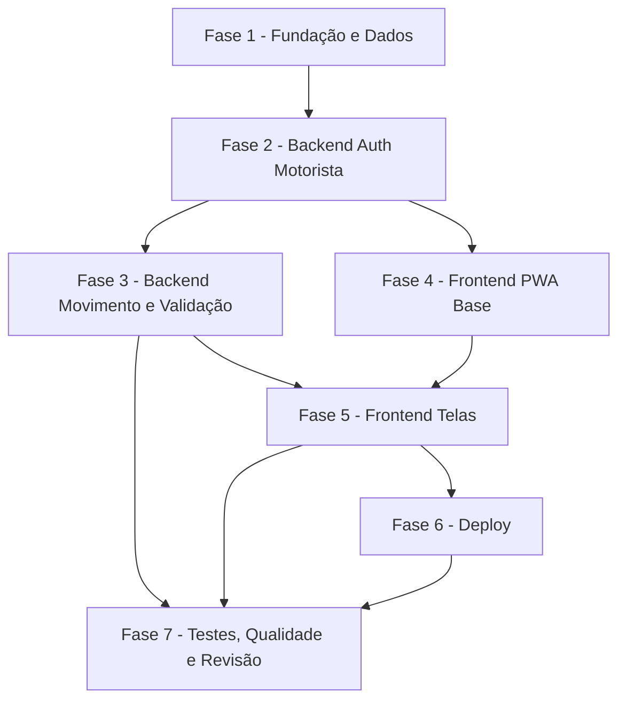

# Tarefas App Motorista (PWA) - Consulta de NF & Validação de XML

Escopo: backend Express estendido com rotas `/motorista/*` (auth por CNPJ prestador,
consulta do movimento aberto, validação de XML com bloqueio de reenvio) + novo
frontend Next.js PWA (`frontend_motorista`, Serwist) + serviço novo no
`docker-compose.yml` atrás do Traefik. Origem: `docs/specs/app-motorista-nfse/`.

**Legenda de status:**
- `[ ]` Pendente
- `[~]` Em andamento
- `[x]` Concluido
- `[!]` Bloqueado

**Legenda de criticidade:**
- `[C]` Critico - Impacto financeiro direto, segurança ou bloqueante
- `[A]` Alto - Funcionalidade essencial
- `[M]` Medio - Necessario mas sem urgencia imediata

---

## FASE 1 - Fundação e Dados

### 1.1 Tabela Motorista no PostgREST `[C]`

Ref: data-model.md §Entity Motorista; research.md Decision 3; spec FR-001/FR-002

- [x] 1.1.1 Escrever SQL idempotente `CREATE TABLE IF NOT EXISTS Motorista` (id, cnpj_prestador UNIQUE NOT NULL, senha, nome, ativo default true, created_at)
- [x] 1.1.2 Conceder permissões PostgREST (role `authenticated`) coerentes com o padrão da tabela `Empresa`
- [x] 1.1.3 Criar script de seed de 1 motorista de teste (CNPJ + senha bcrypt) para homologação
- [ ] 1.1.4 Validar via PostgREST que `Motorista?cnpj_prestador=eq.{x}` retorna o registro seedado

### 1.2 Confirmar colunas de persistência na EnvioMassa `[A]`

Ref: data-model.md §EnvioMassa; spec FR-010

- [x] 1.2.1 Confirmar empiricamente que `nota_ok` e `erro_validacao` existem na `EnvioMassa` (query PostgREST)
- [x] 1.2.2 Documentar tipos reais das colunas (bool/text) e ajustar o mapper do backend ao tipo encontrado
- [x] 1.2.3 Se ausentes, escrever migração aditiva (somente então) — caso contrário, registrar "sem migração"

---

## FASE 2 - Backend: Autenticação do Motorista

### 2.1 Middleware authenticateMotorista `[C]`

Ref: contracts/motorista-api.md; research.md Decision 1; spec FR-001/FR-002/FR-015

- [x] 2.1.1 Criar módulo de auth do motorista replicando o padrão de `authenticateToken` (lê cookie `accessToken`, valida `JWT_SECRET`)
- [x] 2.1.2 Definir claim do token: `cnpjPrestador` (+ `nome`); garantir que NÃO carrega senha
- [x] 2.1.3 Rejeitar token de Empresa em rotas de motorista e vice-versa (separação de audiência)
- [x] 2.1.4 Teste unit: token válido passa; ausente/expirado/empresa → 401

### 2.2 Rotas de sessão `/motorista/login|refresh|logout|verify-auth` `[C]`

Ref: contracts/motorista-api.md; spec FR-001; quickstart Cenários 1, 2

- [x] 2.2.1 `POST /motorista/login`: busca `Motorista?cnpj_prestador=eq.{}`, `bcrypt.compare`, checa `ativo`; emite cookies httpOnly (15m/7d, SameSite=Strict, Secure prod)
- [x] 2.2.2 `POST /motorista/token/refresh`: valida `refreshToken` (claim cnpjPrestador) e reemite `accessToken`
- [x] 2.2.3 `POST /motorista/logout`: limpa cookies; `GET /motorista/verify-auth`: confirma sessão
- [x] 2.2.4 Mensagens de erro pt-BR sem revelar campo (401 "Credenciais inválidas."; 403 inativa; 400 corpo)
- [x] 2.2.5 Teste integração: login ok emite cookies; login inválido 401; refresh renova; verify-auth reflete estado

### 2.3 Auto-cadastro do motorista `[C]`

Ref: contracts/motorista-api.md §register; research.md Decision 3 (R-2); spec FR-017

- [x] 2.3.1 `POST /motorista/register`: valida corpo (CNPJ, nome, senha ≥ 8) e tamanho da senha
- [x] 2.3.2 Guard: `cnpj_prestador` deve existir em `EnvioMassa` e não ter conta em `Motorista` (senão 409)
- [x] 2.3.3 Criar `Motorista` com senha em bcrypt (`ativo=true`); resposta 201
- [x] 2.3.4 Mensagens de erro sem virar oráculo de enumeração (não revelar se o CNPJ existe)
- [x] 2.3.5 Teste integração: cadastro elegível cria conta; CNPJ desconhecido 409; CNPJ já cadastrado 409; senha curta 400

---

## FASE 3 - Backend: Movimento e Validação

### 3.1 Consulta do movimento aberto `[A]`

Ref: contracts/motorista-api.md §movimento-aberto; spec FR-003/FR-004; quickstart 3, 4, 10

- [x] 3.1.1 `GET /motorista/movimento-aberto`: query `EnvioMassa?cnpj_prestador=eq.{token}&mov_fechado=eq.false&order=created_at.desc&limit=1`
- [x] 3.1.2 Mapper snake_case→camelCase (valor, dtInicial, dtFinal, nome, cnpjTomador, cnpjPrestador, tribnac, notaOk, erroValidacao)
- [x] 3.1.3 Estado vazio: retornar `{ movimento: null }` quando não há movimento aberto (FR-004)
- [x] 3.1.4 Garantir escopo por token (nunca por id do cliente) — Constituição II
- [x] 3.1.5 Teste integração: motorista A não vê dados de B; sem auth → 401; empty state correto

### 3.2 Módulo de validação NFS-e (proxy server-side) `[C]`

Ref: contracts/motorista-api.md §validar-nota; research.md Decision 5; spec FR-006/FR-012/FR-015

- [x] 3.2.1 Função `callValidacaoNfse(filename, xmlUtf8)`: monta `xml_input=JSON.stringify([{filename,data}])`, `validar_descricao_servico=false`, `nexus=false`, header `FASTAPI_VALIDATION_TOKEN`
- [x] 3.2.2 Parser da resposta (array `[{valid, details}]`) tolerante a formato inesperado → erro temporário (FR-012)
- [x] 3.2.3 Módulo mapper flag→mensagem pt-BR (7 flags) — data-model.md §ResultadoValidacao
- [x] 3.2.4 Timeout/erro do serviço externo → 502/503 sem alterar `nota_ok`/`erro_validacao` (FR-012)
- [x] 3.2.5 Teste unit do mapper e do parser (válida, inválida com N flags, resposta corrompida)

### 3.3 Rota de upload + validação + persistência `[C]`

Ref: contracts/motorista-api.md §validar-nota; spec FR-005/FR-007/FR-008/FR-009/FR-010/FR-011; quickstart 5-8

- [x] 3.3.1 `POST /motorista/validar-nota` com `multer.single('file')`; ler conteúdo UTF-8 do XML
- [x] 3.3.2 Pré-condição: parse `xml2js`; rejeitar não-XML → 400 (FR-011) sem chamar a validação
- [x] 3.3.3 Pré-condição: existe movimento aberto (senão 409) e ainda não `notaOk` (senão 409, bloqueio FR-008)
- [x] 3.3.4 Chamar `callValidacaoNfse`; se válida → PATCH `nota_ok` no movimento; resposta de sucesso (FR-007)
- [x] 3.3.5 Se inválida → PATCH `erro_validacao`; resposta com `camposInvalidos` + instrução (FR-009)
- [x] 3.3.6 Idempotência do reenvio garantida no servidor (duplo toque não cria 2 aprovações)
- [x] 3.3.7 Teste integração: válida bloqueia reenvio; inválida lista campos; não-XML 400; serviço fora 502 sem mudar estado

---

## FASE 4 - Frontend PWA: Base e Reuso

### 4.1 Scaffold do app frontend_motorista `[A]`

Ref: plan.md §Project Structure; research.md Decision 2

- [x] 4.1.1 Criar `app_homologacao/frontend_motorista/` (Next 16 + TS + Tailwind 4 + shadcn), mobile-first
- [x] 4.1.2 Copiar/adaptar do `frontend_v2`: proxy `app/api/[...path]/route.ts` (BACKEND_URL), `lib/api-client.ts` (credentials:'include', AbortController)
- [x] 4.1.3 Adaptar `contexts/auth-context.tsx` para o fluxo do motorista (`/api/motorista/*`, refresh a cada 10min)
- [x] 4.1.4 `.env.example` com `BACKEND_URL`; `next.config.mjs` com `output: standalone`
- [ ] 4.1.5 Teste smoke: app sobe local, proxy alcança o backend, login devolve cookies

### 4.2 PWA (Serwist) `[A]`

Ref: spec FR-014/US5; research.md Decision 2; quickstart 9

- [x] 4.2.1 Instalar e configurar `@serwist/next`; criar `app/sw.ts` (precache do app shell) <!-- onda-004: build validado -->
- [x] 4.2.2 Criar `public/manifest.json` (nome, ícones, `display: standalone`, `theme_color`, `start_url`)
- [x] 4.2.3 Linkar manifest no layout; ícones maskable (192/512)
- [ ] 4.2.4 Teste manual: Lighthouse PWA installable; instala na tela inicial e abre standalone

---

## FASE 5 - Frontend PWA: Telas

### 5.1 Tela de Login `[A]`

Ref: spec US1; contracts §login; quickstart 1, 2

- [x] 5.1.1 Form de login (CNPJ prestador + senha), mobile-first, via `auth-context`
- [x] 5.1.2 Erros pt-BR (credencial inválida, conta inativa, campos vazios); estados de loading
- [x] 5.1.3 Redirecionar autenticado → movimento; proteger rotas privadas (redirect ao login se 401)
- [x] 5.1.4 Tela de cadastro (CNPJ prestador + nome + senha) chamando `/api/motorista/register`; link login↔cadastro (FR-017)
- [x] 5.1.5 Cadastro: sucesso → leva ao login; erros pt-BR (409 não elegível/já existe, 400 senha curta)
- [ ] 5.1.6 Teste: login ok navega; login inválido mostra erro; cadastro elegível conclui; inelegível mostra erro

### 5.2 Tela do Movimento Aberto `[A]`

Ref: spec US2; contracts §movimento-aberto; quickstart 3, 4

- [x] 5.2.1 Card com valor, período (dtInicial/dtFinal), nome, cnpjTomador, cnpjPrestador, tribnac
- [x] 5.2.2 Estado vazio ("Nenhum movimento em aberto") e estado de erro com botão "tentar novamente"
- [x] 5.2.3 Botão de atalho → `https://www.nfse.gov.br` (`target=_blank rel=noopener`) — FR-013
- [ ] 5.2.4 Teste: render dos campos; empty state; atalho abre URL correta

### 5.3 Tela de Upload e Validação `[C]`

Ref: spec US3; contracts §validar-nota; quickstart 5-8

- [x] 5.3.1 Seleção de arquivo XML + botão "Validar"; chamar `/api/motorista/validar-nota` (uploadFile)
- [x] 5.3.2 Sucesso ("Nota ok!") + bloqueio do botão de reenvio; estado de bloqueio lido de `notaOk` ao carregar (FR-008/FR-010)
- [x] 5.3.3 Falha de validação: listar `camposInvalidos[].mensagem` + instrução de cancelar/reemitir (FR-009)
- [x] 5.3.4 Erros: não-XML (400), serviço fora (502) com mensagens pt-BR e permissão de retry
- [ ] 5.3.5 Teste: fluxo ok bloqueia; inválido lista campos; não-XML rejeita; serviço fora permite retry

---

## FASE 6 - Deploy Conteinerizado

### 6.1 Containerização do frontend_motorista `[A]`

Ref: research.md Decision 7; plan.md §V; constitution §V

- [x] 6.1.1 Dockerfile (Node 20-alpine, multi-stage, `output: standalone`) espelhando o do `frontend_v2`
- [ ] 6.1.2 Build local da imagem e teste de subida do container isolado
- [ ] 6.1.3 Tag/push para `registry.todo-tips.com/envio-massa-motorista:homologacao`

### 6.2 Serviço no docker-compose existente `[C]`

Ref: research.md Decision 7; constitution §V (aditivo, sem disputar 80/443)

- [x] 6.2.1 Adicionar serviço `frontend_motorista_homologacao` ao `app_homologacao/docker-compose.yml` (rede + `BACKEND_URL`)
- [x] 6.2.2 Labels Traefik para host próprio (ex.: `appmotorista.todo-tips.com`), porta 3000, TLS Let's Encrypt
- [x] 6.2.3 `docker compose config` valida; conferir `No containers need to be restarted` para os serviços em produção
- [x] 6.2.4 Registrar pendência de infra: criar DNS `appmotorista.todo-tips.com` → VPS (R-3)
- [ ] 6.2.5 Subir e validar acesso externo (login + fluxo) pelo host novo

---

## FASE 7 - Testes, Qualidade e Revisão

### 7.1 Roundtrip empírico do contrato `[C]`

Ref: quickstart §Roundtrip; research.md Decision 5; plan.md §Convenções de Borda

- [ ] 7.1.1 R1: chamada real a `GET /api/motorista/movimento-aberto`, capturar payload e comparar case ao contrato (corrigir mapper se divergir)
- [ ] 7.1.2 R2: chamada real a `validade_nfse` com XML de homologação; confirmar shape `[{valid,details}]`
- [ ] 7.1.3 Se a API rejeitar `xml_input=[{filename,data}]`, cair para o formato da rota existente e atualizar research.md Decision 5 + contrato
- [ ] 7.1.4 Registrar a decisão final do contrato (forma comprovada) antes de fixar o parser

### 7.2 Revisão de segurança OWASP `[C]`

Ref: constitution §I/§IV; spec FR-001/FR-002/FR-011/FR-015

- [x] 7.2.1 Rodar `owasp-security` sobre auth do motorista, upload/parse de XML e proxy de validação
- [x] 7.2.2 Verificar isolamento por `cnpj_prestador` (sem IDOR), cookies httpOnly/SameSite, sem vazar token em log/resposta
- [x] 7.2.3 Verificar tratamento de XML (entidade externa/XXE no `xml2js`), limite de tamanho de upload
- [x] 7.2.4 Corrigir achados bloqueantes antes do merge

### 7.3 Consistência e fechamento `[M]`

Ref: spec §Success Criteria; quickstart

- [x] 7.3.1 Rodar `analyze` (cross-check spec/plan/tasks) e resolver inconsistências <!-- onda-004: 17/17 FRs, 0 CRITICAL -->
- [ ] 7.3.2 Executar os 10 cenários do quickstart (manual) e registrar resultados vs SC-001..SC-006
- [x] 7.3.3 Atualizar `backend/README.md` com as rotas `/motorista/*` (Constituição III — README é contrato vivo)
- [ ] 7.3.4 Commits Conventional + abrir PR para `main`

---

## Matriz de Dependencias

## Resumo Quantitativo

| Fase | Tarefas | Subtarefas | Criticidade |
|------|---------|------------|-------------|
| 1 - Fundação e Dados | 2 | 7 | C/A |
| 2 - Backend Auth Motorista | 3 | 14 | C |
| 3 - Backend Movimento e Validação | 3 | 17 | C/A |
| 4 - Frontend PWA Base | 2 | 9 | A |
| 5 - Frontend Telas | 3 | 15 | C/A |
| 6 - Deploy | 2 | 8 | C/A |
| 7 - Testes, Qualidade e Revisão | 3 | 12 | C/M |
| **Total** | **18** | **82** | - |

## Escopo Coberto

| Item | Descricao | Fase |
|------|-----------|------|
| US1 | Login + auto-cadastro do motorista (CNPJ prestador + senha, cookies httpOnly) | 2, 5 |
| US2 | Consulta do movimento aberto (valor/período/dados fiscais) | 3, 5 |
| US3 | Upload + validação de XML com bloqueio de reenvio | 3, 5 |
| US4 | Atalho para portal NFS-e Nacional | 5 |
| US5 | Instalação como PWA (Serwist + manifest) | 4 |
| DADOS | Tabela Motorista + persistência nota_ok/erro_validacao | 1 |
| DEPLOY | Serviço novo no docker-compose atrás do Traefik | 6 |
| QA | Roundtrip empírico + revisão OWASP + cenários | 7 |

## Escopo Excluido

| Item | Descricao | Motivo |
|------|-----------|--------|
| EX-2 | Histórico/seleção de períodos fechados | Clarificação: só o movimento aberto no MVP |
| EX-3 | Histórico de validações em tabela própria | Estado em colunas da EnvioMassa basta para o bloqueio |
| EX-4 | Criação do registro DNS do host novo | Tarefa de infra fora do código (R-3) — apenas registrada |
| EX-5 | Fila offline de uploads (sync em background) | Além do MVP; PWA cobre shell offline, não envio offline |

## Nota de Handoff (onda-004)

Os checkboxes ainda `[ ]` acima estão **bloqueados por ambiente** e não podem ser
executados/validados a partir da worktree de desenvolvimento (exigem PostgREST/containers
ativos, DNS `appmotorista.todo-tips.com`, rede externa para o roundtrip real, dispositivo
para Lighthouse, ou credencial de push para o PR). Cada um tem procedimento/comando exato
em **`HANDOFF.md`** (mesma pasta). A parte implementável (código, testes, docs) está
**completa**: 45 testes verdes, `analyze` 17/17 FRs sem issue CRITICAL, build do PWA
validado. O PR (7.3.4) foi deixado como commit local — comando de abertura em `HANDOFF.md §6`
(sem push automático por ser ação externa).
