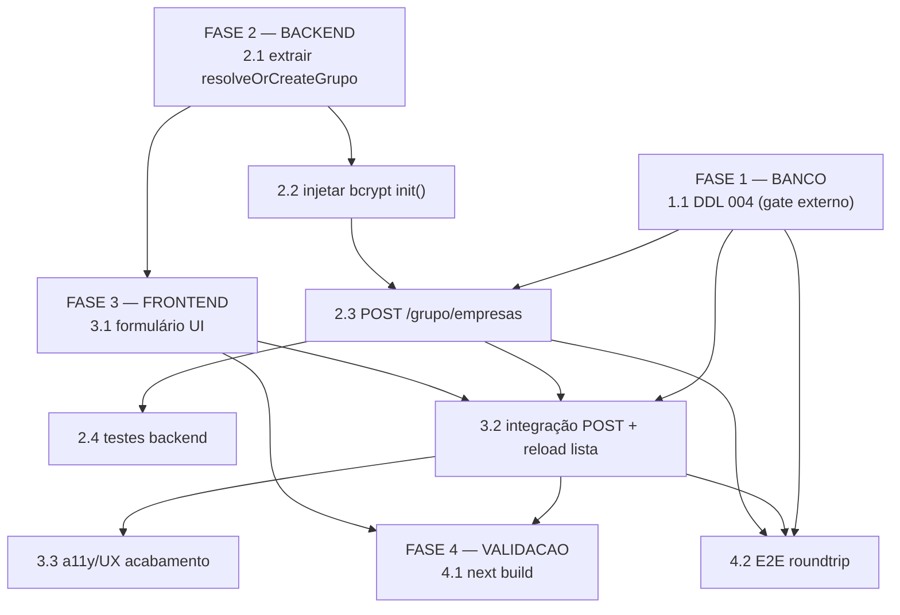

# Tarefas Cadastro de Filiais

Escopo: Formulário de cadastro de empresa filial pelo admin do grupo, com endpoint backend novo, DDL de coluna CNPJ e validação E2E.

**Legenda de status:**
- `[ ]` Pendente
- `[~]` Em andamento
- `[x]` Concluido
- `[!]` Bloqueado

**Legenda de criticidade:**
- `[C]` Critico - Impacto financeiro direto ou bloqueante
- `[A]` Alto - Funcionalidade essencial
- `[M]` Medio - Necessario mas sem urgencia imediata

---

## FASE 1 — BANCO (pré-requisito externo)

### 1.1 Aguardar operador aplicar DDL 004 + reload PostgREST `[C]`

Ref: `docs/sql/004-cadastro-filiais-cnpj.sql`, spec FR-011, quickstart pré-condições

O arquivo DDL já está gerado. Esta tarefa é um gate externo: o operador deve aplicar
o script antes do deploy do backend. Sem a coluna `cnpj` (UNIQUE) no banco, o endpoint
`POST /grupo/empresas` retorna erro em runtime.

- [ ] 1.1.1 Operador executa `psql ... < docs/sql/004-cadastro-filiais-cnpj.sql` em homologação
- [ ] 1.1.2 `NOTIFY pgrst, 'reload schema'` disparado (incluído no DDL)
- [ ] 1.1.3 Coluna `cnpj` visível via PostgREST sem erro (`GET /Empresa?select=cnpj&limit=1`)

---

## FASE 2 — BACKEND (`app_homologacao/backend`)

### 2.1 Extrair helper `resolveOrCreateGrupo(user)` de `routes/grupo.js` `[A]`

Ref: spec FR-002, plan §Phase 2, `routes/grupo.js` linhas 188-223

Extrai a lógica de resolução/criação preguiçosa do `Grupo` para função reutilizável,
sem alterar o contrato externo de `POST /grupo/filhos`.

- [ ] 2.1.1 Declarar `function resolveOrCreateGrupo(user)` no topo de `routes/grupo.js` (após requires)
- [ ] 2.1.2 Substituir bloco inline em `POST /grupo/filhos` pela chamada ao helper
- [ ] 2.1.3 Verificar regressão: `POST /grupo/filhos` funciona identicamente após o refactor

### 2.2 Injetar `bcrypt` no `init()` de `grupo.js` + atualizar `server.js` `[A]`

Ref: spec FR-005, plan §Technical Context (gap bcrypt), `server.js` ~linha 1825

`bcrypt` não está injetado em `grupo.js` atualmente. Necessário para hashing de senha
no novo endpoint.

- [ ] 2.2.1 Alterar assinatura em `grupo.js`: `init({ postgrestRequest, bcrypt })`
- [ ] 2.2.2 Atualizar chamada em `server.js` ~1825: `grupoRoutes.init({ postgrestRequest, bcrypt })`
- [ ] 2.2.3 Confirmar que `POST /grupo/filhos` continua operacional após a mudança

### 2.3 Implementar `POST /grupo/empresas` em `routes/grupo.js` `[C]`

Ref: spec FR-001..FR-007, contracts/grupo-empresas-api.md, quickstart cenários 1-8

Novo endpoint que cria empresa filial vinculada ao grupo do admin autenticado.
Usa `resolveOrCreateGrupo(req.user)` (T-2.1) e `bcrypt` injetado (T-2.2).
O `id_grupo` vem sempre do token; qualquer `id_grupo` no body é ignorado (SC-004).

- [ ] 2.3.1 Adicionar `router.post('/empresas', authenticateToken, requireGrupoPai, handler)` em `grupo.js`
- [ ] 2.3.2 Validar `nome_empresa` obrigatório (400 se ausente)
- [ ] 2.3.3 Validar `email` formato e unicidade (400 em duplicado ou inválido)
- [ ] 2.3.4 Validar `senha` regra `length >= 6 && /[A-Z]/ && /\d/` (400 se fraca)
- [ ] 2.3.5 Validar `cnpj` exatamente 14 dígitos numéricos (400 se formato inválido; 409 se UNIQUE constraint violada)
- [ ] 2.3.6 Checar limite de 100 filiais por grupo (422 se excedido)
- [ ] 2.3.7 Hashear senha: `bcrypt.hash(senha, 10)` antes do INSERT
- [ ] 2.3.8 Criar `Empresa` via `POST Empresa` no PostgREST com `id_grupo` do helper (nunca do body)
- [ ] 2.3.9 Retornar 201 `{ id, nome_empresa, email, id_grupo }` — `pass` ausente do response
- [ ] 2.3.10 Campos fiscais opcionais (`endereco`, `numero`, `cep`, `email_nota`, `observacao`) salvos quando fornecidos, nulos quando ausentes

### 2.4 Testes backend `[A]`

Ref: quickstart cenários 1-8 + cenário 10 (roundtrip shape), spec SC-001..SC-004

Se houver harness em `backend/tests/`, adicionar arquivo de testes. Caso contrário,
executar verificação manual via curl/Postman e marcar os itens abaixo.

- [ ] 2.4.1 Happy path: 201 com shape `{ id, nome_empresa, email, id_grupo }`, `pass` ausente
- [ ] 2.4.2 E-mail duplicado → 400
- [ ] 2.4.3 CNPJ duplicado → 409
- [ ] 2.4.4 CNPJ formato inválido (< ou > 14 dígitos) → 400
- [ ] 2.4.5 Senha fraca → 400
- [ ] 2.4.6 Não-admin → 403
- [ ] 2.4.7 `id_grupo` no body ignorado — response traz `id_grupo` do token (quickstart cenário 2)
- [ ] 2.4.8 Regressão: `POST /grupo/filhos` e `GET /grupo/filhos` intactos após refactor

---

## FASE 3 — FRONTEND (`app_homologacao/frontend_v2`)

### 3.1 Substituir card "vincular por ID" por formulário "Cadastrar filial" `[C]`

Ref: spec FR-001, FR-008, FR-009, FR-010, plan §Project Structure, ux checklist

Em `app/dashboard/configuracoes/grupo/page.tsx`: remover card de vínculo-por-ID e
adicionar formulário completo. Reaproveitar `PasswordStrength` do `register/page.tsx`.
Manter lista de filiais, botão desvincular e gate `isGrupoPai` intactos.

- [x] 3.1.1 Remover bloco do card "vincular por ID" do `page.tsx`
- [x] 3.1.2 Adicionar campos obrigatórios: `nome_empresa` (label "Nome da empresa"), `email` (label "E-mail"), `senha` (label "Senha"), `cnpj` (label "CNPJ")
- [x] 3.1.3 Adicionar seção "Dados fiscais" com campos opcionais: `endereco`, `numero`, `cep`, `email_nota`, `observacao` — visivelmente separada dos obrigatórios
- [x] 3.1.4 Campo senha: toggle show/hide (ícone), componente `PasswordStrength` visível ao digitar
- [x] 3.1.5 Indicação visual de campos obrigatórios (asterisco ou nota de rodapé)
- [x] 3.1.6 Botão "Cadastrar filial": desabilitado + spinner durante loading
- [x] 3.1.7 Gate `isGrupoPai` mantido (formulário oculto para não-admins; exibir mensagem informativa)
- [x] 3.1.8 Lista de filiais (`GET /grupo/filhos`) e botão desvincular (`DELETE`) preservados sem alteração

### 3.2 Integrar `POST /api/grupo/empresas` + recarregar lista pós-criar `[C]`

Ref: spec FR-002, FR-008, FR-009, contracts/grupo-empresas-api.md, quickstart cenários 1-9

Conectar o formulário ao endpoint backend. O proxy `/api/[...path]/route.ts` já
encaminha `/api/grupo/empresas` sem mudança.

- [x] 3.2.1 Implementar handler `handleCadastrarFilial(e)` com `fetch('POST /api/grupo/empresas')` e `credentials: 'include'`
- [x] 3.2.2 Body em snake_case; `id_grupo` ausente do payload enviado
- [x] 3.2.3 Sucesso (201): limpar formulário, exibir toast/banner de sucesso, recarregar lista via `GET /grupo/filhos` sem reload
- [x] 3.2.4 Erro 400: exibir mensagem por campo (e-mail inválido/duplicado, CNPJ formato, senha fraca, nome ausente)
- [x] 3.2.5 Erro 409: exibir "CNPJ já cadastrado" abaixo do campo CNPJ
- [x] 3.2.6 Erro 422: exibir mensagem de limite de filiais atingido (banner geral)
- [x] 3.2.7 Foco automático no primeiro campo inválido após erro 400 (FR-008)
- [x] 3.2.8 Botão desabilitado durante a request (evitar duplo envio — ux CHK013)

### 3.3 Acabamento a11y/UX via `/ui-ux-pro-max` (EntreGô 2.0) `[M]`

Ref: checklists/a11y.md CHK007-CHK014, checklists/ux.md CHK009/CHK015/CHK017, plan §UI design

Itens SHOULD de acessibilidade e UX copy aplicados após formulário funcional.
Usar skill `/ui-ux-pro-max` para conformidade com identidade EntreGô 2.0.

- [x] 3.3.1 `aria-live="polite"` ou `role="alert"` nas mensagens de erro (a11y CHK007)
- [x] 3.3.2 `aria-describedby` associando mensagem de erro ao campo (a11y CHK008)
- [x] 3.3.3 `aria-invalid="true"` nos campos com erro (a11y CHK009)
- [x] 3.3.4 Atributos semânticos: `type="email"`, `type="password"`, `inputmode="numeric"` no CNPJ (a11y CHK012, CHK013)
- [x] 3.3.5 Autocomplete semântico: `autocomplete="organization"` no nome, `autocomplete="email"` no e-mail (a11y CHK011)
- [x] 3.3.6 Touch targets >= 44px no botão "Cadastrar filial" e botão de desvincular (a11y CHK014)
- [x] 3.3.7 Tab order visual de cima para baixo nos campos (a11y CHK005)
- [x] 3.3.8 Foco em `nome_empresa` ao montar o formulário (a11y CHK006)
- [x] 3.3.9 Spinner com `aria-label="Salvando..."` durante loading (a11y CHK010)
- [x] 3.3.10 Copy estado vazio: "Nenhuma filial cadastrada. Preencha o formulário para adicionar a primeira." (ux CHK015)
- [x] 3.3.11 Copy não-admin: "Apenas administradores de grupo podem cadastrar filiais." (ux CHK017)
- [x] 3.3.12 Medidor de senha visível em tempo real ao digitar (ux CHK009)

---

## FASE 4 — VALIDACAO

### 4.1 `next build` limpo no `frontend_v2` `[C]`

Ref: spec SC-006, quickstart cenário 11

- [ ] 4.1.1 Rodar `next build` em `app_homologacao/frontend_v2` (exit 0)
- [ ] 4.1.2 Zero erros de TypeScript nas alterações de `page.tsx`
- [ ] 4.1.3 Nenhum warning crítico de compilação

### 4.2 Roundtrip E2E dos cenários do quickstart `[C]`

Ref: quickstart.md (11 cenários), spec SC-001..SC-006

- [ ] 4.2.1 Cenário 1 — Happy path: filial aparece na lista sem reload (SC-001)
- [ ] 4.2.2 Cenário 2 — `id_grupo` do token, não do body (SC-004)
- [ ] 4.2.3 Cenário 3 — Filial faz login imediatamente (SC-003)
- [ ] 4.2.4 Cenário 4 — E-mail duplicado → 400 com mensagem específica em PT (SC-002)
- [ ] 4.2.5 Cenário 5 — CNPJ duplicado → 409 com mensagem por campo (SC-002)
- [ ] 4.2.6 Cenário 6 — CNPJ inválido + senha fraca → 400 com foco no inválido (SC-002, FR-008)
- [ ] 4.2.7 Cenário 7 — Limite de 100 filiais → 422 (SC-002)
- [ ] 4.2.8 Cenário 8 — Não-admin: tela de bloqueio + 403 no endpoint (SC-005)
- [ ] 4.2.9 Cenário 9 — Estado vazio + `GET/DELETE /grupo/filhos` intactos (FR-010, SC-005)
- [ ] 4.2.10 Cenário 10 — Shape snake_case, `pass` ausente, contrato confirmado (SC-004)
- [ ] 4.2.11 Cenário 11 — `next build` limpo (SC-006)

---

## Matriz de Dependencias

## Resumo Quantitativo

| Fase | Tarefas | Subtarefas | Criticidade dominante |
|------|---------|------------|-----------------------|
| 1 — BANCO | 1 | 3 | C |
| 2 — BACKEND | 4 | 18 | C/A |
| 3 — FRONTEND | 3 | 21 | C/M |
| 4 — VALIDACAO | 2 | 14 | C |
| **Total** | **10** | **56** | — |

## Escopo Coberto

| Item | Descricao | Fase |
|------|-----------|------|
| DDL-004 | Coluna `cnpj` UNIQUE na tabela `Empresa` (gate operador) | 1 |
| refactor-grupo | Extração de `resolveOrCreateGrupo` + injeção de `bcrypt` | 2 |
| endpoint | `POST /grupo/empresas` com validações completas e isolamento multi-tenant | 2 |
| testes-backend | Cobertura dos 8 cenários do quickstart no backend | 2 |
| form-ui | Formulário "Cadastrar filial" substituindo card vincular-por-ID | 3 |
| integracao | Conexão frontend↔backend + recarregamento de lista sem reload | 3 |
| a11y-ux | Atributos ARIA, tipos semânticos, touch targets, copy (SHOULD) | 3 |
| build | `next build` sem erros TS (SC-006) | 4 |
| e2e | 11 cenários do quickstart verificados em homologação | 4 |

## Escopo Excluido

| Item | Descricao | Motivo |
|------|-----------|--------|
| primeiro-acesso | Fluxo de redefinição de senha na primeira filial criada | Decisão ratificada: admin define senha no formulário |
| gate-runtime-cnpj | Feature flag para coluna `cnpj` ausente em runtime | Decisão ratificada: DDL aplicado antes do deploy (research D2/D3) |
| mapper-snake-camel | Camada de conversão de nomes entre UI e API | Decisão ratificada: snake_case em todas as camadas (dec-borda) |
| proxy-mudanca | Alterações em `app/api/[...path]/route.ts` | Proxy já encaminha `/api/grupo/*` sem mudança |
| push-merge-deploy | Push, merge na main, deploy no Swarm, apply do DDL em produção | Requer autorização explícita do operador |
