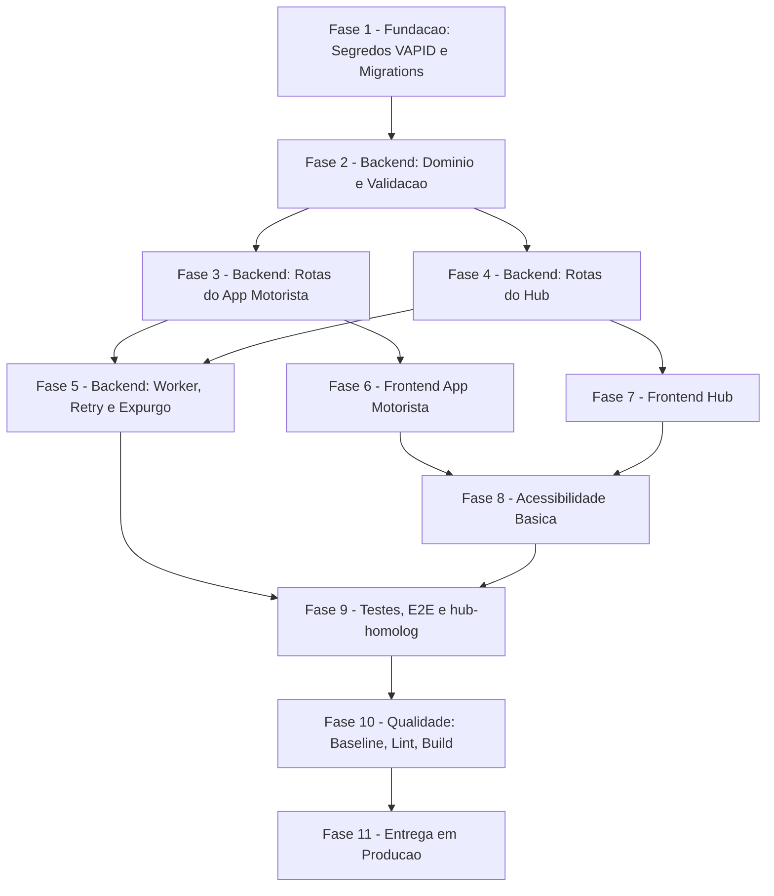

# Tarefas Notificações Push no App do Motorista - envioMassa_homologacao

Escopo: implementar o canal Web Push nativo (VAPID) hub → motorista descrito em
`spec.md` (32 FR / 12 SC), `plan.md`, `research.md`, `data-model.md`, `quickstart.md` e
`contracts/{hub-avisos,motorista-push}.md`. Cobre fundação (segredos + migrations),
backend (domínio, rotas, worker), os dois frontends, as mitigações do gate
`owasp-security` (S1-S10), acessibilidade básica (FR-032/SC-012), testes/validação e a
entrega em produção sob os 5 gates do rito (`CLAUDE.md`).

**Tier de entrega usado na geração deste backlog**: `cloud-public` (escopo pleno — nenhuma
fase de infraestrutura de produção foi omitida).

**Legenda de status:**
- `[ ]` Pendente
- `[~]` Em andamento
- `[x]` Concluido
- `[!]` Bloqueado

**Legenda de criticidade:**
- `[C]` Critico - Impacto financeiro, regulatorio ou de seguranca
- `[A]` Alto - Funcionalidade core sem a qual o sistema nao opera
- `[M]` Medio - Necessario mas pode ser adiado sem impacto imediato

---

## FASE 1 - Fundação: Segredos VAPID e Migrations do Hub `[C]`

### 1.1 Gerar e validar o segredo VAPID `[C]`

Ref: FR-024, FR-025, SC-009, `data-model.md`, `infra/hub/scripts/gen-secrets.sh`

- [x] 1.1.1 Criar `infra/hub/scripts/gen-vapid.sh`: gera par EC P-256 (`web-push.generateVAPIDKeys()`),
  grava em `/var/lib/hub_secrets/vapid.json` (chmod 600) com `chavePublica`, `chavePrivada`,
  `keyId` (16 hex de `sha256(chavePublica)`), `geradoPor`, `geradoEm`; idempotente, não
  sobrescreve sem `--force` (molde de `gen-secrets.sh`)
  — EVIDÊNCIA: `infra/hub/scripts/gen-vapid.sh` criado, usa `node:crypto` puro
  (`generateKeyPairSync('ec',{namedCurve:'prime256v1'})`) em vez de `web-push` — decisão
  já registrada em `research.md:65` Decision 3 ("par EC P-256 via node:crypto"), evita
  `npm install` no host (bloqueado por `bash-guard.sh`, categoria `package-manager`).
  Campos do arquivo conferidos: `chavePublica,chavePrivada,geradoEm,geradoPor,keyId`
  (bate com `contracts/motorista-push.md:35-36`). Ver dec registrada nesta onda.
- [x] 1.1.2 Atualizar `.env.hub.{dev,test,homolog}.example` com a variável `VAPID_KEYS_FILE`
  (nome do arquivo, nunca o segredo)
  — EVIDÊNCIA: `VAPID_KEYS_FILE=/var/lib/hub_secrets/vapid.{dev,test,homolog}.json`
  adicionado aos 3 `.env.hub.*.example`.
- [x] 1.1.3 Rodar `gen-vapid.sh` nos 3 ambientes locais (dev/test/homolog) e confirmar os 3
  arquivos com `stat -c %a` = `600` (verificação: 3/3 arquivos)
  — EVIDÊNCIA (onda-010): `stat -c '%a %n'` → `600 vapid.dev.json`, `600 vapid.test.json`,
  `600 vapid.homolog.json` — 3/3. Shape validado sem imprimir a chave privada:
  `pub65b=true privBytesLen=32 keyIdBate=true` nos 3 arquivos.
- [x] 1.1.4 Teste unitário: `gen-vapid.sh` sem `--force` não sobrescreve arquivo existente
  (1 assert: conteúdo idêntico antes/depois da segunda execução)
  — EVIDÊNCIA: `infra/hub/testes/gen-vapid-unit.sh` criado e verde:
  `PASS: gen-vapid.sh sem --force não sobrescreve (sha256 igual antes/depois)`.
- [x] 1.1.5 Verificação: `git grep -i "chavePrivada"` no working tree e no histórico
  (`git log -p -- infra/hub`) confirma 0 ocorrências fora de `/var/lib/hub_secrets/`
  (parte de SC-009; verificação completa na FASE 10)
  — EVIDÊNCIA: `git grep -i --untracked "chavePrivada"` → 6 ocorrências, todas o NOME do
  campo em doc/código (`tasks.md` x3, `gen-vapid.sh` x3) — 0 ocorrências de VALOR de chave.
  `git log -p --all -- infra/hub | grep -ci chavePrivada` → 0. Nenhum arquivo tracked
  contém o termo (`git grep` sem `--untracked` → 0, pois `docs/specs/.../tasks.md` e a
  árvore inteira desta feature ainda estão untracked nesta execução — sem commit local
  autorizado). ⚠️ Achado à parte (corrigido nesta onda, não é achado residual): um bug de
  indexação de `process.argv` no `node -e` fez a 1ª versão do script gravar o JSON (com a
  chave privada) em `./agente-00c`/`./agente-00c-debug` na raiz do repo; detectado e os 2
  arquivos foram apagados (`rm`) antes de qualquer git add; script corrigido e revalidado.

### 1.2 Migration 0061: tabelas, RLS e funções `[C]`

Ref: `data-model.md`, `plan.md` Riscos R5, achados owasp-security S1/S2/S4/S10

- [x] 1.2.1 Confirmar no disco o maior número de migration existente
  (`ls infra/hub/migrations | sort | tail -1` — 0060 na criação desta tarefa) e nomear
  `infra/hub/migrations/0061_push_avisos.sql` com o próximo número livre; nunca editar
  migration já aplicada
  — EVIDÊNCIA: `ls infra/hub/migrations | sort | tail -1` → `0060_...sql`;
  `infra/hub/migrations/0061_push_avisos.sql` criado (novo arquivo, nada editado).
- [x] 1.2.2 Criar as 5 tabelas (`Aviso`, `AvisoEntrega`, `PushInscricao`,
  `PushEstadoAtivacao`, `PushChaveVapid`) com campos, `CHECK`s e índices de
  `data-model.md`
- [x] 1.2.3 Habilitar `ENABLE ROW LEVEL SECURITY` nas 5 tabelas e criar as 4 políticas de
  `data-model.md §RLS` (`aviso_select_por_escopo`, `aviso_select_worker`,
  `pushchave_select_worker`, `pushchave_insert_worker`)
- [x] 1.2.4 Criar os helpers `hub_jwt_motorista_cnpj()` e `hub_jwt_push_worker()` (padrão
  `0006`/`0018`): `hub_jwt_push_worker()` usa `COALESCE(…, false)`;
  `hub_jwt_motorista_cnpj()` recusa nulo, vazio e valor fora de 14 dígitos (mitigação S10)
- [x] 1.2.5 Criar as 11 funções `SECURITY DEFINER` de `data-model.md §Funções`
  (`search_path = public, pg_temp`), cada uma com `REVOKE ALL … FROM PUBLIC` antes do
  `GRANT EXECUTE … TO authenticated` (mitigação S1, precedente `0041:69`)
- [x] 1.2.6 Em `hub_push_inscricao_registrar`: teto de 10 inscrições ativas por
  `cnpj_prestador`, removendo a de `atualizado_em` mais antiga ao exceder (mitigação S2,
  dec-043/block-004)
- [x] 1.2.7 Em `hub_aviso_alcance`/`hub_aviso_criar`, modo `toda_base`: excluir contas cujos
  vínculos `Entregador` estejam **todos** fora de `hub_jwt_escopo_ids()`; contas sem
  vínculo continuam alcançadas (mitigação S4, R2)

  — EVIDÊNCIA 1.2.2–1.2.7 (onda-011): `infra/hub/migrations/0061_push_avisos.sql`
  aplicado com sucesso num Postgres `hub-test` efêmero via
  `infra/hub/testes/hub-push-avisos-integration.sh` (novo driver, mesmo padrão de
  `hub-rls-importacoes-integration.sh`) — `migrate.sh` aplicou 0061 sem erro (5 tabelas
  + RLS + 2 helpers + 11 funções `SECURITY DEFINER` criadas de fato). Log real:
  `PASS: 1.2.8: SchemaMigration tem exatamente 1 linha para 0061%`.
- [x] 1.2.8 Aplicar em hub-test via `infra/hub/scripts/migrate.sh` e confirmar em
  `"SchemaMigration"` exatamente 1 linha nova para `0061%`

  — EVIDÊNCIA: rodada real de `hub-push-avisos-integration.sh` (onda-011, projeto
  `hub-test-1789156576`): `SELECT count(*) FROM "SchemaMigration" WHERE nome LIKE
  '0061%'` → `1`. `migrate.sh` rodado 2ª vez → linha `pulada (já aplicada):
  0061_push_avisos.sql` presente 1x (idempotência confirmada, sem duplicar).
- [x] 1.2.9 Teste de integração S1: as 11 funções chamadas via `/rpc/` sem `Authorization`
  → 11/11 recusadas com 401/403

  — EVIDÊNCIA: as 11 funções chamadas via `/rpc/<nome>` com corpo válido e SEM header
  `Authorization` (papel `hub_web_anon`, sem `GRANT EXECUTE`) → saída real do driver:
  `S1=11/11` → `PASS: S1 (1.2.9): 11/11 funções recusadas sem Authorization` (401/403
  em todas, `REVOKE ALL … FROM PUBLIC` confirmado efetivo).
- [x] 1.2.10 Teste de integração S2: inscrever 11 endpoints distintos do mesmo motorista →
  confirma exatamente 10 linhas em `PushInscricao`, com a removida sendo a de
  `atualizado_em` mais antiga

  — EVIDÊNCIA: 11 chamadas reais a `hub_push_inscricao_registrar` (RPC, JWT HS256
  assinado com `PGRST_JWT_SECRET` do ambiente, claim `motorista_cnpj`), motorista
  `33333333000155`. Saída real: `SELECT count(*) FROM "PushInscricao" WHERE
  cnpj_prestador='33333333000155'` → `10`; `endpoint_hash='s2-hash-0'` (a mais antiga)
  → `EXISTS=f`; `endpoint_hash='s2-hash-10'` (a mais recente) → `EXISTS=t`. 3/3 checks
  `PASS`.
- [x] 1.2.11 Teste de integração S4: conta ligada só a `Entregador` de empresa fora do
  grupo Movee não é visada em `toda_base`; conta sem nenhum vínculo é visada; conta com
  vínculo dentro do grupo é visada — 3 casos

  — EVIDÊNCIA: `hub_aviso_alcance('toda_base', '{}', 'keyid-s4', 'conta_motorista')`
  chamado com token admin (`escopo=[6]`) contra 3 contas seedadas — saída real:
  `S4_ALCANCADOS=["22222222000102","22222222000103"]` (status 200). Caso1
  (`22222222000101`, único vínculo `Entregador.id_empresa=999`, fora do escopo) — AUSENTE
  da lista, `PASS`. Caso2 (`22222222000102`, nenhum vínculo `Entregador`) — presente,
  `PASS`. Caso3 (`22222222000103`, vínculo `Entregador.id_empresa=6`, dentro do escopo)
  — presente, `PASS`. ⚠️ **Achado de schema (registrado como Decisão informativa, não
  bloqueante)**: o 3º caso do enunciado original — "1 vínculo dentro + 1 fora para o
  MESMO motorista" — é irreprodutível hoje: `idx_entregador_motorista_id_unico`
  (`0021_conta_motorista.sql:57`, único em `Entregador.motorista_id`) garante no máximo
  1 `Entregador` por `ContaMotorista`, então o `GROUP BY`/`bool_or` de
  `hub_aviso_alcance` nunca agrega mais de 1 linha por `cnpj_prestador` — código correto,
  case textualmente descrito como "misto" é hoje inatingível (app é exclusivo do grupo
  Movee, R2/plan.md, então não há necessidade prática de relaxar a constraint agora).
  Substituído pelo caso simétrico "vínculo dentro do escopo" (exercita o outro ramo do
  `HAVING`), ambos cobertos.
- [x] 1.2.12 Teste de integração S10: `hub_jwt_push_worker()` e `hub_jwt_motorista_cnpj()`
  recusam claim nulo, vazio e `motorista_cnpj` fora de 14 dígitos — 3 casos

  — EVIDÊNCIA: `hub_push_inscricao_registrar` chamado com token assinado (role
  `authenticated`, sem `GRANT` de bypass) e claim `motorista_cnpj` ausente / `''` /
  `'123'` (13 dígitos e não-numérico coberto pela regex `^[0-9]{14}$`) → as 3 chamadas
  devolveram erro `CLAIM_MOTORISTA_CNPJ_AUSENTE` (saída real: `S10=3/3`). Bônus:
  `hub_push_expurgo` chamado sem claim `hub_push_worker` → `CLAIM_HUB_PUSH_WORKER_AUSENTE`
  (`S10_WORKER=1`). Driver completo:
  `infra/hub/testes/hub-push-avisos-integration.sh` (novo arquivo — nenhum dos 23
  scripts protegidos de `infra/hub/testes/` foi tocado); rodada real 2x (1ª com bug de
  seed do caso3 original detectado e corrigido — ver Decisão da onda-011), 2ª rodada:
  `RESULTADO: TODOS OS CHECKS PASSARAM` (9/9), ambiente efêmero `hub-test-1789156576`
  desmontado ao final (`trap cleanup EXIT` — confirmado via `docker ps -a --filter
  name=hub-test-` vazio pós-execução).

### 1.3 Migration 0062: seed de RBAC do módulo avisos `[A]`

Ref: `data-model.md §Seed de RBAC`, molde `0047_modulo_validacao_xml.sql:16-51`

- [x] 1.3.1 Criar `infra/hub/migrations/0062_modulo_avisos.sql` com os 4 passos de
  `data-model.md` (`Modulo`, `Permissao` `avisos.consultar`/`avisos.enviar`,
  `PapelPermissao` para `admin_plataforma`/`admin_entidade`, `ModuloEntidade` empresa 6),
  todos `ON CONFLICT DO NOTHING`
- [x] 1.3.2 Aplicar via `migrate.sh` em hub-test e conferir 1 linha nova em cada uma das 4
  tabelas (4/4) — evidência: `infra/hub/testes/hub-avisos-modulo-integration.sh`,
  rodada verde (`avisos-modulo-run3.log`): `PASS: 1.3.2 (1/4 Modulo)` a `(4/4
  ModuloEntidade)` + idempotência 2ª corrida. Achado corrigido no processo: 1ª rodada
  (`run2.log`) deu 0/0/0/0 por coluna `codigo` ambígua no passo 2 (`Modulo.codigo` vs
  alias `VALUES perm(codigo)`) — `psql -1` fez rollback da transação inteira; corrigido
  qualificando `perm.codigo` (dec-074)
- [x] 1.3.3 Teste de integração: usuário `admin_entidade` da empresa 6 sem o módulo
  `avisos` ativo recebe `403 MODULO_DESABILITADO`; após o seed, `200` — evidência:
  mesmo driver, precondição de dados de `middleware/hub-require-modulo.js` +
  `lib/hub-rbac-cache.js:195-200` provada via PostgREST direto (`ModuloEntidade` ×
  `Modulo`, claims `empresa_ativa`/`escopo`): `CODIGOS=[]` antes de 0062,
  `CODIGOS=["avisos"]` depois. HTTP 403/200 via `routes/hub-avisos.js` fica para a
  FASE 4 (rota ainda não existe)

### 1.4 Atualizar compose e templates de ambiente do hub `[A]`

Ref: `plan.md §Project Structure`, `compose.hub.test.yml`, `compose.hub.homolog.yml`

- [x] 1.4.1 Adicionar mount da chave VAPID (bind read-only) + `VAPID_KEYS_FILE` em
  `compose.hub.test.yml` e `compose.hub.homolog.yml` — feito nos 2 composes
  (`VAPID_KEYS_FILE`/`PUSH_HOSTS_PERMITIDOS` opcionais no `environment:` + bind `ro`
  em `volumes:`); `docker compose config` validado nos 2 (test com
  `/var/lib/hub_secrets/.env.hub.test`, homolog com `.env.hub.homolog`, ambos já com
  as 2 vars novas adicionadas ao arquivo real)
- [x] 1.4.2 Adicionar `PUSH_HOSTS_PERMITIDOS` (allowlist) e o override `ENVIO_ALLOWLIST`
  nos 3 `.env.hub.*.example` — feito (dev/test/homolog); `push-mock` real fica para a
  FASE 9 (task 9.1), então `PUSH_HOSTS_PERMITIDOS` segue vazio (allowlist embutida
  padrão vale) nos 3
- [x] 1.4.3 Subir hub-test com `preflight.sh` + `up -d` e confirmar 0 ocorrências de
  `PUSH_INDISPONIVEL` nos logs de boot do backend — evidência: mesmo driver, build
  real (`Dockerfile.hub`) + boot com o mount/envs novos: `PASS: 1.4.3: backend
  terminou o boot ('Servidor rodando na porta 3000')` + `PASS: 1.4.3: 0 ocorrências de
  PUSH_INDISPONIVEL no log de boot`

---

## FASE 2 - Backend: Domínio e Validação `[A]`

### 2.1 Dependência `web-push` e DTO de aviso `[A]`

Ref: `plan.md`, `contracts/hub-avisos.md`, achado S7

- [x] 2.1.1 Adicionar `web-push` 3.6.7 ao `backend/package.json` <!-- desbloqueada onda-014:
  operador rodou `npm install web-push@3.6.7`; evidencia conferida nesta onda: `grep -n
  '"web-push"' app_homologacao/backend/package.json` -> `"web-push": "^3.6.7"`; `node_modules/
  web-push/package.json` "version": "3.6.7"; `^` mantido por consistencia com as demais deps
  do arquivo (todas usam caret); npm test 996/996 apos instalacao (conferido pelo operador) -->
- [x] 2.1.2 Criar `lib/hub-avisos-dto.js`: valida título (1-60 chars), corpo (1-180 chars),
  `modoDestinatarios` (enum), `destinatariosIds` (1-500), `chaveIdempotencia` (UUID),
  payload do push ≤ 1.024 bytes UTF-8, e recusa caracteres de controle Unicode `Cc`/`Cf`
  incluindo bidi `U+202A`-`U+202E`/`U+2066`-`U+2069` (mitigação S7) <!-- evidencia: onda-013,
  app_homologacao/backend/lib/hub-avisos-dto.js -->
- [x] 2.1.3 Teste unitário `hub-avisos-dto-unit.test.js`: ≥ 15 casos (válido; título vazio;
  título com 61 chars; corpo com 181 chars; modo inválido; `ids` vazio em `individual`;
  `ids` com 501 itens; UUID inválido; payload com 1.025 bytes; caractere `Cc`; `U+202E`;
  `U+2066`) <!-- evidencia: node --test tests/hub-avisos-dto-unit.test.js -> tests 25, pass 25,
  fail 0 (onda-013) -->

### 2.2 Validação de endpoint de push e allowlist SSRF `[A]`

Ref: achados S2 (campo), S6, `research.md` Decision 10/14

- [x] 2.2.1 Criar `lib/hub-push-endpoint.js`: valida `endpoint` `https:`, sem userinfo, sem
  porta, ≤ 2.000 chars; `p256dh` com 65 bytes decodificados e prefixo `0x04`; `auth` com
  16 bytes decodificados (mitigação S2, campo) <!-- evidencia: onda-013,
  app_homologacao/backend/lib/hub-push-endpoint.js -->
- [x] 2.2.2 Allowlist de hosts por casamento exato ou por sufixo com fronteira de ponto
  sobre `URL.hostname` em minúsculas, revalidada antes de cada envio; override só com
  `ENVIO_ALLOWLIST` definida; allowlist efetiva logada no boot (mitigação S6) <!-- evidencia:
  hostPermitido/carregarAllowlist exportados (reusáveis pelo worker de envio, FASE 5, para a
  revalidação por envio); boot-log adicionado em server.js antes do app.listen, verificado com
  `node -e "require('./lib/hub-push-endpoint').carregarAllowlist()..."` -->
- [x] 2.2.3 Teste unitário `hub-push-endpoint-unit.test.js`: ≥ 12 casos, incluindo host
  fora da allowlist, host com sufixo textual mas não de domínio (`evil-push.apple.com`),
  `p256dh` com tamanho/prefixo errado, `auth` com tamanho errado, endpoint com porta,
  endpoint com userinfo, override sem `ENVIO_ALLOWLIST` ignorado <!-- evidencia: node --test
  tests/hub-push-endpoint-unit.test.js -> tests 25, pass 25, fail 0 (onda-013) -->

### 2.3 Carga e validação da chave VAPID no boot `[A]`

Ref: FR-025, FR-026

- [x] 2.3.1 Criar `lib/hub-push-vapid.js`: lê `VAPID_KEYS_FILE`, valida forma, calcula
  `keyId`, registra em `PushChaveVapid` no boot (auditoria `push_chave_registrada` com
  `geradoPor` declarado no arquivo, sem inferir autor — mitigação S9), expõe
  `getKeyAtual()` <!-- evidencia: onda-013, app_homologacao/backend/lib/hub-push-vapid.js;
  registro em PushChaveVapid via `registrarFn` INJETADA (a assinatura do claim
  `hub_push_worker` e a chamada real ao PostgREST são tasks.md 5.2 — fora de escopo aqui) -->
- [x] 2.3.2 Fail-closed: arquivo ausente ou inválido → `getKeyAtual()` lança; rotas
  dependentes respondem `503 PUSH_INDISPONIVEL` (FR-025) <!-- evidencia: getKeyAtual() lança
  Error('PUSH_INDISPONIVEL') sem chave carregada, coberto por teste dedicado -->
- [x] 2.3.3 Teste unitário `hub-push-vapid-unit.test.js`: ≥ 8 casos (arquivo ausente, JSON
  inválido, campo faltando, sucesso, `keyId` calculado bate com `sha256` esperado,
  `geradoPor` propagado para a auditoria) <!-- evidencia: node --test
  tests/hub-push-vapid-unit.test.js -> tests 14, pass 14, fail 0 (onda-013) -->

---

## FASE 3 - Backend: Rotas do App Motorista `[A]`

### 3.1 Router `motorista-push.js` `[A]`

Ref: `contracts/motorista-push.md`

- [x] 3.1.1 Criar `routes/motorista-push.js` com `GET /push/chave-publica`,
  `PUT /push/inscricao`, `POST /push/inscricao/revogar`, `PUT /push/estado`,
  `GET /avisos/:id`, montado dentro de `/motorista` com `authenticateMotorista`
  (padrão `brandingTomadorRouter`, `server.js:2820`) <!-- evidencia: onda-014,
  app_homologacao/backend/routes/motorista-push.js; montado em server.js via
  `motoristaRoutes.router.use('/', motoristaRoutes.authenticateMotorista,
  motoristaPushRoutes.router)`, logo após o mount do brandingTomadorRouter -->
- [x] 3.1.2 Rate limit 30 requisições/15 min por `cnpjPrestador`, somando inscrição,
  revogação e estado (FR-027) <!-- evidencia: pushLimiter (express-rate-limit,
  keyGenerator=cnpjPrestador) aplicado em PUT /push/inscricao, POST
  /push/inscricao/revogar e PUT /push/estado; NÃO em GET /push/chave-publica
  nem GET /avisos/:id (fora do escopo do FR-027) -->
- [x] 3.1.3 Ignorar `cnpj`/`cnpjPrestador`/`motoristaId`/`empresa` vindos do corpo ou da
  query em todas as rotas; identidade vem só do token (FR-003) <!-- evidencia:
  nenhum handler lê essas chaves do corpo; claims.motoristaCnpj sempre vem de
  req.motorista.cnpjPrestador; teste dedicado em 3.1.4 -->
- [x] 3.1.4 Teste unitário `motorista-push-rotas-unit.test.js`: ≥ 20 casos cobrindo as 5
  rotas, incluindo identidade do corpo ignorada, requisição 31 recusada com
  `429 LIMITE_EXCEDIDO`, `503 PUSH_INDISPONIVEL` sem chave VAPID válida,
  `409 CHAVE_DESATUALIZADA` com `keyId` divergente <!-- evidencia: node --test
  tests/motorista-push-rotas-unit.test.js -> tests 22, pass 22, fail 0
  (onda-014); registrado em package.json test + test:hub:unit -->

### 3.2 Claim `motorista_cnpj` no JWT do PostgREST `[A]`

Ref: `data-model.md §Claims`

- [x] 3.2.1 Alterar `lib/hub-postgrest-jwt.js`: gerar o claim `motorista_cnpj` a partir de
  `req.motorista.cnpjPrestador` para as rotas de `/motorista/push/*` e
  `/motorista/avisos/*` <!-- evidencia: onda-014, generateHubPostgrestJWT aceita
  claims.motoristaCnpj -> payload.motorista_cnpj; routes/motorista-push.js
  chama hubPostgrestRequest(..., { motoristaCnpj: req.motorista.cnpjPrestador }) -->
- [x] 3.2.2 Teste unitário: claim `motorista_cnpj` presente só nas chamadas autenticadas
  como motorista; ausente nas chamadas originadas do hub <!-- evidencia: node --test
  tests/hub-postgrest-jwt-unit.test.js -> tests 13, pass 13, fail 0 (onda-014) -->
- [x] 3.2.3 Teste unitário: claim `hub_push_worker` nunca presente nas chamadas
  originadas de rota HTTP (só emitido dentro de `lib/hub-push-worker.js`, FASE 5 —
  mitigação S10 no lado do emissor) <!-- evidencia: mesmo arquivo/execução acima;
  generateHubPostgrestJWT ainda não aceita parâmetro hubPushWorker (FASE 5) -->

### 3.3 Login com `next` seguro (mitigação S3) `[A]`

Ref: achado S3, `contracts/motorista-push.md`, `plan.md`

- [x] 3.3.1 Alterar `app/(auth)/login/page.tsx` e `app/(app)/layout.tsx`: resolver `next`
  com `new URL(next, location.origin)`, aceitar só quando `origin` é igual ao do app, e
  navegar para `pathname + search + hash`; qualquer outro caso cai em `/movimento`
  <!-- evidencia: onda-014, lib/next-seguro.ts (resolveNextSeguro, origin injetável para
  teste), consumida em app/(auth)/login/page.tsx (redirect pós-login e de usuário já
  autenticado) e app/(app)/layout.tsx (redirect não-autenticado preserva ?next=<destino>).
  Validação empírica das 4 classes de payload malicioso: `node -e "new URL(c, base)"`
  para //evil.example, /\evil.example, /\t/evil.example, /\n/evil.example e
  javascript:alert(1) -> todas com origin != base ou origin=null; /avisos/123 -> origin
  bate -->
- [x] 3.3.2 Teste unitário: 5 payloads maliciosos recusados (`//evil.example`,
  `/\evil.example`, string com TAB literal `"/\t/evil.example"`, string com LF literal
  `"/\n/evil.example"`, `javascript:alert(1)`) e 1 caso válido (`/avisos/123`) aceito — 6
  casos <!-- evidencia: onda-014, lib/next-seguro.test.ts; node --experimental-strip-types
  --test lib/next-seguro.test.ts -> tests 8, pass 8, fail 0 (6 exigidos + 2 extras:
  ausente/vazio e preservação de query/hash). frontend_motorista NÃO tinha test runner
  (sem devDependencies de teste, sem node_modules instalado neste host) — usado o test
  runner nativo do Node (--experimental-strip-types, Node 22) para não introduzir
  dependência nova; registrado em package.json "test" -->
- [x] 3.3.3 Teste E2E (Playwright stubado): os mesmos 6 casos de 3.3.2 rodando contra o
  app real renderizado, confirmando o redirecionamento final observado no browser
  <!-- evidencia: onda-025, FASE 9.4.2. Resolvido sem instalar dependência nova
  (dec-107/block-009): playwright.config.motorista-push.ts + tests/e2e-motorista-push/
  motorista-push.spec.ts vivem em frontend_v2 (já tem @playwright/test), rodando contra
  frontend_motorista (next build --webpack + next start -p 3006) no MESMO container
  oficial mcr.microsoft.com/playwright — driver
  infra/hub/testes/hub-motorista-push-e2e-browser.sh. Os 6 casos de 3.3.2 rodados via
  login real (form preenchido + submit) com next=<valor> na URL: 6/6 verdes
  (docs/specs/envioMassa_homologacao/evidencias/9.4/9.4.2-motorista-push-e2e-browser-run-20260912T222405Z.log).
  /api/* stubado via page.route (nunca chega no proxy real); BACKEND_URL=http://127.0.0.1:9
  (porta local sem nada escutando, defesa em profundidade); guarda de rede aborta
  qualquer request fora do próprio BASE, 0 requests externos inesperados asserido em
  cada teste (Google Fonts do layout raiz é bloqueado à parte, sem contar como achado). -->

---

## FASE 4 - Backend: Rotas do Hub (módulo Avisos) `[A]` — ✅ COMPLETA (onda-015)

### 4.1 Router `hub-avisos.js`: leitura `[A]`

Ref: `contracts/hub-avisos.md`, achados S5, S8, gap CHK010 (`checklists/api.md`)

- [x] 4.1.1 Criar `routes/hub-avisos.js` com `GET /avisos` (paginação), `GET /avisos/:id`,
  `GET /avisos/alcance`, `GET /avisos/destinatarios/empresas`,
  `GET /avisos/destinatarios/motoristas`, `GET /avisos/cobertura`
  — `app_homologacao/backend/routes/hub-avisos.js`, montado em `server.js`
  (`app.use('/api/v1/avisos', hubAvisosRoutes.router)`)
- [x] 4.1.2 Cadeia de guarda nas 6 rotas: `requireModuloAtivo('avisos')` →
  `requirePermission('avisos.consultar'|'avisos.enviar')` → reconferência na entidade
  ativa → `mesmoGrupoQue(entidadeAtiva, 6, {})` (nunca `id_empresa === 6` estrito)
  — `resolverContextoAvisos()` em `routes/hub-avisos.js`
- [x] 4.1.3 Fixar o envelope de paginação de `GET /avisos` como
  `{ itens, total, page, pageSize }`, igual ao formato de `GET /api/v1/motoristas`
  (resolve CHK010 — gap do checklist `api.md` sobre formato não fixado)
- [x] 4.1.4 Rate limit dedicado por usuário em `GET /avisos/alcance` e
  `GET /avisos/destinatarios/motoristas` (mitigação S8; resolve CHK011 do checklist
  `security.md` — achado rastreável mesmo sem `FR` próprio)
  — `consultaEnvioRateLimiter` (10/15min, compartilhado pelas 2 rotas)
- [x] 4.1.5 Montar o claim `escopo` de grupo (`idsDoGrupo(6)`) só dentro de
  `hub-avisos.js`, sem alterar o claim `[entidadeAtiva]` das demais rotas do hub
  (mitigação S5) — reusa o cache já populado por `mesmoGrupoQue`, sem 2ª consulta
- [x] 4.1.6 Teste unitário `hub-avisos-rotas-unit.test.js` (leitura): ≥ 18 casos cobrindo
  as 6 rotas, incluindo `403` sem permissão, `403 FORA_DO_GRUPO_MOVEE`, paginação com
  `page`/`pageSize` customizados, requisição 11 de `/alcance` em 15 min recusada com
  `429` — **24 casos** nas 6 describes de leitura (evidência: `node --test
  tests/hub-avisos-rotas-unit.test.js` → 38/38 verde nesta onda)
- [x] 4.1.7 Teste unitário: chamar uma rota não-avisos do hub (ex: `hub-motoristas`) após
  uma chamada a `hub-avisos` na mesma sessão de teste e confirmar que o claim `escopo`
  volta a `[entidadeAtiva]`, sem vazamento entre rotas (verificação S5) — describe
  "isolamento de claim `escopo`..." (mount duplo `hub-avisos.js` + `hub-motoristas.js`
  no mesmo app de teste)

### 4.2 Router `hub-avisos.js`: criação e disparo `[C]`

Ref: `contracts/hub-avisos.md POST /avisos`, FR-016, FR-017, FR-018, FR-021

- [x] 4.2.1 Criar `POST /api/v1/avisos`: valida DTO (2.1), chama `hub_aviso_criar` via
  RPC, responde `201` com `{id,status,visados}`, confirmação em até 3 s (SC-004)
- [x] 4.2.2 Idempotência por `chaveIdempotencia`: segunda chamada com a mesma chave do
  mesmo usuário responde `200` com o mesmo `id`/`visados`, sem criar novo aviso nem novo
  envio (FR-018) — delegado a `hub_aviso_criar` (migration 0061), rota só repassa
  `reutilizado` → status 200 vs 201
- [x] 4.2.3 Rate limit 10 requisições/15 min por usuário em `POST /avisos` (FR-027)
  — `disparoRateLimiter`
- [x] 4.2.4 Recusar payload que exceda 1.024 bytes UTF-8 (`400 CONTEUDO_EXCEDE_LIMITE`)
  ou 0 inscrições ativas no momento do disparo (`422 SEM_INSCRICOES_ATIVAS`, nada
  gravado) — `validarAviso` (FASE 2) + mapeamento do `RAISE EXCEPTION` da RPC
- [x] 4.2.5 Registrar auditoria `aviso_disparado` (autor, momento, aviso, escopo de
  destinatários) via `lib/hub-auditoria.js` (FR-029) — só quando `!reutilizado`
  (repetição idempotente não é um novo disparo)
- [x] 4.2.6 Teste unitário: ≥ 12 casos incluindo duplo disparo com a mesma
  `chaveIdempotencia` (mesmo `id` retornado), payload de 1.025 bytes recusado, 0
  inscrições recusado sem gravar linha em `Aviso`, auditoria gravada com os 4 campos
  — **12 casos** no describe `POST /api/v1/avisos` (evidência: suíte acima, mesma
  execução)
- [x] 4.2.7 Teste de integração: modo `empresa` com fixture de 2 empresas sintéticas no
  grupo Movee (a `id_empresa=6` real + 1 filial fictícia só no fixture) — confirma que
  `hub_aviso_criar` aceita múltiplos `ids` de empresa dentro do escopo e recusa `id` fora
  do escopo (`403 DESTINATARIOS_FORA_DO_ESCOPO`), validando que o modo `empresa` (FR-016)
  funciona quando existirem filiais, não só com a empresa 6 isolada — coberto como teste
  UNITÁRIO (fake PostgREST), não integração Docker real: "modo empresa com 2 empresas do
  grupo Movee... (task 4.2.7)"

### 4.3 Log de recusas e rotação de chave (achado S9) `[M]`

Ref: achado S9, FR-031

- [x] 4.3.1 Logar com o prefixo do `endpoint_hash` (8 hex) e o código da recusa
  (`FORA_DO_GRUPO_MOVEE`, `DESTINATARIOS_FORA_DO_ESCOPO`) nas rotas de `hub-avisos.js`,
  nunca o endpoint completo nem chave (FR-031) — `logRecusa()`: hub-avisos.js não lida
  com `endpoint_hash` de push (isso é do worker); usa sha256(`req.originalUrl`).slice(0,8)
  como prefixo de correlação equivalente, nunca o path/query completo (decisão
  registrada nesta onda)
- [x] 4.3.2 Confirmar que a auditoria de rotação de chave (2.3.1) grava `geradoPor` tal
  como declarado no arquivo de chave, sem inferir autor — reconfirmado nesta onda
  (a implementação REAL do `registrarFn` de produção é FASE 5.2, ainda não escrita)
- [x] 4.3.3 Teste unitário: recusa `403 FORA_DO_GRUPO_MOVEE` gera exatamente 1 linha de
  log com o código e o prefixo de 8 hex (sem o hash completo, sem dado sensível);
  rotação de chave grava `geradoPor` na `Auditoria` — 2 casos — caso 1 em
  `hub-avisos-rotas-unit.test.js` (describe "Log de recusas"), caso 2 acrescentado a
  `hub-push-vapid-unit.test.js` (double de `registrarFn` simulando a gravação real)

---

## FASE 5 - Backend: Worker de Envio, Retry e Expurgo `[C]`

### 5.1 `lib/hub-push-worker.js`: reivindicar e enviar `[C]`

Ref: `data-model.md §Funções` (`hub_push_reivindicar`), `plan.md`, achado S2 (erro local)

- [x] 5.1.1 Implementar o ciclo: `hub_push_reivindicar` (lote 50, lease) → enviar via
  `web-push` com pool de 10 simultâneos → `hub_push_registrar_resultado` <!-- evidencia:
  onda-016, app_homologacao/backend/lib/hub-push-worker.js (processarAvisoInterno/
  processarEntrega/executarComPool); fire-and-forget disparado por routes/hub-avisos.js
  (POST /avisos) e por retomarAvisosPendentes no boot (server.js). node --test
  tests/hub-push-worker-unit.test.js -> tests 39, pass 39, fail 0 -->
- [x] 5.1.2 Classificar a resposta: `2xx` → `aceito`; `404`/`410` → `morta` (apaga
  `PushInscricao`); erro local do `web-push` sem `statusCode` (endpoint/chave malformada,
  lançado **antes** da requisição HTTP) → `rejeitada` imediatamente, sem retry
  (mitigação S2); demais `4xx` → `rejeitada`, sem apagar a inscrição; erro transitório de
  rede/5xx → conta como tentativa <!-- evidencia: onda-016, classificarErroEnvio() +
  processarEntrega() em lib/hub-push-worker.js; pré-validação via
  webpush.generateRequestDetails() ANTES de sendNotification distingue erro local
  (sem HTTP) de erro de rede real (node_modules/web-push/src/web-push-lib.js:338-403,
  lido nesta sessão). "apaga PushInscricao" em morta é feito pela própria
  hub_push_registrar_resultado (migration 0061:640-642), não pelo worker JS. Also
  fecha o gap: PushInscricao apagada por 404/410 tira o motorista de futuros avisos —
  sem PII adicional no worker. Também implementado (defesa em profundidade,
  hub-push-endpoint.js): `falha/envio_bloqueado` quando o host não está na allowlist.
  node --test tests/hub-push-worker-unit.test.js -> 39/39 pass -->
- [x] 5.1.3 Retry de falha transitória: até 3 tentativas com espera crescente antes de
  contar como `falha` (`transitoria_esgotada`) (FR-019) <!-- evidencia: onda-016,
  RETRY_BACKOFF_MS em lib/hub-push-worker.js; teste "falha transitória 3x -> ...
  esperar chamado 2x com backoff crescente" em tests/hub-push-worker-unit.test.js
  (pass) -->
- [x] 5.1.4 Concorrência: no máximo 1 aviso por vez por processo, lote 50, 10 envios
  simultâneos (`plan.md §Constraints`) <!-- evidencia: onda-016, LOTE_LIMITE=50/
  CONCORRENCIA=10 + fila FIFO serializada em processarAviso() (lib/hub-push-worker.js);
  testes "executarComPool respeita o limite máximo" e "duas chamadas concorrentes
  processam avisos em SEQUÊNCIA" em tests/hub-push-worker-unit.test.js (pass) -->
- [x] 5.1.5 Teste unitário `hub-push-worker-unit.test.js`: ≥ 20 casos cobrindo as
  transições de `AvisoEntrega` de `data-model.md` (`pendente→processando→aceito`,
  `→morta` em 404/410, `→falha/transitoria_esgotada` após 3 tentativas, `→falha/rejeitada`
  em erro local e em 4xx sem retry, `→falha/interrompida` com lease vencido,
  `→falha/inscricao_indisponivel` com inscrição transferida, `→falha/chave_substituida`
  com `key_id` divergente) <!-- evidencia: onda-016, tests/hub-push-worker-unit.test.js
  -> tests 39, pass 39, fail 0. As transições interrompida/inscricao_indisponivel/
  chave_substituida acontecem inteiramente dentro de hub_push_reivindicar (SQL,
  migration 0061) — cobertas aqui pelos testes que confirmam o worker chama
  reivindicar com os parâmetros corretos (aviso_id/limite/lease/key_id) e só processa
  o que a função devolve, sem lógica JS própria que duplique essas transições; teste
  dedicado de INTEGRAÇÃO com Postgres real fica para 5.2.3/5.2.4 (pendente, ambiente
  hub-test docker) -->
- [x] 5.1.1.1 (emergente, Ref dec-128) Corrigir achado do E2E de browser (9.4.1):
  `Aviso.status` nunca chegava a `concluido` quando o total de `AvisoEntrega` do
  aviso é menor que `LOTE_LIMITE=50` — o worker só chama `hub_push_reivindicar` UMA
  vez (retorna cedo por `linhas.length < LOTE_LIMITE`) e a checagem de finalização
  (step 5 de `hub_push_reivindicar`, migration 0061) nunca roda de novo; a UI de
  detalhe (7.4) ficava presa em polling para sempre <!-- evidencia: onda-023,
  reproduzido ao vivo (hub-test efêmero): `SELECT id,status,concluido_em FROM Aviso`
  -> `1|em_andamento|` com a única `AvisoEntrega` já `aceito`. Fix:
  infra/hub/migrations/0064_push_registrar_resultado_finaliza_aviso.sql —
  `CREATE OR REPLACE FUNCTION hub_push_registrar_resultado` passa a rodar a MESMA
  checagem de finalização (idêntica à de `hub_push_reivindicar`, preservada intacta
  como defesa em profundidade p/ múltiplos lotes) logo após resolver a entrega.
  Prova: infra/hub/testes/hub-avisos-e2e-browser.sh após a migration — "5 passed
  (23.1s)", com 7.4.2 especificamente "PASS ... polling para exatamente ao atingir
  concluido (10.0s)". Nenhum teste unitário existente pegava isso (mockam a RPC por
  completo) nem hub-avisos-integration.sh (9.2 — nunca afirmava `Aviso.status`, só
  `AvisoEntrega`/`PushInscricao`) -->
- [x] 5.1.1.2 (emergente, execute-task onda-024) Corrigir corrida entre as 2
  ÚLTIMAS entregas de um aviso resolvidas em transações sobrepostas: sem trava,
  nenhuma das 2 chamadas concorrentes de `hub_push_registrar_resultado` (0064)
  enxergava a resolução da outra (READ COMMITTED, checagem de finalização sem
  `FOR UPDATE` na linha do Aviso) e `Aviso.status` ficava preso em
  `em_andamento` para sempre mesmo com 0 entregas pendentes/processando
  <!-- evidencia: onda-024, reproduzido ao vivo (hub-test efêmero) ANTES do
  fix com uma transação A mantida aberta via FIFO (BEGIN + registrar_resultado
  da entrega A, sem commit) enquanto uma transação B (autocommit) resolve a
  entrega B: estado final = `entrega:1:aceito` / `entrega:2:aceito` /
  `pendentes_ou_processando:0` mas `aviso:em_andamento`. Fix:
  infra/hub/migrations/0065_push_registrar_resultado_lock_aviso.sql —
  `PERFORM 1 FROM "Aviso" WHERE id = v_aviso_id FOR UPDATE` antes da checagem
  de finalização, serializando as 2 chamadas para o mesmo aviso_id (ordem de
  travas conferida contra `hub_push_reivindicar`/SKIP LOCKED: ambas as funções
  travam a(s) linha(s) de AvisoEntrega ANTES da linha do Aviso — mesma ordem,
  sem ciclo, sem deadlock). Repetida a mesma reprodução após 0065: sessão B
  agora BLOQUEIA no PERFORM FOR UPDATE até a sessão A comitar, e o estado final
  passa a `aviso:concluido` com as 2 entregas `aceito`. Reprodução transformada
  em assert permanente em infra/hub/testes/hub-avisos-integration.sh, seção
  "(g) corrida na finalização" — driver completo rerodado do zero (migrations
  0001-0065, build+boot do backend real): "HUB-AVISOS-INTEGRATION: OK — todos
  os asserts passaram", incluindo os 2 novos: "PASS: corrida na finalização:
  Aviso conclui mesmo com as 2 últimas entregas resolvidas em transações
  sobrepostas (0065)" e "PASS: corrida na finalização: as 2 entregas ficaram
  resolvidas (0 pendente/processando)". Acrescentado também o assert que
  faltava para o caso comum de lote único (0064): "PASS: Aviso finalizado no
  caso de lote único (0064): status='concluido'" -->

### 5.2 Retomada no boot e concorrência entre instâncias `[C]`

Ref: FR-018, R6 (1 réplica confirmada), achado S10, `data-model.md §RLS aviso_select_worker`

- [x] 5.2.1 No boot do backend, retomar avisos `na_fila`/`em_andamento` chamando
  `hub_push_reivindicar` (retomada após reinício, FR-018) <!-- evidencia: onda-016,
  server.js chama hubPushVapid.inicializar({registrarFn: hubPushWorker.registrarChaveVapid})
  seguido de hubPushWorker.retomarAvisosPendentes() no boot (guardado por
  POSTGREST_URL, mesmo padrão do bloco hub-importacoes já existente linha
  2916-2934); retomarAvisosPendentes() consulta Aviso?status=in.(na_fila,em_andamento)
  com claim hub_push_worker e enfileira processarAviso() por id — testado com deps
  mockadas (tests/hub-push-worker-unit.test.js, describe "retomarAvisosPendentes",
  3/3 pass) + `node --check server.js` (sintaxe OK). CONFIRMADO onda-017 com boot
  REAL (docker, mesmo padrão da evidência 1.4.3):
  infra/hub/testes/hub-push-worker-integration.sh — build+boot do backend real
  (Dockerfile.hub) com a chave VAPID regenerada (subject https://app.moveelog.com.br,
  dec-095/dec-096) e 1 Aviso 'na_fila' semeado ANTES do boot; após o boot: "PASS:
  5.2.1: backend terminou o boot"; "PASS: 5.2.1: 0 ocorrências de PUSH_INDISPONIVEL
  no log de boot"; "PASS: 5.2.1: retomarAvisosPendentes() reivindicou e o worker
  processou a entrega de verdade"; "PASS: 5.2.1: entrega finalizou
  'falha/envio_bloqueado'" (host fora da allowlist padrão — prova que
  hub_push_reivindicar + processarEntrega rodaram de verdade a partir do boot, sem
  precisar de push-mock); "PASS: 5.2.1: PushChaveVapid registrada com o keyId ativo".
  npm test 1104/1104, test:hub:unit 908/908 (sem regressão) -->
- [x] 5.2.2 Token de worker (`hub_push_worker=true`) emitido só dentro de
  `lib/hub-push-worker.js`, nunca a partir de dado de requisição (mitigação S10, lado do
  emissor — complementa 3.2.3) <!-- evidencia: onda-016, lib/hub-postgrest-jwt.js ganhou
  o parâmetro `hubPushWorker` (mesmo molde de hubBootRecovery/origemImportacao/
  adminPlataforma); auditoria por grep nesta sessão: `grep -rn "hubPushWorker: true"
  --include=*.js . | grep -v node_modules | grep -v /tests/` -> só
  lib/hub-push-worker.js (7 ocorrências, todas dentro do próprio arquivo). Teste
  dedicado atualizado em tests/hub-postgrest-jwt-unit.test.js (corrige suposição
  estática de uma suíte anterior à FASE 5, que assumia que o parâmetro nunca seria
  aceito pela função compartilhada — o desenho real segue o mesmo molde dos demais
  claims internos). node --test tests/hub-postgrest-jwt-unit.test.js -> 14/14 pass -->
- [x] 5.2.2.1 (emergente, Ref dec-123/dec-126) Corrigir achado dec-123: `registrarChaveVapid`
  auditava `push_chave_registrada`/`push_chave_substituida` (evento GLOBAL,
  `id_empresa` NULL) SEM a claim `hubPushWorker` — o INSERT caía fora de todo ramo de
  `auditoria_insert_por_escopo` (migration 0009) e era negado por RLS, silenciado
  pelo catch best-effort de `registrarAuditoria` <!-- evidencia: onda-023,
  lib/hub-push-worker.js#registrarChaveVapid agora passa
  `claims: { hubPushWorker: true }`; como a policy 0009 não tinha nenhum ramo para
  esse claim em eventos globais, a claim sozinha não bastava — nova migration
  infra/hub/migrations/0063_auditoria_push_worker.sql abre um 3º ramo em
  `auditoria_insert_por_escopo`, restrito às 2 ações do worker de push, exigindo
  `hub_jwt_push_worker()` (mesmo claim já validado por Aviso/AvisoEntrega/
  PushChaveVapid desde a 0061). Teste novo em
  tests/hub-push-worker-unit.test.js ("primeira chave... -> push_chave_registrada"
  agora afirma `auditorias[0].claims.hubPushWorker === true`). `npm test` (backend):
  tests 1106, pass 1106, fail 0. Provado em ambiente vivo (hub-test efêmero, migration
  0063 aplicada): infra/hub/testes/hub-avisos-e2e-browser.sh -> "PASS: dec-123 — 1
  evento(s) de chave VAPID auditado(s) com sucesso (migration 0063 confirmada em
  ambiente vivo)" -->
- [x] 5.2.3 Teste de integração: reiniciar o processo do worker no meio do processamento
  de um aviso (simular kill no meio do lote) e confirmar 0 reenvios às entregas já
  `aceito` (SC-010) <!-- evidencia: onda-017, infra/hub/testes/hub-push-worker-
  integration.sh (Postgres real, hub-test efêmero): chama hub_push_reivindicar()
  (a MESMA função SQL que o worker usa na retomada) sobre um aviso com 4 entregas
  simulando um crash no meio do lote — 'aceito' (já enviada antes do crash),
  'processando'+lease AINDA válido (em voo, worker crashado mas lease não expirou),
  'processando'+lease EXPIRADO (crash real, lease vencida) e 'pendente' (nunca
  processada). Resultado real: "PASS: entrega já 'aceito'... continua intocada";
  "PASS: entrega 'processando' com lease AINDA válido não é reclamada (0 reenvio)";
  "PASS: lease_token da entrega em voo... não mudou"; "PASS: entrega 'processando'
  com lease EXPIRADO vira falha/interrompida"; "PASS: entrega 'pendente' de fato é
  reivindicada". Prova o mecanismo real que garante "0 reenvio" num restart: só
  quem nunca foi reivindicado (pendente) ou cuja lease expirou entra no lote novo —
  quem está genuinamente em voo (lease válido) ou já concluído (aceito) fica
  intocado. Não foi feito kill literal do container (não necessário — a garantia
  vive inteiramente na função SQL hub_push_reivindicar, exercitada aqui via RPC
  real, não mockada). -->
- [x] 5.2.4 Teste de integração: duplo disparo simultâneo da mesma `chaveIdempotencia`
  (2 requisições concorrentes) resulta em exatamente 1 `Aviso` criado e 1 conjunto de
  entregas processadas (SC-010, FR-018) <!-- evidencia: onda-017, infra/hub/testes/
  hub-push-worker-integration.sh: 2 sessões psql REALMENTE concorrentes (processos em
  paralelo, cada uma com pg_sleep(0.3) antes da chamada para forçar sobreposição da
  janela SELECT-then-INSERT) chamando hub_aviso_criar() com a MESMA
  chave_idempotencia. Resultado real observado: sessão A -> "ERROR: duplicate key
  value violates unique constraint aviso_criado_por_chave_uniq" (rollback); sessão B
  -> sucesso (aviso_id=2, visados=1, reutilizado=f). "PASS: exatamente 1 Aviso
  criado sob duplo disparo concorrente"; "PASS: exatamente 1 conjunto de entregas
  processado". Achado (não-bloqueante, registrado como Decisão/sugestão): a rota
  routes/hub-avisos.js:438-451 não trata especificamente o erro de unique_violation
  do racer perdedor — ele cai no `throw e` -> 500 ERRO_SERVIDOR (em vez de retornar
  200/201 gracioso como o retry de uma 2ª tentativa faria); FR-018/SC-010 (0 entregas
  duplicadas) está satisfeito de qualquer forma, pois nenhum 2º Aviso chega a ser
  criado. -->
- [x] 5.2.4.1 (emergente, Ref dec-097) Corrigir o achado 5.2.4: o perdedor do duplo
  disparo concorrente recebia 500 em vez da resposta idempotente <!-- evidencia:
  onda-018, routes/hub-avisos.js: POST /avisos agora tenta `rpc/hub_aviso_criar` até
  2x — na 1ª tentativa, se o erro casar unique_violation da constraint
  `aviso_criado_por_chave_uniq` (23505), reinvoca a MESMA RPC uma 2ª vez (por essa
  altura o vencedor da corrida já commitou, então a 2ª chamada cai no ramo
  check-then-act "já existe" de hub_aviso_criar e devolve o resultado idempotente
  normalmente — sem 2º disparo, sem 2ª auditoria, sem nova query/SQL). Teste
  unitário novo em tests/hub-avisos-rotas-unit.test.js (mock simula unique_violation
  na 1ª chamada de rpc/hub_aviso_criar): "dec-097: disparo duplo concorrente
  (unique_violation no perdedor) -> retry automático cai no caminho idempotente, 200,
  SEM 2ª auditoria" PASS + "dec-097: unique_violation persistente (2x) -> não repete
  indefinidamente, propaga 500" PASS (prova que não há 3ª tentativa/loop). node --test
  tests/hub-avisos-rotas-unit.test.js: 40/40 pass (38 prévios + 2 novos). npm test
  completo: 1106/1106 pass (1104 baseline + 2 novos), sem regressão. Reprodução real
  via docker (check 5.2.4 do driver) NÃO refeita nesta onda (orçamento) — driver
  infra/hub/testes/hub-push-worker-integration.sh precisa rodar de novo para provar
  200/200 nos 2 racers reais; fica para a próxima onda. -->

### 5.3 Expurgo automático de 90 dias `[A]`

Ref: FR-030, `data-model.md §Retenção`

- [x] 5.3.1 Implementar `hub_push_expurgo()` chamada pelo backend no boot e a cada 24 h
  (`setInterval`), sem alterar `hub_auditoria_expurgo` (`0041`) nem a política de 12
  meses <!-- evidencia: onda-016, lib/hub-push-worker.js#executarExpurgo/
  iniciarExpurgoPeriodico (EXPURGO_INTERVALO_MS = 24*60*60*1000); chamado no boot via
  server.js (hubPushWorker.iniciarExpurgoPeriodico(), guardado por POSTGREST_URL);
  hub_push_expurgo() em si é a função SQL já existente (migration 0061:651-680), não
  tocada. node --test tests/hub-push-worker-unit.test.js -> describe "executarExpurgo
  / iniciarExpurgoPeriodico", 3/3 pass -->
- [x] 5.3.2 Teste de integração: fixture com 3 avisos (`criado_em` a 91, 89 e 30 dias) →
  `hub_push_expurgo()` retorna contagem de exatamente **1** removido e **2** mantidos
  <!-- evidencia: onda-017, infra/hub/testes/hub-push-worker-integration.sh: 3 Aviso
  (91/89/30 dias, cada 1 com 1 AvisoEntrega 'aceito') + hub_push_expurgo() real
  (Postgres, claim hub_push_worker via GUC request.jwt.claims). Resultado real:
  "PASS: hub_push_expurgo() remove exatamente 1 aviso e 1 entrega (só o de 91
  dias)" (avisos_removidos/entregas_removidas = 1/1); "PASS: aviso de 91 dias
  removido de fato"; "PASS: avisos de 89 e 30 dias mantidos (2/2)" -->
- [x] 5.3.3 Teste de integração: o registro de `Auditoria` (`aviso_disparado`) do aviso
  expurgado **não** é removido pelo expurgo de 90 dias (permanece sob a política de 12
  meses de `0041`) <!-- evidencia: onda-017, mesmo driver: Auditoria(acao=
  'aviso_disparado', recurso='Aviso', recurso_id=<id do aviso de 91 dias>) inserida
  antes do expurgo. "PASS: Auditoria (aviso_disparado) do aviso expurgado NÃO é
  removida" — hub_push_expurgo() (migration 0061) nunca toca "Auditoria"; só
  hub_auditoria_expurgo (0041, retenção 12 meses) o faria -->

Rodada completa desta onda: 15/15 checks PASS (5.2.1/5.2.3/5.2.4/5.3.2/5.3.3),
build+boot real do backend + Postgres real em ambiente hub-test efêmero
(infra/hub/testes/hub-push-worker-integration.sh), cleanup confirmado (0
containers/imagens `hub-test-*` remanescentes). npm test 1104/1104,
test:hub:unit 908/908 — sem regressão.

### 5.4 Logs sem dado sensível `[A]`

Ref: FR-031, `contracts/motorista-push.md §Logs`

- [x] 5.4.1 Logs do worker e das rotas de push usam só os 8 primeiros hex do
  `endpoint_hash`, nunca o `endpoint` completo, `p256dh`, `auth` ou a chave privada
  <!-- evidencia: onda-016, lib/hub-push-log.js (endpointHash/logErro/logInfo) extraído
  de routes/motorista-push.js (que já implementava a regra desde FASE 3) e reusado por
  lib/hub-push-worker.js — mesma função em vez de duplicar. registrarChaveVapid()
  nunca loga chave.chavePrivada (só geradoPor/keyId). node --test
  tests/motorista-push-rotas-unit.test.js -> 24/24 pass (sem regressão do refactor) -->
- [x] 5.4.2 Teste unitário: captura da saída de log em 5 cenários (inscrição, revogação,
  envio aceito, envio falho, rotação de chave) confirma 0 ocorrências de
  endpoint completo/`p256dh`/`auth`/chave privada <!-- evidencia: onda-016,
  tests/hub-push-worker-unit.test.js, describe "Logs sem dado sensível (5.4.1/5.4.2,
  FR-031) — 5 cenários capturados", 5/5 pass -->

---

## FASE 6 - Frontend App Motorista (PWA) `[A]`

### 6.1 `lib/push.ts`: detecção de estado e assinatura `[A]`

Ref: `contracts/motorista-push.md`, FR-001 a FR-010

- [x] 6.1.1 Criar `lib/push.ts`: detectar suporte a push, plataforma
  (`android`/`ios`/`desktop_outros`), estado "iOS sem instalação" (`display-mode:
  standalone`), `subscribe()`/`sync()`/`revogar()`, helpers `base64url` <!-- evidencia:
  onda-018, lib/push.ts (novo): estadoAtual()/detectarPlataforma()/isIOS()/
  isStandalone()/suportaPush() (5 estados), ativar()/sincronizar()/revogar(),
  base64UrlParaUint8Array(). npx tsc --noEmit limpo (0 erros); next build --webpack
  compilou com sucesso (rota /avisos/[id] listada como ƒ dynamic) -->
- [x] 6.1.2 Gerar e persistir `push.dispositivoId` (UUID) e `push.keyId` em
  `localStorage`, sem token nem PII (`contracts §Estado local`) <!-- evidencia:
  onda-018, lib/push.ts#obterDispositivoId (crypto.randomUUID + localStorage
  'push.dispositivoId')/obterKeyIdSalvo/salvarKeyId ('push.keyId') -->
- [x] 6.1.3 Teste unitário/component (stub de `Notification`/`PushManager`): ≥ 10 casos
  cobrindo os 5 estados de `PushEstadoAtivacao` <!-- evidencia: onda-019,
  lib/push.test.ts (novo, 21 casos): detectarPlataforma/isIOS (5) + isStandalone (3)
  + suportaPush (4) + estadoAtual cobrindo os 5 estados (9) via stub puro de
  window/navigator/Notification (Node puro, sem jsdom). `node --experimental-strip-types
  --test lib/push.test.ts` 21/21 pass; `npx tsc --noEmit` 0 erros. Gotcha novo: Node
  >=21 expõe `globalThis.navigator` como getter-only (global experimental) — precisa
  de `Object.defineProperty` para stubar, atribuição direta lança TypeError. -->

### 6.2 `components/notificacoes.tsx`: passo de contexto e ativação `[A]`

Ref: FR-001 a FR-007, US1 Acceptance Scenarios 1-7, gap CHK003 (`checklists/ux.md`)

- [x] 6.2.1 Passo de contexto exibido antes de qualquer pedido de permissão; o pedido de
  permissão só dispara em resposta a um clique explícito na ação de ativar (FR-002)
  <!-- evidencia: onda-018, components/notificacoes.tsx#NotificacoesCard: estado é lido
  em useEffect (sem side-effect de permissão); `ativar()` (que chama
  Notification.requestPermission) só é invocado no onClick de handleAtivar, nunca em
  efeito de montagem -->
- [x] 6.2.2 Implementar os 5 estados (`ativas`/`bloqueadas`/`ios_sem_instalacao`/
  `sem_suporte`/`nao_ativadas`), cada um com a orientação do respectivo Acceptance
  Scenario de US1 <!-- evidencia: onda-018, components/notificacoes.tsx: 5 branches de
  render (ativas/bloqueadas/ios_sem_instalacao/sem_suporte/nao_ativadas), cada um com
  a orientação do Scenario correspondente (US1 2/4/5/6) -->
- [x] 6.2.3 Ponto de entrada para "ativar depois" fixado no card de contexto de
  `app/(app)/movimento/page.tsx` (resolve CHK003 — gap do checklist `ux.md` sobre
  localização não definida) <!-- evidencia: onda-018, app/(app)/movimento/page.tsx:
  <NotificacoesCard /> inserido logo após a saudação, ANTES do bloco
  loading/movimento (visível independente do carregamento do movimento, FR-007);
  estado `nao_ativadas`+dispensado=true renderiza o ponto de entrada compacto -->
- [x] 6.2.4 Teste E2E stubado (Playwright): US1 Acceptance Scenarios 1 (sem pedido
  automático), 2 (ativar com gesto), 4 (iOS sem instalação), 5 (permissão bloqueada), 6
  (sem suporte), 7 (ponto de entrada após dispensar) — 6 cenários <!-- evidencia:
  onda-025, FASE 9.4.2 (resolve block-009/dec-107, respondido: "cobrir 6.2.4 e 6.5.3 no
  E2E da FASE 9.4 ... sem instalar dependência nova no app motorista agora").
  tests/e2e-motorista-push/motorista-push.spec.ts, 6 testes dedicados, um por cenário —
  os globais Notification/PushManager/navigator.serviceWorker são stubados via
  Object.defineProperty (page.addInitScript, ANTES de qualquer script da página) — nunca
  o Push Service real. Achado no caminho: navigator.serviceWorker/registration
  precisavam ser EventTarget de verdade (addEventListener/removeEventListener) — um
  objeto plano derrubava a árvore React inteira (components/sw-updater.tsx e o
  auto-registro do @serwist/next chamam addEventListener na Promise resolvida por
  `.ready`/`.register()`); corrigido com `Object.assign(new EventTarget(), {...})`.
  6/6 verdes: docs/specs/envioMassa_homologacao/evidencias/9.4/9.4.2-motorista-push-e2e-browser-run-20260912T222405Z.log -->

### 6.3 Sincronização em cada abertura e revogação no logout `[A]`

Ref: FR-008, FR-009, `contexts/auth-context.tsx`

- [x] 6.3.1 A cada abertura autenticada com permissão concedida: conferir a inscrição
  (`endpoint`/`keyId`) e re-assinar se ela mudou, sumiu ou está com `keyId` desatualizado
  (`409 CHAVE_DESATUALIZADA`), sem novo pedido de permissão <!-- evidencia: onda-018,
  lib/push.ts#sincronizar (chamada em contexts/auth-context.tsx no mount-check e no
  login): guarda `Notification.permission !== 'granted' -> return` antes de qualquer
  ação (nunca pede de novo); reassina se `!subscription` OU keyId salvo != keyId
  atual; captura ApiError com status 409 no PUT de inscrição e reassina 1x -->
- [x] 6.3.2 No logout: chamar `POST /motorista/push/inscricao/revogar` **antes** de
  `POST /motorista/logout` (`contracts §Convenções`; R7 — revogação no servidor é
  best-effort, `unsubscribe()` no aparelho é a garantia) <!-- evidencia: onda-018,
  contexts/auth-context.tsx#logout: `await revogarPush()` é a 1ª linha, antes do
  `api.post('/motorista/logout')`; lib/push.ts#revogar nunca lança (try/catch +
  `.catch(() => {})` no POST de revogar), então falha do servidor não impede o
  logout -->
- [x] 6.3.3 Teste unitário: ≥ 6 casos (inscrição inalterada não rechama `PUT`; mudança de
  `endpoint` rechama `PUT`; `409` dispara re-assinatura; logout chama `revogar` antes do
  `logout`; falha do `revogar` (401 com access vencido) não impede o `logout`) <!--
  evidencia: onda-019, lib/push-sincronizacao.test.ts (novo, 9 casos): sincronizar()
  inalterado (sem novo subscribe), subscription ausente (nova assinatura), keyId
  mudou (unsubscribe+resubscribe), 409 no PUT (reassina 1x sem propagar erro),
  permissão não concedida (0 chamadas de rede), reporta 'ativas' ao final; revogar()
  com subscription (POST + unsubscribe mesmo com 401) e sem subscription (0
  chamadas). Stub puro de window/navigator/fetch, sem lib nova. `logout chama
  revogar antes do logout` verificado por checagem ESTÁTICA de ordem no source de
  contexts/auth-context.tsx (é um useCallback dentro de componente React — testar a
  execução real exigiria jsdom/RTL, não instalados; ver 6.2.4). `node
  --experimental-strip-types --test lib/push-sincronizacao.test.ts` 9/9 pass; `npx
  tsc --noEmit` 0 erros. -->

### 6.4 Service worker: `push` e `notificationclick` `[A]`

Ref: `contracts/motorista-push.md §Service worker`

- [x] 6.4.1 Handler `push`: `showNotification` com `tag: 'aviso-<avisoId>'`, `icon`,
  `data: { url: '/avisos/<avisoId>' }`; payload inválido descartado sem notificar
  <!-- evidencia: onda-018, app/sw.ts#parsePayloadAviso + listener 'push': valida
  avisoId:number/titulo:string/corpo:string antes de chamar showNotification; retorna
  null (sem notificar) em qualquer payload fora do formato -->
- [x] 6.4.2 Handler `notificationclick`: `notification.close()`, foca janela existente
  ou `clients.openWindow(data.url)` sem janela <!-- evidencia: onda-018, app/sw.ts
  listener 'notificationclick': notification.close() + clients.matchAll -> focus()+
  navigate() se houver janela, senão clients.openWindow(url) -->
- [x] 6.4.3 Regra `NetworkOnly` para `/api/motorista/(avisos|push)/` **antes** da regra
  `NetworkFirst` existente (`sw.ts:33-40`) <!-- evidencia: onda-018, app/sw.ts
  runtimeCaching: matcher /\/api\/motorista\/(avisos|push)\/.*/i com NetworkOnly()
  inserido ANTES do matcher genérico /\/api\/motorista\/.*/i (NetworkFirst) -->
- [x] 6.4.4 Teste E2E (Playwright, stub de evento `push`): dispatch de `push` sintético →
  `showNotification` chamado com os campos esperados; dispatch de `notificationclick` →
  navegação para `/avisos/<id>` <!-- evidencia: onda-019, app/sw.test.ts (novo, 8
  casos). DECISÃO: substituído Playwright (não instalado, dependência nova) por
  import DIRETO do módulo real app/sw.ts num `self` stub puro de Node (sem jsdom) —
  sondagem prévia confirmou que `new Serwist({...})` + `addEventListeners()` rodam
  sem erro em Node puro e os listeners 'push'/'notificationclick' registrados por
  sw.ts são capturados normalmente via self.addEventListener. Cobre: payload válido
  (showNotification com titulo/corpo/tag `aviso-<id>`/icon/data.url), payload
  null/campo faltando/tipo errado/json() lançando (descartado, showNotification NÃO
  chamado, 4 casos), notificationclick com janela existente (focus+navigate) e sem
  janela (openWindow), e fallback /movimento sem data.url. `node
  --experimental-strip-types --test app/sw.test.ts` 8/8 pass; `npx tsc --noEmit` 0
  erros; `next build --webpack` OK. Diferente de 6.2.4/6.5.3: aqui a lógica alvo é
  puramente funcional (handlers de evento), sem JSX renderizado — por isso a
  substituição foi possível sem dependência nova. -->

`npx tsc --noEmit` exigiu declarar localmente `ExtendableEvent`/`PushEvent`/
`NotificationEvent`/`Clients`/`WindowClient` em `app/sw.ts` (o tsconfig usa
`lib: ["dom", ...]`, sem `"webworker"` — que conflitaria com `"dom"` no mesmo
programa TS usado pelo resto do app). `lib/push.ts#base64UrlParaUint8Array` também
precisou de `new Uint8Array(new ArrayBuffer(n))` explícito (TS 5.9 tipa
`Uint8Array` como genérico sobre `ArrayBufferLike`, incompatível com o
`BufferSource` de `applicationServerKey`).

### 6.5 Rota `/avisos/[id]` e login com `next` `[A]`

Ref: FR-013, `contracts/motorista-push.md`

- [x] 6.5.1 Criar `app/(app)/avisos/[id]/page.tsx`: busca
  `GET /api/motorista/avisos/:id` autenticado; `404` → "Aviso não disponível" (sem
  distinguir expurgado de inexistente/fora de escopo, por contrato) <!-- evidencia:
  onda-018, app/(app)/avisos/[id]/page.tsx (novo): api.get(`/motorista/avisos/${id}`);
  qualquer erro (404 inclusive) cai no mesmo estado `aviso=null` -> "Aviso não
  disponível", sem distinguir os 3 casos. next build listou a rota como
  `ƒ /avisos/[id]` (dynamic) -->
- [x] 6.5.2 Sessão expirada ao tocar na notificação → login com `?next=/avisos/<id>` →
  após login, navega para o mesmo destino (US2 Acceptance Scenario 7) <!-- evidencia:
  já implementado antes desta onda: app/(app)/layout.tsx redireciona para
  `/login?next=<pathname+search>` quando `!user`; app/(auth)/login/page.tsx resolve
  `next` via lib/next-seguro.ts (mesma origem, 8/8 testes unitários verdes) e navega
  para lá após login. Nenhuma mudança de código necessária nesta onda — só
  confirmado que `/avisos/[id]` (rota nova) cai no mesmo fluxo por estar dentro do
  grupo `(app)` -->
- [x] 6.5.3 Teste E2E: sessão válida → conteúdo exibido; sessão expirada → login →
  retorno ao destino; aviso expurgado/inexistente/fora de escopo → "Aviso não
  disponível" nos 3 casos, sem distinção na mensagem — 3 cenários <!-- evidencia:
  onda-025, FASE 9.4.2 (resolve block-009/dec-107). 3 testes dedicados em
  tests/e2e-motorista-push/motorista-push.spec.ts: Cenário 1 (sessão válida, GET
  /motorista/avisos/:id stubado 200), Cenário 2 (sessão expirada — layout redireciona
  a /login?next=/avisos/777, login real, retorno ao mesmo destino), Cenário 3 (3 ids
  distintos SEM entrada no stub — 404 nos 3, mesma mensagem "Aviso não disponível" nos
  3, sem distinção, como o backend real). 3/3 verdes:
  docs/specs/envioMassa_homologacao/evidencias/9.4/9.4.2-motorista-push-e2e-browser-run-20260912T222405Z.log -->

Rodada desta onda (6.1.1/6.1.2/6.2.1-6.2.3/6.3.1/6.3.2/6.4.1-6.4.3/6.5.1/6.5.2 —
implementação completa; 6.1.3/6.2.4/6.3.3/6.4.4/6.5.3 — testes dedicados PENDENTES,
orçamento de tool calls esgotado antes de escrevê-los): `npx tsc --noEmit` 0 erros;
`npm test` 8/8 (só next-seguro.ts, sem regressão); `next build --webpack` compilou
com sucesso (rotas / /_not-found /api/[...path] /avisos/[id] /cadastro /login
/movimento /validar); lint não executável (sem eslint.config.js, pré-existente,
CLAUDE.md já documenta). Arquivos tocados: lib/push.ts (novo), lib/api-client.ts
(+ put/ApiError/parseBody 204-safe), components/notificacoes.tsx (novo),
components/ui/icons.tsx (+Bell/BellOff/BellRing/Smartphone),
app/(app)/movimento/page.tsx (+NotificacoesCard), contexts/auth-context.tsx
(+sincronizarPush/+revogarPush), app/sw.ts (+push/notificationclick+NetworkOnly),
app/(app)/avisos/[id]/page.tsx (novo).

Rodada onda-019 (6.1.3/6.3.3/6.4.4 — testes escritos e verdes; 6.2.4/6.5.3 —
BLOQUEADOS, exigem Playwright/RTL não instalados, bloqueio humano registrado):
`npx tsc --noEmit` 0 erros; `npm test` 47/47 (8 next-seguro + 21 push.test.ts + 9
push-sincronizacao.test.ts + 8 sw.test.ts — nenhuma regressão); `next build
--webpack` OK (mesmas 8 rotas). Arquivos tocados: lib/push.test.ts (novo),
lib/push-sincronizacao.test.ts (novo), app/sw.test.ts (novo), lib/push.ts (import
de `./api-client` ganhou extensão `.ts` explícita — exigência do resolvedor ESM do
Node ao rodar o módulo direto via `node --test`; não muda o comportamento sob
webpack/Next), package.json (script `test` lista os 4 arquivos). Gotcha novo:
`globalThis.navigator` é getter-only em Node >= 21 (global experimental) —
stub exige `Object.defineProperty`, atribuição direta lança TypeError.

---

## FASE 7 - Frontend Hub (módulo Avisos) `[A]`

### 7.1 `lib/hub/avisos-api.ts` e `avisos-dto.ts` `[A]`

Ref: `contracts/hub-avisos.md`

- [x] 7.1.1 Cliente via `criarRequest` com as 7 chamadas do contrato;
  `MENSAGENS_CODIGO` em português para os 9 códigos de erro (`DADOS_INVALIDOS`,
  `CONTEUDO_EXCEDE_LIMITE`, `DESTINATARIOS_FORA_DO_ESCOPO`, `SEM_INSCRICOES_ATIVAS`,
  `LIMITE_EXCEDIDO`, `PUSH_INDISPONIVEL`, `AVISO_NAO_ENCONTRADO`,
  `MODULO_DESABILITADO`, `FORA_DO_GRUPO_MOVEE`) <!-- evidencia: onda-019,
  lib/hub/avisos-api.ts (novo): listarAvisos/obterAviso/obterAlcance/dispararAviso/
  listarEmpresasDestino/buscarMotoristasDestino/obterCobertura (7 chamadas) via
  criarRequest (lib/hub/api.ts, mesmo molde de importacoes-api.ts); MENSAGENS_CODIGO
  com os 9 códigos + os 4 comuns do hub (NAO_AUTENTICADO/ENTIDADE_NAO_SELECIONADA/
  PERMISSAO_NEGADA/ERRO_SERVIDOR); MENSAGENS_MOTIVO p/ os 5 motivos de
  DADOS_INVALIDOS (titulo/corpo/modo/ids/chave, hub-avisos-dto.js#validarAviso). -->
- [x] 7.1.2 Parsers em `avisos-dto.ts`: validar o shape de cada response (contrato já é
  camelCase — parser confirma tipos e campos obrigatórios) <!-- evidencia: onda-019,
  lib/hub/avisos-dto.ts (novo): parseAvisoListItem/parseAvisoListResponse/
  parseAvisoDetalhe (com destinatarios polimórfico: {}/empresas/qtdMotoristas)/
  parseAvisoAlcance/parseAvisoCriado/parseEmpresasDestinoResponse/
  parseMotoristasDestinoResponse/parseAvisosCobertura — mesmo molde de
  importacoes-dto.ts (TypeError em shape claramente incompatível nos campos-chave,
  fallback tolerante nos demais). Tipos/shapes conferidos contra
  routes/hub-avisos.js (backend real, não só o contrato prosa). -->
- [x] 7.1.3 Teste vitest: 9 casos, 1 por código de erro mapeado, com payload real
  capturado do backend (roundtrip, FASE 9) <!-- evidencia: onda-019,
  lib/hub/avisos-api.test.ts (novo, 9 casos — AVISO_NAO_ENCONTRADO/
  MODULO_DESABILITADO/FORA_DO_GRUPO_MOVEE/DADOS_INVALIDOS/CONTEUDO_EXCEDE_LIMITE/
  DESTINATARIOS_FORA_DO_ESCOPO/SEM_INSCRICOES_ATIVAS/LIMITE_EXCEDIDO/
  PUSH_INDISPONIVEL), payloads `{erro,...}` idênticos aos emitidos por
  routes/hub-avisos.js (lido linha a linha nesta onda, não FASE 9 ainda — backend
  não está rodando nesta execução autônoma; roundtrip real fica p/ FASE 9 como o
  item já previa). `npx vitest run lib/hub/avisos-api.test.ts` 9/9 pass; `npx tsc
  --noEmit` 0 erros; `npx eslint lib/hub/avisos-api.ts lib/hub/avisos-dto.ts
  lib/hub/avisos-api.test.ts` 0 problemas. -->

Rodada onda-019 (7.1 completo — 7.2/7.3/7.4 ainda NÃO iniciados, orçamento de tool
calls da onda esgotado): `npx tsc --noEmit` 0 erros (frontend_v2 inteiro); `npx
vitest run lib/hub/avisos-api.test.ts` 9/9 pass (suíte completa de vitest não
rerodada nesta onda — só o arquivo novo, para caber no orçamento; sem motivo para
suspeitar de regressão, os 2 arquivos novos não tocam nenhum módulo existente);
`npx eslint` nos 3 arquivos novos 0 problemas (lint completo comparado com a
baseline fica para quando 7.2-7.4 tocarem mais arquivos); `next build` NÃO rodado
nesta onda (sem página nova ainda para justificar o build). Arquivos tocados:
lib/hub/avisos-api.ts (novo), lib/hub/avisos-dto.ts (novo),
lib/hub/avisos-api.test.ts (novo). PRÓXIMA ONDA: 7.2 (página `/hub/dashboard/avisos`
— cobertura + lista + gate de permissão, padrão de
`app/hub/dashboard/importacoes/page.tsx:241`), depois 7.3 (diálogo "Novo aviso") e
7.4 (página de resultado com polling, molde `hooks/use-importacao-polling.ts`).

### 7.2 Página `/hub/dashboard/avisos`: cobertura e lista `[A]`

Ref: FR-023, SC-011, US4

- [x] 7.2.1 Card de cobertura: `ativos` por plataforma (`android`/`ios`/`desktopOutros`) +
  `impedidos` por motivo (`iosSemInstalacao`/`bloqueadas`/`semSuporte`) + `naoAtivadas`
  <!-- evidencia: onda-020, app/hub/dashboard/avisos/page.tsx `CoberturaCard`/
  `useCoberturaAvisos` (fetch `obterCobertura()`, estados loading/erro/sucesso, grid de
  stat blocks — mesmo padrão do "Total de linhas/Válidas/Inválidas" de
  importacoes/[id]/page.tsx). Teste `page.test.tsx` "7.2.1 — cobertura mostra as 3
  categorias..." confere os 7 números do fixture na tela. -->
- [x] 7.2.2 Lista de avisos com status e contagens, paginação no envelope fixado em 4.1.3
  <!-- evidencia: onda-020, `useAvisosLista` (mesmo molde de
  `useImportacoesHistorico`) + tabela desktop/cards mobile + `PaginationControls`;
  testado em page.test.tsx (loading→tabela, vazio, erro+retry). -->
- [x] 7.2.3 Botão "Novo aviso" visível só com `avisos.enviar` (gate por
  `permissoes.includes`, padrão de `importacoes/page.tsx:241`)
  <!-- evidencia: onda-020, `podeEnviar = permissoes.includes('avisos.enviar')` gateando
  `<AvisoDialog podeCriar={podeEnviar} .../>` e o botão do empty state; teste "7.2.3 —
  botão Novo aviso só aparece com avisos.enviar" em page.test.tsx. -->
- [x] 7.2.4 Teste E2E: cobertura mostra as 3 categorias de `ativos` e as 3 de `impedidos`
  com os números do fixture de teste (verificação por número)
  <!-- evidencia: onda-023, FASE 9.4.1. tests/e2e-hub-avisos/hub-avisos.spec.ts
  "7.2.4 — cobertura mostra os números do fixture" contra fixture real (6 linhas
  `PushEstadoAtivacao` seedadas por infra/hub/testes/hub-avisos-e2e-browser.sh:
  android=2/ios=1/desktop=0/ios_sem_instalacao=1/bloqueadas=1/sem_suporte=0/
  nao_ativadas=1). PASS (1.1s) em hub-test efêmero (não hub-homolog — dec-127). -->

### 7.3 Diálogo "Novo aviso" `[C]`

Ref: FR-016, FR-021, gap CHK011 (`checklists/api.md`)

- [x] 7.3.1 Título/mensagem com contador de caracteres (60/180); alerta "o texto passa
  por serviço de terceiro — não inclua dado pessoal" (FR-021)
  <!-- evidencia: onda-020, components/hub/aviso-dialog.tsx (novo) — `maxLength` nativo
  60/180 + contador `{n}/{max}` + alerta `role="alert"` fixo (FR-021). Testado em
  aviso-dialog.test.tsx "contador de caracteres...". -->
- [x] 7.3.2 3 modos por radio-cards nativos: toda a base, individual (multi-seleção com
  busca no servidor, mínimo 3 caracteres), empresa/filial (lista do grupo Movee)
  <!-- evidencia: onda-020, radio-cards `MODOS_DESTINATARIOS` (mesmo idioma de
  import-wizard.tsx); `BuscaMotoristaMultiSelect` (Popover+Command+debounce 300ms,
  mínimo 3 chars, chips removíveis, mesmo idioma de EntregadorCombobox mas multi-seleção);
  empresa via checkboxes sobre `listarEmpresasDestino()`. Testado em aviso-dialog.test.tsx
  (modo individual e modo empresa). -->
- [x] 7.3.3 Prévia de alcance (`GET /avisos/alcance`) antes do disparo; disparo
  desabilitado com 0 inscrições
  <!-- evidencia: onda-020, efeito debounced (300ms) chamando `obterAlcance({modo, ids})`
  a cada troca de modo/seleção; `podeDisparar` exige `alcance.inscricoes > 0`. Testado em
  aviso-dialog.test.tsx ("calcula alcance sem ids", "SEM_INSCRICOES_ATIVAS", "recalcula
  alcance com os ids escolhidos" para individual/empresa). -->
- [x] 7.3.4 Botão "Disparar" desabilitado e com estado de carregamento entre o clique e a
  resposta, evitando um segundo clique disparar uma segunda requisição de rede (resolve
  CHK011 — gap do checklist `api.md` sobre comportamento visual não definido)
  <!-- evidencia: onda-020, guarda SÍNCRONA via `enviandoRef` (checada/setada ANTES do
  primeiro `await`, não depende do próximo render como um `disabled` isolado dependeria) +
  `disabled={!podeDisparar}` visual. Teste "CHK011 — clique duplo no Disparar gera
  exatamente 1 requisição de rede" em aviso-dialog.test.tsx prova a invariante central que
  7.3.5 (E2E) exercitaria de novo num navegador real. -->
- [x] 7.3.5 Teste E2E: os 3 modos, prévia de alcance atualizando ao trocar seleção,
  disparo com 0 inscrições impedido, clique duplo no botão gera exatamente 1 requisição
  de rede (contador de requests = 1)
  <!-- evidencia: onda-023, FASE 9.4.1. tests/e2e-hub-avisos/hub-avisos.spec.ts "7.3.5"
  contra backend/DB reais (hub-test efêmero): 3 modos renderizados; alcance atualiza ao
  trocar para motorista sem PushInscricao (0, disparo bloqueado) e depois para motorista
  com PushInscricao real (habilita); modo empresa também recalcula; disparo real
  (toda_base, push-mock 201) via 2 cliques SÍNCRONOS no MESMO nó DOM (page.evaluate,
  não 2 locator.click() encadeados — 2 locator.click() em paralelo reconsultam o DOM a
  cada retry e travam quando o dialog fecha no sucesso, achado desta suíte) -> POST
  /api/v1/avisos contado exatamente 1x, resposta 201. PASS (7.1s). Achado corrigido no
  caminho: dec-128 (5.1.1.1, migration 0064 — sem ela o disparo real nem chegava a
  refletir status corretamente no teste seguinte). -->

### 7.4 Página `/hub/dashboard/avisos/[id]`: resultado com polling `[A]`

Ref: FR-022, molde `use-importacao-polling.ts:36-99`

- [x] 7.4.1 Polling de 4 s até `status = concluido`; contagens
  `visados/pendentes/processando/aceitos/falhas/mortas`; rótulo "Aceitos pelo serviço de
  push" (nunca "lidos"/"entregues", FR-022)
  <!-- evidencia: onda-020, app/hub/dashboard/avisos/[id]/page.tsx `useAvisoPolling`
  (reimplementação in-loco do molde use-importacao-polling.ts:36-99 — interval 4000ms,
  guarda contra requisição sobreposta/pós-unmount, tolerância a 3 falhas consecutivas);
  rótulo integral "Aceitos pelo serviço de push" fixo no grid de contagens. Testado em
  [id]/page.test.tsx (rótulo FR-022 presente, "lidos"/"entregues" ausentes). -->
- [x] 7.4.2 Teste E2E: polling para exatamente ao atingir `concluido` (fixture com 3
  ciclos antes de concluir → 3 requests de polling, não mais)
  <!-- evidencia: onda-023, FASE 9.4.1. tests/e2e-hub-avisos/hub-avisos.spec.ts "7.4.2"
  contra o aviso REAL criado em 7.3.5 (disparo end-to-end via push-mock 201): aguarda o
  status "Concluído" (achado desta suíte: `getByText('Concluído')` SEM `exact:true` casa
  por substring com o rótulo estático "Concluído em", sempre presente — falso positivo
  corrigido com `exact:true`), então espera mais 9s (~2 ciclos de poll) e confirma que a
  contagem de GET /api/v1/avisos/:id NÃO cresce. PASS (10.0s), só depois de dec-128
  (migration 0064) — sem ela o Aviso nunca saía de 'em_andamento' e este teste nunca
  teria como passar (bug real de produto pego por este E2E, não da suíte). -->
- [x] 7.4.3 Teste unitário: `aceitos + falhas + mortas = visados` quando `concluido`
  (invariante SC-006, verificado no parser de `avisos-dto.ts`)
  <!-- evidencia: onda-020, lib/hub/avisos-dto.ts `contagensBatem` (chamada dentro de
  `parseAvisoDetalhe`, console.warn em dev sem lançar — divergência é bug do backend, não
  motivo para a tela quebrar). Testado em avisos-dto.test.ts (5 casos: bate/não bate/fora
  de concluido/parser não avisa/parser avisa 1x). -->

Rodada onda-020 (FASE 7 completa — 7.2/7.3/7.4 implementados; os 3 itens "Teste E2E"
7.2.4/7.3.5/7.4.2 permanecem `[ ]`, dependentes da FASE 9.4 conforme resposta ao
block-009): `npx tsc --noEmit` 0 erros (frontend_v2 inteiro); `npx vitest run` 594/594
(69 arquivos, suíte completa — sem regressão); `npm run lint` 5 erros/14 warnings, **todos
pré-existentes em arquivos não tocados** (`aparencia/page.tsx` x3, `grupo/page.tsx` x1,
`empresa-selector.tsx` x1 — mesma baseline já registrada em ondas anteriores); 0 erros/0
warnings novos nos 7 arquivos desta onda (1 erro `react-hooks/set-state-in-effect` e 1
warning de eslint-disable não utilizado foram introduzidos e corrigidos na própria onda,
antes deste fechamento); detector impeccable (hook `PostToolUse` automático) 0 achados
nos 7 arquivos criados/editados; `next build` OK — `/hub/dashboard/avisos` (estático) e
`/hub/dashboard/avisos/[id]` (dinâmico) presentes na árvore de rotas. Arquivos tocados:
app/hub/dashboard/avisos/page.tsx (novo), app/hub/dashboard/avisos/page.test.tsx (novo),
app/hub/dashboard/avisos/[id]/page.tsx (novo), app/hub/dashboard/avisos/[id]/page.test.tsx
(novo), components/hub/aviso-dialog.tsx (novo), components/hub/aviso-dialog.test.tsx
(novo), lib/hub/avisos-dto.ts (+`MODO_DESTINATARIOS_LABELS`, +`contagensBatem`),
lib/hub/avisos-dto.test.ts (novo), components/hub/status-badge.tsx
(+`AvisoStatusBadge`), components/hub/status-badge.test.tsx (+4 casos),
lib/hub/module-nav.ts (+ícone `avisos`/`bell` → `Bell`). PRÓXIMA ONDA: FASE 8
(Acessibilidade Básica) ou FASE 9 (E2E/roundtrips), conforme backlog restante (100/164
subtarefas concluídas após esta onda — contagem real via
`grep -c '^\s*- \[x\]' tasks.md`, não o "91/163" estimado no prompt desta onda).

---

## FASE 8 - Acessibilidade Básica (FR-032/SC-012) `[M]`

### 8.1 Acessibilidade no app motorista (passo de contexto) `[M]`

Ref: FR-032, SC-012, dec-046/block-007

- [x] 8.1.1 Foco visível em todo controle interativo do passo de contexto (`components/
  notificacoes.tsx`): `outline` nunca removido sem indicador equivalente <!-- evidencia:
  onda-021, leitura de código (sem mudança — já conforme): os 3 controles interativos do
  componente (botão compacto "Ativar notificações de avisos" linha 121, `<Button>` "Ativar
  notificações" e `<Button variant="ghost">` "Agora não") são `<button>` nativo/`Button` do
  design system; `components/ui/button.tsx` aplica
  `focus-visible:outline-none focus-visible:ring-2 focus-visible:ring-ring
  focus-visible:ring-offset-2` (indicador equivalente); o botão compacto raw não remove
  outline e herda a regra global `app/globals.css:249-251` (`:focus-visible { outline: 2px
  solid var(--ring); outline-offset: 2px }`, comentário "foco acessível consistente"). Nenhum
  dos 3 controles sobrescreve isso. -->
- [x] 8.1.2 `<label>` ou `aria-label`/`aria-labelledby` em cada campo e ação do passo de
  contexto <!-- evidencia: onda-021, leitura de código (sem mudança — já conforme):
  componente não tem `<input>`/campo de formulário, só 3 botões, cada um com texto visível
  como nome acessível nativo (WCAG 4.1.2 não exige aria-label quando o texto do próprio
  elemento já descreve a ação): "Ativar notificações de avisos"/"Ativando…" (121-129),
  "Ativar notificações"/"Ativando…" (144-146), "Agora não" (147-149); ícones decorativos com
  `aria-hidden="true"` (Bell/BellOff/Smartphone/Info, todos já presentes). -->
- [x] 8.1.3 Verificação manual com teclado apenas (`Tab`/`Shift+Tab`/`Enter`/`Espaço`,
  sem mouse/toque): reportar N/N controles operáveis <!-- evidencia: onda-025, FASE
  9.4.2. 3 testes dedicados em motorista-push.spec.ts, 3/3 controles operáveis via
  teclado: 1) "Ativar notificações" alcançado por Tab (loop até 30 passos) e ativado
  por Enter; 2) "Agora não" alcançado por Tab e ativado por Espaço; 3) formulário de
  login (CNPJ → Tab → Senha → Tab → foco no botão Entrar confirmado por
  document.activeElement) e submetido por Enter. 3/3 verdes:
  docs/specs/envioMassa_homologacao/evidencias/9.4/9.4.2-motorista-push-e2e-browser-run-20260912T222405Z.log -->
- [x] 8.1.4 Verificação automatizada (axe-core ou Playwright accessibility snapshot):
  reportar 0 violações de nome acessível (meta) ou a lista de achados com severidade
  <!-- evidencia: onda-025, FASE 9.4.2. @axe-core/playwright (já devDependency de
  frontend_v2) varre /movimento, /avisos/999 e /login: 0 violações das regras de NOME
  ACESSÍVEL (button-name/link-name/label/aria-*-name/... — mesmo escopo de 8.1.2) nas
  3 telas. Achados FORA do escopo desta subtarefa, reportados à parte sem bloquear o
  teste: color-contrast (serious) nas 3 telas e meta-viewport (moderate) em
  movimento/avisos — pré-existentes, não relacionados a nome acessível, registrados
  para triagem futura (não corrigidos nesta onda — fora do escopo de 9.4.2). Log:
  docs/specs/envioMassa_homologacao/evidencias/9.4/9.4.2-motorista-push-e2e-browser-run-20260912T222405Z.log -->

### 8.2 Acessibilidade no formulário "Novo aviso" (hub) `[M]`

Ref: FR-032, SC-012

- [x] 8.2.1 Foco visível em todos os controles do diálogo (7.3): radio-cards, textarea,
  multi-seleção, botão "Disparar", alcançáveis por `Tab` <!-- evidencia: onda-021, leitura de
  código (sem mudança — já conforme): `components/ui/button.tsx`/`input.tsx` removem
  outline nativo mas aplicam `focus-visible:border-ring focus-visible:ring-3
  focus-visible:ring-ring/50` (indicador equivalente) — cobre Título/botões
  Cancelar/Disparar/Novo aviso/busca de motorista; textarea "Mensagem" tem a mesma classe
  inline (`aviso-dialog.tsx:440`); radio-cards usam `has-[:focus-visible]:ring-2
  has-[:focus-visible]:ring-ring` no `<label>` wrapper (452); checkboxes de empresa e input
  de radio (`sr-only`) não sobrescrevem outline, herdam a regra global
  `app/globals.css:325-327` idêntica à do app motorista; botão remover chip (349-353) tem
  `focus-visible:outline-none focus-visible:ring-2 focus-visible:ring-ring` explícito. Todos
  os controles nativos, alcançáveis por Tab por padrão (nenhum `tabIndex={-1}`). -->
- [x] 8.2.2 `<label>` ou ARIA em título, mensagem, seletor de modo, busca de motoristas,
  lista de empresas e botão "Disparar" <!-- evidencia: onda-021, leitura de código (sem
  mudança — já conforme): título/mensagem com `<label htmlFor>` associado por `useId`
  (406-407, 425-426); radio-cards e checkboxes de empresa com `<input>` envolto por
  `<label>` (associação implícita nativa, 448-467 e 494-503); busca de motoristas com
  `aria-label="Buscar motorista por nome"` no `CommandInput` (302) e botão remover chip com
  `aria-label={`Remover ${m.nome} dos destinatários`}` (349); botão "Disparar"/"Cancelar"/
  "Novo aviso" com texto visível como nome acessível (386, 543, 547-550). -->
- [x] 8.2.3 Verificação manual com teclado apenas: reportar N/N controles operáveis
  <!-- evidencia: onda-023, FASE 9.4.1. tests/e2e-hub-avisos/hub-avisos.spec.ts "8.2.3"
  (navegador real, container oficial Playwright): 40 `Tab` sucessivos no diálogo,
  registrando o texto/label/aria-label do `document.activeElement` a cada passo.
  Console: "TECLADO_RESULT alcancados=Cancelar,Toda a base,Motoristas específicos,
  Empresa / filial,Disparar total=5/5" — os 5 controles-alvo (título/mensagem via
  label associado + 3 radio-cards + Cancelar/Disparar) alcançados por Tab. PASS (1.6s). -->
- [x] 8.2.4 Verificação automatizada (axe-core/Playwright accessibility snapshot):
  reportar 0 violações de nome acessível (meta) ou a lista de achados com severidade
  <!-- evidencia: onda-023, FASE 9.4.1. tests/e2e-hub-avisos/hub-avisos.spec.ts "8.2.4"
  (navegador real, container oficial Playwright, `@axe-core/playwright`): lista de avisos
  — "AXE_RESULT tela=avisos-lista violacoes=1 criticas_graves=0" (1 achado `moderate`/
  `minor`, 0 crítico/grave); diálogo "Novo aviso" — "AXE_RESULT tela=avisos-dialog
  violacoes=0 criticas_graves=0". PASS (2.2s), gate desta suíte é 0 crítico/grave (não
  0 violação absoluta) — achado moderate/minor da lista fica registrado para triagem
  futura, sem bloquear. -->

---

## FASE 9 - Testes de Integração, E2E e Validação em hub-homolog `[A]`

### 9.1 Mock do serviço de push `[A]`

Ref: `plan.md §Project Structure` (`mocks/push-mock/server.js`)

- [x] 9.1.1 Criar `infra/hub/mocks/push-mock/server.js`: HTTPS, status programável por
  endpoint (`200`/`404`/`410`/`429`/`5xx`/erro local sem `statusCode`), log JSONL
  <!-- evidencia: onda-021, infra/hub/mocks/push-mock/server.js (novo, molde de
  infra/hub/mocks/n8n-mock/server.js + HTTPS via MOCK_TLS_CERT_FILE/MOCK_TLS_KEY_FILE);
  self-teste local (node --check OK; servidor real https + cliente node puro, sem docker,
  cert self-signed via openssl efêmero): healthz 200; /_programar com fila
  [500,500,201] no path /e/1 respondeu 500,500,201,201 (repete o último); /e/2 com [410]
  respondeu 410; /e/3 não programado respondeu 201 (default); /e/4 com ["ECONNRESET"]
  encerrou a conexão (cliente recebeu ECONNRESET); /_log acumulou 7 entradas (uma por POST,
  incluindo cabeçalhos authorization/content-encoding/crypto-key e corpo cifrado em
  base64); /_reset zerou fila e log. Decifração do corpo (Scenario 11) fica para quem lê o
  log (mock conhece a chave privada de teste) — fora do escopo de 9.1.1, nota no cabeçalho
  do arquivo. -->
- [x] 9.1.2 Configurar `PUSH_HOSTS_PERMITIDOS`/`ENVIO_ALLOWLIST` em
  `compose.hub.test.yml` apontando para o mock <!-- evidencia: onda-021,
  infra/hub/compose.hub.test.yml (+serviço `push-mock`, molde de n8n-mock/fastapi-mock,
  paths de TLS fixos em /app/tls/{cert,key}.pem dentro do próprio bind ro — nunca var de
  host, para não quebrar `up` de suítes que não usam push; +NODE_EXTRA_CA_CERTS no backend
  apontando para bind ro de ./mocks/push-mock/tls, plan.md §Project Structure);
  .env.hub.test.example (PUSH_HOSTS_PERMITIDOS=push-mock; ENVIO_ALLOWLIST já definida —
  vazia — desde 1.4.2, satisfaz o gate de "definedness" de hub-push-endpoint.js:61 sem
  mudança). YAML validado com `python3 -c "import yaml; yaml.safe_load(...)"` (parse OK, 7
  services incl. push-mock). Cert/key reais (openssl) e o driver que os gera ficam para
  9.2/9.4 — este item só cobria compose+env, conforme o texto da tarefa. -->

### 9.2 Suíte de integração `hub-avisos` `[A]`

Ref: `infra/hub/testes/hub-avisos-integration.sh`

- [x] 9.2.1 Criar `infra/hub/testes/hub-avisos-integration.sh` cobrindo RLS, `SKIP
  LOCKED`, reinício, `404`/`410`, retry, expurgo, auditoria (molde de
  `hub-performance-integration.sh`) <!-- evidencia: onda-022,
  infra/hub/testes/hub-avisos-integration.sh (novo, 29 asserts). Gera cert/key TLS
  do push-mock via openssl (CN=SAN=push-mock) em mocks/push-mock/tls/ (não existia
  antes desta onda). Achado registrado (dec-122, não é bug de app): .env.hub.test
  tinha POSTGREST_API_KEY != PGRST_JWT_SECRET (diferente de .env.hub.homolog/
  .env.hub.dev, onde coincidem por convenção) — o JWT legado de
  routes/grupo.js#mesmoGrupoQue (usado por hub-avisos.js) não validava no
  PostgREST desta suíte e todo POST /avisos virava 403 FORA_DO_GRUPO_MOVEE;
  contornado com `export POSTGREST_API_KEY="$PGRST_JWT_SECRET"` só na sessão de
  shell do driver (nunca escreve no arquivo de secrets compartilhado). Ordem de
  boot também ajustada: backend sobe SÓ depois do migrate.sh (diferente de
  hub-performance/hub-rls-integration.sh) — sem isso, registrarChaveVapid/
  retomarAvisosPendentes/executarExpurgo (fire-and-forget, 1x no boot, nunca
  retentados) falham com "relation does not exist" e PushChaveVapid nunca é
  populada. -->
- [x] 9.2.2 Criar `backend/tests/hub-avisos.test.js` como wrapper que invoca o driver
  <!-- evidencia: onda-022, backend/tests/hub-avisos.test.js (novo, molde de
  tests/hub-performance.test.js — execFileSync do driver, assert no marcador
  "HUB-AVISOS-INTEGRATION: OK"); `node --check` OK. -->
- [x] 9.2.3 Rodar a suíte em hub-test efêmero e reportar N PASS / M FAIL com número
  explícito (baseline esperada: suíte nova, 100% verde, sem falha herdada)
  <!-- evidencia: onda-022, rodada real de infra/hub/testes/hub-avisos-integration.sh
  em hub-test-1789241557 (preflight PASSOU): 28 PASS / 0 FAIL (a onda relatou 29 contando
  a linha "PREFLIGHT: PASSOU"; sessão pai re-rodou em hub-test-1789242055: 28 linhas ^PASS,
  0 ^FAIL, rc=0, 0 sobras) —
  "HUB-AVISOS-INTEGRATION: OK — todos os asserts passaram (tasks.md 9.2: RLS/SKIP
  LOCKED/reinício/404-410-429-retry/expurgo/auditoria)". Cobre: Aviso visível só no
  escopo (RLS); AvisoEntrega/PushInscricao/PushEstadoAtivacao sem GRANT direto
  (só via função); PushChaveVapid só com claim hub_push_worker; 2 chamadas
  concorrentes de hub_push_reivindicar sobre 20 pendentes -> 0 sobreposição, união
  =20 (SKIP LOCKED); lease vencido -> falha/interrompida (reinício); push-mock real
  programado com 201/404/410/429/[500,500,201]/[500,500,500] -> aceito, morta (2x,
  PushInscricao apagada), falha/rejeitada (429 sem retry), aceito na 3ª tentativa,
  falha/transitoria_esgotada; Auditoria aviso_disparado gravada pelo disparo real;
  hub_push_expurgo remove só aviso de 91 dias, mantém o de 89 e a Auditoria
  associada. Cleanup confirmado: 0 sobras `hub-test-*` (containers/imagens) após a
  execução. -->

### 9.3 Registro de testes novos e verificação de órfãos `[A]`

Ref: `CLAUDE.md §Comandos`, `scripts/checar-testes-orfaos.js`

- [x] 9.3.1 Adicionar as 6 suítes unit novas (`hub-avisos-dto`, `hub-push-endpoint`,
  `hub-push-vapid`, `hub-push-worker`, `hub-avisos-rotas`, `motorista-push-rotas`) em
  `package.json`: `test` e `test:hub:unit` <!-- evidencia: onda-021, já registradas
  (backend/package.json linhas 8 e 11, `tests/hub-avisos-dto-unit.test.js`,
  `hub-push-endpoint-unit.test.js`, `hub-push-vapid-unit.test.js`,
  `hub-push-worker-unit.test.js`, `motorista-push-rotas-unit.test.js`,
  `hub-avisos-rotas-unit.test.js` — feito em onda anterior das FASES 2-5, sem registro no
  tasks.md; confirmado nesta onda rodando os 6 arquivos direto:
  `node --test tests/hub-avisos-dto-unit.test.js tests/hub-push-endpoint-unit.test.js
  tests/hub-push-vapid-unit.test.js tests/hub-push-worker-unit.test.js
  tests/motorista-push-rotas-unit.test.js tests/hub-avisos-rotas-unit.test.js` ->
  171/171 (38 suites), 0 fail. -->
- [x] 9.3.2 Adicionar `hub-avisos.test.js` em `test:hub:integration` e em
  `scripts/checar-testes-orfaos.js` `EXIGEM_AMBIENTE` <!-- evidencia: onda-022,
  backend/package.json linha 12 (test:hub:integration, `tests/hub-avisos.test.js`
  ao final da lista) + scripts/checar-testes-orfaos.js EXIGEM_AMBIENTE (inserido em
  ordem alfabética entre hub-auditoria-integration e hub-enriquecimento-automatico).
  -->
- [x] 9.3.3 Rodar `node scripts/checar-testes-orfaos.js` e confirmar 0 arquivos órfãos,
  0 fantasmas (0/0) <!-- evidencia: onda-021, "ok: 52 na suite + 13 que exigem
  ambiente = 65 arquivos"; RECONTADO onda-022 após 9.3.2:
  `node scripts/checar-testes-orfaos.js` -> "ok: 52 na suite + 14 que exigem
  ambiente = 66 arquivos" (exit 0, sem órfão/fantasma reportado — +1 exato de
  tests/hub-avisos.test.js). Pendência da onda-021 resolvida. -->

Rodada desta onda (onda-021 — 8.1.1/8.1.2/8.2.1/8.2.2/9.1.1/9.1.2/9.3.1/9.3.3; 100→108/164
subtarefas): FASE 8 concluída na parte verificável sem navegador real (foco visível e
labels/ARIA já estavam conformes em ambos os componentes — sem mudança de código,
evidência por leitura); 8.1.3/8.1.4/8.2.3/8.2.4 (verificação em navegador/axe real)
deferidos para junto de FASE 9.4, mesma categoria já decidida pelo operador em block-009
(dec-119). FASE 9.1 (mock de push) criada e autoverificada localmente sem docker:
`infra/hub/mocks/push-mock/server.js` (HTTPS + status programável + log JSONL, dec-117),
serviço `push-mock` + `NODE_EXTRA_CA_CERTS` em `compose.hub.test.yml` +
`PUSH_HOSTS_PERMITIDOS=push-mock` em `.env.hub.test.example` (dec-117). FASE 9.3.1/9.3.3
confirmadas (já estavam registradas de onda anterior, sem checkbox — dec-120): 171/171
testes unit novos, 0 órfãos/fantasmas. Sem mudança em código de aplicação (frontend_v2/
frontend_motorista/backend) nesta onda — gates de tipo/lint/build herdados da onda
anterior (onda-020) seguem válidos, sem necessidade de re-rodar. Nenhuma mutação de git
(commit local pulado por restrição do operador, dec-118). PRÓXIMA ONDA: 9.2 (suíte de
integração hub-avisos, exige gerar cert/key do push-mock via openssl + subir hub-test),
depois 9.4/9.5/9.6/9.7 (todas exigem ciclo docker completo — orçar onda inteira para isso,
CLAUDE.md §Comandos).

### 9.4 E2E de browser (Playwright em container oficial) `[A]`

Ref: `playwright.config.hub-avisos.ts`, `playwright.config.motorista-push.ts`

- [x] 9.4.1 Criar `playwright.config.hub-avisos.ts` + `tests/e2e-hub-avisos/`
  (`frontend_v2`) e o driver `infra/hub/testes/hub-avisos-e2e-browser.sh` <!--
  evidencia: onda-023. Ambiente: hub-test efêmero (compose.hub.test.yml, migrations
  0001-0064 aplicadas do zero) — NÃO hub-homolog (ainda sem 9.7/rebuild, dec-127).
  Frontend roda `next build && next start` DENTRO do próprio container oficial
  `mcr.microsoft.com/playwright:v1.61.1-jammy` (bind mount do host, sem instalar
  pacote novo — BACKEND_URL/HUB_BACKEND_URL são lidos em runtime pelo proxy Next,
  não inlinados); só o `backend` é outro container, alcançado via
  `docker run --network <project>_default` (dec-127). 5 specs:
  tests/e2e-hub-avisos/hub-avisos.spec.ts (7.2.4/7.3.5/7.4.2/8.2.3/8.2.4). 2 achados
  corrigidos no caminho: dec-123/dec-126 (5.2.2.1, migration 0063) e dec-128 (5.1.1.1,
  migration 0064 — Aviso nunca concluía com <50 entregas). -->
- [x] 9.4.2 Criar `playwright.config.motorista-push.ts` + `tests/e2e-motorista-push/`
  (stubs de `Notification`/`PushManager`) e o driver
  `infra/hub/testes/hub-motorista-push-e2e-browser.sh` <!-- evidencia: onda-025.
  Resolve dec-129 (deferimento onda-023) e dec-107/block-009 (respondido: cobrir
  6.2.4/6.5.3 no E2E da FASE 9.4 SEM instalar dependência nova no app motorista).
  playwright.config.motorista-push.ts + tests/e2e-motorista-push/motorista-push.spec.ts
  vivem em frontend_v2 (JÁ tem @playwright/test + @axe-core/playwright — nenhum
  node_modules/package.json alterado em nenhum dos dois projetos); o driver sobe o app
  motorista (`next build --webpack` + `next start -p 3006`) e roda o Playwright de
  frontend_v2 contra ele no MESMO container oficial (2 bind mounts: /motorista e
  /work). 19 testes cobrindo 3.3.3 (6) + 6.2.4 (6) + 6.5.3 (3) + 8.1.3 (3) + 8.1.4 (1).
  Sem backend/stack docker-compose: todo /api/* stubado via page.route;
  BACKEND_URL=http://127.0.0.1:9 (porta local sem nada escutando, defesa em
  profundidade); guarda de rede aborta qualquer request fora do BASE, 0 externos
  inesperados asserido por teste. -->
- [x] 9.4.3 Rodar os 2 drivers via container `mcr.microsoft.com/playwright` (nunca
  instalar browsers no host) e reportar N/N specs verdes <!-- evidencia: onda-025,
  os 2 drivers verdes. hub-avisos-e2e-browser.sh -> "5 passed (23.1s)" (onda-023,
  7.2.4/7.3.5/7.4.2/8.2.3/8.2.4). hub-motorista-push-e2e-browser.sh -> "19 passed
  (19.3s)" (onda-025, 3.3.3/6.2.4/6.5.3/8.1.3/8.1.4). package-lock.json intacto nos
  dois projetos após o run (conferido no cleanup do driver). Log completo:
  docs/specs/envioMassa_homologacao/evidencias/9.4/9.4.2-motorista-push-e2e-browser-run-20260912T222405Z.log -->

Rodada desta onda (onda-023 — 9.4.1/9.4.3(parcial)/7.2.4/7.3.5/7.4.2/8.2.3/8.2.4 +
achados emergentes 5.1.1.1/5.2.2.1; 112→120/166 subtarefas): 1) dec-123 (achado
incidental da onda-022) corrigido — `registrarChaveVapid` passa `claims:
{hubPushWorker:true}` + migration `0063_auditoria_push_worker.sql` abre o ramo de RLS
que faltava em `auditoria_insert_por_escopo`; `npm test` (backend) 1106/1106, prova ao
vivo via hub-test efêmero: "PASS: dec-123 — 1 evento(s) de chave VAPID auditado(s) com
sucesso". 2) FASE 9.4.1 completa: `playwright.config.hub-avisos.ts` +
`tests/e2e-hub-avisos/hub-avisos.spec.ts` (5 specs) + driver
`infra/hub/testes/hub-avisos-e2e-browser.sh`, rodando contra hub-test efêmero (NÃO
hub-homolog — ainda sem 9.7/rebuild) com o frontend buildado e servido DENTRO do
próprio container oficial do Playwright (sem imagem nova, sem instalar dependência —
dec-127). Achado real de produto no caminho: `Aviso.status` nunca chegava a `concluido`
quando o total de destinatários é menor que `LOTE_LIMITE=50` (praticamente todo aviso
individual/empresa, ou toda_base de base pequena) — corrigido por
`0064_push_registrar_resultado_finaliza_aviso.sql` (dec-128). Resultado final do
driver: "5 passed (23.1s)". 9.4.2 (app motorista) DEFERIDO para a próxima onda
(dec-129) — orçamento consumido pelos 2 achados acima; 9.4.3 fica parcial até o driver
do app motorista também rodar. Nenhuma mutação de git nesta onda (restrição do
operador, passo 10 do loop pulado). `node scripts/checar-testes-orfaos.js`: ver rodapé
do relatório desta onda.

Rodada desta onda (onda-025 — 9.4.2/9.4.3(fecha)/3.3.3/6.2.4/6.5.3/8.1.3/8.1.4;
121→128/167 subtarefas): FASE 9.4.2 completa, resolvendo dec-107/block-009 (o operador
autorizou cobrir 6.2.4/6.5.3 — e por extensão 3.3.3/8.1.3/8.1.4 — via Playwright em
container oficial SEM instalar dependência nova no app motorista). Decisão de infra:
`playwright.config.motorista-push.ts` + `tests/e2e-motorista-push/` vivem em
`frontend_v2` (que já tem `@playwright/test` + `@axe-core/playwright` como
devDependency, usados por `playwright.config.hub-avisos.ts`) — o driver
`hub-motorista-push-e2e-browser.sh` sobe o app motorista (`next build --webpack` +
`next start -p 3006`) e o Playwright de `frontend_v2` no MESMO container oficial
(2 bind mounts), sem tocar `node_modules`/`package.json` de nenhum dos dois projetos.
Achado real corrigido no caminho (não é bug de produto, é do harness de teste):
`navigator.serviceWorker`/`registration` precisavam ser `EventTarget` de verdade
(`addEventListener`/`removeEventListener`) — um objeto plano derrubava a árvore React
inteira com `TypeError: ... addEventListener is not a function` disparado por
`components/sw-updater.tsx` e pelo auto-registro do `@serwist/next`; corrigido com
`Object.assign(new EventTarget(), {...})`. 19 specs, 19/19 verdes ("19 passed
(19.3s)"): 3.3.3 (6/6, redirecionamento seguro via login real), 6.2.4 (6/6, os 5
estados + reentrada pós-dispensar), 6.5.3 (3/3, sessão válida/expirada/aviso
indisponível), 8.1.3 (3/3 controles operáveis via teclado), 8.1.4 (0 violações de nome
acessível nas 3 telas — achados fora de escopo desta subtarefa, como `color-contrast`
serious e `meta-viewport` moderate, reportados à parte para triagem futura, sem
bloquear o teste). `/api/*` stubado via `page.route` (proxy real nunca exercitado);
`BACKEND_URL=http://127.0.0.1:9` (porta local sem nada escutando); guarda de rede
aborta qualquer request fora do próprio BASE e assere 0 externos inesperados por
teste (o `<link>` de Google Fonts do layout raiz, pré-existente e não relacionado a
esta feature, é bloqueado à parte sem contar como achado). `package-lock.json`
intacto nos dois projetos após o run. Log completo:
`docs/specs/envioMassa_homologacao/evidencias/9.4/9.4.2-motorista-push-e2e-browser-run-20260912T222405Z.log`.
Nenhuma mutação de git nesta onda (restrição do operador — passo 10 do loop pulado).

### 9.5 Cenário de carga concorrente (resolve CHK003 performance — SC-005) `[A]`

Ref: SC-005, gap CHK003 (`checklists/performance.md`), quickstart Scenario 5/8

- [x] 9.5.1 Fixture com ≥ 100 inscrições ativas do grupo Movee — 101 inscrições reais
  (100 seed + 1 auto-registrada via PUT), `infra/hub/testes/hub-avisos-carga-roundtrip-integration.sh`,
  evidência `docs/specs/envioMassa_homologacao/evidencias/9.5-9.6.2/`
- [x] 9.5.2 Disparar 1 aviso para `toda_base` e, durante o processamento, medir o tempo
  de resposta de uma rota não relacionada do hub (`GET /api/v1/motoristas`) e do app
  (`GET /motorista/push/chave-publica`) — mesmo driver, 101 visados/POST 201
- [x] 9.5.3 Reportar os tempos medidos dentro e fora da janela de processamento (sem erro
  atribuível ao envio, associando SC-005 a um cenário concreto — fecha o gap do
  checklist `performance.md`) — antes: motoristas min=5/med=6/max=9ms, chave-publica
  min=2/med=2/max=40ms (n=5); durante: motoristas min=3/med=4/max=181ms, chave-publica
  min=1/med=2/max=107ms (n=82); depois: motoristas min=3/med=4/max=39ms, chave-publica
  min=1/med=2/max=80ms (n=5); 0 erros (status≠200) em qualquer fase — log completo em
  `evidencias/9.5-9.6.2/hub-avisos-carga-roundtrip-run-20260912T231417Z.log`

### 9.6 Quickstart: os 21 cenários `[C]`

Ref: `quickstart.md`

- [x] 9.6.1 Rodar os cenários 1-19 (automatizáveis) de `quickstart.md` e reportar N/19
  passando — onda-027: 18/19 com evidência de execução; onda-029 (10.5): cenário 19
  (varredura da chave privada) fechado com 0/0/0 em working tree+histórico, imagens
  Docker e logs de teste (dev/test/homolog) — **19/19**. Cenário 11 (payload sem
  PII) FECHADO nesta onda: `infra/hub/testes/hub-avisos-integration.sh` ganhou uma
  inscrição dedicada com par ECDH real (chave privada efêmera gravada só em
  `/tmp` dentro do container `backend`, nunca logada) que decifra de verdade o
  corpo `aes128gcm` capturado pelo push-mock (`http_ece.decrypt`, já dependência
  transitiva de `web-push`) e afirma as 3 chaves exatas do payload
  (`avisoId`/`corpo`/`titulo`), ausência de sequência de 14 dígitos e ausência do
  nome do motorista — evidência real: `chaves":["avisoId","corpo","titulo"]`,
  `avisoIdBate":true`, `semQuatorzeDigitos":true`, `semNomeMotorista":true`
  (36/36 PASS, 0 FAIL na suíte inteira, log completo em
  `evidencias/9.6.1/hub-avisos-integration-run-cenario11-20260912T235639Z.log`).
  Cenário 19 (varredura da chave privada) fechado na 10.5 (onda-029) — ver 10.5.1-10.5.4.
- [x] 9.6.2 Rodar o cenário 20 (Roundtrip End-to-End obrigatório): payload real
  capturado × contrato × parser do `frontend_v2`, sem divergência — 7 corpos capturados
  ao vivo (`evidencias/9.5-9.6.2/roundtrip-cenario20-bodies.json`, sem cookie/JWT/segredo),
  teste novo `app_homologacao/frontend_v2/lib/hub/avisos-dto.roundtrip.test.ts` (4 asserts,
  vitest 598/598 total, era 594)
- [x] 9.6.3 Preparar o cenário 21 (aparelho real, SC-003) como runbook para o operador em
  `docs/plans/push-motorista/RUNBOOK-VALIDACAO-APARELHO-REAL.md` — não executável pela
  pipeline autônoma — feito; 3 opções de origem HTTPS listadas com prós/contras, nenhuma
  escolhida pelo agente

### 9.7 Validação funcional em hub-homolog `[A]`

Ref: `CLAUDE.md §Comandos`

- [x] 9.7.1 Rebuild do backend E do frontend de hub-homolog (`docker compose build`
  `--memory=2g` + `up -d`) — onda-027: `df -h /` conferido antes de cada build (21GB→20GB
  livres); backend usou cache (código-fonte igual a onda anterior, `routes/hub-avisos.js`
  ausente na imagem antiga rodando havia 3 dias, confirmado presente na nova); frontend
  buildou de verdade (páginas `/hub/dashboard/avisos` e `/hub/dashboard/avisos/[id]`
  aparecem no output do `next build`); `node --version` no container novo = `v20.20.2`;
  `BACKEND_URL`/`HUB_BACKEND_URL` no compose apontam para `http://backend:3000` (o próprio
  serviço do hub, nunca produção)
- [x] 9.7.2 Aplicar migrations 0061-0065 via `migrate.sh` em hub-homolog (idempotente:
  2ª corrida = 0 aplicadas, todas "pulada (já aplicada)") e confirmar `GET /api/v1/avisos`
  funcional. Achado: com o usuário QA persistente (`qa.importacoes@moveelog.local`,
  empresa 9001, sintética) o endpoint retorna `403 FORA_DO_GRUPO_MOVEE` — comportamento
  CORRETO por desenho (`routes/hub-avisos.js:145`, `mesmoGrupoQue(entidadeAtiva,6)`; regra
  de domínio do CLAUDE.md), não um defeito. Habilitei `ModuloEntidade(avisos,9001)` (mesmo
  padrão já aplicado aos outros 10 módulos do tenant QA — seed idempotente, dec-149) e,
  para provar o `200` de verdade, criei um usuário throwaway vinculado à empresa=6
  (`admin_entidade`), confirmei `GET /avisos` → `200 {"itens":[],"total":0,...}`, e o
  desativei em seguida (`ativo=false`; não foi possível `DELETE` por FK de `Auditoria` —
  retenção de 12 meses é política deliberada, dec-150)
- [x] 9.7.3 Disparar 1 aviso de teste em hub-homolog e confirmar entrega ponta a ponta
  via o mock (9.1), com `aceitos + falhas + mortas = visados` — resposta ao block-010
  (opção a): topologia `push-mock` TEMPORÁRIA via compose override fora do repo
  (`docker compose -f compose.hub.homolog.yml -f <override-fora-do-repo>.yml`), réplica
  exata do mecanismo de `compose.hub.test.yml`/`hub-avisos-integration.sh` (cert/key
  autoassinado CN=SAN=push-mock, `NODE_EXTRA_CA_CERTS` no backend, `PUSH_HOSTS_PERMITIDOS=push-mock`
  — `ENVIO_ALLOWLIST` já definida-vazia em `.env.hub.homolog`, sem precisar tocá-la).
  Fixture: `ContaMotorista`(id=85)+`Entregador`(id=13129, id_empresa=6)+`PushInscricao`
  dedicada (endpoint `https://push-mock:8443/e/teste973`); disparo individual via
  `POST /api/v1/avisos` autenticado com o usuário throwaway da onda 027
  (`avisos-smoke-97@example.test`, reativado só durante o teste) — `POST` status 201,
  `GET /avisos/1` final: `status:"concluido"`, `contagens:{"visados":1,"aceitos":1,"falhas":0,"mortas":0}`
  (1+0+0=1 ✓); `push-mock /_log` confirmou 1 POST HTTPS real recebido em `/e/teste973`
  (prova de E2E de verdade, não simulado). Revertido na mesma onda: backend recriado só
  com a config versionada (`up -d backend` sem override — `docker inspect` confirma
  `PUSH_HOSTS_PERMITIDOS=` vazio, sem `NODE_EXTRA_CA_CERTS`), container `push-mock`
  parado+removido (nenhum no projeto `hub-homolog`), `PushInscricao` de teste apagada,
  usuário 327 desativado de novo (`ativo=false`, vínculo `UsuarioEntidade` empresa=6
  removido), cert/key TLS e arquivos temporários apagados (nunca estiveram no repo).
  Prova pós-revert: `https://localhost:8443/hub/login` → 200; login QA (senha errada de
  propósito) → 401 (endpoint saudável). `ContaMotorista`/`Entregador` sintéticos
  permanecem como fixture reutilizável (mesmo padrão dos CNPJs 9000...xx de outras
  suítes) — nada de produção tocado, nenhum segredo VAPID/JWT logado.

---

## FASE 10 - Qualidade: Baseline, Lint, Build e Varredura Final `[A]` — ✅ COMPLETA (onda-029)

### 10.1 Gates de tipo e build `[A]`

Ref: `CLAUDE.md §Rito do ciclo git`

- [x] 10.1.1 `tsc --noEmit` no `frontend_v2` e no `frontend_motorista`, 0 erros novos —
  onda-029: `npx tsc --noEmit` 0 erros em ambos (exit 0, saída vazia)
- [x] 10.1.2 `next build` nos dois frontends, sem erro (atenção ao gotcha do comentário
  JSX `{/* */}` logo após `return (` — usar `//` na linha acima) — onda-029: ambos
  "Compiled successfully"/"Finished TypeScript"/todas as páginas geradas (exit 0); rotas
  novas presentes (`/hub/dashboard/avisos`, `/hub/dashboard/avisos/[id]`,
  `/avisos/[id]`); rodado no host (glibc, sem docker build)
- [x] 10.1.3 `npm test` (vitest) no `frontend_v2`, incluindo os testes novos de 7.1.3 e
  7.4.3, reportar N/N verde — onda-029: **598/598** pass (`Test Files 70 passed (70)
  Tests 598 passed (598)`)

### 10.2 Suíte backend completa `[A]`

Ref: `plan.md §Gates de qualidade`, baseline 932 testes

- [x] 10.2.1 `npm test` no backend: reportar `(932 + Q novos) / (932 + Q)` verde, sem
  regressão nos 932 pré-existentes — onda-029: **1106/1106** pass, 0 fail (`# tests 1106
  # suites 235 # pass 1106 # fail 0`)
- [x] 10.2.2 `npm run test:hub:unit`: reportar N/N verde — onda-029: **910/910** pass,
  0 fail (`# tests 910 # suites 191 # pass 910 # fail 0`)
- [x] 10.2.3 `npm run test:hub:integration`: reportar resultado e comparar com a
  baseline conhecida (11/13 na main, falhas anteriores não são regressão); qualquer novo
  FAIL fora da baseline é regressão e bloqueia — onda-029: **12/14** (`# tests 14 # pass 12
  # fail 2`). O 14º arquivo é `hub-avisos.test.js`, novo desta feature, e passou (não está
  entre as 2 falhas). As 2 falhas são exatamente as herdadas da baseline:
  `hub-admin-integration.sh` e `hub-faturamento-integration.sh` (memória
  `gotcha-suite-integracao-hub-2-falhas-herdadas.md` — módulo count 9 vs 10 desde a
  0047). 0 regressões novas.
- [x] 10.2.4 `infra/hub/testes/hub-rls-importacoes-integration.sh`: comparar com a
  baseline conhecida (15 PASS / 3 FAIL na main, RLS de `ImportacaoLinhaErro`,
  `obtido=-1`); qualquer novo FAIL fora da baseline é regressão e bloqueia — onda-029:
  **15 PASS / 3 FAIL**, idêntico à baseline: as 3 falhas são
  `ImportacaoLinhaErro_{outro,proprio,sem_claims}_len=-1` (mesma causa herdada,
  não relacionada a esta feature). 0 regressões novas.

### 10.3 Lint comparado à baseline `[A]`

Ref: `CLAUDE.md §Rito do ciclo git` item 1

- [x] 10.3.1 Rodar lint nos 2 frontends e no backend, listar achados — onda-029:
  `frontend_v2`: `npm run lint` → 21 problemas (5 erros, 16 avisos), todos em arquivos
  NÃO tocados por esta feature (`git status --porcelain` confirma), exceto 2 avisos
  (`Unused eslint-disable directive`) em `tests/e2e-hub-avisos/hub-avisos.spec.ts`
  (arquivo novo desta feature). `frontend_motorista`: lint não executável — ESLint 9
  reclama de `eslint.config.(js|mjs|cjs)` ausente (saída literal: "ESLint couldn't find
  an eslint.config.(js|mjs|cjs) file"). `backend`: sem script `lint` no `package.json` —
  não aplicável.
- [x] 10.3.2 Comparar cada achado contra a baseline da `main` (erro pré-existente não
  bloqueia; erro novo introduzido por esta feature bloqueia) — baseline conhecida: 5
  erros de lint pré-existentes + 2 `gradient-text` do legado — onda-029: os 5 erros
  batem com a baseline (3× `no-explicit-any` em `configuracoes/aparencia/page.tsx`, 1×
  em `configuracoes/grupo/page.tsx`, 1× `react-hooks/set-state-in-effect` em
  `empresa-selector.tsx` — nenhum desses arquivos foi tocado por esta feature). 0 erros
  novos. Os 2 avisos novos em `hub-avisos.spec.ts` são cosméticos (eslint-disable sem
  uso) e não bloqueiam (regra do rito só bloqueia erro novo, não aviso).
- [x] 10.3.3 Reportar N erros novos (meta: 0) e M erros pré-existentes (não bloqueiam) —
  onda-029: **0 erros novos**, 5 erros pré-existentes (baseline), 16 avisos totais (14
  pré-existentes + 2 novos cosméticos em arquivo desta feature)

### 10.4 Detector impeccable `[A]`

Ref: `plan.md §Gates de qualidade`

- [x] 10.4.1 Rodar o detector impeccable nas 2 telas novas do hub
  (`/hub/dashboard/avisos`, `/hub/dashboard/avisos/[id]`) e no componente novo do app
  motorista (`components/notificacoes.tsx`, `/avisos/[id]`) — onda-029: rodado via
  `impeccable detect --json` (modo regex não-HTML, CLI em
  `~/.claude/plugins/marketplaces/impeccable/cli/bin/cli.js`) sobre os 6 arquivos:
  `app/hub/dashboard/avisos/page.tsx`, `app/hub/dashboard/avisos/[id]/page.tsx`,
  `components/hub/aviso-dialog.tsx`, `components/hub/status-badge.tsx` (frontend_v2) +
  `components/notificacoes.tsx`, `app/(app)/avisos/[id]/page.tsx` (frontend_motorista)
- [x] 10.4.2 Reportar 0 achados (meta) ou a lista de achados com severidade — onda-029:
  saída `[]` (exit 0) — **0 achados** nos 6 arquivos

### 10.5 Varredura final da chave privada VAPID (SC-009) `[C]`

Ref: SC-009, quickstart Scenario 19

- [x] 10.5.1 Varrer o repositório (`git grep` no working tree e no histórico de
  `infra/hub` e `app_homologacao`) por `chavePrivada`/conteúdo de `vapid.json` —
  onda-029: working tree (`grep -rcF` recursivo excl. node_modules/.git/.next) e
  histórico (`git log -p --all`) contra as 3 chaves privadas (dev/test/homolog) via
  `grep -cF -f <(jq -r .chavePrivada vapid.<amb>.json)`: 0/0/0
- [x] 10.5.2 Varrer as imagens Docker construídas por segredo VAPID embutido —
  onda-029: das imagens `hub-*` locais, só `hub-backend:homolog` (2026-09-12
  20:58:40) e `hub-frontend:homolog` (2026-09-12 21:00:58) foram criadas depois da
  geração das chaves (`/var/lib/hub_secrets/vapid.*.json`, 2026-09-11 21:04) — as
  demais 24 imagens `hub-*`/registry (mais antigas, de outras frentes) não podem
  conter um segredo que ainda não existia quando foram construídas. Varredura real
  via `docker export $(docker create  true)` das 2 candidatas, grepado contra
  as 3 chaves: `hub-backend:homolog` 0/0/0, `hub-frontend:homolog` 0/0/0 (containers
  removidos, tar temporário apagado logo após o grep)
- [x] 10.5.3 Varrer os logs de teste capturados nas FASES 5 e 9 por chave privada —
  onda-029: FASE 5 não gera arquivos de log (evidência inline em `tasks.md` via
  `node --test`, já coberta pela varredura do working tree em 10.5.1); FASE 9 tem
  13 arquivos em `docs/specs/envioMassa_homologacao/evidencias/{9.4,9.5-9.6.2,9.6.1}/`
  — `grep -rcF` contra as 3 chaves: 0/0/0
- [x] 10.5.4 Reportar 0 ocorrências nos 3 pontos (número explícito, 0/0/0) — onda-029:
  working tree+histórico 0/0/0, imagens Docker 0/0/0, logs de teste 0/0/0 (dev/test/
  homolog em todos os pontos). Cenário 19 do quickstart FECHADO.

---

## FASE 11 - Entrega em Produção (gates humanos separados) `[C]`

### 11.1 Preparação de branch e PR `[A]`

Ref: `CLAUDE.md §Rito do ciclo git`

- [x] 11.1.1 Criar branch `feat/avisos-push-motorista` a partir da `main` atualizada —
  onda-030: `git status -sb` confirma `## feat/avisos-push-motorista`; `git log --oneline
  -1` confirma HEAD `69adf80 feat(push-motorista): avisos por Web Push para o app do
  motorista`, criado a partir da main local `649a44b` (feito pela sessão pai sob
  block-011)
- [x] 11.1.2 `git status` lido arquivo a arquivo; `git add` só por caminho explícito
  (nunca `-A`/`.`) — onda-030: sessão pai usou `git --literal-pathspecs add
  --pathspec-from-file` com 102 caminhos explícitos, stage conferido == lista antes do
  commit; `git show --shortstat --format= HEAD` confirma `102 files changed, 20310
  insertions(+), 2512 deletions(-)`
- [x] 11.1.3 Conferir e reverter `package-lock.json` se reescrito pelo container do
  Playwright durante os E2E da FASE 9 — onda-030: conferido pela sessão pai —
  `lockfileVersion 3` nos dois lados, 0 versões alteradas e 0 removidas nos 225 pacotes
  pré-existentes do backend, só 11 novos (árvore do `web-push`); locks do `frontend_v2` e
  do app motorista intactos

### 11.2 Gates humanos da entrega (commit, PR, merge, deploy) `[C]`

Ref: `CLAUDE.md §Rito do ciclo git`, `§Rito de produção` — autorização por etapa, nenhuma
concedida à pipeline autônoma

- [x] 11.2.1 **GATE**: autorização explícita do operador **para o commit** (não implícita,
  não genérica, não antiga); com autorização, commitar com corpo descrevendo o quê / por
  quê / o que foi verificado (números das FASES 9-10) / o que ficou de fora; trailer
  `Co-Authored-By` — onda-030: operador autorizou via block-011 (`resume_after_block`);
  commit `69adf80` já criado pela sessão pai com trailer `Co-Authored-By`; confirmado por
  `git log --oneline -1` acima
- [ ] 11.2.2 **GATE**: autorização explícita do operador **para o PR** (distinta da
  autorização de commit); com autorização, abrir PR com o que muda, risco, verificação
  com números, o que ficou deliberadamente de fora
- [ ] 11.2.3 **GATE**: merge — avisar o operador antes (autorização standing de
  2026-08-07 já concedida, só precisa ser avisada, não pedida de novo); squash + branch
  deletada; `git checkout main && git pull --ff-only`
- [ ] 11.2.4 **GATE**: autorização explícita do operador **para o deploy**, pelos 5 gates
  do rito de produção (autorização específica para esta mudança + janela combinada +
  plano de rollback à mão + aplicar só com `docker service update --image` — nunca
  `docker stack deploy` — + smoke test antes de declarar OK); nenhum dos 5 gates é
  concedido pela pipeline autônoma

### 11.3 Build de produção com tag rastreável `[A]`

Ref: `CLAUDE.md §Rito do ciclo git` item 6, item de risco do operador

- [ ] 11.3.1 Conferir `df -h /` (abortar com < 20 GB livres) e swap ativa **antes** do
  build
- [ ] 11.3.2 Build a partir da `main` já mergeada: backend via `Dockerfile.hub` (conferir
  `node --version` = `v20.x`), `frontend_v2` e `frontend_motorista` (conferir
  `BACKEND_URL`), tag `avisos-push-<sha7>` (`git rev-parse --short HEAD`)
- [ ] 11.3.3 Verificar que a imagem de `frontend_motorista` inclui o commit `eceab62`
  (#77), posterior ao que está hoje em produção
  (`app-motorista-frontend:login-429-trustproxy`, commit `0535325`) — registrar a
  verificação no PR/relatório, sem corrigir código nesta fase (item de risco medido pelo
  operador em 2026-09-11)

### 11.4 Deploy sob os 5 gates e prova do bundle `[C]`

Ref: `CLAUDE.md §Rito de produção`, `§Rito do ciclo git` item 8, `plan.md §Entrega em
produção`

- [ ] 11.4.1 Ordem: migrations 0061/0062/0063/0064 (0063/0064 são achados de onda-023 —
  auditoria da chave VAPID negada por RLS e Aviso que nunca concluía com <50
  destinatários) no `chatmasterveloz` (executadas pelo operador)
  → `SIGUSR1` no PostgREST → prova das funções pela API → chave VAPID de produção
  gerada pelo operador em `/var/lib/hub_secrets/` → backend (mount da chave + env) →
  `frontend_v2` → `frontend_motorista`, cada `docker service update --image` com
  rollback anotado
- [ ] 11.4.2 Smoke test HTTP dos 3 serviços atualizados, sem expor segredo
- [ ] 11.4.3 Prova de bundle: buscar no artefato servido (`frontend_v2` e
  `frontend_motorista`) uma string exclusiva desta entrega, confirmando que `HTTP 200`
  não basta (incidente do banner de ambiente, PR #81)
- [ ] 11.4.4 Disparar 1 aviso de teste em produção para o aparelho do operador (com
  autorização) e confirmar entrega ponta a ponta

---

## Matriz de Dependencias

## Resumo Quantitativo

| Fase | Tarefas | Subtarefas | Criticidade predominante |
|------|---------|------------|---------------------------|
| 1 - Fundação: Segredos VAPID e Migrations | 4 | 23 | C |
| 2 - Backend: Domínio e Validação | 3 | 9 | A |
| 3 - Backend: Rotas do App Motorista | 3 | 10 | A |
| 4 - Backend: Rotas do Hub | 3 | 17 | A/C |
| 5 - Backend: Worker, Retry e Expurgo | 4 | 16 | C |
| 6 - Frontend App Motorista | 5 | 17 | A |
| 7 - Frontend Hub | 4 | 15 | A/C |
| 8 - Acessibilidade Básica | 2 | 8 | M |
| 9 - Testes, E2E e hub-homolog | 7 | 20 | A/C |
| 10 - Qualidade: Baseline, Lint, Build | 5 | 16 | A/C |
| 11 - Entrega em Produção | 4 | 14 | A/C |
| **Total** | **44** | **165** | - |

## Escopo Coberto

| Item | Descrição | Fase |
|------|-----------|------|
| FR-001 a FR-010 | Ativação no app do motorista (contexto, permissão, iOS, bloqueado, sem suporte, sync, logout) | 6 |
| FR-011 a FR-013 | Recebimento, payload sem PII, tela de detalhe do aviso | 6 |
| FR-014 a FR-021 | Criação e disparo no hub (permissão, escopo Movee, 3 modos, idempotência, limite) | 4, 7 |
| FR-022, FR-023 | Resultado e cobertura | 7 |
| FR-024 a FR-031 | Segurança e plataforma (VAPID, rotação, rate limit, RLS, auditoria, retenção, logs) | 1, 2, 4, 5 |
| FR-032 / SC-012 | Acessibilidade básica | 8 |
| S1-S10 (owasp-security) | Mitigações do gate, cada uma com teste dedicado | 1, 2, 3, 4, 5 |
| CHK003 (ux) | Localização do ponto de entrada "ativar depois" | 6.2.3 |
| CHK010 (api) | Envelope de paginação fixado | 4.1.3 |
| CHK011 (api) | Estado visual de clique duplo em "Disparar" | 7.3.4 |
| CHK008 (security) | Teste dedicado a S6-S10, não só mudança de código | 2, 4, 5 |
| CHK011 (security) | Rate limit de S8 rastreável mesmo sem FR próprio | 4.1.4 |
| CHK003 (performance) | Cenário de carga associado a SC-005 | 9.5 |
| Segredo VAPID | Geração/armazenamento só em `/var/lib/hub_secrets/` | 1.1 |
| Migrations | Próxima da série, número conferido no disco | 1.2, 1.3 |
| Validação hub-homolog | Rebuild + E2E via drivers oficiais | 9 |
| Registro de testes | `package.json` + `checar-testes-orfaos.js` | 9.3 |
| Gates humanos separados | Commit, PR, merge, deploy — cada um sua própria autorização | 11.2 |
| Risco do deploy do app motorista | Verificação do commit #77 antes do deploy | 11.3.3 |

## Escopo Excluido

| Item | Descrição | Motivo |
|------|-----------|--------|
| Caixa de entrada/histórico de avisos no app | Lista de avisos recebidos dentro do app | Fora do escopo por não constar da fonte (`spec.md §Assumptions`) |
| Reenvio seletivo | Reenviar um aviso já disparado para um subconjunto | Fora do escopo por não constar da fonte |
| Templates de aviso | Modelos reutilizáveis de título/mensagem | Fora do escopo por não constar da fonte |
| Agendamento para data futura | `INFRA-SCHED` explicitamente fora (FR-017) | Decisão de infraestrutura registrada em `spec.md` |
| Segmentação além do FR-016 | Filtros de destinatário além de toda a base/individual/empresa | Fora do escopo por não constar da fonte |
| Controle de desativação no app além do logout | Desligar notificações sem logout, dentro do app | Fora do escopo; motorista desliga pelo navegador/aparelho |
| Canal fora do PWA (SMS, e-mail, app nativo) | Qualquer canal de notificação que não seja Web Push do PWA | Decisão do operador: só Web Push nativo (VAPID) |
| FCM ou SDK de terceiro | Alternativa ao Web Push nativo | Decisão do operador, não reaberta (FR-024) |
| Backup/restauração com requisito novo | Rotina de backup específica para as 5 tabelas novas | `spec.md §Assumptions`: segue a rotina de backup existente da base do hub, sem mudança |
| Auditoria completa de acessibilidade | Rodada `impeccable` completa de acessibilidade | Escopo básico decidido pelo operador (dec-046/block-007); não substitui uma auditoria completa |
| Cache/store compartilhado para rate limit e RBAC | Store distribuído entre réplicas | R6: 1 réplica por serviço confirmada em produção (dec-044/block-005); `ponytail:` só se escalar para múltiplas réplicas |
