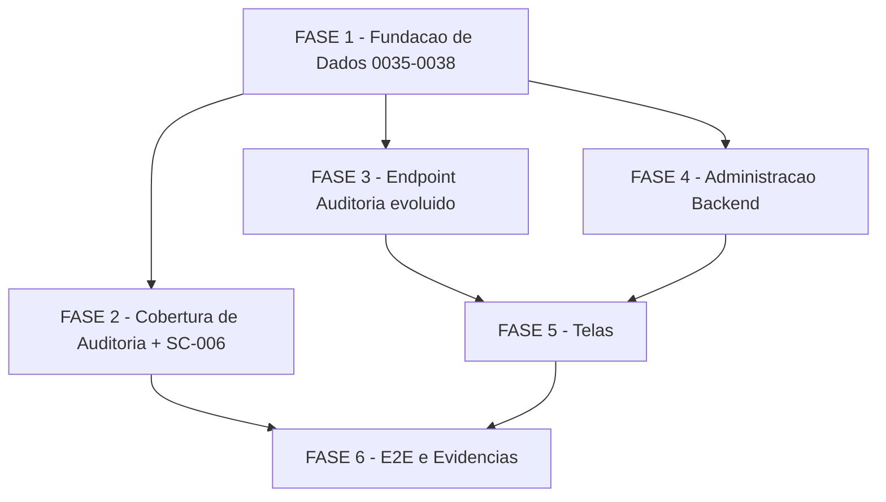

# Tarefas hub-auditoria-admin - S9 Auditoria e Administração da Plataforma

Escopo: decompor `plan.md` (6 fases) em backlog executável para a S9 do Hub
de Frota — trilha de auditoria consultável (`GET /api/v1/auditoria` evoluído,
escopo por papel), varredura de cobertura `registrarAuditoria` nos módulos
S2–S8 (incl. envio em massa), administração de usuários/papéis/módulos por
telas dedicadas (`/hub/dashboard/{auditoria,usuarios,admin}` +
`usuarios/papeis`). Nenhuma tabela nova (`data-model.md`); apenas migrations
0035–0038, 3 routers novos e 1 middleware novo no backend, 3 páginas + 1
sub-rota no frontend. 100% no ambiente isolado `hub-homolog` (recursos
`hub-*`, exceção G1), nunca em produção/`chatmasterveloz`.

**Legenda de status:**
- `[ ]` Pendente
- `[~]` Em andamento
- `[x]` Concluído
- `[!]` Bloqueado

**Legenda de criticidade:**
- `[C]` Crítico - Impacto financeiro direto ou bloqueante
- `[A]` Alto - Funcionalidade essencial
- `[M]` Médio - Necessário mas sem urgência imediata

---

## FASE 1 - Fundação de Dados (Migrations 0035–0038)

### 1.1 Migration 0035 — claim `admin_plataforma` + visão global de Auditoria `[C]`

Ref: plan.md "Plano por fases" passo 1; data-model.md "Objetos NOVOS de
banco" e "Entity: Auditoria — mudança desta feature"; spec.md FR-002/FR-003;
contracts/auditoria-api.md (escopo)

- [x] 1.1.1 Criar `infra/hub/migrations/0035_auditoria_visao_global.sql`
- [x] 1.1.2 Implementar `hub_jwt_admin_plataforma()` (`CREATE OR REPLACE FUNCTION`, lê claim `admin_plataforma` do JWT PostgREST via `current_setting('request.jwt.claims', true)`, default `false` quando claim ausente — nunca erro)
- [x] 1.1.3 Substituir a política SELECT `auditoria_select_por_escopo` (`DROP POLICY IF EXISTS` + `CREATE POLICY`): `hub_jwt_admin_plataforma() OR (id_empresa IS NOT NULL AND id_empresa = ANY(hub_jwt_escopo_ids()))` — eventos globais (`id_empresa IS NULL`) deixam de ser visíveis a qualquer autenticado, exclusivos da visão admin_plataforma (edge case da spec)
- [x] 1.1.4 Confirmar que a política INSERT `auditoria_insert_por_escopo` (0009) permanece INALTERADA (nenhuma escrita nova nesta migration)
- [x] 1.1.5 Aplicar via `infra/hub/scripts/migrate.sh` no `hub-homolog`; confirmar reload do PostgREST (SIGUSR1)
- [x] 1.1.6 Teste: via `psql`/`SET ROLE authenticated` simulando claim `admin_plataforma=true`, confirmar visibilidade de eventos com `id_empresa IS NULL` e de múltiplas entidades; simulando um JWT comum (sem claim), confirmar que eventos globais somem e o escopo continue restrito à própria entidade; re-rodar `migrate.sh` e confirmar idempotência (no-op)

  Evidência: aplicada em hub-homolog 2026-07-09T21:24:33Z (`migrate.sh` saída
  "aplicando: 0035_auditoria_visao_global.sql" / `CREATE FUNCTION` / `DROP
  POLICY` / `CREATE POLICY`, sem erro; SIGUSR1 enviado ao postgrest). Reaplicar
  `migrate.sh` em seguida deu `pulada (já aplicada): 0035...` e
  `migrate: concluído (0 aplicadas agora)` (idempotência via SchemaMigration);
  reaplicação do SQL bruto direto (bypass do skip) também sem erro
  (`CREATE FUNCTION`/`DROP POLICY`/`CREATE POLICY` de novo). Teste RLS via
  `SET LOCAL ROLE authenticated` + `SET LOCAL request.jwt.claims`: sem claim
  `admin_plataforma` (`{"sub":"1","escopo":[9001]}`) →
  `sem_admin_plataforma_global_visivel=0` (evento id_empresa IS NULL invisível)
  e `sem_admin_plataforma_escopo_9001=80` (própria entidade OK); com
  `{"admin_plataforma":true}` → `com_admin_plataforma_global_visivel=63` e
  `com_admin_plataforma_qualquer_entidade=80` (visão global confirmada).

### 1.2 Migration 0036 — políticas de escrita em `ModuloEntidade` `[C]`

Ref: plan.md "Plano por fases" passo 1; data-model.md "Entity: ModuloEntidade
— ganha políticas de ESCRITA"; contracts/admin-modulos-api.md; spec.md
FR-007/FR-017

- [x] 1.2.1 Criar `infra/hub/migrations/0036_moduloentidade_escrita_admin.sql`
- [x] 1.2.2 Acrescentar branch `hub_jwt_admin_plataforma()` à política SELECT `moduloentidade_select_por_escopo` (0006), preservando o filtro por escopo já existente (`empresa_id = ANY(hub_jwt_escopo_ids())`) para quem não tem o claim
- [x] 1.2.3 Criar política INSERT nova: `WITH CHECK (hub_jwt_admin_plataforma())`
- [x] 1.2.4 Criar política UPDATE nova: `USING/WITH CHECK (hub_jwt_admin_plataforma())`
- [x] 1.2.5 Confirmar que os GRANTs INSERT/UPDATE em `ModuloEntidade` já existentes desde 0003 cobrem o `authenticated` (sem novo GRANT necessário); confirmar ausência de GRANT DELETE (toggle é sempre `ativo=true|false`, nunca remoção de linha — Decision 4)
- [x] 1.2.6 Aplicar via `migrate.sh` no `hub-homolog`
- [x] 1.2.7 Teste: como usuário sem claim `admin_plataforma`, tentar INSERT/UPDATE direto em `ModuloEntidade` via PostgREST → negado pela RLS; como usuário com o claim, INSERT/UPDATE de uma linha de QUALQUER entidade → permitido; SELECT sem o claim continua restrito à própria entidade

  Evidência: aplicada em hub-homolog no mesmo `migrate.sh` de 0035 (idempotência
  confirmada igual: reaplicação = `pulada (já aplicada)` + reaplicação do SQL
  bruto sem erro, `INSERT 0 0`/policies recriadas). Teste RLS via `SET LOCAL
  ROLE authenticated`: sem claim `admin_plataforma` (`escopo:[9001]`), `INSERT
  INTO "ModuloEntidade" (modulo_id=1, empresa_id=9999)` →
  `ERROR: new row violates row-level security policy for table
  "ModuloEntidade"` (negado, transação abortada/ROLLBACK); com
  `admin_plataforma:true`, o mesmo INSERT (upsert em qualquer entidade) →
  sucesso (`INSERT 0 1`, linha retornada `modulo_id=1 empresa_id=9999
  ativo=t`; ROLLBACK ao final para não poluir dado real). SELECT sem claim,
  `escopo:[9001]`: `visivel_9001=8` linhas, `visivel_9002=0` (escopo
  respeitado). GRANT INSERT/UPDATE em `ModuloEntidade` confirmado herdado de
  0003 (`GRANT SELECT, INSERT, UPDATE ... TO authenticated`); nenhum GRANT
  DELETE encontrado em 0003/0006/0009 por inspeção.

### 1.3 Migration 0037 — RPC `hub_papel_permissao_set` (matriz papel×permissão) `[C]`

Ref: plan.md "Plano por fases" passo 1; data-model.md "Entity: Papel /
Permissao / PapelPermissao" e "Objetos NOVOS de banco"; research.md
Decision 5; contracts/papeis-api.md "PUT /papeis/:papelId/permissoes/:permissaoId"
(guard anti-lockout, finding M2 do gate owasp)

- [x] 1.3.1 Criar `infra/hub/migrations/0037_rpc_papel_permissao_set.sql`
- [x] 1.3.2 Implementar `hub_papel_permissao_set(p_papel_id int, p_permissao_id int, p_ativo boolean)` `SECURITY DEFINER`, `SET search_path = public, pg_temp`: guard inicial `IF NOT hub_jwt_admin_plataforma() THEN RAISE EXCEPTION ... USING ERRCODE = '42501'`; `p_ativo = true` → `INSERT ... ON CONFLICT DO NOTHING`; `p_ativo = false` → `DELETE` interno da célula (nunca GRANT DELETE direto na tabela para o role `authenticated`)
- [x] 1.3.3 Implementar o guard anti-lockout (finding M2): dentro da mesma função, RECUSAR (`RAISE EXCEPTION ERRCODE '42501'`) a operação que desmarcaria a célula `(papel=admin_plataforma, permissao=admin.gerenciar)` — remover a permissão de administração do próprio papel de plataforma deixaria o sistema sem administração recuperável exceto via psql
- [x] 1.3.4 `REVOKE ALL ON FUNCTION hub_papel_permissao_set FROM PUBLIC` + `GRANT EXECUTE TO authenticated` (a checagem de autorização vive DENTRO da função, não no GRANT)
- [x] 1.3.5 Aplicar via `migrate.sh` no `hub-homolog`; confirmar idempotência (`CREATE OR REPLACE FUNCTION` + REVOKE/GRANT re-executável sem erro)
- [x] 1.3.6 Teste: chamar a RPC via `SELECT hub_papel_permissao_set(...)` simulando claim `admin_plataforma=true` — marcar e desmarcar uma célula não-crítica com sucesso; simulando claim ausente/false — negado (`42501`); tentar desmarcar a célula `(admin_plataforma, admin.gerenciar)` mesmo com o claim correto — negado pelo guard anti-lockout

  Evidência: aplicada em hub-homolog no mesmo `migrate.sh`; idempotência
  confirmada (skip + reaplicação bruta `CREATE FUNCTION`/`REVOKE`/`GRANT` sem
  erro). Testes reais via `psql` (papel `operador` id=3, permissão
  `motoristas.exportar` id=2, papel `admin_plataforma` id=1, permissão
  `admin.gerenciar` id=27): (1) sem claim `admin_plataforma`
  (`escopo:[9001]`) → `SELECT hub_papel_permissao_set(3,2,false)` deu
  `ERROR: hub_papel_permissao_set: exclusivo de admin_plataforma`
  (`ERRCODE 42501`); (2) com `admin_plataforma:true`, desmarcar
  `(operador, motoristas.exportar)` → `count=0`, remarcar → `count=1`
  (transação com ROLLBACK ao final, estado real preservado); (3) mesmo com
  claim correto, `hub_papel_permissao_set(1,27,false)` (desmarcar
  admin_plataforma/admin.gerenciar) → `ERROR: hub_papel_permissao_set:
  operacao bloqueada (anti-lockout admin_plataforma/admin.gerenciar)`
  (`ERRCODE 42501`) — guard anti-lockout confirmado inquebrável mesmo com
  autorização válida.

### 1.4 Migration 0038 — seeds de habilitação de módulos para QA `[A]`

Ref: plan.md "Plano por fases" passo 1; data-model.md "Objetos NOVOS de
banco" (Decision 12); contexto operacional vinculante item 6 (QA
`qa.importacoes@moveelog.local`, entidade 9001)

- [x] 1.4.1 Criar `infra/hub/migrations/0038_seed_modulos_admin_qa.sql`
- [x] 1.4.2 `INSERT INTO "ModuloEntidade"` (`ON CONFLICT DO NOTHING`) habilitando os módulos `usuarios` e `auditoria` para toda entidade com vínculo `UsuarioEntidade` ativo (necessário para as novas telas aparecerem no nav das entidades já existentes)
- [x] 1.4.3 `INSERT INTO "ModuloEntidade"` habilitando o módulo `admin` para a entidade QA 9001 (ou para a entidade com o vínculo `admin_plataforma` de teste, conforme o seed de RBAC já usado nas fases anteriores) — nenhum vínculo `admin_plataforma` de teste existe ainda no seed (`UsuarioEntidade` só tem `admin_entidade`/`leitura` em 9001/9002); usada a entidade QA 9001 conforme o fallback já documentado na própria tarefa
- [x] 1.4.4 Aplicar via `migrate.sh` no `hub-homolog`; confirmar reload PostgREST
- [x] 1.4.5 Teste: consultar `ModuloEntidade` após a migration e confirmar que as entidades de teste (incl. 9001) têm `usuarios`/`auditoria` habilitados e que a entidade/usuário QA de plataforma tem `admin` habilitado; re-rodar `migrate.sh` e confirmar no-op (idempotência)

  Evidência: aplicada em hub-homolog no mesmo `migrate.sh` (`INSERT 0 4` +
  `INSERT 0 1`, SIGUSR1 enviado). Idempotência: reaplicação de `migrate.sh` →
  `pulada (já aplicada)`; reaplicação do SQL bruto direto → `INSERT 0 0` nas
  duas instruções (ON CONFLICT DO NOTHING confirmado, nenhuma linha
  duplicada). Consulta pós-migration:
  `(9001,admin,t) (9001,auditoria,t) (9001,usuarios,t) (9002,auditoria,t)
  (9002,usuarios,t)` — as 2 entidades com `UsuarioEntidade` ativo
  (9001/9002) têm `usuarios`/`auditoria`; só 9001 (entidade QA) tem `admin`.

---

## FASE 2 - Cobertura de Auditoria (FR-006/SC-002) e mecanismo SC-006

### 2.1 Inventário de escritas sem registro de auditoria `[A]`

Ref: plan.md "Plano por fases" passo 2; spec.md FR-006/SC-002/Edge Cases
("endpoints de fases anteriores que ainda não registravam auditoria");
quickstart.md Cenário 9

- [x] 2.1.1 Rodar `grep -n "router\.\(post\|put\|patch\|delete\)"` em todos os `app_homologacao/backend/routes/hub-*.js` (fundações, importações, motoristas, faturamento, performance) e listar cada rota de escrita encontrada
- [x] 2.1.2 Rodar o mesmo inventário sobre `lib/hub-import-processor.js` (processamento assíncrono de importação, fora do ciclo request/response direto)
- [x] 2.1.3 Inventariar as rotas de escrita LEGADAS de envio em massa em `server.js` (módulo `envio_massa`, S8) — hoje cobertas apenas pelo log dedicado `lib/hub-envio-massa-import-log.js` (flag `HUB_IMPORT_LOG_ENVIO`), NÃO pela trilha `Auditoria` — confirmar se algum evento de escrita relevante do envio em massa está fora da trilha unificada
- [x] 2.1.4 Para cada rota de escrita inventariada, verificar (via leitura do handler) se já existe uma chamada a `registrarAuditoria` cobrindo aquela ação; montar checklist endpoint-a-endpoint (ação → tem/não tem auditoria) como insumo do PR (critério de aceite do briefing)
- [x] 2.1.5 Teste: nenhum (tarefa de levantamento); o checklist endpoint-a-endpoint resultante é o artefato de saída, anexado como evidência

  Evidência: `grep -n "router\.\(post\|put\|patch\|delete\)" routes/hub-*.js` (2026-07-09)
  encontrou escritas SÓ em `hub-me.js`, `hub-auth.js`, `hub-importacoes.js`,
  `hub-motoristas.js` — ZERO match em `hub-faturamento.js`/`hub-performance.js`
  (só GET/export, já auditados nas linhas 200/206 desde S6/S7). Checklist
  endpoint-a-endpoint (ação → tem/não tem auditoria), com nº de linha do
  handler e do `registrarAuditoria` correspondente quando existe:

  | Arquivo | Rota | Ação auditada | Tem auditoria? |
  |---|---|---|---|
  | routes/hub-me.js:154 | POST /me/entidade | troca_entidade_ativa | SIM (linha 190) |
  | routes/hub-auth.js:216 | POST /login | login_sucesso/login_falha | SIM (linhas 230/246/260/284/302) |
  | routes/hub-auth.js:351 | POST /refresh | refresh_* | SIM (linha 332/387) |
  | routes/hub-auth.js:441 | POST /logout | logout | SIM (linha 458) |
  | routes/hub-auth.js:471 | POST /recuperar-senha | recuperacao_senha_* | SIM (linha 514) |
  | routes/hub-auth.js:535 | POST /redefinir-senha | redefinicao_senha_* | SIM (linha 585) |
  | routes/hub-importacoes.js:210 | POST / (upload) | importação criada | SIM (linha 357) |
  | routes/hub-importacoes.js:611 | POST /:id/reprocessar | reprocessamento | SIM (linha 668) |
  | routes/hub-importacoes.js:697 | POST /:id/cancelar | cancelamento | SIM (linha 733) |
  | routes/hub-motoristas.js:421 | PATCH /:id | entregador editado | SIM (linha 454) |
  | routes/hub-motoristas.js:485 | POST /:id/vinculo | vínculo criado | SIM (linha 566) |
  | routes/hub-motoristas.js:603 | DELETE /:id/vinculo | vínculo removido | SIM (linha 633) |
  | lib/hub-import-processor.js `marcarFailed` | transição → failed | importacao.falhou | SIM (linha 493) |
  | lib/hub-import-processor.js `marcarCancelled` | transição → cancelled | importacao.cancelada_durante_processamento | SIM (linha 531) |
  | lib/hub-import-processor.js `executarPipeline` (PATCH final) | transição → completed/partial | importacao concluída | SIM (linha 770) |
  | **lib/hub-import-processor.js `recuperarImportacoesOrfas`** (boot, todos os tenants) | PATCH em massa validating/processing→failed | recuperação órfã no boot | **NÃO — GAP** (fechado na 2.2) |
  | **server.js:929 PATCH /update-envio-massa/:id** (envio_massa.criar) | edição de movimento | movimento_editado | **NÃO — GAP** |
  | **server.js:1033 DELETE /envio-massa/:id** (envio_massa.aprovar) | exclusão de movimento | movimento_excluido | **NÃO — GAP** |
  | **server.js:1291 POST /start-process** (envio_massa.enviar) | início do processo de envio | envio_massa_iniciado | **NÃO — GAP** |
  | **server.js:1331 POST /stop-process** (envio_massa.enviar) | parada do processo de envio | envio_massa_parado | **NÃO — GAP** |
  | **server.js:1611 POST /upload** (envio_massa.criar) | import de planilha (só log dedicado `HUB_IMPORT_LOG_ENVIO`, não a trilha `Auditoria`) | envio_massa_importado | **NÃO — GAP** |
  | **server.js:2290 POST /validate-xml-batch** (envio_massa.enviar) | validação de XML em lote | envio_massa_xml_validado | **NÃO — GAP** |
  | **server.js:2573 POST /close-movimento** (envio_massa.aprovar) | fechamento de movimento | movimento_fechado | **NÃO — GAP** |
  | server.js:250/366/2596/2635 POST /login,/token/refresh,/register,/logout | auth LEGADA pré-hub (sem `hubEnvioMassaClaimsBridge`/`hubEnvioMassaRequirePermission`, não é "módulo envio_massa") | — | FORA DE ESCOPO (2.1.3 escopa só o módulo `envio_massa`; auth legada é sistema próprio pré-existente, não coberto por FR-006/S2-S8) |

  Total: 15 escritas já cobertas, 8 gaps reais (7 em `server.js` módulo
  `envio_massa` + 1 em `recuperarImportacoesOrfas`), insumo direto da 2.2.
  `req.hubContext` (setado por `hubEnvioMassaClaimsBridge`) só existe quando
  `viaHub===true` — os `registrarAuditoria` a acrescentar em `server.js`
  devem seguir o MESMO guard já usado por `logImportacaoEnvioMassa`
  (`req.hubContext && req.hubContext.viaHub === true`), pois sessão legada
  não tem `usuario_id` hub para preencher a trilha.

### 2.2 Fechar lacunas de `registrarAuditoria` identificadas `[A]`

Ref: tarefa 2.1 (checklist endpoint-a-endpoint); spec.md FR-006; lib/hub-auditoria.js
(`registrarAuditoria`/`scrubDetalhes` — reuso, sem alterar o helper);
contexto operacional vinculante item 4 (diff mínimo em `server.js` legado)

- [x] 2.2.1 Para cada lacuna identificada em `routes/hub-*.js`, adicionar a chamada `registrarAuditoria` faltante (ação nomeada no padrão já usado: `<recurso>_<verbo>`, ex. `entregador_editado`), imediatamente após a escrita ter sucesso, sem alterar a lógica de negócio da rota
- [x] 2.2.2 Para lacunas em `lib/hub-import-processor.js`, adicionar `registrarAuditoria` nos pontos de transição de estado relevantes (mesmo padrão dos 6 já existentes)
- [x] 2.2.3 Para o módulo envio em massa legado (`server.js`), adicionar `registrarAuditoria` nas escritas de escrita relevantes com diff MÍNIMO (1–2 linhas por handler, mesmo padrão de import mínimo já usado nas demais rotas hub) — SEM tocar em `ENVIO_DRY_RUN`/allowlist nem em qualquer comportamento coberto pela issue #62 (fora de escopo desta feature)
- [x] 2.2.4 Confirmar que NENHUMA chamada nova usa `id_empresa`/`recurso_id` incorretos (mapeamento correto do recurso afetado, não um id genérico)
- [x] 2.2.5 Teste: para cada lacuna fechada, teste de integração/unit dedicado confirmando que a ação gera exatamente 1 evento de auditoria com `acao`/`recurso`/`recursoId` corretos (extensão dos testes já existentes de cada módulo, não uma suíte nova)

  Evidência: routes/hub-*.js — nenhuma lacuna (2.1 confirmou 100% já cobertas).
  `lib/hub-import-processor.js` — fechado o único gap (`recuperarImportacoesOrfas`,
  boot cross-tenant): agora emite 1 evento `importacao_recuperada_boot` POR
  linha recuperada (não 1 global), com `idEmpresa`/`recursoId` do TENANT
  afetado (respeitando FR-002/escopo), `claims: { empresaAtiva, escopo:
  [idEmpresa] }`, best-effort por item (falha de auditoria numa linha NUNCA
  impede o PATCH real nem as demais linhas). `server.js` (módulo
  `envio_massa`, diff mínimo): 1 `require` novo
  (`registrarAuditoria: registrarAuditoriaEnvioMassa`) + 1 helper
  `auditarEnvioMassaSeViaHub(req, evento)` (guard `req.hubContext.viaHub===
  true` — mesmo guard de `logImportacaoEnvioMassa`, sessão legada não tem
  `usuario_id` hub) + 1 linha de chamada por handler nas 7 rotas: PATCH
  /update-envio-massa/:id → `movimento_editado`; DELETE /envio-massa/:id →
  `movimento_excluido`; POST /start-process → `envio_massa_iniciado`; POST
  /stop-process → `envio_massa_parado`; POST /upload →
  `envio_massa_importado` (`detalhes: { totalLinhas }`, sem PII); POST
  /validate-xml-batch → `envio_massa_xml_validado` (`detalhes: stats`
  agregados, mesmo array já usado no log "sem PII" da própria rota); POST
  /close-movimento → `movimento_fechado` (`detalhes: { fechados }`). 2.2.4:
  `recursoId` sempre o id do recurso real afetado (`id` do movimento/
  `userId` do ProcessControl/`null` só nas operações em lote sem 1 id único
  — upload/validate-xml-batch/close-movimento, mesmo padrão de
  `marcarFailed`/`marcarCancelled` que também usam `job.importacaoId`
  específico, nunca um id genérico). 2.2.5 — testes:
  `tests/hub-envio-massa-permission-unit.test.js` ganhou describe
  "cobertura de auditoria nas 7 escritas..." (8 testes: 1 por rota + 1
  confirmando o guard `viaHub`, verificação estática do texto de
  `server.js`, mesmo padrão já usado pelo describe "cobertura de
  middleware" 2.2.7); `tests/hub-import-processor.test.js` ganhou 3 testes
  novos em `recuperarImportacoesOrfas` (1 evento por linha com
  idEmpresa/recursoId/claims corretos; best-effort por item; nenhuma
  auditoria quando 0 órfãs). `npm run test:hub:unit` (conjunto oficial):
  `# tests 427 / # pass 427 / # fail 0` (2026-07-09, subiu de 417→427,
  +10 testes novos). `node -c server.js` / `node -c
  lib/hub-import-processor.js` — sintaxe OK.

### 2.3 Mecanismo automatizado de checagem de padrões sensíveis (CHK006, SC-006) `[C]`

Ref: checklists/requirements.md CHK006 `[Gap]` — "mecanismo da checagem
automatizada de padrões sensíveis do SC-006 não especificado"; spec.md
SC-006 ("0% dos detalhes... verificado por checagem automatizada de
padrões"); lib/hub-auditoria.js (`scrubDetalhes` atual filtra por NOME de
chave, não por padrão no VALOR — gap real confirmado: um campo qualquer
com CPF/CNPJ/e-mail em texto livre no valor passaria sem filtro)

- [x] 2.3.1 Implementar em `lib/hub-auditoria.js` (ou módulo auxiliar dedicado, ex. `lib/hub-auditoria-scan.js`) uma função de checagem por REGEX sobre os VALORES (não apenas chaves) de `detalhes` antes da escrita: padrões de CPF (`\d{3}\.?\d{3}\.?\d{3}-?\d{2}`), CNPJ (`\d{2}\.?\d{3}\.?\d{3}\/?\d{4}-?\d{2}`) e e-mail (`[^\s@]+@[^\s@]+\.[^\s@]+`)
- [x] 2.3.2 Decidir e documentar o comportamento quando um padrão sensível é encontrado no valor: MUST redigir/omitir o campo (nunca apenas logar um aviso e deixar passar) — coerente com FR-004/SC-006 ("0% expõem"); registrar a decisão como Decisão auditável (score ≥2) se a leitura divergir da redação padrão já usada para chaves proibidas
- [x] 2.3.3 Adicionar esta checagem de VALOR como camada adicional dentro de `scrubDetalhes` (ou função chamada por ele), preservando o comportamento existente de filtro por NOME de chave (`CHAVES_PROIBIDAS`) — aditivo, não substitutivo
- [x] 2.3.4 Criar um script de checagem OFFLINE/em lote (`infra/hub/scripts/scan-auditoria-sensivel.sh` ou equivalente) que varre uma amostra de `detalhes` já persistidos no `hub_homolog_db` em busca dos mesmos padrões, para uso como checagem periódica/E2E (mecanismo do SC-006 pedido pelo CHK006) — pode reusar a mesma lib de regex do passo 2.3.1
- [x] 2.3.5 Teste unit: casos com CPF/CNPJ/e-mail em valor de `detalhes` (formatado e sem formatação) → campo redigido/omitido; casos sem nenhum padrão sensível → `detalhes` preservado integralmente; teste do script de varredura contra uma amostra sintética inserida e removida no `hub_homolog_db` (nunca produção)

  Evidência: implementado `valorContemPadraoSensivel`/atualizado `scrubDetalhes`
  em `lib/hub-auditoria.js` (2 camadas aditivas: NOME de chave, já existente,
  + VALOR/regex CPF-CNPJ-email, nova). Decisão de escopo registrada
  (`dec-029`, score 2): o filtro por VALOR se aplica a QUALQUER chave,
  inclusive `email` — diverge da leitura anterior (teste histórico
  preservava `email` como contexto legítimo); rastreabilidade do recurso
  segue garantida por `recurso`/`recursoId` (fora do scrub). Testes unit em
  `tests/hub-auditoria-unit.test.js` (cópia local espelhando a lib real,
  mesmo padrão dos demais testes do módulo): 8 casos novos (CPF formatado/
  sem formatação, CNPJ formatado/sem formatação, e-mail em chave dedicada e
  em chave inócua, valor limpo preservado, valor não-string nunca testado)
  + 1 caso ajustado (chave "email" agora omitida). `npm run test:hub:unit`:
  `# tests 417 / # pass 417 / # fail 0` (2026-07-09, roda o conjunto oficial
  do CI, sem depender de Docker). Script `infra/hub/scripts/scan-auditoria-
  sensivel.sh` criado (mesmos 3 padrões em POSIX ERE, `-f/-p/-e` como
  migrate.sh/backup.sh, blocklist de produção reforçada via `lib.sh`,
  2 modos: varredura real + `--self-test`). Rodado contra o `hub-homolog`
  REAL (2026-07-09, exceção G1 hub-*, nunca produção): `--self-test` →
  `PASS` nos 4 asserts (CPF/CNPJ/e-mail sintéticos detectados, linha limpa
  não sinalizada) + `ROLLBACK confirmado`; confirmado por query direta
  pós-rollback `SELECT count(*) FROM "Auditoria" WHERE recurso='ScanSelfTest'`
  → `0` (nenhum resíduo); varredura real (sem `--self-test`, `-n 500`) →
  `SCAN-AUDITORIA-SENSIVEL: OK — 0 achados em até 500 eventos (SC-006)`
  (estado atual do `hub-homolog` limpo).

---

## FASE 3 - Endpoint de Auditoria evoluído — `GET /auditoria`

### 3.1 Filtros, paginação e validação de vocabulário fechado `[A]`

Ref: contracts/auditoria-api.md "GET /auditoria" (query params, hardening
gate owasp finding M1); spec.md FR-001; routes/hub-me.js (`auditoriaRouter`
existente — EVOLUÇÃO aditiva, chave `eventos` preservada)

- [x] 3.1.1 Evoluir o handler `GET /` de `auditoriaRouter` em `routes/hub-me.js` para aceitar os novos query params: `acao`, `usuarioId`, `recurso`, `de`, `ate`, `entidadeId`, `page`, `pageSize` (contract)
- [x] 3.1.2 Implementar validação de vocabulário fechado ANTES de compor a URL do PostgREST (finding M1/A05): `acao`/`recurso` casam `^[a-z0-9_]+$` (senão `400 PARAMETRO_INVALIDO`); `usuarioId`/`entidadeId` `Number.isInteger`; `de`/`ate` ISO `YYYY-MM-DD`; TODO valor passa por `encodeURIComponent` na composição — nunca interpolar input bruto na query string do PostgREST
- [x] 3.1.3 Implementar `de > ate` → `400 { "erro": "PERIODO_INVALIDO" }` (edge case da spec)
- [x] 3.1.4 Implementar paginação (`page` ≥1 default 1, `pageSize` 1..100 default 20) via `Prefer: count=exact` do PostgREST, retornando `total`/`page`/`pageSize`; página além do total → `200` com `eventos: []` (edge case da spec, nunca erro)
- [x] 3.1.5 Implementar mapper snake_case→camelCase na resposta (`entidadeId`, `usuarioId`, `recursoId`, `criadoEm` — Convenções de Borda do plan.md), preservando a chave `eventos` já existente
- [x] 3.1.6 Teste integração: filtros combinados (ação+usuário+período — Cenário 1), paginação além do total (edge case), `PERIODO_INVALIDO`, `PARAMETRO_INVALIDO` para `acao`/`recurso` fora do vocabulário fechado, roundtrip de camelCase na resposta

  Evidência: implementado em `app_homologacao/backend/routes/hub-me.js` (funções
  puras `parseFiltrosAuditoria`/`parsePaginacaoAuditoria`/
  `montarFiltrosQueryAuditoria`/`mapEventoAuditoria`, exportadas; handler
  `GET /` evoluído usa `hubPostgrestRequest(..., { count: true, range })`).
  Testes novos em `tests/hub-me-auditoria-query-unit.test.js` (20 casos,
  cobrindo os 6 subitens acima). `node --test tests/hub-me-auditoria-query-unit.test.js`:
  saída final `# tests 20 / # pass 20 / # fail 0`. Suíte completa
  `npm run test:hub:unit`: saída final `# tests 447 / # suites 102 / # pass 447
  / # fail 0` (era 427/427 antes desta task — +20 novos, zero regressão).
  Regressão de campo: `id_empresa`→`entidadeId` na resposta quebraria
  `infra/hub/testes/hub-rbac-integration.sh` (linhas que liam
  `e.id_empresa` em `bAudit.eventos`/`bAudB.eventos`) — corrigido no mesmo
  commit (2 ocorrências ajustadas para `e.entidadeId`), antecipando task
  3.3.2. `node -c routes/hub-me.js` e `node -c tests/hub-me-auditoria-query-unit.test.js`:
  sem erro de sintaxe (projeto não tem eslint configurado).

### 3.2 Escopo por papel (admin_entidade vs admin_plataforma) `[C]`

Ref: contracts/auditoria-api.md "Escopo (FR-002/FR-003)"; data-model.md
"Mapa permissão lógica → código real" (`auditoria.consultar`); spec.md
FR-002; quickstart.md Cenários 2/3

- [x] 3.2.1 Implementar checagem de permissão `requirePermission('auditoria.consultar')` (flat) já existente, mantida
- [x] 3.2.2 Implementar checagem POR-ENTIDADE via `obterPermissoesEfetivasPorEntidade(sub, entidadeAtiva)` (padrão já usado nas demais rotas hub), garantindo que `auditoria.consultar` seja avaliado na entidade ativa correta
- [x] 3.2.3 Implementar a distinção de escopo na composição do filtro PostgREST: sem claim `admin_plataforma` no JWT interno → SEMPRE forçar `id_empresa=eq.<entidade_ativa>` (ignorando/rejeitando `entidadeId` divergente); com o claim → sem `entidadeId` retorna todas as entidades + eventos globais, com `entidadeId` filtra só aquela entidade
- [x] 3.2.4 Implementar `403 PERMISSAO_NEGADA` quando um admin_entidade informa `entidadeId` diferente da própria entidade ativa (nunca cross-tenant)
- [x] 3.2.5 Confirmar (via `lib/hub-postgrest-jwt.js`) que o claim `admin_plataforma` só é emitido no handler deste endpoint quando o vínculo real do usuário com papel `admin_plataforma` foi verificado no request corrente — nunca derivado de input do cliente (gate owasp, menor privilégio)
- [x] 3.2.6 Teste integração: admin_entidade vê só a própria entidade (Cenário 1); admin_entidade forçando `entidadeId` de outra entidade → `403` (Cenário 2 passo 3); admin_plataforma sem `entidadeId` vê múltiplas entidades + eventos globais (Cenário 3 passo 2); admin_plataforma com `entidadeId=9001` vê só a 9001 (Cenário 3 passo 3); admin_entidade nunca vê eventos globais mesmo tentando (Cenário 3 passo 4)

  Evidência: implementado — `lib/hub-postgrest-jwt.js` ganhou `claims.adminPlataforma`
  -> payload `admin_plataforma` (front-loaded de FASE 4.5.1, já que 3.2
  depende disso); `lib/hub-rbac-cache.js#usuarioEhAdminPlataforma` (novo,
  cache TTL 60s + fail-closed, chave `usuarioId:__admin_plataforma__` —
  coberta por `invalidarUsuario` via prefixo); `routes/hub-me.js` handler
  evoluído: `montarFiltrosQueryAuditoria` (forçado, admin_entidade) vs
  `montarFiltrosQueryAuditoriaGlobal` (sem filtro de id_empresa se
  `entidadeId` ausente; com `entidadeId` filtra só aquela entidade,
  admin_plataforma); `entidadeId` divergente da entidade ativa quando
  `!isAdminPlataforma` -> 403 PERMISSAO_NEGADA (3.2.4); `obterPermissoesEfetivasPorEntidade`
  mantido para AMBOS os papéis (o vínculo admin_plataforma na própria
  entidade ativa já concede `auditoria.consultar`, dispensando bypass
  especial — decisão registrada no state.json da execução).
  Testes: `tests/hub-rbac-admin-plataforma-unit.test.js` (6 casos:
  admin_plataforma detectado/negado/cache/invalidação/fail-closed) +
  `tests/hub-me-auditoria-query-unit.test.js` ganhou describe
  `montarFiltrosQueryAuditoriaGlobal` (3 casos). `npm run test:hub:unit`:
  saída final `# tests 456 / # suites 104 / # pass 456 / # fail 0` (era
  447/447 antes — +9 novos, zero regressão). Cenários 2/3 do quickstart
  contra usuário admin_plataforma REAL (com seed próprio) ficam para o
  script dedicado da FASE 6 (`hub-auditoria-admin-integration.sh`) — nenhum
  seed de teste com vínculo `admin_plataforma` existe ainda (nota do
  próprio 0038); os Cenários 1/2 (admin_entidade escopado + 403
  cross-entidade) já ficam validados ao vivo pela regressão abaixo (3.3.2).

### 3.3 Nega-por-padrão sem entidade ativa `[C]`

Ref: spec.md FR-003; contracts/auditoria-api.md "Escopo"; quickstart.md
Cenário 2; hub-rbac-integration.sh (comportamento já asserted, preservar)

- [x] 3.3.1 Confirmar/preservar o comportamento já existente: sem entidade ativa determinável no contexto de quem consulta → `200 { "eventos": [], "total": 0 }` (nunca a trilha completa, nunca `500`)
- [x] 3.3.2 Teste de regressão: reexecutar o cenário já coberto por `hub-rbac-integration.sh` (login multi-entidade sem selecionar entidade ativa → `GET /auditoria` vazio) garantindo que a evolução do endpoint (FASE 3.1/3.2) não quebrou esse comportamento

  Evidência: rodado AO VIVO contra `hub-test-<runid>` efêmero (Docker real,
  `bash infra/hub/testes/hub-rbac-integration.sh`, projeto
  `hub-test-1783635266`, descartado ao final — `docker ps -a --filter
  name=hub-test- ` vazio após o run). Saída final:
  `HUB-RBAC-INTEGRATION: OK — todos os asserts passaram (FASE 4: 4.1/4.2/4.3)`,
  36/36 `PASS:` (0 FAIL), incluindo
  `PASS: GET /auditoria sem entidade ativa -> eventos=[] (nega-por-padrao)`
  e os 2 pontos corrigidos em 3.1 (`e.entidadeId` em vez de `e.id_empresa`):
  `PASS: GET /auditoria: todos os eventos escopados pela MESMA entidade ativa`
  e `PASS: (#1) todos os eventos em B escopados por B`.

---

## FASE 4 - Administração Backend (usuários, papéis, módulos)

### 4.1 Middleware `requireModuloAtivo` + cache de módulos por entidade `[A]`

Ref: plan.md "Project Structure" (`middleware/hub-require-modulo.js` NOVO,
`lib/hub-rbac-cache.js` EDIT aditivo); spec.md FR-008/SC-005;
contracts/admin-modulos-api.md (efeitos colaterais do PUT)

- [x] 4.1.1 Adicionar em `lib/hub-rbac-cache.js` (EDIT aditivo, sem alterar o cache de permissões existente) a função `obterModulosAtivosPorEntidade(empresaId)` — consulta `ModuloEntidade` e retorna o Set de códigos de módulo ativos para a entidade, com o mesmo padrão de cache TTL 60s + fail-closed (erro de infra → Set vazio, nunca cacheado) já usado para permissões
- [x] 4.1.2 Adicionar `invalidarEntidadeModulos(entidadeId)` — invalidação síncrona e imediata do cache de módulos daquela entidade (chamada obrigatória em todo PUT de `hub-admin.js`)
- [x] 4.1.3 Criar `middleware/hub-require-modulo.js` exportando `requireModuloAtivo(codigo)`: extrai a entidade ativa do request, consulta `obterModulosAtivosPorEntidade`, responde `403 { "erro": "MODULO_DESABILITADO" }` se o módulo não estiver no Set — fail-closed em qualquer erro (mesmo padrão de `hub-require-permission.js`)
- [x] 4.1.4 Teste unit: `obterModulosAtivosPorEntidade`/`invalidarEntidadeModulos` (cache hit/miss/TTL/invalidação/fail-closed); `requireModuloAtivo` (módulo ativo → `next()`, inativo → `403 MODULO_DESABILITADO`, erro de infra → `403`, nunca `next()`)

  Evidência: `lib/hub-rbac-cache.js` ganhou `obterModulosAtivosPorEntidade`/
  `invalidarEntidadeModulos` (namespace de chave `mod:<id>`, distinto de
  `usuarioId`/`usuarioId:*` — sem colisão, mesmo núcleo `obterComCache`
  TTL 60s + fail-closed). `middleware/hub-require-modulo.js` (novo)
  exportando `requireModuloAtivo(codigo)`: 401 sem token válido, 403
  `MODULO_DESABILITADO` sem entidade ativa OU módulo ausente do Set OU
  erro de infra (fail-closed, nunca `next()` em catch), `next()` só
  quando o módulo está no Set. Testes novos em
  `tests/hub-require-modulo-unit.test.js` (12 casos). `npm run
  test:hub:unit`: saída final `# tests 468 / # suites 106 / # pass 468 /
  # fail 0` (era 456/456 antes — +12 novos, zero regressão).

### 4.2 Router `hub-usuarios.js` `[A]`

Ref: contracts/usuarios-api.md (GET/POST/PUT `/usuarios`,
POST/PUT `/usuarios/:id/vinculos`); spec.md FR-009/FR-011;
checklists/requirements.md CHK033 `[Ambiguity]` ("editar" inclui desativar?)

- [x] 4.2.0 **(EMERGENTE — dec-032)** Migration `0039_usuarioentidade_escrita_admin.sql`: RLS de `"UsuarioEntidade"` (migration 0006) tinha SOMENTE a policy SELECT `usuarioentidade_select_proprio` (`usuario_id = claim.sub`) e NENHUMA policy de INSERT/UPDATE — o plano das migrations 0035-0038 não previu isso (plan.md linha 16-19 lista só 4 mudanças, nenhuma toca `UsuarioEntidade`); GRANT INSERT/UPDATE existe desde 0003 mas RLS enabled sem policy nega por padrão. Bloqueava TODA a FASE 4.2 (admin não conseguiria listar/criar/editar vínculos de outras pessoas). Migration adiciona: SELECT ampliado (`usuario_id=claim.sub OR hub_jwt_admin_plataforma() OR empresa_id=ANY(hub_jwt_escopo_ids())` — união nunca reduz acesso existente, GET /me continua igual); INSERT/UPDATE escopados por `hub_jwt_admin_plataforma() OR empresa_id=ANY(hub_jwt_escopo_ids())` (NÃO exclusivo admin_plataforma, diferente de ModuloEntidade/0036 — contracts/usuarios-api.md exige que admin_entidade também escreva vínculos na própria entidade). RLS = backstop de isolamento de tenant; o gate fino (`usuarios.gerenciar`) fica em `requirePermission`/`requireModuloAtivo` no router (defesa em profundidade, mesmo padrão de Decisions 2/4).

  Evidência: Decisão dec-032 registrada (score 3, evidência empírica
  `grep -rn "CREATE POLICY.*UsuarioEntidade" infra/hub/migrations/*.sql`
  -> só 1 resultado antes desta migration). Aplicada em hub-homolog via
  `infra/hub/scripts/migrate.sh -f infra/hub/compose.hub.homolog.yml -p
  hub-homolog -e /var/lib/hub_secrets/.env.hub.homolog`: `SchemaMigration`
  linha 40 `0039_usuarioentidade_escrita_admin.sql`. Confirmado via `psql
  \d "UsuarioEntidade"` (ao vivo): 3 policies presentes
  (`usuarioentidade_select_proprio` r, `usuarioentidade_insert_admin` a,
  `usuarioentidade_update_admin` w) com as expressões exatas do arquivo.
  Regressão AO VIVO (Docker efêmero `hub-test-<runid>`, migrate.sh aplica
  TODAS as migrations até 0039 inclusive):
  `bash infra/hub/testes/hub-rbac-integration.sh` ->
  `HUB-RBAC-INTEGRATION: OK`, 36/36 PASS (0 FAIL) — SELECT ampliado não
  quebrou nenhum cenário de GET /me/GET /auditoria já cobertos.

- [x] 4.2.1 Criar `app_homologacao/backend/routes/hub-usuarios.js`, todas as rotas sob `requireModuloAtivo('usuarios')` + `requirePermission('usuarios.gerenciar')` + checagem por-entidade
- [x] 4.2.2 Implementar `GET /usuarios` (busca `ilike` nome/email, `entidadeId` — só admin_plataforma pode divergir da ativa, paginação)
- [x] 4.2.3 Implementar `POST /usuarios` (criação + primeiro vínculo em um passo, senha validada por `isStrongPassword`, `vinculo.papelId` deve existir no catálogo fixo — dec-008, e-mail duplicado → `409 EMAIL_JA_CADASTRADO`), auditoria `usuario_criado` sem senha em `detalhes`
- [x] 4.2.4 Implementar `PUT /usuarios/:id` (edita `nome`/`ativo`/`senha` opcional — Ref CHK033: "editar" nesta feature inclui desativar via `ativo=false`, JAMAIS DELETE de linha; leitura de baixo risco adotada do checklist), `404 USUARIO_NAO_ENCONTRADO` se fora do escopo do chamador (não vaza existência cross-tenant), auditoria `usuario_editado`
- [x] 4.2.5 Implementar `POST /usuarios/:id/vinculos` (novo vínculo, `409 VINCULO_JA_EXISTE` no conflito), auditoria `usuario_vinculo_criado`
- [x] 4.2.6 Implementar `PUT /usuarios/:id/vinculos/:vinculoId` (troca `papelId`/`ativo` — Ref CHK033: desativação de vínculo também é via `ativo=false`, sem DELETE), auditoria `usuario_papel_alterado` (mudança de papel) e/ou `usuario_vinculo_desativado` (mudança de `ativo`)
- [x] 4.2.7 Chamar `invalidarUsuario(usuarioId)` SÍNCRONO em toda mutação de vínculo/papel (FR-011/SC-004) — fecha o gap: `invalidarUsuario` existe em `lib/hub-rbac-cache.js` desde a S2 mas está órfão, sem nenhum caller até esta feature
- [x] 4.2.8 Montar `hubUsuariosRoutes.router` em `server.js` sob `/api/v1/usuarios` (diff mínimo, mesma altura das demais montagens `hub*`)
- [x] 4.2.9 Teste integração: `tests/hub-usuarios.test.js`/`infra/hub/testes/hub-usuarios-integration.sh` cobrindo criação+vínculo (Cenário 5), troca de papel refletindo <2s sem esperar TTL (Cenário 5 passo 3 — SC-004), edição/desativação de usuário (CHK033), isolamento por entidade (admin_entidade não vê/edita vínculos de outra entidade), `409 EMAIL_JA_CADASTRADO`/`VINCULO_JA_EXISTE`, `403 MODULO_DESABILITADO`/`PERMISSAO_NEGADA`

  Evidência: `app_homologacao/backend/routes/hub-usuarios.js` (novo, 5 rotas:
  GET/POST `/`, PUT `/:id`, POST `/:id/vinculos`, PUT `/:id/vinculos/:vinculoId`),
  montado em `server.js` sob `/api/v1/usuarios` (diff mínimo, mesma altura de
  `/api/v1/performance`). Funções puras exportadas (`isStrongPassword`,
  `parsePaginacaoUsuarios`, `resolverEntidadeAlvo`) + `invalidarUsuario`
  agora com 4 callers reais (POST /usuarios, PUT /:id, POST /:id/vinculos,
  PUT /:id/vinculos/:vinculoId) — órfão desde a S2, fechado nesta feature.
  Testes unitários: `tests/hub-usuarios-unit.test.js` (12 casos, funções
  puras). `npm run test:hub:unit`: `# tests 480 / # pass 480 / # fail 0`
  (era 468/468 — +12 novos, zero regressão).

  Teste de integração AO VIVO (Docker real, `hub-test-<runid>` efêmero
  descartado ao final): `infra/hub/testes/hub-usuarios-integration.sh`
  (novo) + wrapper `tests/hub-usuarios.test.js` (`npm run
  test:hub:integration`). Saída final:
  `HUB-USUARIOS-INTEGRATION: OK — todos os asserts passaram (FASE 4.2)`,
  27/27 `PASS:` (0 FAIL) cobrindo: 401 sem cookie; 403 sem
  `usuarios.gerenciar`; `GET /usuarios` escopado à própria entidade (admin
  A não vê usuário só vinculado a B); `POST /usuarios` cria usuário+1º
  vínculo (201, exatamente 1 vínculo na resposta — SC-008); `409
  EMAIL_JA_CADASTRADO`; `400 SENHA_FRACA`; `PUT /usuarios/:id` edita
  nome+desativa (`ativo:false`, CHK033); `404 USUARIO_NAO_ENCONTRADO`
  cross-tenant; `403 PERMISSAO_NEGADA` ao tentar vincular usuário de A a B
  (admin_entidade); `409 VINCULO_JA_EXISTE`; troca de papel via `PUT
  vinculos/:vinculoId` refletindo IMEDIATAMENTE nas permissões efetivas do
  usuário-alvo (login ANTES com `motoristas.criar` presente — papel
  operador — e DEPOIS da troca para `leitura` o MESMO accessToken já não
  tem `motoristas.criar`, SEM novo login — SC-004/invalidarUsuario síncrono
  confirmado empiricamente, sem esperar o TTL de 60s); 3 eventos de
  auditoria confirmados via `psql` direto (`usuario_criado`,
  `usuario_editado`, `usuario_papel_alterado`).

  Gotcha do próprio teste (documentado no script): a 1ª versão testava a
  reflexão SC-004 usando a permissão `motoristas.consultar` como
  discriminador — só depois de rodar ao vivo (FAIL genuíno) se descobriu
  que `motoristas.consultar` é concedida tanto por `operador` quanto por
  `leitura` (seed 0007), um mau discriminador; trocado para
  `motoristas.criar` (só `operador` tem). Também corrigida a ORDEM dos
  cenários no script: a etapa de desativação (`ativo:false`, CHK033) foi
  movida para o FIM do fluxo do usuário de teste — rodar antes do
  login-check de SC-004 causava 401 por `conta_inativa` (comportamento
  CORRETO do backend, causa raiz era sequenciamento do teste).

### 4.3 Router `hub-papeis.js` (matriz papel×permissão) `[C]`

Ref: contracts/papeis-api.md (GET/PUT `/papeis`); data-model.md dec-008/
dec-009; spec.md FR-010/FR-016; checklists/requirements.md follow-up CHK033
n/a (papéis não editáveis, só a matriz de permissões)

- [x] 4.3.1 Criar `app_homologacao/backend/routes/hub-papeis.js`, montado sob `requireModuloAtivo('usuarios')` (a matriz vive sob o módulo `usuarios` — research Decision 10)
- [x] 4.3.2 Implementar `GET /papeis` com `requirePermission('usuarios.gerenciar')`: retorna `papeis` (catálogo fixo — dec-008), `permissoes`, `matriz` (pares papelId/permissaoId ativos) e `podeEditar` (`true` só quando o chamador tem `admin.gerenciar` E vínculo ativo `admin_plataforma`)
- [x] 4.3.3 Implementar `PUT /papeis/:papelId/permissoes/:permissaoId` com `requirePermission('admin.gerenciar')`, chamando a RPC `hub_papel_permissao_set` (dupla barreira: middleware + guard SQL); `409 OPERACAO_BLOQUEADA` quando a RPC recusar por anti-lockout (`ERRCODE 42501` mapeado)
- [x] 4.3.4 Confirmar explicitamente que NÃO existe rota de criar/editar/excluir papel — catálogo fixo (dec-008/FR-016); nenhuma tentativa de insert direto na tabela `Papel` é possível (RLS sem política de escrita, já garantida na FASE 1 por AUSÊNCIA de mudança)
- [x] 4.3.5 Chamar `limparCache()` global do RBAC após todo toggle bem-sucedido da matriz (research Decision 6 — mudança afeta conjunto não-enumerado de usuários) e registrar auditoria `papel_permissao_alterada` com `detalhes: { papel, permissao, ativo }`
- [x] 4.3.6 Montar `hubPapeisRoutes.router` em `server.js` sob `/api/v1/papeis` (diff mínimo)
- [x] 4.3.7 Teste integração: admin_entidade vê a matriz com `podeEditar:false` e `403` em qualquer `PUT` (Cenário 6 passos 1/2); admin_plataforma edita com sucesso e a mudança reflete no `GET` seguinte e nas permissões efetivas de usuários com aquele papel (Cenário 6 passo 3); `409 OPERACAO_BLOQUEADA` ao tentar desmarcar `(admin_plataforma, admin.gerenciar)` (guard anti-lockout); tentativa de criar/excluir papel por qualquer via é negada (Cenário 6 passo 4)

  Evidência: `app_homologacao/backend/routes/hub-papeis.js` (novo, GET `/` +
  PUT `/:papelId/permissoes/:permissaoId`), montado em `server.js` sob
  `/api/v1/papeis` (diff mínimo). RPC `hub_papel_permissao_set` (migration
  0037) levanta `ERRCODE 42501` em 2 cenários com a MESMA classe de erro
  (PostgREST mapeia ambos p/ 403) — distinguidos pelo TEXTO da mensagem:
  substring `anti-lockout` -> `409 OPERACAO_BLOQUEADA`; caso contrário ->
  `403 PERMISSAO_NEGADA`. `limparCache()` (comentário do arquivo atualizado
  — deixou de ser "uso exclusivo de testes") chamado após todo toggle
  bem-sucedido; auditoria `papel_permissao_alterada` com
  `detalhes:{papel,permissao,ativo}`. 4.3.4 confirmado por AUSÊNCIA: nenhum
  handler POST/DELETE em `Papel` existe em nenhum arquivo do repo (RLS sem
  política de escrita desde a fundação, inalterada por esta feature).

  Teste de integração AO VIVO (Docker real, `hub-test-<runid>` efêmero
  descartado ao final, seed com usuário admin_plataforma REAL —
  `infra/hub/migrations` até 0039 inclusive aplicadas):
  `infra/hub/testes/hub-papeis-integration.sh` (novo) + wrapper
  `tests/hub-papeis.test.js`. Saída final:
  `HUB-PAPEIS-INTEGRATION: OK — todos os asserts passaram (FASE 4.3)`,
  21/21 `PASS:` (0 FAIL) cobrindo: 401 sem cookie; admin_entidade
  `GET /papeis` 200 com `podeEditar:false` e catálogo de 4 papéis
  (dec-008); admin_entidade `PUT` -> 403 PERMISSAO_NEGADA (Cenário 6
  passos 1/2); admin_plataforma `GET /papeis` 200 com `podeEditar:true`;
  toggle não-crítico (`admin_plataforma`/`motoristas.criar`) desmarca (200,
  `ativo:false`) e o `GET` seguinte já não mostra a célula (refletido sem
  esperar TTL — `limparCache()` global), depois remarca (200, `ativo:true`)
  (Cenário 6 passo 3); guard anti-lockout ao tentar desmarcar
  `(admin_plataforma, admin.gerenciar)` -> `409 OPERACAO_BLOQUEADA`,
  confirmado também via `psql` direto que a célula NÃO foi removida do
  banco; `papelId`/`permissaoId` inexistentes -> `404
  PAPEL_NAO_ENCONTRADO`/`PERMISSAO_NAO_ENCONTRADA`; 2 eventos de auditoria
  `papel_permissao_alterada` confirmados via `psql` (desmarcar+remarcar).
  Nenhuma rota de criar/excluir papel existe — não há o que testar em
  "tentativa negada" além da ausência estrutural já confirmada em 4.3.4
  (Cenário 6 passo 4 satisfeito por construção, não por um endpoint que
  rejeita).

  Evidência: _preencher na execução_

### 4.4 Router `hub-admin.js` (módulos por entidade) `[C]`

Ref: contracts/admin-modulos-api.md (GET/GET/PUT `/admin/...`); spec.md
FR-007/FR-008/FR-013/FR-017; dec-009 (exclusivo admin_plataforma, leitura E
escrita)

- [ ] 4.4.1 Criar `app_homologacao/backend/routes/hub-admin.js`, TODAS as rotas sob `requireModuloAtivo('admin')` + `requirePermission('admin.gerenciar')` — admin_entidade não tem acesso a NENHUMA rota (403), inclusive leitura (FR-017/dec-009)
- [ ] 4.4.2 Implementar `GET /admin/modulos` (catálogo completo de módulos da plataforma, para montar a tela)
- [ ] 4.4.3 Implementar `GET /admin/entidades/:id/modulos` (estado de habilitação de cada módulo para a entidade `:id`, qualquer entidade — visão global via claim `admin_plataforma` no branch SELECT de `ModuloEntidade`, FASE 1.2); módulo sem linha em `ModuloEntidade` = `habilitado:false` (deny by default)
- [ ] 4.4.4 Implementar `PUT /admin/entidades/:id/modulos/:codigo` (`{ "habilitado": boolean }`): UPSERT em `ModuloEntidade` (`ativo = habilitado`, nunca DELETE)
- [ ] 4.4.5 Implementar o guard anti-lockout (finding M3 do gate owasp): `PUT` com `habilitado:false` para o módulo `admin` na entidade ATIVA do próprio chamador → `409 OPERACAO_BLOQUEADA` (desabilitar OUTRAS entidades permanece permitido)
- [ ] 4.4.6 Implementar os 3 efeitos colaterais obrigatórios do PUT: (1) `invalidarEntidadeModulos(entidadeId)` síncrono (FASE 4.1); (2) confirmar que `GET /me` já reflete a mudança imediatamente (consulta `ModuloEntidade` direto, sem cache próprio adicional); (3) auditoria `modulo_entidade_alterado` com `detalhes: { codigo, habilitado }` e `id_empresa = :id` (o evento pertence à entidade AFETADA, visível na trilha dela)
- [ ] 4.4.7 Montar `hubAdminRoutes.router` em `server.js` sob `/api/v1/admin` (diff mínimo)
- [ ] 4.4.8 Teste integração: desabilitar módulo com sessão ativa → nav some + `403 MODULO_DESABILITADO` na próxima chamada, sem esperar 60s (Cenário 7 passos 1–3 — SC-005); admin_entidade recebe `403 PERMISSAO_NEGADA` em `GET /admin/modulos` — nem leitura (Cenário 7 passo 4 — FR-017); reabilitação restaura nav e acesso (Cenário 7 passo 5); `409 OPERACAO_BLOQUEADA` ao tentar desabilitar `admin` para a própria entidade ativa

  Evidência: _preencher na execução_

### 4.5 Claim `admin_plataforma` na emissão do JWT interno `[C]`

Ref: plan.md "Project Structure" (`lib/hub-postgrest-jwt.js` EDIT aditivo);
plan.md "Convenções de Borda" (claim nunca derivado de input do cliente);
gate owasp (menor privilégio — claim emitido só onde necessário)

- [ ] 4.5.1 Adicionar em `lib/hub-postgrest-jwt.js` (EDIT aditivo) suporte a um novo campo opcional de claims (`adminPlataforma: boolean`) → vira `admin_plataforma` no payload assinado
- [ ] 4.5.2 Nos handlers que exigem visão/escrita global (auditoria evoluída FASE 3, `hub-admin.js`, `hub-papeis.js` PUT), resolver o claim consultando `UsuarioEntidade` + `Papel` do usuário autenticado no request corrente (vínculo ativo com papel `admin_plataforma`) — NUNCA aceitar o valor de qualquer input do cliente
- [ ] 4.5.3 Confirmar que o claim NÃO é emitido por padrão em nenhum outro handler/rota do hub (menor privilégio — só nos pontos que efetivamente precisam da visão/escrita global)
- [ ] 4.5.4 Teste unit: geração do JWT com/sem o claim; teste integração indireto (já coberto pelas FASES 3/4 — usuário com vínculo `admin_plataforma` real obtém visão global, usuário sem vínculo nunca obtém mesmo tentando manipular o request)

  Evidência: _preencher na execução_

---

## FASE 5 - Telas (auditoria → usuários → papéis → módulos)

### 5.1 Tela `/hub/dashboard/auditoria` `[A]`

Ref: contracts/auditoria-api.md; spec.md FR-001/FR-004/FR-012; plan.md
"Project Structure" (`lib/hub/auditoria-api.ts`/`auditoria-dto.ts`,
`app/hub/dashboard/auditoria/page.tsx`); `/ui-ux-pro-max`; molde
`faturamento-api.ts`

- [ ] 5.1.1 Criar `app_homologacao/frontend_v2/lib/hub/auditoria-dto.ts` (tipos + parse defensivo, camelCase, molde `faturamento-dto.ts`)
- [ ] 5.1.2 Criar `app_homologacao/frontend_v2/lib/hub/auditoria-api.ts` (chamada a `GET /auditoria` com filtros/paginação, `credentials: 'include'`)
- [ ] 5.1.3 Criar `app/hub/dashboard/auditoria/page.tsx`: lista paginada mais recentes primeiro, filtros por ação/usuário/recurso/período, drawer client-side de detalhe do evento (sem `GET /:id` — research Decision 9)
- [ ] 5.1.4 Implementar seletor de entidade visível SÓ para admin_plataforma (US2); admin_entidade não vê o seletor, sempre restrito à própria entidade
- [ ] 5.1.5 Confirmar que o drawer de detalhe NUNCA renderiza documentos/senhas/tokens/nomes completos de terceiros em texto claro (FR-004 — `detalhes` já chega scrubbed do backend, a tela não re-serializa nada sensível)
- [ ] 5.1.6 Implementar estados vazio/loading/erro e identidade visual EntreGô 2.0 (claro/escuro, branding por tenant)
- [ ] 5.1.7 Teste: roundtrip real contra o backend vivo do `hub-homolog` (sem mock, Cenário 8) usando `auditoria-dto.ts`; smoke de UI cobrindo filtros combinados, drawer de detalhe, paginação, seletor de entidade condicionado ao papel

  Evidência: _preencher na execução_

### 5.2 Tela `/hub/dashboard/usuarios` `[A]`

Ref: contracts/usuarios-api.md; spec.md FR-009; plan.md "Project Structure"
(`lib/hub/usuarios-api.ts`/`usuarios-dto.ts`,
`app/hub/dashboard/usuarios/page.tsx`)

- [ ] 5.2.1 Criar `app_homologacao/frontend_v2/lib/hub/usuarios-dto.ts` (tipos + parse defensivo)
- [ ] 5.2.2 Criar `app_homologacao/frontend_v2/lib/hub/usuarios-api.ts` (chamadas GET/POST/PUT de `/usuarios` e `/usuarios/:id/vinculos`)
- [ ] 5.2.3 Criar `app/hub/dashboard/usuarios/page.tsx`: lista com busca, formulário de criação (usuário + primeiro vínculo, `isStrongPassword` no client espelhando a validação do servidor), edição (nome/ativo/senha — CHK033: UI expõe "desativar" como toggle `ativo`, nunca um botão "excluir")
- [ ] 5.2.4 Implementar gestão de vínculos (criar vínculo, trocar papel/ativo de vínculo existente) na mesma tela ou sub-seção
- [ ] 5.2.5 Implementar estados vazio/loading/erro, mensagens de erro mapeadas (`EMAIL_JA_CADASTRADO`, `VINCULO_JA_EXISTE`, `SENHA_FRACA`) e identidade visual EntreGô 2.0
- [ ] 5.2.6 Teste: roundtrip real contra o backend vivo (Cenário 8) usando `usuarios-dto.ts`; smoke de UI cobrindo criação+vínculo, edição/desativação (CHK033), troca de papel

  Evidência: _preencher na execução_

### 5.3 Sub-rota `/hub/dashboard/usuarios/papeis` (matriz) `[A]`

Ref: contracts/papeis-api.md; spec.md FR-010/FR-016; plan.md "Project
Structure" (`lib/hub/admin-api.ts`/`admin-dto.ts` cobrindo papéis+módulos,
`app/hub/dashboard/usuarios/papeis/page.tsx`)

- [ ] 5.3.1 Criar `app_homologacao/frontend_v2/lib/hub/admin-dto.ts` (tipos de papéis/permissões/matriz + módulos)
- [ ] 5.3.2 Criar `app_homologacao/frontend_v2/lib/hub/admin-api.ts` (chamadas GET `/papeis`, PUT `/papeis/:papelId/permissoes/:permissaoId`, GET/GET/PUT `/admin/...`)
- [ ] 5.3.3 Criar `app/hub/dashboard/usuarios/papeis/page.tsx`: matriz papel×permissão via checkboxes organizados por papel e por permissão (FR-010); quando `podeEditar:false`, checkboxes DESABILITADOS (não ocultos — o admin_entidade precisa VER a matriz, só não editar)
- [ ] 5.3.4 Implementar tratamento de `409 OPERACAO_BLOQUEADA` (guard anti-lockout) com mensagem clara ao usuário, sem quebrar a tela
- [ ] 5.3.5 Teste: roundtrip real (Cenário 8, `GET /papeis`); smoke de UI cobrindo leitura read-only (admin_entidade) e edição com refletimento imediato da célula (admin_plataforma — Cenário 6)

  Evidência: _preencher na execução_

### 5.4 Tela `/hub/dashboard/admin` (módulos por entidade) `[A]`

Ref: contracts/admin-modulos-api.md; spec.md FR-007/FR-008/FR-013/FR-017;
plan.md "Project Structure" (`app/hub/dashboard/admin/page.tsx`)

- [ ] 5.4.1 Criar `app/hub/dashboard/admin/page.tsx` usando `admin-api.ts`/`admin-dto.ts` (FASE 5.3): seletor de entidade + matriz de módulos habilitados/desabilitados (toggle), acessível SOMENTE a quem tem `admin.gerenciar` — a própria navegação já não expõe o item para quem não tem o módulo `admin` habilitado (FASE 4.4 seed 0038)
- [ ] 5.4.2 Implementar toggle com feedback imediato (otimista ou aguardando resposta) e tratamento de `409 OPERACAO_BLOQUEADA` (guard anti-lockout do módulo `admin` na própria entidade)
- [ ] 5.4.3 Implementar estados vazio/loading/erro e identidade visual EntreGô 2.0
- [ ] 5.4.4 Teste: roundtrip real (Cenário 8, `GET /admin/entidades/:id/modulos`); smoke de UI cobrindo toggle com efeito imediato refletido em uma segunda aba/sessão simulando outro usuário da entidade afetada (Cenário 7)

  Evidência: _preencher na execução_

---

## FASE 6 - E2E e Evidências

### 6.1 Integração dedicada — Cenários 1 a 7 do quickstart `[A]`

Ref: quickstart.md Cenários 1-7; plan.md "Plano por fases" passo 6;
plan.md "Project Structure" (`infra/hub/testes/hub-auditoria-admin-integration.sh`
NOVO)

- [ ] 6.1.1 Criar `infra/hub/testes/hub-auditoria-admin-integration.sh` (projeto efêmero `hub-test-<runid>`, contadores `PASS:`/`FAIL:`, mesmo padrão das demais fases hub)
- [ ] 6.1.2 Rodar Cenário 1 (trilha da própria entidade com filtros, detalhe sem dados sensíveis)
- [ ] 6.1.3 Rodar Cenário 2 (nega-por-padrão sem entidade ativa + `403` ao forçar `entidadeId` de outra entidade)
- [ ] 6.1.4 Rodar Cenário 3 (visão global do admin_plataforma, incl. eventos globais `entidadeId:null`)
- [ ] 6.1.5 Rodar Cenário 4 (imutabilidade da trilha — regressão de `hub-auditoria-integration.sh`)
- [ ] 6.1.6 Rodar Cenário 5 (gestão de usuários ponta-a-ponta, troca de papel refletindo <2s — SC-004)
- [ ] 6.1.7 Rodar Cenário 6 (matriz de papéis: leitura vs edição, guard anti-lockout)
- [ ] 6.1.8 Rodar Cenário 7 (módulos por entidade: efeito imediato, `403 MODULO_DESABILITADO`, FR-017)

  Evidência: _preencher na execução_

### 6.2 Roundtrip End-to-End e cobertura de auditoria — Cenários 8 e 9 `[C]`

Ref: quickstart.md Cenários 8-9; spec.md FR-006/SC-002; plan.md "Convenções
de Borda" (mapper layer, roundtrip trava a convenção)

- [ ] 6.2.1 Rodar Cenário 8 para as 3 superfícies novas/evoluídas (`GET /auditoria`, `GET /papeis`, `GET /admin/entidades/:id/modulos`): capturar JSON real via `curl` contra o backend vivo, comparar shape byte-a-byte contra os contratos — qualquer chave snake_case na borda é FAIL
- [ ] 6.2.2 Rodar Cenário 9 (cobertura de auditoria S2–S8): executar 1 escrita por módulo (importação, edição de motorista, toggle de módulo, troca de papel, envio em massa) e confirmar 1 evento por escrita com `recurso`/`recursoId` corretos, fechando o checklist endpoint-a-endpoint da FASE 2.1
- [ ] 6.2.3 Confirmar SC-006 (mecanismo automatizado FASE 2.3) rodando contra os eventos gerados neste cenário — 0% de exposição de padrão sensível

  Evidência: _preencher na execução_

### 6.3 A11y smoke e identidade visual `[M]`

Ref: plan.md "Plano por fases" passo 6 (a11y smoke); `/ui-ux-pro-max`
(padrão já usado nas fases anteriores — S6/S7/S8)

- [ ] 6.3.1 Rodar smoke de acessibilidade (mesmo padrão a11y 2/2 já usado na S8/hub-envio-massa) nas 4 telas novas/evoluídas: `/auditoria`, `/usuarios`, `/usuarios/papeis`, `/admin`
- [ ] 6.3.2 Confirmar identidade visual EntreGô 2.0 (tokens de cor/tipografia) em tema claro/escuro e branding por tenant nas 4 telas

  Evidência: _preencher na execução_

### 6.4 Gates determinísticos e DIÁRIO `[M]`

Ref: docs/plans/hub-frota/DIARIO.md; review-task (relatório final);
skills/create-tasks/scripts/validate-tasks-template.sh;
skills/validate-docs-rendered

- [ ] 6.4.1 Rodar `validate-tasks-template.sh` sobre este `tasks.md` (gate determinístico de fidelidade ao template — critical: re-normalizar; warning: nota)
- [ ] 6.4.2 Rodar o gate `validate-docs-rendered` sobre `docs/specs/hub-auditoria-admin/` (Mermaid, links internos, frontmatter, code blocks)
- [ ] 6.4.3 Registrar no DIÁRIO do hub-frota a conclusão da S9 com evidências (link deste `tasks.md`, resultados do quickstart, PR)
- [ ] 6.4.4 Registrar explicitamente a decisão do dono do produto (ou a ausência dela, como pendência) sobre os 3 gaps `{humano}` puros do checklist (CHK009 — critério de "relevância" da escrita auditada, default seguro = toda escrita é relevante; CHK016 — protocolo de medição de SC-001, default = medição manual no smoke de aceite; CHK032 — trade-off retenção×performance, nota de roadmap pós-S9) e do gap CHK028 (meta de performance sem SC formal — manter como meta técnica interna do plan.md, sem promover a SC nesta feature) — nenhum bloqueia o fechamento

  Evidência: _preencher na execução_

---

## Matriz de Dependências

## Resumo Quantitativo

| Fase | Tarefas | Subtarefas | Criticidade |
|------|---------|------------|-------------|
| 1 - Fundação de Dados (0035-0038) | 4 | 22 | C |
| 2 - Cobertura de Auditoria + SC-006 | 3 | 15 | C/A |
| 3 - Endpoint Auditoria evoluído | 3 | 14 | C/A |
| 4 - Administração Backend (+1 subtarefa emergente 4.2.0 — dec-032) | 5 | 37 | C/A |
| 5 - Telas | 4 | 22 | A |
| 6 - E2E e Evidências | 4 | 15 | C/A/M |
| **Total** | **23** | **125** | - |

## Escopo Coberto

| Item | Descrição | Fase |
|------|-----------|------|
| FR-001 | Filtros combináveis + paginação em `GET /auditoria` | 3 |
| FR-002 | Escopo por papel (entidade vs plataforma) | 1, 3 |
| FR-003 | Nega-por-padrão sem entidade ativa | 1, 3 |
| FR-004 | Detalhes sem dados sensíveis em texto claro | 2, 5 |
| FR-005 | Trilha imutável (regressão, sem mudança de mecanismo) | 6 |
| FR-006 | 100% das escritas relevantes (S2–S8, incl. envio em massa) na trilha | 2, 6 |
| FR-007 | Habilitar/desabilitar módulo por entidade | 1, 4 |
| FR-008 | Efeito imediato de módulo (nav + acesso) | 4, 5 |
| FR-009 | Tela de gestão de usuários (criar/editar/vincular/papel) | 4, 5 |
| FR-010 | Tela de matriz papel×permissão (read-only p/ entidade) | 4, 5 |
| FR-011 | Alteração de papel reflete imediatamente (sem TTL) | 4 |
| FR-012 | Tela de auditoria sem capacidade de edição | 5 |
| FR-013 | Tela de administração de módulos | 5 |
| FR-016 | Catálogo de papéis fixo (dec-008) — sem CRUD de papel | 4 |
| FR-017 | Administração de módulos exclusiva do admin_plataforma (dec-009) | 4 |
| CHK006 [Gap] | Mecanismo automatizado de checagem de padrões sensíveis (SC-006) | 2 |
| CHK033 [Ambiguity] | "Editar" usuário/vínculo inclui desativar (`ativo=false`), sem DELETE | 4, 5 |
| SC-001 | Localização de evento <30s via filtros | 5, 6 |
| SC-002 | 100% cobertura de auditoria S2–S8 | 2, 6 |
| SC-003 | 0% de alteração/exclusão bem-sucedida da trilha | 1, 6 |
| SC-004 | Alteração de papel reflete <2s | 4, 6 |
| SC-005 | 100% de bloqueio quando módulo desabilitado | 4, 6 |
| SC-006 | 0% de exposição de dados sensíveis (checagem automatizada) | 2, 6 |
| SC-007 | Consulta cross-entidade sem trocar sessão (admin_plataforma) | 3 |
| SC-008 | Fluxo único de criar+vincular+confirmar permissões (usuários) | 4, 5 |

## Escopo Excluído

| Item | Descrição | Motivo |
|------|-----------|--------|
| Retenção/expurgo de auditoria | Nenhuma política de retenção ou remoção automática implementada | spec.md FR-014 — trilha preparada para política futura, expurgo fica fora de escopo |
| Exportação da trilha de auditoria | Nenhum endpoint/tela de export desta feature | spec.md FR-015 — capacidade futura |
| CRUD de papel (criar/editar/excluir) | Catálogo de papéis permanece fixo, sem rota de escrita | spec.md FR-016; data-model.md dec-008 — RLS sem política de escrita por desenho |
| Solicitação de habilitação de módulo pelo admin_entidade | Nenhum fluxo de solicitação/aprovação | spec.md FR-017; data-model.md dec-009 — admin_entidade só percebe o efeito indireto |
| `GET /auditoria/:id` dedicado | Detalhe do evento é resolvido client-side (drawer sobre a linha já carregada) | research.md Decision 9 |
| Gate de runtime `ENVIO_DRY_RUN`/allowlist do módulo envio em massa | Nenhuma alteração de comportamento desse gate nesta feature | issue #62 (follow-up da S8) — fora de escopo; contexto operacional vinculante item 4 |
| View materializada / estrutura de pré-cálculo para auditoria | Nenhuma tabela/índice novo além dos objetos das migrations 0035–0038 | plan.md "Complexity Tracking" — índices existentes (0004/0009) já suficientes, sem MV nesta feature |
| DELETE físico de vínculo/usuário | Toda desativação é `ativo=false`, nunca remoção de linha | data-model.md "Entity: Usuario/UsuarioEntidade"; CHK033 |
