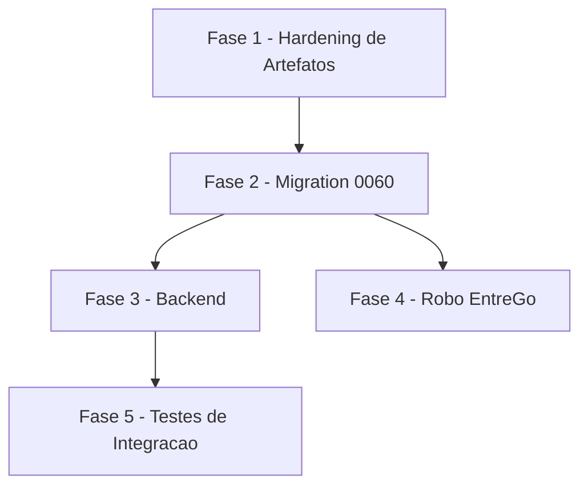

# Tarefas hub-enriquecimento-automatico

Escopo: fechar os 6 gaps do checklist da onda-006 (`checklists/requirements.md`
+ `checklists/security.md`) na própria spec/plan, escrever a migration `0060`
(idempotente, aplicada e provada **só** em `hub_homolog`), alterar o backend
(`routes/hub-robo-entrego.js` + `routes/hub-motoristas.js`) para persistir o
desfecho e priorizar o pedido manual, atualizar o robô EntreGô
(`infra/robo-entrego/`, em worktree) para enviar `sinalFalha`, e automatizar
os Scenarios 10-17 de `quickstart.md` como testes de integração. Backend-only
(dec-011) — UI e aplicação da `0060` em produção ficam fora deste backlog.

**Legenda de status:**
- `[ ]` Pendente
- `[~]` Em andamento
- `[x]` Concluido
- `[!]` Bloqueado

**Legenda de criticidade:**
- `[C]` Critico - Impacto financeiro direto ou bloqueante
- `[A]` Alto - Funcionalidade essencial
- `[M]` Medio - Necessario mas sem urgencia imediata

---

## FASE 1 - Hardening dos Artefatos (fechar os 6 gaps do checklist onda-006)

### 1.1 Corrigir o formato de FR-010..FR-013 para o gate reconhecer (CHK016) `[A]`

Ref: `checklists/requirements.md` CHK016, `spec.md` FR-010..FR-013

- [x] 1.1.1 Reescrever FR-010, FR-011, FR-012 e FR-013 em `spec.md` movendo a
      cláusula `(mitigação X, decisão do operador em \`block-003\`)` para
      IMEDIATAMENTE APÓS os dois-pontos, preservando o texto normativo
      integralmente — formato final:
      `- **FR-0NN**: (mitigação X, decisão do operador em \`block-003\`) <texto MUST original>`
- [x] 1.1.2 Rodar
      `~/.claude/skills/checklist/scripts/requirement-coverage.sh docs/specs/hub-enriquecimento-automatico/spec.md`
      e confirmar `requirements=13 covered=13 errors=0` como evidência de que
      o parsing passou a reconhecer FR-010..FR-013 (linha de base, ANTES da
      1.6 adicionar FR-014)
- [x] 1.1.3 Anotar em `spec.md`, junto às Clarifications, que o formato foi
      corrigido nesta onda referenciando CHK016 (nota curta, não reabre
      dec-022)

### 1.2 Documentar o teto reduzido com excedente pendente (CHK003/CHK012) `[M]`

Ref: `checklists/requirements.md` CHK003, `checklists/security.md` CHK012,
`spec.md` FR-010, `data-model.md` §O teto é de fila pendente

- [x] 1.2.1 Adicionar ao final de FR-010 em `spec.md` a frase normativa:
      reduzir o teto de uma empresa MUST NOT descartar nem re-classificar
      pedidos já pendentes; o excedente permanece na fila, sem meta de
      tempo, até ser drenado pelo processamento existente
- [x] 1.2.2 Referenciar a mesma regra em `data-model.md` §"O teto é de fila
      pendente, não um contador por importação" (nota curta apontando para o
      FR-010 atualizado, sem duplicar texto)
- [x] 1.2.3 Adicionar um Edge Case em `spec.md` citando o comportamento do
      teto reduzido, dando ao `requirement-coverage.sh` heurístico um
      cenário associado a FR-010

### 1.3 Quantificar o padrão mínimo de "auditável" de FR-013 (CHK007/CHK008/CHK023) `[M]`

Ref: `checklists/requirements.md` CHK008/CHK023, `checklists/security.md`
CHK007, `spec.md` FR-013, `data-model.md` §RLS de leitura sim; escrita pela
API não

- [x] 1.3.1 Adicionar a FR-013 em `spec.md` a frase: o critério de
      "auditável" satisfeito por este requisito é a própria linha da tabela
      `EnriquecimentoAutomatico` (`ativo`/`desde`/`atualizado_em`) somada ao
      registro no runbook de cutover — sem endpoint de administração nem
      linha formal em `"Auditoria"`, por desenho (`research.md` Decision 9)
- [x] 1.3.2 Confirmar que `data-model.md` §"RLS de leitura sim; escrita pela
      API não" já contém a mesma afirmação (só referenciar, sem texto
      divergente entre os dois artefatos)
- [x] 1.3.3 Rodar `requirement-coverage.sh` novamente após a reescrita e
      confirmar que FR-013 permanece coberto (sem regressão de cobertura
      pelo texto adicional)

### 1.4 Definir a janela de verificação de SC-004 (CHK014) `[M]`

Ref: `checklists/requirements.md` CHK014, `spec.md` SC-004,
`quickstart.md` Scenario 4 (linha 98)

- [x] 1.4.1 Reescrever SC-004 acrescentando uma janela de verificação
      concreta: observação de pelo menos **7 dias corridos** de execução do
      processamento automático (ambiente de teste, ou pós-cutover em
      produção) sem nenhuma reversão automática de `pessoa-nao-encontrada`
      para `nunca-tentado`
- [x] 1.4.2 Adicionar um Edge Case em `spec.md` citando SC-004 e a janela de
      7 dias definida, para o `requirement-coverage.sh` associar um cenário
- [x] 1.4.3 Estender o Scenario 4 de `quickstart.md` ("Os 4 desfechos são
      distinguíveis") com um passo final de verificação repetida (N
      execuções do consumidor ao longo da janela) confirmando que
      `pessoa-nao-encontrada` nunca volta sozinho a `nunca-tentado`

### 1.5 Registrar a pendência de retenção de PII como condição de cutover (CHK004/CHK020) `[A]`

Ref: `checklists/requirements.md` CHK020, `checklists/security.md` CHK004,
`spec.md` FR-013, `plan.md` §Riscos e §Fora de escopo (já contém o texto em
`plan.md`, falta em `spec.md`)

- [x] 1.5.1 Adicionar em `spec.md`, logo após FR-013, uma nota destacada
      declarando que o prazo de retenção/expurgo de CPF/RG/CNH (dívida
      herdada de `dec-038`/migration `0057`) não é definido por esta
      feature, e que o cutover de produção fica condicionado à definição
      prévia desse prazo pelo dono do produto
- [x] 1.5.2 Não resolver o prazo em si nesta tarefa — apenas tornar a
      pendência rastreável em `spec.md` (dec-022/H1 já fechou que isso não
      bloqueia esta implementação)
- [x] 1.5.3 Confirmar que o texto novo em `spec.md` não diverge do já
      existente em `plan.md` §Riscos/§Fora de escopo sobre a mesma condição

### 1.6 Tornar rastreável a sanitização de `sinalFalha` em auditoria (CHK013 / achado M4) `[A]`

Ref: `checklists/security.md` CHK013, `plan.md` §Achados owasp-security M4,
`contracts/entrego-desfecho.md` §Auditoria

- [x] 1.6.1 Adicionar **FR-014** em `spec.md`: o valor bruto de `sinalFalha`
      (controlado pelo serviço externo) MUST NOT ser gravado sem
      sanitização em nenhum registro de auditoria — apenas o valor já
      mapeado para um dos 4 desfechos (FR-006) pode ser persistido, e
      `motivoFalha` MUST ser truncado antes de gravar
- [x] 1.6.2 Adicionar um Edge Case em `spec.md` citando FR-014 (dado bruto de
      serviço externo, sem sanitização, nunca vai para a auditoria)
- [x] 1.6.3 Rodar `requirement-coverage.sh` novamente após 1.1 + 1.6 e
      confirmar `requirements=14 covered=14 errors=0`

---

## FASE 2 - Migration 0060 (banco, ambiente isolado)

### 2.1 Escrever `infra/hub/migrations/0060_entregador_enfileira_novo_e_desfecho.sql` `[C]`

Ref: `data-model.md` (texto SQL literal), `plan.md` §Project Structure

- [x] 2.1.1 `ALTER TABLE "Entregador" ADD COLUMN IF NOT EXISTS
      dados_entrego_desfecho text NOT NULL DEFAULT 'nunca-tentado'` +
      `CHECK (dados_entrego_desfecho IN ('nunca-tentado',
      'pessoa-nao-encontrada', 'outra-falha', 'sucesso'))` nomeada
      `entregador_dados_entrego_desfecho_check`
- [x] 2.1.2 `ALTER TABLE "Entregador" ADD COLUMN IF NOT EXISTS
      dados_entrego_solicitado_manual boolean NOT NULL DEFAULT false`
- [x] 2.1.3 Backfill loteado: `UPDATE "Entregador" SET
      dados_entrego_desfecho = 'sucesso' WHERE
      dados_entrego_enriquecidos_em IS NOT NULL AND
      dados_entrego_desfecho = 'nunca-tentado'`, em lotes conforme a
      medição de `research.md` Decision 4 (evita lock longo em tabela viva
      — achado M3 do gate)
- [x] 2.1.4 `CREATE TABLE IF NOT EXISTS "EnriquecimentoAutomatico"` com as 5
      colunas (`empresa_id` PK, `ativo` DEFAULT `false`, `teto` DEFAULT
      `100` CHECK `> 0`, `desde`, `atualizado_em`) — texto literal de
      `data-model.md` §Entity `EnriquecimentoAutomatico`
- [x] 2.1.5 `GRANT SELECT ON "EnriquecimentoAutomatico" TO authenticated` +
      `ENABLE ROW LEVEL SECURITY` + policy
      `enriquecimentoautomatico_select_por_escopo`
      (`USING (empresa_id = ANY (hub_jwt_escopo_ids()))`) — sem GRANT de
      escrita
- [x] 2.1.6 `CREATE INDEX IF NOT EXISTS idx_entregador_fila_enriquecimento
      ON "Entregador" (id_empresa, dados_entrego_solicitado_em) WHERE
      dados_entrego_solicitado_em IS NOT NULL`
- [x] 2.1.7 `CREATE OR REPLACE FUNCTION hub_entregador_enfileira_import()` —
      texto literal de `data-model.md` §Trigger novo, `SECURITY INVOKER` +
      `SET search_path = pg_catalog, public` (achado L1 do gate)
- [x] 2.1.8 `DROP TRIGGER IF EXISTS trg_entregador_enfileira_import ON
      "Entregador"` seguido de `CREATE TRIGGER trg_entregador_enfileira_import
      BEFORE INSERT OR UPDATE ON "Entregador" FOR EACH ROW EXECUTE FUNCTION
      hub_entregador_enfileira_import()`
- [x] 2.1.9 Confirmar que toda a migration é idempotente (`IF NOT EXISTS` /
      `CREATE OR REPLACE` / `DROP ... IF EXISTS` em cada objeto): rodar o
      arquivo duas vezes seguidas no ambiente isolado e confirmar 0 erro na
      segunda execução

### 2.2 Aplicar e provar a 0060 no ambiente isolado `hub_homolog` `[C]`

Ref: `infra/hub/RUNBOOK.md`, `quickstart.md` Cenário 6 (linha 152)

- [x] 2.2.1 Verificar que `hub_jwt_origem_importacao()` existe no
      `hub_homolog` antes de aplicar (pré-requisito bloqueante do gatilho —
      risco "L2" de `plan.md`: sem a função, o trigger fica inerte em
      silêncio)
- [x] 2.2.2 Rodar `infra/hub/scripts/migrate.sh -f
      infra/hub/compose.hub.homolog.yml -p hub-homolog -e
      /var/lib/hub_secrets/.env.hub.homolog` e confirmar o registro em
      `"SchemaMigration"`
- [x] 2.2.3 Confirmar o reload do schema cache do PostgREST pela contagem
      de funções no log do container (nunca por sonda HTTP em `/rpc/` —
      gotcha já documentado em `plan.md` §Riscos)
- [!] 2.2.4 Confirmar que o role `authenticated` não tem `CREATE` no schema
      `public` (verificação complementar do achado L1)
      **ACHADO (dec-042, nao corrigido nesta feature)**: verificacao
      empirica em `hub_homolog` mostra que `authenticated` HERDA `CREATE`
      no schema `public` via grant default `PUBLIC` (`nspacl` mostra
      `=UC/hub_homolog`, residual pre-PG15 do `postgres:13`), embora o
      grant explicito do role seja so `U`. `REVOKE ... FROM PUBLIC` e
      mudanca schema-wide fora do escopo desta feature backend-only
      (dec-011) — registrado para decisao futura dedicada, nao bloqueia
      esta entrega: a mitigacao real do achado L1 (search_path fixo +
      SECURITY INVOKER na funcao do gatilho) ja esta aplicada e correta.

### 2.3 Confirmar que a 0060 NÃO é aplicada em produção nesta entrega `[A]`

Ref: dec-022 (H1), `plan.md` §Fora de escopo

- [x] 2.3.1 Documentar em `quickstart.md`/runbook os comandos de
      habilitação por empresa (`INSERT`/`UPDATE` em
      `"EnriquecimentoAutomatico"`, `contracts/entrego-desfecho.md` §4) para
      uso futuro do operador — sem executá-los
- [x] 2.3.2 Checklist de fechamento da fase: confirmar que nenhuma subtarefa
      deste backlog aplica a `0060` no `chatmasterveloz`
- [x] 2.3.3 Registrar em `plan.md`/`quickstart.md` que a aplicação em
      produção permanece bloqueada até resposta à pendência registrada na
      tarefa 1.5 (prazo de retenção de PII)

---

## FASE 3 - Backend: persistência do desfecho e prioridade da fila

### 3.1 Mapear `sinalFalha` -> `dados_entrego_desfecho` no PATCH existente `[A]`

Ref: `routes/hub-robo-entrego.js` (handler do `PATCH
/motoristas/:id/entrego-enriquecimento`, ~linhas 184-262),
`contracts/entrego-desfecho.md` §1

- [x] 3.1.1 Ler `sinalFalha` do corpo da requisição: só considerar quando
      `typeof === 'string'` e `length <= 64`; caso contrário tratar como
      ausente
- [x] 3.1.2 Implementar o mapeamento fechado no servidor: `sucesso=true` ->
      `'sucesso'`; `sucesso=false` + `sinalFalha === 'pessoa_nao_encontrada'`
      -> `'pessoa-nao-encontrada'`; qualquer outro caso de falha (sinal
      desconhecido, ausente, `null` ou não-string) -> `'outra-falha'`
- [x] 3.1.3 Adicionar `dados_entrego_desfecho` e
      `dados_entrego_solicitado_manual: false` aos DOIS ramos do
      `patchBody` (sucesso e falha), no MESMO objeto que já grava
      `dados_entrego_enriquecidos_em` no ramo de sucesso — preserva o
      invariante dec-010 (nenhuma janela de divergência)
- [x] 3.1.4 Truncar `motivoFalha` a 500 caracteres antes de incluir em
      `detalhes.motivoFalha` (achado M4)
- [x] 3.1.5 Alterar a chamada a `registrarAuditoria`: `detalhes` passa a
      incluir `desfecho` (o valor já mapeado, um dos 4 tokens), nunca
      `sinalFalha` bruto — `detalhes` continua proibido de conter `dados`

### 3.2 Prioridade do pedido manual na leitura da fila `[A]`

Ref: `routes/hub-robo-entrego.js` (handler do `GET
/motoristas-para-enriquecer`, ~linhas 148-178), `contracts/entrego-desfecho.md`
§2

- [x] 3.2.1 Alterar o filtro do modo `sob-demanda` de
      `order=dados_entrego_solicitado_em.asc` para
      `order=dados_entrego_solicitado_manual.desc,dados_entrego_solicitado_em.asc`
- [x] 3.2.2 Confirmar que o modo `semestral` permanece inalterado (continua
      ordenando só por `dados_entrego_enriquecidos_em.asc`, sem ler nenhuma
      coluna nova)
- [x] 3.2.3 Confirmar que o ANTES/DEPOIS documentado em
      `contracts/entrego-desfecho.md` §2 bate exatamente com o código
      implementado (nenhuma divergência contrato-código)

### 3.3 `POST` manual marca o pedido como origem manual `[A]`

Ref: `routes/hub-motoristas.js` (handler do `POST
/:id/entrego-enriquecimento`, ~linhas 812-853), `data-model.md` §Prioridade
do pedido manual

- [x] 3.3.1 Alterar o `PATCH` que hoje grava só `dados_entrego_solicitado_em`
      nesse handler para incluir também `dados_entrego_solicitado_manual:
      true` no mesmo corpo (esse handler continua sem emitir a claim
      `origem_importacao`, então nunca aciona o gatilho da `0060`)
- [x] 3.3.2 Confirmar que o escopo multi-tenant continua resolvido 100% a
      partir de `entidadeAtiva`/`claims` (`resolverContextoEntidade`), nunca
      do corpo da requisição — nenhuma mudança de auth
- [x] 3.3.3 Confirmar que o `PATCH` do robô (task 3.1.3) já zera
      `dados_entrego_solicitado_manual` nos dois ramos, então um pedido
      manual atendido nunca fica marcado como "manual" indefinidamente

### 3.4 Testes unitários do backend `[A]`

Ref: `tests/hub-robo-entrego-enriquecimento-unit.test.js`,
`tests/hub-motoristas-entrego-enriquecimento-unit.test.js`

- [x] 3.4.1 Estender `hub-robo-entrego-enriquecimento-unit.test.js`
      cobrindo os 4 desfechos (`sucesso`, `pessoa-nao-encontrada`,
      `outra-falha` por sinal desconhecido, `outra-falha` por sinal
      ausente) e o invariante "mesmo PATCH" (dec-010)
- [x] 3.4.2 Adicionar teste de truncamento de `motivoFalha` (500 chars) e de
      que `sinalFalha` bruto nunca aparece em `detalhes` de auditoria
      (FR-014)
- [x] 3.4.3 Estender `hub-motoristas-entrego-enriquecimento-unit.test.js`
      cobrindo `dados_entrego_solicitado_manual: true` gravado pelo `POST`
      manual
- [x] 3.4.4 Adicionar teste de ordenação (`order=`) do `GET
      /motoristas-para-enriquecer?modo=sob-demanda` (manual antes de
      automático, FIFO dentro de cada grupo)
- [x] 3.4.5 Se algum arquivo de teste **novo** for criado (em vez de só
      estender os existentes), registrá-lo explicitamente nas listas
      `test`/`test:hub:unit` de `package.json` — `npm test` não usa glob, é
      lista de arquivos (gotcha já documentado: `scripts/checar-testes-orfaos.js`
      existe para prevenir regressão disso)
- [x] 3.4.6 Rodar `npm test` e `npm run test:hub:unit`; confirmar 0
      regressão sobre a suíte atual (925 testes verdes)

---

## FASE 4 - Robô EntreGô: enviar `sinalFalha` (worktree obrigatório)

### 4.1 Preparar worktree isolado antes de tocar `infra/robo-entrego/` `[M]`

Ref: `plan.md` §Riscos ("Mudar `infra/robo-entrego/` na working tree
principal altera o que roda em produção antes do merge"), memória "feature
robo-entrego"

- [x] 4.1.1 Criar/usar um git worktree separado (skill `parallel-work`,
      branch dedicada) para TODAS as alterações desta fase
- [x] 4.1.2 Confirmar que a working tree principal permanece intocada — o
      `ExecStart` do systemd em produção aponta para o diretório vivo do
      repositório
- [x] 4.1.3 Rodar a suíte atual do robô (`node --test
      infra/robo-entrego/test/`) no worktree ANTES de alterar, como
      baseline

### 4.2 Anexar `sinalFalha` ao PATCH enviado pelo cliente do robô `[A]`

Ref: `infra/robo-entrego/src/hub-client.js` (~linhas 283-287),
`infra/robo-entrego/src/enriquecimento.js` (~linha 259),
`contracts/entrego-desfecho.md` §3

- [x] 4.2.1 Alterar `hub-client.js`: no ramo de falha (`else`), incluir
      `corpo.sinalFalha = sinalFalha` quando presente, mantendo intacta a
      regra "`sucesso=false` NUNCA envia `dados`"
- [x] 4.2.2 Alterar `enriquecimento.js`: enviar `sinalFalha: e.sinal` junto
      de `motivoFalha: e.message` já existente (`e.sinal` pode ser
      `undefined` para erros sem sinal, o que cai em `outra-falha` no
      servidor)
- [x] 4.2.3 Confirmar que `entrego-portal.js` permanece INALTERADO — já
      define `this.sinal = 'pessoa_nao_encontrada'` em
      `ErroPessoaNaoEncontradaNoPortal` (linhas 80-86)

### 4.3 Testes do robô `[A]`

Ref: `infra/robo-entrego/test/hub-client.test.js`

- [x] 4.3.1 Estender `hub-client.test.js` com asserção de que o corpo do
      PATCH inclui `sinalFalha` quando a exceção o define
- [x] 4.3.2 Rodar `node --test` dentro do worktree, confirmar suíte verde
- [!] 4.3.3 Após o merge (autorização própria, fora deste backlog), rodar a
      suíte **no diretório vivo** do repositório — merge = deploy para este
      componente (memória "feature robo-entrego")
      **BLOQUEADO (deliberado)**: nenhuma autorização de merge foi concedida
      nesta execução (cláusula pétrea do rito git — commit/PR/merge/deploy
      exigem autorização explícita por etapa, uma etapa não implica a
      seguinte); a suíte já roda verde no worktree (4.3.2, 224/224). Esta
      subtarefa permanece aberta até o operador autorizar e executar o
      merge, fora do escopo deste backlog.

---

## FASE 5 - Testes de Integração no ambiente isolado `hub_homolog` (Scenarios 10-17)

### 5.1 Automatizar Scenario 10 — teto segura a importação grande, excedente não se perde `[A]`

Ref: `quickstart.md` Scenario 10 (linha 319), FR-010/SC-005

- [x] 5.1.1 Escrever teste de integração: importar lote acima do teto
      configurado, confirmar que só `teto` pedidos ficam pendentes
      (`dados_entrego_solicitado_em IS NOT NULL`)
- [x] 5.1.2 Confirmar que o excedente entra na importação seguinte, depois
      de a fila drenar (reimportar o mesmo `id_externo`, ramo `DO UPDATE`)
- [x] 5.1.3 Confirmar SC-001: a soma de enfileirados ao longo de múltiplas
      importações continua chegando a 100% dos entregadores novos

### 5.2 Automatizar Scenario 11 — pedido manual fura a fila `[A]`

Ref: `quickstart.md` Scenario 11 (linha 354), FR-011/SC-006

- [x] 5.2.1 Escrever teste de integração: N pedidos automáticos + 1 pedido
      manual criado depois, confirmar que o manual é o primeiro item
      retornado por `GET ?modo=sob-demanda`
- [x] 5.2.2 Confirmar SC-006: a ordem de atendimento (não só a resposta da
      query) reflete manual-primeiro
- [x] 5.2.3 Confirmar que os pedidos automáticos anteriores não são
      descartados, só adiados (permanecem na fila, atrás do manual)

### 5.3 Automatizar Scenario 12/17 — empresa não habilitada e RLS da habilitação `[A]`

Ref: `quickstart.md` Scenario 12 (linha 378) e Scenario 17 (linha 497),
FR-012/FR-013/SC-007

- [x] 5.3.1 Escrever teste de integração: importar para empresa sem linha
      em `"EnriquecimentoAutomatico"`, confirmar 0 enfileirados
- [x] 5.3.2 Escrever teste de integração de RLS: JWT de uma empresa não
      enxerga, via `SELECT`, a linha de habilitação de outra empresa
- [x] 5.3.3 Confirmar SC-007: a fila da empresa não habilitada permanece
      inalterada após a importação

### 5.4 Automatizar Scenario 13 — retroatividade continua fora `[A]`

Ref: `quickstart.md` Scenario 13 (linha 401), FR-002

- [x] 5.4.1 Escrever teste de integração: entregador com `criado_em`
      anterior a `"EnriquecimentoAutomatico".desde`, reimportar (ramo
      `UPDATE`), confirmar que não é enfileirado
- [x] 5.4.2 Confirmar que a reimportação (ramo `UPDATE`) não altera
      `criado_em` nem contorna o recorte de elegibilidade
- [x] 5.4.3 Confirmar que a exclusão de retroatividade se mantém mesmo com
      o evento `UPDATE` novo do gatilho (o que o distingue do bloqueio
      humano de `hub-motorista-360`)

### 5.5 Automatizar Scenario 14/16 — convivência de gatilhos e regressão do evento `UPDATE` `[A]`

Ref: `quickstart.md` Scenario 14 (linha 426) e Scenario 16 (linha 471)

- [x] 5.5.1 Escrever teste de integração confirmando que
      `trg_entregador_protege_nome` (`0019`/`0025`) e
      `trg_entregador_enfileira_import` coexistem sem conflito (campos
      disjuntos: `nome` vs `dados_entrego_solicitado_em`)
- [x] 5.5.2 Escrever teste de regressão: `UPDATE` fora do pipeline de
      importação (sem a claim `origem_importacao`) nunca enfileira, mesmo
      alcançando o gatilho
- [x] 5.5.3 Confirmar que a ordem de dois gatilhos `BEFORE UPDATE` de linha
      (alfabética por nome de gatilho) não afeta o resultado, por
      escreverem campos disjuntos

### 5.6 Registrar a nova suíte de integração no runner do projeto `[A]`

Ref: `package.json` script `test:hub:integration`

- [x] 5.6.1 Adicionar o(s) novo(s) arquivo(s) de teste de integração à
      lista explícita de `test:hub:integration` em `package.json` — não usa
      glob (mesmo gotcha de `scripts/checar-testes-orfaos.js`)
- [x] 5.6.2 Rodar `npm run test:hub:integration` contra `hub_homolog` e
      confirmar suíte verde, sem regressão nos testes de integração
      existentes (`hub-motorista-360-integration.test.js` e demais) —
      EVIDÊNCIA: `bash infra/hub/testes/hub-enriquecimento-automatico-integration-homolog.sh`
      → `HUB-ENRIQUECIMENTO-AUTOMATICO-INTEGRATION-HOMOLOG: OK (0 falhas)`,
      45 asserções PASS / 0 FAIL, executado 3x seguidas com resultado
      idêntico (script idempotente com cleanup próprio); imagem
      `hub-backend:homolog` rebuildada 24 min antes da medição e container
      reiniciado, garantindo que o código da FASE 3 estava de fato em
      execução
- [x] 5.6.3 Confirmar cobertura dos 7 Scenarios obrigatórios (10, 11, 12,
      13, 14, 16, 17) no relatório final — Scenario 15 é opcional
      (reprodução de medições) e fica de fora deste backlog — EVIDÊNCIA:
      os 7 cabeçalhos de Scenario apareceram no stdout da execução acima
      (10 teto/excedente, 11 manual fura a fila, 12 empresa não
      habilitada, 13 retroatividade fora, 14 convivência de gatilhos, 16
      regressão do evento UPDATE, 17 RLS da habilitação)

---

## Matriz de Dependências

## Resumo Quantitativo

| Fase | Tarefas | Subtarefas | Criticidade |
|------|---------|------------|-------------|
| 1 - Hardening dos Artefatos | 6 | 18 | A, M |
| 2 - Migration 0060 | 3 | 16 | C, A |
| 3 - Backend | 4 | 17 | A |
| 4 - Robô EntreGô | 3 | 9 | M, A |
| 5 - Testes de Integração | 6 | 18 | A |
| **Total** | **22** | **78** | - |

## Escopo Coberto

| Item | Descricao | Fase |
|------|-----------|------|
| Hardening de artefatos | Fecha os 6 gaps do checklist onda-006: CHK016 (formato do gate), CHK003/CHK012 (teto reduzido), CHK007/CHK008/CHK023 (padrão de "auditável"), CHK014 (janela de SC-004), CHK004/CHK020 (condição de cutover — registro, não resolução), CHK013 (FR-014 novo, sanitização de `sinalFalha`) | 1 |
| Migration `0060` | 2 colunas em `"Entregador"`, tabela `"EnriquecimentoAutomatico"` com RLS, índice parcial, função + gatilho `BEFORE INSERT OR UPDATE ... FOR EACH ROW`, aplicada e provada só em `hub_homolog` | 2 |
| Persistência do desfecho + prioridade da fila | `routes/hub-robo-entrego.js` (PATCH mapeia `sinalFalha`, GET ordena manual-primeiro) + `routes/hub-motoristas.js` (POST marca `solicitado_manual`) | 3 |
| Robô EntreGô envia `sinalFalha` | `infra/robo-entrego/src/hub-client.js` + `enriquecimento.js`, alterado em worktree | 4 |
| Testes de integração `hub_homolog` | Scenarios 10, 11, 12, 13, 14, 16, 17 de `quickstart.md` | 5 |

## Escopo Excluido

| Item | Descricao | Motivo |
|------|-----------|--------|
| UI no `frontend_v2` | Exposição visual do desfecho (badge etc.) | dec-011 — escopo somente backend nesta feature; UI fica para feature futura |
| Aplicar a `0060` em produção (`chatmasterveloz`) | DDL + gatilho no banco de produção | dec-022/H1 — cutover condicionado à definição do prazo de retenção/expurgo de PII; autorização por etapa não concedida |
| Habilitar a empresa em produção | `INSERT` em `"EnriquecimentoAutomatico"` para a empresa Movee | Idem — parte do cutover, fora desta entrega |
| Definir prazo de retenção/expurgo de PII | Política de retenção de CPF/RG/CNH coletados pelo enriquecimento | Dívida herdada de `dec-038`/`0057`, decisão do dono do produto — a FASE 1 só REGISTRA a pendência como condição de cutover, não a resolve |
| Retroatividade (enfileirar entregadores já cadastrados) | Enfileirar quem nunca foi enriquecido e já existia antes da habilitação | Foi bloqueio humano na feature irmã `hub-motorista-360`; `plan.md` §Fora de escopo proíbe reabrir aqui |
| Rota administrativa de habilitação | Endpoint para ligar/desligar o enfileiramento automático via API | `research.md` Decision 9 — habilitação é ato de runbook (banco), não de API; é a separação que FR-013 exige |
| Alerta de fila parada | Observabilidade de fila com pendentes e nenhum consumo | `plan.md` §Fora de escopo — nega-por-padrão (FR-012) já elimina a causa do risco M2 |
