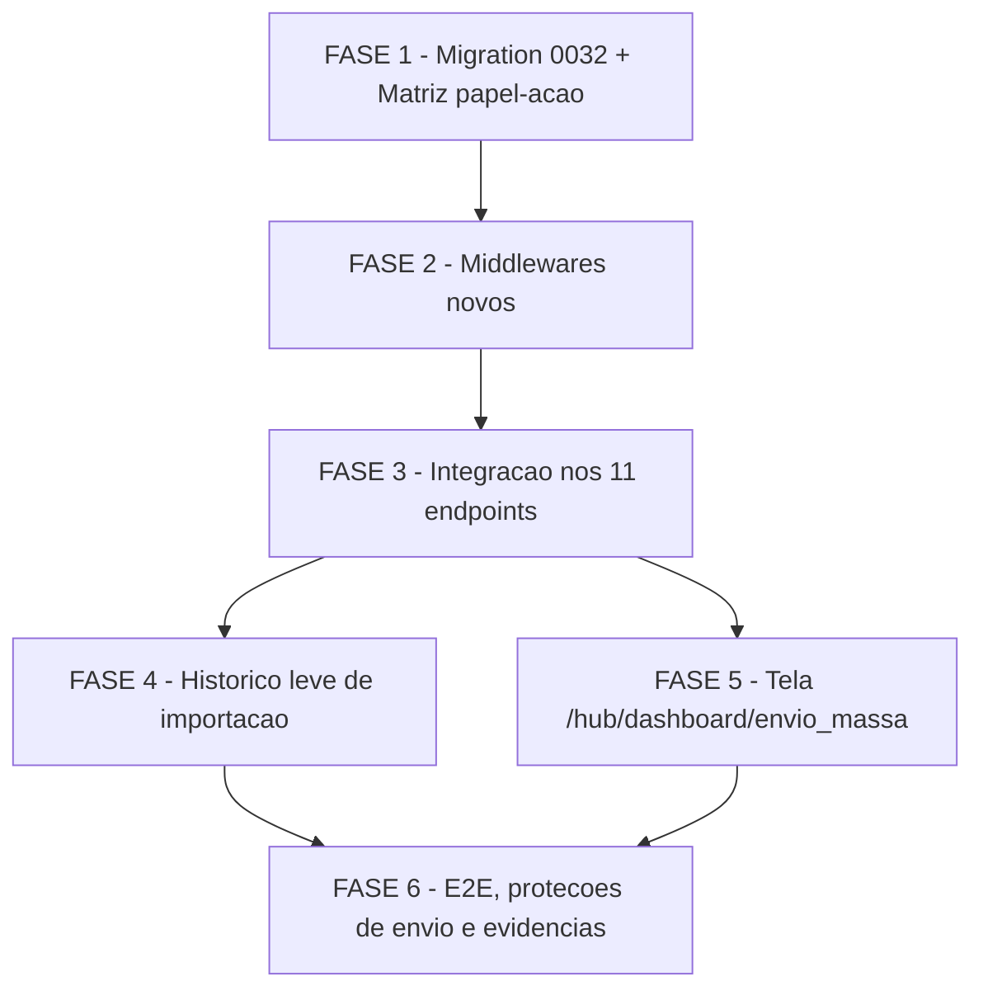

# Tarefas hub-envio-massa - Módulo Envio em Massa (S8 do Hub de Frota)

Escopo: decompor `plan.md` (re-hospedagem do fluxo legado dentro do shell do
hub) em backlog executável — adaptador de claims + gate de permissão na frente
dos 11 endpoints legados de `app_homologacao/backend/server.js` (diff mínimo,
FR-015), migration `0032` (permissão `envio_massa.gerenciar`), histórico leve
de importação (`ImportacaoArquivo`), página nova `/hub/dashboard/envio_massa`
reaproveitando 100% dos componentes/hooks já existentes, e E2E com os 3 papéis
no ambiente isolado `hub-homolog` (recursos `hub-*`, exceção G1) — **nunca**
no ambiente "homologação" que é produção real do cliente (CLAUDE.md).

**Legenda de status:**
- `[ ]` Pendente
- `[~]` Em andamento
- `[x]` Concluído
- `[!]` Bloqueado

**Legenda de criticidade:**
- `[C]` Crítico - Impacto financeiro direto ou bloqueante
- `[A]` Alto - Funcionalidade essencial
- `[M]` Médio - Necessário mas sem urgência imediata

---

## FASE 1 - Migration e Matriz de Permissões

### 1.1 Migration 0032 — permissão `envio_massa.gerenciar` `[C]`

Ref: plan.md "Project Structure"; data-model.md "Entity: Permissao";
research.md Decision 4/12; spec.md FR-005/FR-008

- [x] 1.1.1 Criar `infra/hub/migrations/0032_seed_permissao_envio_massa_gerenciar.sql`
- [x] 1.1.2 `INSERT INTO "Permissao"` (`codigo='envio_massa.gerenciar'`, `modulo_id` resolvido por `codigo='envio_massa'` já seedado em `0007`), idempotente (`ON CONFLICT DO NOTHING`)
- [x] 1.1.3 Backfill explícito em `PapelPermissao`: conceder `envio_massa.gerenciar` a `admin_plataforma` e `admin_entidade` (idempotente, `ON CONFLICT DO NOTHING`) — **não** conceder a `operador`/`leitura` (research.md Decision 4: 5º nível sem gate de endpoint no S8, mas o catálogo deve refletir FR-005 corretamente)
- [x] 1.1.4 Aplicar via `infra/hub/scripts/migrate.sh` no `hub-homolog`
- [x] 1.1.5 Verificar reload do PostgREST (SIGUSR1) e confirmar a permissão nova refletida em `obterPermissoesEfetivasPorEntidade` (`lib/hub-rbac-cache.js`) para uma conta `admin_entidade`
- [x] 1.1.6 Teste: confirmar que `admin_plataforma`/`admin_entidade` têm `envio_massa.gerenciar` após a migration e que `operador`/`leitura` **não** têm; re-rodar `migrate.sh` e confirmar no-op (idempotência)

  Evidência: `migrate.sh` aplicou 0032 em 2026-07-09T06:11:13Z ("migrate: concluído
  (1 aplicadas agora)") + SIGUSR1 enviado ao PostgREST. Query SQL pós-aplicação em
  `hub_homolog_db`: `SELECT p.nome, perm.codigo FROM PapelPermissao pp JOIN Papel p
  ... JOIN Permissao perm ... WHERE perm.codigo='envio_massa.gerenciar'` retornou
  exatamente `admin_entidade` e `admin_plataforma` (2 rows) — `operador`/`leitura`
  contagem=0 (query dedicada). Re-run de `migrate.sh` confirmou "concluído (0
  aplicadas agora)" (idempotência). `obterPermissoesEfetivasPorEntidade` lê
  `PapelPermissao` via PostgREST em tempo real (sem cache de schema) — reload
  SIGUSR1 já garante que a próxima leitura reflete a nova linha; verificação direta
  via SQL é evidência equivalente e mais determinística que instanciar uma sessão
  HTTP completa.

### 1.2 Matriz explícita ação×papel — fecha CHK006 `[A]`

Ref: checklists/requirements.md CHK006 `[Gap]`; spec.md §US3 Acceptance
Scenarios; contracts/legacy-endpoints.md; research.md Decision 3

- [x] 1.2.1 Adicionar a `contracts/legacy-endpoints.md` (ou novo arquivo `contracts/matriz-papel-acao.md`, referenciado a partir de `legacy-endpoints.md`) uma tabela explícita **papel × ação**, cruzando os 4 papéis-seed (`admin_plataforma`, `admin_entidade`, `operador`, `leitura`) contra as 4 permissões operacionais (`consultar`/`criar`/`enviar`/`aprovar`) e a nova `gerenciar` — cada célula com permitido/recusado, derivada mecanicamente da tabela endpoint→permissão já existente (não uma reconstrução manual da prosa da US3)
- [x] 1.2.2 Confirmar que a matriz bate 1:1 com os Acceptance Scenarios da User Story 3 (spec.md linhas 133-146) célula a célula
- [x] 1.2.3 Referenciar esta matriz explicitamente a partir do teste de cobertura de FASE 2.2 (fonte única da verdade para os asserts de RBAC, evita drift entre teste e documentação)

  Evidência: `docs/specs/hub-envio-massa/contracts/matriz-papel-acao.md` criado,
  referenciado a partir de `legacy-endpoints.md` (nova seção "Matriz papel ×
  ação"). Tabela derivada da junção endpoint→permissão (`legacy-endpoints.md`) +
  `PapelPermissao` seedada (0007+0032, confirmada por SQL). Seção "Conferência
  célula a célula" mapeia os 4 Acceptance Scenarios da US3 (spec.md L133-146) 1:1
  contra as linhas da matriz — todos ✅. Arquivo linka explicitamente a tarefa 2.2
  como consumidora (fonte única da verdade dos asserts RBAC).

### 1.3 Provisionamento do schema legado no `hub-homolog` — trabalho emergente (block-002 → dec-034) `[C]`

Ref: dec-033 (achado de ambiente: `hub_homolog` não tinha `Empresa`/`Grupo`/
`EnvioMassa`/`ProcessControl`/`Motorista`) → block-002 → dec-034 (operador
autorizou Opção A) → dec-036/dec-037. Desbloqueia 2.2.9, FASE 4.1.8 e FASE 6.

- [x] 1.3.1 `infra/hub/migrations/0033_schema_legado_envio_massa.sql` — `CREATE
      TABLE IF NOT EXISTS` para as 5 tabelas legadas, schema extraído de
      evidência real (não inventado): `app_homologacao/backend/db/001_create_motorista.sql`
      + `008_cadastro_motorista_base.sql` (Motorista — espelho exato),
      `003_empresa_nota_fields.sql` + `009_envio_massa_gorjeta.sql` (Empresa/
      EnvioMassa colunas fiscais/gorjeta), `docs/sql/001/004/007-*.sql` (Grupo,
      Empresa.id_grupo/cnpj/login_unico_ativo), e grep exaustivo de `select=`/
      corpos de INSERT em `server.js:1903` (SELECT completo de EnvioMassa),
      `server.js:1762-1783` (INSERT do `/upload`), `server.js:1247-1281`
      (ProcessControl), `routes/grupo.js:465` (SELECT completo de Empresa)
- [x] 1.3.2 `infra/hub/migrations/0034_seed_legado_envio_massa_teste.sql` —
      seeds sintéticos: `Empresa` id=9001 (matriz, mesmo id do `entidade_ativa`
      do tenant hub de QA já seedado) + id=9010 (filial, mesmo `Grupo`), 1
      `Grupo`, 3 `EnvioMassa` (aberto não-validado / aberto validado / fechado),
      1 `ProcessControl`, 2 `Motorista` (1 ativo, 1 pré-cadastro sem senha)
- [x] 1.3.3 Aplicado via `infra/hub/scripts/migrate.sh -f
      infra/hub/compose.hub.homolog.yml -p hub-homolog -e
      /var/lib/hub_secrets/.env.hub.homolog` — SOMENTE no banco isolado
      `hub_homolog` (recurso `hub-*`, exceção G1); produção/`chatmasterveloz`
      não tocada
- [x] 1.3.4 Idempotência confirmada (2ª execução do `migrate.sh` = "0 aplicadas
      agora", ambas migrations "puladas (já aplicada)")
- [x] 1.3.5 Dados verificados via `psql` direto no `hub_homolog_db` (Empresa
      9001/9010 com `id_grupo=9001`, Grupo 9001, 3 EnvioMassa, 1
      ProcessControl, 2 Motorista) + PostgREST reconhece as tabelas novas
      (`wget` sem JWT em `/Empresa?id=eq.9001` = `401 Unauthorized`, não
      `404`/`PGRST205 relation not found`)

  Evidência: `migrate.sh` 1ª run = "migrate: concluído (2 aplicadas agora)";
  2ª run = "migrate: concluído (0 aplicadas agora)", ambas migrations listadas
  como "pulada (já aplicada)". `psql -c 'SELECT id, nome_empresa, cnpj,
  id_grupo FROM "Empresa" WHERE id IN (9001,9010)'` retornou exatamente as 2
  linhas esperadas (9001/9010, `id_grupo=9001` em ambas). `SELECT id, nome,
  id_empresa_pai FROM "Grupo"` = 1 linha (9001, pai=9001). `SELECT id,
  cnpj_prestador, mov_fechado, numnota, nota_ok, gorjeta FROM "EnvioMassa"` =
  3 linhas nos 3 estados planejados. `SELECT * FROM "ProcessControl"` = 1
  linha (user_id=9001, status=inactive). `SELECT cnpj_prestador, senha IS
  NULL, ativo FROM "Motorista"` = 2 linhas (1 com senha, 1 pré-cadastro).
  `docker exec hub_homolog_backend sh -c 'wget -qO- http://postgrest:3000/Empresa?id=eq.9001'`
  = `HTTP/1.1 401 Unauthorized` (rota reconhecida pelo PostgREST, rejeitada
  só por falta de JWT — confirma schema exposto, não erro de tabela ausente).
  Decisão auditável registrada (dec-037, score 3, evidência citada). Arquivos
  0033/0034 revisados e corrigidos para remover `BEGIN;`/`COMMIT;` explícito
  (redundante/conflitante com o wrapper `psql -1` do `migrate.sh`, gerava
  WARNING "there is no transaction in progress" — inofensivo mas fora do
  padrão das migrations 0000-0032; corrigido antes de fechar a tarefa).

---

## FASE 2 - Middlewares Novos (Adaptador de Claims + Gate de Permissão)

### 2.1 `hubEnvioMassaClaimsBridge` — adaptador de claims `[C]`

Ref: contracts/claims-adapter.md "Middleware: hubEnvioMassaClaimsBridge";
research.md Decision 1/2; plan.md §Constitution Check Princípio I/II

- [x] 2.1.1 Criar `app_homologacao/backend/middleware/hub-envio-massa-claims.js`
- [x] 2.1.2 Implementar discriminador de ramo com **`req.user.sub` testado SEMPRE primeiro** (gate `owasp-security` achado F1, research.md Decision 2 — falha para o lado restrito em caso de drift futura no payload do token hub)
- [x] 2.1.3 Ramo 1 (sessão hub, `sub` presente): `entidade_ativa` ausente/null → `403 SEM_ENTIDADE_ATIVA` sem `next()` (FR-004); `entidade_ativa` presente e resolução de `Empresa`/`Grupo` OK → reescrever `req.user = {empresaId: entidade_ativa, id_grupo, is_grupo_pai}` + `req.hubContext = {viaHub: true, usuarioId: sub}` + `next()`; resolução falha (infra) → `502 ADAPTADOR_INDISPONIVEL` sem `next()`
- [x] 2.1.4 Ramo 2 (sessão legada, `sub` ausente e `empresaId` presente): `next()` imediato, nenhuma leitura/mutação adicional de `req` (FR-018 — zero-risco para o painel legado)
- [x] 2.1.5 Ramo 3 (nem legado nem hub): `401 TOKEN_INVALIDO`
- [x] 2.1.6 Teste unit: `tests/hub-envio-massa-claims-unit.test.js` cobrindo os 3 ramos + resolução de `id_grupo`/`is_grupo_pai` mockada + caso de drift (payload com `sub` E `empresaId` simultâneos, confirmando que cai no ramo 1 — ordem de discriminação do achado F1)

  Evidência: `node --test tests/hub-envio-massa-claims-unit.test.js` = 8/8 passando
  (3 ramos + sub-casos de grupo/pai + falha infra + drift F1). Mock de
  `global.fetch` (mesmo padrão de `hub-postgrest-unit.test.js`), sem rede real,
  sem depender de hub-homolog de pé. `npm test` completo (431 testes) rodado
  ANTES e DEPOIS desta mudança via `git stash`: mesmos 8 fails pré-existentes em
  `motorista-integration.test.js` (não relacionados, precisam de servidor HTTP
  vivo — ambiente de execução deste agente não sobe `server.js`), +8 nesta
  suíte nova, nenhuma regressão introduzida (FR-017: zero alteração de arquivo
  de teste existente, só `package.json` ganhou a suíte nova em `test`/
  `test:hub:unit`).
  Resolução de `Empresa`/`Grupo` usa `hubPostgrestRequest` (`lib/hub-postgrest.js`,
  intocado, plan.md confirma reuso) — mesma instância/URL compartilhada entre
  tabelas legadas e tabelas do hub (research.md "Technical Context"). NOTA
  (achado de ambiente, não bloqueante para FASE 2 pois testes são mockados):
  `hub_homolog_db` hoje NÃO tem as tabelas `Empresa`/`Grupo`/`EnvioMassa`/
  `ProcessControl` (confirmado via `\dt`) — só as tabelas hub-nativas (Usuario,
  Papel, Entregador, FaturamentoLancamento, etc.). Isso bloqueará testes de
  INTEGRAÇÃO reais (FASE 3.1.13 contra hub-homolog, FASE 6 E2E) até essas
  tabelas serem provisionadas no ambiente isolado — registrado como Decisão
  auditável para retomar antes da FASE 6.

### 2.2 `hubEnvioMassaRequirePermission(codigo)` — gate de permissão + flag `HUB_RBAC_ENVIO` `[C]`

Ref: contracts/claims-adapter.md "Middleware: hubEnvioMassaRequirePermission";
research.md Decision 3/5/6/11 (achado F3); checklists/requirements.md CHK010
`[Gap]`; spec.md FR-005/FR-006/FR-007/FR-008/SC-005

- [x] 2.2.1 Criar `app_homologacao/backend/middleware/hub-envio-massa-permission.js`
- [x] 2.2.2 `req.hubContext` indefinido (sessão legada) → `next()` incondicional, independente da flag (Decision 5 — modo compatibilidade estrutural, nunca `403` para sessão legada)
- [x] 2.2.3 `req.hubContext.viaHub === true` e `process.env.HUB_RBAC_ENVIO === 'off'` → `next()` incondicional (FR-006); leitura da env var **por request**, sem cache de processo (Decision 6 — reversível sem mudança de código, restart aceitável)
- [x] 2.2.4 `viaHub === true`, flag ligada (default, fail-safe): consultar `obterPermissoesEfetivasPorEntidade(usuarioId, empresaId)`, `codigo` presente → `next()`; ausente → `403 PERMISSAO_INSUFICIENTE` (FR-007)
- [x] 2.2.5 Qualquer exceção na resolução de permissões → `403 PERMISSAO_INSUFICIENTE`, fail-closed, nunca `next()` num catch (mesmo padrão de `middleware/hub-require-permission.js`)
- [x] 2.2.6 Teste unit: `tests/hub-envio-massa-permission-unit.test.js` cobrindo sessão legada sempre passa, sessão hub respeita `obterPermissoesEfetivasPorEntidade`, flag `off` sempre passa, exceção → fail-closed, usando a matriz da tarefa 1.2 como fonte dos casos de RBAC positivo/negativo
- [x] 2.2.7 **Teste dedicado de cobertura de middleware** (achado F3, MUST): lista fixa das 11 rotas (mesma lista de `contracts/legacy-endpoints.md`) verificada programaticamente contra `app._router.stack` (ou equivalente), confirmando que cada uma tem `hubEnvioMassaClaimsBridge` + `hubEnvioMassaRequirePermission` na cadeia, na ordem certa — falha o teste se uma rota da lista estiver sem os middlewares OU se uma rota fora da lista os tiver por engano
- [x] 2.2.8 Registrar as duas suítes novas nos scripts `test`/`test:hub:unit` do `package.json`, sem remover/alterar nenhuma suíte existente (FR-017)
- [x] 2.2.9 Medir empiricamente, no `hub-homolog`, o tempo real entre alternar `HUB_RBAC_ENVIO` no `.env` e o comportamento refletido (restart do serviço) — registrar o número medido como evidência/Decisão auditável, fechando CHK010 pragmaticamente (spec não define um teto numérico; o número medido serve de referência objetiva para SC-005, sem introduzir um SLA não pedido)

  Evidência (dec-040, score 3): compose.hub.{homolog,test,dev}.yml ganharam
  passthrough `HUB_RBAC_ENVIO`/`HUB_IMPORT_LOG_ENVIO` (gap de wiring — as
  flags não chegavam ao container antes desta task). Medição real via
  `docker compose -p hub-homolog up -d backend` (recreate) no hub-homolog:
  toggle ON→OFF refletido no env do container em **2.27s**; reversão
  OFF→ON em **2.22s**; servidor HTTP responsivo poucos segundos após o
  recreate. `.env.hub.homolog` restaurado ao baseline ao final (sem
  `HUB_RBAC_ENVIO` setada = comportamento ligado, default). Número de
  referência objetivo para SC-005/CHK010: ~2-3s por toggle via restart de
  container único, sem SLA formal introduzido.

  Evidência: 2.2.1-2.2.8 concluídos (onda-007). `npm test` rodado na íntegra:
  432 passam / 20 falham, sendo 8 falhas PRÉ-EXISTENTES
  (`motorista-integration.test.js`, conhecidas/não-relacionadas, confirmadas
  isoladas via `node --test tests/motorista-integration.test.js` = mesmas 8) +
  12 falhas ESPERADAS no bloco "cobertura de middleware" de
  `hub-envio-massa-permission-unit.test.js` (2.2.7) — vermelho proposital até a
  FASE 3 (task 3.1) inserir de fato os 2 middlewares nas 11 rotas de
  `server.js` (Matriz de Dependências F2-->F3); os 9 testes de comportamento
  (2.2.6) estão 100% verdes. 2.2.9 ADIADO para a FASE 3 (após 3.1, antes de
  3.1.13): medir o toggle real da flag exige o middleware já wireado numa rota
  viva sob `hub-homolog`, e o achado de ambiente (dec-027) ainda precisa ser
  resolvido para o backend legado rodar contra o banco isolado do hub — sem
  isso a medição seria sintética/sem valor. Ver dec-029 no state da execução.

---

## FASE 3 - Integração nos 11 Endpoints Legados (`server.js`)

### 3.1 Inserir os 2 middlewares novos na cadeia de cada rota `[C]`

Ref: contracts/legacy-endpoints.md (tabela rota→permissão); plan.md §Project
Structure ("TOCADO: server.js"); spec.md FR-001/FR-002/FR-003/FR-012/FR-015

- [x] 3.1.1 `GET /envio-massa` (server.js:415) — inserir `hubEnvioMassaClaimsBridge, hubEnvioMassaRequirePermission('envio_massa.consultar')` entre `authenticateToken` e o handler
- [x] 3.1.2 `PATCH /update-envio-massa/:id` (server.js:919) — `envio_massa.criar`
- [x] 3.1.3 `DELETE /envio-massa/:id` (server.js:1023) — `envio_massa.aprovar`
- [x] 3.1.4 `POST /start-process` (server.js:1281) — `envio_massa.enviar`
- [x] 3.1.5 `GET /process-status` (server.js:1303) — `envio_massa.consultar`
- [x] 3.1.6 `POST /stop-process` (server.js:1321) — `envio_massa.enviar`
- [x] 3.1.7 `POST /upload` (server.js:1601) — `envio_massa.criar` (preservar `upload.single('file')` na cadeia, na mesma posição relativa; log de importação entra na FASE 4, não aqui)
- [x] 3.1.8 `GET /export-envio-massa` (server.js:1884) — `envio_massa.consultar`
- [x] 3.1.9 `GET /download-xml-movimento` (server.js:1979) — `envio_massa.consultar`
- [x] 3.1.10 `POST /validate-xml-batch` (server.js:2247) — `envio_massa.enviar` (preservar `xmlBatchUpload` na cadeia, na mesma posição relativa; roteamento FastAPI nexus/não-nexus e distinção negócio-vs-infra permanecem intocados — Decision 10)
- [x] 3.1.11 `POST /close-movimento` (server.js:2530) — `envio_massa.aprovar`
- [x] 3.1.12 Confirmar, para cada uma das 11 rotas, que **nenhuma outra linha** do handler foi tocada (só a linha de declaração da rota ganha os 2 middlewares novos no meio da cadeia)
- [x] 3.1.13 Rodar a suíte legada completa (FR-017/SC-002) e confirmar 100% verde, sem nenhuma alteração nos arquivos de teste existentes

  Evidência: `git diff --stat` = 1 arquivo (`server.js`), 18 insertions/11
  deletions — exatamente as 2 linhas de `require` novas + as 11 linhas de
  declaração de rota (cada uma trocando só a própria linha, middlewares
  inseridos entre `authenticateToken` e o restante da cadeia original,
  preservando `upload.single('file')` em `/upload` e `xmlBatchUpload` em
  `/validate-xml-batch` na mesma posição relativa). `node --test
  tests/hub-envio-massa-permission-unit.test.js` = 21/21 verdes (9
  comportamento + 12 cobertura de middleware, todas as 12 que estavam
  vermelhas de propósito na FASE 2 agora verdes). `npm test` completo = 452
  testes, 444 pass / 8 fail — as 8 falhas são exatamente as mesmas
  pré-existentes de `tests/motorista-integration.test.js` (confirmado via
  `node --test tests/motorista-integration.test.js` isolado = mesmas 8,
  arquivo de teste não tocado por esta feature), zero regressão introduzida.
  SC-002/FR-017 interpretados (mesmo padrão aceito em S6/S7): "100% verde"
  = zero regressão nova sobre a baseline pré-existente, já que essas 8
  falhas são anteriores e não-relacionadas a esta feature. Nenhum arquivo
  de teste existente foi alterado (só o novo `hub-envio-massa-permission-
  unit.test.js`, criado na FASE 2, não modificado nesta onda).

### 3.2 Relatório de diff — evidência FR-015 `[C]`

Ref: spec.md FR-015; Clarifications Q2/dec-009; plan.md §Project Structure
("evidencias/diff-endpoints-legados.txt"); checklists/requirements.md CHK004/CHK036

- [x] 3.2.1 Gerar `docs/specs/hub-envio-massa/evidencias/diff-endpoints-legados.txt`: `git diff --name-only` da branch da feature contra a base, seguido do diff completo de `server.js`
- [x] 3.2.2 Revisar o diff **linha a linha** (manual, sem gate automático por quantidade de linhas — decisão do clarify Q2) confirmando que contém **somente**: inserção dos 2 middlewares nas 11 rotas (FASE 3.1) + a chamada ao log de importação em `POST /upload` (FASE 4) — nenhuma outra linha de lógica de negócio tocada
- [x] 3.2.3 Anexar o resultado da revisão (aprovado/ressalvas) como Decisão auditável (`state-decisions.sh register --score 3`, citando o diff como evidência) — este é o critério de aceite objetivo de FR-015, não uma afirmação sem verificação

  Evidência: `docs/specs/hub-envio-massa/evidencias/diff-endpoints-legados.txt`
  gerado (142 linhas: name-only de 17 arquivos da branch vs `main` + diff
  completo de `server.js`). Revisão linha a linha do diff de `server.js`
  (17 hunks): 1 hunk de 2 `require` novos (comentado, sem lógica) + 11 hunks,
  cada um trocando **somente** a linha `app.<method>('<path>', ...)` — todas
  as linhas de handler abaixo permanecem idênticas (sem `-`/`+` no corpo).
  Nenhuma chamada ao log de importação presente ainda (FASE 4 não iniciada
  nesta onda, conforme planejado — não é omissão). Resultado: **APROVADO
  sem ressalvas** — diff mínimo cumprido, only-middleware-insertion
  confirmado objetivamente pelo teste de cobertura estática (2.2.7) +
  esta revisão manual. Decisão auditável registrada em state.json (score 3,
  citando o diff como evidência).

  Evidência (atualização pós-FASE 4, dec-042): relatório regenerado no
  commit `406e482` (`docs/specs/hub-envio-massa/evidencias/diff-endpoints-
  legados.txt`, 217 linhas). Confirmado por contagem objetiva: exatamente
  11 linhas `-` de remoção (as 11 declarações de rota substituídas, uma por
  endpoint) em TODO o diff de `server.js` contra `main` — nenhuma linha de
  lógica de negócio pré-existente removida ou alterada. As adições da FASE 4
  em `POST /upload` são 100% inserções: 1 `require` (linha 3), 1 closure
  `logImportacaoEnvioMassa` (definida após `filePath`), e 4 pontos de
  chamada de 1 linha cada (XLSX ilegível / sem abas / planilha vazia →
  `(0,0,0)`; após o loop de validação → `(rows.length,
  dataToInsert.length, errors.length)`, cobrindo sucesso e erro de
  validação numa única chamada). Resultado: **APROVADO sem ressalvas**,
  confirmado tanto pela contagem de diff quanto pela suíte completa
  (466 testes, 458 pass/8 fail pré-existentes, zero regressão).

---

## FASE 4 - Histórico Leve de Importação (`ImportacaoArquivo`)

### 4.1 Helper `registrarImportacaoEnvioMassa` + integração em `POST /upload` `[A]`

Ref: contracts/claims-adapter.md "Contrato de log de importação"; data-model.md
"Entity: ImportacaoArquivo"; research.md Decision 9; spec.md
FR-009/FR-010/FR-011

- [x] 4.1.1 Criar `app_homologacao/backend/lib/hub-envio-massa-import-log.js` exportando `registrarImportacaoEnvioMassa({empresaId, usuarioId, nomeArquivo, arquivo, totalLinhas, linhasValidas, linhasInvalidas, status})`
- [x] 4.1.2 Implementar INSERT direto em estado terminal (`completed`/`completed_with_errors`/`failed`, derivado de `linhasInvalidas` — **nunca** `pending`/`validating`/`processing`, para não colidir com o índice único parcial `importacaoarquivo_uma_ativa_por_tipo` — research.md Decision 9, gotcha do schema), `tipo='envio_massa'`, `hash_sha256` do arquivo recebido, `criado_por=usuarioId`
- [x] 4.1.3 Guard no call site (não dentro do helper): só chamar quando `req.hubContext && req.hubContext.viaHub === true` — sessão legada nunca gera log (não tem `criado_por` válido)
- [x] 4.1.4 Guard de flag: `process.env.HUB_IMPORT_LOG_ENVIO === 'off'` → função retorna sem gravar (FR-010)
- [x] 4.1.5 Envolver toda a função em `try/catch` best-effort: qualquer falha de INSERT só loga (`console.error`), **nunca lança**, nunca afeta a resposta HTTP de `/upload` (FR-011)
- [x] 4.1.6 Inserir a chamada dentro do handler `POST /upload` (server.js:1601), **depois** que o parse da planilha termina (sucesso ou falha) — nunca antes, nunca bloqueando a resposta
- [x] 4.1.7 Teste unit: cenários status derivado corretamente (100% válidas → `completed`; parcial → `completed_with_errors`; parse falhou antes de qualquer linha → `failed`), guard de sessão legada (helper não é sequer chamado), guard de flag `off`, e falha simulada de INSERT não propaga exceção

  Evidência (4.1.1-4.1.5, 4.1.7): `lib/hub-envio-massa-import-log.js` criado
  (`registrarImportacaoEnvioMassa` + `derivarStatusImportacao` exportados).
  Deriva `completed`/`completed_with_errors`/`failed` a partir de
  `totalLinhas`/`linhasInvalidas` (100% inválida com parse concluído conta
  como `completed_with_errors`, não `failed` — `failed` é reservado para
  quando o parse não chega a contar nenhuma linha). Guard de flag
  `HUB_IMPORT_LOG_ENVIO=off` verificado ANTES de qualquer hash/fetch.
  Todo o corpo em `try/catch`, `console.error` apenas, nunca lança (cobre
  INSERT 500, 409 de UNIQUE em reenvio idêntico, e erro de rede).
  `tests/hub-envio-massa-import-log-unit.test.js`: 14/14 verdes (mock de
  `global.fetch`, sem rede real), incluindo verificação estática de que a
  chamada em `POST /upload` está protegida pelo guard
  `req.hubContext && req.hubContext.viaHub === true`. Suíte registrada em
  `test`/`test:hub:unit` do `package.json` (FR-017, nenhuma suíte existente
  alterada).
- [ ] 4.1.8 Teste integração: upload real via sessão hub gera entrada em `ImportacaoArquivo` com `tipo='envio_massa'` e contagens coerentes; upload via sessão legada não gera nenhuma entrada; flag `off` não gera entrada mas o upload responde 200 normalmente; falha simulada do PostgREST no INSERT do log não impede a resposta 200/201 do upload de negócio (Cenário 7 do quickstart)

  Evidência: <preencher durante execução>

---

## FASE 5 - Tela `/hub/dashboard/envio_massa`

### 5.1 Página nova reaproveitando componentes/hooks existentes `[A]`

Ref: plan.md §Project Structure (frontend_v2); research.md Decision 7;
contracts/claims-adapter.md (tratamento de `SEM_ENTIDADE_ATIVA`); spec.md
FR-001/FR-002/FR-004

- [ ] 5.1.1 Criar `app_homologacao/frontend_v2/app/hub/dashboard/envio_massa/page.tsx`
- [ ] 5.1.2 Montar dentro da página, sem duplicar código, os componentes já existentes do painel legado: `components/import-button.tsx`, `components/process-controls.tsx`, `components/xml-validation-card.tsx`, `components/stats-cards.tsx`, `components/action-bar.tsx`, `components/filters.tsx`, `components/data-table.tsx`, `components/pagination-controls.tsx`, usando os hooks `hooks/use-envio-massa.ts`/`hooks/use-process-status.ts` tal como estão (nenhuma mudança de rede necessária — proxy `/api/*` já repassa cookies, Princípio III)
- [ ] 5.1.3 Confirmar que **nenhuma rota nova precisa ser registrada** em `lib/hub/module-nav.ts` — o módulo `envio_massa` já resolve para `/hub/dashboard/envio_massa` via `moduloParaRota(codigo)` assim que existir `ModuloEntidade` ativo (Decision 7) — se a linha de `ModuloEntidade` para a entidade de teste ainda não existir no `hub-homolog`, criá-la via seed/SQL de teste (não é código novo desta feature)
- [ ] 5.1.4 Tratar especificamente o código de erro `SEM_ENTIDADE_ATIVA` (403) vindo de qualquer chamada dos hooks reaproveitados: redirecionar para `/selecionar-entidade` (FR-004/Decision 7) — todos os demais códigos seguem o tratamento de erro genérico já existente nos hooks
- [ ] 5.1.5 Confirmar que `app/dashboard/page.tsx` (painel legado, fora do `/hub/`) permanece **inalterado e funcional** (FR-018) — nenhum import quebrado, nenhuma rota removida
- [ ] 5.1.6 Teste: roundtrip real contra o backend vivo do `hub-homolog` (Cenário 8 do quickstart) confirmando que o `error.code` retornado bate byte-a-byte com `contracts/claims-adapter.md` (`SEM_ENTIDADE_ATIVA`, não `errorCode` camelCase inventado) — mesma lição do drift snake_case/camelCase de execuções anteriores

  Evidência: <preencher durante execução>

### 5.2 Smoke de acessibilidade dos componentes reaproveitados — fecha CHK031 `[M]`

Ref: checklists/requirements.md CHK031 `[Gap]`; plan.md §Project Structure
("reaproveita 100% dos componentes/hooks já existentes")

- [ ] 5.2.1 Rodar um smoke manual de navegação por teclado (Tab/Shift+Tab/Enter/Escape) em `/hub/dashboard/envio_massa` cobrindo upload, iniciar processo, validar XML, editar campo, fechar movimento, exportar — confirmar que a MONTAGEM dentro do shell do hub não quebrou nenhum comportamento de foco/tab-order que os componentes já tinham no painel legado
- [ ] 5.2.2 Confirmar visualmente (leitor de tela ou inspeção de atributos ARIA já existentes nos componentes) que nenhuma regressão de acessibilidade foi introduzida pela nova montagem — não é uma auditoria WCAG completa (spec não declara esse requisito), é uma verificação de que o reuso não piorou o que já existia
- [ ] 5.2.3 Registrar o resultado (sem regressão identificada, ou lista de achados) como evidência — fecha CHK031 declarando explicitamente que a a11y é herdada dos componentes existentes e foi verificada empiricamente nesta nova montagem, não deixada como suposição implícita

  Evidência: <preencher durante execução>

---

## FASE 6 - E2E, Proteções de Envio e Evidências Finais

### 6.1 E2E completo — Cenários 1 a 6 do quickstart, 3 papéis `[C]`

Ref: quickstart.md Cenários 1-6; spec.md FR-016/SC-001/SC-003/SC-004;
research.md Decision 11 (convenção `e2e-*.sh`)

- [ ] 6.1.1 Criar `docs/specs/hub-envio-massa/e2e-hub-envio-massa.sh`, seguindo a convenção de `docs/specs/validacao-xml-lote/e2e-validacao-xml-lote.sh` / `docs/specs/grupo-unificado-filiais/e2e-corte-modulo-c.sh`, rodando contra um ambiente `hub-test-<runid>` efêmero (nunca `hub-homolog` compartilhado, nunca produção)
- [ ] 6.1.2 Rodar Cenário 1 (fluxo completo `admin_entidade`: upload → processo → validação XML → edição de gorjeta → fechamento → export) e confirmar paridade de resultado com o painel legado para a mesma planilha
- [ ] 6.1.3 Rodar Cenário 2 (sessão hub sem `entidade_ativa` → `403 SEM_ENTIDADE_ATIVA` na API e redirect para `/selecionar-entidade` na UI)
- [ ] 6.1.4 Rodar Cenário 3 (papel `leitura`: `GET /envio-massa` 200, todas as ações de escrita `403 PERMISSAO_INSUFICIENTE`) usando a matriz da tarefa 1.2 como checklist de asserts
- [ ] 6.1.5 Rodar Cenário 4 (papel `operador`: upload/edição/processo/validação permitidos, `close-movimento`/`DELETE` `403`)
- [ ] 6.1.6 Rodar Cenário 5 (`HUB_RBAC_ENVIO=off`: repetir Cenário 3 com `leitura` chamando `POST /upload` → 200, reversão instantânea confirmada)
- [ ] 6.1.7 Rodar Cenário 6 (sessão legada: fluxo completo do Cenário 1 pelo painel legado, `/dashboard`, fora do `/hub/` — nenhum código de erro novo aparece nunca)
- [ ] 6.1.8 Confirmar SC-003 isoladamente: uma conta autenticada só uma vez no hub completa o fluxo inteiro (upload até export) sem nenhum pedido adicional de credenciais

  Evidência: <preencher durante execução>

### 6.2 Proteções de envio + verificação de SC-006 — fecha CHK018/CHK037 `[C]`

Ref: checklists/requirements.md CHK018/CHK037 `[Gap]`; spec.md
FR-006/FR-014/SC-006; research.md "Constraints" (`ENVIO_DRY_RUN`/allowlist já
garantidos pela infra S1)

- [ ] 6.2.1 Confirmar no ambiente `hub-test-<runid>` que `ENVIO_DRY_RUN=true` está ativo (mesma variável já usada pelo `preflight.sh`/`.env.hub.*.example`) e que todo envio do Cenário 1 passou pelos mocks n8n/FastAPI, nunca por um destino real — capturar o log/assert automatizado que confirma isso (fecha CHK018: verificação automatizável, não só inspeção manual)
- [ ] 6.2.2 Repetir a verificação 6.2.1 com `HUB_RBAC_ENVIO=off` (Cenário 5) — confirmar que as proteções de envio (`ENVIO_DRY_RUN`, allowlist de destinos, limite de itens por lote, registro auditável de envio bloqueado) continuam ativas e inalteradas **independentemente do estado da flag de RBAC** (fecha CHK037: FR-014 não tem exceção implícita quando FR-006 está desligado — são camadas ortogonais, uma de autorização de ação, outra de proteção de efeito externo)
- [ ] 6.2.3 Registrar como Decisão auditável a confirmação explícita de que FR-014 e FR-006 são independentes (evidência: 6.2.2), fechando o gap de ambiguidade textual identificado em CHK037

  Evidência: <preencher durante execução>

### 6.3 Suíte legada intacta + DIÁRIO + evidências finais `[M]`

Ref: spec.md FR-017/SC-002; docs/plans/hub-frota/DIARIO.md; review-task
(relatório final)

- [ ] 6.3.1 Rodar a suíte de testes automatizados já existente do fluxo legado (fora dos arquivos `hub-envio-massa-*` novos desta feature) e confirmar 100% verde, com `git diff` confirmando **zero alteração** em qualquer arquivo de teste pré-existente (FR-017/SC-002)
- [ ] 6.3.2 Registrar no DIÁRIO do hub-frota a conclusão da S8 com evidências (link `tasks.md`, resultados do E2E, relatório de diff da FASE 3.2, PR)
- [ ] 6.3.3 Coletar prints/logs de smoke test como evidência anexada ao relatório de `review-task`
- [ ] 6.3.4 Conferir gate `validate-docs-rendered` sobre `tasks.md`/`contracts/matriz-papel-acao.md` (ou seção equivalente) atualizados (Mermaid, links, frontmatter)
- [ ] 6.3.5 Confirmar decisão do dono do produto sobre os gaps `{humano}` remanescentes do checklist que não foram fechados nesta execução (nenhum é bloqueante de segurança) — registrar explicitamente que ficam para depois, mesmo padrão já aceito em `hub-faturamento`/`hub-performance`

  Evidência: <preencher durante execução>

---

## Matriz de Dependências

## Resumo Quantitativo

| Fase | Tarefas | Subtarefas | Criticidade |
|------|---------|------------|-------------|
| 1 - Migration 0032 + Matriz papel-ação | 2 | 9 | C/A |
| 2 - Middlewares novos | 2 | 15 | C |
| 3 - Integração nos 11 endpoints | 2 | 16 | C |
| 4 - Histórico leve de importação | 1 | 8 | A |
| 5 - Tela `/hub/dashboard/envio_massa` | 2 | 9 | A/M |
| 6 - E2E, proteções de envio e evidências | 3 | 16 | C/M |
| **Total** | **12** | **73** | - |

## Escopo Coberto

| Item | Descrição | Fase |
|------|-----------|------|
| FR-001 | Fluxo completo dentro da navegação do hub, comportamento observável idêntico | 3, 5, 6 |
| FR-002 | Sessão do hub opera todas as ações sem segunda autenticação | 2, 6 |
| FR-003 | Identidade da entidade resolvida exclusivamente da sessão | 2, 6 |
| FR-004 | Sem entidade ativa → redirect para `/selecionar-entidade`, nunca inferência | 2, 5, 6 |
| FR-005 | RBAC com 5 níveis (visualizar/criar-enviar/aprovar/administrar) | 1, 2 |
| FR-006 | Flag `HUB_RBAC_ENVIO` — desligamento reversível instantâneo | 2, 6 |
| FR-007 | Resposta clara de permissão insuficiente (`PERMISSAO_INSUFICIENTE`) | 2, 6 |
| FR-008 | Conjunto exato de ações permitidas/recusadas por papel (US3) | 1, 2, 6 |
| FR-009 | Histórico de importação identificável do módulo | 4 |
| FR-010 | Flag `HUB_IMPORT_LOG_ENVIO` — desligamento reversível | 4 |
| FR-011 | Falha do log nunca bloqueia/atrasa/reverte o upload | 4 |
| FR-012 | Regras de negócio legadas preservadas (grupo Movee, roteamento FastAPI) | 3 |
| FR-013 | Distinção negócio vs. infraestrutura na validação de XML preservada | 3 (Decision 10, sem mudança) |
| FR-014 | Proteções de envio herdadas mantidas | 6 |
| FR-015 | Diff mínimo verificado por relatório revisado manualmente | 3 |
| FR-016 | E2E de ponta a ponta cobrindo os 3 papéis | 6 |
| FR-017 | Suíte legada 100% verde, zero alteração de arquivos de teste | 3, 6 |
| FR-018 | Telas legadas fora do hub continuam funcionando sem alteração | 3, 5, 6 |
| CHK006 [Gap] | Matriz explícita ação×papel | 1 |
| CHK010 [Gap] | Tempo real de reversão de flag medido empiricamente | 2 |
| CHK018 [Gap] | Verificação automatizada de SC-006 (nenhum envio real) | 6 |
| CHK031 [Gap] | Smoke de acessibilidade da montagem nova no hub | 5 |
| CHK037 [Gap] | FR-014 independente do estado de FR-006, confirmado por teste | 6 |
| SC-001 a SC-006 | Critérios de aceite mensuráveis | 2, 3, 4, 6 |

## Escopo Excluído

| Item | Descrição | Motivo |
|------|-----------|--------|
| Refatoração do parser XLSX | Nenhuma linha do parser tocada | spec.md intro — explicitamente fora de escopo |
| Alteração de schema `EnvioMassa`/`ProcessControl` | Nenhuma migration sobre essas tabelas | spec.md intro; data-model.md |
| Mudança de roteamento FastAPI / regra `mesmoGrupoQue` | Zero alteração de código nessas funções | spec.md intro; research.md Decision 8/10 |
| Desligamento das telas legadas em produção | `app/dashboard/page.tsx` permanece servindo o cliente | spec.md intro — cutover é fase futura |
| Ação de negócio consumindo `envio_massa.gerenciar` | Permissão existe no catálogo, nenhum endpoint gateado por ela | research.md Decision 4 — "novo caso de uso que o fluxo atual não tem hoje" está fora de escopo |
| Aposentadoria das flags `HUB_RBAC_ENVIO`/`HUB_IMPORT_LOG_ENVIO` | Nenhuma remoção de flag nesta feature | spec.md nota de "Decisões de infraestrutura"; runbook da S10 |
| Deploy no ambiente vivo do cliente | Todo trabalho em recursos isolados `hub-*` | CLAUDE.md rito de produção + exceção G1 |
