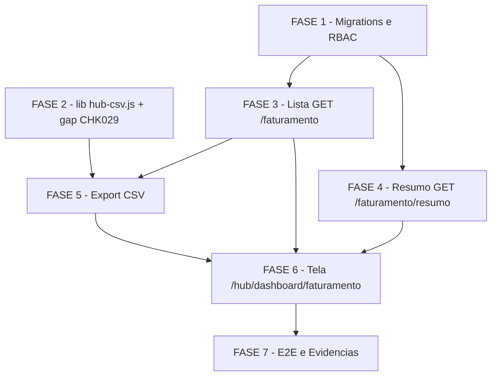

# Tarefas hub-faturamento - Módulo Faturamento (S6 do Hub de Frota)

Escopo: decompor `plan.md` (7 fases) em backlog executável para o módulo de
Faturamento — consulta somente-leitura sobre `FaturamentoLancamento` (lista,
cards de resumo, agregados, export CSV, tela `/hub/dashboard/faturamento`),
100% no ambiente isolado `hub-homolog` (recursos `hub-*`, exceção G1), nunca
em produção/`chatmasterveloz`.

**Legenda de status:**
- `[ ]` Pendente
- `[~]` Em andamento
- `[x]` Concluído
- `[!]` Bloqueado

**Legenda de criticidade:**
- `[C]` Crítico - Impacto financeiro direto ou bloqueante
- `[A]` Alto - Funcionalidade essencial
- `[M]` Médio - Necessário mas sem urgência imediata

---

## FASE 1 - Migrations e RBAC

### 1.1 Migration 0026 — permissão `faturamento.listar` `[C]`

Ref: plan.md "Plano por fases" passo 1; data-model.md "Migrations desta
fase"; research.md Decision 1; contracts/faturamento-api.md (permissão de
rota `GET /faturamento`)

- [x] 1.1.1 Criar `infra/hub/migrations/0026_seed_permissao_faturamento_listar.sql`
- [x] 1.1.2 `INSERT INTO "Permissao"` (`codigo='faturamento.listar'`, `modulo_id` correspondente) idempotente (`ON CONFLICT DO NOTHING`)
- [x] 1.1.3 Conceder a permissão aos papéis `admin_plataforma`/`admin_entidade`/`operador`/`leitura`, idempotente
- [x] 1.1.4 Aplicar via `infra/hub/scripts/migrate.sh` no `hub-homolog`
- [x] 1.1.5 Verificar reload do PostgREST (SIGUSR1) e confirmar a permissão nova refletida em `obterPermissoesEfetivas` (`lib/hub-rbac-cache.js`)
- [x] 1.1.6 Teste: consulta confirmando que o papel `operador` possui `faturamento.listar` após a migration; re-rodar `migrate.sh` e confirmar no-op (idempotência)

### 1.2 Migration 0027 — funções RPC `hub_faturamento_totais`/`hub_faturamento_agrupado` `[C]`

Ref: plan.md "Plano por fases" passo 1; data-model.md "Migrations desta
fase"; research.md Decision 2/3/4/7; plan.md "Gate owasp-security" (A05
Injection PASS — parametrização nativa)

- [x] 1.2.1 Criar `infra/hub/migrations/0027_hub_faturamento_rpc_resumo.sql`
- [x] 1.2.2 Implementar `hub_faturamento_totais(...)` `SECURITY INVOKER`, com `SUM(valor)::text` (`totalGeral`), desempate alfabético embutido para `categoriaMaiorValor` (Decision 3), `COUNT(DISTINCT entregador_id)` para `entregadoresDistintos`, parâmetros tipados (nunca concatenação de SQL)
- [x] 1.2.3 Implementar `hub_faturamento_agrupado(...)` `SECURITY INVOKER`, `group_by` ∈ {`dia`,`categoria`,`entregador`}, bucket `agregados_bonus` embutido para `entregador_id IS NULL` (Decision 4), parâmetros tipados
- [x] 1.2.4 `GRANT EXECUTE` das 2 funções ao role `authenticated`
- [x] 1.2.5 Aplicar via `migrate.sh` no `hub-homolog`; validar idempotência (`CREATE OR REPLACE FUNCTION`, re-rodar = no-op)
- [x] 1.2.6 Teste: chamar as 2 funções via SQL direto no `hub_homolog_db` com filtros básicos e confirmar que `SECURITY INVOKER` respeita a RLS existente de `FaturamentoLancamento` (rodar como usuário de outro `id_empresa` e confirmar zero linhas)

---

## FASE 2 - Extração de `lib/hub-csv.js` e Cobertura do Gap CHK029

### 2.1 Extrair proteção CSV injection para módulo compartilhado `[A]`

Ref: plan.md "Plano por fases" passo 2; research.md Decision 6

- [x] 2.1.1 Criar `app_homologacao/backend/lib/hub-csv.js` com `escaparCelulaCsvInjection`/`quotarCelulaCsv` movidos de `hub-importacoes-dto.js`, sem mudar comportamento
- [x] 2.1.2 Atualizar `hub-importacoes-dto.js` para importar de `hub-csv.js` (sem mudança de contrato externo)
- [x] 2.1.3 Criar `tests/hub-csv.test.js` portando os testes unitários já existentes para `escaparCelulaCsvInjection`/`quotarCelulaCsv`
- [x] 2.1.4 Teste de regressão: rodar `hub-importacoes-dto.test.js` completo e confirmar 100% verde sem alteração de comportamento

### 2.2 Fechar gap CHK029 — célula já neutra por apóstrofo/caractere neutro `[A]`

Ref: checklists/requirements.md CHK029 `[Gap]`; state.json dec-025; spec.md
Edge Cases; quickstart.md Cenário 8 (cobre hoje só `=`/`@`, não o caso de
não-duplo-prefixo)

- [x] 2.2.1 Adicionar caso em `hub-csv.test.js`: célula já iniciada por apóstrofo (`'...`) — confirmar saída com um único apóstrofo prefixado, nunca dois (sem dupla neutralização)
- [x] 2.2.2 Adicionar caso em `hub-csv.test.js`: célula iniciada por outro caractere já neutro/não-perigoso (fora do conjunto `= + - @`) — confirmar que nenhuma neutralização adicional é aplicada, célula preservada tal como veio
- [x] 2.2.3 Estender `quickstart.md` Cenário 8 com o passo de validação manual do caso "célula já começa com apóstrofo/caractere neutro" no `hub-homolog` (abrir em LibreOffice Calc/Excel e confirmar ausência de duplo prefixo)
- [x] 2.2.4 Rodar `hub-csv.test.js` completo (incluindo os casos novos) e confirmar 100% verde

---

## FASE 3 - Lista (leitura) — `GET /faturamento`

### 3.1 DTO/mapper e parsing de filtros/paginação `[A]`

Ref: contracts/faturamento-api.md "GET /faturamento"; data-model.md "Mapa
permissão lógica → código real"; plan.md "Convenções de Borda"

- [x] 3.1.1 Criar `app_homologacao/backend/lib/hub-faturamento-dto.js`: mapper snake_case→camelCase (`id`, `dataReferencia`, `dataLancamento`, `dataRepasse`, `categoria`, `valor` como `text`, `entregadorId`, `entregadorNome`, `subpraca`, `praca`, `periodo`, `comEntregador` derivado)
- [x] 3.1.2 Implementar `parseFiltros` (`de`/`ate` default últimos 30 dias, `categoria`, `entregadorId`, `subpraca`, `comEntregador`) com validação de filtro contraditório (`entregadorId` + `comEntregador=false` → 400)
- [x] 3.1.3 Implementar `parsePaginacao` (`page` default 1, `pageSize` default 20, máx. 100 — mesmas constantes `PAGE_SIZE_DEFAULT`/`PAGE_SIZE_MAX` de `importacoes`/`motoristas`)
- [x] 3.1.4 Teste unit: `tests/hub-faturamento-dto.test.js` cobrindo mapper, `parseFiltros` (válidos/inválidos/contraditório) e `parsePaginacao` (limites, defaults)

### 3.2 Endpoint `GET /faturamento` (JSON) `[A]`

Ref: contracts/faturamento-api.md "GET /faturamento"; middleware/hub-require-permission.js; spec.md FR-001/FR-002/FR-009/FR-011/FR-012

- [x] 3.2.1 Criar `app_homologacao/backend/routes/hub-faturamento.js` com router Express
- [x] 3.2.2 Implementar `GET /` com `requirePermission('faturamento.listar')`, consulta PostgREST em `FaturamentoLancamento` com filtros + join `Entregador` para `entregadorNome` + paginação `Range`
- [x] 3.2.3 Registrar a rota em `server.js` (~linha 2634): `app.use('/api/v1/faturamento', hubFaturamentoRoutes.router);` (mesmo padrão de `hubMotoristasRoutes`/`hubImportacoesRoutes`)
- [x] 3.2.4 Tratar período/filtro vazio como `200` com `{ items: [], total: 0, ... }` (FR-012), nunca erro
- [x] 3.2.5 Teste integração: `tests/hub-faturamento.test.js` cenários lista básica, filtros combinados (categoria+data), paginação, período vazio, `401`/`403` sem permissão

---

## FASE 4 - Resumo (agregados) — `GET /faturamento/resumo`

### 4.1 Endpoint `GET /faturamento/resumo` `[C]`

Ref: contracts/faturamento-api.md "GET /faturamento/resumo"; research.md
Decision 2/3/4; spec.md FR-003/FR-004/FR-012

- [x] 4.1.1 Implementar handler `GET /resumo` com `requirePermission('faturamento.consultar')`
- [x] 4.1.2 Sem `groupBy`: chamar `hub_faturamento_totais` via RPC do PostgREST, mapear `totalGeral`/`categoriaMaiorValor`/`entregadoresDistintos`
- [x] 4.1.3 Com `groupBy` (enum `dia`\|`categoria`\|`entregador`, `400` se fora do enum): chamar `hub_faturamento_agrupado`, resolver `rotulo` (join `Entregador.nome` quando `chave` é id; literal `"Agregados/bônus"` quando `chave === 'agregados_bonus'`; a própria categoria/data para `groupBy=categoria`/`dia`)
- [x] 4.1.4 Tratar período vazio (FR-012): `{ totalGeral: "0.00", categoriaMaiorValor: null, entregadoresDistintos: 0 }` — nunca erro, nunca corpo vazio
- [x] 4.1.5 Teste integração: cards sem `groupBy`, agrupado por `dia`/`categoria`/`entregador`, empate alfabético (Cenário 3), período vazio (Cenário 6), `400` `groupBy` inválido

---

## FASE 5 - Export CSV

### 5.1 Export streaming com checagem de permissão dedicada `[C]`

Ref: contracts/faturamento-api.md "Resposta 200 (`?format=csv`)";
research.md Decision 5/6/9; spec.md FR-006/FR-007/FR-008; plan.md "Gate
owasp-security" (finding informativo API4, risco aceito)

- [x] 5.1.1 Implementar branch `format=csv` em `GET /faturamento`: checagem inline de `faturamento.exportar` ANTES de qualquer query (Decision 9)
- [x] 5.1.2 Implementar laço de paginação `Range` em lotes de 1.000 + `res.write()` incremental (sem carregar o período inteiro em memória)
- [x] 5.1.3 Setar headers `Content-Type: text/csv; charset=utf-8` + `Content-Disposition: attachment; filename="faturamento-<de>_<ate>.csv"`, cabeçalho `dataReferencia,categoria,valor,entregadorNome,subpraca,praca,periodo`
- [x] 5.1.4 Neutralizar células (`categoria`, `entregadorNome`) via `lib/hub-csv.js` (`escaparCelulaCsvInjection`/`quotarCelulaCsv`)
- [x] 5.1.5 Registrar auditoria `faturamento.csv_exportado` só no sucesso, via `hub-auditoria.js` (mesmo padrão de `importacao.original_baixado`)
- [x] 5.1.6 Tratar filtro vazio: gerar arquivo só com linha de cabeçalho (`200`, não erro)
- [x] 5.1.7 Teste integração: export completo bate contagem+soma com a tela (Cenário 7), CSV injection neutralizada com `=`/`@` (Cenário 8), export vazio só cabeçalho (Cenário 9), `403` sem `faturamento.exportar` mesmo com `faturamento.listar` (Cenário 10 passos 3-4)

---

## FASE 6 - Tela `/hub/dashboard/faturamento`

### 6.1 DTO/API client frontend `[A]`

Ref: plan.md "Project Structure" (frontend_v2); contracts/faturamento-api.md; research.md Decision 7 (valor como string)

- [ ] 6.1.1 Criar `app_homologacao/frontend_v2/lib/hub/faturamento-dto.ts`: tipos + parse defensivo (padrão de `motoristas-dto.ts`), `valor`/`total`/`totalGeral` tipados como `string`
- [ ] 6.1.2 Criar `app_homologacao/frontend_v2/lib/hub/faturamento-api.ts`: chamadas a `GET /faturamento`, `GET /faturamento/resumo` (com/sem `groupBy`) e export CSV
- [ ] 6.1.3 Teste: roundtrip real contra o backend vivo do `hub-homolog` (Cenário 13) usando `faturamento-dto.ts` — nenhum mock no meio, evita drift snake_case↔camelCase

### 6.2 Página `/hub/dashboard/faturamento` `[A]`

Ref: plan.md "Plano por fases" passo 6; research.md Decision 10/11;
`/ui-ux-pro-max`; padrão de `.../importacoes/page.tsx`; spec.md FR-010/FR-013

- [ ] 6.2.1 Criar `app_homologacao/frontend_v2/app/hub/dashboard/faturamento/page.tsx` com cards de totais (total geral, categoria de maior valor, entregadores distintos)
- [ ] 6.2.2 Implementar filtros server-side (`de`/`ate`/`categoria`/`entregadorId`/`subpraca`/`comEntregador`), rotulando explicitamente o filtro de data como "data de competência" (Cenário 5)
- [ ] 6.2.3 Implementar tabela paginada de lançamentos
- [ ] 6.2.4 Implementar botão de export condicionado à permissão `faturamento.exportar` (via `GET /me`) — não aparece quando ausente (Cenário 10)
- [ ] 6.2.5 Implementar link condicional para `/hub/dashboard/motoristas/{entregadorId}` quando `entregadorId != null` E `motoristas.consultar` presente (Cenário 12)
- [ ] 6.2.6 Implementar estados "período sem dados" / loading / erro (Cenário 6)
- [ ] 6.2.7 Validar identidade visual EntreGô 2.0 (tokens de cor/tipografia) em tema claro/escuro (Cenário 14)
- [ ] 6.2.8 Teste: smoke/E2E de UI cobrindo filtros, paginação, export condicionado, navegação condicional, estados vazio/loading/erro

---

## FASE 7 - E2E e Evidências

### 7.1 Quickstart completo no `hub-homolog` — Cenários 1 a 14 `[A]`

Ref: quickstart.md Cenários 1-14; plan.md "Plano por fases" passo 7

- [ ] 7.1.1 Rodar Cenário 1 (totais e filtros combinados batem com o banco) e registrar a query SQL de referência como evidência
- [ ] 7.1.2 Rodar Cenário 2 (agregados/bônus nunca somem dos totais)
- [ ] 7.1.3 Rodar Cenário 3 (empate no card de categoria — dec-014)
- [ ] 7.1.4 Rodar Cenário 4 (agrupamentos por dia/categoria/entregador, soma bate com `totalGeral`)
- [ ] 7.1.5 Rodar Cenário 5 (data de competência é a única usada no filtro)
- [ ] 7.1.6 Rodar Cenário 6 (período sem dados — `200` com zeros/lista vazia)
- [ ] 7.1.7 Rodar Cenário 7 (export CSV: conteúdo e contagem batem com a tela)
- [ ] 7.1.8 Rodar Cenário 8 (CSV injection neutralizada — `=`/`@` E o caso apóstrofo-inicial estendido na tarefa 2.2)
- [ ] 7.1.9 Rodar Cenário 9 (export vazio gera só cabeçalho)
- [ ] 7.1.10 Rodar Cenário 10 (permissões independentes listar/consultar/exportar, incluindo bypass de UI via `curl`)
- [ ] 7.1.11 Rodar Cenário 11 (isolamento multi-tenant em lista, resumo e export)
- [ ] 7.1.12 Rodar Cenário 12 (navegação para detalhe do entregador, com e sem `motoristas.consultar`)
- [ ] 7.1.13 Rodar Cenário 13 (roundtrip End-to-End real, contrato exato, sem mock)
- [ ] 7.1.14 Rodar Cenário 14 (identidade visual preservada claro/escuro)

### 7.2 Performance sob volume ampliado — Cenário 15 `[M]`

Ref: quickstart.md Cenário 15; research.md Decision 8; spec.md SC-004

- [ ] 7.2.1 Gerar seed de volume ampliado (~900 mil linhas, ~1 ano) dedicado para `id_empresa=9001` (`docs/plans/hub-frota/01-plano-tecnico.md §7.7`)
- [ ] 7.2.2 Medir tempo de resposta de `GET /faturamento/resumo` sem `groupBy` sobre o intervalo do ano populado
- [ ] 7.2.3 Medir tempo de resposta de `GET /faturamento/resumo?groupBy=categoria` sobre o mesmo intervalo
- [ ] 7.2.4 Registrar evidência (tempo medido + `EXPLAIN ANALYZE`) como Decisão auditável; se exceder 1s, avaliar `mv_faturamento_dia` SÓ com essa evidência — nunca implementar preventivamente

### 7.3 DIÁRIO e evidências finais `[M]`

Ref: docs/plans/hub-frota/DIARIO.md; review-task (relatório final)

- [ ] 7.3.1 Registrar no DIÁRIO do hub-frota a conclusão da S6 com evidências (link `tasks.md`, resultados do quickstart, PR)
- [ ] 7.3.2 Coletar prints/logs de smoke test como evidência anexada ao relatório de `review-task`
- [ ] 7.3.3 Conferir gate `validate-docs-rendered` sobre `tasks.md`/`quickstart.md` atualizados (Mermaid, links, frontmatter)

---

## Matriz de Dependências

## Resumo Quantitativo

| Fase | Tarefas | Subtarefas | Criticidade |
|------|---------|------------|-------------|
| 1 - Migrations e RBAC | 2 | 12 | C |
| 2 - lib hub-csv.js + gap CHK029 | 2 | 8 | A |
| 3 - Lista GET /faturamento | 2 | 9 | A |
| 4 - Resumo GET /faturamento/resumo | 1 | 5 | C |
| 5 - Export CSV | 1 | 7 | C |
| 6 - Tela /hub/dashboard/faturamento | 2 | 11 | A |
| 7 - E2E e Evidências | 3 | 21 | A/M |
| **Total** | **13** | **73** | - |

## Escopo Coberto

| Item | Descrição | Fase |
|------|-----------|------|
| FR-001 | Lista paginada de lançamentos | 3 |
| FR-002 | Filtros por período (data de competência), categoria, entregador, subpraça, `comEntregador` | 3 |
| FR-003 | Cards de resumo (total geral, categoria de maior valor com desempate, entregadores distintos) | 1, 4 |
| FR-004 | Agregados por dia/categoria/entregador (bucket agregados/bônus) | 1, 4 |
| FR-005 | Lançamentos sem entregador tratados como agregados/bônus | 1, 3, 4 |
| FR-006 | Export CSV streaming, sem buffer total em memória | 5 |
| FR-007 | Neutralização de CSV injection (`= + - @` e gap CHK029: célula já-neutra) | 2, 5 |
| FR-008 | Permissões independentes listar/consultar/exportar, `403` explícito | 1, 3, 4, 5, 7 |
| FR-009 | Isolamento multi-tenant (RLS + `id_empresa` do token) | 1, 3, 4, 5, 7 |
| FR-010 | Navegação condicional para detalhe do entregador (módulo Motoristas) | 6, 7 |
| FR-011 | Nenhuma escrita em `FaturamentoLancamento` (somente leitura) | 1, 3, 4, 5 |
| FR-012 | Período sem dados tratado como `200`/zeros, nunca erro | 3, 4, 7 |
| FR-013 | Identidade visual EntreGô 2.0 preservada | 6, 7 |
| CHK029 [Gap] | Célula CSV já iniciada por apóstrofo/caractere neutro — sem dupla neutralização | 2 |
| SC-004 | Performance de agregados sob volume ampliado (~1 ano) | 7 |

## Escopo Excluído

| Item | Descrição | Motivo |
|------|-----------|--------|
| Edição/estorno manual de lançamento | Nenhum `INSERT`/`UPDATE`/`DELETE` em `FaturamentoLancamento` nesta fase | spec.md "Não inclui" — correção só entra via nova importação (pipeline S4), fora do escopo de FR-011 |
| Dashboards executivos além dos cards | Nenhuma visão consolidada multi-período/multi-módulo | spec.md "Não inclui" — fora do MVP desta fase |
| View materializada / estrutura de pré-cálculo (`mv_faturamento_dia`) | Nenhuma tabela/índice novo além da permissão RBAC | spec.md FR-002 + "Não inclui"; research.md Decision 8 — só entra em consideração se SC-004 medir lentidão real (tarefa 7.2), nunca implementada preventivamente |
| Rate-limiting dedicado do endpoint de export | Nenhum limiter novo introduzido | plan.md "Gate owasp-security" finding informativo API4 — risco aceito com justificativa; candidato a feature transversal própria, não desta fase |
| Mascaramento adicional de `entregadorNome` | Reaproveita o mesmo dado (sem máscara) já retornado por `GET /motoristas` (S5) | contracts/faturamento-api.md "Mascaramento de dado pessoal" — S5 já define o padrão, nada novo a fazer aqui |
