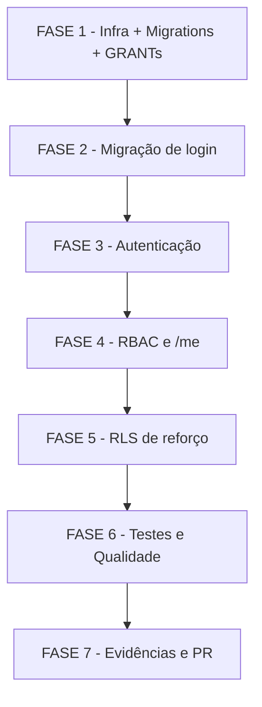

# Tarefas Hub de Frota — Fundações: Contas, Papéis e Trilha de Auditoria

Escopo: Backlog executável da feature `hub-fundacoes` (S2 do hub-frota). Decompõe [plan.md](plan.md) respeitando a ordem exigida **migrations+GRANTs → migração de login → auth → RBAC/`/me` → RLS → testes → evidências → PR**. Trabalho 100% no ambiente isolado `hub-*` (exceção G1); o ambiente vivo do cliente é PRODUÇÃO e intocável. Branch: `feat/hub-fundacoes`.

**Legenda de status:**
- `[ ]` Pendente
- `[~]` Em andamento
- `[x]` Concluido
- `[!]` Bloqueado

**Legenda de criticidade:**
- `[C]` Critico - Impacto financeiro direto, regulatorio ou de seguranca
- `[A]` Alto - Funcionalidade essencial sem a qual o sistema nao opera
- `[M]` Medio - Necessario mas sem urgencia imediata

---

## FASE 1 - Fundação: infra isolada, migrations estruturais e GRANTs

### 1.1 Ambiente de build isolado do backend hub `[A]`

Ref: plan.md §Source Code (`Dockerfile.hub`, `compose.hub.*`), briefing §S1 ambiente isolado, memória exceção-standing-hub-recursos.

- [x] 1.1.1 Criar `app_homologacao/backend/Dockerfile.hub` (Node 20 LTS, mesma árvore de código; ZERO alteração no Dockerfile de produção Node 14)
- [x] 1.1.2 Editar `infra/hub/compose.hub.dev.yml`, `compose.hub.test.yml`, `compose.hub.homolog.yml` adicionando serviço `backend` apontando via env para o banco isolado do hub (recursos `hub-*` apenas)
- [x] 1.1.3 Adicionar/reutilizar `infra/hub/mocks/mailpit-like/` como mock de envio de e-mail para recuperação de senha (Research Decision 11)
- [x] 1.1.4 Prever cap de memória no build (`DOCKER_BUILDKIT=0 --memory=2g` + swap temporário) — lição starvation; documentar no runbook da task
- [x] 1.1.5 Smoke: subir `compose.hub.test` e confirmar backend hub respondendo isolado (sem tocar stacks de produção)

### 1.2 Migration de contas e sessão `[C]`

Ref: data-model.md §Usuario/§SessaoRefresh, plan.md §migrations, briefing §DDL, FR-014/FR-018.

- [x] 1.2.1 `infra/hub/migrations/0002_usuario.sql` — tabela `Usuario` (email citext UNIQUE, senha_hash, nome, ativo, tentativas_login, bloqueado_ate, token_recuperacao_hash, token_recuperacao_expira, criado_em) idempotente (`IF NOT EXISTS`)
- [x] 1.2.2 `infra/hub/migrations/0005_sessao_refresh.sql` — tabela `SessaoRefresh` (token_hash UNIQUE, usuario_id FK, expira_em) hash-only (Decision 9), idempotente
- [x] 1.2.3 GRANTs explícitos ao role do PostgREST (`authenticated`) para as tabelas novas (lição do 42501; precedente `docs/sql/003-...-grants.sql`)
- [x] 1.2.4 Registrar cada migration em `SchemaMigration` (idempotência: 2ª execução = no-op)
- [x] 1.2.5 Teste de integração: rodar `0002`/`0005` em banco vazio e verificar tabelas + GRANTs via PostgREST (role authenticated)

### 1.3 Migration de RBAC (papéis, permissões, módulos) `[C]`

Ref: data-model.md §Papel/§Permissao/§PapelPermissao/§Modulo/§ModuloEntidade, FR-006/FR-007/FR-008.

- [x] 1.3.1 `infra/hub/migrations/0003_papel_permissao_modulo.sql` — tabelas `Papel` (escopo CHECK global|entidade, is_sistema), `Permissao`, `PapelPermissao` (N:M), `Modulo`, `ModuloEntidade`; `UsuarioEntidade` (UNIQUE(usuario_id, empresa_id)) idempotente
- [x] 1.3.2 GRANTs explícitos ao role do PostgREST para as tabelas de RBAC
- [x] 1.3.3 `SIGUSR1`/`NOTIFY pgrst` para recarregar o schema cache do PostgREST após criar tabelas (gotcha herdado)
- [x] 1.3.4 Teste de integração: migration idempotente (2×=no-op) e tabelas consultáveis via PostgREST

### 1.4 Migration de auditoria imutável `[C]`

Ref: data-model.md §Auditoria, FR-023/FR-024/FR-025, block-001.

- [x] 1.4.1 `infra/hub/migrations/0004_auditoria.sql` — tabela `Auditoria` (acao, resultado, usuario_id nullable, criado_em, metadados sem dados sensíveis) idempotente
- [x] 1.4.2 `REVOKE UPDATE, DELETE ON "Auditoria"` do role do PostgREST + trigger bloqueador de UPDATE/DELETE (defesa em profundidade, FR-024)
- [x] 1.4.3 GRANT de INSERT/SELECT ao role apropriado; nenhum endpoint expõe edição/remoção
- [x] 1.4.4 Teste de integração: INSERT permitido, UPDATE/DELETE rejeitados na camada de dados (imutabilidade reforçada)

### 1.5 Seed dos papéis, permissões e módulos `[C]`

Ref: data-model.md §Papel is_sistema, FR-008, checklists/security.md CHK006/CHK027.

- [x] 1.5.1 `infra/hub/migrations/0007_seed_papeis_permissoes_modulos.sql` — ≥4 papéis-seed (`admin_plataforma` + demais) `is_sistema=true`; módulos (`atendimento, performance, importacoes, envio_massa, usuarios, auditoria, admin`); PapelPermissao default
- [x] 1.5.2 Seed idempotente (`ON CONFLICT DO NOTHING` / `WHERE NOT EXISTS`), 2ª execução = no-op
- [x] 1.5.3 Validar com o dono do produto que os 4 papéis-seed e suas permissões default refletem o modelo de acesso pretendido — Ref: checklists/security.md CHK027 (`{humano}`, resolver antes de execute-task da FASE 4) — **APROVADO SEM AJUSTES** (block-002/dec-033, operador Paulo, 2026-07-06T03:18:25Z)
- [x] 1.5.4 Teste de integração: seed aplicado, união de grants por papel consultável via PostgREST

---

## FASE 2 - Migração do login legado (expand-only)

### 2.1 Migração de dados `Empresa.pass → Usuario` `[C]`

Ref: plan.md §Migração de dados, data-model.md, FR-001–FR-005, SC-001/SC-002, Edge Cases.

- [x] 2.1.1 `infra/hub/migrations/0008_migracao_empresa_para_usuario.sql` — 1 `Usuario` por `Empresa` com login ativo, **mesmo hash bcrypt copiado** (ninguém redefine senha), `UsuarioEntidade` vinculando à empresa de origem
- [x] 2.1.2 Excluir da migração contas de origem sem meio de autenticar (sem senha definida) — não criar conta "quebrada" (FR-005, Edge Case)
- [x] 2.1.3 Idempotência expand-only: cada conta de origem gera no máximo um `Usuario` (`WHERE NOT EXISTS`); 2ª execução = no-op (FR-004, SC-002)
- [x] 2.1.4 Registrar em `SchemaMigration`; garantir que o fluxo de login legado (tabela `Empresa`) continua intocado (FR-003) — registro automático via `migrate.sh` (mesmo mecanismo de 0002-0007); migration só LÊ `Empresa`, nunca escreve
- [x] 2.1.5 Teste de integração: hash preservado (login com hash original funciona), re-execução não duplica, conta sem senha não migra — `infra/hub/testes/migracao-login-integration.sh`, 6/6 asserts OK (dec-036/dec-037)

---

## FASE 3 - Autenticação (`/api/v1/auth/*`)

### 3.1 Login com anti-enumeração, rate-limit e bloqueio `[C]`

Ref: contracts/auth.md §login, FR-014–FR-017, SC-006, research Decision 14, `server.js:79/83` (reuso).

- [x] 3.1.1 `routes/hub-auth.js` — `POST /api/v1/auth/login` (e-mail+senha, cookies httpOnly `accessToken` 15min / `refreshToken` 7dias, sameSite=Strict)
- [x] 3.1.2 Dummy-hash anti-enumeração: resposta indistinguível para e-mail inexistente vs senha incorreta (FR-015, mesmo padrão de `server.js:79`)
- [x] 3.1.3 Rate-limit por IP+conta reusando `express-rate-limit` (`server.js:83`); 429 RATE_LIMIT (FR-016)
- [x] 3.1.4 Bloqueio temporário: 5 falhas consecutivas / 15 min → 423 CONTA_BLOQUEADA; reset de `tentativas_login` após login correto pós-expiração (FR-017, data-model bloqueado_ate)
- [x] 3.1.5 Registrar `app.use()` do router em `server.js` de forma **estritamente aditiva** (ZERO diff em rotas legadas)
- [x] 3.1.6 Teste unit: dummy-hash timing, contagem de falhas/bloqueio; teste de integração do fluxo de bloqueio

### 3.2 Sessão: refresh e logout `[C]`

Ref: contracts/auth.md §refresh/§logout, FR-018, research Decision 9.

- [x] 3.2.1 `POST /api/v1/auth/refresh` — rotação de refresh token hash-only; detectar replay de token rotacionado → 401 SESSAO_INVALIDA
- [x] 3.2.2 `POST /api/v1/auth/logout` — revoga a sessão atual (refresh deixa de renovar) (FR-018)
- [x] 3.2.3 Teste unit + integração: logout revoga de verdade (refresh revogado não renova)

### 3.3 Recuperação e redefinição de senha `[C]`

Ref: contracts/auth.md §recuperar-senha/§redefinir-senha, FR-019–FR-022, SC-005/SC-007, **checklists/security.md CHK010**.

- [x] 3.3.1 `POST /api/v1/auth/recuperar-senha` — resposta idêntica para e-mail existente/inexistente (FR-020, SC-005); grava `token_recuperacao_hash`+`token_recuperacao_expira` sobrescrevendo pedido anterior (Edge Case "apenas o mais recente")
- [x] 3.3.2 **Definir o TTL concreto de `token_recuperacao_expira`** (FR-021 diz apenas "tempo limitado") — resolver CHK010 e documentar o valor na migration/rota; token single-use (invalidado NULL no primeiro uso)
- [x] 3.3.3 `POST /api/v1/auth/redefinir-senha` — valida token vs hash (400 TOKEN_INVALIDO), expiração/uso (410 TOKEN_EXPIRADO); atualiza `senha_hash`; invalida token
- [x] 3.3.4 Ao concluir redefinição, **invalidar TODAS as sessões** anteriores (FR-022, SC-007)
- [x] 3.3.5 Rate-limit também em `recuperar-senha` (research Decision 14); usar mock de e-mail; falha do e-mail não vaza existência de conta (Edge Case)
- [x] 3.3.6 Teste unit: geração/validação de token, expiração, single-use; teste de integração: revogação de sessões pós-reset

---

## FASE 4 - RBAC e perfil (`/api/v1/me*`)

### 4.1 Middleware de permissão fail-closed `[C]`

Ref: contracts/rbac-me.md §requirePermission, FR-007/FR-009/FR-012, research owasp (fail-closed explícito).

- [x] 4.1.1 `middleware/hub-require-permission.js` — `requirePermission('modulo.acao')`; 401 NAO_AUTENTICADO sem token, 403 PERMISSAO_NEGADA sem grant
- [x] 4.1.2 Precedência RBAC = **união de grants** (sem herança, sem negação); papel global vs papel de entidade (FR-009)
- [x] 4.1.3 Fail-closed explícito: qualquer erro/indefinição na avaliação de permissão → nega (remediação owasp-security)
- [x] 4.1.4 Auditar toda ação de capacidade nova via helper (FR-012) — ver 4.3
- [x] 4.1.5 Teste unit: com/sem grant, papel global vs entidade, caminho de erro nega (fail-closed)

### 4.2 Cache de permissões e /me `[A]`

Ref: contracts/rbac-me.md §GET /me §POST /me/entidade, FR-010/FR-011/FR-013, SC-004.

- [x] 4.2.1 `lib/hub-rbac-cache.js` — cache in-memory de permissões efetivas com TTL 60s + invalidação em mudança de papel/vínculo (SC-004: reflete em ≤60s sem logout)
- [x] 4.2.2 `routes/hub-me.js` — `GET /api/v1/me` (perfil + entidade ativa + permissões efetivas)
- [x] 4.2.3 `POST /api/v1/me/entidade` — troca de entidade ativa; 403 SEM_VINCULO se sem `UsuarioEntidade` ativo para o `empresa_id` (FR-010/FR-011)
- [x] 4.2.4 Perda de vínculo com sessão aberta reflete na próxima ação sensível (Edge Case, FR-013 via invalidação de cache)
- [x] 4.2.5 Teste unit: cache + invalidação; teste de integração: troca de entidade e recusa sem vínculo

### 4.3 Helper de auditoria com scrub `[A]`

Ref: plan.md §hub-auditoria.js, FR-023/FR-025, contracts/auditoria.md.

- [x] 4.3.1 `lib/hub-auditoria.js` — escrita em `Auditoria` (login_sucesso/login_falha/logout/troca_papel/troca_entidade_ativa) com scrub (nunca senha/dados sensíveis, FR-025)
- [x] 4.3.2 `GET /api/v1/auditoria` protegido por `requirePermission('auditoria.consultar')` (filtros desde/ate/limit)
- [x] 4.3.3 Integrar chamadas de auditoria nos eventos de login/logout/troca (FR-023)
- [x] 4.3.4 Teste unit: scrub não vaza senha; teste de integração: eventos de sucesso e falha aparecem na trilha

---

## FASE 5 - RLS de reforço (isolamento multi-tenant, nega-por-padrão)

### 5.1 JWT do PostgREST por request com claims de escopo `[C]`

Ref: plan.md §hub-postgrest-jwt.js, briefing §evolução técnica, FR-026/FR-027/FR-028.

- [x] 5.1.1 `lib/hub-postgrest-jwt.js` — emitir JWT do PostgREST **por request** com claims de escopo (`empresa_ativa` + lista do grupo), mesmo `PGRST_JWT_SECRET`; NÃO editar `generatePostgrestJWT` legada (server.js:99-106)
- [x] 5.1.2 Alg-pinning JWT HS256 explícito na verificação (remediação owasp-security)
- [x] 5.1.3 Teste unit: claims corretos por request; rejeição de alg diferente de HS256

### 5.2 Policies RLS nega-por-padrão `[C]`

Ref: `infra/hub/migrations/0006_rls_policies.sql`, FR-026/FR-027/FR-028, SC-008, quickstart Scenario 9.

- [x] 5.2.1 `0006_rls_policies.sql` — role `authenticated`, `ENABLE ROW LEVEL SECURITY` + policies lendo o claim de entidade nos dados NOVOS da fundação (FR-027)
- [x] 5.2.2 Postura **nega por padrão**: sem claim de entidade presente/verificável → zero linhas (FR-028); RLS é reforço, não substitui `requirePermission` (FR-026)
- [x] 5.2.3 GRANTs coerentes com RLS; idempotente; registrada em `SchemaMigration`
- [x] 5.2.4 Teste de integração (real, sem mock — quickstart Scenario 9): token com claim da entidade A lendo dados da B → 0 linhas; lendo os da própria A → retorna (SC-008)

---

## FASE 6 - Testes e Qualidade

### 6.1 Suíte unit completa `[A]`

Ref: briefing §Testes exigidos (Unit), plan.md §tests.

- [x] 6.1.1 `tests/hub-auth-unit.test.js` — hash/verificação, geração/validação de tokens, dummy-hash timing
- [x] 6.1.2 `tests/hub-rbac-unit.test.js` — requirePermission (com/sem grant, global vs entidade), cache e invalidação
- [x] 6.1.3 Cobrir caminhos de fail-closed e união de grants (hub-auditoria-unit.test.js + hub-postgrest-jwt-unit.test.js também verdes)
- [x] 6.1.4 Rodar e capturar saída verde — 48/48 (15 auth + 19 rbac + 6 auditoria + 8 postgrest-jwt), reexecutado onda-010

### 6.2 Integração de banco (compose test) `[A]`

Ref: briefing §Integração, FR-004, SC-002, critério de aceite #1.

- [x] 6.2.1 `tests/hub-rls-integration.test.js` + `tests/hub-auditoria-integration.test.js` contra `hub-test` — wrappers node:test finos sobre `infra/hub/testes/hub-{rls,auditoria}-integration.sh` (decisão dec-054: evita duplicar ~200 linhas de orquestração Docker já provada; hub-auditoria-integration.sh é NOVO, fecha gap de 1.4.4 sem teste correspondente)
- [x] 6.2.2 Migrations em banco **vazio** E **com seeds**, rodadas **2×** (idempotência = no-op) — confirmado onda-009 (0006) e reconfirmado nesta onda via migrate.sh na série completa até 0008
- [x] 6.2.3 GRANTs validados via query PostgREST com role `authenticated`; migração de login com hash preservado — pg_catalog.has_table_privilege confirma SELECT/INSERT=true, UPDATE/DELETE=false para Auditoria
- [x] 6.2.4 Rodar e capturar saída verde — hub-rls-integration.test.js 1/1 (invoca .sh 18/18), hub-auditoria-integration.test.js 1/1 (invoca .sh NOVO 16/16) = 34/34 asserts totais

### 6.3 E2E na homolog isolada `[A]`

Ref: briefing §E2E, quickstart.md Scenarios 1/3/4/5/6/7/8/9, critérios de aceite #4/#5.

- [x] 6.3.1 login→me→troca de entidade (US1/US2) — `infra/hub/testes/hub-e2e-homolog.sh`, 8/8 asserts contra hub-homolog real (backend/mailpit-mock subidos, migrate até 0008)
- [x] 6.3.2 troca de senha revoga todas as sessões (US3, refresh revogado não renova) — 13/13 asserts, 2 sessões simultâneas, ambas revogadas após redefinir-senha; achado: reuso do token → 400 (não 410 como o texto do quickstart.md sugere), paridade confirmada com hub-auth-integration.sh:268 (decisão já auditada na FASE 3, dec-060)
- [x] 6.3.3 5 falhas consecutivas bloqueiam 15 min (US4) — 3/3 asserts; bloqueio comprimido via `UPDATE "Usuario" SET bloqueado_ate = now() - interval '1 minute'` (SQL direto no banco do hub, dec-060) em vez de aguardar 15 min reais
- [x] 6.3.4 RLS: token com claim da entidade A lendo dados da B → 0 linhas (US5, real) — 7/7 asserts via PostgREST direto (bypass do Express), mesmo padrão de hub-rls-integration.sh
- [x] 6.3.5 Capturar saída/log de cada cenário como evidência — 32/32 asserts verdes, `docs/plans/hub-frota/evidencias/S2/01-e2e-homolog.txt`; cleanup 100% (0 linhas residuais `e2e-teste-*`) via `SET session_replication_role = replica` (superuser, sessão-escopado, contorna o trigger incondicional de imutabilidade da Auditoria só para o DELETE de teste — dec-060)

### 6.4 Corrigir cobertura do `npm test` e diff limpo `[C]`

Ref: briefing "hoje só 2 de 8 rodam — corrigir", critério de aceite #6 (diff limpo legados).

- [x] 6.4.1 Ajustar o script `npm test` para incluir **todos** os arquivos de teste (2→6 unit rápidos numa única invocação `node --test`, não chain `&&` — chain faria short-circuit e nunca chegar aos hub-*-unit; `test:hub:integration` cobre os 2 restantes até 8)
- [x] 6.4.2 Confirmar suíte completa verde — 98/106 pass; 8 falhas são bug PRÉ-EXISTENTE em motorista-integration.test.js (gorjeta), CONFIRMADO idêntico no baseline pré-hub-fundacoes (commit 05ef220, worktree isolado), NÃO é regressão desta feature (dec-055). Os 4 arquivos hub unit: 48/48 verdes
- [x] 6.4.3 Verificar `git diff` — ZERO alteração em endpoints/handlers legados — `git diff main...feat/hub-fundacoes --stat`: 42 arquivos, 5384 insertions(+), 0 deletions; server.js só com blocos `require()`+`app.use()` aditivos (dec-056)
- [x] 6.4.4 Rodar gate de segurança sobre o diff — owasp-security aplicado: 0 findings critical/high novos; alg-pinning HS256, fail-closed em requirePermission, rate-limit+dummy-hash anti-enumeração, RLS nega-por-padrão, sem segredos hardcoded (dec-057)

---

## FASE 7 - Evidências e Fechamento

### 7.1 Coletar evidências para o PR `[A]`

Ref: briefing §Evidências para o PR + Critérios de Aceite.

- [ ] 7.1.1 Saída da suíte completa verde
- [ ] 7.1.2 `SELECT * FROM "SchemaMigration"` demonstrando migrations registradas
- [ ] 7.1.3 Demonstração RLS negando acesso cruzado (0 linhas cross-entidade)
- [ ] 7.1.4 Auditoria de login demonstrada (evento sucesso e falha na trilha)
- [ ] 7.1.5 Login legado com o MESMO hash funcionando; migrations rodadas 2× sem efeito

### 7.2 DIARIO e PR draft `[A]`

Ref: briefing §7 (PR + DIARIO.md), governança CLAUDE.md, memória plano-hub-frota.

- [ ] 7.2.1 Atualizar `docs/plans/hub-frota/DIARIO.md` com o registro da S2 (evidências + decisões-chave)
- [ ] 7.2.2 Abrir PR **draft** na branch `feat/hub-fundacoes` com corpo referenciando os 7 critérios de aceite e as evidências
- [ ] 7.2.3 Confirmar que NENHUMA escrita no ambiente vivo de produção ocorreu (apenas recursos `hub-*`)
- [ ] 7.2.4 Listar pendências para o operador (deploy/gate G3) — o agente entrega artefatos, não aplica em produção

---

## Matriz de Dependencias

Ordem canônica exigida pelo briefing: **migrations+GRANTs (F1) → migração de login (F2) → auth (F3) → RBAC/`/me` (F4) → RLS (F5) → testes (F6) → evidências/PR (F7)**.

## Resumo Quantitativo

| Fase | Tarefas | Subtarefas | Criticidade predominante |
|------|---------|------------|--------------------------|
| FASE 1 - Infra + Migrations + GRANTs | 5 | 22 | [C] |
| FASE 2 - Migração de login | 1 | 5 | [C] |
| FASE 3 - Autenticação | 3 | 15 | [C] |
| FASE 4 - RBAC e /me | 3 | 14 | [C]/[A] |
| FASE 5 - RLS de reforço | 2 | 7 | [C] |
| FASE 6 - Testes e Qualidade | 4 | 15 | [A]/[C] |
| FASE 7 - Evidências e PR | 2 | 9 | [A] |
| **Total** | **20** | **87** | — |

## Escopo Coberto

- Migrations idempotentes (tabelas `Usuario`, `UsuarioEntidade`, `Papel`, `Permissao`, `PapelPermissao`, `Modulo`, `ModuloEntidade`, `Auditoria`, `SessaoRefresh`) + GRANTs explícitos + registro em `SchemaMigration`.
- Migração expand-only do login legado (`Empresa.pass → Usuario`), hash bcrypt preservado.
- Autenticação `/api/v1/auth/*` (login, refresh, logout, recuperar-senha, redefinir-senha) com anti-enumeração, rate-limit, bloqueio 5/15min, revogação de sessões.
- RBAC (`requirePermission` fail-closed, união de grants, cache TTL 60s) e `/api/v1/me*` (perfil + troca de entidade).
- RLS de reforço nega-por-padrão (JWT PostgREST por request + policies 0006) sobre os dados NOVOS da fundação.
- Auditoria imutável (REVOKE + trigger) com scrub.
- Suíte de testes unit + integração + E2E; correção do `npm test` (2→8 arquivos).
- Evidências para o PR + DIARIO + PR draft.

## Escopo Excluido

- **Ambiente vivo de produção** (`chatmasterveloz`, `*.moveelog.com.br`, stacks `envio-massa-*`/`fastapi*`/`pgadmin`, `.env`, Traefik): intocável — todo trabalho em recursos `hub-*` isolados.
- **`docs/sql/`** (série congelada) e endpoints legados (ZERO diff).
- Base de login do app de entregadores (fora da migração desta fundação).
- Criação/convite de novos usuários (S3+).
- MFA/SSO, rotação de chaves, agendamento periódico, trava multi-instância (N/A explícito).
- Telas/frontend do hub (S3+).
- Deploy/cutover em produção (entrega de artefatos ao operador; escrita no ambiente vivo depende dos 5 gates + gate G3).
