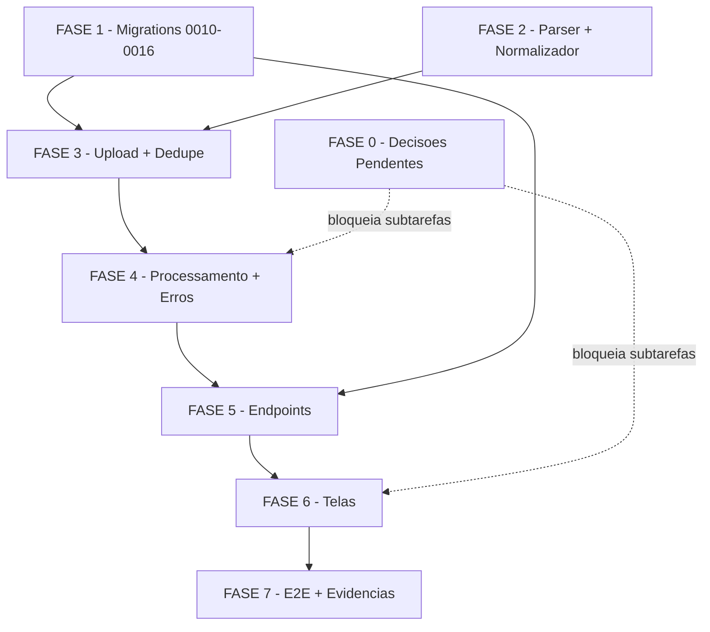

# Tarefas hub-importacoes — Pipeline de Importações (S4 do Hub de Frota)

Escopo: implementação completa do pipeline de importação idempotente (upload →
validação → persistência → erros → histórico → telas) para os tipos
`faturamento` e `performance`, no ambiente **hub-homolog ISOLADO** (VPSTodo,
recursos `hub-*`) — nunca produção/`chatmasterveloz`. Backlog decomposto de
`plan.md` §Plano por fases (7 fases do briefing) + gaps do checklist de
qualidade (`checklists/requirements.md`).

**Legenda de status:**
- `[ ]` Pendente
- `[~]` Em andamento
- `[x]` Concluído
- `[!]` Bloqueado

**Legenda de criticidade:**
- `[C]` Crítico - Impacto financeiro, regulatório ou de segurança direto
  (LGPD, RLS multi-tenant, idempotência/dedupe, rollback, gate de export)
- `[A]` Alto - Funcionalidade core sem a qual o pipeline não opera
- `[M]` Médio - Necessário mas pode ser adiado sem impacto imediato

---

## FASE 0 - Pré-requisitos: Decisões Pendentes do Checklist

### 0.1 Resolver ambiguidades `{humano}` antes de iniciar as fases afetadas `[A]`

Ref: `checklists/requirements.md` CHK004, CHK007, CHK013, CHK036 (Notes:
"Ambiguidades que ficam para decisão humana antes de `/execute-task`").
Nenhuma destas bloqueia FASE 1/2/3 — bloqueiam subtarefas específicas
indicadas abaixo.

- [x] 0.1.1 CHK004 — decidir se `hub-import-processor.js` exige teste
      unitário dedicado (máquina de estados/lock/rollback), além do teste de
      integração `hub-importacoes.test.js`. Decisão alimenta a tarefa 4.7.
      **RESOLVIDO (dec-030, score 2)**: sim, criar
      `hub-import-processor.test.js` dedicado (mesmo padrão de parser/normalizer).
- [x] 0.1.2 CHK007 — quantificar o SLA de "cancelamento surte efeito em
      intervalo curto" (FR-018): lote de 500 já é latência aceitável ou é
      preciso sub-lote menor? Decisão bloqueia a tarefa 4.6.
      **RESOLVIDO (dec-031, score 2)**: lote de 500 é o teto aceitável
      (checagem de `status=cancelled` entre lotes); sem sub-lote adicional.
- [x] 0.1.3 CHK013 — decidir se a UI precisa de um sinal adicional
      (mensagem/tooltip) para diferenciar, no histórico, "pending recém-criado"
      de "pending aguardando lock de outra importação". Decisão bloqueia a
      tarefa 6.5.
      **RESOLVIDO (dec-032, score 2)**: campo derivado `aguardandoLock:boolean`
      no GET /importacoes (sem coluna nova no banco).
- [x] 0.1.4 CHK036 — validar que o pool de conexões do backend/PostgREST
      sustenta uma sessão dedicada durante o processamento síncrono (o
      `pg_try_advisory_lock` libera ao fim da SESSÃO Postgres, não da
      transação). Decisão bloqueia a tarefa 4.2.
      **RESOLVIDO (dec-033, score 2) — NÃO sustenta** (`hub-postgrest.js` é
      HTTP stateless, sem `pg` driver/pool direto no backend). Mecanismo
      substituto: mutex via índice único parcial em `ImportacaoArquivo`
      `(id_empresa,tipo) WHERE status IN ('validating','processing')`
      (ver research.md Decision 5 ADENDO + data-model.md). Mesmo contrato
      funcional (1 ativa por tipo/entidade, demais `pending`, sem 409).

---

## FASE 1 - Migrations (0010–0016)

### 1.1 Migration 0010 — tabela `Entregador` `[A]`

Ref: `data-model.md` Entity Entregador; `research.md` Decision 1/9.

- [x] 1.1.1 Criar `infra/hub/migrations/0010_entregador.sql`: colunas
      conforme data-model.md, `UNIQUE(id_empresa, id_externo)`, índice
      `(id_empresa, nome)`, colunas de auditoria (`criado_em`/`atualizado_em`)
- [x] 1.1.2 `GRANT` explícito ao role `authenticated` (padrão S2)
- [x] 1.1.3 Aplicar via `infra/hub/scripts/migrate.sh` no hub-homolog
      (registra `SchemaMigration` + `SIGUSR1`)
- [x] 1.1.4 Teste: reaplicar `migrate.sh` é idempotente (no-op, sem erro) —
      evidência `docs/plans/hub-frota/evidencias/S4/02-migrate-fase1-run2-idempotencia.txt`

### 1.2 Migrations 0011–0012 — `ImportacaoArquivo` + `ImportacaoLinhaErro` `[A]`

Ref: `data-model.md` Entity ImportacaoArquivo/ImportacaoLinhaErro;
`research.md` Decision 4.

- [x] 1.2.1 Criar `0011_importacao_arquivo.sql`: `CHECK tipo IN
      ('faturamento','performance','envio_massa')` (envio_massa reservado p/
      S8, FR-026), `CHECK status IN (...)`, `UNIQUE(id_empresa, tipo,
      hash_sha256)`, índice `(id_empresa, tipo, data_referencia DESC)`,
      **índice único parcial `(id_empresa,tipo) WHERE status IN
      ('validating','processing')`** (mutex de concorrência, dec-033/CHK036 —
      substitui advisory lock, ver research.md Decision 5 ADENDO)
- [x] 1.2.2 Criar `0012_importacao_linha_erro.sql`: `id_empresa` FK
      **denormalizado** (Decision 4, reforça RLS uniforme), FK
      `importacao_id`, índice `(importacao_id)`
- [x] 1.2.3 `GRANT authenticated` nas duas tabelas
- [x] 1.2.4 Aplicar via `migrate.sh` + teste de idempotência (re-run = no-op) —
      evidência `docs/plans/hub-frota/evidencias/S4/02-migrate-fase1-run2-idempotencia.txt`

### 1.3 Migrations 0013–0014 — `FaturamentoLancamento` + `PerformanceTurno` `[A]`

Ref: `data-model.md` Entity FaturamentoLancamento/PerformanceTurno.

- [x] 1.3.1 Criar `0013_faturamento_lancamento.sql`: colunas §data-model
      (incl. `margem_fee_raw`/`min`/`inter`, `atingido`, `pct_*`,
      `criterio_*`), `UNIQUE(id_empresa, hash_linha)`, índices
      `(id_empresa,data_referencia)` / `(id_empresa,entregador_id,
      data_referencia)` / `(id_empresa,descricao)`
- [x] 1.3.2 Criar `0014_performance_turno.sql`: colunas §data-model
      (`duracao`/`tempo_disponivel` interval, `taxas_centavos` int),
      `UNIQUE(id_empresa, hash_linha)`, índices `(id_empresa,data_periodo)` /
      `(id_empresa,entregador_id,data_periodo)`
- [x] 1.3.3 `GRANT authenticated` nas duas tabelas
- [x] 1.3.4 Aplicar via `migrate.sh` + teste de idempotência —
      evidência `docs/plans/hub-frota/evidencias/S4/02-migrate-fase1-run2-idempotencia.txt`

### 1.4 Migration 0015 — RLS das 5 tabelas novas `[C]`

Ref: `data-model.md` Migration 0015; Constitution Princípio II
(NON-NEGOTIABLE); mesmo padrão de `0006_rls_policies.sql`.

- [x] 1.4.1 `ENABLE ROW LEVEL SECURITY` + `CREATE POLICY` (SELECT +
      `WITH CHECK` para INSERT/UPDATE) por `id_empresa =
      ANY(hub_jwt_escopo_ids())` nas 5 tabelas
- [x] 1.4.2 `DROP POLICY IF EXISTS` antes de cada `CREATE POLICY`
      (idempotência)
- [x] 1.4.3 Teste: token sem claim `escopo` (⇒ `hub_jwt_escopo_ids()=[]`) não
      enxerga nenhuma linha nas 5 tabelas (nega-por-padrão) — suite nova
      `infra/hub/testes/hub-rls-importacoes-integration.sh` (ambiente efêmero
      hub-test), 15/15 PASS: evidência
      `docs/plans/hub-frota/evidencias/S4/03-rls-importacoes-integration.txt`

### 1.5 Migration 0016 — Seed corretivo `importacoes.exportar` `[C]`

Ref: `data-model.md` Migration 0016; `research.md` Decision 2 (gap de
permissão real vs plano lógico).

- [x] 1.5.1 `INSERT` em `Permissao` (`importacoes.exportar`) com
      `ON CONFLICT DO NOTHING`
- [x] 1.5.2 `INSERT` em `PapelPermissao` concedendo a `admin_plataforma` e
      `admin_entidade` (explicitamente **NÃO** `operador`/`leitura` — export
      de original é ação sensível/LGPD)
- [x] 1.5.3 Teste: papel `leitura` permanece sem `importacoes.exportar`;
      `admin_entidade` passa a ter (quickstart Cenário 7) — evidência
      `docs/plans/hub-frota/evidencias/S4/04-seed-importacoes-exportar.txt`
      (leitura=f, operador=f, admin_entidade=t, admin_plataforma=t)

### 1.6 Verificação de reload PostgREST `[A]`

Ref: `plan.md` Technical Context "Migrations" (gotcha conhecido do hub).

- [ ] 1.6.1 Confirmar `SIGUSR1` enviado pelo `migrate.sh` após cada migration
      aplicada
- [ ] 1.6.2 Smoke: PostgREST reconhece as 5 tabelas novas via schema cache
      (requisição direta não retorna `PGRST` de tabela desconhecida)

---

## FASE 2 - Parser + Normalizador (unit-first)

### 2.1 `hub-import-parser.js` — leitura/streaming/seleção por tipo `[A]`

Ref: `research.md` Decision 3; `plan.md` §Plano por fases item 2.

- [x] 2.1.1 Strip BOM UTF-8 inicial, split por `;`
- [x] 2.1.2 Parse por streaming linha-a-linha (sem carregar arquivo inteiro
      em memória)
- [x] 2.1.3 Seleção de normalizador conforme campo `tipo` do multipart
      (`faturamento`|`performance`) — sem heurística de sniffing
- [x] 2.1.4 Extração segura de ZIP: exatamente 1 entrada, sem path
      traversal (`../`), descomprimido ≤ 100 MB
- [x] 2.1.5 Teste unit (`hub-import-parser.test.js`): BOM removido, ZIP com
      path traversal rejeitado, ZIP > 100 MB rejeitado, streaming não
      materializa arquivo inteiro

### 2.2 `hub-import-normalizer.js` — dialeto faturamento `[A]`

Ref: `research.md` Decision 3.

- [x] 2.2.1 Decimal vírgula→ponto (remover separador de milhar `.` ANTES de
      trocar `,`→`.`)
- [x] 2.2.2 Header `subpraca` (sem `_`); extrair zona quando sufixo "(ZONA)"
- [x] 2.2.3 `margem_fee_raw` sempre gravado (cru, trim); regex
      `MIN:\s*([\d.,]+).*INTER:\s*([\d.,]+)` → `margem_fee_min`/`inter`;
      regex não casa = só `raw`, **sem erro de linha**
- [x] 2.2.4 `atingido`/`pct_*`/`criterio_*` — `numeric(8,2)`, vírgula→ponto,
      faixa 0–1000, sem interpretar negócio (D4 ratificado)
- [x] 2.2.5 Teste unit (`hub-import-normalizer.test.js`): `"1.234,56"` →
      `1234.56`; `margem_fee` com e sem match de regex; `atingido` fora de
      faixa gera erro de linha

### 2.3 `hub-import-normalizer.js` — dialeto performance `[A]`

Ref: `research.md` Decision 3; Decision 9.

- [x] 2.3.1 Decimal ponto direto (sem transformação)
- [x] 2.3.2 Header `sub_praca` (com `_`)
- [x] 2.3.3 `HH:MM:SS` → `interval` (`duracao`, `tempo_disponivel`)
- [x] 2.3.4 `soma_das_taxas_das_corridas_aceitas` em **centavos** (int
      direto, sem divisão)
- [x] 2.3.5 `tempo_disponivel_escalado` — `numeric(6,2)`, faixa 0–150
- [x] 2.3.6 UUID de `id_da_pessoa_entregadora` **obrigatório** — ausência
      gera erro de linha (diferente de faturamento)
- [x] 2.3.7 Teste unit: `HH:MM:SS` parseado corretamente, taxas em centavos
      sem divisão, linha sem UUID rejeitada com motivo claro

### 2.4 `hash_linha` determinístico `[C]`

Ref: `research.md` Decision 6 — idempotência é o requisito central (US2).

- [x] 2.4.1 sha256 da linha normalizada (trim, uppercase em campos de
      domínio, decimal canônico)
- [x] 2.4.2 Teste unit: mesma linha normalizada 2× produz hash idêntico
      (determinismo)
- [x] 2.4.3 Teste unit: linhas com whitespace/case de origem diferentes mas
      semanticamente iguais produzem o MESMO hash (normalização robusta —
      base da idempotência de reimportação)

---

## FASE 3 - POST upload + dedupe

### 3.1 Validações imediatas `[C]`

Ref: `contracts/importacoes-api.md` POST /importacoes.

- [x] 3.1.1 Extensão (`.csv`/`.zip`)
- [x] 3.1.2 MIME type
- [x] 3.1.3 Tamanho ≤ 20 MB
- [x] 3.1.4 Conteúdo (é CSV válido? ZIP com exatamente 1 entrada — reusa
      2.1.4)
- [x] 3.1.5 Teste integração (`hub-importacoes-integration.sh` +
      `tests/hub-importacoes-integration.test.js`): cada validação falha
      com `422 INVALIDO` + `motivo` legível (extensao_invalida,
      tipo_invalido, arquivo_vazio, zip_multiplas_entradas — 4 cenários
      cobertos, todos verdes)

### 3.2 sha256 + dedupe de arquivo `[C]`

Ref: `research.md` Decision 6.

- [x] 3.2.1 Calcular sha256 do arquivo recebido
- [x] 3.2.2 Consultar `UNIQUE(id_empresa,tipo,hash_sha256)` existente →
      `409 CONFLITO { importacaoOriginalId }`
- [x] 3.2.3 Teste integração: reenvio do mesmo arquivo (Cenário 2 do
      quickstart) retorna 409 com id correto; zero linhas novas (+
      cenários adicionais: mesmo hash com tipo/entidade diferente -> 201,
      dedupe é por id_empresa+tipo+hash, não só hash)

### 3.3 Armazenamento do original + criação de `ImportacaoArquivo` `[A]`

Ref: `research.md` Decision 8 (LGPD).

- [x] 3.3.1 Salvar original em `uploads/importacoes/<id>` (fora de
      git/log, volume privado — `.gitignore` + volume Docker nomeado
      `hub_homolog_uploads`/`hub_dev_uploads` montado em
      `compose.hub.homolog.yml`/`compose.hub.dev.yml`)
- [x] 3.3.2 Criar `ImportacaoArquivo(status=pending, nome_arquivo
      sanitizado, tamanho_bytes, hash_sha256)`
- [x] 3.3.3 `requirePermission('importacoes.criar')` no route (+ checagem
      por-entidade via `obterPermissoesEfetivasPorEntidade`, mesmo padrão
      de correção pós-review PR #55 achado #1)
- [x] 3.3.4 Teste integração: `201 { id, status: "pending" }`

### 3.4 Auditoria de criação `[A]`

Ref: `contracts/importacoes-api.md` POST /importacoes "Efeito".

- [x] 3.4.1 `Auditoria(acao='importacao.criada')` via `hub-auditoria.js`
      (reusar, sem modificação)
- [x] 3.4.2 Teste integração: registro de Auditoria presente após upload
      bem-sucedido

---

## FASE 4 - Processamento em lote + erros

### 4.1 `hub-import-processor.js` — máquina de estados + interface `ImportJob` `[A]`

Ref: `research.md` Decision 10; `contracts/importacoes-api.md` §Convenção
de máquina de estados.

- [x] 4.1.1 Definir interface `ImportJob` (contrato de função isolado, para
      plugar fila depois sem refazer o pipeline) — `lib/hub-import-processor.js`
      (`ImportJob` typedef + `processarImportacao(job)` como único ponto de
      entrada)
- [x] 4.1.2 Implementar transições `pending→validating→processing→
      completed|completed_with_errors|failed` — `TRANSICOES_VALIDAS` +
      `transicaoValida()`
- [x] 4.1.3 Teste unit: transições válidas e inválidas da máquina de
      estados são rejeitadas/aceitas corretamente — `tests/hub-import-
      processor.test.js` describe `transicaoValida`

### 4.2 Lock via índice único parcial `(id_empresa, tipo)` `[C]`

Ref: `research.md` Decision 5 **ADENDO (dec-033/CHK036)**. **NÃO
`pg_try_advisory_lock`** — descartado durante 0.1.4 (ver ADENDO):
`lib/hub-postgrest.js` é HTTP stateless, sem sessão Postgres dedicada
persistente. Mecanismo implementado: UPDATE atômico
`status='pending'→'validating'` sobre o índice único parcial da migration
0011 (`WHERE status IN ('validating','processing')`); colisão vira 409 do
PostgREST (unique_violation), tratada como "não adquiriu" (sem 409 ao
cliente).

- [x] 4.2.1 ~~`pg_try_advisory_lock(...)`~~ — `tentarAdquirirLock()`: UPDATE
      atômico `pending→validating` (índice único parcial, migration 0011)
- [x] 4.2.2 Se ocupado (409 do índice único), importação permanece
      `pending`; `tentarIniciarProximaPendente()` busca e dispara a próxima
      `pending` do mesmo `(id_empresa,tipo)` ao final de QUALQUER
      processamento (sucesso/falha/cancelado) — sem `409` por concorrência
- [x] 4.2.3 Teste integração: duas importações quase simultâneas do mesmo
      `(id_empresa,tipo)` — validado indiretamente em
      `infra/hub/testes/hub-import-processor-integration.sh` (upload
      `faturamento` + `faturamento-a-renomeado` da mesma empresa são
      serializados pelo mutex; ambos completam corretamente em sequência,
      confirmado via evidência real hub-test-*)

### 4.3 Processamento em lotes de 500 `[A]`

Ref: `research.md` Decision 6/9.

- [x] 4.3.1 Insert em lotes de 500, `ON CONFLICT (id_empresa, hash_linha)
      DO NOTHING` — `inserirLoteFatos()` (`Prefer: resolution=ignore-
      duplicates` + `on_conflict=id_empresa,hash_linha`)
- [x] 4.3.2 Upsert `Entregador` por `(id_empresa, id_externo)` —
      `upsertEntregadoresDoLote()` (`Prefer: resolution=merge-duplicates`);
      `nome` sempre presente em linha válida (recebedor/pessoa_entregadora
      são campos obrigatórios do normalizador), logo "quando há nome novo"
      é satisfeito por construção
- [x] 4.3.3 Retentativa 1× por lote em erro transiente (`executarComRetry`,
      `errorTransiente` — sem status HTTP ou >=500); timeout total de
      importação documentado em `TIMEOUT_IMPORTACAO_MS` (120s, plano
      técnico §12.6)
- [x] 4.3.4 Teste integração: reimportação da MESMA linha (arquivo com
      bytes diferentes, conteúdo lógico idêntico) produz **zero** linhas
      novas — `hub-import-processor-integration.sh` cenário (b), evidência
      real: `PASS: (b) ZERO fatos novos p/ hash_linha idêntico`

### 4.4 Regra >50% inválidas → `failed` (rollback "por construção") `[C]`

Ref: `research.md` Decision 7. **Decisão de implementação**: `Fatura
mentoLancamento`/`PerformanceTurno` (migrations 0013/0014) NÃO concedem
`DELETE` a `authenticated` (fato append-only por desenho). Em vez de
inserir-depois-apagar, o processor faz o parse COMPLETO em memória e só
decide `failed` (sem NUNCA ter inserido nada) ou segue para o INSERT —
mesmo efeito observável do "rollback total" (zero linhas persistidas),
sem exigir uma migration nova só para o DELETE. Ver comentário de topo de
`lib/hub-import-processor.js`.

- [x] 4.4.1 Contagem inválidas/total ao fim do parse — `computarStatusLimiar()`
- [x] 4.4.2 ~~Rollback total (remove os fatos já inseridos)~~ — rollback
      "por construção": decisão de limiar ocorre ANTES de qualquer INSERT
      (nenhuma linha desta importação é gravada se >50% inválidas)
- [x] 4.4.3 `erro_resumo` explicativo + `status=failed` — `marcarFailed()`
- [x] 4.4.4 Teste integração: cabeçalho errado → zero linhas persistidas —
      `hub-import-processor-integration.sh` cenário (c), evidência real:
      `PASS: (c) ZERO linhas persistidas com cabeçalho errado`. (>50%
      inválidas coberto por unit test dedicado — 4.7.3 — dado que o
      mecanismo é 100% determinístico/testável sem DB real.)

### 4.5 Erros por linha (LGPD) `[C]`

Ref: `research.md` Decision 8; Spec FR-015/FR-023.

- [x] 4.5.1 `ImportacaoLinhaErro(numero_linha, motivo, campo,
      valor_mascarado)` por linha inválida pontual — 1 registro por ERRO
      (não por linha; uma linha com N campos inválidos gera N registros)
- [x] 4.5.2 Função de mascaramento — `mascararValor()`: universal (aplica a
      QUALQUER campo, não só UUID/nome — mais conservador, satisfaz "nunca
      grava a linha bruta" sem depender de uma allowlist de campos
      pessoais)
- [x] 4.5.3 Status final `completed_with_errors` quando há erros pontuais
      mas ≤ 50%
- [x] 4.5.4 Teste unit: função de mascaramento nunca retorna o valor
      original em nenhum branch — `tests/hub-import-processor.test.js`
      describe `mascararValor`

### 4.6 Cancelamento entre lotes `[A]`

Ref: `contracts/importacoes-api.md` POST .../cancelar. SLA de 0.1.2
aplicado: lote de 500 é o teto (checagem entre lotes, sem sub-lote menor).

- [x] 4.6.1 Checar flag de cancelamento entre lotes (ponto seguro de
      interrupção) — `foiCancelado()` chamado antes de cada lote em
      `processarLotesValidas()`
- [x] 4.6.2 `status=cancelled` ao interromper — `marcarCancelled()`
- [x] 4.6.3 Teste integração: cancelar durante `processing` interrompe
      entre lotes — `hub-import-processor-integration.sh` cenário (d),
      evidência real contra hub-test-* (arquivo de 550 linhas, `UPDATE
      status='cancelled'` emitido via SQL direto entre o 1º e o 2º lote):
      `PASS: (d) exatamente 1 lote (500 linhas) persistido antes da
      interrupção`. Janela de teste OPCIONAL `HUB_IMPORT_TEST_LOTE_DELAY_MS`
      (compose.hub.test.yml, ausente em dev/homolog/produção) torna a
      corrida determinística.

### 4.7 `hub-import-processor.test.js` — cobertura unitária dedicada `[A]`

Ref: `checklists/requirements.md` CHK004 (dec-030: sim, teste unit dedicado
além do teste de integração).

- [x] 4.7.1 Teste unit isolado (mock de PostgREST) da máquina de estados
      (4.1) — describe `transicaoValida`
- [x] 4.7.2 Teste unit do comportamento de lock (mock do UPDATE atômico no
      índice único parcial — NÃO `pg_try_advisory_lock`, ver 4.2) sem
      depender de banco real — describe `tentarAdquirirLock`/
      `tentarIniciarProximaPendente`
- [x] 4.7.3 Teste unit do rollback >50% (4.4) isolado do teste de
      integração — resolve o gap CHK004 — describe `computarStatusLimiar` +
      `executarPipeline — failed (>50% inválidas, rollback por construção)`
      (35 testes no total no arquivo, incluindo happy path/completed_with_
      errors/cabeçalho inválido/cancelamento/arquivo inacessível)

---

## FASE 5 - Endpoints de consulta/ação

### 5.1 `GET /importacoes` — histórico paginado `[A]`

Ref: `contracts/importacoes-api.md`.

- [ ] 5.1.1 Query `tipo`/`status`/`de`/`ate`/`responsavel` +
      `page`/`pageSize` via Range PostgREST
- [ ] 5.1.2 Default últimos 30 dias
- [ ] 5.1.3 Mapper snake_case (PostgREST) → camelCase (API) — mesmo padrão
      de `hub-me.js`/`lib/hub/me-dto.ts`
- [ ] 5.1.4 `requirePermission('importacoes.consultar')`
- [ ] 5.1.5 Teste integração: shape do response bate exatamente o contrato
      (camelCase: `linhasValidas`, `dataReferencia`, etc.)

### 5.2 `GET /importacoes/:id` — detalhe + progresso (polling) `[A]`

- [ ] 5.2.1 Response com `contadores: { total, validas, invalidas }`
- [ ] 5.2.2 `404` se fora do escopo do token (RLS + filtro do backend)
- [ ] 5.2.3 Teste integração: `404` cross-tenant (quickstart Cenário 8)

### 5.3 `GET /importacoes/:id/erros` (+ `?format=csv`) `[C]`

Ref: Spec FR-016 (CSV injection); FR-015/FR-023 (LGPD).

- [ ] 5.3.1 Paginação de `ImportacaoLinhaErro`
- [ ] 5.3.2 `format=csv`: `text/csv` com proteção CSV injection (prefixar
      `'` em células iniciadas por `= + - @`)
- [ ] 5.3.3 `valorMascarado` nunca expõe dado bruto (JSON e CSV)
- [ ] 5.3.4 Teste integração: célula maliciosa (`=1+1`) recebe prefixo `'`
      no CSV; JSON nunca contém UUID/nome bruto

### 5.4 `GET /importacoes/:id/original` — download + erro explícito p/ ausência `[C]`

Ref: `checklists/requirements.md` CHK021 (gap — contrato só definia
`200`/`403`, sem código para arquivo ausente).

- [ ] 5.4.1 Stream do arquivo original com `Content-Disposition: attachment`
- [ ] 5.4.2 `requirePermission('importacoes.exportar')` — distinta de
      `consultar`; `403 PERMISSAO_NEGADA` se ausente
- [ ] 5.4.3 Definir e implementar código de erro explícito quando o
      arquivo físico originalmente retido não está mais disponível (ex.:
      `410 GONE` com `motivo` claro em vez de `500` genérico) — **resolve
      CHK021**; atualizar `contracts/importacoes-api.md` com o novo código
- [ ] 5.4.4 Teste integração: papel `leitura` (só `consultar`) → `403`;
      arquivo removido do disco (simular) → código de erro explícito com
      mensagem clara (edge case da spec)

### 5.5 `POST /importacoes/:id/reprocessar` `[A]`

Ref: `research.md` Decision 6 (dec-010).

- [ ] 5.5.1 Pré-condição `status ∈ {failed, cancelled}`; `409` se terminal
      completo
- [ ] 5.5.2 Reusa arquivo armazenado; limpa `ImportacaoLinhaErro`; zera
      contadores; volta a `pending` (NÃO cria novo `ImportacaoArquivo`)
- [ ] 5.5.3 Teste integração: reprocessar `failed` → `202 pending`;
      reprocessar `completed` → `409` (quickstart Cenário 6.1/6.2)

### 5.6 `POST /importacoes/:id/cancelar` `[A]`

- [ ] 5.6.1 Pré-condição `status ∈ {pending, validating, processing}`;
      `409` se já terminal
- [ ] 5.6.2 `202 { id, status: "cancelled" }`
- [ ] 5.6.3 Teste integração: cancelar importação `completed` → `409`
      (edge case CHK023)

### 5.7 Auditoria de reprocessar/cancelar/download-original `[A]`

Ref: `checklists/requirements.md` CHK005 (gap — contrato só mencionava
`Auditoria(acao='importacao.criada')`).

- [ ] 5.7.1 `Auditoria(acao='importacao.reprocessada')` em POST reprocessar
- [ ] 5.7.2 `Auditoria(acao='importacao.cancelada')` em POST cancelar
- [ ] 5.7.3 `Auditoria(acao='importacao.original_baixado')` em GET original
      bem-sucedido (200)
- [ ] 5.7.4 Teste integração: cada uma das 3 ações gera o registro de
      Auditoria correspondente — **resolve CHK005**

### 5.8 `requirePermission` consolidado (mapa `data-model.md`) `[C]`

Ref: `data-model.md` §Mapa permissão lógica → código real.

- [ ] 5.8.1 Confirmar cada endpoint usa o código real correto
      (`consultar`/`criar`/`exportar`; `importar` reservado, não é gate de
      endpoint público nesta fase)
- [ ] 5.8.2 Teste integração: matriz completa permissão × endpoint
      (fail-closed — ausência de permissão nunca abre acesso)

---

## FASE 6 - Telas (via `/ui-ux-pro-max`)

**Nota de correção de rota**: `plan.md` §Project Structure lista
`app/hub/importacoes/page.tsx`, mas a convenção real do shell (S3,
`lib/hub/module-nav.ts` `moduloParaRota`, dec-039/dec-041) é
`/hub/dashboard/<codigo>` — o prefixo `/hub/dashboard/` isola a árvore do
hub da árvore legada do envio-massa. As tarefas abaixo usam o caminho real
`app/hub/dashboard/importacoes/`. O módulo `importacoes` já está semeado
(0007) e o ícone `Upload` já mapeado em `ICON_MAP` — nenhuma mudança em
`module-nav.ts` é necessária.

### 6.1 Rota `/hub/dashboard/importacoes` — histórico + upload `[A]`

Ref: `plan.md` §Plano por fases item 6 (corrigido, ver nota acima).

- [ ] 6.1.1 Invocar `/ui-ux-pro-max` para layout de histórico (tabela +
      filtros), dentro de `app/hub/dashboard/importacoes/page.tsx`
- [ ] 6.1.2 Reusar `components/data-table.tsx` e `components/filters.tsx`
      existentes
- [ ] 6.1.3 Botão/entrada para o wizard de upload (tipo + arquivo)
- [ ] 6.1.4 Teste: renderização + smoke de navegação via `ModuleNav`
      (módulo `importacoes` já mapeado, ícone `Upload`)

### 6.2 Rota `/hub/dashboard/importacoes/[id]` — detalhe/progresso/erros `[A]`

- [ ] 6.2.1 Polling via `hooks/use-process-status.ts` enquanto
      `status ∈ {pending, validating, processing}`
- [ ] 6.2.2 Tabela de erros paginada + botão de download do relatório CSV
- [ ] 6.2.3 Botões reprocessar/cancelar condicionados ao `status` atual
- [ ] 6.2.4 Teste: transição de estado reflete na UI (mock de polling)

### 6.3 `components/hub/import-wizard.tsx` `[A]`

- [ ] 6.3.1 Seleção de tipo (`faturamento`|`performance`)
- [ ] 6.3.2 Upload de arquivo com validação client-side (extensão/tamanho
      antes do POST, espelhando 3.1)
- [ ] 6.3.3 Feedback legível para `409` (duplicado, com link para a
      importação original) e `422` (inválido, com `motivo`)
- [ ] 6.3.4 Teste: fluxo completo de upload mockado (happy path + 409 +
      422)

### 6.4 `lib/hub/importacoes-dto.ts` — mapper camelCase `[A]`

Ref: `plan.md` §Convenções de Borda.

- [ ] 6.4.1 Tipos TS espelhando `contracts/importacoes-api.md`
- [ ] 6.4.2 Parse/validação de shape no fetch
- [ ] 6.4.3 Teste: paridade entre DTO e contrato (mesmo padrão de
      `lib/hub/me-dto.ts`) — evita drift snake_case↔camelCase

### 6.5 Aplicar decisão de sinalização de "pending aguardando lock" `[M]`

Ref: `checklists/requirements.md` CHK013. **Bloqueada por 0.1.3.**

- [ ] 6.5.1 Se 0.1.3 decidir por sinal adicional, adicionar
      tooltip/mensagem distinguindo os dois casos de `pending` no histórico
- [ ] 6.5.2 Teste: renderização condicional conforme a decisão registrada
      em 0.1.3

---

## FASE 7 - E2E + evidências

### 7.1 Executar Cenários 1–9 do `quickstart.md` no hub-homolog `[A]`

Ref: `quickstart.md`. Seeds anonimizados da S1; CSV real só em sandbox
context-mode.

- [ ] 7.1.1 Cenário 1 — happy path faturamento (US1)
- [ ] 7.1.2 Cenário 2 — idempotência de arquivo + linha (US2)
- [ ] 7.1.3 Cenário 3 — performance dialeto ponto + HH:MM:SS (US1)
- [ ] 7.1.4 Cenário 4 — erros por linha + LGPD (US3)
- [ ] 7.1.5 Cenário 5 — falha estrutural >50% (US3-4)
- [ ] 7.1.6 Cenário 6 — reprocessar/cancelar (US4)
- [ ] 7.1.7 Cenário 7 — gate de export (US4-5)
- [ ] 7.1.8 Cenário 8 — isolamento multi-tenant (Constitution II)
- [ ] 7.1.9 Cenário 9 — concorrência com lock advisório (Decision 5)

### 7.2 Cenário 11 — evidência de branding/dark-light (SC-007) `[A]`

Ref: `checklists/requirements.md` CHK006 (gap — nenhum dos 10 cenários
originais testava isso explicitamente).

- [ ] 7.2.1 Adicionar "Cenário 11" ao `quickstart.md`: capturar
      `/hub/dashboard/importacoes` (+ `/[id]`) em tema light e dark
- [ ] 7.2.2 Confirmar paleta/tema EntreGô 2.0 preservados (sem cor
      hardcoded fora do design system nas novas telas)
- [ ] 7.2.3 Executar e capturar evidência (screenshot dark + light) —
      **resolve CHK006**

### 7.3 Cenário 10 — roundtrip real (contrato) `[C]`

Ref: `quickstart.md` Cenário 10; Constitution Princípio III.

- [ ] 7.3.1 Chamada REAL `POST /importacoes` + `GET /importacoes/:id`
      contra o backend hub (não mock)
- [ ] 7.3.2 Confirmar shape do JSON exatamente igual ao contrato
      (camelCase: `linhasValidas`, `dataReferencia`,
      `importacaoOriginalId`), sem drift snake_case↔camelCase
- [ ] 7.3.3 Capturar evidência do payload real (sandbox context-mode; sem
      CSV bruto/PII em log/git/contexto)

### 7.4 Coletar evidências consolidadas `[A]`

- [ ] 7.4.1 Contadores (total/válidas/inválidas) por cenário executado
- [ ] 7.4.2 Confirmação de idempotência (0 duplicatas em reimportação do
      mesmo arquivo)
- [ ] 7.4.3 Confirmação do gate de export (`403` sem `importacoes.exportar`)
- [ ] 7.4.4 Confirmação de isolamento RLS (`404` cross-tenant)

### 7.5 Fechamento `[C]`

Ref: Regras invioláveis do prompt C — fechamento só em `review-task`.

- [ ] 7.5.1 Atualizar `docs/plans/hub-frota/DIARIO.md` com o registro da S4
- [ ] 7.5.2 Abrir PR draft `feat/hub-importacoes`
- [ ] 7.5.3 SEM merge/deploy/cutover sem autorização explícita do operador
      (rito de produção — ambiente hub-homolog isolado, mas cutover final
      é decisão do operador)

---

## Matriz de Dependencias

## Resumo Quantitativo

| Fase | Tarefas | Subtarefas | Criticidade predominante |
|------|---------|------------|---------------------------|
| 0 - Decisões Pendentes | 1 | 4 | A |
| 1 - Migrations | 6 | 20 | A/C |
| 2 - Parser + Normalizador | 4 | 20 | A/C |
| 3 - Upload + Dedupe | 4 | 14 | C/A |
| 4 - Processamento + Erros | 7 | 24 | C/A |
| 5 - Endpoints | 8 | 28 | A/C |
| 6 - Telas | 5 | 17 | A/M |
| 7 - E2E + Evidências | 5 | 22 | A/C |
| **Total** | **40** | **149** | - |

## Escopo Coberto

| Item | Descrição | Fase |
|------|-----------|------|
| FR-001–FR-028 | Cobertura completa dos requisitos funcionais da spec | 1–7 |
| US1 | Upload e processamento (faturamento + performance) | 2–4 |
| US2 | Idempotência (dedupe duplo arquivo+linha) | 2, 3.2, 4.3 |
| US3 | Erros por linha + LGPD (valor mascarado) | 4.5, 5.3 |
| US4 | Consulta/ação (histórico, reprocessar, cancelar, export) | 5 |
| SC-007 | Preservação de branding/dark-light | 7.2 |
| CHK005 (gap) | Auditoria de reprocessar/cancelar/download-original | 5.7 |
| CHK006 (gap) | Cenário de verificação dedicado p/ branding/dark-light | 7.2 |
| CHK021 (gap) | Código de erro explícito p/ arquivo original ausente | 5.4.3 |
| CHK004/007/013/036 (ambiguidades) | Decisões humanas pré-execução | 0.1 |

## Escopo Excluido

| Item | Descrição | Motivo |
|------|-----------|--------|
| Fila assíncrona | Processamento permanece síncrono em chunks | `research.md` Decision 10 — gatilho objetivo (>50k linhas ou timeout de request) não atingido nesta escala |
| Particionamento de tabelas | Sem partição por data nas 2 tabelas de fato | `plan.md` §Complexity Tracking — gatilho >10M linhas |
| View materializada | Sem view agregada para dashboard | `plan.md` §Complexity Tracking — gatilho dashboard >1s |
| Política de expurgo do original | Retenção fica indefinida nesta fase | `research.md` Decision 8 (D5 aberto p/ fase futura) |
| Rota/lógica para `tipo=envio_massa` | Valor reservado no CHECK, sem endpoint | Spec FR-026 — usado na S8 |
| Superfície própria de contagem de warnings | `tipo`/`descricao` novos não têm lista/contagem dedicada | `research.md` Decision 7 (dec-013) — fora de escopo nesta fase |
| Merge/deploy/cutover em produção | Fechamento desta pipeline termina em PR draft | Rito de produção — exige autorização explícita do operador (CLAUDE.md) |
