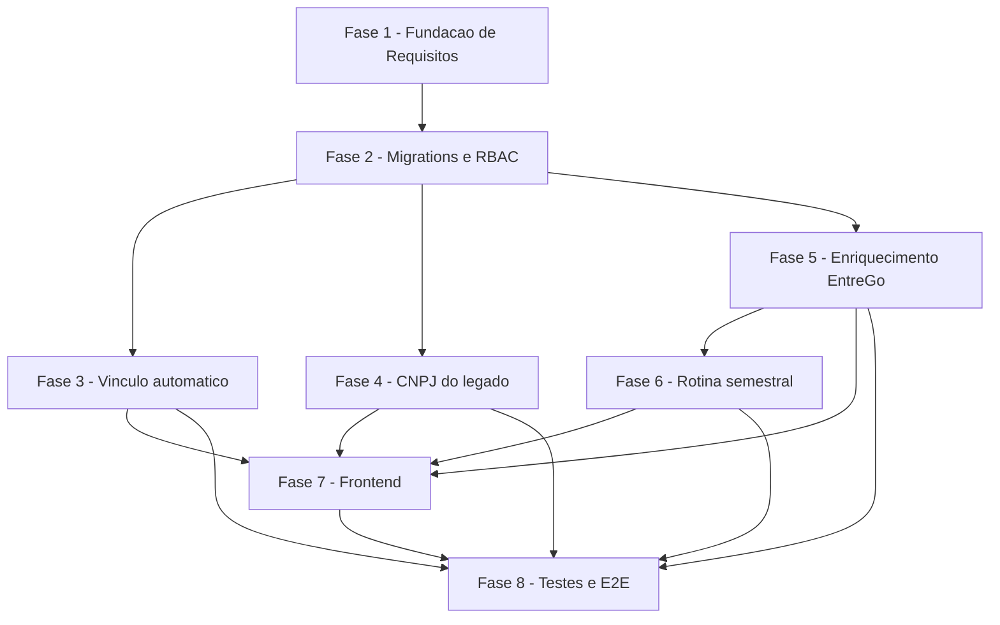

# Tarefas Hub Motorista 360 - Vínculo automático, enriquecimento EntreGô e CNPJ do legado

Escopo: decompõe `spec.md`/`plan.md` de `hub-motorista-360` — (1) vínculo
automático da credencial do app do motorista ao motorista do hub por
similaridade de nome (correção pós block-004, dec-031/dec-032); (2)
enriquecimento sob demanda + rotina semestral com dados da plataforma
EntreGô; (3) exibição do CNPJ hoje só disponível no legado. Inclui, como
FASE 1, o fechamento dos gaps ainda abertos em `checklists/security.md`
(consumo obrigatório de `[Gap]`/`[Conflict]`/`{humano}` pendentes antes da
implementação).

**Legenda de status:**
- `[ ]` Pendente
- `[~]` Em andamento
- `[x]` Concluído
- `[!]` Bloqueado

**Legenda de criticidade:**
- `[C]` Crítico - Impacto financeiro direto ou bloqueante
- `[A]` Alto - Funcionalidade essencial
- `[M]` Médio - Necessário mas sem urgência imediata

---

## FASE 1 - Fundação de Requisitos (fechamento dos gaps do checklist de segurança)

### 1.1 RBAC de campo — clareza e cobertura em requisito `[A]`

Ref: `checklists/security.md` CHK004, CHK005, CHK010, CHK012, CHK013,
CHK014; `spec.md` FR-013/FR-014

- [ ] 1.1.1 Adicionar a `spec.md` um requisito (ou nota normativa em
      FR-013/FR-014) que classifica explicitamente nome completo, data de
      nascimento e telefone como NÃO sensíveis — hoje a exclusão só existe
      em `contracts/hub-motoristas-detalhe.md` (fecha CHK004)
- [ ] 1.1.2 Levar ao operador se expor telefone e data de nascimento ao
      perfil `leitura` está dentro do apetite de risco do produto; registrar
      a decisão em `spec.md` (CHK005, `{humano}`)
- [ ] 1.1.3 Confirmar o código final da permissão `motoristas.dados_sensiveis`
      contra o padrão de nomenclatura da migration 0044 e substituir o
      `[PROPOSTA]` por valor definitivo em `spec.md`/`research.md`/
      `data-model.md` (CHK010)
- [ ] 1.1.4 Adicionar a FR-013 a exigência de OMITIR a chave (nunca
      `null`/máscara) quando a permissão falta — hoje essa regra só existe
      no contrato, uma implementação com `***.***.***-**` satisfaria FR-013
      ao pé da letra (CHK012)
- [ ] 1.1.5 Adicionar requisito (ou nota em FR-013) proibindo qualquer
      endpoint futuro de expor `dados_entrego_json` bruto fora de
      `buscarDetalheMotorista()` (CHK013)
- [ ] 1.1.6 Adicionar requisito (ou nota em `research.md` Decision 11)
      cobrindo as permissões do papel de serviço `robo_entrego_servico`
      sobre os dados sensíveis (CHK014)
- [ ] 1.1.7 Re-rodar `requirement-coverage.sh` e `validate-sdd.sh` em
      `spec.md` após os ajustes desta tarefa

### 1.2 Retenção e ciclo de vida dos dados sensíveis `[C]`

Ref: `checklists/security.md` CHK016, CHK017, CHK018, CHK019, CHK020;
`spec.md` FR-017

- [ ] 1.2.1 Levar ao operador/DPO a decisão de prazo de retenção e base
      legal para os dados de terceiro (o motorista não é usuário do hub);
      substituir o `[PROPOSTA — confirmar antes de execute-task]` de FR-017
      por valor definitivo (CHK019, `{humano}`)
- [ ] 1.2.2 Definir e documentar em FR-017 (ou novo FR) o que acontece com
      os dados sensíveis quando `Entregador.ativo = false` ou o vínculo é
      removido (CHK016)
- [ ] 1.2.3 Definir se há mecanismo de atendimento a pedido de exclusão do
      titular (motorista) sobre os dados enriquecidos (CHK017)
- [ ] 1.2.4 Definir o destino do payload anterior que a atualização
      semestral (FR-016) substitui — versionar, descartar, ou manter só o
      último (CHK018)
- [ ] 1.2.5 Confirmar com o operador se os backups diários do hub entram no
      escopo da retenção decidida (CHK020, `{humano}`)

### 1.3 Auditoria — quantificação e escopo `[A]`

Ref: `checklists/security.md` CHK022, CHK025; `spec.md` FR-014, FR-018

- [ ] 1.3.1 Enumerar em FR-014 (ou nota) as ações e campos exatos gravados
      pela auditoria de escrita — hoje FR-014 delega a "mesmo padrão
      existente" sem lista fechada (CHK022)
- [ ] 1.3.2 Definir se a proibição de logar dados sensíveis vale também para
      stdout/stack trace do worker `infra/robo-entrego/` e adicionar essa
      exigência à spec (CHK025)
- [ ] 1.3.3 Re-rodar `requirement-coverage.sh` e `validate-sdd.sh` em
      `spec.md` após os ajustes desta tarefa

### 1.4 Critérios de aceite e limites de frequência para a raspagem EntreGô `[A]`

Ref: `checklists/security.md` CHK030, CHK033, CHK035, CHK037; `spec.md`
FR-005, FR-016

- [ ] 1.4.1 Adicionar Success Criteria observável que falhe se uma tarefa
      assumir a rota do BFF como existente sem confirmação em
      `ACHADOS-PORTAL.md` (CHK030)
- [ ] 1.4.2 Quantificar o throttle entre motoristas de FR-016 com um número
      concreto (ex.: intervalo mínimo em minutos — `research.md:150` traz
      "ex.: a cada 5 min" como `[PROPOSTA]`) (CHK033)
- [ ] 1.4.3 Definir limite de frequência para a busca sob demanda (FR-005),
      que compartilha a mesma sessão EntreGô da rotina semestral e da
      importação diária (CHK035)
- [ ] 1.4.4 Confirmar com o operador se bloquear a sessão compartilhada (e
      com ela a importação diária das 06:00) é risco aceitável para uma
      ação disparada por gestor (CHK037, `{humano}`)

---

## FASE 2 - Migrations e RBAC (banco — artefatos para o operador aplicar)

### 2.1 Migration: colunas de enriquecimento em `Entregador` `[A]`

Ref: `data-model.md` §Entregador; `spec.md` FR-001..FR-004, FR-016

- [ ] 2.1.1 Criar `infra/hub/migrations/00NN_entregador_entrego_enriquecimento.sql`
      com `dados_entrego_json` (jsonb NULL), `dados_entrego_enriquecidos_em`
      (timestamptz NULL), `dados_entrego_solicitado_em` (timestamptz NULL)
      — número exato resolvido contra o diretório real no momento da
      execução (hoje o próximo livre é `0057`, ver `research.md`)
- [ ] 2.1.2 Validar a migration em `hub-homolog` isolado via
      `infra/hub/scripts/migrate.sh` — nunca em produção (rito, CLAUDE.md)
- [ ] 2.1.3 Teste: aplicar a migration em ambiente isolado e confirmar as 3
      colunas via `\d "Entregador"`

### 2.2 Migration: RPC `hub_motoristas_candidatos_por_conta` (simétrica à 0023) `[C]`

Ref: `research.md` Decision 12; `contracts/vinculo-automatico.md`;
`data-model.md` §Function `hub_motoristas_candidatos_por_conta`

- [ ] 2.2.1 Criar `infra/hub/migrations/00NN_rpc_motoristas_candidatos_por_conta.sql`
      implementando a função SQL (`SECURITY INVOKER`, `hub_normaliza_nome`,
      `pg_trgm`, join `EmpresaGrupoMovee`) — mesmo padrão exato de
      `hub_motoristas_candidatos(p_entregador_id)` (migration 0023), com o
      lado fixo invertido (`p_conta_motorista_id`)
- [ ] 2.2.2 Confirmar contra o schema real de 0023 que `hub_normaliza_nome`
      e a extensão `pg_trgm` já existem — não reintroduzir
- [ ] 2.2.3 Aplicar em `hub-homolog` isolado e validar via `SELECT` manual
      com um par `ContaMotorista`/`Entregador` de teste (nome quase-idêntico
      e nome muito diferente, confirmando o piso de retorno 0.3)
- [ ] 2.2.4 Teste automatizado (`npm run test:hub:integration`): a RPC
      retorna candidatos ordenados por similaridade DESC, escopados a
      `EmpresaGrupoMovee`, mesmo padrão de teste já usado para a 0023

### 2.3 Seed RBAC: permissão `motoristas.dados_sensiveis` `[A]`

Ref: `research.md` Decision 10; `data-model.md` §Permissao; Task 1.1.3
(código definitivo da permissão)

- [ ] 2.3.1 Criar `infra/hub/migrations/00NN_seed_permissao_motoristas_dados_sensiveis.sql`
      (mesmo padrão exato de `0044_seed_permissao_motoristas_credencial.sql`)
- [ ] 2.3.2 Conceder a permissão somente a `admin_plataforma` e
      `admin_entidade` via `PapelPermissao`
- [ ] 2.3.3 Teste de integração: usuário `leitura` sem a permissão vs.
      `admin_entidade` com a permissão, após seed aplicado em `hub-homolog`

### 2.4 Script SQL avulso: permissões `robo_entrego_servico` `[A]`

Ref: `research.md` Decision 11; `infra/robo-entrego/sql/001-usuario-servico-robo-entrego.sql`

- [ ] 2.4.1 Criar `infra/robo-entrego/sql/00N-permissoes-enriquecimento-robo-entrego.sql`
      concedendo `motoristas.enriquecimento.consultar` /
      `.atualizar` ao papel `robo_entrego_servico`
- [ ] 2.4.2 Documentar no runbook que o script é aplicado manualmente pelo
      operador (rito de produção, CLAUDE.md) — nunca por esta pipeline
- [ ] 2.4.3 Teste: chamada autenticada como `robo_entrego_servico` às novas
      rotas de fila retorna 200/202 após o grant aplicado em `hub-homolog`

---

## FASE 3 - Backend: Vínculo automático de credencial (US1, FR-009..FR-012)

### 3.1 Hook automático pós-registro `[C]`

Ref: `contracts/vinculo-automatico.md` §Extensão POST /motorista/register;
`routes/motorista.js:372`; `spec.md` FR-009, FR-010, FR-011

- [ ] 3.1.1 Extrair função compartilhada de localizar/criar `ContaMotorista`
      por `cnpj_prestador` (reuso do padrão já existente em
      `routes/hub-motoristas.js:1024`) — passo 1 do vínculo, inalterado
- [ ] 3.1.2 Implementar a chamada à RPC `hub_motoristas_candidatos_por_conta`
      (Task 2.2) e a regra de decisão: vincula automaticamente só com
      exatamente 1 candidato e similaridade >= 0.9 — passo 2 do vínculo
- [ ] 3.1.3 Implementar idempotência: checar `Entregador.motorista_id` já
      apontando para essa `ContaMotorista` antes de agir (FR-011)
- [ ] 3.1.4 Encadear a chamada dentro do handler `POST /motorista/register`
      em `try/catch` isolado, sem alterar a resposta 201/400/409/500 já
      existente (falha na etapa hub não bloqueia o cadastro)
- [ ] 3.1.5 Registrar auditoria `motorista.vinculado_automaticamente`
      (`contaMotoristaId`, `similaridade`), sem `usuarioId` humano
- [ ] 3.1.6 Teste: happy path — exatamente 1 candidato >= 0.9 vincula
      automaticamente sem ação do gestor (quickstart Scenario 1)
- [ ] 3.1.7 **Teste: caso ambíguo — 2+ candidatos >= 0.9 (ou nenhum
      candidato acima do limiar) NÃO vincula automaticamente**, fica
      disponível para vínculo manual (`Vincular`/`Criar credencial`,
      quickstart Scenario 2) — garante Acceptance Scenario 3 da User Story 1
      ("não vincula silenciosamente a um motorista errado")
- [ ] 3.1.8 Teste: idempotência — cadastro repetido no app do motorista para
      o mesmo motorista não cria segundo vínculo nem sobrescreve o
      existente (FR-011)

### 3.2 Backfill retroativo `[C]`

Ref: `contracts/vinculo-automatico.md` §Script; `quickstart.md` Scenario 3;
`spec.md` FR-012

- [ ] 3.2.1 Criar script standalone (localização exata — `infra/hub/scripts/`
      ou `app_homologacao/backend/scripts/` — a decidir nesta tarefa) que
      varre `Motorista WHERE senha IS NOT NULL` e reaplica a mesma função de
      3.1.1-3.1.3
- [ ] 3.2.2 Gerar relatório final em stdout: `totalProcessados`,
      `totalVinculados`, `totalAmbiguos`
- [ ] 3.2.3 Documentar no runbook que a execução é manual pelo operador, uma
      única vez (rito de produção, CLAUDE.md)
- [ ] 3.2.4 Teste: idempotência — reexecutar o script é no-op para
      motoristas já vinculados
- [ ] 3.2.5 Teste: motorista com credencial ativa e candidato único >= 0.9
      aparece em `totalVinculados` (caso relatado do briefing, dado real
      identificado só pelo print em
      `arquivos_complementares/hub-motorista-360-evidencias/` — nunca
      copiar o CNPJ/nome real para código ou teste versionado, usar
      fixture sintética)

---

## FASE 4 - Backend: CNPJ do legado na tela (US3, FR-008)

### 4.1 Exibir `cnpjPrestador` no detalhe do motorista `[M]`

Ref: `research.md` Decision 3; `contracts/hub-motoristas-detalhe.md`

- [ ] 4.1.1 Estender `buscarDetalheMotorista()` (`routes/hub-motoristas.js:460`)
      para incluir `cnpjPrestador` a partir de `ContaMotorista.cnpj_prestador`
      quando `motorista_id` está setado
- [ ] 4.1.2 Retornar o campo vazio — nunca erro — quando não houver vínculo
      (Acceptance Scenario 2 da User Story 3)
- [ ] 4.1.3 Teste: motorista com e sem CNPJ vinculado (quickstart Scenario 7
      — roundtrip `GET /motoristas/:id` real vs. contrato)

---

## FASE 5 - Backend: Enriquecimento EntreGô sob demanda (US2, FR-001..FR-007, FR-013, FR-014, FR-018)

### 5.1 Endpoint `POST /motoristas/:id/entrego-enriquecimento` `[A]`

Ref: `contracts/entrego-enriquecimento.md` §1

- [ ] 5.1.1 Criar a rota em `routes/hub-motoristas.js` com
      `requirePermission('motoristas.editar')`
- [ ] 5.1.2 Aplicar `express-rate-limit` dedicado (mesmo padrão de
      `registerRateLimiter`/`roboEntregoRateLimiter`) — protege a sessão
      EntreGô compartilhada, limite definido na Task 1.4.3
- [ ] 5.1.3 Responder 409 `SEM_IDENTIFICADOR_ENTREGO` quando
      `Entregador.id_externo` está ausente
- [ ] 5.1.4 Responder 429 `JA_PENDENTE` quando já existe
      `dados_entrego_solicitado_em` setado
- [ ] 5.1.5 Teste: os 3 casos (202 pendente, 409, 429) — quickstart
      Scenario 5

### 5.2 Fila consumida pelo robô EntreGô (`GET`/`PATCH hub-robo-entrego`) `[A]`

Ref: `contracts/entrego-enriquecimento.md` §2

- [ ] 5.2.1 Estender `routes/hub-robo-entrego.js` com
      `GET /hub-robo-entrego/motoristas-para-enriquecer`
      (`modo=sob-demanda|semestral`), autenticado pelo usuário de serviço
      `robo_entrego_servico`
- [ ] 5.2.2 Implementar `PATCH /hub-robo-entrego/motoristas/:id/entrego-enriquecimento`
      com verificação de linhas afetadas (404 quando RLS retorna 0 linhas —
      nunca 200/204 silencioso)
- [ ] 5.2.3 Garantir que a query passa por `hubPostgrestRequest()` com os
      `claims` do usuário de serviço autenticado — nunca bypass de RLS
      (`service_role`)
- [ ] 5.2.4 Registrar auditoria `motorista.entrego_enriquecido` /
      `motorista.entrego_enriquecimento_falhou`, sem incluir o payload
      sensível em `detalhes`
- [ ] 5.2.5 Teste: RLS confina o resultado a `id_empresa` do token de
      serviço; teste de 404 para `:id` fora do escopo do serviço

### 5.3 Worker `infra/robo-entrego/`: busca de dados na EntreGô `[C]`

Ref: `contracts/entrego-enriquecimento.md` §3; `research.md` Decision 9;
`spec.md` FR-005 (mesma clausula "nunca suposto" de FR-016)

- [ ] 5.3.1 Inspecionar a aba Network durante os 6 passos de navegação e
      levantar empiricamente o endpoint do BFF (via `page.evaluate`) —
      documentar em `docs/plans/robo-entrego/ACHADOS-PORTAL.md` ANTES de
      codificar a via de API (Constitution VI — nunca supor nome de
      rota/campo)
- [ ] 5.3.2 Implementar a via de API preferencial se o endpoint for
      confirmado; caso contrário implementar o fallback de UI com os 6
      XPaths do briefing (`BRIEFING-INPUT.md`, não verificados)
- [ ] 5.3.3 Reusar a sessão persistida
      (`/var/lib/hub_secrets/robo-entrego/entrego-session.json`) e a
      taxonomia de erro já existente (`ErroAntibotSuspeito` →
      `ehFalhaDefinitiva`) — nenhuma credencial nova
- [ ] 5.3.4 Consumir a fila via `GET /hub-robo-entrego/motoristas-para-enriquecer`
      e reportar o resultado via `PATCH` (Task 5.2)
- [ ] 5.3.5 Teste: falha (antibot/sessão expirada) NÃO descarta
      `dados_entrego_json` de uma busca anterior bem-sucedida (FR-007,
      quickstart Scenario 6)

### 5.4 RBAC de campo no DTO de resposta `[C]`

Ref: `contracts/hub-motoristas-detalhe.md` §RBAC de campo; `spec.md`
FR-013, FR-014

- [ ] 5.4.1 Checar `obterPermissoesEfetivas(usuarioId).has('motoristas.dados_sensiveis')`
      dentro de `buscarDetalheMotorista()`
- [ ] 5.4.2 Omitir a chave (nunca `null`/máscara) de `dadosPessoais`,
      `documentos.rg` e `contatoEmergencia` quando a permissão falta
- [ ] 5.4.3 Manter `dadosPessoaisBasicos` (nome completo, data de
      nascimento, telefone) e `documentos.cnh` sempre presentes
- [ ] 5.4.4 Teste: perfil `leitura` sem a permissão (chaves ausentes do
      JSON, `jq 'has("dadosPessoais")' → false`) vs. `admin_entidade` com a
      permissão (todas presentes) — quickstart Scenario 4

### 5.5 Auditoria de leitura de dados sensíveis (FR-018) `[A]`

Ref: `contracts/hub-motoristas-detalhe.md` §Auditoria de leitura

- [ ] 5.5.1 Chamar `registrarAuditoria()` com
      `acao: 'motorista.dados_sensiveis_visualizados'` quando a resposta
      incluir os campos sensíveis
- [ ] 5.5.2 Garantir que o payload sensível nunca entra em `detalhes`
      (`scrubDetalhes()` como defesa adicional, não substituta)
- [ ] 5.5.3 Teste: leitura por `admin_entidade` (com os campos) gera 1
      evento de auditoria; leitura por `leitura` (sem os campos) NÃO gera
      evento

---

## FASE 6 - Robô EntreGô: rotina semestral de atualização (FR-016)

### 6.1 Timers systemd sob-demanda + semestral `[M]`

Ref: `spec.md` FR-016; `plan.md` §Project Structure

- [ ] 6.1.1 Gerar os 2 timers via `scripts/gerar-timer.sh` a partir de
      `config.json` novo, com o throttle definido na Task 1.4.2
- [ ] 6.1.2 Implementar a seleção semestral: `Entregador WHERE
      dados_entrego_enriquecidos_em < now() - interval '6 months'`
- [ ] 6.1.3 Reaproveitar `BACKOFF_MS_SEQUENCIA`
      (`infra/robo-entrego/src/index.js:35`) e a classificação
      `ErroAntibotSuspeito` → `ehFalhaDefinitiva` já existentes
- [ ] 6.1.4 Teste: a rotina para (não insiste) diante de bloqueio antibot,
      mesmo comportamento já validado do robô de importação

---

## FASE 7 - Frontend: tela de detalhe do motorista

### 7.1 Seções novas em `page.tsx` `[A]`

Ref: `plan.md` §Project Structure; `contracts/hub-motoristas-detalhe.md`

- [ ] 7.1.1 Tipar em TS os campos novos do DTO (`dadosPessoaisBasicos`,
      `dadosPessoais`, `documentos`, `contatoEmergencia`,
      `informacoesEntrega`, `cnpjPrestador`, `vinculoCredencialAutomatico`)
- [ ] 7.1.2 Renderizar campos ausentes (RBAC) sem erro/placeholder
      alarmante — distinguir "sem permissão" de "vazio/não informado"
- [ ] 7.1.3 Exibir indicador para `vinculoCredencialAutomatico: true`
      (necessário para SC-002 ser observável)
- [ ] 7.1.4 Teste (vitest): componente renderiza corretamente com e sem os
      campos sensíveis presentes no payload

### 7.2 Botão "Buscar dados EntreGô" `[M]`

Ref: `spec.md` FR-005; `contracts/entrego-enriquecimento.md` §1

- [ ] 7.2.1 Chamar `POST /api/motoristas/:id/entrego-enriquecimento` (proxy
      httpOnly do frontend_v2) ao clicar
- [ ] 7.2.2 Exibir estado de carregamento/pendente e mensagem de erro clara
      nos casos 409/429
- [ ] 7.2.3 Desabilitar o botão quando `Entregador.id_externo` está ausente
      (mensagem "associe o identificador antes de buscar")
- [ ] 7.2.4 Teste (vitest): os 3 estados (sucesso/pendente, sem
      identificador, indisponibilidade da EntreGô)

---

## FASE 8 - Testes de integração e E2E

### 8.1 Suíte de integração backend (`node --test`) `[A]`

Ref: CLAUDE.md §Comandos; `npm run test:hub:integration`

- [ ] 8.1.1 Cobrir todos os cenários de `quickstart.md` (1 a 7) com
      `node --test` contra `hub-homolog` isolado
- [ ] 8.1.2 Rodar `npm test` (suíte completa) e confirmar 0 regressões na
      suíte existente
- [ ] 8.1.3 Confirmar que os testes cobrem os 3 casos de erro do endpoint
      de busca (409/429/202) e os 2 casos de RBAC de campo
      (`leitura`/`admin_entidade`)

### 8.2 E2E do hub (Playwright, driver oficial) `[A]`

Ref: CLAUDE.md §Comandos (`hub-shell-e2e-browser.sh`)

- [ ] 8.2.1 Cenário E2E: gestor abre o detalhe do motorista, aciona a busca
      EntreGô, vê os campos preenchidos
- [ ] 8.2.2 Cenário E2E: perfil `leitura` não vê os campos sensíveis na UI
- [ ] 8.2.3 Rodar via driver oficial (nunca instalar browsers no host) e
      conferir que `package-lock.json` não foi reescrito antes de commitar
      (gotcha já documentado em CLAUDE.md)

---

## Matriz de Dependências

## Resumo Quantitativo

| Fase | Tarefas | Subtarefas | Criticidade |
|------|---------|------------|-------------|
| 1 - Fundação de Requisitos | 4 | 19 | C/A |
| 2 - Migrations e RBAC | 4 | 13 | C/A |
| 3 - Vínculo automático | 2 | 13 | C |
| 4 - CNPJ do legado | 1 | 3 | M |
| 5 - Enriquecimento EntreGô | 5 | 22 | C/A |
| 6 - Rotina semestral | 1 | 4 | M |
| 7 - Frontend | 2 | 8 | A/M |
| 8 - Testes e E2E | 2 | 6 | A |
| **Total** | **21** | **88** | - |

## Escopo Coberto

| Item | Descrição | Fase |
|------|-----------|------|
| CHK004, CHK005, CHK010, CHK012, CHK013, CHK014, CHK016..CHK020, CHK022, CHK025, CHK030, CHK033, CHK035, CHK037 | Fechamento de todos os gaps/ambiguidades/riscos ainda abertos no checklist de segurança | 1 |
| FR-009, FR-010, FR-011, FR-012 | Vínculo automático de credencial por similaridade de nome (piso ≥ 0.9, único candidato) + backfill retroativo | 2, 3 |
| FR-008 | CNPJ do legado na tela de detalhe | 4 |
| FR-001..FR-007, FR-013, FR-014, FR-018 | Enriquecimento sob demanda via EntreGô + RBAC de campo + auditoria de leitura | 2, 5 |
| FR-016 | Rotina semestral de atualização | 6 |
| FR-015 | Exibição de categorias EntreGô sem tradução/rotulagem | 7 |
| SC-001..SC-005 | Validação end-to-end via testes de integração e E2E | 8 |

## Escopo Excluído

| Item | Descrição | Motivo |
|------|-----------|--------|
| Fotos de documentos da EntreGô | Upload/exibição de imagens de RG/CNH | Fora de escopo por FR-002 |
| Execução em lote/agendada da busca sob demanda | Scheduler para `POST /entrego-enriquecimento` além da rotina semestral | Fora de escopo por FR-005 (clarificado) |
| Prazo exato de retenção e base legal | Número concreto de retenção (dias/meses/anos) | Decisão `{humano}`/DPO pendente (Task 1.2.1) — a spec só exige que a política exista (FR-017), não fabrica o valor (Constitution VI) |
| Dois endpoints separados para dados sensíveis | `GET /:id/dados-sensiveis` dedicado | Rejeitado em `research.md` Decision 10 — exigiria 2 requisições do frontend para montar uma única tela |
| Migração completa do legado para o hub | Descomissionamento do envio-massa legado | Fora do escopo desta feature (apenas leitura pontual do CNPJ) |
