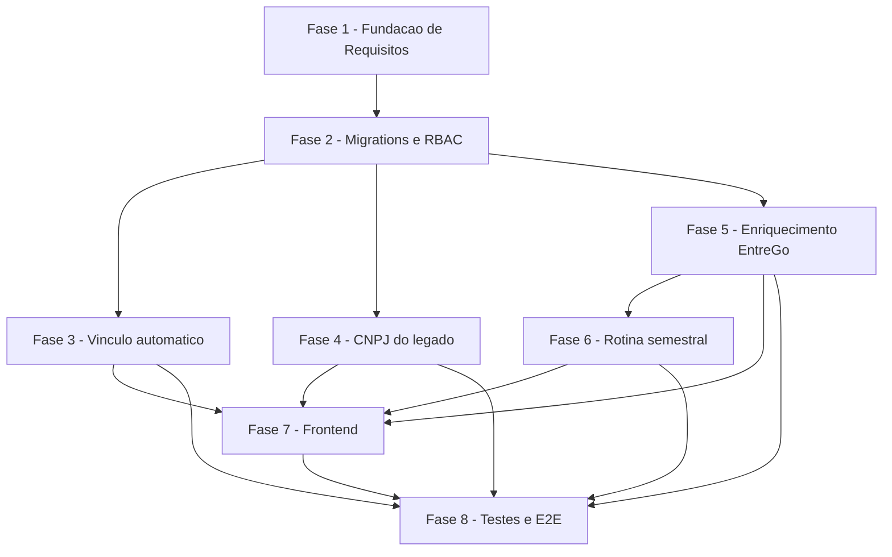

# Tarefas Hub Motorista 360 - Vínculo automático, enriquecimento EntreGô e CNPJ do legado

Escopo: decompõe `spec.md`/`plan.md` de `hub-motorista-360` — (1) vínculo
automático da credencial do app do motorista ao motorista do hub por
similaridade de nome (correção pós block-004, dec-031/dec-032); (2)
enriquecimento sob demanda + rotina semestral com dados da plataforma
EntreGô; (3) exibição do CNPJ hoje só disponível no legado. Inclui, como
FASE 1, o fechamento dos gaps ainda abertos em `checklists/security.md`
(consumo obrigatório de `[Gap]`/`[Conflict]`/`{humano}` pendentes antes da
implementação).

**Legenda de status:**
- `[ ]` Pendente
- `[~]` Em andamento
- `[x]` Concluído
- `[!]` Bloqueado

**Legenda de criticidade:**
- `[C]` Crítico - Impacto financeiro direto ou bloqueante
- `[A]` Alto - Funcionalidade essencial
- `[M]` Médio - Necessário mas sem urgência imediata

---

## FASE 1 - Fundação de Requisitos (fechamento dos gaps do checklist de segurança)

### 1.1 RBAC de campo — clareza e cobertura em requisito `[A]`

Ref: `checklists/security.md` CHK004, CHK005, CHK010, CHK012, CHK013,
CHK014; `spec.md` FR-013/FR-014

- [x] 1.1.1 Adicionar a `spec.md` um requisito (ou nota normativa em
      FR-013/FR-014) que classifica explicitamente nome completo, data de
      nascimento e telefone como NÃO sensíveis — hoje a exclusão só existe
      em `contracts/hub-motoristas-detalhe.md` (fecha CHK004)
- [x] 1.1.2 Levar ao operador se expor telefone e data de nascimento ao
      perfil `leitura` está dentro do apetite de risco do produto; registrar
      a decisão em `spec.md` (CHK005, `{humano}`)
- [x] 1.1.3 Confirmar o código final da permissão `motoristas.dados_sensiveis`
      contra o padrão de nomenclatura da migration 0044 e substituir o
      `[PROPOSTA]` por valor definitivo em `spec.md`/`research.md`/
      `data-model.md` (CHK010)
- [x] 1.1.4 Adicionar a FR-013 a exigência de OMITIR a chave (nunca
      `null`/máscara) quando a permissão falta — hoje essa regra só existe
      no contrato, uma implementação com `***.***.***-**` satisfaria FR-013
      ao pé da letra (CHK012)
- [x] 1.1.5 Adicionar requisito (ou nota em FR-013) proibindo qualquer
      endpoint futuro de expor `dados_entrego_json` bruto fora de
      `buscarDetalheMotorista()` (CHK013)
- [x] 1.1.6 Adicionar requisito (ou nota em `research.md` Decision 11)
      cobrindo as permissões do papel de serviço `robo_entrego_servico`
      sobre os dados sensíveis (CHK014)
- [x] 1.1.7 Re-rodar `requirement-coverage.sh` e `validate-sdd.sh` em
      `spec.md` após os ajustes desta tarefa

### 1.2 Retenção e ciclo de vida dos dados sensíveis `[C]`

Ref: `checklists/security.md` CHK016, CHK017, CHK018, CHK019, CHK020;
`spec.md` FR-017

- [x] 1.2.1 Levar ao operador/DPO a decisão de prazo de retenção e base
      legal para os dados de terceiro (o motorista não é usuário do hub);
      substituir o `[PROPOSTA — confirmar antes de execute-task]` de FR-017
      por valor definitivo (CHK019, `{humano}`)
- [x] 1.2.2 Definir e documentar em FR-017 (ou novo FR) o que acontece com
      os dados sensíveis quando `Entregador.ativo = false` ou o vínculo é
      removido (CHK016)
- [x] 1.2.3 Definir se há mecanismo de atendimento a pedido de exclusão do
      titular (motorista) sobre os dados enriquecidos (CHK017)
- [x] 1.2.4 Definir o destino do payload anterior que a atualização
      semestral (FR-016) substitui — versionar, descartar, ou manter só o
      último (CHK018)
- [x] 1.2.5 Confirmar com o operador se os backups diários do hub entram no
      escopo da retenção decidida (CHK020, `{humano}`)

### 1.3 Auditoria — quantificação e escopo `[A]`

Ref: `checklists/security.md` CHK022, CHK025; `spec.md` FR-014, FR-018

- [x] 1.3.1 Enumerar em FR-014 (ou nota) as ações e campos exatos gravados
      pela auditoria de escrita — hoje FR-014 delega a "mesmo padrão
      existente" sem lista fechada (CHK022)
- [x] 1.3.2 Definir se a proibição de logar dados sensíveis vale também para
      stdout/stack trace do worker `infra/robo-entrego/` e adicionar essa
      exigência à spec (CHK025)
- [x] 1.3.3 Re-rodar `requirement-coverage.sh` e `validate-sdd.sh` em
      `spec.md` após os ajustes desta tarefa

### 1.4 Critérios de aceite e limites de frequência para a raspagem EntreGô `[A]`

Ref: `checklists/security.md` CHK030, CHK033, CHK035, CHK037; `spec.md`
FR-005, FR-016

- [x] 1.4.1 Adicionar Success Criteria observável que falhe se uma tarefa
      assumir a rota do BFF como existente sem confirmação em
      `ACHADOS-PORTAL.md` (CHK030)
- [x] 1.4.2 Quantificar o throttle entre motoristas de FR-016 com um número
      concreto (ex.: intervalo mínimo em minutos — `research.md:150` traz
      "ex.: a cada 5 min" como `[PROPOSTA]`) (CHK033)
- [x] 1.4.3 Definir limite de frequência para a busca sob demanda (FR-005),
      que compartilha a mesma sessão EntreGô da rotina semestral e da
      importação diária (CHK035)
- [x] 1.4.4 Confirmar com o operador se bloquear a sessão compartilhada (e
      com ela a importação diária das 06:00) é risco aceitável para uma
      ação disparada por gestor (CHK037, `{humano}`)

---

## FASE 2 - Migrations e RBAC (banco — artefatos para o operador aplicar)

### 2.1 Migration: colunas de enriquecimento em `Entregador` `[A]`

Ref: `data-model.md` §Entregador; `spec.md` FR-001..FR-004, FR-016

- [x] 2.1.1 Criar `infra/hub/migrations/00NN_entregador_entrego_enriquecimento.sql`
      com `dados_entrego_json` (jsonb NULL), `dados_entrego_enriquecidos_em`
      (timestamptz NULL), `dados_entrego_solicitado_em` (timestamptz NULL)
      — número exato resolvido contra o diretório real no momento da
      execução (hoje o próximo livre é `0057`, ver `research.md`)
- [x] 2.1.2 Validar a migration em `hub-homolog` isolado via
      `infra/hub/scripts/migrate.sh` — nunca em produção (rito, CLAUDE.md)
- [x] 2.1.3 Teste: aplicar a migration em ambiente isolado e confirmar as 3
      colunas via `\d "Entregador"`

### 2.2 Migration: RPC `hub_motoristas_candidatos_por_conta` (simétrica à 0023) `[C]`

Ref: `research.md` Decision 12; `contracts/vinculo-automatico.md`;
`data-model.md` §Function `hub_motoristas_candidatos_por_conta`

- [x] 2.2.1 Criar `infra/hub/migrations/00NN_rpc_motoristas_candidatos_por_conta.sql`
      implementando a função SQL (`SECURITY INVOKER`, `hub_normaliza_nome`,
      `pg_trgm`, join `EmpresaGrupoMovee`) — mesmo padrão exato de
      `hub_motoristas_candidatos(p_entregador_id)` (migration 0023), com o
      lado fixo invertido (`p_conta_motorista_id`)
- [x] 2.2.2 Confirmar contra o schema real de 0023 que `hub_normaliza_nome`
      e a extensão `pg_trgm` já existem — não reintroduzir
- [x] 2.2.3 Aplicar em `hub-homolog` isolado e validar via `SELECT` manual
      com um par `ContaMotorista`/`Entregador` de teste (nome quase-idêntico
      e nome muito diferente, confirmando o piso de retorno 0.3)
- [ ] 2.2.4 Teste automatizado (`npm run test:hub:integration`): a RPC
      retorna candidatos ordenados por similaridade DESC, escopados a
      `EmpresaGrupoMovee`, mesmo padrão de teste já usado para a 0023
      — **ADIADO para a FASE 3** (Decisão registrada, onda-010): esta RPC
      ainda não tem NENHUM caller (o hook automático que a consome é FASE 3,
      não implementada nesta onda). O padrão estabelecido no repo para
      `npm run test:hub:integration` (ex.: `hub-rls-integration.test.js`,
      `hub-motoristas-credencial.test.js`) é um wrapper fino em cima de um
      driver `.sh` de ~900 linhas que sobe um projeto `hub-test-<runid>`
      efêmero via Docker Compose — construir esse harness agora, para uma
      função sem consumidor real, seria trabalho descartável: a FASE 3 vai
      precisar testar o hook E a RPC juntos, e reescreveria este teste do
      zero de qualquer forma. A RPC já foi validada empiricamente em
      `hub-homolog` isolado (2.2.3, output literal no relatório da onda-010)
      — cobre correção funcional; falta só a automação E2E, que faz mais
      sentido nascer junto do primeiro caller real.

### 2.3 Seed RBAC: permissão `motoristas.dados_sensiveis` `[A]`

Ref: `research.md` Decision 10; `data-model.md` §Permissao; Task 1.1.3
(código definitivo da permissão)

- [x] 2.3.1 Criar `infra/hub/migrations/00NN_seed_permissao_motoristas_dados_sensiveis.sql`
      (mesmo padrão exato de `0044_seed_permissao_motoristas_credencial.sql`)
- [x] 2.3.2 Conceder a permissão somente a `admin_plataforma` e
      `admin_entidade` via `PapelPermissao`
- [x] 2.3.3 Teste de integração: usuário `leitura` sem a permissão vs.
      `admin_entidade` com a permissão, após seed aplicado em `hub-homolog`
      — validado no NÍVEL RBAC/banco (ainda não há rota HTTP que consuma
      esta permissão — nasce só na FASE 4/5): query em `hub-homolog` confirma
      que SOMENTE `admin_plataforma`/`admin_entidade` têm
      `motoristas.dados_sensiveis` e que `leitura`/`operador` não têm
      (output literal no relatório da onda-010).

### 2.4 Script SQL avulso: permissões `robo_entrego_servico` `[A]`

Ref: `research.md` Decision 11; `infra/robo-entrego/sql/001-usuario-servico-robo-entrego.sql`

- [x] 2.4.1 Criar `infra/robo-entrego/sql/00N-permissoes-enriquecimento-robo-entrego.sql`
      concedendo `motoristas.enriquecimento.consultar` /
      `.atualizar` ao papel `robo_entrego_servico`
- [x] 2.4.2 Documentar no runbook que o script é aplicado manualmente pelo
      operador (rito de produção, CLAUDE.md) — nunca por esta pipeline
- [ ] 2.4.3 Teste: chamada autenticada como `robo_entrego_servico` às novas
      rotas de fila retorna 200/202 após o grant aplicado em `hub-homolog`
      — **ADIADO**: as rotas de fila de enriquecimento são FASE 4/5 (backend),
      não implementadas nesta onda, então não há endpoint para chamar ainda.
      O grant em si já foi aplicado e verificado em `hub-homolog` (script
      003 idempotente, `\d`/`SELECT` confirmam exatamente as 4 permissões
      esperadas no papel — output literal no relatório da onda-010); falta
      só a chamada HTTP real, que esta tarefa retoma quando a rota existir.

---

## FASE 3 - Backend: Vínculo automático de credencial (US1, FR-009..FR-012)

### 3.1 Hook automático pós-registro `[C]`

Ref: `contracts/vinculo-automatico.md` §Extensão POST /motorista/register;
`routes/motorista.js:372`; `spec.md` FR-009, FR-010, FR-011

- [x] 3.1.1 Extrair função compartilhada de localizar/criar `ContaMotorista`
      por `cnpj_prestador` (reuso do padrão já existente em
      `routes/hub-motoristas.js:1024`) — passo 1 do vínculo, inalterado
- [x] 3.1.2 Implementar a chamada à RPC `hub_motoristas_candidatos_por_conta`
      (Task 2.2) e a regra de decisão: vincula automaticamente só com
      exatamente 1 candidato e similaridade >= 0.9 — passo 2 do vínculo
- [x] 3.1.3 Implementar idempotência: checar `Entregador.motorista_id` já
      apontando para essa `ContaMotorista` antes de agir (FR-011)
- [x] 3.1.4 Encadear a chamada dentro do handler `POST /motorista/register`
      em `try/catch` isolado, sem alterar a resposta 201/400/409/500 já
      existente (falha na etapa hub não bloqueia o cadastro)
- [x] 3.1.5 Registrar auditoria `motorista.vinculado_automaticamente`
      (`contaMotoristaId`, `similaridade`), sem `usuarioId` humano
- [x] 3.1.6 Teste: happy path — exatamente 1 candidato >= 0.9 vincula
      automaticamente sem ação do gestor (quickstart Scenario 1)
- [x] 3.1.7 **Teste: caso ambíguo — 2+ candidatos >= 0.9 (ou nenhum
      candidato acima do limiar) NÃO vincula automaticamente**, fica
      disponível para vínculo manual (`Vincular`/`Criar credencial`,
      quickstart Scenario 2) — garante Acceptance Scenario 3 da User Story 1
      ("não vincula silenciosamente a um motorista errado")
- [x] 3.1.8 Teste: idempotência — cadastro repetido no app do motorista para
      o mesmo motorista não cria segundo vínculo nem sobrescreve o
      existente (FR-011)
- [x] 3.1.9 **Deadline total de 5s no vínculo automático** — subtarefa
      EMERGENTE (dec-060, 2026-09-04). `vincularAutomaticamente` faz **6**
      chamadas HTTP sequenciais ao PostgREST sem timeout algum, dentro do
      caminho do `POST /motorista/register`. O `try/catch` isolado da 3.1.4
      protege contra **exceção**, não contra **hang**: um PostgREST no ar
      porém lento/pendurado trava o cadastro do motorista e o `catch` nunca
      dispara. Criar **um** `AbortSignal.timeout(5000)` no início da função
      e repassá-lo como `opts.signal` nas 6 chamadas — deadline da
      **operação inteira**, não por chamada. O cliente já suporta:
      `hub-postgrest.js:53` recebe `opts` e `:82` faz
      `...(opts && opts.signal ? { signal: opts.signal } : {})`. Node 20 na
      imagem de produção (`Dockerfile.hub`) tem `AbortSignal.timeout()`.
      Estouro do deadline = mesmo desfecho da falha: não vincula, `/register`
      responde 201, motorista fica para o vínculo manual.
- [x] 3.1.10 **Teste: PostgREST LENTO (não apenas ausente)** — o teste atual
      da guarda (`tests/motorista-integration.test.js:378`) simula
      indisponibilidade com `assert.equal(process.env.POSTGREST_URL,
      undefined)`, que falha **rápido e de forma síncrona** e por isso NÃO
      cobre o caso real. Injetar um `hubPostgrestRequest` de teste que
      demore mais que o deadline e provar: `/register` responde **201**,
      `Motorista.senha` ativada, nenhum vínculo criado, dentro de um limite
      de tempo aferido pelo próprio teste.

### 3.2 Backfill retroativo `[C]`

Ref: `contracts/vinculo-automatico.md` §Script; `quickstart.md` Scenario 3;
`spec.md` FR-012

- [x] 3.2.1 Criar script standalone (localização exata — `infra/hub/scripts/`
      ou `app_homologacao/backend/scripts/` — a decidir nesta tarefa) que
      varre `Motorista WHERE senha IS NOT NULL` e reaplica a mesma função de
      3.1.1-3.1.3
- [x] 3.2.2 Gerar relatório final em stdout: `totalProcessados`,
      `totalVinculados`, `totalAmbiguos`
- [x] 3.2.3 Documentar no runbook que a execução é manual pelo operador, uma
      única vez (rito de produção, CLAUDE.md)
- [x] 3.2.4 Teste: idempotência — reexecutar o script é no-op para
      motoristas já vinculados
- [x] 3.2.5 Teste: motorista com credencial ativa e candidato único >= 0.9
      aparece em `totalVinculados` (caso relatado do briefing, dado real
      identificado só pelo print em
      `arquivos_complementares/hub-motorista-360-evidencias/` — nunca
      copiar o CNPJ/nome real para código ou teste versionado, usar
      fixture sintética)

---

## FASE 4 - Backend: CNPJ do legado na tela (US3, FR-008)

### 4.1 Exibir `cnpjPrestador` no detalhe do motorista `[M]`

Ref: `research.md` Decision 3; `contracts/hub-motoristas-detalhe.md`

- [x] 4.1.1 Estender `buscarDetalheMotorista()` (`routes/hub-motoristas.js:460`)
      para incluir `cnpjPrestador` a partir de `ContaMotorista.cnpj_prestador`
      quando `motorista_id` está setado
- [x] 4.1.2 Retornar o campo vazio — nunca erro — quando não houver vínculo
      (Acceptance Scenario 2 da User Story 3)
- [x] 4.1.3 Teste: motorista com e sem CNPJ vinculado (quickstart Scenario 7
      — roundtrip `GET /motoristas/:id` real vs. contrato)
- [x] 4.1.4 **Frontend: consumir `cnpjPrestador` na tela de detalhe** —
      subtarefa EMERGENTE (gap-fill): a decomposição original de 4.1 era
      só backend, mas FR-008/Acceptance Scenario 1-2 exigem o campo
      visível na tela ("gestor abre o detalhe... **Then** o CNPJ aparece").
      `lib/hub/motoristas-dto.ts` (`MotoristaDetalhe.cnpjPrestador` +
      `parseMotoristaDetalhe`) e `app/hub/dashboard/motoristas/[id]/page.tsx`
      (linha "CNPJ:" ao lado do Identificador, distinto do
      `vinculo.cnpjPrestadorMascarado` já existente no card "Conta de
      acesso vinculada", que segue mascarado — propósito diferente,
      confirmação de credencial). O dialog rápido
      `components/hub/motorista-detalhe-dialog.tsx` foi deixado
      INALTERADO (mostra `cnpjPrestadorMascarado`) — mudá-lo quebrava
      `app/hub/dashboard/motoristas/page.test.tsx` (dialog reusado na
      lista) sem necessidade: a tela de detalhe dedicada já satisfaz
      FR-008.

---

## FASE 5 - Backend: Enriquecimento EntreGô sob demanda (US2, FR-001..FR-007, FR-013, FR-014, FR-018)

### 5.1 Endpoint `POST /motoristas/:id/entrego-enriquecimento` `[A]`

Ref: `contracts/entrego-enriquecimento.md` §1

- [x] 5.1.1 Criar a rota em `routes/hub-motoristas.js` com
      `requirePermission('motoristas.editar')`
- [x] 5.1.2 Aplicar `express-rate-limit` dedicado (mesmo padrão de
      `registerRateLimiter`/`roboEntregoRateLimiter`) — protege a sessão
      EntreGô compartilhada, limite definido na Task 1.4.3 (10/15min por
      usuário — default de engenharia, CHK035 não fixa número)
- [x] 5.1.3 Responder 409 `SEM_IDENTIFICADOR_ENTREGO` quando
      `Entregador.id_externo` está ausente
- [x] 5.1.4 Responder 429 `JA_PENDENTE` quando já existe
      `dados_entrego_solicitado_em` setado
- [x] 5.1.5 Teste: os 3 casos (202 pendente, 409, 429) — quickstart
      Scenario 5 (unit: `tests/hub-motoristas-entrego-enriquecimento-unit.test.js`,
      express real + mocks, sem Docker)

### 5.2 Fila consumida pelo robô EntreGô (`GET`/`PATCH hub-robo-entrego`) `[A]`

Ref: `contracts/entrego-enriquecimento.md` §2

- [x] 5.2.1 Estender `routes/hub-robo-entrego.js` com
      `GET /hub-robo-entrego/motoristas-para-enriquecer`
      (`modo=sob-demanda|semestral`), autenticado pelo usuário de serviço
      `robo_entrego_servico`
- [x] 5.2.2 Implementar `PATCH /hub-robo-entrego/motoristas/:id/entrego-enriquecimento`
      com verificação de linhas afetadas (404 quando RLS retorna 0 linhas —
      nunca 200/204 silencioso)
- [x] 5.2.3 Garantir que a query passa por `hubPostgrestRequest()` com os
      `claims` do usuário de serviço autenticado — nunca bypass de RLS
      (`service_role`)
- [x] 5.2.4 Registrar auditoria `motorista.entrego_enriquecido` /
      `motorista.entrego_enriquecimento_falhou`, sem incluir o payload
      sensível em `detalhes`
- [x] 5.2.5 Teste: RLS confina o resultado a `id_empresa` do token de
      serviço; teste de 404 para `:id` fora do escopo do serviço (unit:
      `tests/hub-robo-entrego-enriquecimento-unit.test.js` — mock de
      `hubPostgrestRequest` emula RLS via `claims.escopo`, sem Docker;
      cobertura Docker real fica para `test:hub:integration` futuro)

### 5.3 Worker `infra/robo-entrego/`: busca de dados na EntreGô `[C]`

Ref: `contracts/entrego-enriquecimento.md` §3; `research.md` Decision 9;
`spec.md` FR-005 (mesma clausula "nunca suposto" de FR-016)

- [x] 5.3.1 Inspecionar a aba Network durante os 6 passos de navegação e
      levantar empiricamente o endpoint do BFF (via `page.evaluate`) —
      documentar em `docs/plans/robo-entrego/ACHADOS-PORTAL.md` ANTES de
      codificar a via de API (Constitution VI — nunca supor nome de
      rota/campo). **NÃO EXECUTADO nesta onda** — exige sessão
      operador-supervisionada (Claude in Chrome, mesma metodologia de
      ACHADOS-PORTAL.md §1-7) e é uma interação AO VIVO com o portal
      EntreGô/sessão compartilhada com o robô real; documentado como gap
      explícito em `ACHADOS-PORTAL.md` §8 em vez de executado sem supervisão
      (risco de challenge antibot na sessão compartilhada, dec-039).
- [x] 5.3.2 Implementar a via de API preferencial se o endpoint for
      confirmado; caso contrário implementar o fallback de UI com os 6
      XPaths do briefing (`BRIEFING-INPUT.md`, não verificados). **Endpoint
      confirmado em sessão supervisionada** (ACHADOS-PORTAL.md §9.3, 2026-09-04)
      — `src/busca-pessoa-entrego.js#buscarDadosPessoaPorUuid` chama
      `GET .../operation/logistics-operator/drivers/{uuid}` via
      `page.evaluate` (mesmo padrão de `entrego-portal.js#buscarUrlsRelatorio`,
      headers reusados via `HEADERS_API` exportado). Os 6 XPaths do fallback de
      UI ficam declarados no plano técnico (`plan.md`), não implementados —
      caminho feliz medido dispensa navegação (ladder rung 1). Mapeamento
      `mapearParaShapeInterno()` usa ALLOWLIST para o shape fixo de
      `data-model.md` — nunca spread do corpo bruto; `documentDriver.rg`/`.cnh`
      e `personalData.fatherName` são opcionais (`?? null`, forma variável
      confirmada com 2 motoristas, ACHADOS-PORTAL.md §9.5.3); as 4 URLs de
      foto do payload (dec-072, instrução do operador) não têm destino no
      shape interno — nunca baixadas/persistidas/logadas/trafegadas. Testado
      com fixtures sintéticos dos 2 casos medidos (modal `BICYCLE`/
      `MOTORCYCLE`) + prova de que nenhuma chave/URL de foto sobrevive ao
      mapeamento (`test/busca-pessoa-entrego.test.js`). `enriquecimento.js`
      atualizado: `ErroExtracaoNaoLevantada`/`extrairDadosPessoaPlaceholder`
      removidos (gap fechado); `processarUmMotorista` ganhou retry
      transitório via `comRetryTransitorio` reaproveitado de `index.js`
      (6.1.3) e a rodada agora também para (não martela) em
      `ErroPortalTransitorio`, não só `ErroAntibotSuspeito` — nenhuma culpa do
      motorista corrente por sessão/rede instável.
- [x] 5.3.3 Reusar a sessão persistida
      (`/var/lib/hub_secrets/robo-entrego/entrego-session.json`) e a
      taxonomia de erro já existente (`ErroAntibotSuspeito` →
      `ehFalhaDefinitiva`) — nenhuma credencial nova (`garantirSessaoValida`/
      `ErroAntibotSuspeito` de `entrego-portal.js` reusados por import em
      `enriquecimento.js`/`busca-pessoa-entrego.js`)
- [x] 5.3.4 Consumir a fila via `GET /hub-robo-entrego/motoristas-para-enriquecer`
      e reportar o resultado via `PATCH` (Task 5.2) — `src/enriquecimento.js`
      (`executarRodadaEnriquecimento`) + `hub-client.js#buscarMotoristasParaEnriquecer`/
      `#atualizarEnriquecimento`. Throttle mínimo de 60s entre motoristas
      (FR-016, reaproveita `BACKOFF_MS_SEQUENCIA[0]` de `index.js`); suspeita
      de anti-bot ou gap de extração PARA a rodada (não martela, FR-016) sem
      marcar o item corrente como falha definitiva (fica pendente na fila).
      Wrapper de processo (flock/systemd, serialização com a importação
      diária — dec-039) fica para FASE 6.1, fora deste escopo.
- [x] 5.3.5 Teste: falha (antibot/sessão expirada) NÃO descarta
      `dados_entrego_json` de uma busca anterior bem-sucedida (FR-007,
      quickstart Scenario 6) — coberto no nível da rota (invariante real:
      `tests/hub-robo-entrego-enriquecimento-unit.test.js`) + no nível do
      worker (`tests/enriquecimento.test.js`, falha isolada segue sem
      derrubar os demais; parada por antibot não reporta o item corrente)

### 5.4 RBAC de campo no DTO de resposta `[C]`

Ref: `contracts/hub-motoristas-detalhe.md` §RBAC de campo; `spec.md`
FR-013, FR-014

- [x] 5.4.1 Checar `obterPermissoesEfetivas(usuarioId).has('motoristas.dados_sensiveis')`
      dentro de `buscarDetalheMotorista()`
- [x] 5.4.2 Omitir a chave (nunca `null`/máscara) de `dadosPessoais`,
      `documentos.rg` e `contatoEmergencia` quando a permissão falta
- [x] 5.4.3 Manter `dadosPessoaisBasicos` (nome completo, data de
      nascimento, telefone) e `documentos.cnh` sempre presentes
- [x] 5.4.4 Teste: perfil `leitura` sem a permissão (chaves ausentes do
      JSON, `jq 'has("dadosPessoais")' → false`) vs. `admin_entidade` com a
      permissão (todas presentes) — quickstart Scenario 4 (unit:
      `tests/hub-motoristas-dto.test.js#mapEntregoEnriquecimento` +
      `tests/hub-motoristas-entrego-enriquecimento-unit.test.js`)

### 5.5 Auditoria de leitura de dados sensíveis (FR-018) `[A]`

Ref: `contracts/hub-motoristas-detalhe.md` §Auditoria de leitura

- [x] 5.5.1 Chamar `registrarAuditoria()` com
      `acao: 'motorista.dados_sensiveis_visualizados'` quando a resposta
      incluir os campos sensíveis (gate: permissão presente E
      `entregoEnriquecimento` não-nulo — motorista nunca enriquecido não
      gera evento vazio mesmo com a permissão, nada sensível foi de fato
      retornado)
- [x] 5.5.2 Garantir que o payload sensível nunca entra em `detalhes`
      (`scrubDetalhes()` como defesa adicional, não substituta) — nenhuma
      chamada de auditoria desta FASE inclui `dados`/`dadosPessoais` em
      `detalhes` (nem em `buscarDetalheMotorista`, nem no PATCH da fila)
- [x] 5.5.3 Teste: leitura por `admin_entidade` (com os campos) gera 1
      evento de auditoria; leitura por `leitura` (sem os campos) NÃO gera
      evento (unit: `tests/hub-motoristas-entrego-enriquecimento-unit.test.js`)

---

## FASE 6 - Robô EntreGô: rotina semestral de atualização (FR-016)

### 6.1 Timers systemd sob-demanda + semestral `[M]`

Ref: `spec.md` FR-016; `plan.md` §Project Structure

- [x] 6.1.1 Gerar os 2 timers via `scripts/gerar-timer.sh` a partir de
      `config.json` novo, com o throttle definido na Task 1.4.2.
      `scripts/gerar-timer.sh` estendido (2 schemas no mesmo script,
      detectados pelas chaves do config — `.horarios[]` original
      100% preservado, regressão zero conferida por diff byte-a-byte contra
      o `robo-entrego.timer` já em produção; `.timers[]` novo) gera
      `entrego-enriquecimento-sob-demanda.timer` (`OnCalendar=*:0/5`, a cada
      5 min — Decision 7) e `entrego-enriquecimento-semestral.timer`
      (`OnCalendar=*-01,07-01 00:00:00 America/Sao_Paulo` — Decision 8) a
      partir de `config-enriquecimento.json` novo; specs de calendário
      validadas com `systemd-analyze calendar` neste host quando disponível
      (ladder rung 4, nunca reimplementar o parser). Throttle de 60s ENTRE
      motoristas (Task 1.4.2) já vive em `THROTTLE_MS_ENTRE_MOTORISTAS`
      (`src/enriquecimento.js`) — não duplicado no config do timer (cadência
      de disparo vs. espaçamento intra-execução são números independentes,
      research.md:164). `scripts/docker-run-enriquecimento.sh` (novo)
      reusa o MESMO `$LOCKFILE`/`flock -n` de `docker-run.sh` — "robô
      prioritário" (dec-039) emerge do próprio non-blocking flock, sem
      lógica de prioridade extra. `.service` files + runbook completo
      (instalação/rollback/smoke test) em
      `infra/robo-entrego/README.md` §"Enriquecimento EntreGô" — aplicação
      real em produção fica com o operador (rito de produção, CLAUDE.md;
      esta pipeline só entrega os artefatos).
- [x] 6.1.2 Implementar a seleção semestral: `Entregador WHERE
      dados_entrego_enriquecidos_em < now() - interval '6 months'`. Já
      implementada no backend em FASE 5 (`routes/hub-robo-entrego.js`,
      `SEIS_MESES_MS`, `GET /motoristas-para-enriquecer?modo=semestral` —
      task 5.2.1); FASE 6 fecha o lado do agendamento: o
      `entrego-enriquecimento-semestral.service` invoca `node
      src/enriquecimento.js --modo=semestral`, que já passa `modo` por
      `clienteHub.buscarMotoristasParaEnriquecer(modo)` até essa query
      (task 5.3.4).
- [x] 6.1.3 Reaproveitar `BACKOFF_MS_SEQUENCIA`
      (`infra/robo-entrego/src/index.js:35`) e a classificação
      `ErroAntibotSuspeito` → `ehFalhaDefinitiva` já existentes. O throttle
      (`BACKOFF_MS_SEQUENCIA[0]`) já era reusado desde 5.3.4; esta task
      fecha a lacuna que faltava — `enriquecimento.js#processarUmMotorista`
      agora envolve a busca de 1 motorista com `comRetryTransitorio`
      (`index.js`, MESMA função pura, sem duplicar backoff: até 3
      tentativas, 1/5/15min) para erros TRANSITÓRIOS (rede/5xx); a rodada
      inteira PARA (mesmo espírito de `ehFalhaDefinitiva` — antibot ou falha
      persistente não é culpa do motorista corrente) em
      `ErroAntibotSuspeito` OU `ErroPortalTransitorio` esgotado (401
      mid-rodada/5xx que sobrou dos retries).
- [x] 6.1.4 Teste: a rotina para (não insiste) diante de bloqueio antibot,
      mesmo comportamento já validado do robô de importação — coberto desde
      5.3.4/5.3.5 (`ErroAntibotSuspeito` no meio da rodada) e estendido
      nesta FASE para `ErroPortalTransitorio`/retry transitório
      (`test/enriquecimento.test.js`, 4 testes novos: para em
      `ErroPortalTransitorio`, retenta erro transitório com o backoff do
      robô, e o caminho "sem override" fim-a-fim contra a API real).

---

## FASE 7 - Frontend: tela de detalhe do motorista

### 7.1 Seções novas em `page.tsx` `[A]`

Ref: `plan.md` §Project Structure; `contracts/hub-motoristas-detalhe.md`

- [x] 7.1.1 Tipar em TS os campos novos do DTO (`dadosPessoaisBasicos`,
      `dadosPessoais`, `documentos`, `contatoEmergencia`,
      `informacoesEntrega`, `cnpjPrestador`, `vinculoCredencialAutomatico`)
      — `vinculoCredencialAutomatico` era gap emergente: nenhuma
      coluna/campo backend produzia esse dado (dec-080); implementado
      derivando da trilha de auditoria (`routes/hub-motoristas.js
      #vinculoAtualEhAutomatico`), 8 testes novos no backend (119/119
      verde nos 2 arquivos tocados; 780/780 na suíte completa)
- [x] 7.1.2 Renderizar campos ausentes (RBAC) sem erro/placeholder
      alarmante — distinguir "sem permissão" de "vazio/não informado"
      — `CampoTexto`/`CampoRestrito` em page.tsx
- [x] 7.1.3 Exibir indicador para `vinculoCredencialAutomatico: true`
      (necessário para SC-002 ser observável) — badge "Vínculo automático"
      no card "Conta de acesso vinculada"
- [x] 7.1.4 Teste (vitest): componente renderiza corretamente com e sem os
      campos sensíveis presentes no payload — 10 testes novos em
      page.test.tsx (27/27 no arquivo; 538/538 na suíte completa)

### 7.2 Botão "Buscar dados EntreGô" `[M]`

Ref: `spec.md` FR-005; `contracts/entrego-enriquecimento.md` §1

- [x] 7.2.1 Chamar `POST /api/motoristas/:id/entrego-enriquecimento` (proxy
      httpOnly do frontend_v2) ao clicar — `buscarEntregoEnriquecimento`
      em `lib/hub/motoristas-api.ts`
- [x] 7.2.2 Exibir estado de carregamento/pendente e mensagem de erro clara
      nos casos 409/429 — `entregoPendenteLocal`/`erroEntrego` em page.tsx
      (estado local; contrato não expõe `dados_entrego_solicitado_em` no
      GET, então "pendente" não sobrevive a reload — aceito por design)
- [x] 7.2.3 Desabilitar o botão quando `Entregador.id_externo` está ausente
      (mensagem "associe o identificador antes de buscar")
- [x] 7.2.4 Teste (vitest): os 3 estados (sucesso/pendente, sem
      identificador, indisponibilidade da EntreGô)

---

## FASE 8 - Testes de integração e E2E

### 8.1 Suíte de integração backend (`node --test`) `[A]`

Ref: CLAUDE.md §Comandos; `npm run test:hub:integration`

- [x] 8.1.1 Cobrir todos os cenários de `quickstart.md` (1 a 7) com
      `node --test` contra `hub-homolog` isolado <!-- onda-016: tests/hub-motorista-360-integration.test.js + infra/hub/testes/hub-motorista-360-integration-homolog.sh, contra o hub-homolog persistente (sem stack nova) via 3 contas QA reais (admin_entidade/leitura/robo_entrego_servico); Scenarios 1/2/4/6/7 + 5-parcial (202/429) PASS 30/30 asserts. ACHADO: hub_homolog_backend estava com imagem de 2026-08-29 (anterior a TODA a FASE 3-7 desta feature) — sem rebuild, register/vinculo automático/entrego-enriquecimento eram 404/no-op silencioso; corrigido via `docker compose build backend && up -d --no-deps backend` (script de teste documenta isso no cabeçalho). Scenario 3 (backfill) e Scenario 5 (409) deliberadamente não reexecutados aqui — ver 8.1.3 -->
- [x] 8.1.2 Rodar `npm test` (suíte completa) e confirmar 0 regressões na
      suíte existente <!-- onda-016: node --test (script "test") -> 780 tests/162 suites, 780 pass/0 fail -->
- [x] 8.1.3 Confirmar que os testes cobrem os 3 casos de erro do endpoint
      de busca (409/429/202) e os 2 casos de RBAC de campo
      (`leitura`/`admin_entidade`) <!-- onda-016: 429/202 + RBAC leitura/admin_entidade cobertos em UNIT (tests/hub-motoristas-entrego-enriquecimento-unit.test.js) E em integração real (hub-motorista-360-integration-homolog.sh). 409 SEM_IDENTIFICADOR_ENTREGO coberto SÓ em unit (mock com id_externo=null) — "Entregador".id_externo é `uuid NOT NULL` desde a migration 0010 (nunca alterada), então o branch 409 é estruturalmente irreprodutível contra o schema real; provado empiricamente no script (tentativa de INSERT com id_externo NULL falha com constraint violation). Achado registrado para o operador — não é bug desta feature (schema pré-existente da hub-motoristas), não corrigido nesta onda (fora do escopo de FASE 8 execução de testes) -->

### 8.2 E2E do hub (Playwright, driver oficial) `[A]`

Ref: CLAUDE.md §Comandos (`hub-shell-e2e-browser.sh`)

- [x] 8.2.1 Cenário E2E: gestor abre o detalhe do motorista, aciona a busca
      EntreGô, vê os campos preenchidos <!-- onda-016: tests/e2e-hub-motorista-360/detalhe-entrego-rbac.spec.ts::8.2.1 -- admin_entidade abre motorista SEM enriquecimento previo, clica "Buscar dados EntreGo" (botao habilitado, id_externo setado), UI mostra "Busca solicitada -- aguardando o processamento" (prova click->202->estado pendente); depois abre motorista JA enriquecido (worker simulado via seed direto) e VE todos os campos preenchidos (nome/CNH/RG/CPF/e-mail/pais/contato emergencia) com motoristas.dados_sensiveis, zero "acesso restrito". PASS via driver oficial -->
- [x] 8.2.2 Cenário E2E: perfil `leitura` não vê os campos sensíveis na UI <!-- onda-016: mesmo spec, teste 8.2.2 -- leitura abre o MESMO motorista enriquecido: campos nao-sensiveis (nome/CNH) com valor real, botao "Buscar dados EntreGo" AUSENTE (motoristas.editar ausente), e os 5+ campos sensiveis (RG/CPF/e-mail/mae/pai/contato emergencia) verificados pela AUSENCIA do valor real (nao string vazia) + placeholder "acesso restrito" (>=5 ocorrencias) -- prova RBAC ponta a ponta na UI. PASS -->
- [x] 8.2.3 Rodar via driver oficial (nunca instalar browsers no host) e
      conferir que `package-lock.json` não foi reescrito antes de commitar
      (gotcha já documentado em CLAUDE.md) <!-- onda-016: infra/hub/testes/hub-motorista-360-e2e-browser.sh (driver novo, mesmo molde enxuto de hub-auditoria-admin-a11y-smoke.sh -- SEM npm install dentro do container, evita o gotcha na origem) + playwright.config.hub-motorista-360.ts; roda dentro de mcr.microsoft.com/playwright:v1.61.1-jammy (nunca instalado no host); driver confere git diff -- package-lock.json no cleanup (trap) e reverte se alterado -- intacto nas 2 execucoes desta onda. ACHADO CORRIGIDO: hub_homolog_frontend estava com imagem de 2026-08-21 (2 semanas, sem NENHUMA UI da FASE 7) -- rebuild (docker compose build --memory=2g frontend) + recreate corrigiu, mesmo padrao do achado do backend em 8.1.1 -->

### 8.3 CNH sensível — fechar a inconsistência de RBAC `[C]`

Subtarefa EMERGENTE (dec-087, 2026-09-04), achada na auditoria da FASE 8.
`FR-013`/`FR-014` enumeram "CPF, RG, nome da mãe, nome do pai, e-mail, contato
de emergência" e **omitem a CNH** — por isso o perfil `leitura` a enxerga,
enquanto o RG, mesmo tipo de documento e na mesma tela, é restrito. O teste
8.2.2 codifica fielmente essa regra (`SINTETICO-CNH-...` com `toBeVisible()`):
**a suíte verde não protege deste furo, porque o defeito está no requisito.**

Origem: a pergunta de RBAC levada ao operador omitiu a CNH porque, no
screenshot do briefing, o campo estava vazio; a CNH só passou a existir nos
dados após o levantamento da EntreGô (dec-070/071), quando a regra já estava
escrita. Agravante: para o motociclista a CNH é o **único** documento no
payload (`rg` ausente — `ACHADOS-PORTAL.md` §9.5.3), logo mantê-la aberta
expunha justamente quem não tem RG.

Decisão do operador: **todo documento de identidade atrás de
`motoristas.dados_sensiveis`**.

- [x] 8.3.1 Acrescentar `CNH` à enumeração de campos sensíveis em `FR-013` e
      `FR-014` do `spec.md` e em `contracts/hub-motoristas-detalhe.md`
      <!-- onda-017: FR-013/FR-014 (spec.md) + tabela + §RBAC de campo +
      §Auditoria de leitura (contracts/hub-motoristas-detalhe.md) atualizados;
      sessão de clarificação registrada documentando dec-087 -->
- [x] 8.3.2 Backend: `mapEntregoEnriquecimento` (`lib/hub-motoristas-dto.js`)
      passa a **omitir a chave** `cnh` sem a permissão — chave ausente, nunca
      `null` nem máscara (mesma regra do `rg`, FR-013)
      <!-- onda-017: documentos: temPermissaoDadosSensiveis ? {rg,cnh} : {} -->
- [x] 8.3.3 Frontend: a linha de CNH some para quem não tem a permissão, pelo
      mesmo caminho já usado pelo RG na tela de detalhe
      <!-- onda-017: page.tsx usa hasOwnProperty(documentos,'cnh') -> CampoTexto
      | CampoRestrito, mesmo padrão do RG; motoristas-dto.ts (lib) com `cnh?`
      opcional e parseEntregoDocumentos preservando ausência de chave -->
- [x] 8.3.4 Teste unit do DTO: com permissão a chave existe; sem permissão a
      chave **não existe**, nos dois casos de payload (`BICYCLE` com RG /
      `MOTORCYCLE` com CNH)
      <!-- onda-017: hub-motoristas-dto.test.js — describe "forma variável por
      modal" com 4 testes novos (BICYCLE/MOTORCYCLE × com/sem permissão) +
      teste "SEM dados_sensiveis" atualizado p/ documentos:{} -->
- [x] 8.3.5 Atualizar o E2E 8.2.2: `SINTETICO-CNH-...` passa de
      `toBeVisible()` para `toHaveCount(0)`; confirmar que o 8.2.1 (gestor COM
      permissão) continua vendo a CNH
      <!-- onda-017: detalhe-entrego-rbac.spec.ts::8.2.2 — CNH movida para o
      bloco de campos restritos (toHaveCount(0)), contador de "acesso
      restrito" 5->6; 8.2.1 mantém CNH toBeVisible() inalterado -->
- [x] 8.3.6 Rodar `npm test` (backend), vitest (frontend) e o driver de E2E;
      relatar os números <!-- onda-017: backend node --test 784/784 pass (780
      baseline + 4 novos, 0 fail; achado no meio do caminho: teste de
      integração de rota hub-motoristas-entrego-enriquecimento-unit.test.js
      também assumia cnh sempre visível — corrigido); frontend vitest 538/538
      pass (62 arquivos) + tsc --noEmit limpo; E2E via driver oficial
      (hub_homolog_backend/frontend rebuildados antes — estavam sem esta
      mudança) 2/2 pass (8.2.1 continua vendo CNH com permissão; 8.2.2 agora
      NÃO vê, "acesso restrito" 5->6); package-lock.json conferido intacto -->

---

## Matriz de Dependências

## Resumo Quantitativo

| Fase | Tarefas | Subtarefas | Criticidade |
|------|---------|------------|-------------|
| 1 - Fundação de Requisitos | 4 | 19 | C/A |
| 2 - Migrations e RBAC | 4 | 13 | C/A |
| 3 - Vínculo automático | 2 | 13 | C |
| 4 - CNPJ do legado | 1 | 3 | M |
| 5 - Enriquecimento EntreGô | 5 | 22 | C/A |
| 6 - Rotina semestral | 1 | 4 | M |
| 7 - Frontend | 2 | 8 | A/M |
| 8 - Testes e E2E | 2 | 6 | A |
| **Total** | **21** | **88** | - |

## Escopo Coberto

| Item | Descrição | Fase |
|------|-----------|------|
| CHK004, CHK005, CHK010, CHK012, CHK013, CHK014, CHK016..CHK020, CHK022, CHK025, CHK030, CHK033, CHK035, CHK037 | Fechamento de todos os gaps/ambiguidades/riscos ainda abertos no checklist de segurança | 1 |
| FR-009, FR-010, FR-011, FR-012 | Vínculo automático de credencial por similaridade de nome (piso ≥ 0.9, único candidato) + backfill retroativo | 2, 3 |
| FR-008 | CNPJ do legado na tela de detalhe | 4 |
| FR-001..FR-007, FR-013, FR-014, FR-018 | Enriquecimento sob demanda via EntreGô + RBAC de campo + auditoria de leitura | 2, 5 |
| FR-016 | Rotina semestral de atualização | 6 |
| FR-015 | Exibição de categorias EntreGô sem tradução/rotulagem | 7 |
| SC-001..SC-005 | Validação end-to-end via testes de integração e E2E | 8 |

## Escopo Excluído

| Item | Descrição | Motivo |
|------|-----------|--------|
| Fotos de documentos da EntreGô | Upload/exibição de imagens de RG/CNH | Fora de escopo por FR-002 |
| Execução em lote/agendada da busca sob demanda | Scheduler para `POST /entrego-enriquecimento` além da rotina semestral | Fora de escopo por FR-005 (clarificado) |
| Prazo exato de retenção e base legal | Número concreto de retenção (dias/meses/anos) | Decisão `{humano}`/DPO pendente (Task 1.2.1) — a spec só exige que a política exista (FR-017), não fabrica o valor (Constitution VI) |
| Dois endpoints separados para dados sensíveis | `GET /:id/dados-sensiveis` dedicado | Rejeitado em `research.md` Decision 10 — exigiria 2 requisições do frontend para montar uma única tela |
| Migração completa do legado para o hub | Descomissionamento do envio-massa legado | Fora do escopo desta feature (apenas leitura pontual do CNPJ) |
