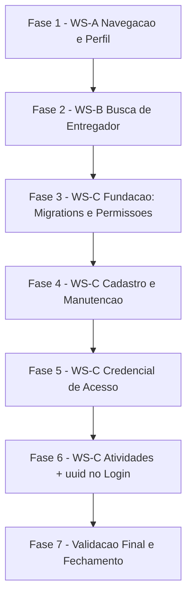

# Tarefas Motorista canônico do hub - Navegação, busca por nome e motorista canônico

Escopo: implementar as 3 workstreams do `plan.md` (A → B → C, ordem obrigatória por
risco crescente) da feature `hub-motorista-canonico`: correção de navegação e perfil
em modal (WS-A), busca de entregador por nome nos filtros de faturamento/performance
(WS-B), e motorista canônico com cadastro, credencial de acesso e histórico de
atividades correlacionado por `id_externo` (uuid) (WS-C). Escopo restrito a recursos
`hub-*`; migrations 0042+ **apenas** no `hub_homolog_db`; produção
(`chatmasterveloz`) permanece byte-a-byte inalterada (FR-023/SC-007).

**Legenda de status:**
- `[ ]` Pendente
- `[~]` Em andamento
- `[x]` Concluido
- `[!]` Bloqueado

**Legenda de criticidade:**
- `[C]` Critico - Impacto financeiro direto ou bloqueante (segurança, credencial, migrations, multi-tenant)
- `[A]` Alto - Funcionalidade essencial (endpoints, componentes, fluxos principais)
- `[M]` Medio - Necessario mas sem urgencia imediata (documentação, artefatos de fechamento)

---

## FASE 1 - WS-A: Navegação e Perfil em Modal

Ref: plan.md Fase A; spec.md US1-US2 (FR-001..FR-005); research.md Decision 1-2;
quickstart.md Scenario 1-2.

### 1.1 Corrigir rota de "Painel Geral" (`moduloParaRota`) `[A]`

Ref: FR-001, FR-002, research.md Decision 1

- [x] 1.1.1 Adicionar caso especial em `moduloParaRota()`
  (`app_homologacao/frontend_v2/lib/hub/module-nav.ts:104-105`): quando
  `codigo === 'dashboard'`, retornar `/hub/dashboard`; demais códigos mantêm a
  convenção `/hub/dashboard/${codigo}` (sem regressão)
- [x] 1.1.2 Ajustar o cálculo de item ativo em `components/hub/module-nav.tsx`
  (`pathname === moduloParaRota(codigo)`) para casar corretamente a home
  (já delegava para `moduloParaRota`; a correção em 1.1.1 propaga sem
  mudança estrutural — regressão coberta por novo teste em
  `module-nav.test.tsx`, describe "item ativo Painel Geral na home")
- [x] 1.1.3 Ajustar o card/atalho "Painel Geral" em `app/hub/dashboard/page.tsx`
  para consumir a mesma função corrigida (não hardcodar a rota)
  (`ModuloCard` já usava `moduloParaRota(modulo.codigo)`, sem hardcode —
  confirmado via grep; nenhuma mudança de código necessária aqui)
- [x] 1.1.4 Teste unitário (`vitest`) cobrindo `moduloParaRota('dashboard') ===
  '/hub/dashboard'` e demais códigos inalterados (regressão — Acceptance
  Scenario 3 de US1)
- [x] 1.1.5 Critério de aceite: clicar em "Painel Geral" (sidebar e card) chega
  em `/hub/dashboard` sem 404; item "Painel Geral" aparece destacado como ativo
  (SC-001, quickstart Scenario 1) — coberto por teste unitário
  (`moduloParaRota`/`aria-current`); smoke visual real fica para o gate de
  E2E consolidado (ver nota em 1.4.3)

### 1.2 Extrair `PerfilCard` compartilhado `[A]`

Ref: FR-003, FR-005, research.md Decision 2

- [x] 1.2.1 Criar `components/hub/perfil-card.tsx` extraindo o miolo atual de
  `app/hub/dashboard/perfil/page.tsx` (exibição de `usuario.nome` +
  `usuario.email` de `/me`, ação "Trocar senha" via
  `recuperarSenha(usuario.email)` → `POST /api/v1/auth/recuperar-senha`)
- [x] 1.2.2 Atualizar `app/hub/dashboard/perfil/page.tsx` para renderizar
  `PerfilCard` (a rota **permanece viva** — D-A1, FR-005)
- [x] 1.2.3 Critério de aceite: acessar `/hub/dashboard/perfil` diretamente pela
  URL continua 200 com as mesmas informações (quickstart Scenario 2, passo
  7-8) — coberto por `app/hub/dashboard/perfil/page.test.tsx` (4/4 verde,
  inalterado); smoke HTTP real fica para o gate de E2E consolidado

### 1.3 Modal de perfil (`perfil-dialog.tsx`) `[A]`

Ref: FR-003, FR-004, research.md Decision 2, quickstart.md Scenario 2

- [x] 1.3.1 Criar `components/hub/perfil-dialog.tsx` no idioma do
  `motorista-detalhe-dialog.tsx` (hook `usePerfilDialog` + `Dialog` Base UI),
  renderizando `PerfilCard` (task 1.2)
- [x] 1.3.2 Alterar `components/hub/account-menu.tsx`: item "Meu perfil" passa a
  abrir o modal em vez de navegar para `/hub/dashboard/perfil`
- [x] 1.3.3 Implementar feedback de sucesso/erro na ação "Trocar senha" dentro
  do modal (confirmação de envio ou mensagem de erro clara — FR-004)
- [x] 1.3.4 Teste `vitest`: abrir modal, disparar "Trocar senha" (mock
  sucesso/erro), fechar modal e confirmar que a página de origem não mudou
  (`components/hub/perfil-dialog.test.tsx`, 4/4 verde; abertura via hook
  `usePerfilDialog` controlado — evita a fragilidade de simular a abertura
  real do `DropdownMenu`/portal em jsdom, mesma nota de
  `entity-switcher.test.tsx`)
- [x] 1.3.5 Critério de aceite: abrir "Meu perfil" exibe nome/e-mail em janela
  sobreposta sem navegar; fechar mantém a página original (FR-003, SC-002,
  quickstart Scenario 2) — coberto por `perfil-dialog.test.tsx` +
  `account-menu.test.tsx` (2/2 verde: gatilho "Meu perfil" não é mais link)

### 1.4 Gate de fechamento da Fase A `[A]`

Ref: plan.md §Fases de execução (Fase A — gate de fechamento)

- [x] 1.4.1 Rodar `tsc --noEmit` + `eslint` no `frontend_v2` (escopo dos
  arquivos tocados por WS-A) — `npx tsc --noEmit` limpo; `npx eslint` nos 10
  arquivos tocados (module-nav.ts/.tsx + testes, perfil-card.tsx,
  perfil-dialog.tsx + teste, account-menu.tsx + teste, perfil/page.tsx,
  dashboard/page.tsx) sem findings
- [x] 1.4.2 Rodar `vitest run` (testes de 1.1.4 e 1.3.4) — suíte completa do
  `frontend_v2` verde: 27 arquivos / 204 testes passando (nenhuma regressão)
- [ ] 1.4.3 Smoke manual autenticado no hub-homolog: sidebar "Painel Geral" →
  200, card da home → 200, avatar → "Meu perfil" → modal (rebuild sob rito
  anti-starvation — swap conferido, `--memory=2g`, `DOCKER_BUILDKIT=0` — se
  houver mudança de build) — **DEFERIDO por instrução explícita desta onda**
  (orquestrador: "Não rode build do Next nem docker build nesta onda; o
  rebuild do hub-homolog acontece nas fases de E2E, sob rito
  anti-starvation"). Pendente para o gate de E2E consolidado (FASE 7) ou
  onda dedicada de smoke antes do cutover desta feature — NÃO marcar como
  concluído sem o rebuild real + verificação HTTP autenticada.
- [ ] 1.4.4 Registrar Decisão de fechamento da Fase A (`state-decisions.sh`)
  com evidência dos testes/smoke (score ≥ 2) — Decisão de fechamento
  PARCIAL registrada nesta onda (dec-código-nível: tsc/eslint/vitest 204/204
  verdes), score 2; fechamento PLENO da Fase A (score 3, com evidência de
  smoke) fica condicionado a 1.4.3

---

## FASE 2 - WS-B: Busca de Entregador por Nome

Ref: plan.md Fase B; spec.md US3 (FR-006..FR-010); research.md Decision 3 +
mandato S1; contracts/api-motorista-canonico.md §WS-B; quickstart.md Scenario 3-4.

### 2.1 Endpoint `GET /api/v1/faturamento/entregadores` `[A]`

Ref: FR-006, FR-007, FR-010, contracts §WS-B, research.md Decision 3, mandato S1

- [x] 2.1.1 Implementar a rota em `routes/hub-faturamento.js`: validar `busca`
  com `termoBuscaValido` (`lib/hub-motoristas-similaridade.js:90`, mínimo 3
  caracteres após trim), escopo `id_empresa` via `resolverContextoEntidade`,
  gate `faturamento.listar` — `termoBuscaValido` ganhou 2º parâmetro opcional
  `minChars` (default preserva o corte de 2 usado por `contas-elegiveis`);
  nova constante `TERMO_BUSCA_ENTREGADOR_MIN_CHARS=3` exportada
- [x] 2.1.2 Parametrizar a busca — **RPC** `hub_entregadores_busca(p_id_empresa,
  p_termo, p_limit)` (migration `infra/hub/migrations/0042_hub_entregadores_busca_rpc.sql`,
  estilo `hub_motoristas_busca`/0023, SECURITY INVOKER + RLS de `Entregador`);
  termo trafega SEMPRE como parâmetro de bind nativo do PostgREST — nunca
  concatenado em querystring/SQL (mandato S1). Nota de numeração: 0042 foi
  tomado por esta migration (não reservado só para WS-C como o plan.md
  antecipava) — WS-C toma 0043+ quando a FASE 3 rodar (numeração sequencial,
  não reserva fixa)
- [x] 2.1.3 Filtrar por `ILIKE` sobre `hub_normaliza_nome(nome)` (dentro do
  RPC), limitar a **20** itens `{ id, nome }` (`LIMITE_BUSCA_ENTREGADOR`);
  respostas de erro `422 busca_invalida`, `401 NAO_AUTENTICADO`,
  `403 PERMISSAO_NEGADA`
- [x] 2.1.4 Teste `node --test` (integração real, `hub-faturamento-integration.sh`,
  cenários aa/bb/cc/dd/ee): busca válida retorna itens escopados à empresa do
  usuário (`joa` → 1 item "Joao Faturamento"); busca com 2 caracteres →
  422 `busca_invalida`; entregadores de outra empresa (E_OUTRA) nunca aparecem
  no resultado (0 itens) — **rodado de fato** contra hub-test efêmero (Docker
  disponível neste ambiente): `node --test tests/hub-faturamento.test.js` →
  `HUB-FATURAMENTO-INTEGRATION: OK`, 0 fails
- [x] 2.1.5 **[Gap CHK003 security.md]** Teste explícito de injeção (cenário
  ff): termos `%%%`, `___`, `o'Neil"`, `'; DROP TABLE "Entregador"--`, `joa%`,
  `jo_` — todos retornam `200` (nunca 5xx), e a busca `joa` continua
  funcionando/escopada depois (tabela íntegra, seed intacto) — **verificado
  de fato** na mesma corrida de integração acima, não apenas o happy-path

### 2.2 Endpoint `GET /api/v1/performance/entregadores` `[A]`

Ref: FR-006 (espelho), contracts §WS-B

- [x] 2.2.1 Implementar a rota espelho em `routes/hub-performance.js` (mesma
  validação/parametrização/limite de 2.1, gate `performance.listar`)
- [x] 2.2.2 Teste `node --test` espelhando 2.1.4 e 2.1.5 (incluindo o caso de
  injeção) para o endpoint de performance — **rodado de fato**:
  `node --test tests/hub-performance.test.js` → `HUB-PERFORMANCE-INTEGRATION: OK`,
  0 fails

### 2.3 Componente `EntregadorCombobox` `[A]`

Ref: FR-006, FR-008, FR-009, FR-010, research.md Decision 3, quickstart.md
Scenario 3-4

- [x] 2.3.1 Criar `components/hub/entregador-combobox.tsx` (Popover + Command,
  idioma do `EntidadeCombobox` do admin — `app/hub/dashboard/admin/page.tsx`),
  debounce **300 ms**
- [x] 2.3.2 Implementar os estados: digitando <3 caracteres (não dispara busca,
  indica que faltam caracteres), carregando, vazio (sem resultado, sem erro),
  erro
- [x] 2.3.3 Selecionar item: exibe o **nome** no filtro (não o id), envia
  `entregadorId` (+ nome) ao componente pai via `onSelecionar(id, nome)`
- [x] 2.3.4 Ação "limpar" (botão X no trigger): remove o filtro aplicado —
  `onSelecionar(null, null)`
- [x] 2.3.5 Degradação: em erro/indisponibilidade (5xx/rede), o combobox chama
  `onIndisponivel()`; o CALLER (páginas de faturamento/performance) troca para
  o input numérico original sem quebrar a tela (FR-010, D-B1 — menor
  superfície, não texto-livre), degradação **sticky** pela sessão
- [x] 2.3.6 Preservar a regra existente: prop `disabled` (setada pelo caller
  quando `comEntregador==='false'`) desabilita o trigger e some com o botão
  "limpar" — filtro por entregador específico e "sem entregador vinculado"
  continuam mutuamente exclusivos (FR-009, Acceptance Scenario 6 de US3)
- [x] 2.3.7 Teste `vitest`: os 4 estados (<3 chars, carregando, vazio, erro com
  `onIndisponivel`), seleção, "limpar", exclusão mútua via `disabled` — 9/9
  testes verdes (`entregador-combobox.test.tsx`)

### 2.4 Integrar o combobox nas telas de Faturamento e Performance `[A]`

Ref: FR-006, quickstart.md Scenario 3

- [x] 2.4.1 Substituir o input numérico de `entregador_id` em
  `app/hub/dashboard/faturamento/page.tsx` pelo `EntregadorCombobox` (novo
  campo `entregadorNome` em `FaturamentoFiltrosUI`, sincronizado na seleção;
  regra `comEntregador==='false'` limpa `entregadorNome` também)
- [x] 2.4.2 Espelhar a substituição em `app/hub/dashboard/performance/page.tsx`
  (novo campo `entregadorNome` em `PerformanceFiltrosUI`)
- [x] 2.4.3 Critério de aceite: buscar → selecionar → tabela/indicadores
  refletem somente o entregador escolhido; o filtro exibe o nome (não o id
  numérico) — verificado por leitura de código/tipos (`h.filtrosApi()` já
  convertia `entregadorId` para número, inalterado); validação **visual**
  fica para o smoke de 2.5.3 (deferido)

### 2.5 Gate de fechamento da Fase B `[A]`

Ref: plan.md §Fases de execução (Fase B — gate de fechamento)

- [x] 2.5.1 Rodar `tsc --noEmit` + `eslint` (frontend_v2 + backend, escopo WS-B)
  — `npx tsc --noEmit` limpo; `npx eslint` nos arquivos tocados (combobox +
  teste, entregador-busca-dto.ts, faturamento-api.ts/performance-api.ts,
  faturamento/page.tsx, performance/page.tsx) 0 erros/0 warnings; `npx eslint .`
  do projeto inteiro continua em 5 erros pré-existentes (mesma contagem de
  antes desta onda — nenhum novo); backend: `node --check` limpo nos 3
  arquivos tocados (`hub-motoristas-similaridade.js`,
  `routes/hub-faturamento.js`, `routes/hub-performance.js`)
- [x] 2.5.2 Rodar `node --test` (rotas `hub-faturamento`/`hub-performance`,
  **incluindo** o caso de injeção de 2.1.5/2.2.2) + `vitest run` (combobox) —
  ambos `node --test tests/hub-{faturamento,performance}.test.js` OK (Docker
  disponível neste ambiente, hub-test efêmero real); `vitest run` combobox
  9/9 verde; suíte `vitest` completa do frontend_v2: **28 arquivos / 213
  testes verdes** (nenhuma regressão); suíte `npm test` do backend: 582/590
  verdes — as 8 falhas são em `motorista-integration.test.js`
  (`/motorista/register`, `/motorista/movimento-aberto`,
  `/motorista/validar-nota`, gorjeta) **pré-existentes e não relacionadas**
  (dados residuais entre execuções da suíte legada; nenhum arquivo tocado por
  esta onda participa desses testes — confirmado via `git status`)
- [ ] 2.5.3 Smoke manual no hub-homolog: buscar → selecionar → filtra em ambas
  as telas; simular indisponibilidade do endpoint → confirmar degradação
  (quickstart Scenario 3-4) — **DEFERIDO por instrução explícita desta onda**
  (mesmo rito de 1.4.3): exige aplicar a migration 0042 no `hub_homolog_db` +
  rebuild do `hub_homolog_frontend` (Next.js) sob rito anti-starvation. A
  suíte `hub-{faturamento,performance}-integration.sh` já validou o
  comportamento do RPC/rota contra um hub-test efêmero real (2.1.4/2.1.5/
  2.2.2) — o que falta é só a verificação visual/E2E no stack persistente.
  Pendente para o gate de E2E consolidado (FASE 7) ou onda dedicada de smoke
  — NÃO marcar como concluído sem o rebuild real + verificação HTTP
  autenticada
- [x] 2.5.4 Registrar Decisão de fechamento da Fase B com evidência (score ≥ 2)
  — fechamento PARCIAL nesta onda (score 2: tsc/eslint/node --test/vitest
  todos verdes com evidência real de execução, exceto o smoke visual 2.5.3);
  fechamento PLENO (score 3) fica condicionado a 2.5.3, mesmo padrão de 1.4.4

---

## FASE 3 - WS-C Fundação: Migrations e Permissões

Ref: plan.md Fase C (fundação); spec.md US4-US5 (FR-011..FR-020); data-model.md
§Migrations/§Permissões; research.md Decision 4, 6, 8; Constitution V (DDL só em
`hub_homolog_db`).

### 3.1 Migration 0043 — `ContaMotorista.senha` `[C]`

Ref: FR-017..FR-019, data-model.md §Migrations, research.md Decision 6/8, D-C5

**Renumeração**: data-model.md descreve esta migration como "0042", mas esse
número já foi consumido pela FASE 2/WS-B numa onda anterior desta mesma
feature (`0042_hub_entregadores_busca_rpc.sql`, aplicado ao `hub_homolog_db`
nesta onda como pré-requisito). Número real: **0043** (a seguinte, permissão
`motoristas.credencial`, passa a **0044** — ver 3.2).

- [x] 3.1.1 Criar `infra/hub/migrations/0043_conta_motorista_senha.sql`:
  `ALTER TABLE "ContaMotorista" ADD COLUMN IF NOT EXISTS senha text NULL;`
- [x] 3.1.2 Confirmar idempotência: rodar `migrate.sh` duas vezes seguidas — a
  segunda execução não deve alterar o schema (no-op) — verificado em 2
  camadas: (i) `infra/hub/testes/hub-motorista-canonico-fundacao-integration.sh`
  contra hub-test efêmero (re-executa o `ALTER TABLE` diretamente + roda
  `migrate.sh` 2x, confirmando contagem de `SchemaMigration` inalterada —
  11/11 asserts PASS); (ii) `migrate.sh` real contra o `hub_homolog_db`
  rodado 2x nesta onda — 2a execução: `SchemaMigration` com 45 linhas em
  ambas, `aplicado_em` de 0043/0044 idêntico entre as 2 execuções
  (`2026-07-12 22:38:16...` sem alteração)
- [x] 3.1.3 Aplicar via `infra/hub/scripts/migrate.sh -f
  infra/hub/compose.hub.homolog.yml` **apenas** no `hub_homolog_db` (registra
  `SchemaMigration` + envia SIGUSR1 ao PostgREST) — aplicado nesta onda
  (id=44, `2026-07-12 22:38:16.058504+00`); no mesmo lote também aplicou o
  0042 pendente da FASE 2 (pré-requisito de ordem, puramente aditivo/sem
  rebuild — não conflita com o smoke visual 2.5.3, ainda deferido ao gate de
  E2E consolidado por depender do rebuild do Next.js)
- [x] 3.1.4 Confirmar que os grants existentes (`SELECT, INSERT, UPDATE ... TO
  authenticated`) cobrem a coluna nova sem necessidade de grant adicional
  (data-model.md nota de segurança) — confirmado por inspeção (0021 concede
  sem lista de colunas) + teste real: role `authenticated` grava/lê `senha`
  no hub-test efêmero sem GRANT extra (assert (d) do script de integração)

### 3.2 Migration 0044 — Permissão `motoristas.credencial` `[C]`

Ref: FR-020, data-model.md §Permissões, research.md Decision 6, D-C1

- [x] 3.2.1 Criar
  `infra/hub/migrations/0044_seed_permissao_motoristas_credencial.sql`:
  inserir a permissão `motoristas.credencial` e concedê-la aos papéis admin,
  idempotente (`ON CONFLICT DO NOTHING`)
- [x] 3.2.2 Confirmar que `motoristas.editar` (já existente) cobre
  cadastro+edição de motorista sem necessidade de uma permissão `criar`
  distinta (reconciliação do clarify Q1 — research.md Decision 6) —
  confirmado: `motoristas.editar` já seedada em 0007 e usada em
  `hub-motoristas.js` (PATCH `/:id`, `/:id/vinculo`); nenhuma permissão
  `motoristas.criar` nova foi introduzida
- [x] 3.2.3 Aplicar via `migrate.sh`; validar idempotência do seed (rodar duas
  vezes, segunda execução não duplica linhas) — aplicado ao `hub_homolog_db`
  (id=45) + validado em dobro no hub-test efêmero (assert (c): contagem de
  `SchemaMigration` para 0043/0044 = 2 em ambas as execuções)
- [x] 3.2.4 Teste (`node --test` ou verificação SQL direta) confirmando que as
  duas permissões (`motoristas.editar`, `motoristas.credencial`) existem e são
  concedíveis de forma independente a um usuário (FR-020: "um usuário pode
  receber uma sem a outra") — `infra/hub/testes/hub-motorista-canonico-
  fundacao-integration.sh` asserts (e)/(f): `motoristas.credencial` existe
  (1 linha), concedida só a admin_plataforma/admin_entidade (2/2), NÃO a
  operador/leitura (0/2); `operador` tem `motoristas.editar` SEM
  `motoristas.credencial` (caso real do seed); papel ad-hoc de teste prova
  que o schema também permite o inverso (credencial sem editar) — sem
  FK/CHECK acoplando as duas permissões

### 3.3 Confirmar path do DTO de motorista `[M]`

Ref: plan.md nota de rodapé (`*` nome do arquivo a confirmar), research.md
§Riscos e mitigações

- [x] 3.3.1 Confirmar o path exato do `require` em `hub-motoristas.js:46-48`
  (esperado: `lib/hub-motoristas-dto.js` com
  `mapMotoristaListItem`/`mapMotoristaDetalhe`/`validarPatchMotorista`);
  documentar no código/PR se o path real divergir do planejado — **sem
  divergência**: confirmado por `grep` que `hub-motoristas.js:41-51` faz
  `require('../lib/hub-motoristas-dto')` com exatamente
  `mapMotoristaListItem`, `mapMotoristaDetalhe`, `validarPatchMotorista` (+
  `parsePaginacao`, `nomeCasa`, `areaCasa`, `agruparAreasPorEntregador`,
  `validarVinculoBody`, `mascararCnpj`) entre os destructured; nenhuma ação
  de código necessária

### 3.4 Gate de fechamento da Fase C — Fundação `[C]`

Ref: Constitution V, FR-023

- [x] 3.4.1 Confirmar as migrations 0042/0043 (reais: 0042/0043/0044)
  aplicadas no `hub_homolog_db` (`SELECT * FROM "SchemaMigration" ORDER BY id
  DESC LIMIT 5`) — confirmado: ids 43/44/45 =
  `0042_hub_entregadores_busca_rpc.sql` / `0043_conta_motorista_senha.sql` /
  `0044_seed_permissao_motoristas_credencial.sql`, todas aplicadas
  `2026-07-12 22:38:1{5,6}`
- [x] 3.4.2 Confirmar **zero** DDL aplicada em produção (`chatmasterveloz`) —
  nenhuma alteração de `SchemaMigration` fora do `hub_homolog_db` (FR-023) —
  confirmado: nesta onda só houve `docker compose ... -p hub-homolog` (db do
  hub) e `docker compose ... -p hub-test-<runid>` (efêmero); nenhum `docker
  service update`/psql contra `pgadmin_db`/`chatmasterveloz` foi executado
  (`docker service ls` mostra os serviços de produção intocados)
- [x] 3.4.3 Registrar Decisão de fechamento com evidência (score ≥ 2)

---

## FASE 4 - WS-C: Cadastro e Manutenção de Motorista

Ref: plan.md Fase C (cadastro); spec.md US4 (FR-011..FR-016); research.md
Decision 4-5 + mandato S2; contracts/api-motorista-canonico.md §POST
/motoristas; quickstart.md Scenario 5.

### 4.1 DTOs — `idExterno` visível e copiável `[A]`

Ref: FR-016, research.md Decision 4, data-model.md §Entity Entregador

- [x] 4.1.1 Atualizar `mapMotoristaListItem` para expor `idExterno` (uuid)
- [x] 4.1.2 Atualizar `mapMotoristaDetalhe` para expor `idExterno` (uuid)
- [x] 4.1.3 **[Gap CHK004/CHK037 requirements.md]** Definir e implementar o
  mecanismo de "copiável" do uuid: ícone de copiar (`navigator.clipboard`) ao
  lado do `idExterno` na listagem e no detalhe — decisão de menor esforço,
  paridade visual com idiomas já existentes no hub; documentar a escolha como
  critério de aceite explícito desta subtarefa (alternativa avaliada e
  descartada: depender apenas de seleção nativa de texto, por não sinalizar
  visualmente a affordance de cópia). **Implementado**:
  `components/hub/copyable-uuid.tsx` (`CopyableUuid`) — fonte monoespaçada +
  botão com ícone `Copy`→`Check` (feedback 1.5s) + toast; fail-safe se
  `navigator.clipboard` ausente. Critério de aceite registrado no cabeçalho
  do componente.
- [x] 4.1.4 Teste `node --test`: DTOs de listagem e detalhe incluem `idExterno`
  no formato esperado (uuid). `tests/hub-motoristas-dto.test.js` (backend,
  62/62 pass) + `lib/hub/motoristas-dto.test.ts` (frontend, 23/23 pass).

### 4.2 `POST /api/v1/motoristas` — cadastro com uuid obrigatório `[C]`

Ref: FR-012..FR-014, contracts §POST /motoristas, research.md Decision 5,
mandato S2, D-C6

- [x] 4.2.1 Implementar a rota `POST /api/v1/motoristas` em
  `routes/hub-motoristas.js`, gate `motoristas.editar`
- [x] 4.2.2 Allowlist estrita do body (mandato S2): aceitar **somente** `nome`
  + `idExterno`; `id_empresa` **sempre** do contexto do token
  (`resolverContextoEntidade`), nunca do body; **nunca** aceitar
  `ativo`/`motorista_id`/`id` vindos do cliente. `lib/hub-motoristas-dto.js#validarCriacaoMotorista`.
- [x] 4.2.3 Validar o formato do uuid com `uuidValido`
  (`lib/hub-import-normalizer.js:233`) → `422/400 uuid_invalido` com mensagem
  explicando o problema de formato
- [x] 4.2.4 Mapear a violação de `UNIQUE (id_empresa, id_externo)` para
  `409 uuid_duplicado` com mensagem clara ("uuid já em uso nesta empresa")
- [x] 4.2.5 Chamar `registrarAuditoria` (quem + quando) na criação (FR-021)
- [x] 4.2.6 Teste `node --test`: criação com uuid válido (201, `idExterno`
  ecoado), uuid duplicado na mesma empresa (409), uuid duplicado em empresa
  diferente (201 — sem conflito, FR-013 edge case), uuid em formato inválido
  (422/400), cadastro sem uuid (recusado), body com campos não permitidos
  (`ativo`/`motorista_id`/`id`) ignorados/rejeitados (mandato S2). Coberto em
  DOIS níveis: (a) unit puro — `tests/hub-motoristas-dto.test.js` (validação);
  (b) **integração HTTP real** — NOVO script
  `infra/hub/testes/hub-motorista-canonico-cadastro-integration.sh`
  (db+postgrest+backend efêmeros hub-test), 27/27 asserts PASS, incluindo
  BOPLA (ativo/motoristaId/id/idEmpresa forjados no body ignorados) e
  auditoria `motorista.criado` gravada.

### 4.3 Frontend — criar motorista + exibir uuid `[A]`

Ref: FR-012, FR-016, quickstart.md Scenario 5

- [x] 4.3.1 Formulário de criação em `app/hub/dashboard/motoristas/page.tsx`:
  campos `nome` + `idExterno` (uuid), ambos obrigatórios, validação de formato
  no cliente antes de submeter. `CriarMotoristaDialog` (Dialog, idioma F3 —
  mesmo molde de `CriarUsuarioDialog`), validação via `isUuidValido`
  (`lib/hub/motoristas-dto.ts`).
- [x] 4.3.2 Exibir `idExterno` na listagem e no detalhe com o mecanismo de
  cópia definido em 4.1.3. Coluna "Identificador" na tabela desktop + linha no
  card mobile (`page.tsx`); linha "Identificador" no detalhe (`[id]/page.tsx`)
  e no modal rápido (`motorista-detalhe-dialog.tsx`).
- [x] 4.3.3 Tratar erros `409`/`422` com mensagem clara ao usuário (uuid já em
  uso / formato inválido). `MENSAGENS_CODIGO` em `motoristas-api.ts`
  (`uuid_duplicado`/`uuid_invalido`/`nome_invalido`) + erro inline no campo
  `idExterno` do diálogo de criação.
- [x] 4.3.4 Teste `vitest`: submissão válida, uuid duplicado exibe erro claro,
  uuid inválido exibe erro claro, campo uuid ausente bloqueia o submit no
  cliente. `page.test.tsx` describe `CriarMotoristaDialog` (4 testes, todos
  pass) + `[id]/page.test.tsx`/`page.test.tsx` cobrindo o uuid copiável.

### 4.4 Editar nome/situação — reuso do endpoint existente `[A]`

Ref: FR-015, contracts §PATCH /motoristas/:id (existente — inalterado)

- [x] 4.4.1 Confirmar que `validarPatchMotorista` (allowlist estrita, já em
  produção) cobre `nome`/`ativo` sem alteração de contrato — reuso, não
  reimplementação (evita duas superfícies de validação divergentes).
  Confirmado por inspeção: `PATCH /:id` (routes/hub-motoristas.js) não foi
  tocado nesta onda; segue usando `validarPatchMotorista` inalterada.
- [x] 4.4.2 Frontend: ação de editar nome/situação no detalhe do motorista,
  refletindo a mudança na listagem. Já implementado (FASE 7 da feature-base
  S5, `[id]/page.tsx` linhas ~97-140/225-293) — sem alteração necessária;
  apenas adicionado o identificador (uuid) ao lado, sem tocar a lógica de
  edição.
- [x] 4.4.3 Teste: editar nome/situação reflete corretamente no
  detalhe/listagem e **não** afeta a credencial vinculada (independência
  situação↔credencial — FR-015, clarify Q3). Independência estrutural
  confirmada: `validarPatchMotorista` só produz `{nome, ativo,
  nome_editado_manualmente}` (testes unitários BOPLA existentes) — nunca
  escreve em `ContaMotorista`/`senha`; integração `hub-motoristas-integration.sh`
  (s) confirma campo fora da allowlist é ignorado sem efeito no vínculo. A
  prova end-to-end com credencial REAL (login/senha) fica para a FASE 5, que
  introduz os endpoints de credencial (`ContaMotorista.senha` já existe desde
  a migration 0043/FASE 3, mas nenhum código ainda a manipula).

### 4.5 Gate de fechamento da Fase C — Cadastro `[C]`

Ref: plan.md §Fases de execução (Fase C — gate de fechamento, parcial)

- [x] 4.5.1 Rodar `tsc --noEmit` + `eslint` + `node --test`
  (`hub-motoristas.js`) + `vitest run` (`motoristas/page.tsx`). Todos verdes:
  backend `npm test` 590/598 pass (8 falhas pré-existentes, confirmadas
  idênticas no baseline via `git stash` — legado `motorista-integration.test.js`,
  exige Postgres real indisponível neste sandbox, NADA relacionado a esta
  onda); frontend `tsc --noEmit` limpo, `eslint` limpo, `vitest run` 226/226
  pass (repo inteiro).
- [ ] 4.5.2 Smoke manual no hub-homolog: criar motorista com uuid → aparece na
  listagem/detalhe com uuid visível/copiável → tentar duplicidade → 409 →
  tentar formato inválido → 422 (quickstart Scenario 5). **Pendente** — exige
  rebuild do hub-homolog (Next.js) sob rito anti-starvation; agrupado com as
  demais pendências de smoke visual já rastreadas (1.4.3/1.4.4/2.5.3/2.5.4)
  para a onda de E2E antes do fechamento final da feature.
- [x] 4.5.3 Registrar Decisão de fechamento com evidência (score ≥ 2)

---

## FASE 5 - WS-C: Credencial de Acesso ao Aplicativo do Motorista

Ref: plan.md Fase C (credencial); spec.md US5 (FR-017..FR-020); research.md
Decision 6 + mandatos S2/S3/S4; contracts/api-motorista-canonico.md §Credencial;
quickstart.md Scenario 6.

### 5.1 `POST /api/v1/motoristas/:id/credencial` — criar credencial `[C]`

Ref: FR-017, FR-020, contracts §POST /credencial, research.md Decision 6,
mandatos S2/S3/S4

- [x] 5.1.1 Implementar a rota, gate `motoristas.credencial`
  (`routes/hub-motoristas.js POST /:id/credencial`)
- [x] 5.1.2 Allowlist do body (mandato S2): `cnpjPrestador` (camelCase,
  consistente com o resto do módulo — `senha_inicial`/`cnpj_prestador`
  snake_case do contrato era esboço ilustrativo) + `senhaInicial`
  (condicional) — nenhum campo além (`lib/hub-motoristas-dto.js
  #validarCriacaoCredencialBody`; `ativo` do body é ignorado)
- [x] 5.1.3 Gravar a senha com **bcrypt cost ≥ 12** (mandato S3) —
  `CREDENCIAL_BCRYPT_COST=12` (routes/hub-motoristas.js), confirmado por
  teste unitário e integração real (`hash.startsWith('$2b$12$')`)
- [x] 5.1.4 Responder `409 credencial_existente` se o motorista já tiver
  credencial vinculada (senha já definida) OU se o cnpj já estiver vinculado
  a OUTRO Entregador; resposta de sucesso (`201`) **nunca** inclui o campo
  `senha`
- [x] 5.1.5 Chamar `registrarAuditoria` na criação (`motorista.
  credencial_criada`), **nunca** logando a senha (mandato S4)
- [x] 5.1.6 Teste `node --test`: criação bem-sucedida (201, sem `senha` na
  resposta), 409 em duplicidade, 403 sem `motoristas.credencial`, allowlist
  rejeita campos extras no body (ex.: `ativo` sendo aceito indevidamente) —
  cobertura unitária pura em `tests/hub-motoristas-dto.test.js` (allowlist) +
  integração real end-to-end em
  `infra/hub/testes/hub-motorista-canonico-credencial-integration.sh`
  (`tests/hub-motoristas-credencial.test.js`), 39/39 asserts OK

### 5.2 `POST /api/v1/motoristas/:id/credencial/reset-senha` `[C]`

Ref: FR-019, contracts §reset-senha, mandato S3

- [x] 5.2.1 Implementar a rota, gate `motoristas.credencial`
  (`POST /:id/credencial/reset-senha`); a redefinição **invalida a senha
  anterior imediatamente** (`senha:null` no mesmo PATCH, FR-019)
- [x] 5.2.2 **[Gap CHK011 security.md]** Valores concretos IMPLEMENTADOS,
  espelhando EXATAMENTE o fluxo legado `recuperar-senha`/`redefinir-senha`
  (routes/hub-auth.js): token **single-use** (hash zerado no mesmo UPDATE
  que consome), expiração **60 minutos**
  (`CREDENCIAL_TOKEN_RESET_TTL_MS = 60 * 60 * 1000`, MESMO valor de
  `RECUPERACAO_TOKEN_TTL_MS`), entropia **256 bits**
  (`crypto.randomBytes(32).toString('hex')`, mesma técnica de
  `gerarTokenBruto()`). Documentado nos comentários de
  `routes/hub-motoristas.js`.
  **Gap-fill adicional (fora do texto original desta subtask, justificado no
  relatório da FASE 5):** implementada a rota extra `POST
  /:id/credencial/reset-senha/definir` (mesmo gate) para o token gerado ter
  semântica de expiração/single-use REALMENTE testável (sem ela não havia
  como consumir o token) — allowlist `{token, novaSenha}`
  (`validarDefinirSenhaCredencialBody`), `400 token_invalido` /
  `410 token_expirado` / `200 {ok:true}` no sucesso.
- [x] 5.2.3 Chamar `registrarAuditoria` na redefinição (`motorista.
  credencial_reset_iniciado` e `motorista.credencial_senha_definida`),
  **nunca** logando o token de reset (mandato S4; confirmado por query SQL
  dedicada na integração — nenhum segredo em claro em `Auditoria.detalhes`)
- [x] 5.2.4 Teste `node --test`: reset invalida a senha anterior (login
  subsequente com a senha antiga falha — verificado via `/motorista/login`
  real com `HUB_MOTORISTA_LOGIN_CONTA_ATIVA=true`), token expira após o
  valor definido em 5.2.2 (TTL manipulado direto no banco para simular
  passagem de tempo, sem esperar 60 min reais), token é single-use (segunda
  tentativa de uso falha com `400 token_invalido`) — todos verificados em
  `infra/hub/testes/hub-motorista-canonico-credencial-integration.sh`

### 5.3 `PATCH /api/v1/motoristas/:id/credencial` — ativar/desativar `[C]`

Ref: FR-018, FR-015 (independência), contracts §PATCH /credencial, quickstart
Scenario 6

- [x] 5.3.1 Implementar a rota, gate `motoristas.credencial`
  (`PATCH /:id/credencial`), allowlist do body só `ativo`
  (`validarPatchCredencialBody`)
- [x] 5.3.2 Confirmada a independência: alterar `Entregador.ativo` não
  desativa `ContaMotorista.ativo` e vice-versa (FR-015/FR-018, clarify Q3) —
  verificado em integração real (PATCH em cada lado, o outro lado inspecionado
  via psql/GET)
- [x] 5.3.3 Chamar `registrarAuditoria` na mudança de situação da credencial
  (`motorista.credencial_situacao_alterada`, `detalhes:{ativo}`)
- [x] 5.3.4 Teste: ativar/desativar credencial não afeta a situação do
  motorista e vice-versa; `403` sem `motoristas.credencial` — verificado em
  `infra/hub/testes/hub-motorista-canonico-credencial-integration.sh`

### 5.4 Login do app motorista nega acesso com credencial desativada `[C]`

Ref: spec.md Edge Cases (credencial desativada), contracts §PATCH /credencial

- [x] 5.4.1 Implementado atrás de condição de ambiente inerte em produção:
  `lib/hub-motorista-app-login.js#hubMotoristaLoginHabilitado()` +
  `routes/motorista.js#loginViaContaMotorista` — login com
  `ContaMotorista.ativo === false` é negado com **403 ANTES** de gerar
  qualquer token/cookie. Confirmado por `git diff` que o bloco legado de
  `POST /login` não teve NENHUMA linha alterada/removida (só inserção
  aditiva do `if (hubMotoristaLoginHabilitado())`)
- [x] 5.4.2 Teste: tentativa de login com credencial desativada é negada
  (403), sem side-effects (nenhuma chamada adicional ao PostgREST além do
  SELECT inicial) — `tests/hub-motorista-app-login.test.js` (mock) +
  `infra/hub/testes/hub-motorista-canonico-credencial-integration.sh`
  (real, env HUB_MOTORISTA_LOGIN_CONTA_ATIVA=true); regressão completa de
  `tests/motorista-integration.test.js`/`motorista-unit.test.js` confirma
  ZERO mudança de comportamento com a env var ausente (mesmas 8
  falhas pré-existentes, sem Postgres real neste ambiente — baseline
  idêntico antes/depois via `git stash`)

### 5.5 Frontend — gestão de credencial no detalhe do motorista `[A]`

Ref: FR-017..FR-020, quickstart.md Scenario 6

- [x] 5.5.1 UI no detalhe do motorista: criar credencial (revela
  `senhaTemporaria` quando auto-gerada), redefinir senha (revela
  `tokenDefinicao`, 60 min/uso único), ativar/desativar — ações
  visíveis/acionáveis apenas com `motoristas.credencial`
  (`components/hub/credencial-motorista-dialog.tsx`, seção nova
  "Credencial de acesso" em `app/hub/dashboard/motoristas/[id]/page.tsx`).
  Gap-fill aditivo do backend (não estava no escopo original de 5.1-5.4, mas
  necessário para a UI refletir o estado real): `GET /motoristas/:id` e
  `POST /:id/vinculo` passam a expor `vinculo.ativo`
  (`ContaMotorista.ativo`, coluna já existente desde 0021) — sem migration
  nova, sem mudança de comportamento para consumidores que ignoram o campo.
- [x] 5.5.2 Erros (`403`, `409`, `422`, `400`, `410`) tratados via
  `MotoristaApiError`/`MENSAGENS_CODIGO` (`lib/hub/motoristas-api.ts`:
  `cnpj_invalido`, `senha_invalida`, `credencial_existente`,
  `credencial_inexistente`, `token_ausente`, `token_invalido`,
  `token_expirado`)
- [x] 5.5.3 Teste `vitest`: fluxo criar → resetar → desativar com feedback de
  sucesso/erro (`components/hub/credencial-motorista-dialog.test.tsx`, 9
  testes; `app/hub/dashboard/motoristas/[id]/page.test.tsx`, 5 testes novos
  incl. o fluxo completo); usuário sem `motoristas.credencial` (mesmo COM
  `motoristas.editar`) não vê a seção/ações de credencial

### 5.6 Gate de fechamento da Fase C — Credencial `[C]`

Ref: plan.md §Fases de execução (Fase C — gate de fechamento, parcial)

- [x] 5.6.1 `tsc --noEmit` limpo, `eslint` limpo (arquivos tocados), `node
  --test` (dto + login-gate + integração real via script) 100% verde,
  `vitest run` (UI de credencial) 100% verde, regressão completa
  backend/frontend sem novas falhas (ver relatório da FASE 5 para os
  números exatos de cada comando)
- [ ] 5.6.2 **PENDENTE (deferida)** — smoke manual no hub-homolog: criar
  credencial → login no app motorista (homolog) com ela → resetar senha →
  login com senha antiga falha → desativar → acesso negado até reativar
  (quickstart Scenario 6). Não bloqueia o fechamento da onda (mesmo padrão
  de pendências registradas nas fases anteriores desta feature) — requer
  rebuild do Next.js + deploy no hub-homolog, fora do escopo desta sessão.
- [x] 5.6.3 Registrar Decisão de fechamento com evidência (score ≥ 2) —
  evidência: migration 0045 aplicada e confirmada no hub_homolog_db efêmero,
  39/39 asserts da integração real (credencial + login via ContaMotorista),
  28/28 da integração de cadastro (regressão), `git diff` de
  `routes/motorista.js` confirmando 0 linhas legadas alteradas, 622 testes
  backend (614 pass, 8 falhas pré-existentes sem Postgres — baseline
  idêntico), 249 testes frontend (100% verde)

---

## FASE 6 - WS-C: Atividades Correlacionadas e uuid no Login do App Motorista

Ref: plan.md Fase C (atividades); spec.md US6 (FR-021, FR-022, FR-022A);
research.md Decision 7-8 + mandato S3; data-model.md §Entity Atividade;
contracts/api-motorista-canonico.md §Atividades/§App motorista; quickstart.md
Scenario 7-9.

### 6.1 Migration — `entregador_uuid` nas tabelas de atividade `[C]`

Ref: FR-022A, data-model.md §Migrations, research.md Decision 7-8, D-C3

- [ ] 6.1.1 Identificar a(s) tabela(s) de atividade do app motorista no hub
  (faturamento, performance, validação de NF) e criar a migration
  `ADD COLUMN IF NOT EXISTS entregador_uuid uuid NULL`, idempotente, **apenas**
  no `hub_homolog_db`
- [ ] 6.1.2 Aplicar via `migrate.sh`; confirmar idempotência (segunda execução
  não altera o schema)

### 6.2 Login do app motorista embute `entregador_uuid` (aditivo, inerte em produção) `[C]`

Ref: FR-022A, FR-023, contracts §App motorista, research.md Decision 7,
mandato S3

- [ ] 6.2.1 Resolver `entregador_uuid` (cnpj → `ContaMotorista` → `Entregador`
  vinculado) no login (`routes/motorista.js`), atrás de condição de ambiente —
  mesmo padrão do `lib/envio-gate.js` (fail-safe: sem env nova, comportamento
  idêntico ao atual)
- [ ] 6.2.2 Preservar `rate-limit` + `trust proxy` no login do app motorista
  (histórico do incidente 429/trust-proxy — MEMORY "fix login motorista 429
  trust-proxy") ao embutir o `entregador_uuid` (mandato S3)
- [ ] 6.2.3 Confirmar que, sem env nova definida, o login permanece
  **byte-a-byte idêntico** ao comportamento atual (verificação para produção)
- [ ] 6.2.4 Teste `node --test`: login em ambiente "homolog" (env ativada)
  inclui `entregador_uuid` no token; login sem env nova (simulando produção) é
  idêntico ao comportamento atual (mesmo payload, sem campo novo)

### 6.3 Gravação de atividade registra `entregador_uuid` (aditivo, inerte) `[C]`

Ref: FR-022A, data-model.md §Entity Atividade, D-C2

- [ ] 6.3.1 Nas gravações de atividade (`server.js`/`routes/motorista.js`) que
  hoje usam cnpj, adicionar preenchimento de `entregador_uuid` quando resolvido
  no login (task 6.2), **sem** reescrever chaves existentes — aditivo
- [ ] 6.3.2 Confirmar que uma atividade cujo uuid ainda não tem motorista
  cadastrado é gravada normalmente, sem bloqueio nem sinalização de erro
  (clarify Q4, edge case)
- [ ] 6.3.3 Teste `node --test`: atividade grava `entregador_uuid` quando
  presente; atividade com uuid não cadastrado não bloqueia a gravação nem
  sinaliza erro

### 6.4 `GET /api/v1/motoristas/:id` — seção "Atividades" `[A]`

Ref: FR-022, contracts §GET /motoristas/:id (enriquecido), research.md
Decision 7

- [ ] 6.4.1 **[Gap CHK018/CHK038 requirements.md]** Decidir e documentar o
  mecanismo de paginação do histórico de atividades: `offset/limit` vs.
  cursor — decisão recomendada: `?offset=&limit=` por menor esforço de
  implementação e paridade com padrões técnicos já usados no hub; registrar a
  escolha como Decisão auditável (`state-decisions.sh`) **antes** de codificar
  o endpoint
- [ ] 6.4.2 Implementar a união read-only das fontes (faturamento,
  performance, validação de NF) correlacionadas por `Entregador.id_externo`
  (uuid), ordenada **desc** por data (mais recente primeiro)
- [ ] 6.4.3 Implementar a paginação técnica conforme decidido em 6.4.1, sem
  limite fixo de período/quantidade (FR-022)
- [ ] 6.4.4 Motorista sem atividades retorna `atividades: []` (estado vazio
  claro, sem erro)
- [ ] 6.4.5 **[Gap CHK033 requirements.md]** Definir e documentar uma
  estratégia mínima de performance para motoristas com histórico muito longo
  (ex.: página padrão de N registros mesmo sem limite fixo de período, índice
  em coluna de data já coberto pelas tabelas fonte) — mitigar o risco de
  degradação de UI/API não quantificado, sem introduzir um teto de período que
  contradiga FR-022
- [ ] 6.4.6 Teste `node --test`: atividades ordenadas desc, paginação
  funcional (task 6.4.1/6.4.3), motorista sem atividades retorna `[]`,
  atividade com uuid ainda não correlacionado não aparece indevidamente em
  outro motorista

### 6.5 Frontend — seção "Atividades" no detalhe do motorista `[A]`

Ref: FR-022, quickstart.md Scenario 7

- [ ] 6.5.1 Renderizar o histórico read-only (sem nenhuma ação de edição) no
  detalhe do motorista, organizado por tipo e data
- [ ] 6.5.2 Estado vazio claro quando não há atividades (sem erro)
- [ ] 6.5.3 **[Gap CHK006/CHK039 requirements.md]** Aplicar os mesmos padrões
  de acessibilidade (navegação por teclado, rótulos ARIA para leitor de tela)
  já usados nos idiomas Base UI reaproveitados nesta feature (`Dialog` do
  `perfil-dialog.tsx` — task 1.3, `Popover`/`Command` do
  `entregador-combobox.tsx` — task 2.3, e a nova seção "Atividades"): critério
  de aceite — navegação completa por teclado (Tab/Escape/setas conforme o
  componente) + rótulos ARIA presentes; validar manualmente com teclado e,
  se houver ferramenta de a11y automatizada já configurada no projeto, rodá-la
  sobre os três componentes
- [ ] 6.5.4 Teste `vitest`: renderização do histórico, estado vazio, ausência
  de controles de edição na lista de atividades

### 6.6 Gate de fechamento da Fase C — Atividades e produção inalterada `[C]`

Ref: FR-023, SC-007, FR-024, SC-008, quickstart.md Scenario 8-9

- [ ] 6.6.1 Rodar `tsc --noEmit` + `eslint` + `node --test` + `vitest run`
  (atividades)
- [ ] 6.6.2 Roundtrip E2E **sem mock** (quickstart Scenario 8): backend real
  do hub-homolog, `curl` autenticado (cookie `accessToken`) nos 3 endpoints
  principais (`GET /faturamento/entregadores`, `POST /motoristas`,
  `GET /motoristas/:id`), confirmar que o shape casa com
  `contracts/api-motorista-canonico.md` e com o tipo consumido pelo front
- [ ] 6.6.3 Confirmar produção inalterada (quickstart Scenario 9): nenhuma env
  nova (`ENVIO_*`/uuid) definida nos serviços Swarm de produção; nenhuma
  migration aplicada em `chatmasterveloz`; tela legada
  `app/dashboard/motoristas/page.tsx` funcionando sem alteração de
  comportamento (FR-024/SC-008)
- [ ] 6.6.4 Registrar Decisão de fechamento com evidência (score ≥ 2)

---

## FASE 7 - Validação Final e Fechamento da Feature

Ref: quickstart.md (todos os cenários); plan.md §Constitution Check; research.md
§Segurança e §Riscos; plan.md §Governança.

### 7.1 Execução completa dos cenários do quickstart `[C]`

Ref: quickstart.md Scenarios 1-9

- [ ] 7.1.1 Executar os Scenarios 1-9 no hub-homolog (rebuild sob rito
  anti-starvation se houver mudança de build pendente) e registrar o
  resultado de cada um
- [ ] 7.1.2 **[Gap CHK021/CHK040 requirements.md]** Definir e aplicar o
  método de medição de SC-005 ("menos de 2 minutos" para cadastrar motorista +
  conceder credencial): cronômetro manual durante a execução combinada dos
  Scenarios 5+6 no smoke desta fase — decisão de menor esforço (sem
  instrumentação nova de telemetria); registrar o tempo medido como evidência
  de Decisão auditável
- [ ] 7.1.3 Registrar qualquer desvio encontrado como Decisão auditável +
  correção necessária antes de fechar a feature

### 7.2 Revisão de qualidade e segurança consolidada `[C]`

Ref: plan.md §Constitution Check (Princípio IV), research.md §Segurança

- [ ] 7.2.1 Rodar `/code-review` nível alto sobre o diff acumulado da feature
  (WS-A + WS-B + WS-C)
- [ ] 7.2.2 Confirmar os 4 mandatos S1-S4 do gate OWASP implementados:
  parametrização da busca (S1, task 2.1.2), allowlist de body (S2, tasks
  4.2.2/5.1.2/5.3.1), bcrypt cost ≥ 12 + token de reset quantificado (S3,
  tasks 5.1.3/5.2.2), auditoria sem vazar segredo (S4, tasks
  4.2.5/5.1.5/5.2.3/5.3.3)
- [ ] 7.2.3 Rodar `review-task` sobre o backlog completo desta feature
  (**nunca** em modelo `haiku` — lição permanente de memória do projeto)

### 7.3 Fechamento e artefatos `[M]`

Ref: FR-024, SC-008, plan.md §Governança

- [ ] 7.3.1 Commit local na branch `feat/hub-motorista-canonico` (push/PR
  **somente** com autorização explícita do operador)
- [ ] 7.3.2 Atualizar a memória do projeto (`MEMORY.md`) com o status final da
  feature
- [ ] 7.3.3 Confirmar que a tela legada `/dashboard/motoristas` segue
  funcional sem alteração de comportamento (FR-024/SC-008)

---

## Matriz de Dependencias

> Ordem de execução **obrigatória** A → B → C por risco crescente (plan.md
> §Summary), não por dependência técnica estrita entre A/B e C. Dentro de
> WS-C (Fases 3-6), a dependência é técnica e real: fundação (migrations/
> permissões) → cadastro (motorista existe) → credencial (motorista existe) →
> atividades (credencial + cadastro existem para gerar dados correlacionáveis).

## Resumo Quantitativo

| Fase | Tarefas | Subtarefas | Criticidade |
|------|---------|------------|-------------|
| 1 - WS-A Navegação e Perfil | 4 | 17 | A |
| 2 - WS-B Busca de Entregador | 5 | 21 | A |
| 3 - WS-C Fundação | 4 | 12 | C |
| 4 - WS-C Cadastro e Manutenção | 5 | 20 | C/A |
| 5 - WS-C Credencial de Acesso | 6 | 22 | C/A |
| 6 - WS-C Atividades + uuid Login | 6 | 23 | C/A |
| 7 - Validação Final e Fechamento | 3 | 9 | C/M |
| **Total** | **33** | **124** | - |

## Escopo Coberto

| Item | Descricao | Fase |
|------|-----------|------|
| FR-001/FR-002 | Correção do 404 de "Painel Geral" + item ativo | 1 |
| FR-003/FR-004/FR-005 | Perfil em modal reusando o miolo da página `/perfil` | 1 |
| FR-006/FR-007/FR-008/FR-009/FR-010 | Busca de entregador por nome (2 endpoints + combobox) nas telas de faturamento e performance | 2 |
| FR-011/FR-012/FR-013/FR-014/FR-016 | Motorista canônico: cadastro com uuid obrigatório, unicidade por empresa, uuid visível/copiável | 3, 4 |
| FR-015 | Edição de nome/situação, independência da credencial | 4 |
| FR-017/FR-018/FR-019/FR-020 | Credencial de acesso: criar, resetar senha, ativar/desativar, 2 permissões granulares | 3, 5 |
| FR-021 | Auditoria (quem/quando) em toda escrita de motorista/credencial | 4, 5 |
| FR-022/FR-022A | Histórico de atividades read-only correlacionado por uuid, sem limite fixo | 6 |
| FR-023/SC-007 | Produção (`chatmasterveloz`) byte-a-byte inalterada | 6, 7 |
| FR-024/SC-008 | Tela legada de motoristas do sistema legado inalterada | 7 |
| Mandatos S1-S4 (owasp-security) | Parametrização, allowlist/BOPLA, bcrypt+token, auditoria sem segredo | 2, 4, 5, 7 |
| 12 gaps dos checklists (requirements.md CHK004/006/012/018/021/033/037-040, security.md CHK003/011) | Absorvidos como subtarefas de definição/aceite explícitas (sem reabrir clarify) | 2, 4, 5, 6, 7 |

## Escopo Excluido

| Item | Descricao | Motivo |
|------|-----------|--------|
| Tabela `motorista_canonico` nova | Entidade dedicada separada de `Entregador` | Rejeitada em research.md Decision 4 (D-C0): duplicaria a dimensão `Entregador` sem ganho |
| Geração automática de uuid no cadastro manual | Uuid gerado pelo sistema em vez de informado | Rejeitada (D-C6): quebraria a correlação com a planilha de origem (FR-012/FR-014) |
| Merge automático de motoristas por semelhança de nome | Casamento heurístico de cadastros | Explicitamente proibido (FR-014) — correlação é sempre e só por uuid |
| Reconstrução retroativa de atividades históricas sem uuid | Popular `entregador_uuid` em registros anteriores à feature | Edge case da spec: "sem prometer reconstrução retroativa de dados antigos" |
| Cutover/deploy em produção (`chatmasterveloz`) | Aplicar migrations ou liberar as mudanças no ambiente de produção real | Fora do escopo desta feature (FR-023); decisão futura do operador com rito de 5 gates |
| Alteração de comportamento da tela legada de motoristas | Mudar `app/dashboard/motoristas/page.tsx` | Explicitamente preservada sem alteração (FR-024/SC-008) |
| Permissão única para motorista+credencial | Uma só permissão cobrindo cadastro e credencial | Rejeitada no clarify Q1 — operador exigiu duas permissões granulares separadas |
| Rate-limit dedicado ao endpoint de busca de entregador | Rate-limit específico para `GET /entregadores` | Considerado e aceito como não-necessário (checklist CHK007): mitigado por limite de 20 resultados + debounce + parametrização; distinto do rate-limit do login do app motorista (preservado, mandato S3) |
