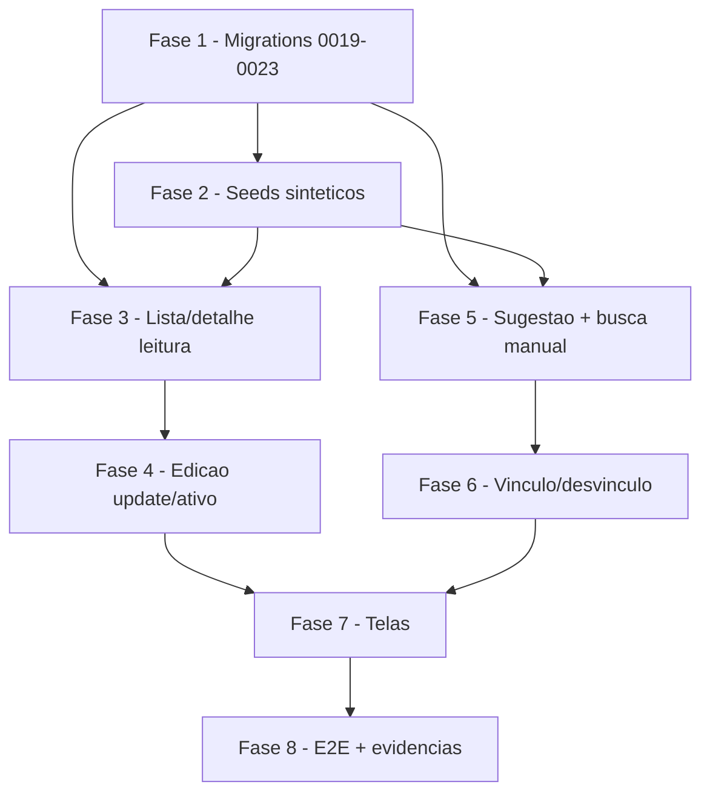

# Tarefas Hub de Frota - Módulo Motoristas (S5 / hub-motoristas)

Escopo: gestão de pessoas entregadoras no hub isolado — leitura (lista/detalhe), edição (nome/situação), vínculo/desvínculo a conta de acesso com sugestão por similaridade, telas e E2E. Só recursos `hub-*`/`hub_` (exceção G1). Origem: docs/specs/hub-motoristas/{spec,plan,research,data-model,contracts,quickstart}.md + checklists/requirements.md.

**Legenda de status:**
- `[ ]` Pendente
- `[~]` Em andamento
- `[x]` Concluido
- `[!]` Bloqueado

**Legenda de criticidade:**
- `[C]` Critico - Impacto financeiro direto ou bloqueante
- `[A]` Alto - Funcionalidade essencial
- `[M]` Medio - Necessario mas sem urgencia imediata

---

## FASE 1 - Migrations do banco do hub (0019–0023)

### 1.1 Migration 0019 — proteção do nome editado manualmente `[A]`

Ref: plan Fase 1, research Decision 6, data-model §Entregador

- [x] 1.1.1 Criar `infra/hub/migrations/0019_entregador_edicao_manual.sql` (nome canônico de plan.md/data-model.md, prevalece sobre o rascunho `0019_entregador_nome_editado.sql` citado aqui): `ALTER TABLE "Entregador" ADD COLUMN nome_editado_manualmente boolean NOT NULL DEFAULT false`
- [x] 1.1.2 Criar trigger que preserva `nome` e `nome_editado_manualmente=true` numa reimportação (não sobrescreve nome editado manualmente), sem tocar o pipeline S4
- [x] 1.1.3 Garantir idempotência (`IF NOT EXISTS` / `CREATE OR REPLACE`): re-rodar = no-op — validado empiricamente (re-execução direta via psql, exit 0, NOTICEs "already exists, skipping")
- [x] 1.1.4 Aplicar via `infra/hub/scripts/migrate.sh` no hub-homolog e verificar reload PostgREST (SIGUSR1)

### 1.2 Migration 0020 — índices de subpraça nos fatos `[A]`

Ref: plan Fase 1, research Decision 5, data-model §Área de atuação

- [x] 1.2.1 Criar `0020_fatos_indices_subpraca.sql` (nome canônico de plan.md/data-model.md): índices para consulta de subpraças distintas por `entregador_id` ordenadas por recência em `FaturamentoLancamento`/`PerformanceTurno`
- [x] 1.2.2 Garantir idempotência (`CREATE INDEX IF NOT EXISTS`) — validado empiricamente (re-execução direta, exit 0)
- [x] 1.2.3 Aplicar via `migrate.sh` no hub-homolog; validar `EXPLAIN` usa o índice na query de áreas distintas — tabelas de fatos ainda vazias (FASE 2/seeds pendente), planner escolhe Seq Scan por custo em tabela vazia (comportamento esperado); confirmado `Index Only Scan using idx_faturamento_empresa_subpraca` com `SET enable_seqscan=off`, provando que o índice é sintaticamente válido e cobre os 3 predicados (id_empresa, subpraca, entregador_id); revalidar com dados reais após FASE 2

### 1.3 Migration 0021 — espelho ContaMotorista + FK/índice único + trigram `[A]`

Ref: plan Fase 1, research Decision 2/3/4, data-model §ContaMotorista

- [x] 1.3.1 Criar `0021_conta_motorista.sql`: tabela `ContaMotorista` (espelho local, sem RLS, GRANTs ao role `authenticated`) conforme data-model
- [x] 1.3.2 Habilitar extensões `pg_trgm` e `unaccent` (idempotente, `CREATE EXTENSION IF NOT EXISTS`)
- [x] 1.3.3 Criar índice trigram (GIN) sobre nome normalizado de `ContaMotorista` para similaridade
- [x] 1.3.4 Adicionar FK física `Entregador.motorista_id → ContaMotorista(id)` + índice único (uma conta em no máximo um Entregador — FR-012)
- [x] 1.3.5 Garantir idempotência de toda a migration; aplicar via `migrate.sh` no hub-homolog + reload PostgREST — validado empiricamente (re-execução direta, exit 0)

### 1.4 Migration 0022 — allowlist EmpresaGrupoMovee `[A]`

Ref: plan Fase 1, research Decision 2, data-model §EmpresaGrupoMovee

- [x] 1.4.1 Criar `0022_empresa_grupo_movee.sql`: tabela `EmpresaGrupoMovee` (allowlist global, sem RLS) que resolve elegibilidade de grupo sem reconstruir `mesmoGrupoQue`
- [x] 1.4.2 Garantir idempotência; aplicar via `migrate.sh` no hub-homolog + reload PostgREST — validado empiricamente (re-execução direta, exit 0)

### 1.5 Migration 0023 — funções RPC de similaridade/busca `[A]`

Ref: plan Fase 5, research Decision 10/11, data-model §uso combinado

- [x] 1.5.1 Criar `0023_motoristas_rpc_candidatos.sql` (nome canônico de plan.md/data-model.md): função `hub_motoristas_candidatos(p_entregador_id)` — top 10 candidatos por `pg_trgm`/`unaccent`, limiar 0.3, elegibilidade de grupo resolvida DENTRO da função, RLS de `Entregador` aplicada ao role chamador
- [x] 1.5.2 Criar função `hub_motoristas_busca(p_entregador_id, p_termo)` para busca manual, mesma regra de escopo/elegibilidade
- [x] 1.5.3 Expor as funções ao PostgREST via GRANT ao role `authenticated`; confirmar bind nativo de parâmetros (sem concatenação de string — OWASP A05) — `\df` confirma assinatura com parâmetros tipados (não concatenação); RPC PostgREST despacha via bind nativo
- [x] 1.5.4 Garantir idempotência (`CREATE OR REPLACE FUNCTION`); aplicar via `migrate.sh` + reload PostgREST — validado empiricamente (re-execução direta, exit 0)

### 1.6 Migration 0024 — view agregada `hub_areas_por_entregador` (trabalho emergente da FASE 3) `[A]`

Ref: tasks.md FASE 3 (3.1.2), data-model.md §Área de atuação (só cobria a
agregação de UM `entregador_id` por vez, "Áreas distintas do detalhe")

Gap identificado ao implementar `GET /motoristas` (lista, 3.1): a agregação
de áreas distintas por entregador descrita em data-model.md só resolve o
caso do DETALHE (1 `entregador_id`). A lista precisa da mesma agregação para
VÁRIOS entregadores de uma vez, sem N+1 query por linha nem puxar linhas de
fato cruas para o Node. Decisão tomada e aplicada: migration aditiva nova
`infra/hub/migrations/0024_areas_por_entregador.sql`, criando a view
`hub_areas_por_entregador` (`UNION ALL` de `FaturamentoLancamento`/
`PerformanceTurno` agrupado por `entregador_id, subpraca`, `MAX(data)`),
consumida tanto pela lista (`entregador_id=in.(<ids-do-conjunto-candidato>)`,
`routes/hub-motoristas.js#buscarAreasPorEntregador`) quanto pelo detalhe
(reaproveitada no lugar da query single-entregador que o data-model.md
descrevia).

- [x] 1.6.1 Criar `infra/hub/migrations/0024_areas_por_entregador.sql`: `CREATE OR REPLACE VIEW hub_areas_por_entregador AS SELECT entregador_id, subpraca, MAX(data) AS data_mais_recente FROM (...) GROUP BY entregador_id, subpraca` + `GRANT SELECT ... TO authenticated`
- [x] 1.6.2 Confirmar empiricamente que a RLS das tabelas BASE (`FaturamentoLancamento`/`PerformanceTurno`, já cobertas desde `0015`) continua se aplicando através da view (Postgres aplica RLS conforme o role/sessão que EXECUTA a query, não o dono da view — sem `security_barrier` especial necessário) — validado no teste de integração (`infra/hub/testes/hub-motoristas-integration.sh`, assert "isolamento multi-tenant -> não vaza Entregadores do outro tenant": usuário escopado a uma `id_empresa` só recebe áreas/Entregadores da própria empresa ao consultar `GET /motoristas` via a view)
- [x] 1.6.3 Garantir idempotência (`CREATE OR REPLACE VIEW`); aplicar via `infra/hub/scripts/migrate.sh` no ambiente de teste efêmero E em `hub-homolog` (projeto docker compose `hub-homolog`, confirmado via `docker compose ls` antes de rodar; env-file `/var/lib/hub_secrets/.env.hub.homolog`) — migration `0024_areas_por_entregador.sql` registrada em `SchemaMigration` (id=25, `aplicado_em` 2026-07-08) + SIGUSR1 enviado ao PostgREST; validado com query `psql` real: `\d hub_areas_por_entregador` confirma as 3 colunas (`entregador_id`, `subpraca`, `data_mais_recente`) e `SELECT count(*) FROM hub_areas_por_entregador` retorna `0` sem erro (tabelas de fato ainda vazias em hub-homolog — esperado, ninguém rodou o pipeline de importação real lá ainda)

---

## FASE 2 - Seeds sintéticos para teste

### 2.1 Estender gen-seeds.py com ContaMotorista e EmpresaGrupoMovee `[A]`

Ref: plan Fase 2, research Decision 2, docs/plans/hub-frota (S10-safe)

- [x] 2.1.1 Estender `infra/hub/scripts/gen-seeds.py` para gerar `ContaMotorista` com nomes variando acento/caixa/espaçamento contra `Entregador` existentes (exercita normalização/similaridade) — 12 variantes do 1º nome fake do `anon.name_map` (mesma execução que gera as CSVs de faturamento/performance, garantindo que o nome bate 1:1 quando o Entregador correspondente for importado); validado empiricamente via `similarity()` real no hub-homolog: variantes de caixa/acento/espaçamento = 1.0 (>= limiar 0.3)
- [x] 2.1.2 Gerar `EmpresaGrupoMovee` incluindo o `id_empresa` de teste elegível e deixando outro de fora (ramo não-elegível, FR-011) — `--id-empresa-elegivel` (default 9001, mesmo tenant da S4) inserido; `--id-empresa-nao-elegivel` (default 9002) deliberadamente NÃO inserido; validado: `SELECT id_empresa FROM "EmpresaGrupoMovee"` retorna só `9001`
- [x] 2.1.3 Incluir par de nomes idênticos/quase-idênticos e conta já vinculada a outro Entregador (para exercitar SC-003 e o 409 do FR-012) — par quase-idêntico entre si (independente de Entregador) + 6 contas "ruído" (nomes não relacionados, similaridade validada empiricamente abaixo do limiar: 0,2667 e 0 no hub-homolog) para o corte do limiar 0.3; `UPDATE` best-effort idempotente (`WHERE motorista_id IS NULL`) que vincula 1 conta a um Entregador por nome exato — ativa sozinho quando o Entregador correspondente existir (FASE 3+/8), sem erro quando não existe (0 rows, validado)
- [x] 2.1.4 Garantir seeds S10-safe/idempotentes; aplicar no hub-homolog e validar contagens — gerado `infra/hub/seeds/out/hub_motoristas_seed.sql` (idempotente, `ON CONFLICT DO NOTHING`, transação única); aplicado via psql no hub-homolog: `ContaMotorista`=20 linhas, `EmpresaGrupoMovee`={9001}; reaplicado 2x — 2ª rodada `INSERT 0 0` em todas as linhas e contagem inalterada (20), confirmando idempotência empírica

---

## FASE 3 - Lista e detalhe (leitura)

### 3.1 GET /motoristas — lista paginada com filtros server-side `[A]`

Ref: plan Fase 3, spec FR-001/FR-002, contracts GET /motoristas, quickstart Cenário 1/2

- [x] 3.1.1 Implementar handler `GET /api/v1/motoristas` (`routes/hub-motoristas.js`): filtros por nome (parcial, sem acento — Clarification Q2), `ativo`, área, `comVinculo`; paginação `page`/`pageSize` (default 20, máx 100). Decisão registrada no cabeçalho do arquivo: filtros baratos/exatos (`id_empresa`, `ativo`, `motorista_id is/is-not null`) empurrados ao PostgREST; nome/área resolvidos em JS (`lib/hub-motoristas-dto.js#nomeCasa`/`areaCasa`, tolerantes a acento) — validado empiricamente (assert "filtro nome=jose (sem acento) -> encontra 'José da Silva'")
- [x] 3.1.2 Computar `areas: string[]` distintas por linha (mesma fonte de FR-003), ordenadas por recência — via view `hub_areas_por_entregador` (migration 0024, item 1.6 emergente), 1 query em lote para todos os candidatos da página (`buscarAreasPorEntregador`, sem N+1); validado empiricamente (asserts "lista -> Carlos.areas"/"lista -> José.areas")
- [x] 3.1.3 Retornar estado vazio como `{items: [], total: 0}` — nunca erro (FR-002 Edge Case) — caminho curto no handler quando o conjunto candidato do PostgREST já vem vazio
- [x] 3.1.4 Aplicar RLS/escopo por token; garantir isolamento multi-tenant — validado empiricamente (assert "isolamento multi-tenant -> não vaza Entregadores do outro tenant", troca de entidade ativa do MESMO usuário)
- [x] 3.1.5 Testes unit do mapper/máscara em `tests/hub-motoristas-dto.test.js` — 33/33 PASS (`node --test tests/hub-motoristas-dto.test.js`)
- [x] 3.1.6 Testes de integração dos filtros com seeds em `tests/hub-motoristas.test.js` (PostgREST hub) — script `infra/hub/testes/hub-motoristas-integration.sh` rodado de verdade contra projeto `hub-test-<runid>` efêmero: 44/44 asserts PASS, incl. filtros nome/ativo/comVinculo/area e isolamento multi-tenant

### 3.2 GET /motoristas/:id — detalhe com indicadores all-time `[A]`

Ref: plan Fase 3, spec FR-003, contracts GET /:id, data-model §Resumo de indicadores

- [x] 3.2.1 Implementar handler `GET /motoristas/:id` (`routes/hub-motoristas.js`): indicadores all-time (`FaturamentoLancamento`/`PerformanceTurno` via count=exact + range 0-0 combinando total e linha mais recente numa única query por tabela), `areas` (subpraça + dataMaisRecente) ordenadas por recência (view `hub_areas_por_entregador`), `cnpjPrestadorMascarado` via `lib/hub-motoristas-dto.js#mascararCnpj` (função pura, testada isoladamente); embed nativo do PostgREST `Entregador...ContaMotorista(id,nome,cnpj_prestador)` via FK física (migration 0021) confirmado empiricamente (assert "detalhe Carlos -> vinculo.nome"/"vinculo.cnpjPrestadorMascarado")
- [x] 3.2.2 Retornar `404 NAO_ENCONTRADO` fora do escopo do token (RLS + filtro `id_empresa`) — validado empiricamente (asserts "detalhe de Entregador fora do escopo -> 404" e "detalhe de Entregador de outro tenant (via entidade OUTRA) -> 404")
- [x] 3.2.3 Tratar Entregador sem histórico de importação (Edge Case FR-003) sem erro — validado empiricamente (asserts "detalhe Ana (sem nenhum fato) -> 200", resumo zerado, `areas: []`, `vinculo: null`)
- [x] 3.2.4 Testes de integração do detalhe + máscara de CNPJ em `tests/hub-motoristas.test.js` — cobertos pelo mesmo script `hub-motoristas-integration.sh` (happy path, sem vínculo, sem fato, fora do escopo, id inexistente — 404) + unit da máscara em `tests/hub-motoristas-dto.test.js` (6 casos, incl. formatado/dígitos puros/entrada inválida)

Bônus (fora do escopo mínimo de 3.1/3.2, mas coberto no mesmo script por ser
barato): `GET /motoristas` e `GET /motoristas/:id` sem `motoristas.listar`/
`motoristas.consultar` -> `403 PERMISSAO_NEGADA` (papel sintético
`sem_motoristas_teste`, sem nenhum dos 4 papéis-seed de `0007` servir para
esse caso — todos concedem `motoristas.consultar`/`listar`).

---

## FASE 4 - Edição (update / situação)

### 4.1 PATCH /motoristas/:id — editar nome/situação com allowlist `[A]`

Ref: plan Fase 4, spec FR-004/FR-005, research Decision 6/9/12, contracts PATCH /:id

- [x] 4.1.1 Implementar handler `PATCH /motoristas/:id` com allowlist de campos (só nome/situação — nenhum campo extra, guarda anti mass-assignment/BOPLA — Decision 12) <!-- routes/hub-motoristas.js PATCH /:id + lib/hub-motoristas-dto.js#validarPatchMotorista -->
- [x] 4.1.2 Gravar `nome_editado_manualmente=true` quando `nome` muda; NÃO tocar `FaturamentoLancamento`/`PerformanceTurno` (FR-004) <!-- validarPatchMotorista seta ambos no mesmo objeto de patch; único UPDATE em Entregador -->
- [x] 4.1.3 Validar `nome` vazio/só espaços → `422 INVALIDO`; fora do escopo → `404` <!-- validarPatchMotorista + checagem de escopo por id_empresa antes do UPDATE -->
- [x] 4.1.4 Exigir permissão RBAC via `requirePermission` (FR-005, Decision 7); `403` fail-closed sem permissão <!-- requirePermission('motoristas.editar') -->
- [x] 4.1.5 Registrar auditoria `motorista.editado` via `registrarAuditoria()` (FR-014, Decision 9) <!-- detalhes: {camposAlterados} -->
- [x] 4.1.6 Testes de integração: edição persiste, histórico intacto, 422/403/404; sobrevivência à reimportação (Cenário 4) <!-- infra/hub/testes/hub-motoristas-integration.sh cenários (m)-(s) + Cenário 4; unit validarPatchMotorista em tests/hub-motoristas-dto.test.js (11 casos) -->

**Achado emergente (não-bloqueante para 4.1, registrado p/ decisão de produto futura)**:
o trigger `trg_entregador_protege_nome` (migration 0019, Decision 6) protege o
`nome` de QUALQUER `UPDATE` subsequente assim que `nome_editado_manualmente=true`
— inclusive um **2º `PATCH` legítimo** feito pelo próprio operador para corrigir
a edição anterior (não só a reimportação do S4, único caso coberto pelo
Clarification Q5/quickstart Cenário 4). Confirmado empiricamente durante os
testes de integração desta tarefa: um 2º `PATCH {nome}` no mesmo Entregador
retorna `200` mas o `nome` no corpo da resposta permanece o valor da 1ª edição
(o trigger reverte `NEW.nome` incondicionalmente, sem diferenciar
app-legítima de upsert-de-reimportação). Não é regressão de 4.1 nem estava no
escopo do Clarification Q5 — é uma limitação pré-existente da Decision 6 que só
se manifesta ao tentar reeditar. Sem ação nesta onda (exigiria decisão de
produto sobre se reedição deve ser permitida + possível nova migration
expand-only com um mecanismo de bypass transacional). Ver FASE 8 para revisitar
antes do fechamento da feature.

---

## FASE 5 - Sugestão automática e busca manual

### 5.1 GET /motoristas/:id/sugestoes — candidatos por similaridade `[A]`

Ref: plan Fase 5, spec FR-007/FR-008, research Decision 10/11, contracts /sugestoes, quickstart Cenário 5/6

- [x] 5.1.1 Implementar `hub-motoristas-similaridade.js`: chamar `POST /rpc/hub_motoristas_candidatos` e mapear resposta (sem lógica de similaridade em JS — só chama o RPC)
- [x] 5.1.2 Implementar handler `GET /motoristas/:id/sugestoes`: responder mesmo para Entregador já vinculado (permite trocar — FR-013); `jaVinculadoA` não impede listagem (SC-003)
- [x] 5.1.3 `entidadeElegivel=false` → `items: []` sem erro (FR-011); `404` se `:id` fora do escopo (Decision 11)
- [x] 5.1.4 Garantir que candidatos abaixo do limiar 0.3 nunca aparecem (Clarification Q4)
- [x] 5.1.5 Testes unit de normalização/corte/limiar em `tests/hub-motoristas-similaridade.test.js`

### 5.2 GET /motoristas/contas-elegiveis — busca manual `[A]`

Ref: plan Fase 5, spec FR-009/FR-010, contracts /contas-elegiveis, quickstart Cenário 7/9

- [x] 5.2.1 Implementar handler `GET /motoristas/contas-elegiveis`: chamar `POST /rpc/hub_motoristas_busca`, mapear resposta
- [x] 5.2.2 Aplicar mesma regra de `404` por `entregadorId` fora do escopo e `entidadeElegivel=false` → lista vazia sem erro
- [x] 5.2.3 Testes de integração da busca manual com seeds (elegível vs não-elegível)

---

## FASE 6 - Vínculo e desvínculo

### 6.1 POST /motoristas/:id/vinculo — criar ou substituir vínculo `[A]`

Ref: plan Fase 6, spec FR-006/FR-008/FR-012/FR-013, research Decision 9/12, contracts POST vinculo, quickstart Cenário 5/8

- [x] 6.1.1 Implementar handler `POST /motoristas/:id/vinculo` com allowlist de campos `{contaMotoristaId}` (Decision 12) <!-- lib/hub-motoristas-dto.js#validarVinculoBody + routes/hub-motoristas.js#POST /:id/vinculo; `origem` aditivo/opcional só para auditoria, nunca chega ao UPDATE -->
- [x] 6.1.2 Substituir vínculo existente em ação única (FR-013); confirmação humana explícita obrigatória (FR-008/SC-004) <!-- backend expõe a operação idempotente-substitutiva (UPDATE único, sem checar motorista_id atual); confirmação humana em si é responsabilidade da UI (FASE 7) -->
- [x] 6.1.3 FK inválida → `404`; violação do índice único (conta já vinculada a outro Entregador) → `409 CONFLITO` amigável (FR-012) <!-- pre-check FK (ContaMotorista) + pre-check conflito same-tenant + catch defensivo do 409 do PostgREST p/ conflito cross-tenant (sem expor dados de outro tenant) -->
- [x] 6.1.4 Registrar auditoria `motorista.vinculado`; exigir permissão RBAC (403 fail-closed) <!-- registrarAuditoria + requirePermission('motoristas.editar'), mesmo padrão dos demais handlers -->
- [x] 6.1.5 Testes de integração: vínculo persiste, substituição, 409 no conflito duplo (Cenário 8), 403 sem permissão <!-- infra/hub/testes/hub-motoristas-integration.sh FASE 6, 30 asserts novos, todos verdes contra hub-test efêmero real -->

### 6.2 DELETE /motoristas/:id/vinculo — desvínculo + semântica idempotente `[A]`

Ref: plan Fase 6, spec FR-014, research Decision 9, checklists/requirements.md CHK006

- [x] 6.2.1 **Fechar gap CHK006**: definir e documentar no contrato a semântica do DELETE sobre um Entregador SEM vínculo (idempotente 200/204 vs 404); alinhar com o operador se necessário <!-- decisão default por consistência REST (204 idempotente, sem erro), score 2, documentada em contracts/motoristas-api.md §DELETE vinculo e checklists/requirements.md CHK006 -->
- [x] 6.2.2 Implementar handler `DELETE /motoristas/:id/vinculo` conforme semântica decidida; escopo por token (`404` fora do escopo) <!-- routes/hub-motoristas.js#DELETE /:id/vinculo -->
- [x] 6.2.3 Registrar auditoria `motorista.desvinculado`; exigir permissão RBAC <!-- só quando havia vínculo antes; no-op idempotente nunca gera entrada vazia -->
- [x] 6.2.4 Testes de integração: desvínculo persiste, comportamento sobre Entregador já sem vínculo, 403 sem permissão <!-- mesmo script FASE 6, cenários (gg)-(ii) + checagem de contagem de auditoria via psql -->

---

## FASE 7 - Telas do módulo

### 7.1 Tela de lista/detalhe `/hub/dashboard/motoristas` `[M]`

Ref: plan Fase 7, spec FR-017/SC-006/SC-008, research Decision 8, quickstart Cenário 12

- [ ] 7.1.1 Criar `/hub/dashboard/motoristas` (lista com filtros) e `/hub/dashboard/motoristas/:id` (detalhe) via `/ui-ux-pro-max`, reusando padrões shadcn/hook server-side da S4
- [ ] 7.1.2 Ocultar 100% dos controles de edição para usuário sem permissão (FR-005/SC-006); nunca depender só do frontend (backend 403 já garante)
- [ ] 7.1.3 Preservar identidade visual EntreGô/design system e branding claro/escuro via `next-themes` (FR-017/SC-008)
- [ ] 7.1.4 **Fechar gap CHK033**: garantir acessibilidade das telas novas (navegação por teclado, foco visível, rótulos/aria) além da identidade visual

### 7.2 Diálogo de vínculo (sugestões + busca manual + confirmação) `[A]`

Ref: plan Fase 7, spec FR-006/FR-008/FR-009, quickstart Cenário 5/6/7

- [ ] 7.2.1 Implementar diálogo de vínculo consumindo `/sugestoes` e `/contas-elegiveis`
- [ ] 7.2.2 Exigir ação de confirmação humana explícita antes de chamar `POST .../vinculo` (FR-008)
- [ ] 7.2.3 Exibir aviso quando a conta candidata já está vinculada a outro Entregador (sem bloquear a listagem; o 409 do backend é a barreira real)
- [ ] 7.2.4 Ação de desvínculo com confirmação; refletir estado após vincular/desvincular

---

## FASE 8 - E2E e evidências

### 8.1 E2E dos 12 cenários no hub-homolog `[A]`

Ref: plan Fase 8, quickstart Cenários 1–12, briefing s5-modulo-motoristas

- [ ] 8.1.1 Rodar E2E da jornada completa: buscar → detalhe → vincular via sugestão → desvincular (SC-005)
- [ ] 8.1.2 E2E do usuário só-leitura: 100% dos controles de edição ausentes (SC-006) + `403` se forçar a chamada de escrita
- [ ] 8.1.3 E2E do conflito de vínculo duplo (Cenário 8 / FR-012) e do ramo não-elegível (Cenário 9 / FR-010/FR-011)
- [ ] 8.1.4 E2E de isolamento multi-tenant (Cenário 10 / Constitution II)
- [ ] 8.1.5 Roundtrip real contra contrato (Cenário 11, não mock) e branding claro/escuro (Cenário 12)

### 8.2 Coleta de evidências e fechamento `[M]`

Ref: plan Fase 8, briefing (ordem: E2E → evidências)

- [ ] 8.2.1 Coletar evidências dos E2E (saídas/prints) no hub-homolog isolado
- [ ] 8.2.2 Verificar SC-007 (zero alterações observáveis na base de contas do app motorista) e FR-015/FR-016 (nenhuma escrita/regressão fora do escopo)
- [ ] 8.2.3 Consolidar evidências no diário/PR da S5 para revisão do operador
- [ ] 8.2.4 Revisitar achado emergente da tarefa 4.1 (trigger `trg_entregador_protege_nome`, migration 0019, bloqueia um 2º `PATCH` de nome mesmo do próprio operador — não só reimportação): decidir com o operador se reedição deve ser permitida e, se sim, desenhar o mecanismo (nova migration expand-only)

---

## Matriz de Dependencias

## Resumo Quantitativo

| Fase | Tarefas | Subtarefas | Criticidade |
|------|---------|------------|-------------|
| 1 - Migrations 0019–0023 | 5 | 20 | A |
| 2 - Seeds sintéticos | 1 | 4 | A |
| 3 - Lista/detalhe (leitura) | 2 | 10 | A |
| 4 - Edição (update/situação) | 1 | 6 | A |
| 5 - Sugestão + busca manual | 2 | 8 | A |
| 6 - Vínculo/desvínculo | 2 | 9 | A |
| 7 - Telas | 2 | 8 | A/M |
| 8 - E2E + evidências | 2 | 8 | A/M |
| **Total** | **17** | **73** | - |

## Escopo Coberto

| Item | Descricao | Fase |
|------|-----------|------|
| FR-001/FR-002/FR-003 | Lista, filtros e detalhe de pessoas entregadoras | 3 |
| FR-004/FR-005 | Edição de nome/situação com RBAC e proteção de reimportação | 4 |
| FR-006–FR-013 | Sugestão por similaridade, busca manual, vínculo/desvínculo | 5, 6 |
| FR-014 | Auditoria de edição/vínculo/desvínculo | 4, 6 |
| FR-017/SC-006/SC-008 | Telas novas, só-leitura sem edição, branding claro/escuro | 7 |
| SC-005 + Cenários 1–12 | Jornada completa e roundtrip E2E no hub-homolog | 8 |
| CHK006 | Semântica idempotente do DELETE /vinculo (gap do checklist) | 6 |
| CHK033 | Acessibilidade das telas novas (gap do checklist) | 7 |
| Migrations 0019–0023 + seeds | Fundação de banco isolada do hub (`hub-*`) | 1, 2 |

## Escopo Excluido

| Item | Descricao | Motivo |
|------|-----------|--------|
| Tabela `Motorista` / login app motorista | Base de pré-cadastro e autenticação do app motorista | Fora do módulo hub; espelho local `ContaMotorista` é read-only por seed (FR-015) |
| `upsertMotoristasFromLote` / importação | Pipeline de importação (S4) | Fase S4, não S5; não tocado por esta fase (FR-016) |
| Veículos | Vínculo motorista↔veículo além de conta de acesso | Fora do escopo do briefing S5 |
| Escrita em produção / `chatmasterveloz` | Qualquer integração com a base do app do cliente | Exceção G1 restringe a recursos `hub-*`; sem ponte de rede (Constitution V) |
| Rate limiting das rotas de busca (CHK007) | Proteção contra abuso de `/sugestoes`/`/contas-elegiveis` | Item `{humano}` pendente — decidir se é herdado do shell do hub (S3) ou requisito desta fase |
| Concorrência de edição (CHK031) | Optimistic locking em edição simultânea | Item `{humano}` pendente — risco baixo; decidir last-write-wins explícito |
