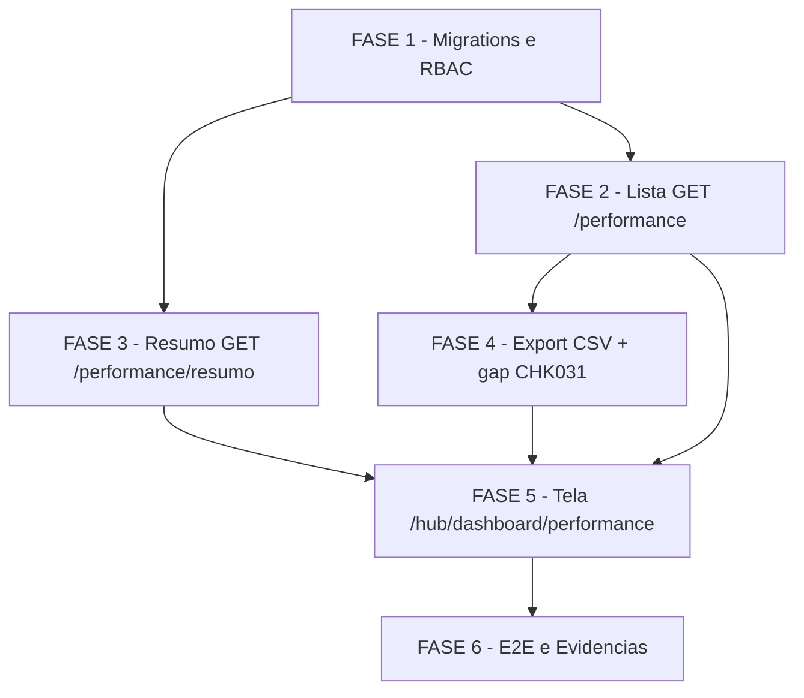

# Tarefas hub-performance - Módulo Performance (S7 do Hub de Frota)

Escopo: decompor `plan.md` (6 fases) em backlog executável para o módulo de
Performance — consulta somente-leitura sobre `PerformanceTurno` (lista,
cards de resumo, agregados por dia/período/entregador, export CSV, tela
`/hub/dashboard/performance`), 100% no ambiente isolado `hub-homolog`
(recursos `hub-*`, exceção G1), nunca em produção/`chatmasterveloz`.

**Legenda de status:**
- `[ ]` Pendente
- `[~]` Em andamento
- `[x]` Concluído
- `[!]` Bloqueado

**Legenda de criticidade:**
- `[C]` Crítico - Impacto financeiro direto ou bloqueante
- `[A]` Alto - Funcionalidade essencial
- `[M]` Médio - Necessário mas sem urgência imediata

---

## FASE 1 - Migrations e RBAC

### 1.1 Migration 0029 — permissão `performance.listar` `[C]`

Ref: plan.md "Plano por fases" passo 1; data-model.md "Migrations desta
fase"; research.md Decision 1; contracts/performance-api.md (permissão de
rota `GET /performance`)

- [x] 1.1.1 Criar `infra/hub/migrations/0029_seed_permissao_performance_listar.sql`
- [x] 1.1.2 `INSERT INTO "Permissao"` (`codigo='performance.listar'`, `modulo_id` correspondente ao módulo `performance` já seedado em `0007`) idempotente (`ON CONFLICT DO NOTHING`)
- [x] 1.1.3 Conceder a permissão aos papéis `admin_plataforma`/`admin_entidade`/`operador`/`leitura`, idempotente (`INSERT "PapelPermissao"` `ON CONFLICT DO NOTHING`)
- [x] 1.1.4 Aplicar via `infra/hub/scripts/migrate.sh` no `hub-homolog`
- [x] 1.1.5 Verificar reload do PostgREST (SIGUSR1) e confirmar a permissão nova refletida em `obterPermissoesEfetivas` (`lib/hub-rbac-cache.js`)
- [x] 1.1.6 Teste: consulta confirmando que os 4 papéis-seed possuem `performance.listar` após a migration, convivendo com `performance.consultar`/`performance.exportar` já seedadas em `0007`; re-rodar `migrate.sh` e confirmar no-op (idempotência)

  Evidência: `migrate.sh` aplicou 0029+0030 em 2026-07-08 (2 aplicadas
  agora); re-execução direta via `psql < 0029_*.sql` = `INSERT 0 0` (duas
  vezes, nenhuma linha nova — idempotência real, não só skip por
  registro em `SchemaMigration`). Consulta confirmou os 4 papéis-seed
  com `performance.listar`, convivendo com `performance.consultar`
  (todos) e `performance.exportar` (só `admin_plataforma`/`admin_entidade`).

### 1.2 Migration 0030 — funções RPC `hub_performance_totais`/`hub_performance_agrupado` `[C]`

Ref: plan.md "Plano por fases" passo 1; data-model.md "Migrations desta
fase"; research.md Decision 2/3/4/12; plan.md "Gate owasp-security" (A05
Injection PASS — parametrização nativa)

- [x] 1.2.1 Criar `infra/hub/migrations/0030_hub_performance_rpc_resumo.sql`
- [x] 1.2.2 Implementar `hub_performance_totais(...)` `SECURITY INVOKER`: `SUM(corridas_completadas)` (`corridasCompletadas`), `SUM(corridas_aceitas)::numeric/NULLIF(SUM(corridas_ofertadas),0)` (`taxaAceitacao`, `null` se denominador 0 — SC-009), `SUM(corridas_completadas)::numeric/NULLIF(SUM(corridas_aceitas),0)` (`taxaConclusao`, `null` se denominador 0), média ponderada de `tempo_disponivel_pct` por `EXTRACT(EPOCH FROM duracao)` com fallback para média aritmética simples do conjunto quando qualquer linha tem `duracao IS NULL` (research.md Decision 2/3 — fallback no nível do CONJUNTO, não por linha), `SUM(COALESCE(taxas_centavos,0))::numeric/100` formatado como `text` (`taxasReais`)
- [x] 1.2.3 Implementar `hub_performance_agrupado(...)` `SECURITY INVOKER`, `group_by` ∈ {`dia`,`periodo`,`entregador`} (`400 GROUP_BY_INVALIDO` fora do enum, tratado na camada de rota), os mesmos 5 campos calculados via `FILTER` clause dentro do `GROUP BY` (Decision 3, sem subquery aninhada por grupo), `chave`/`quantidade` por grupo, parâmetros tipados (nunca concatenação de SQL)
- [x] 1.2.4 `GRANT EXECUTE` das 2 funções ao role `authenticated`
- [x] 1.2.5 Aplicar via `migrate.sh` no `hub-homolog`; validar idempotência (`CREATE OR REPLACE FUNCTION`, re-rodar = no-op)
- [x] 1.2.6 Teste: chamar as 2 funções via SQL direto no `hub_homolog_db` com filtros básicos e confirmar que `SECURITY INVOKER` respeita a RLS existente de `PerformanceTurno` (`0015`) — rodar como usuário de outro `id_empresa` e confirmar zero linhas
- [x] 1.2.7 Teste dedicado da fórmula ponderada (Cenário 3 do quickstart): conjunto com durações distintas bate com o cálculo manual `Σ(tempo_disponivel_pct × EXTRACT(EPOCH FROM duracao)) / Σ EXTRACT(EPOCH FROM duracao)`; e o caso de fallback (um registro do conjunto com `duracao IS NULL`) faz o cálculo cair para média aritmética simples do conjunto inteiro, não apenas ignorar o peso daquele registro

  Evidência (dados sintéticos inseridos e removidos no `hub_homolog_db`,
  empresa QA 9001, sob `SET ROLE authenticated` + `request.jwt.claims`
  simulando escopo real — não superuser):
  - Grupo ponderado (3 linhas, durações 03:00/02:30/04:00, pct
    80/90/70): `hub_performance_totais` retornou
    `tempoDisponivelMedio=78.42` — bate com o cálculo manual
    `Σ(pct×segundos)/Σsegundos = 2682000/34200 = 78.421...→78.42`;
    `corridasCompletadas=22`, `taxaAceitacao=0.8000`,
    `taxaConclusao=0.9167`, `taxasReais=30.00` (todos conferidos à mão).
  - Grupo fallback (1 linha com `duracao IS NULL` no conjunto):
    `tempoDisponivelMedio=80.00` = média aritmética simples de
    `(60.00+100.00)/2`, confirmando queda do cálculo do CONJUNTO
    inteiro (não apenas exclusão do peso da linha sem duração).
  - RLS/`SECURITY INVOKER`: escopo `[9001]` chamando com
    `p_id_empresa=9002` retornou 0 linhas/`null`s (isolamento real, não
    apenas filtro de parâmetro); escopo `[9002]` viu sua própria linha.
  - Período sem dados (FR-011): `200`-equivalente com
    `corridasCompletadas=0`, taxas `null`, `taxasReais="0.00"` — nunca
    erro.
  - `hub_performance_agrupado(groupBy=entregador)`: 3 grupos (104/105/
    106) com métricas individuais corretas; `groupBy=dia`: soma de
    `corridasCompletadas` dos grupos (22+9=31) bate exatamente com o
    resumo sem `groupBy` do mesmo filtro (31) — mesma verificação exigida
    depois na tarefa 3.1.5.
  - `groupBy` fora do enum (`'turno_invalido'`): `CASE` sem `ELSE`
    produz `chave_calc IS NULL`, filtrado pelo `WHERE` → 0 linhas, sem
    erro/exceção (validação categórica de fato fica na camada de rota,
    FASE 2, conforme já documentado).

---

## FASE 2 - Lista (leitura) — `GET /performance`

### 2.1 DTO/mapper e parsing de filtros/paginação `[A]`

Ref: contracts/performance-api.md "GET /performance"; data-model.md "Mapa
permissão lógica → código real"; plan.md "Convenções de Borda"

- [x] 2.1.1 Criar `app_homologacao/backend/lib/hub-performance-dto.js`: mapper snake_case→camelCase (`id`, `dataPeriodo`, `periodo`, `entregadorId`, `entregadorNome`, `subpraca`, `praca`, `corridasOfertadas`, `corridasAceitas`, `corridasRejeitadas`, `corridasCompletadas`, `corridasCanceladas`, `pedidosConcluidos`, `tempoDisponivelPct` como `number`/`null`, `taxas` como `text` fixo com `NULL`→`"0.00"`)
- [x] 2.1.2 Implementar `parseFiltros` (`de`/`ate` default últimos 30 dias filtrando `data_periodo` — Cenário 5, `periodo`, `subpraca`, `entregadorId`) com validação `400 DATA_INVALIDA` (formato ISO ou `de > ate`) e `400 ENTREGADOR_ID_INVALIDO` (não numérico)
- [x] 2.1.3 Implementar `parsePaginacao` (`page` default 1, `pageSize` default 20, máx. 100 — mesmas constantes `PAGE_SIZE_DEFAULT`/`PAGE_SIZE_MAX` de `importacoes`/`motoristas`/`faturamento`)
- [x] 2.1.4 Teste unit: `tests/hub-performance-dto.test.js` cobrindo mapper (incluindo `entregadorId`/`entregadorNome` sempre presentes, nunca `null` — Decision 4, sem bucket "sem entregador"), `parseFiltros` (válidos/inválidos) e `parsePaginacao` (limites, defaults)

  Evidência: `node --test tests/hub-performance-dto.test.js` → 34/34 pass
  (8 suites: mapPerformanceListItem, formatarTaxasReais, dataValida,
  parseFiltros — incluindo `de > ate` -> `DATA_INVALIDA` e a interação com
  o default fixo "hoje-30 dias" do contrato —, parsePaginacao,
  groupByValido, mapResumoCards, mapResumoAgrupado).

### 2.2 Endpoint `GET /performance` (JSON) `[A]`

Ref: contracts/performance-api.md "GET /performance"; middleware/hub-require-permission.js; spec.md FR-001/FR-002/FR-009/FR-011

- [x] 2.2.1 Criar `app_homologacao/backend/routes/hub-performance.js` com router Express
- [x] 2.2.2 Implementar `GET /` com `requirePermission('performance.listar')`, consulta PostgREST em `PerformanceTurno` com filtros + join `Entregador` para `entregadorNome` + paginação `Range` + ordenação `order=data_periodo.desc,id.desc` (contract)
- [x] 2.2.3 Registrar a rota em `server.js` (mesma altura das demais montagens `hub*`): `app.use('/api/v1/performance', hubPerformanceRoutes.router);`
- [x] 2.2.4 Tratar período/filtro vazio como `200` com `{ items: [], total: 0, page, pageSize }` (FR-011), nunca erro
- [x] 2.2.5 Teste integração: `tests/hub-performance.test.js` cenários lista básica, filtros combinados (periodo+subpraca+data — Cenário 1), paginação, período vazio (Cenário 6), valor de `periodo` fora dos 16 turnos documentados aparece normalmente (Edge Case, Cenário 4 item 4), `401`/`403` sem permissão

  Evidência: `infra/hub/testes/hub-performance-integration.sh` (E2E real
  contra `hub-test-<runid>` efêmero, build do backend com o código novo,
  migrations 0002-0030 aplicadas) — 26/26 asserts PASS, incluindo
  isolamento multi-tenant (E_OUTRA nunca vê linhas de E_TESTE),
  `entregadorId`/`entregadorNome` sempre presentes (Decision 4), `periodo`
  fora dos 16 turnos documentados aparecendo normalmente, `de > ate` ->
  `400 DATA_INVALIDA`, `403` sem `performance.listar`. Ambiente efêmero
  limpo automaticamente ao final (`docker compose down -v`, confirmado
  `docker compose ls`/`docker ps -a` sem resíduo). `node --test
  tests/hub-performance.test.js` (wrapper) → 1/1 pass.

---

## FASE 3 - Resumo (agregados) — `GET /performance/resumo`

### 3.1 Endpoint `GET /performance/resumo` `[C]`

Ref: contracts/performance-api.md "GET /performance/resumo"; research.md
Decision 2/3/4/12; spec.md FR-003/FR-004/FR-011

- [x] 3.1.1 Implementar handler `GET /resumo` com `requirePermission('performance.consultar')`
- [x] 3.1.2 Sem `groupBy`: chamar `hub_performance_totais` via RPC do PostgREST, mapear `corridasCompletadas`/`taxaAceitacao`/`taxaConclusao`/`tempoDisponivelMedio`/`taxasReais`
- [x] 3.1.3 Com `groupBy` (enum `dia`\|`periodo`\|`entregador`, `400 GROUP_BY_INVALIDO` se fora do enum): chamar `hub_performance_agrupado`, resolver `rotulo` (join `Entregador.nome` só para os ids presentes no resultado quando `groupBy=entregador` — nunca a tabela inteira, mesmo padrão de `nomeMap` de `hub-faturamento-dto.js`; `chave`/`rotulo` idênticos para `groupBy=dia`/`periodo`)
- [x] 3.1.4 Tratar período vazio (FR-011): `{ "corridasCompletadas": 0, "taxaAceitacao": null, "taxaConclusao": null, "tempoDisponivelMedio": null, "taxasReais": "0.00" }` — nunca erro, nunca corpo vazio
- [x] 3.1.5 Confirmar (via teste) que a soma de `corridasCompletadas` de todos os grupos retornados bate exatamente com `corridasCompletadas` do resumo sem `groupBy` do mesmo filtro (Acceptance Scenario 2 da User Story 2, Cenário 4 item 2 do quickstart)
- [x] 3.1.6 Teste integração: cards sem `groupBy` (Cenário 1), agrupado por `dia`/`periodo`/`entregador` (Cenário 4), taxa agregada = razão entre somas nunca média de percentuais linha a linha (Cenário 2 — SC-002), divisão por zero retorna `null` nunca erro/0/1 (Cenário 14 — SC-009), período vazio (Cenário 6), `400 GROUP_BY_INVALIDO`

  Evidência: handler `/resumo` implementado no mesmo `routes/hub-performance.js`
  da FASE 2 (mesmo arquivo, mirror do padrão hub-faturamento). Extensão de
  `infra/hub/testes/hub-performance-integration.sh` com seed dedicado
  (janela isolada `2026-07-06`, `corridas_ofertadas=0`/`corridas_aceitas=0`
  p/ Cenário 14) — 21 asserts NOVOS, todos PASS: cards sem `groupBy`
  (`corridasCompletadas=26`, `taxaAceitacao=0.8182` — razão de somas
  27/33, deliberadamente != média aritmética simples das 4 taxas
  individuais 0.8125, provando SC-002 —, `taxaConclusao=0.9630`,
  `tempoDisponivelMedio=78.42` ponderado, `taxasReais=35.00`); agrupado
  por `dia` (4 grupos, soma `corridasCompletadas`=26 bate com o card —
  3.1.5), `periodo` (3 grupos: ALMOCO/JANTAR/TURNO_INEXISTENTE_XYZ) e
  `entregador` (2 grupos, rótulo do João resolvido via join
  `Entregador.nome`); divisão por zero -> `taxaAceitacao`/`taxaConclusao`
  `null` (Cenário 14/SC-009); período vazio -> cards zerados/`grupos:[]`
  (FR-011); `groupBy=turno` (fora do enum, Decision 12) -> `400
  GROUP_BY_INVALIDO`; sem `performance.consultar` -> `403`. Total do
  script: 47/47 asserts PASS (26 FASE 2 + 21 FASE 3).

---

## FASE 4 - Export CSV

### 4.1 Export streaming com checagem de permissão dedicada `[C]`

Ref: contracts/performance-api.md "Resposta 200 (`?format=csv`)";
research.md Decision 5/6/9; spec.md FR-006/FR-007/FR-008; plan.md "Gate
owasp-security" (finding informativo API4, risco aceito)

- [x] 4.1.1 Implementar branch `format=csv` em `GET /performance`: checagem inline de `performance.exportar` ANTES de qualquer query (Decision 9 — independente de já ter `performance.listar`)
- [x] 4.1.2 Implementar laço de paginação `Range` em lotes de 1.000 + `res.write()` incremental (sem carregar o período inteiro em memória — Decision 5)
- [x] 4.1.3 Setar headers `Content-Type: text/csv; charset=utf-8` + `Content-Disposition: attachment; filename="performance-<de>_<ate>.csv"`, cabeçalho `dataPeriodo,periodo,entregadorNome,subpraca,praca,corridasOfertadas,corridasAceitas,corridasRejeitadas,corridasCompletadas,corridasCanceladas,pedidosConcluidos,tempoDisponivelPct,taxas` (contract)
- [x] 4.1.4 Neutralizar células (`periodo`, `subpraca`, `praca`, `entregadorNome`) via `lib/hub-csv.js` (`escaparCelulaCsvInjection`/`quotarCelulaCsv`, reuso direto — Decision 6, sem duplicar)
- [x] 4.1.5 Registrar auditoria `performance.csv_exportado` só no sucesso, via `hub-auditoria.js` (mesmo padrão de `faturamento.csv_exportado`/`importacao.original_baixado`)
- [x] 4.1.6 Tratar filtro vazio: gerar arquivo só com linha de cabeçalho (`200`, não erro — Cenário 9)
- [x] 4.1.7 Teste integração: export completo bate contagem+conteúdo com a tela (Cenário 7), CSV injection neutralizada com `=`/`+`/`-`/`@` (Cenário 8), export vazio só cabeçalho (Cenário 9), `403` sem `performance.exportar` mesmo com `performance.listar` (Cenário 10 passo 4)

  Evidência: extensão de `infra/hub/testes/hub-performance-integration.sh`
  (usuário dedicado `performance-exportador` com papel `admin_entidade`) —
  13 asserts NOVOS PASS: export completo (janela 07-01..04) gera 4 linhas
  de dados batendo com a lista da tela; `Content-Type`/`Content-Disposition`
  exatos do contrato; injection (`periodo='=SOMA(A1:A10)'`,
  `entregadorNome='@Perigoso Nome'`) neutralizada com prefixo `'` único;
  export vazio (2019) -> só cabeçalho, `200`; `403 PERMISSAO_NEGADA` para
  `jarLeitura` (tem `.listar`, não tem `.exportar`); `Auditoria
  performance.csv_exportado` registrada exatamente 4x (só nos exports
  bem-sucedidos, nunca no 403). Total do script: 60/60 asserts PASS
  (26 FASE 2 + 21 FASE 3 + 13 FASE 4).

### 4.2 Fechar gap CHK031 — célula já neutra por apóstrofo/caractere neutro `[A]`

Ref: checklists/requirements.md CHK031 `[Gap]`; spec.md Edge Cases;
quickstart.md Cenário 8; research.md Decision 6 (reuso de `lib/hub-csv.js`
já criado em `hub-faturamento`, mesmo gap já fechado lá via CHK029)

- [x] 4.2.1 Confirmar em `app_homologacao/backend/tests/hub-csv.test.js` (já existente desde `hub-faturamento`) a presença dos casos "célula já iniciada por apóstrofo" e "célula iniciada por outro caractere neutro fora de `= + - @`" — se ausentes (regressão), adicioná-los; nenhuma duplicação de neutralização (um único apóstrofo prefixado, célula preservada tal como veio)
- [x] 4.2.2 Adicionar em `tests/hub-performance.test.js` (ou `hub-performance-dto.test.js`) um caso de integração dedicado ao consumidor novo: export CSV de um registro cujo `periodo`/`subpraca`/`entregadorNome` já começa com `'` — confirmar ausência de duplo prefixo no arquivo gerado (fecha CHK031 no consumidor `performance`, não apenas em `hub-csv.js`)

  Evidência: `node --test tests/hub-csv.test.js` → 9/9 pass (casos CHK029
  "célula já iniciada por apóstrofo" e "caractere neutro fora de = + - @"
  já presentes desde `hub-faturamento`, confirmados sem regressão). Caso
  dedicado ao consumidor `performance` adicionado em
  `hub-performance-integration.sh` (entregador `'Ja Neutro Nome`, já
  começa com apóstrofo) — CSV exportado preserva UM ÚNICO apóstrofo
  (`'Ja Neutro Nome`, nunca `''Ja Neutro Nome`), fechando CHK031 também no
  consumidor novo.
- [ ] 4.2.3 Estender `quickstart.md` Cenário 8 com o passo de validação manual do caso "célula já começa com apóstrofo/caractere neutro" no `hub-homolog` (abrir em LibreOffice Calc/Excel e confirmar ausência de duplo prefixo) — mesmo padrão da extensão já feita em `hub-faturamento/quickstart.md`
- [ ] 4.2.4 Rodar a suíte de CSV completa (`hub-csv.test.js` + os casos novos de `hub-performance`) e confirmar 100% verde

---

## FASE 5 - Tela `/hub/dashboard/performance`

### 5.1 DTO/API client frontend `[A]`

Ref: plan.md "Project Structure" (frontend_v2); contracts/performance-api.md; research.md Decision 7 (taxas/tempo médio como string), Decision 10 (rota)

- [ ] 5.1.1 Criar `app_homologacao/frontend_v2/lib/hub/performance-dto.ts`: tipos + parse defensivo (padrão de `faturamento-dto.ts`), `taxaAceitacao`/`taxaConclusao`/`tempoDisponivelMedio`/`taxasReais`/`taxas` tipados como `string` (podendo ser `string | null` para as taxas/médio dos cards)
- [ ] 5.1.2 Criar `app_homologacao/frontend_v2/lib/hub/performance-api.ts`: chamadas a `GET /performance`, `GET /performance/resumo` (com/sem `groupBy`) e export CSV
- [ ] 5.1.3 Teste: roundtrip real contra o backend vivo do `hub-homolog` (Cenário 13) usando `performance-dto.ts` — nenhum mock no meio, evita drift snake_case↔camelCase

### 5.2 Página `/hub/dashboard/performance` `[A]`

Ref: plan.md "Plano por fases" passo 5; research.md Decision 10/11;
`/ui-ux-pro-max`; padrão de `.../faturamento/page.tsx`; spec.md FR-010/FR-012

- [ ] 5.2.1 Criar `app_homologacao/frontend_v2/app/hub/dashboard/performance/page.tsx` com cards de totais (corridas completadas, taxa de aceitação, taxa de conclusão, tempo disponível médio) — tratando `null` explicitamente como "indicador indisponível", nunca `0`/`1` calculado incorretamente (SC-009)
- [ ] 5.2.2 Implementar filtros server-side (`de`/`ate`/`periodo`/`subpraca`/`entregadorId`), rotulando explicitamente o filtro de data como "data do turno" (`data_periodo`, Cenário 5)
- [ ] 5.2.3 Implementar tabela paginada de registros de turno
- [ ] 5.2.4 Implementar botão de export condicionado à permissão `performance.exportar` (via `GET /me`) — não aparece quando ausente (Cenário 10)
- [ ] 5.2.5 Confirmar explicitamente que NÃO há link/navegação para `/hub/dashboard/motoristas/:id` nesta fase (research.md Decision 11 — divergência deliberada de `hub-faturamento`)
- [ ] 5.2.6 Implementar estados "período sem dados" / loading / erro (Cenário 6)
- [ ] 5.2.7 Validar identidade visual EntreGô 2.0 (tokens de cor/tipografia) em tema claro/escuro e branding por tenant (Cenário 12 — FR-012/SC-008)
- [ ] 5.2.8 Teste: smoke/E2E de UI cobrindo filtros, paginação, export condicionado, ausência de navegação para detalhe do entregador, estados vazio/loading/erro

---

## FASE 6 - E2E e Evidências

### 6.1 Quickstart completo no `hub-homolog` — Cenários 1 a 15 `[A]`

Ref: quickstart.md Cenários 1-15; plan.md "Plano por fases" passo 6

- [ ] 6.1.1 Rodar Cenário 1 (resumo e filtros combinados batem com o banco) e registrar a query SQL de referência como evidência
- [ ] 6.1.2 Rodar Cenário 2 (taxa agregada nunca é média de percentuais — SC-002)
- [ ] 6.1.3 Rodar Cenário 3 (tempo disponível médio ponderado pela duração do turno, incluindo o caso de fallback com `duracao IS NULL` — FR-003/dec-011)
- [ ] 6.1.4 Rodar Cenário 4 (agrupamentos por dia/período/entregador, soma bate com `corridasCompletadas` do resumo; incluir valor de `periodo` fora dos 16 turnos documentados)
- [ ] 6.1.5 Rodar Cenário 5 (data do turno é o único campo usado no filtro de data)
- [ ] 6.1.6 Rodar Cenário 6 (período sem dados — `200` com zeros/nulls/lista vazia)
- [ ] 6.1.7 Rodar Cenário 7 (export CSV: conteúdo e contagem batem com a tela)
- [ ] 6.1.8 Rodar Cenário 8 (CSV injection neutralizada — `=`/`+`/`-`/`@` E o caso apóstrofo-inicial fechado na tarefa 4.2)
- [ ] 6.1.9 Rodar Cenário 9 (export vazio gera só cabeçalho)
- [ ] 6.1.10 Rodar Cenário 10 (permissões independentes listar/consultar/exportar em todas as combinações, incluindo bypass de UI via `curl`)
- [ ] 6.1.11 Rodar Cenário 11 (isolamento multi-tenant em lista, resumo, agregado e export)
- [ ] 6.1.12 Rodar Cenário 12 (identidade visual preservada claro/escuro/branding)
- [ ] 6.1.13 Rodar Cenário 13 (roundtrip End-to-End real, contrato exato, sem mock)
- [ ] 6.1.14 Rodar Cenário 14 (divisão por zero nunca produz erro — SC-009)
- [ ] 6.1.15 Rodar Cenário 15 (performance sob volume ampliado — ver 6.2)

### 6.2 Performance sob volume ampliado — Cenário 15 `[M]`

Ref: quickstart.md Cenário 15; research.md Decision 8; spec.md SC-004

- [ ] 6.2.1 Gerar seed de volume ampliado (~1 ano de operação) dedicado para um `id_empresa` de teste em `"PerformanceTurno"` (`infra/hub/scripts/gen-seeds.py --perf` ou `generate_series` direto, mesma técnica de `hub-faturamento`)
- [ ] 6.2.2 Medir tempo de resposta de `GET /performance/resumo` sem `groupBy` sobre o intervalo do ano populado (1 aquecimento + 2 rodadas)
- [ ] 6.2.3 Medir tempo de resposta de `GET /performance/resumo?groupBy=dia`, `?groupBy=periodo` e `?groupBy=entregador` sobre o mesmo intervalo
- [ ] 6.2.4 Capturar `EXPLAIN (ANALYZE, BUFFERS)` das 2 funções RPC nas medições acima
- [ ] 6.2.5 Registrar evidência (tempos medidos + `EXPLAIN ANALYZE`) como Decisão auditável; se todas as medições ficarem abaixo de 1s, SC-004 passa sem mitigação; se alguma exceder, propor `mv_performance_dia` (plano técnico §12.6) como escopo de follow-up — nunca implementar preventivamente antes da medição

### 6.3 DIÁRIO e evidências finais `[M]`

Ref: docs/plans/hub-frota/DIARIO.md; review-task (relatório final)

- [ ] 6.3.1 Registrar no DIÁRIO do hub-frota a conclusão da S7 com evidências (link `tasks.md`, resultados do quickstart, PR)
- [ ] 6.3.2 Coletar prints/logs de smoke test como evidência anexada ao relatório de `review-task`
- [ ] 6.3.3 Conferir gate `validate-docs-rendered` sobre `tasks.md`/`quickstart.md` atualizados (Mermaid, links, frontmatter)
- [ ] 6.3.4 Confirmar decisão do dono do produto sobre os 2 gaps `{humano}` do checklist (CHK022 — procedimento de medição de SC-003; CHK024 — critério objetivo de SC-008) antes do fechamento, ou registrar explicitamente que ficam para depois (mesmo padrão já aceito em `hub-faturamento` CHK020/CHK023)

---

## Matriz de Dependências

## Resumo Quantitativo

| Fase | Tarefas | Subtarefas | Criticidade |
|------|---------|------------|-------------|
| 1 - Migrations e RBAC | 2 | 13 | C |
| 2 - Lista GET /performance | 2 | 9 | A |
| 3 - Resumo GET /performance/resumo | 1 | 6 | C |
| 4 - Export CSV + gap CHK031 | 2 | 11 | C/A |
| 5 - Tela /hub/dashboard/performance | 2 | 11 | A |
| 6 - E2E e Evidências | 3 | 24 | A/M |
| **Total** | **12** | **74** | - |

## Escopo Coberto

| Item | Descrição | Fase |
|------|-----------|------|
| FR-001 | Lista paginada de registros de turno | 2 |
| FR-002 | Filtros por período (data do turno), turno (`periodo`), subpraça, entregador | 2 |
| FR-003 | Cards de resumo (corridas completadas, taxa de aceitação, taxa de conclusão, tempo disponível médio ponderado por duração) | 1, 3 |
| FR-004 | Agregados por dia/período/entregador (taxas ponderadas por grupo, nunca médias de percentuais) | 1, 3 |
| FR-005 | Taxas monetárias convertidas de centavos para R$, `NULL`→0 antes de somar | 1, 2, 3, 4 |
| FR-006 | Export CSV streaming, sem buffer total em memória | 4 |
| FR-007 | Neutralização de CSV injection (`= + - @` e gap CHK031: célula já-neutra) | 4 |
| FR-008 | Permissões independentes listar/consultar/exportar, `403` explícito | 1, 2, 3, 4, 6 |
| FR-009 | Isolamento multi-tenant (RLS + `id_empresa` do token) | 1, 2, 3, 4, 6 |
| FR-010 | Nenhuma escrita em `PerformanceTurno` (somente leitura) | 1, 2, 3, 4 |
| FR-011 | Período sem dados tratado como `200`/zeros/nulls, nunca erro | 2, 3, 6 |
| FR-012 | Identidade visual EntreGô 2.0 preservada | 5, 6 |
| CHK031 [Gap] | Célula CSV já iniciada por apóstrofo/caractere neutro — sem dupla neutralização (consumidor `performance`) | 4 |
| SC-004 | Performance de agregados sob volume ampliado (~1 ano) | 6 |
| SC-009 | Divisão por zero retorna `null`, nunca erro/0/1 | 3, 6 |

## Escopo Excluído

| Item | Descrição | Motivo |
|------|-----------|--------|
| Edição/estorno manual de registro de turno | Nenhum `INSERT`/`UPDATE`/`DELETE` em `PerformanceTurno` nesta fase | spec.md FR-010 — correção só entra via nova importação (pipeline S4), fora do escopo |
| Navegação para detalhe do entregador | Nenhum link para `/hub/dashboard/motoristas/:id` (ao contrário de `hub-faturamento`) | research.md Decision 11; contracts/performance-api.md "Sem navegação para detalhe do entregador" — fora do escopo desta fase |
| Bucket "agregados/sem entregador" | `entregador_id` é `NOT NULL` desde a origem, nenhum bucket equivalente ao "Agregados/bônus" do faturamento | research.md Decision 4; data-model.md |
| View materializada / estrutura de pré-cálculo (`mv_performance_dia`) | Nenhuma tabela/índice novo além da permissão RBAC | spec.md FR-002 + research.md Decision 8 — só entra em consideração se SC-004 medir lentidão real (tarefa 6.2), nunca implementada preventivamente |
| Rate-limiting dedicado do endpoint de export | Nenhum limiter novo introduzido | plan.md "Gate owasp-security" finding informativo API4 — risco aceito com justificativa, mesmo padrão já aceito em `hub-faturamento` |
| Gráfico/visualização além de cards+tabela | Nenhuma dependência de charting nova sem aprovação | plan.md "Plano por fases" passo 5 — "gráfico só se o design system já tiver padrão reutilizável — senão cards+tabela" |
