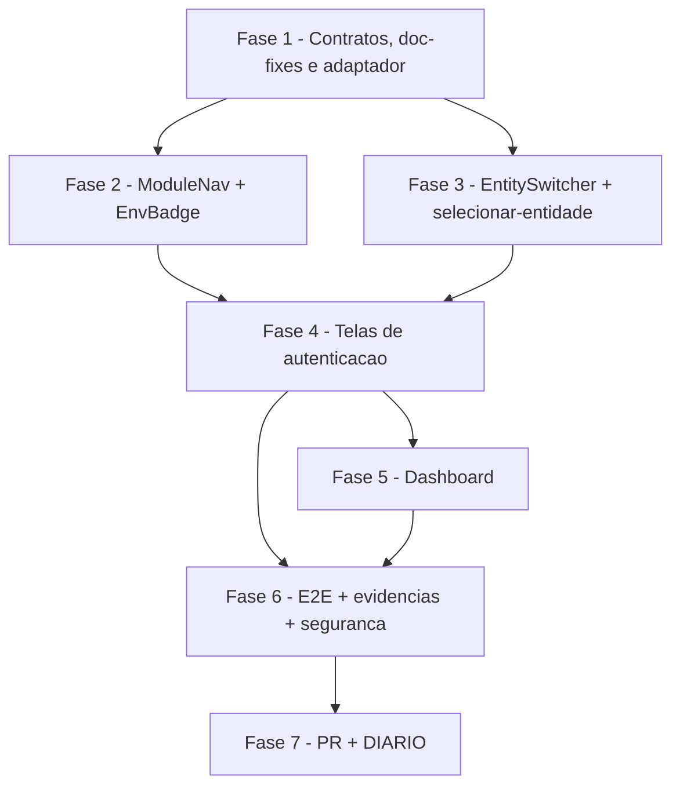

# Tarefas hub-shell - Shell Modular do Hub (S3)

Escopo: casca de navegação do painel do hub sobre as fundações da S2 — `ModuleNav`
data-driven por permissão, `EntitySwitcher`/seleção de entidade, `EnvBadge`, telas de
autenticação (login, recuperação/redefinição de senha, perfil, logout), `/dashboard`
por módulo, E2E na homolog isolada e fechamento (PR + DIARIO). Sem telas de módulo de
negócio (S4–S9), sem DDL, sem tocar o auth legado do envio em massa.

**Legenda de status:**
- `[ ]` Pendente
- `[~]` Em andamento
- `[x]` Concluido
- `[!]` Bloqueado

**Legenda de criticidade:**
- `[C]` Critico - Impacto financeiro direto ou bloqueante
- `[A]` Alto - Funcionalidade essencial
- `[M]` Medio - Necessario mas sem urgencia imediata

---

## FASE 1 - Contratos, Correções de Documentação e Adaptador de Borda

### 1.1 Corrigir follow-up do checklist de requisitos (CHK010 + CHK015) `[A]`

Ref: `checklists/requirements.md` CHK010/CHK015; `plan.md` §1.3/§8;
`docs/specs/hub-fundacoes/quickstart.md` linhas 35/52/55; `hub-auth.js` linhas ~151-160

- [x] 1.1.1 Corrigir `plan.md` §8 (exemplo de teste E2E): trocar o código de permissão
  citado `usuarios.manage` → `usuarios.gerenciar` (código real seedado pela fundação S2)
- [x] 1.1.2 Substituir a rota-exemplo `/usuarios` (inexistente nesta fase — módulos de
  negócio são S4-S9) por um alvo real e exercitável do cenário "403 por acesso direto
  via URL sem permissão": usar `GET /api/v1/auditoria` (já protegida por
  `requirePermission('auditoria.consultar')` na S2) como alvo do teste; documentar essa
  substituição em `plan.md` §8
- [x] 1.1.3 Corrigir `spec.md` FR-014 e a nota "Decisões de infraestrutura": trocar
  "5 falhas consecutivas / 15 minutos" pelo valor real do `authRateLimiter` que protege
  `/login` e `/recuperar-senha` (`max: 10` / `windowMs: 15*60*1000`, chave `ip:email` —
  evidência `hub-auth.js` linhas ~151-160); manter documentado, sem confundir, que o
  bloqueio de conta por falha de LOGIN da S2 é um mecanismo DIFERENTE e continua correto
- [x] 1.1.4 [teste/verificação] `grep` em `spec.md`/`plan.md` confirmando que nenhum
  outro trecho ainda cita `usuarios.manage`, `/usuarios` ou "5 falhas consecutivas"
  fora do contexto já corrigido

### 1.2 Reverificar contratos de backend por leitura direta (auth + /me) `[C]`

Ref: `plan.md` §1.1/§1.3, `research.md` D1; achados desta onda (create-tasks)

- [x] 1.2.1 Reler `app_homologacao/backend/routes/hub-me.js`: reconfirmar shape exato de
  `GET /me` e `POST /me/entidade` no momento de codar (o plano já verificou; esta task
  reconfirma antes do adaptador) — CONFIRMADO: shape bate 1:1 com `data-model.md` §1
  (`usuario{id,email,nome}`, `entidades[]{empresa_id,papel,ativo}`, `entidade_ativa`,
  `modulos[]{codigo,nome,icone,ordem,ativo}`, `permissoes[]`); `POST /me/entidade` confirma
  `{empresa_id}` → `200{entidade_ativa}` / `400 EMPRESA_ID_INVALIDO` / `403 SEM_VINCULO`
- [x] 1.2.2 Reler `app_homologacao/backend/routes/hub-auth.js`: confirmar as 5 rotas reais
  (`/login`, `/refresh`, `/logout`, `/recuperar-senha`, `/redefinir-senha`) e os parâmetros
  de cada uma — CONFIRMADO via `grep -n router.post`: linhas 216/351/441/471/535; login
  `{email,senha}`, recuperar-senha `{email}`, redefinir-senha `{token,nova_senha}`,
  refresh/logout só cookies (sem body)
- [x] 1.2.3 Confirmar a ausência de endpoint de "troca de senha autenticada" (com senha
  atual) — achado desta onda: **não existe** rota dedicada no backend. Decisão adotada: a
  tela de perfil (FR-011) reusa o fluxo já existente `POST /recuperar-senha` (para o
  e-mail da própria sessão) + `POST /redefinir-senha` (com o token recebido por e-mail),
  em vez de exigir um endpoint novo — preserva a fronteira dec-010 (sem nova lógica de
  backend). Registrar Decisão auditável (`state-decisions.sh`) antes de iniciar a Fase 4
  — REGISTRADO: dec-030
- [x] 1.2.4 [teste] Smoke do proxy `app/api/[...path]/route.ts` contra `/api/v1/me`:
  confirmar o path de fato encaminhado ao backend. **Achado desta onda a investigar
  primeiro**: o proxy remove só o prefixo `/api` da URL recebida
  (`path = url.pathname.replace(/^\/api/, '')`), logo `/api/v1/me` chega a
  `${BACKEND_URL}/v1/me`; o backend está montado em `/api/v1/me`
  (`server.js` linha 2610) — se `BACKEND_URL` não incluir o sufixo `/api`, há
  descompasso de rota. Confirmar o valor real de `BACKEND_URL` no ambiente hub-homolog e
  corrigir (env var do serviço frontend, ou ajuste do proxy) antes de prosseguir —
  **bloqueante** para toda a Fase 1 em diante caso o mismatch se confirme
  — CONFIRMADO POR LEITURA (sem live smoke possível: `infra/hub/compose.hub.homolog.yml`
  ainda NÃO tem serviço de frontend — só `backend`, criado na task 6.1.2): mismatch é REAL
  em tese, mas NÃO ativo hoje. Resolução: NÃO editar `route.ts` (compartilhado com o
  frontend_v2 legado de produção — risco de blast radius); documentado em `plan.md` §3.1 o
  contrato correto para quando o serviço existir: `BACKEND_URL=http://backend:3000/api`
  (hostname interno do compose + `/api`). Decisão registrada: dec-031

### 1.3 Adaptador de borda `lib/hub/me-dto.ts` + tipos de domínio `[C]`

Ref: `plan.md` §2/§6, `data-model.md` §1-3

- [x] 1.3.1 Definir `MeResponseDTO`, `TrocarEntidadeReqDTO`, `TrocarEntidadeRespDTO`
  (snake_case, espelho literal do contrato §1.1/§1.2 do plano) — `lib/hub/me-dto.ts`
- [x] 1.3.2 Definir tipos de domínio `HubUsuario`, `HubVinculo`, `HubModulo`, `HubMe`
  (camelCase; `HubModulo` **não** propaga o campo `ativo` do DTO — decisão D2: presença
  no array já significa habilitado+visível)
- [x] 1.3.3 Implementar `toHubMe(dto)` e `toTrocarEntidadeReq(empresaId)`
- [x] 1.3.4 [teste] Teste unitário de paridade: os campos snake do `MeResponseDTO` batem
  1:1 com o select real de `hub-me.js`; cobre a degradação `entidadeAtiva: null`
  (perda de vínculo — FR-015) — `lib/hub/me-dto.test.ts`, 8/8 verdes (vitest introduzido
  nesta task via dec-032: frontend_v2 não tinha runner; `npx tsc --noEmit` e `npx eslint`
  limpos)

### 1.4 `contexts/hub-auth-context.tsx` (provider novo, legado intocado) `[C]`

Ref: `plan.md` §3.1, `research.md` D4

- [x] 1.4.1 Implementar o provider expondo: `usuario`, `entidades`, `entidadeAtiva`,
  `modulos`, `permissoes`, `carregando`, `login()`, `logout()`,
  `trocarEntidade(empresaId)`, `refetchMe()` — `contexts/hub-auth-context.tsx`. Achado
  registrado (dec-033): `hub-auth.js` não emite códigos-enum (`CREDENCIAIS_INVALIDAS`/etc.),
  só texto humano em `erro`; `HubApiError.status` (HTTP) é o discriminador real — documentado
  no arquivo para orientar a task 4.1.2
- [x] 1.4.2 Confirmar (leitura + `git diff` ao final da feature) que
  `contexts/auth-context.tsx` (legado do envio em massa) permanece intocado — FR-018/SC-007
  — CONFIRMADO: `git diff --stat`/`git status --short` vazios para o arquivo
- [x] 1.4.3 [teste] Teste smoke do provider com `/me` mockado: estado inicial,
  `refetchMe()` atualiza `me`, `logout()` limpa o estado — `contexts/hub-auth-context.test.tsx`,
  4/4 verdes (+ caso extra: degradação 401→deslogado sem lançar)

---

## FASE 2 - ModuleNav + EnvBadge

### 2.1 `EnvBadge` + `NEXT_PUBLIC_APP_ENV` `[A]`

Ref: `plan.md` §3.2, `research.md` D6, `checklists/requirements.md` CHK029

- [x] 2.1.1 Introduzir a env var pública `NEXT_PUBLIC_APP_ENV` (documentar em
  `.env.example`/README do `frontend_v2` — não existia, verificado por `grep`)
- [x] 2.1.2 Implementar `EnvBadge`: banner fixo + favicon alternativo quando o valor
  for `!= "production"` — `components/hub/env-badge.tsx`
- [x] 2.1.3 Fail-safe (decisão CHK029): valor **ausente** ou **não reconhecido** (nem
  `"production"` nem outro valor válido) é tratado como **não-produção** — mostra o
  aviso; evita que uma env mal configurada esconda silenciosamente o alerta
- [x] 2.1.4 Montar `EnvBadge` no layout raiz do shell — presente em 100% das telas
  (FR-008/SC-004) — `app/layout.tsx`. Achado: o "layout raiz do shell" hoje É o
  `app/layout.tsx` compartilhado (o shell ainda não tem rotas próprias — chegam nas
  fases 3-5); montar ali garante 100% das telas já existentes, sem duplicar layout
- [x] 2.1.5 Design via `/ui-ux-pro-max` (EntreGô 2.0, dark/light, white-label — FR-017)
  — usa tokens `bg-warning`/`text-warning-foreground` já definidos no design system
  (`app/globals.css`), preservando dark/light e white-label sem cor nova
- [x] 2.1.6 [teste] Teste unitário dos 3 casos: `"production"` (ausente),
  `"homologacao"`/`"staging"` (presente), valor ausente/inválido (presente — fail-safe)
  — `components/hub/env-badge.test.tsx`, 7/7 verdes

### 2.2 `ModuleNav` data-driven `[C]`

Ref: `plan.md` §3.2, `data-model.md` §5

- [x] 2.2.1 Renderizar itens a partir de `me.modulos` — a **presença** no array já
  significa "visível" (D2); ordenar por `ordem`; ícone por `icone` —
  `components/hub/module-nav.tsx` (`useModuleNavItems`/`ModuleNav`). Achado desta
  onda (grep em `infra/hub/migrations/`): `Modulo.icone` é `text NULL`
  (0003_papel_permissao_modulo.sql linha 17) e o seed atual
  (0007_seed_papeis_permissoes_modulos.sql) não povoa `icone` — chega `null` na
  prática hoje; `resolveModuleIcon` (lib/hub/module-nav.ts) é fail-safe (mesmo
  espírito do EnvBadge/CHK029): `icone` ausente/não reconhecido cai num ícone padrão,
  nunca omite o item do menu
- [x] 2.2.2 Mapeamento `codigo` → rota `/dashboard/<codigo>` como função pura, sem lista
  fixa de módulos (FR-001/SC-001) — `moduloParaRota` em `lib/hub/module-nav.ts`
- [x] 2.2.3 Responsivo: drawer no mobile (reusar o padrão do header responsivo já
  existente no painel) — `Sheet`/`SheetClose` igual a `components/header.tsx`;
  sidebar fixa em telas `>= lg`
- [x] 2.2.4 Design via `/ui-ux-pro-max` — tokens `bg-sidebar`/`sidebar-foreground`/
  `sidebar-primary`/`sidebar-border` do design system (já existentes em
  `app/globals.css`), preservando dark/light e white-label
- [x] 2.2.5 [teste] Teste unitário do mapeamento módulo→rota + fixture com 2 conjuntos
  de permissão diferentes confirmando itens de menu distintos (base para SC-001/SC-005)
  — `lib/hub/module-nav.test.ts` (5/5) + `components/hub/module-nav.test.tsx` (4/4)

---

## FASE 3 - EntitySwitcher e Seleção de Entidade

### 3.1 Evoluir `components/empresa-selector.tsx` → `EntitySwitcher` `[C]`

Ref: `plan.md` §3.2/§1.2, `research.md` D9, spec.md US2

- [x] 3.1.1 Consumir `entidades[]` + `entidadeAtiva` do `HubAuthProvider` —
  `components/hub/entity-switcher.tsx` (`useEntitySwitcher`). Componente NOVO
  (não edita `empresa-selector.tsx` legado — FR-018/SC-007); retorna `null` com
  0/1 vínculo (nada a trocar)
- [x] 3.1.2 `Select` Base UI: `items` no `Root` (mesmo padrão de
  `app/dashboard/motoristas/page.tsx`) — rótulo exibido no gatilho vem do array
  `items`, não do valor cru
- [x] 3.1.3 Troca de entidade: `POST /me/entidade` → em sucesso, `refetchMe()` recarrega
  todo o contexto (FR-005/FR-007/SC-003) — delegado a `trocarEntidade()` já
  implementado em `hub-auth-context.tsx` (task 1.4), sem lógica de rede nova
- [x] 3.1.4 Tratar `400 EMPRESA_ID_INVALIDO` / `403 SEM_VINCULO`: manter a entidade
  anterior selecionada, sem quebrar a sessão (FR-006) — `trocarEntidade()` só chama
  `refetchMe()` em sucesso, então `entidadeAtiva` já preserva o valor anterior no
  erro; o componente só exibe a mensagem (`HubApiError.message`) via `role="alert"`
- [x] 3.1.5 Design via `/ui-ux-pro-max` — reusa tokens/padrões já validados
  (`bg-destructive/10`/`text-destructive` do `empresa-selector.tsx`, `Select`
  Base UI do design system), sem introduzir cor nova; dark/light e white-label
  preservados (mesmos tokens CSS)
- [x] 3.1.6 [teste] `components/hub/entity-switcher.test.tsx`, 9/9 verdes: lógica de
  troca isolada via `renderHook` (troca válida chama `trocarEntidade` e não seta
  erro; recusa 403 mantém a entidade anterior — `value` permanece a "anterior" —
  e não navega; erro genérico usa fallback; valor igual ao atual é no-op) +
  smoke do componente (0/1/2+ vínculos, rótulo exibido). Achado registrado
  (decisão auditável): `entidades[]` do `/me` não traz nome de empresa (tabela
  `Empresa` mora fora do banco do hub) — rótulo é `"Empresa #<id> — <papel>"`

### 3.2 Rota `/selecionar-entidade` `[A]`

Ref: `plan.md` §3.4, spec.md FR-003/FR-004/FR-016

- [x] 3.2.1 `entidades.length > 1` → exibe a tela de seleção antes de liberar o
  restante da navegação — `app/selecionar-entidade/page.tsx` (`TelaEscolha`),
  `HubAuthProvider` montado via `app/selecionar-entidade/layout.tsx` (layout de
  segmento — o shell ainda não tem layout raiz próprio)
- [x] 3.2.2 `entidades.length === 1` → seleciona automaticamente (`useEffect` +
  guard por `ref`, disparo único; `queueMicrotask` evita
  `react-hooks/set-state-in-effect`) e segue a `/dashboard`, sem exigir escolha
  manual; idempotente (pula o `POST` se já é a entidade ativa)
- [x] 3.2.3 `entidades.length === 0` → tela dedicada "sem acesso" (FR-016), mensagem
  clara + saída via logout (sem navegação quebrada ou vazia)
- [x] 3.2.4 Design via `/ui-ux-pro-max` — `Card`/`Button` do design system
  (mesmos tokens EntreGô 2.0), estados de carregamento com `role="status"`,
  erro com `role="alert"`
- [x] 3.2.5 [teste] `app/selecionar-entidade/page.test.tsx`, 7/7 verdes: os 3 ramos
  (`>1`/`==1`/`==0`) + carregando + idempotência (`==1` já ativa não repete o
  `POST`) + recusa 403 mantém a tela de escolha com erro visível sem navegar

---

## FASE 4 - Telas de Autenticação

### 4.1 `/hub/login` `[C]` `[x]`

Ref: `plan.md` §1.3/§3.4/§3.4-bis, spec.md US2/Q2-dec-008

> Achado dec-039/dec-041: rota movida para `/hub/login` (era `/login` no plano
> original) — `app/login/page.tsx` já existe como página do envio-massa
> legado. Ver `plan.md` §3.4-bis.

- [x] 4.1.1 Formulário de login consumindo `POST /api/v1/auth/login`
- [x] 4.1.2 Tratar somente os erros reais: `CREDENCIAIS_INVALIDAS` / `CONTA_BLOQUEADA` /
  `RATE_LIMIT` (nunca mensagem de "sem vínculo" — o login nunca recusa por isso)
- [x] 4.1.3 Pós-login: encaminha sempre a `/selecionar-entidade`, que decide o fluxo por
  `entidades.length` (conforme os ramos da task 3.2) — evita duplicar a lógica de branching
- [x] 4.1.4 Design via `/ui-ux-pro-max` (reuso do vocabulário visual já validado: aurora hero +
  Card glass, Wordmark, ThemeToggle — mesmo padrão do `/login` legado)
- [x] 4.1.5 [teste] Teste unitário dos 3 erros de login + smoke de login válido (5/5 vitest)

### 4.2 `/hub/recuperar-senha` `[A]` `[x]`

Ref: `plan.md` §1.3/§3.4-bis, spec.md FR-012/FR-014

- [x] 4.2.1 Formulário de e-mail consumindo `POST /api/v1/auth/recuperar-senha`
- [x] 4.2.2 Exibir sempre a mesma resposta de sucesso — nunca revelar se o e-mail existe
  ou não na base (FR-012)
- [x] 4.2.3 UI trata `429` do `authRateLimiter` (max:10/15min por ip+email, corrigido na
  task 1.1.3) sem quebrar a experiência (mensagem clara de "tente novamente mais tarde")
- [x] 4.2.4 Design via `/ui-ux-pro-max` (Card centrado, mesmo vocabulário visual de
  `/selecionar-entidade`)
- [x] 4.2.5 [teste] Teste unitário: resposta de sucesso idêntica para e-mail
  existente/inexistente (mock); tratamento do `429` (3/3 vitest)

### 4.3 `/hub/redefinir-senha` `[A]` `[x]`

Ref: `plan.md` §1.3/§3.4-bis

- [x] 4.3.1 Consome o token (query string, do link recebido por e-mail) + formulário de
  nova senha
- [x] 4.3.2 Validação mínima client-side (>=8 caracteres, só UX — o servidor é a
  autoridade)
- [x] 4.3.3 Tratar `400` (token/senha ausentes ou senha curta), `400 token inválido` e
  `410 token expirado` com mensagens claras e distintas
- [x] 4.3.4 Design via `/ui-ux-pro-max` (Card centrado, mesmo vocabulário visual de
  `/selecionar-entidade`)
- [x] 4.3.5 [teste] Teste unitário dos 3 erros + fluxo de sucesso (mock) (5/5 vitest)

### 4.4 `/hub/dashboard/perfil` (dados de conta + troca de senha) `[A]` `[x]`

Ref: `plan.md` §3.4/§3.4-bis, spec.md FR-011, decisão da task 1.2.3

- [x] 4.4.1 Exibir `usuario.nome`/`usuario.email` (somente leitura, vêm de `/me`)
- [x] 4.4.2 "Trocar senha": aciona o mesmo fluxo das tasks 4.2+4.3, pré-preenchendo o
  e-mail da própria sessão (decisão 1.2.3 — reuso do fluxo de recuperação de senha, sem
  endpoint novo de backend; implementado como 1 clique chamando `recuperarSenha(usuario.email)`
  diretamente, sem formulário — e-mail já é conhecido da sessão)
- [x] 4.4.3 Botão de logout sempre visível nesta área (infraestrutura do shell — spec
  Q5/dec-011, não conta como módulo)
- [x] 4.4.4 Design via `/ui-ux-pro-max`
- [x] 4.4.5 [teste] Teste unitário: exibição correta dos dados + acionamento do fluxo
  de troca de senha (4/4 vitest, inclui logout)

### 4.5 Logout + guard de rota (refetch de sessão) `[C]` `[x]`

Ref: `plan.md` §3.4, spec.md FR-013/FR-015/Q3-dec-009, `checklists/requirements.md` CHK017

- [x] 4.5.1 `logout()`: `POST /api/v1/auth/logout` → limpa o estado do
  `HubAuthProvider` → redireciona a `/hub/login` (já existia em `hub-auth-context.tsx`
  desde a task 1.4; wiring do botão + redirect na task 4.4.3/perfil)
- [x] 4.5.2 Guard de rota: cada navegação entre rotas do shell dispara `refetchMe()`
  (spec Q3/dec-009 — sem polling temporizado); perda de vínculo é refletida no próximo
  refetch (FR-015) — `components/hub/session-guard.tsx`, montado em `app/hub/layout.tsx`
- [x] 4.5.3 Tratar requisição *in-flight* que recebe `401` (sessão expira em meio de uma
  ação, ex.: troca de entidade ou submissão do perfil): limpa o estado da sessão anterior
  imediatamente via `authenticatedFetch` (`contexts/hub-auth-context.tsx`) — o guard reage
  ao `usuario===null` resultante e redireciona a `/hub/login`, sem expor dados a uma
  próxima pessoa no mesmo dispositivo (edge case CHK017)
- [x] 4.5.4 [teste] Teste unitário/integração: guard dispara refetch a cada navegação
  (mock, 7/7 `session-guard.test.tsx`); simular perda de vínculo (`entidade_ativa: null`) reflete na navegação
  (`hub-auth-context.test.tsx` — refetchMe atualiza qualquer campo do `me`, incl. entidade
  ativa); simular `401` in-flight redireciona e limpa o estado (`hub-auth-context.test.tsx`
  "401 in-flight em trocarEntidade limpa o estado imediatamente").

---

## FASE 5 - Dashboard

### 5.1 `/hub/dashboard` — cards por módulo `[A]`

Ref: `plan.md` §3.4/§3.4-bis, spec.md US4/FR-009/FR-010

> Achado dec-039/dec-041 (Fase 4): rota movida para `/hub/dashboard` (era `/dashboard`) —
> `app/dashboard/page.tsx` já existe como página do envio-massa legado, e o próprio
> `moduloParaRota` (task 2.2, corrigido na Fase 4) já deriva `/hub/dashboard/<codigo>`.
> Esta página vive em `app/hub/dashboard/page.tsx`, dentro do namespace já montado por
> `app/hub/layout.tsx` (HubAuthProvider + guard) — só falta criar o `page.tsx` em si.

- [x] 5.1.1 Renderizar N blocos a partir de `me.modulos` (um por módulo habilitado e
  visível), cada um levando à rota mapeada (task 2.2.2)
- [x] 5.1.2 Estado "nenhum módulo disponível": mensagem clara quando
  `modulos.length === 0` (nunca uma tela vazia sem explicação — FR-010)
- [x] 5.1.3 Design via `/ui-ux-pro-max`
- [x] 5.1.4 [teste] Teste unitário dos 2 cenários (N>0 blocos; N=0 mensagem clara)

---

## FASE 6 - E2E, Evidências e Segurança

### 6.1 Preparar ambiente E2E na homolog isolada `[C]`

Ref: `plan.md` §4/§8

- [x] 6.1.1 Confirmar/gerar (via seeds `hub_*` já existentes da S2) 2 contas com papéis
  diferentes e conjuntos de permissão distintos, para o teste comparativo
- [x] 6.1.2 Build do `frontend_v2` sob cap de memória (`docker build --memory=2g`, swap
  ativo) — nunca `next build`/`next dev` solto no host VPSTodo
- [x] 6.1.3 [teste] Smoke: ambiente hub-homolog responde `200` nas rotas novas antes de
  rodar os cenários E2E

### 6.2 Cenários E2E funcionais `[C]`

Ref: `plan.md` §8, task 1.1.2

- [x] 6.2.1 2 papéis distintos autenticam e veem conjuntos de itens de `ModuleNav`
  diferentes (SC-001/SC-005)
- [x] 6.2.2 Acesso direto por URL a `GET /api/v1/auditoria` sem `auditoria.consultar`
  recebe `403` do backend mesmo sem aparecer no menu (SC-002 — alvo real confirmado na
  task 1.1.2, substitui o exemplo inexistente `/usuarios`)
- [x] 6.2.3 Troca de entidade reflete os dados exibidos em menos de 5 segundos, sem
  novo login (SC-003)
- [x] 6.2.4 Banner de ambiente (`EnvBadge`) visível em toda tela do shell quando
  `NEXT_PUBLIC_APP_ENV != production` (SC-004)
- [x] 6.2.5 Sessão expira em meio de uma ação (troca de entidade / submissão de perfil)
  → redireciona a `/login` sem expor dados da sessão anterior (edge case CHK017,
  task 4.5.3)
- [x] 6.2.6 Login de pessoa sem vínculo em nenhuma entidade → tela "sem acesso"
  (FR-016), sem tela quebrada ou vazia

### 6.3 Acessibilidade `[A]`

Ref: `plan.md` §8

- [x] 6.3.1 Rodar `axe` nas telas novas (login, recuperar-senha, redefinir-senha,
  selecionar-entidade, dashboard, perfil) — meta ≥95
- [x] 6.3.2 Corrigir achados abaixo de 95 antes de fechar a fase

### 6.4 Gate de segurança sobre a implementação real `[C]`

Ref: `plan.md` §9, dec-019 (arquitetural, onda plan)

- [x] 6.4.1 Revalidar contra o código real: `PermissionGate` segue decorativo (nenhuma
  ação sensível autorizada só no client); cookie httpOnly/`sameSite=strict` preservado;
  nenhum PII/segredo novo em git/log
- [x] 6.4.2 [teste] Confirmar por leitura de código que nenhuma tela nova introduz
  chamada de mutação sem depender de reautorização do backend por-entidade

### 6.5 Evidências `[A]`

- [x] 6.5.1 Prints por papel (as 2 contas da task 6.1.1, menus diferentes)
- [x] 6.5.2 Resultado do `axe` (≥95) por tela
- [x] 6.5.3 Resultado dos cenários E2E (6.2.1–6.2.6)
- [x] 6.5.4 Consolidar evidências em `docs/specs/hub-shell/evidencias/`

---

## FASE 7 - PR e Encerramento

### 7.1 Abrir PR `feat/hub-shell` → `main` `[M]`

- [x] 7.1.1 Descrição do PR: resumo das 7 fases, evidências linkadas, gates rodados
  (doc-quality, security, template-fidelity, docs-render) — escrita em
  `docs/specs/hub-shell/PR-BODY.md`
- [ ] 7.1.2 [teste] Confirmar CI verde (lint + testes unitários) antes de solicitar
  revisão do operador — **PAI executa** (push + `gh pr create` com o corpo de
  `PR-BODY.md`; CI só roda após o push)

### 7.2 Atualizar `docs/plans/hub-frota/DIARIO.md` `[M]`

- [x] 7.2.1 Registrar o fechamento da S3: PR, evidências, decisões-chave (1.2.3 — troca
  de senha via reuso do fluxo de recuperação; 1.2.4 — achado de descompasso do proxy;
  CHK010/CHK015 corrigidos) — entrada "2026-07-07 — S3 (Shell Modular do Hub)
  CONCLUÍDA" adicionada ao DIARIO.md

---

## Matriz de Dependencias

## Resumo Quantitativo

| Fase | Tarefas | Subtarefas | Criticidade |
|------|---------|------------|-------------|
| 1 - Contratos, doc-fixes e adaptador | 4 | 15 | C |
| 2 - ModuleNav + EnvBadge | 2 | 11 | C |
| 3 - EntitySwitcher + selecionar-entidade | 2 | 11 | C |
| 4 - Telas de autenticação | 5 | 24 | C |
| 5 - Dashboard | 1 | 4 | A |
| 6 - E2E + evidências + segurança | 5 | 17 | C |
| 7 - PR + DIARIO | 2 | 3 | M |
| **Total** | **21** | **85** | - |

## Escopo Coberto

| Item | Descricao | Fase |
|------|-----------|------|
| CHK010/CHK015 | Correção de código de permissão, rota-exemplo e número de rate-limit citados incorretamente | 1 |
| Reverificação de contrato | Reconfirmação de `hub-me.js`/`hub-auth.js` + achado de descompasso do proxy `/api` | 1 |
| Adaptador de borda | `lib/hub/me-dto.ts` (snake↔camel, paridade testada) | 1 |
| `HubAuthProvider` | Contexto de auth novo do hub, legado intocado | 1 |
| `EnvBadge` | Aviso de ambiente não-produção + fail-safe (CHK029) | 2 |
| `ModuleNav` | Navegação data-driven por `modulos[]`, sem hardcode | 2 |
| `EntitySwitcher` | Troca de entidade ativa | 3 |
| `/selecionar-entidade` | 3 ramos pós-login por quantidade de vínculos | 3 |
| `/login` | Autenticação + roteamento pós-login | 4 |
| `/recuperar-senha` / `/redefinir-senha` | Fluxo de recuperação de senha (self-service) | 4 |
| `/dashboard/perfil` | Dados de conta + troca de senha (reuso do fluxo de recuperação) | 4 |
| Logout + guard de rota | Encerramento de sessão + reverificação por navegação (FR-015) | 4 |
| `/dashboard` | Cards por módulo + estado "sem módulo" | 5 |
| E2E + evidências | Cenários SC-001..SC-005, axe ≥95, prints | 6 |
| Gate de segurança pós-implementação | Revalidação do modelo decorativo do `PermissionGate` | 6 |
| PR + DIARIO | Fechamento da S3 | 7 |

## Escopo Excluído

| Item | Descricao | Motivo |
|------|-----------|--------|
| Telas de módulo de negócio | Motoristas, faturamento, performance, importações (S4-S9) | Fora do escopo desta fase — o shell entrega só a casca |
| Migration/DDL nova | Qualquer coluna, tabela ou índice novo | Plano §7/dec-016: `/me` atual cobre 100% dos dados do shell |
| Edição do auth legado | `contexts/auth-context.tsx` (envio em massa) | FR-018/SC-007: comportamento existente não pode mudar |
| Endpoint novo de troca de senha autenticada | `POST /auth/trocar-senha` (com senha atual) | Fora da fronteira dec-010 (só ajuste trivial de contrato já existente); resolvido por reuso do fluxo de recuperação (task 1.2.3/4.4.2) |
| Renomear `modulos[].ativo` → `habilitado` no backend | Alinhar literalmente ao termo da spec Q1 | dec-014: seria mexer no contrato S2 sem ganho (campo seria sempre `true`); presença no array já basta |
| Filtro `<codigo>.view` redundante no client | Refiltrar `modulos[]` no frontend por convenção de permissão | dec-014/D2: duplicaria lógica do backend e divergiria do critério real (violaria SC-001) |
| Polling temporizado de sessão | Verificação periódica de vínculo por timer | Spec Q3/dec-009: guard de rota por navegação é suficiente, sem fonte pedindo timer |
| Novo FR formal para "PermissionGate é decorativo" | Formalização do achado CHK008 como requisito numerado | {humano} — decisão de produto pendente do dono do produto, não bloqueia a execução (mitigação já documentada em plan §3.3/dec-015) |
