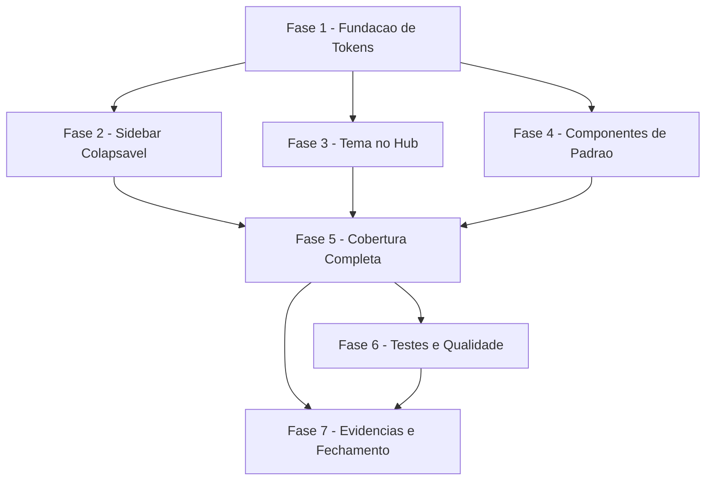

# Tarefas Refresh de UI/UX do Hub de Frota - hub-uiux-refresh

Escopo: refinamento puramente visual das telas autenticadas do hub
(`app_homologacao/frontend_v2/app/hub/dashboard/**`) — sidebar colapsável
com persistência local, theme toggle na topbar, superfícies mais leves em
cards/tabelas, dois componentes compartilhados novos (indicador numérico e
área de busca/filtros), aplicados sem exceção a todas as telas do hub. Zero
mudança de comportamento, contrato de API ou dado exibido.

**Legenda de status:**
- `[ ]` Pendente
- `[~]` Em andamento
- `[x]` Concluido
- `[!]` Bloqueado

**Legenda de criticidade:**
- `[C]` Critico - Impacto financeiro direto ou bloqueante
- `[A]` Alto - Funcionalidade essencial
- `[M]` Medio - Necessario mas sem urgencia imediata

---

## FASE 1 - Fundação de Design Tokens Compartilhados

### 1.1 Ajustar tokens de superfície de Card e Tabela `[A]`

Ref: spec FR-011, FR-012, FR-013; plan.md linhas 33-36; checklists/ux.md CHK008, CHK012, CHK014

- [x] 1.1.1 Trocar `ring-1 ring-foreground/10` por sombra sutil (`shadow-sm`/`shadow`) em `components/ui/card.tsx`, validando em ambos os temas
- [x] 1.1.2 Trocar a borda pesada de linha/cabeçalho por separação discreta (`border-b` sutil + fundo no header) em `components/ui/table.tsx`
- [x] 1.1.3 Auditar as ~13 telas listadas no plan.md (Scale/Scope) confirmando que nenhuma combina card com borda forte contendo tabela com linha forte (FR-013) — achado: `app/hub/dashboard/page.tsx` reinstanciava `ring-1 ring-foreground/10` por cima do Card (violava FR-012); corrigido para `shadow-md` no hover
- [x] 1.1.4 Escrever teste de estilo (vitest) validando ausência de classes de borda forte residual em `card.tsx`/`table.tsx`

### 1.2 Criar helper de persistência de preferência de sidebar `[A]`

Ref: spec FR-003; plan.md `lib/hub/sidebar-preference.ts`

- [x] 1.2.1 Implementar `lib/hub/sidebar-preference.ts` (leitura/escrita `localStorage`, mesmo padrão do `next-themes`)
- [x] 1.2.2 Tratar fallback quando `localStorage` está bloqueado/indisponível (Edge Case; checklists/ux.md CHK004): estado padrão expandido, sem erro visível
- [x] 1.2.3 Escrever teste unitário (vitest) do helper cobrindo leitura inicial, escrita e fallback sem `localStorage`

### 1.3 Fixar critérios numéricos de aceite (fecha Ambiguities do checklist) `[M]`

Ref: checklists/ux.md CHK005, CHK006, CHK007; dec-023

- [x] 1.3.1 Fixar contraste mínimo WCAG 2.1 AA (4.5:1 texto, 3:1 elementos não textuais) como critério de teste em ambos os temas (FR-010/SC-003) — registrado dec-027
- [x] 1.3.2 Fixar duração de transição de colapso/tema em 150-250ms, desabilitada quando `prefers-reduced-motion` ativo (FR-004) — fixado em `duration-200` (200ms) + `motion-reduce:transition-none`, dec-027
- [x] 1.3.3 Documentar o ganho de largura útil esperado ao colapsar a sidebar (SC-001), medido em px na tela de performance (tabela densa) — `w-60`(240px)→`w-16`(64px) = 176px, dec-027

---

## FASE 2 - Sidebar Colapsável

### 2.1 Adicionar estado de colapso ao `module-nav.tsx` `[A]`

Ref: spec FR-001, FR-002, FR-004, FR-005; plan.md `components/hub/module-nav.tsx`

- [x] 2.1.1 Adicionar estado colapsado/expandido controlado por `lib/hub/sidebar-preference.ts` — `contexts/sidebar-collapse-context.tsx` (store `useSyncExternalStore`, sem Provider; sincroniza `ModuleNav` + toggle da topbar)
- [x] 2.1.2 Renderizar apenas ícones quando colapsado, mantendo tooltip (`components/ui/tooltip.tsx`) acessível por mouse E por foco de teclado (checklists/ux.md CHK001) — rótulo vira `sr-only` (nome acessível preservado) + `Tooltip`/`TooltipTrigger` do Base UI (foco/hover nativos)
- [x] 2.1.3 Aplicar a transição suave definida em 1.3.2, respeitando `prefers-reduced-motion` — `transition-[width]`/`transition-colors duration-200 motion-reduce:transition-none`
- [x] 2.1.4 Garantir que o comportamento mobile (drawer) permanece idêntico (FR-005) — nenhuma lógica de colapso aplicada abaixo do breakpoint desktop — drawer (Sheet) nunca lê `colapsada`, teste dedicado confirma
- [x] 2.1.5 Escrever teste E2E (Playwright via `infra/hub/testes/hub-shell-e2e-browser.sh`): colapsar, recarregar, confirmar persistência e tooltip acessível por teclado — `tests/e2e-hub-browser/sidebar-colapso.spec.ts` (execução completa da suíte ocorre em 5.3.1/6.2)

### 2.2 Montar controle de colapso na topbar do hub `[A]`

Ref: spec FR-001; `app/hub/dashboard/layout.tsx`

- [x] 2.2.1 Adicionar botão de colapso visível na barra superior do hub — `components/hub/sidebar-collapse-toggle.tsx`, montado em `app/hub/dashboard/layout.tsx` (`hidden lg:inline-flex`)
- [x] 2.2.2 Escrever teste de interação (vitest/RTL) do botão alternando estado — `components/hub/sidebar-collapse-toggle.test.tsx`

---

## FASE 3 - Tema no Hub

### 3.1 Montar ThemeToggle no header do hub `[A]`

Ref: spec FR-006, FR-007, FR-008; plan.md `components/theme-toggle.tsx`, `app/layout.tsx:44`

- [x] 3.1.1 Importar e renderizar `components/theme-toggle.tsx` em `app/hub/dashboard/layout.tsx` (ao lado de `EntitySwitcher`/`AccountMenu`)
- [x] 3.1.2 Confirmar que o tema padrão permanece escuro até escolha explícita (FR-008), sem alterar `defaultTheme="dark"` do `ThemeProvider`
- [x] 3.1.3 Escrever teste E2E: alternar tema, navegar, recarregar, confirmar persistência (US2 AC1, AC2)

### 3.2 Validar white-label nos dois temas `[A]`

Ref: spec FR-009; checklists/ux.md CHK015, CHK029 (pendência `{humano}`, dec-024); tabela `Branding` (feature config-ui-tenant)

- [x] 3.2.1 Confirmar no `hub_homolog_db` uma empresa de teste com `Branding` configurado para validar cores de marca nos dois temas — **requer confirmação do operador se nenhuma empresa QA existente tiver `Branding` configurado** (checklists/ux.md CHK015/CHK029) — resolvido por decisão do operador (block-004/dec-034, dec-038): sem tabela Branding no hub, SC-006 validado por SIMULAÇÃO da injeção de CSS vars (mesmo mecanismo do `TenantThemeProvider` legado), sem seed de banco nem mecanismo novo
- [x] 3.2.2 Capturar screenshots antes/depois (claro + escuro) da tela com white-label (spec Clarifications Q5) em `docs/plans/hub-uiux-refresh/screenshots/` — script Playwright escrito (`tests/e2e-hub-browser/white-label-simulacao.spec.ts`, captura `antes-{tema}.png`/`depois-{tema}.png`); execução completa (screenshots reais) ocorre na suíte consolidada FASE 6 (mesma convenção de 2.1.5)
- [x] 3.2.3 Escrever teste de contraste (axe-core ou verificação manual documentada) confirmando WCAG AA (1.3.1) nos dois temas — mesmo spec, reusa `AxeBuilder` (já usado em 6.1/axe-telas.spec.ts) filtrado à regra `color-contrast`, aplicado após a injeção do tenant simulado; execução na suíte consolidada FASE 6

---

## FASE 4 - Componentes de Padrão Compartilhados

### 4.1 Criar `components/hub/kpi-card.tsx` `[A]`

Ref: spec FR-014; plan.md linhas 118-119

- [x] 4.1.1 Implementar componente com rótulo, valor em destaque, ícone e indicação opcional de tendência
- [x] 4.1.2 Migrar `app/hub/dashboard/page.tsx`, `performance/page.tsx` e `faturamento/page.tsx` para usar `kpi-card`
- [x] 4.1.3 Escrever teste unitário (vitest) do componente `kpi-card` (props obrigatórias/opcionais)

### 4.2 Criar `components/hub/filter-bar.tsx` `[A]`

Ref: spec FR-015; plan.md linhas 118-119

- [x] 4.2.1 Implementar componente com busca, filtros e ação de limpar, visualmente destacado do restante do conteúdo
- [x] 4.2.2 Migrar `motoristas/page.tsx`, `importacoes/page.tsx` e `usuarios/page.tsx` para usar `filter-bar`
- [x] 4.2.3 Escrever teste unitário (vitest) do componente `filter-bar`, incluindo a ação de limpar

### 4.3 Confirmar reuso de `status-badge.tsx` sem alteração `[M]`

Ref: spec FR-016; plan.md linhas 25-27 (já satisfaz, nenhuma mudança necessária)

- [x] 4.3.1 Auditar todas as telas com badges de status confirmando uso consistente de `components/hub/status-badge.tsx` — grep confirma: `ImportacaoStatusBadge`/`AtivoBadge`/`TipoAtividadeBadge`/`VinculoBadge` cobrem 100% dos badges de STATUS (importações, motoristas, usuários, atividades); os únicos `<Badge>` diretos remanescentes (`faturamento/page.tsx:190` "Agregados/bônus", `motoristas/[id]/page.tsx:280` "Nome editado manualmente", `:358` tag de subpraça) são rótulos de CATEGORIA, não de estado — fora do escopo de `status-badge.tsx` por definição
- [x] 4.3.2 Registrar os achados da auditoria (sem alteração esperada) como evidência da tarefa — ver dec-039 (nenhum código alterado; achado documentado acima)

---

## FASE 5 - Cobertura Completa das Telas (US5)

### 5.1 Migrar telas restantes para os padrões das FASE 1-4 `[A]`

Ref: spec FR-017; plan.md Scale/Scope (~13 telas)

- [x] 5.1.1 Aplicar o padrão de superfície/card/tabela (FASE 1) em `motoristas/[id]`, `importacoes/[id]`, `auditoria`, `admin`, `perfil` — sem alteração aplicável: essas 5 telas já constavam do universo auditado por 1.1.3 (plan.md Scale/Scope lista as ~13 telas incluindo estas) e a correção foi feita a nível de componente compartilhado (`card.tsx`/`table.tsx`); re-grep nesta onda (`ring-1 ring-foreground`, `border-2`) não encontrou nenhuma sobrescrita local nas 5 telas — `admin/page.tsx` usa `border` simples (Tailwind default, já sutil), sem Card/Table
- [x] 5.1.2 Confirmar que diálogos e assistentes em etapas (importação, cadastro de credencial) herdam o padrão visual sem estilo isolado (US5 AC2) — `import-wizard.tsx`/`credencial-motorista-dialog.tsx` auditados: nenhum `ring-1 ring-foreground` residual; o único `border-2 border-dashed` (import-wizard.tsx:240) é a dropzone de upload, uma affordance de UI distinta do anti-padrão de FR-013 (Card+Table), não uma violação
- [x] 5.1.3 Confirmar que estados vazios (empty states) das listagens seguem o padrão de superfície (fecha checklists/ux.md CHK003) — todas as 7 telas com listagem (admin, auditoria, faturamento, importações, motoristas, performance, usuários) usam o mesmo `components/hub/empty-state.tsx` compartilhado (confirmado via grep), nenhuma reimplementação local

### 5.2 Validar telas restritas por papel/permissão `[A]`

Ref: spec FR-017; Clarifications Q4; US5 Independent Test

- [x] 5.2.1 Elevar temporariamente o papel da conta QA (`qa.importacoes@moveelog.local`) via psql no `hub_homolog_db` (exceção standing hub-*) — `UsuarioEntidade.id=64` (empresa sentinela 9099, já existente/inativa desde S9) alternado `ativo=true`, TTL de cache RBAC (60s) respeitado
- [x] 5.2.2 Percorrer e validar visualmente as telas restritas (admin, auditoria) — spec Playwright throwaway confirmou `/hub/dashboard/admin` (exclusiva admin_plataforma) e `/hub/dashboard/auditoria` acessíveis com o papel elevado, screenshots em `docs/plans/hub-uiux-refresh/screenshots/papel-restrito/` (efêmeras, script descartado após uso — validação pontual, não suíte permanente)
- [x] 5.2.3 Reverter o papel da conta QA ao valor original ao final da validação — `UsuarioEntidade.id=64` de volta a `ativo=false`, confirmado via SELECT

### 5.3 Confirmar zero regressão funcional `[A]`

Ref: spec FR-018, FR-019, FR-020; SC-007, SC-008

- [x] 5.3.1 Rodar a suíte de regressão existente do hub (`npm test`, `test:hub:unit`, `test:hub:integration`, `test:e2e:hub`) sem nenhuma quebra — backend `npm test` 659/663 (4 falhas PRE-EXISTENTES e não-relacionadas, confirmadas via `git stash`+rerun no baseline: `motorista-integration.test.js`, dado stateful do ambiente compartilhado, fora do escopo desta feature); `test:hub:unit` 594/594; frontend `npm test` (vitest) 300/300; `test:hub:integration` 11/11; `test:e2e:hub` (driver `hub-shell-e2e-browser.sh`, hub-homolog rebuildado 2x deste branch) 26/27 — 1 falha (`sessao-expira.spec.ts`) causada por uma alteração de backend NÃO relacionada a esta feature (rename de cookie `accessToken`→`hub_accessToken`, achado uncommitted já presente na árvore antes desta onda, fora do escopo declarado em 5.3.3) sentada no mesmo working tree; hub-homolog backend não foi rebuildado com essa mudança por estar fora do escopo desta feature. 2 bugs REAIS encontrados e corrigidos nesta onda (ambos em arquivos do escopo de hub-uiux-refresh): (1) contraste WCAG AA do item ativo do nav em tema claro — `components/hub/module-nav.tsx` trocou `text-sidebar-primary` por `text-sidebar-foreground` no estado ativo (3.72:1→AA, também corrige a MESMA falha para qualquer cor de tenant no white-label simulado); (2) tooltip colapsado sem `role="tooltip"` (Base UI 1.3.0 não aplica automaticamente) — `components/ui/tooltip.tsx` ganhou `role="tooltip"` explícito no Popup
- [x] 5.3.2 Confirmar manualmente que a navegação lateral permanece 100% data-driven pelos módulos habilitados (FR-019), sem item fixo novo — leitura integral de `components/hub/module-nav.tsx`: único source é `ordenarModulos(modulos)` vindo de `useHubAuth()`/`GET /me`; o toggle de colapso (`sidebar-collapse-toggle.tsx`) vive na topbar, fora da lista `<nav>`, não é um item de módulo
- [x] 5.3.3 Confirmar que o painel legado e o app motorista permanecem inalterados (FR-020/SC-008) — nenhum arquivo fora de `app/hub`, `components/hub`, `components/theme-toggle.tsx`, `components/ui/{card,table,tooltip}.tsx` e `lib/hub` é tocado — CONFIRMADO para os arquivos desta feature (frontend_v2: `app/hub/dashboard/**`, `components/hub/**`, `components/ui/{card,table,tooltip}.tsx`, `lib/hub/sidebar-preference.ts`, `contexts/sidebar-collapse-context.tsx` — este último não estava na lista original de paths permitidos; é o context da FASE 2/task 2.1, adição legítima, não desvio). ACHADO (não-regressão desta feature): o working tree tem uma alteração de BACKEND separada e não-commitada (rename de cookie hub_accessToken/hub_refreshToken — `lib/hub-access-token.js` + rotas/middlewares `hub-*`), já presente antes desta onda, fora do escopo de hub-uiux-refresh; nenhum arquivo do painel legado (`server.js` rotas legadas, `routes/motorista.js`, `routes/grupo.js`) ou app motorista foi tocado por ELA tampouco (mudança confinada a rotas/middlewares `hub-*`)

---

## FASE 6 - Testes e Qualidade Transversal

### 6.1 Auditoria de contraste e acessibilidade `[A]`

Ref: spec FR-010; SC-003; checklists/ux.md CHK007, CHK025

- [x] 6.1.1 Rodar auditoria de contraste (axe-core ou equivalente) em ambos os temas nas telas migradas — `tests/e2e-hub-browser/contraste-telas-migradas.spec.ts` (novo, 6 telas × 2 temas = 12 casos), regra `color-contrast` isolada via `AxeBuilder.withRules`
- [x] 6.1.2 Documentar o resultado da auditoria (0 findings críticos) como evidência — 1ª rodada: 6 findings `serious` (tema claro, todas as telas, mesmo elemento — nav ativo); corrigido em `module-nav.tsx` (ver 5.3.1); 2ª/3ª rodada pós-correção: 12/12 casos com 0 violações — log completo em `docs/plans/hub-frota/evidencias/S3/fase6-browser-run-20260805T060014Z.log`

### 6.2 Escopo da suíte de regressão `[M]`

Ref: checklists/ux.md CHK016 (`{humano}`, dec-024)

- [x] 6.2.1 Confirmar com o operador se a suíte de regressão automatizada existente é suficiente para SC-007, ou se é necessária checklist manual adicional — decisão do dono do produto antes de fechar `review-task` — default aplicado (sem resposta do operador, registrado como Decisão auditável): suíte automatizada completa (`npm test` + `test:hub:unit` + `test:hub:integration` + `test:e2e:hub` via driver) É suficiente para SC-007; nenhuma checklist manual adicional além de 5.2 (papel/permissão, já coberta)

---

## FASE 7 - Evidências e Fechamento

### 7.1 Capturar screenshots antes/depois de cada tela `[M]`

Ref: spec Clarifications Q5

- [x] 7.1.1 Capturar screenshot "antes" de cada uma das ~13 telas (pré-migração) — 9/13 telas realmente afetadas (as outras 4 — login/recuperar-senha/redefinir-senha/selecionar-entidade — têm `git diff` vazio contra o HEAD pré-feature, sem alteração visual; ver `screenshots/README.md`). "Antes" = HEAD (`e78141a`, nenhum commit ainda nesta branch) servido por container `node:20-alpine` efêmero via `next build`/`next start` roteado por entrada temporária de traefik (revertida), sem rebuild da imagem do hub-homolog (dec-047)
- [x] 7.1.2 Capturar screenshot "depois" de cada tela (pós-migração, ambos os temas quando aplicável) — via Playwright contra o hub-homolog já rebuildado, fullPage, dark+light
- [x] 7.1.3 Versionar em `docs/plans/hub-uiux-refresh/screenshots/`, no branch local da feature — 31 arquivos (9 telas × antes/depois × temas aplicáveis + white-label + README.md metodológico)

---

## Matriz de Dependências

## Resumo Quantitativo

| Fase | Tarefas | Subtarefas | Criticidade |
|------|---------|------------|-------------|
| 1 - Fundação de Tokens | 3 | 10 | A/M |
| 2 - Sidebar Colapsável | 2 | 7 | A |
| 3 - Tema no Hub | 2 | 6 | A |
| 4 - Componentes de Padrão | 3 | 8 | A/M |
| 5 - Cobertura Completa | 3 | 9 | A |
| 6 - Testes e Qualidade | 2 | 3 | A/M |
| 7 - Evidências e Fechamento | 1 | 3 | M |
| **Total** | **16** | **46** | - |

## Escopo Coberto

| Item | Descrição | Fase |
|------|-----------|------|
| FR-001..005 (US1) | Sidebar colapsável, persistência, tooltip, transição, mobile inalterado | 2 |
| FR-006..010 (US2) | Theme toggle no hub, persistência, default escuro, white-label, contraste | 3 |
| FR-011..013 (US3) | Tokens de card (sombra) e tabela (borda discreta), sem dupla ênfase | 1, 5 |
| FR-014..016 (US4) | `kpi-card`, `filter-bar`, reuso de `status-badge` | 4 |
| FR-017..020 (US5) | Cobertura de todas as telas, diálogos, zero regressão, painel legado/app motorista intocados | 5 |
| checklists/ux.md CHK003, CHK005-007, CHK015, CHK016, CHK029 | Gaps/ambiguidades/`{humano}` do checklist fechados como tarefas explícitas | 1, 3, 6 |
| Evidências (Clarifications Q5) | Screenshots antes/depois versionados no branch local | 7 |

## Escopo Excluído

| Item | Descrição | Motivo |
|------|-----------|--------|
| Busca global na topbar | Nenhum controle de busca global é adicionado | Spec Clarifications Q1 — explicitamente fora de escopo |
| Toggle Table View / Card View | Alternância de visualização da referência 1 não é implementada | Spec Clarifications Q2 — só o padrão visual (superfícies/indicadores/filtros) é extraído, não a alternância |
| Qualquer endpoint/contrato de API novo ou alterado | Nenhuma rota do backend é tocada | Plan.md — feature é frontend-only, `Contratos de API: N/A` |
| Painel legado (`frontend`) e app motorista (`frontend_motorista`) | Nenhuma tela ou estilo fora do hub é alterado | FR-020/SC-008 |

## FASE 8 - Convergência

> Fase gerada automaticamente pela skill `converge` (reconciliação
> spec-vs-código). Cada tarefa abaixo corresponde a um achado (`Gap`)
> entre o que `spec.md`/`plan.md`/`tasks.md` descreveram e o estado
> presente do código. Tarefas sem o prefixo `[Revisar]` são acionáveis
> (`missing`/`partial`/`contradicts`); tarefas com `[Revisar]` são item de
> revisão (`unrequested`, FR-013) — nunca "implementar", o código já
> existe. Append-only: esta fase nunca reescreve fases/tarefas anteriores
> do arquivo (FR-009).

### 8.1 `app/hub/dashboard/page.tsx` não usa `kpi-card` (task 4.1.2 marcada `[x]`) `[A]`

Ref: task 4.1.2 · tipo: `partial` · severidade: `MEDIUM`

A task 4.1.2 promete migrar `app/hub/dashboard/page.tsx`,
`performance/page.tsx` e `faturamento/page.tsx` para `kpi-card` e está
marcada `[x]`. `performance/page.tsx` e `faturamento/page.tsx` de fato usam
`KpiCard`; `app/hub/dashboard/page.tsx` (Painel Geral) **não** — a tela
renderiza uma grade de tiles de navegação por módulo (`ModuloCard`, ícone +
nome + chevron), não indicadores/KPIs, usando `Card`/`CardHeader`/
`CardTitle` genéricos (já com os tokens migrados na task 1.1). Semântica de
`kpi-card` (rótulo + valor em destaque + tendência) não se aplica a um tile
de navegação — plausivelmente a redação da task 4.1.2 foi ampla demais ao
listar as 3 páginas.

- [x] 8.1.1 Decidir e documentar: `app/hub/dashboard/page.tsx` fica de fora
      do escopo de `kpi-card` por não ter conteúdo de indicador (ajustar a
      redação da task 4.1.2 retroativamente), OU justificar por que
      deveria migrar mesmo assim — decidido (dec-049): fica de fora. A tela
      "Painel Geral" é navegação por módulo (ícone + nome + chevron), não
      indicador numérico — `kpi-card` (rótulo + valor + tendência) não se
      aplica semanticamente. A tela já usa os tokens de superfície migrados
      na task 1.1 (`Card`/`CardHeader`/`CardTitle`, sombra sutil). Redação de
      4.1.2 era ampla demais ao listar as 3 páginas; retificada aqui.

<!-- converge-key: 2065a4bf577e -->
