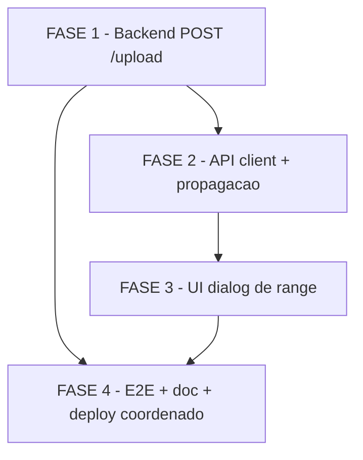

# Tarefas import-range-datas - Seletor de Range de Datas no Import de Movimento

Escopo: Substituir a leitura per-row de `dt_inicial`/`dt_final` da planilha por um range unico informado pelo operador na UI, aplicado a todas as linhas do lote. Fatia vertical em 3 camadas (Backend -> API client/propagacao -> UI) sem DDL, com deploy coordenado frontend_v2 + backend.

**Legenda de status:**
- `[ ]` Pendente
- `[~]` Em andamento
- `[x]` Concluido
- `[!]` Bloqueado

**Legenda de criticidade:**
- `[C]` Critico - Impacto financeiro direto ou bloqueante
- `[A]` Alto - Funcionalidade essencial
- `[M]` Medio - Necessario mas sem urgencia imediata

---

## FASE 1 - Backend (rota POST /upload)

Ref: plan.md §Phase 1.3, §8 (ordem 1); spec.md FR-004, FR-005, FR-006, FR-007, FR-008, FR-009

A base da fatia vertical: o backend passa a ler o range de `req.body`, valida uma unica vez e aplica a todas as linhas, removendo a validacao per-row. Implementado primeiro para garantir compatibilidade no deploy coordenado (plan §9).

### 1.1 Validacao do range no inicio do handler `[C]`

Ref: plan.md §Phase 1.3; spec.md FR-004, FR-007

- [ ] 1.1.1 Ler `req.body.dt_inicial` e `req.body.dt_final` (campos de texto do FormData via `upload.single('file')`) apos a validacao de `req.file` e antes do loop de linhas em `backend/server.js` (`app.post('/upload', ...)`)
- [ ] 1.1.2 Validar presenca: `dt_inicial` ausente/vazio -> `400` com mensagem unica em PT; idem `dt_final`
- [ ] 1.1.3 Converter ambas via `toTimestamptzMidnightSP` (helper existente ~linha 1350); valor invalido -> `400` com mensagem `formato esperado: DD/MM/YYYY`
- [ ] 1.1.4 Validar consistencia `dtIniTS <= dtFimTS`; senao `400` com mensagem `dt_inicial deve ser menor ou igual a dt_final`
- [ ] 1.1.5 Preservar semantica de `dt_final` (meia-noite horario SP) identica ao comportamento atual (FR-007)
- [ ] 1.1.6 Teste de integracao: request sem `dt_inicial` -> `400`; sem `dt_final` -> `400`; data invalida -> `400`; `dt_inicial > dt_final` -> `400`; mensagem unica (nao por linha)

### 1.2 Aplicacao do range a todas as linhas e remocao da validacao per-row `[C]`

Ref: plan.md §Phase 1.3; spec.md FR-005, FR-006, FR-008; checklists/requirements.md CHK017

- [ ] 1.2.1 No loop `rows.forEach` (~1472-1516), remover o bloco condicional `if (!_isGrupoMovee) { ... }` que lia/validava `row.dt_inicial`/`row.dt_final` per-row
- [ ] 1.2.2 Remover o fallback de data padrao por grupo (`01/01/1982`); usar `dtIniTS`/`dtFimTS` do escopo do handler para TODAS as linhas (FR-008)
- [ ] 1.2.3 Garantir que `dataToInsert.push({...})` use `dt_inicial: dtIniTS` e `dt_final: dtFimTS` (valores do range)
- [ ] 1.2.4 Ignorar colunas `dt_inicial`/`dt_final` da planilha; presenca ou ausencia delas nao causa falha (FR-006)
- [ ] 1.2.5 Verificar se `_isGrupoMovee` (e `await mesmoGrupoQue(empresaId, 6, _grupoCache)`) tem outros usos no handler alem do bloco de datas; se nao, remover tambem (Ref: checklists/requirements.md CHK039)
- [ ] 1.2.6 Confirmar sem regressao em `valor`, `gorjeta`, CNPJ do motorista e mensagens de envio (FR-009) — nenhuma alteracao na logica desses campos
- [ ] 1.2.7 Teste de integracao: importar planilha com linhas sem colunas de data -> zero rejeicoes 400 (SC-1); range aplicado uniformemente a grupo Movee e nao-Movee (SC-4/FR-008); roundtrip de gorjeta/valor/CNPJ sem regressao (SC-5)

---

## FASE 2 - Camada de transporte (API client + propagacao da assinatura)

Ref: plan.md §Phase 1.2, §5.2, §8 (ordem 2); spec.md FR-003

Estende a assinatura `uploadFile` para carregar `extraFields` e propaga essa assinatura por hook, action-bar e page ate o `ImportButton`. O proxy `app/api/[...path]/route.ts` nao muda (streaming transparente).

### 2.1 `api-client.ts` — anexar range ao FormData `[A]`

Ref: plan.md §5.2, research.md §D5; spec.md FR-003

- [ ] 2.1.1 Confirmar a assinatura existente `uploadFile(path, file, extraFields?: Record<string,string>)` em `frontend_v2/lib/api-client.ts` (research.md D5 indica que `extraFields` ja existe — validar empiricamente e marcar [x] se ja conforme)
- [ ] 2.1.2 Garantir `formData.append('dt_inicial', ...)` e `formData.append('dt_final', ...)` quando `extraFields` presente
- [ ] 2.1.3 Teste unitario/smoke: `uploadFile` com `extraFields` monta FormData com os dois campos preservando o `file`

### 2.2 Propagacao da assinatura por hook/action-bar/page `[A]`

Ref: plan.md §1.2, §Project Structure; spec.md FR-003

- [ ] 2.2.1 Estender `frontend_v2/hooks/use-envio-massa.ts` -> `uploadFile(file, extraFields?)` repassando `extraFields` ao `api-client`
- [ ] 2.2.2 Estender `frontend_v2/components/action-bar.tsx` -> `onUpload(file, extraFields?)`
- [ ] 2.2.3 Verificar wiring em `frontend_v2/app/dashboard/page.tsx` (`ActionBar.onUpload`); ajustar se necessario (pode ser noop se ja compativel)
- [ ] 2.2.4 Confirmar que o proxy `frontend_v2/app/api/[...path]/route.ts` permanece sem mudanca (streaming multipart preserva boundary e campos extras)
- [ ] 2.2.5 Teste smoke: cadeia page -> action-bar -> hook -> api-client repassa `extraFields` end-to-end (tipos coerentes, sem `any` perdido)

---

## FASE 3 - UI (dialog de range no import-button)

Ref: plan.md §Phase 1.1, §5.1, §8 (ordem 3); spec.md FR-001, FR-002

Fluxo de 2 passos: escolher arquivo -> abrir Dialog com dois `<input type="date">` -> validar `dtInicial <= dtFinal` -> `onUpload(file, { dt_inicial, dt_final })`. Sem nova lib (input nativo + componentes shadcn/ui existentes).

### 3.1 Estado e fluxo de 2 passos `[A]`

Ref: plan.md §1.1; spec.md FR-001

- [ ] 3.1.1 Adicionar estado local em `frontend_v2/components/import-button.tsx`: `dtInicial`, `dtFinal`, `dialogOpen`, `pendingFile`
- [ ] 3.1.2 Em `handleChange`/`handleDrop`: validar extensao -> salvar `pendingFile` -> `setDialogOpen(true)` (NAO chamar `onUpload` imediatamente)
- [ ] 3.1.3 Renderizar Dialog (`Dialog`/`DialogContent`/`DialogHeader`/`DialogTitle`/`DialogFooter` de `@/components/ui/dialog`) com dois `<Input type="date">` (Data inicial / Data final) e `Label`
- [ ] 3.1.4 Ao confirmar: converter `YYYY-MM-DD` (input nativo) -> `DD/MM/YYYY` -> `onUpload(pendingFile, { dt_inicial, dt_final })` -> fechar dialog -> reset de estado
- [ ] 3.1.5 Atualizar a interface `ImportButtonProps.onUpload` para `(file: File, extraFields?: Record<string, string>) => Promise<unknown>`

### 3.2 Validacao de range na UI (botao habilitado) `[A]`

Ref: plan.md §1.1; spec.md FR-002, SC-2

- [ ] 3.2.1 Habilitar o botao Enviar somente quando `dtInicial && dtFinal && dtInicial <= dtFinal`; caso contrario manter desabilitado
- [ ] 3.2.2 Garantir feedback de erro/estado antes do envio (botao desabilitado = mecanismo de feedback, SC-2)
- [ ] 3.2.3 Teste de componente: botao desabilitado com data faltando ou `dtInicial > dtFinal`; habilitado com range valido; `onUpload` recebe `{ dt_inicial, dt_final }` em `DD/MM/YYYY`

---

## FASE 4 - Testes E2E, documentacao e deploy coordenado

Ref: plan.md §8 (ordem 4), §9; spec.md FR-010, SC-1..SC-5; quickstart.md

Fecha a fatia com validacao E2E ponta-a-ponta, ajuste do modelo de planilha (doc) e o checklist de deploy coordenado sem DDL.

### 4.1 Validacao E2E e criterios de aceite `[A]`

Ref: quickstart.md; spec.md SC-1..SC-5, P1/P2/P3

- [ ] 4.1.1 Executar quickstart Cenario happy path P1 (escolher arquivo -> dialog -> datas -> enviar -> gravacao com range em todas as linhas)
- [ ] 4.1.2 Executar cenarios de erro P2 (range invalido bloqueado na UI antes do envio; backend retorna 400 unico)
- [ ] 4.1.3 Executar P3 (comportamento uniforme entre grupos, incluindo Movee — fallback `01/01/1982` eliminado)
- [ ] 4.1.4 Executar quickstart Cenario 6 (roundtrip E2E): gorjeta (null vs valor), valor, CNPJ com/sem mascara gravados corretamente (SC-5)
- [ ] 4.1.5 Confirmar multer + streaming: `upload.single('file')` popula `req.body.dt_inicial/dt_final` quando body chega via stream do proxy (plan §9)

### 4.2 Ajuste do modelo de planilha (documentacao) `[M]`

Ref: plan.md §8 (ordem 4); spec.md FR-006

- [ ] 4.2.1 Atualizar a documentacao/modelo de planilha indicando que as colunas `dt_inicial`/`dt_final` passam a ser ignoradas (datas vem do range da UI)
- [ ] 4.2.2 Documentar o novo fluxo do operador (escolher arquivo -> informar range no dialog -> enviar)
- [ ] 4.2.3 Revisar render da doc (Markdown/links) — sem Mermaid invalido nem links 404

### 4.3 Deploy coordenado frontend + backend (sem DDL) `[C]`

Ref: plan.md §9, §Convencoes de Borda; spec.md FR-010; CLAUDE.md rito de producao

- [ ] 4.3.1 Anotar plano de rollback (imagem anterior de backend e frontend_v2 via `docker service ls`) antes de qualquer escrita no ambiente vivo
- [ ] 4.3.2 Build coordenado backend + frontend_v2 com swap temporario 4G + `docker build --memory=2g` (licao starvation, host VPSTodo); `push` para `registry.todo-tips.com`
- [ ] 4.3.3 `docker service update --with-registry-auth --image` para ambos os servicos no mesmo ciclo (nunca `docker stack deploy`) — apos os 5 gates do rito de producao (autorizacao explicita do operador)
- [ ] 4.3.4 Smoke test E2E (HTTP, sem expor segredos): import com range valido grava em todas as linhas; range invalido -> 400; sem DDL aplicado
- [ ] 4.3.5 Confirmar ausencia de janela de incompatibilidade (FR-010): backend exige range somente apos frontend que o envia estar no ar

---

## Matriz de Dependencias

> A FASE 1 (backend) e implementada primeiro para garantir compatibilidade no deploy coordenado (plan §9); FASE 2 e FASE 3 sao a cadeia de transporte e UI; FASE 4 depende de toda a fatia estar pronta para validacao E2E e cutover.

---

## Resumo Quantitativo

| Fase | Tarefas | Subtarefas | Criticidade |
|------|---------|------------|-------------|
| 1 - Backend (POST /upload) | 2 | 13 | C |
| 2 - API client + propagacao | 2 | 8 | A |
| 3 - UI dialog de range | 2 | 8 | A |
| 4 - E2E + doc + deploy coordenado | 3 | 13 | C/A/M |
| **Total** | **9** | **42** | - |

---

## Escopo Coberto

| Item | Descricao | Fase |
|------|-----------|------|
| FR-001 | Dialog de range na UI de import (fluxo 2 passos) | 3 |
| FR-002 | Validacao de range na UI (botao habilitado) | 3 |
| FR-003 | Transmissao do range ao backend via extraFields | 2 |
| FR-004 | Validacao de range no backend (uma vez, 400 unico) | 1 |
| FR-005 | Aplicacao do range a todas as linhas | 1 |
| FR-006 | Colunas dt_inicial/dt_final da planilha ignoradas | 1, 4 |
| FR-007 | Semantica de dt_final (meia-noite SP) preservada | 1 |
| FR-008 | Comportamento uniforme entre grupos (incl. Movee) | 1 |
| FR-009 | Sem regressao em valor/gorjeta/CNPJ/mensagens | 1 |
| FR-010 | Deploy coordenado frontend + backend | 4 |
| CHK039 | Verificacao de outros usos de `_isGrupoMovee` | 1 |

## Escopo Excluido

| Item | Descricao | Motivo |
|------|-----------|--------|
| EX-01 | Qualquer DDL ou alteracao de schema do banco | Feature stateless; colunas `dt_inicial`/`dt_final` da EnvioMassa ja existem, sem mudanca de schema (plan §Summary) |
| EX-02 | Mudanca no proxy `app/api/[...path]/route.ts` | Streaming multipart ja preserva boundary e campos extras transparentes (plan §5.2) |
| EX-03 | Nova lib de date-picker (react-day-picker/date-fns) | Usar `<input type="date">` nativo + componentes shadcn/ui existentes (plan §5.1) |
| EX-04 | Fase de transicao com fallback per-row no backend | Decisao por deploy coordenado (mesmo rito da gorjeta); fallback `01/01/1982` eliminado (plan §9, FR-008) |
| EX-05 | Alteracao da logica de valor/gorjeta/CNPJ | Fora do escopo; apenas a fonte das datas muda (FR-009) |
