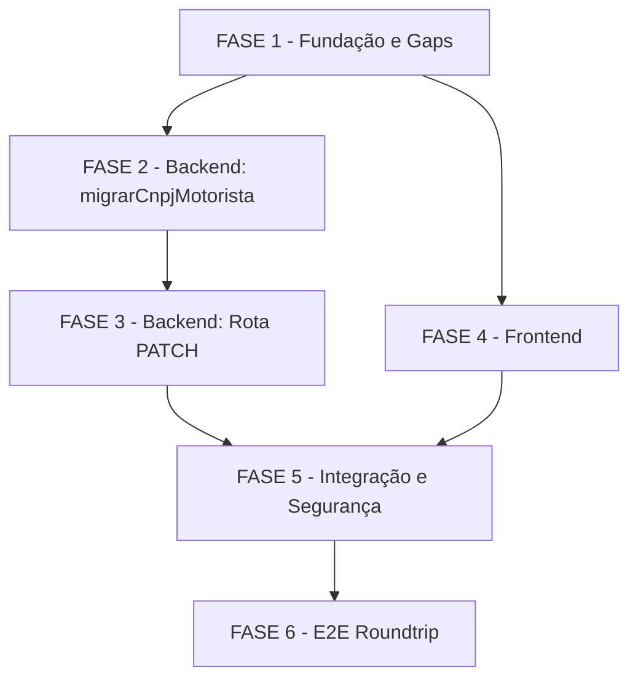

# Tarefas migrar-cnpj-motorista - Backend + Frontend + Testes

Escopo: Estender a rota `PATCH /update-envio-massa/:id` para migrar o
cadastro do motorista (tabela `Motorista`) ao corrigir o CNPJ do prestador em
um movimento, mantendo isolamento multi-tenant (gate de grupo Movee),
bloqueando fusão acidental de contas (409) e expondo a operação com validação
segura no frontend.

**Artefatos de referência**:
- `docs/specs/migrar-cnpj-motorista/spec.md` — FR-001..FR-014
- `docs/specs/migrar-cnpj-motorista/plan.md` — arquitetura de mudança
- `docs/specs/migrar-cnpj-motorista/contracts/patch-update-envio-massa.md` — contrato [A]..[H]
- `docs/specs/migrar-cnpj-motorista/quickstart.md` — cenários C1..C10
- `docs/specs/migrar-cnpj-motorista/checklists/` — security/api/ux (43 itens)

**SEM DDL** — colunas já existem. Nenhuma migração de banco necessária.

**Legenda de status:**
- `[ ]` Pendente
- `[~]` Em andamento
- `[x]` Concluído
- `[!]` Bloqueado

**Legenda de criticidade:**
- `[C]` Crítico - Impacto de segurança, isolamento multi-tenant ou integridade de dados
- `[A]` Alto - Funcionalidade core sem a qual a feature não opera
- `[M]` Médio - Qualidade, observabilidade ou UX complementar

---

## FASE 1 - Fundação e Gaps de Requisitos

> Resolver os gaps abertos dos checklists antes de codificar e confirmar
> premissas estruturais (sem DDL). Fecha o loop checklist → backlog para que
> a implementação parta de requisitos fechados.

### 1.1 Resolver gaps de requisitos pendentes `[A]`

Ref: checklists/security.md CHK005, CHK014; checklists/api.md CHK030, CHK031;
checklists/ux.md CHK035, CHK038, CHK041, CHK042, CHK043; spec.md FR-011;
contrato §SEC-03.

- [ ] 1.1.1 Documentar decisão sobre CHK005 (falha do `mesmoGrupoQue`): fail-closed → 403/500, sem acesso à tabela Motorista; registrar em spec.md §Clarifications
- [ ] 1.1.2 Documentar decisão sobre CHK014 (observabilidade de falha parcial): log puro é suficiente para o MVP — sem alerta ativo; registrar em spec.md §Clarifications
- [ ] 1.1.3 Documentar decisão sobre CHK043 (loading state durante PATCH): campo CNPJ e botão Salvar desabilitados durante submissão; registrar em spec.md §Clarifications
- [ ] 1.1.4 Confirmar premissa sem DDL: ler `app_homologacao/backend/db/001_create_motorista.sql` e verificar colunas `cnpj_prestador`, `nome`, `ativo` já existentes

### 1.2 Confirmar pontos de inserção no server.js `[A]`

Ref: plan.md §Project Structure; contrato §Função `migrarCnpjMotorista`.

- [ ] 1.2.1 Localizar a rota `PATCH /update-envio-massa/:id` no `server.js` — confirmar número exato de linha
- [ ] 1.2.2 Localizar helpers `onlyDigits`, `isCNPJ14`, `postgrestRequest`, `mesmoGrupoQue`, `resolveEmpresaAlvo` — confirmar nomes e assinaturas exatas
- [ ] 1.2.3 Verificar que `mesmoGrupoQue` aceita `(idEmp, 6, cache)` e retorna booleano (sem lançar em caso de grupo válido)
- [ ] 1.2.4 Confirmar ponto de inserção de `migrarCnpjMotorista` — após os helpers existentes, antes do `module.exports`
- [ ] 1.2.5 Confirmar que `EnvioMassa.cnpj_prestador` existe na tabela via schema do código ou chamada read-only ao PostgREST

---

## FASE 2 - Backend: Função `migrarCnpjMotorista`

> Implementar a nova função de migração do cadastro do motorista, com gate de
> grupo, pré-check 409 e PATCH/POST preservando campos existentes.

### 2.1 Implementar função `migrarCnpjMotorista` `[C]`

Ref: spec.md FR-003, FR-004, FR-005, FR-006, FR-007, FR-010, FR-011, FR-013;
contrato §Função `migrarCnpjMotorista`; checklists/security.md SEC-03, SEC-04, SEC-05.

- [ ] 2.1.1 Criar função `migrarCnpjMotorista(cnpjAntigo, cnpjNovo, idEmpresa, cache)` — signature exata do contrato
- [ ] 2.1.2 Implementar gate de grupo como **primeira instrução**: `if (!mesmoGrupoQue(idEmpresa, 6, cache)) return { skipped: true }` — nunca emitir SELECT em `Motorista` fora do gate (SEC-03, FR-013)
- [ ] 2.1.3 Implementar tratamento de falha do `mesmoGrupoQue`: se a chamada lançar exceção → fail-closed (retornar `{ error: 'gate-falhou' }` para o chamador sem acessar Motorista) — CHK005
- [ ] 2.1.4 Implementar busca do motorista antigo via `postgrestRequest`: `GET Motorista?cnpj_prestador=eq.{cnpjAntigo}`
- [ ] 2.1.5 Implementar pré-check 409: `GET Motorista?cnpj_prestador=eq.{cnpjNovo}` — se existe → retornar `{ conflict: true }` (chamador retorna 409, nada escrito) — FR-006, SEC-04
- [ ] 2.1.6 Implementar branch "antigo existe": `PATCH Motorista?cnpj_prestador=eq.{cnpjAntigo}` com `{ cnpj_prestador: cnpjNovo }` — preservar `nome` e `ativo` (não sobrescrever) — FR-004, FR-005
- [ ] 2.1.7 Implementar branch "antigo não existe" (pré-cadastro): `POST Motorista` com `{ cnpj_prestador: cnpjNovo, nome: '', ativo: true }` — FR-007; violação UNIQUE → catch e retornar `{ conflict: true }` (TOCTOU, SEC-04)
- [ ] 2.1.8 Implementar logging seguro no catch do 500: logar apenas `cnpjAntigo`, `cnpjNovo`, mensagem de erro — **nunca** logar objeto `Motorista` completo (carrega hash de senha) — SEC-05, FR-011
- [ ] 2.1.9 Garantir que a função retorna estrutura discriminada: `{ skipped?, conflict?, ok?, error? }` para o chamador tratar

### 2.2 Testes unitários de `migrarCnpjMotorista` `[C]`

Ref: plan.md §Cenários de teste; quickstart.md C1..C8; spec.md FR-003, FR-006,
FR-007, FR-011, FR-013.

- [ ] 2.2.1 Criar arquivo de teste `app_homologacao/backend/__tests__/migrarCnpjMotorista.test.js` com mock de `postgrestRequest`
- [ ] 2.2.2 Teste C1 (happy path): `mesmoGrupoQue=true`, antigo existe, novo CNPJ livre → PATCH Motorista OK, retorna `{ ok: true }`
- [ ] 2.2.3 Teste C2 (fora do grupo): `mesmoGrupoQue=false` → retorna `{ skipped: true }`, ZERO chamadas ao PostgREST de Motorista
- [ ] 2.2.4 Teste C3 (conflito 409): pré-check retorna motorista existente para `cnpjNovo` → retorna `{ conflict: true }`, nada escrito
- [ ] 2.2.5 Teste C4 (antigo inexistente → pré-cadastro): antigo não encontrado → POST Motorista com `{ nome: '', ativo: true }`
- [ ] 2.2.6 Teste C7 (falha parcial): mock retorna erro no PATCH Motorista → retorna `{ error }`, log registrado sem campos sensíveis
- [ ] 2.2.7 Teste TOCTOU/SEC-04: POST Motorista retorna erro UNIQUE (code 23505) → retorna `{ conflict: true }` (não 500)

---

## FASE 3 - Backend: Estender Rota PATCH /update-envio-massa/:id

> Integrar `migrarCnpjMotorista` na rota existente, implementando a ordem
> [A]..[H] do contrato com todos os gates de segurança.

### 3.1 Implementar ordem [A]..[H] na rota PATCH `[C]`

Ref: contrato §Ordem das operações; spec.md FR-001, FR-002, FR-008, FR-009,
FR-012; checklists/security.md SEC-01, SEC-02, SEC-03.

- [ ] 3.1.1 Extrair `cnpj_prestador` do body e normalizar com `onlyDigits` antes de qualquer uso — FR-009
- [ ] 3.1.2 Implementar `[B]` validação com `isCNPJ14(cnpjNovo)` → 400 `{ error: 'CNPJ inválido' }` se falhar — FR-008
- [ ] 3.1.3 Implementar `[C]` busca do movimento atual com `resolveEmpresaAlvo` + filtro `id=eq.{id}&id_empresa=eq.{idEmp}` → 404 se não encontrado — FR-001, Princípio II anti-IDOR
- [ ] 3.1.4 Implementar `[D]` NO-OP de CNPJ: se `cnpjNovo === cnpjAntigo` (após normalização) → pular direto para `[G]` — FR-009 idempotência
- [ ] 3.1.5 Implementar `[E]` gate de grupo **EXPLÍCITO na rota**: `if (!mesmoGrupoQue(idEmp, 6, cache))` → pular todo bloco Motorista — SEC-03, FR-013 (guard-clause na rota, não só dentro de `migrarCnpjMotorista`)
- [ ] 3.1.6 Implementar `[F]` PATCH em lote de `EnvioMassa`: `cnpj_prestador=eq.{cnpjAntigo}&id_empresa=eq.{idEmp}` → `{ cnpj_prestador: cnpjNovo }` — FR-002, FR-012 (inclui `enviado=true`)
- [ ] 3.1.7 Chamar `migrarCnpjMotorista` SOMENTE após movimentos OK — FR-010; `{ conflict: true }` → 409; `{ error }` → 500 + log — FR-011
- [ ] 3.1.8 Implementar `[G]` PATCH demais campos do movimento editado (`enviado/men1/men2/tipo`) — não-regressão garantida
- [ ] 3.1.9 Implementar `[H]` resposta 200 com corpo conforme contrato §Respostas
- [ ] 3.1.10 Garantir que erros 403 (fora do escopo `resolveEmpresaAlvo`) continuam funcionando para o fluxo existente

### 3.2 Testes unitários da rota integrada `[C]`

Ref: quickstart.md C1..C8; spec.md FR-001..FR-014; contrato §Invariantes de segurança.

- [ ] 3.2.1 Criar arquivo de teste `app_homologacao/backend/__tests__/patchUpdateEnvioMassa.test.js` com mock de `postgrestRequest` e `mesmoGrupoQue`
- [ ] 3.2.2 Teste C6 (CNPJ inválido na rota): payload malformado → 400 na etapa [B], nada escrito
- [ ] 3.2.3 Teste C8 (IDOR): request com `id` de outra empresa → 403 ou 404, ZERO PATCH em `EnvioMassa` de outra empresa
- [ ] 3.2.4 Teste C5 (idempotência na rota): `cnpjNovo === cnpjAntigo` → `[D]` corta → ZERO chamadas a `migrarCnpjMotorista`, demais campos salvos normalmente
- [ ] 3.2.5 Teste C2 na rota (empresa fora do grupo): `mesmoGrupoQue=false` → PATCH movimentos ocorre, Motorista intocada, 200 retornado
- [ ] 3.2.6 Teste de não-regressão: campos `enviado`, `men1`, `men2`, `tipo` mantêm semântica após PATCH com CNPJ diferente

---

## FASE 4 - Frontend: Campo CNPJ com Máscara e Validação

> Estender o `edit-dialog.tsx` para expor o campo `cnpj_prestador` com
> máscara de 14 dígitos, validação, aviso fixo de impacto no app motorista
> e tratamento de erros 409/500.

### 4.1 Adicionar campo CNPJ ao edit-dialog.tsx `[A]`

Ref: spec.md US4, FR-008, FR-014; checklists/ux.md UX-01..UX-04;
plan.md §Frontend; quickstart.md C9.

- [ ] 4.1.1 Ler `app_homologacao/frontend_v2/components/edit-dialog.tsx` e `hooks/use-envio-massa.ts` na íntegra antes de editar
- [ ] 4.1.2 Adicionar estado local `cnpjPrestador` inicializado com o valor atual do movimento — payload enviado conterá apenas dígitos (`onlyDigits` no frontend) — FR-014
- [ ] 4.1.3 Implementar máscara de entrada: aceitar apenas dígitos, limitar a 14 dígitos numéricos — enviar somente dígitos ao backend — FR-008, CHK035
- [ ] 4.1.4 Implementar validação inline: botão "Salvar" desabilitado se CNPJ com menos de 14 dígitos — também desabilitar durante submissão (loading state) — CHK043
- [ ] 4.1.5 Adicionar aviso fixo (não dismissível) abaixo do campo CNPJ: "Alterar o CNPJ atualizará o cadastro de login do motorista no app" — FR-004, CHK038
- [ ] 4.1.6 Adicionar `aria-invalid` no campo CNPJ quando inválido e `aria-label` descritivo — CHK042
- [ ] 4.1.7 Garantir que `cnpj_prestador` está no payload do PATCH como snake_case com apenas dígitos — Convenção de Borda do plan.md

### 4.2 Implementar tratamento de erros 400/409/500 no frontend `[A]`

Ref: spec.md US2, FR-015 (implícito); checklists/ux.md CHK041; contrato §Respostas.

- [ ] 4.2.1 Mapear resposta 409: exibir "Este CNPJ já pertence a outro motorista cadastrado. Verifique antes de prosseguir." — CHK041
- [ ] 4.2.2 Mapear resposta 400: exibir mensagem de CNPJ inválido retornada pelo backend
- [ ] 4.2.3 Mapear resposta 500: exibir mensagem genérica sem expor detalhes internos
- [ ] 4.2.4 Limpar estado de erro ao reeditar o campo CNPJ

### 4.3 Testes do componente edit-dialog `[A]`

Ref: quickstart.md C9; spec.md US4-AC1..AC4; checklists/ux.md CHK035..CHK043.

- [ ] 4.3.1 Criar ou estender testes de `edit-dialog.tsx` (React Testing Library ou equivalente do projeto)
- [ ] 4.3.2 Teste C9-a: campo com 13 dígitos → botão Salvar desabilitado
- [ ] 4.3.3 Teste C9-b: campo com 14 dígitos válidos → botão habilitado, payload contém `cnpj_prestador` com apenas dígitos
- [ ] 4.3.4 Teste C9-c: aviso fixo de impacto no app motorista visível independentemente do estado do campo
- [ ] 4.3.5 Teste C9-d: resposta 409 mockada → mensagem de conflito exibida, campo editável novamente

---

## FASE 5 - Integração e Verificação de Segurança

> Verificar invariantes de segurança cross-layer (IDOR, multi-tenant, TOCTOU)
> e confirmar que os gates do contrato estão materializados no código final.

### 5.1 Verificar invariantes de segurança no código `[C]`

Ref: contrato §Invariantes de segurança; checklists/security.md CHK001..CHK015;
spec.md FR-003, FR-013; plan.md §Riscos & Mitigações.

- [ ] 5.1.1 Grep em `server.js` confirmando que `mesmoGrupoQue` é chamado **antes** de qualquer `postgrestRequest` sobre `Motorista` — guard-clause [E] na rota, não só dentro de `migrarCnpjMotorista`
- [ ] 5.1.2 Grep em `server.js` confirmando que todo PATCH em `EnvioMassa` inclui `id_empresa=eq.${idEmp}` no filtro — anti-IDOR
- [ ] 5.1.3 Confirmar que o catch do 500 nunca loga o objeto `Motorista` completo — grep nos blocos catch relevantes — SEC-05
- [ ] 5.1.4 Confirmar que violação de UNIQUE no POST resulta em 409 (não 500) — grep no tratamento de erros PostgREST
- [ ] 5.1.5 Confirmar que `cnpjNovo` é normalizado com `onlyDigits` antes de qualquer comparação ou persistência

### 5.2 Lint e build locais `[A]`

Ref: plan.md §Technical Context (node:14 backend, node:20-alpine frontend).

- [ ] 5.2.1 Rodar lint no backend: `cd app_homologacao/backend && npm run lint` — zero erros novos introduzidos
- [ ] 5.2.2 Rodar lint no frontend: `cd app_homologacao/frontend_v2 && npm run lint` — zero erros novos
- [ ] 5.2.3 Build do frontend sem erros: `npm run build` no `frontend_v2` — sem erros TypeScript relacionados às mudanças

---

## FASE 6 - Testes E2E e Roundtrip Real

> Validação end-to-end com chamada real ao backend (sem mock), seguindo o
> roteiro C10 do quickstart.

### 6.1 Preparar dados de teste para E2E `[A]`

Ref: quickstart.md C10; spec.md US1, US2, US3.

- [ ] 6.1.1 Identificar no banco de homologação (`chatmasterveloz`) um movimento da empresa Movee (id_empresa=6 ou filial) com `cnpj_prestador` populado
- [ ] 6.1.2 Confirmar que o CNPJ do movimento existe na tabela `Motorista` — ou preparar registro para o teste C4
- [ ] 6.1.3 Documentar os IDs de teste em `quickstart.md §C10` para reprodutibilidade futura

### 6.2 Executar roundtrip E2E (C10) `[A]`

Ref: quickstart.md C10; spec.md §Measurable Outcomes.

- [ ] 6.2.1 C10-a (happy path via UI): editar CNPJ de movimento Movee → confirmar 200 e `cnpj_prestador` atualizado em `Motorista`
- [ ] 6.2.2 C10-b (empresa fora do grupo): usar empresa não-Movee → confirmar movimentos atualizados, tabela `Motorista` intocada
- [ ] 6.2.3 C10-c (conflito 409): editar para CNPJ já existente em `Motorista` → confirmar 409 na UI, nenhum movimento alterado
- [ ] 6.2.4 C10-d (idempotência): editar com mesmo CNPJ já gravado → confirmar 200 sem mudanças em `Motorista`
- [ ] 6.2.5 Registrar resultado de cada sub-cenário (pass/fail) em `quickstart.md §C10`

---

## Matriz de Dependências

---

## Resumo Quantitativo

| Fase | Tarefas | Subtarefas | Criticidade |
|------|---------|-----------|-------------|
| FASE 1 — Fundação e Gaps | 2 | 9 | `[A]` |
| FASE 2 — Backend: migrarCnpjMotorista | 2 | 16 | `[C]` |
| FASE 3 — Backend: Rota PATCH | 2 | 16 | `[C]` |
| FASE 4 — Frontend | 3 | 16 | `[A]` |
| FASE 5 — Integração e Segurança | 2 | 8 | `[C]`/`[A]` |
| FASE 6 — E2E Roundtrip | 2 | 8 | `[A]` |
| **Total** | **13** | **73** | — |

## Escopo Coberto

| Item | Descrição | Fase |
|------|-----------|------|
| migrarCnpjMotorista | Nova função com gate grupo, pré-check 409, PATCH/POST | FASE 2 |
| Rota PATCH estendida | Ordem [A]..[H] do contrato integrada | FASE 3 |
| Isolamento multi-tenant | Gate `mesmoGrupoQue` guard-clause na rota e na função | FASE 2, 3 |
| Frontend CNPJ | Máscara 14 dígitos, validação, aviso, loading state, 400/409/500 | FASE 4 |
| Testes unit backend | C1..C8 mockando `postgrestRequest` | FASE 2, 3 |
| Testes componente frontend | C9 — máscara, validação, errors | FASE 4 |
| E2E real | C10 — roundtrip real com dados de homologação | FASE 6 |
| Invariantes de segurança | IDOR, TOCTOU, SEC-03..SEC-05 verificados | FASE 5 |
| Não-regressão | enviado/men1/men2/tipo mantêm semântica | FASE 3 |

## Escopo Excluído

| Item | Descrição | Motivo |
|------|-----------|--------|
| DDL | Nenhuma alteração de schema | Colunas já existem (`001_create_motorista.sql`) |
| Transação distribuída | Sem rollback de movimentos se Motorista falhar | Comportamento de falha parcial definido em FR-011 |
| Alerta ativo | Sem Slack/e-mail para inconsistência Motorista | Log puro suficiente para MVP (CHK014 aceito) |
| Deploy | Sem `docker service update` | Operador executa conforme RITO-PRODUCAO.md |
| Outras rotas | Nenhuma outra rota alterada | Escopo restrito a `PATCH /update-envio-massa/:id` |
| Upload em lote | `upsertMotoristasFromLote` não modificado | Já tem gate próprio; escopo desta feature é a edição unitária |
| App motorista | Nenhuma mudança no `frontend_motorista` | Apenas lê a tabela `Motorista` atualizada pelo backend |
