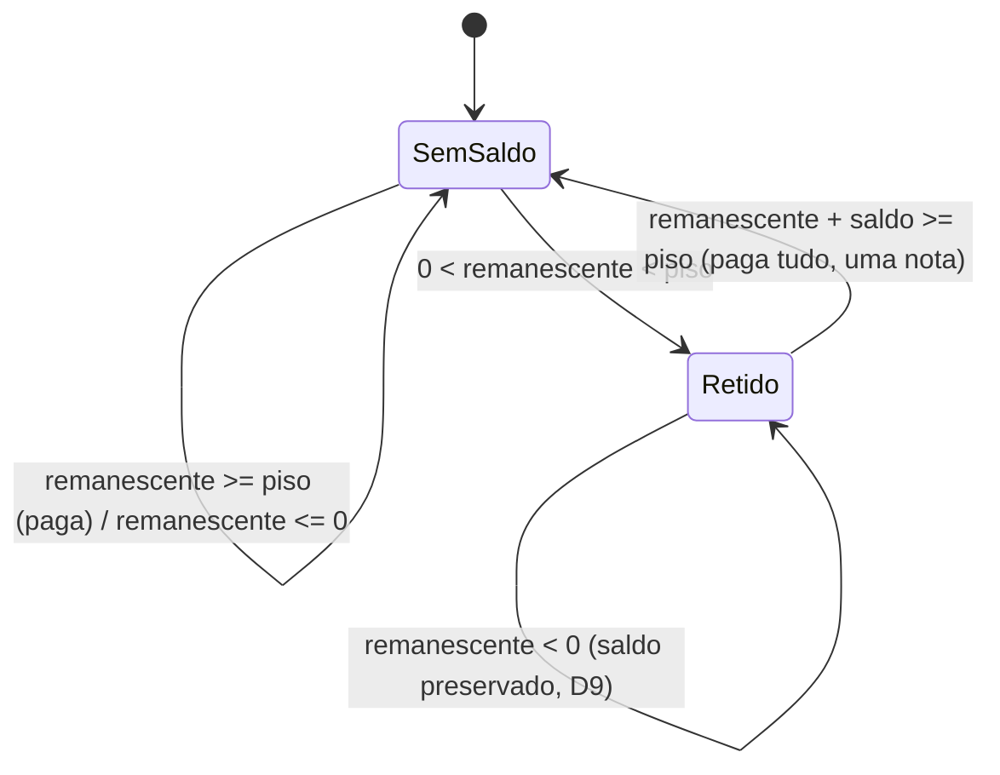

# Data Model: repasse-saldo-minimo

**Feature**: `repasse-saldo-minimo` | **Date**: 2026-09-26 | **Spec**: [spec.md](./spec.md)

Tudo aditivo. Nenhuma linha existente é reescrita; `ApuracaoRepasse`/`ApuracaoRepasseItem`
continuam imutáveis (gatilho `hub_bloqueia_alteracao_apuracao`, `0066:463`). Migrations:
F1 nenhuma; F2 `0097_papel_financeiro_aprovador.sql`; F3 `0098_repasse_saldo_minimo.sql`
(números conferidos na hora — última aplicada no repo: `0096`).

## Entity: Entregador (sem mudança — F1)

| Campo | Tipo | Notas |
|---|---|---|
| `id` | int PK | chave interna usada pelas RPCs de repasse |
| `id_externo` | uuid NOT NULL | `0010_entregador.sql:17`, `UNIQUE (id_empresa, id_externo)`. É o "Identificador" da tela de Motoristas. Passa a ser exibido no repasse (tela + CSV). |

## Entity: Papel (F2 — linha nova)

| Campo | Valor da linha nova |
|---|---|
| `nome` | `financeiro_aprovador` |
| `escopo` | `entidade` |
| `is_sistema` | `true` |

Rótulo na UI: `labelPapel('financeiro_aprovador')` já produz **"Financeiro aprovador"**
pelo fallback de `components/hub/entity-switcher.tsx:43-47` — mesmo mecanismo que rotula
`financeiro` como "Financeiro". Nenhum rótulo novo a cadastrar.

**Papéis restritos** (conjunto fechado, resolvido por nome): `admin_plataforma`,
`financeiro_aprovador`. Helper SQL `hub_papel_restrito(p_papel_id int) → boolean`
(`STABLE`, `SECURITY DEFINER`, `search_path` fixo). Espelho no Node: constante
`PAPEIS_RESTRITOS` em `lib/` (fonte única no backend).

## Entity: PapelPermissao (F2 — dados)

| Papel | `adiantamentos.pagamento_confirmar` antes | depois |
|---|---|---|
| `admin_plataforma` | sim | sim |
| `financeiro_aprovador` | — (papel novo) | sim + **todas** as permissões do `financeiro` na data da migration |
| `financeiro` | sim | **não** |
| `admin_entidade` | sim | **não** |
| qualquer outro | (medido: nenhum) | não |

Invariante verificável: `permissões(financeiro_aprovador) − permissões(financeiro) =
{adiantamentos.pagamento_confirmar}` e `permissões(financeiro) ⊂
permissões(financeiro_aprovador)`.

Privilégios: `REVOKE INSERT, UPDATE ON "Papel", "PapelPermissao", "Permissao", "Modulo"
FROM authenticated` (escrita só pela RPC `hub_papel_permissao_set`, 0037) — aprovado
pelo operador (block-005, research Decision 5); o rollback devolve o `GRANT`.

## Entity: UsuarioEntidade (F2 — políticas)

Sem coluna nova. Políticas refeitas a partir de `0039:46/58`:

| Política | Regra nova |
|---|---|
| `usuarioentidade_insert_admin` (`WITH CHECK`) | `hub_jwt_admin_plataforma() OR (empresa_id = ANY (hub_jwt_escopo_ids()) AND NOT hub_papel_restrito(papel_id))` |
| `usuarioentidade_update_admin` (`USING`, linha atual) | idem, sobre o `papel_id` **atual** — sem ser admin_plataforma não se altera nem desativa vínculo restrito |
| `usuarioentidade_update_admin` (`WITH CHECK`, linha nova) | idem, sobre o `papel_id` **novo** — não se promove ninguém a papel restrito |

`usuarioentidade_select_proprio` não muda. Sem política de DELETE (desativação é
`ativo=false`, como hoje).

## Entity: AdiantamentoConfiguracao (F3 — coluna nova)

| Campo | Tipo | Notas |
|---|---|---|
| `repasse_valor_minimo` | `numeric(14,2) NOT NULL DEFAULT 5.50`, `CHECK (repasse_valor_minimo > 0)` | piso por empresa (FR-025). Versionado junto com a linha (cada salvamento cria versão nova, como os demais campos). Alteração exige `adiantamentos.pagamento_confirmar` (FR-026), na rota e na RPC. |

## Entity: ApuracaoRepasseItem (F3 — colunas novas)

Todas `numeric(12,2)` **nuláveis**: `NULL` = item fechado antes da regra (research
Decision 7). O fechamento novo preenche todas.

| Campo | Significado |
|---|---|
| `saldo_anterior` | `valor_transportado` do item do mesmo entregador na apuração imediatamente anterior da empresa (0 se não houver) |
| `saldo_anterior_nota` / `saldo_anterior_fora` | componentes da nota (D4) que vieram carregados |
| `valor_pago` | o que o financeiro paga nesta semana |
| `valor_transportado` | o que fica retido e compõe a próxima semana |
| `transportado_nota` / `transportado_fora` | componentes da nota que seguem carregados |

`retido` **não** é coluna — é derivado: `remanescente >= 0 AND valor_pago = 0 AND
valor_transportado > 0`.

**CHECK** `apuracaorepasseitem_saldo_conserva` (vale quando `valor_pago IS NOT NULL`):

- `valor_pago >= 0` e `valor_transportado >= 0`;
- `valor_pago = 0 OR valor_transportado = 0` (paga tudo ou retém tudo);
- `remanescente < 0` ⇒ `valor_pago = 0 AND valor_transportado = saldo_anterior` (D2 + D9);
- `remanescente >= 0` ⇒ `remanescente + saldo_anterior = valor_pago + valor_transportado`.

### Transições de estado (por entregador, semana a semana)

Não há transição de saída manual: baixa de saldo preso é escrita manual em produção pelo
rito (fora de escopo, Clarifications).

⚠️ **dec-055/block-008**: o self-loop `Retido --> Retido: remanescente < 0` descreve só o
que acontece com o **saldo antigo** (`saldo_anterior`) — ele nunca é reduzido nem somado à
produção da semana negativa (D9). A produção nota-elegível **desta** semana
(`valor_nota`/`valor_fora_nota`) é uma questão de camada de aplicação, fora deste diagrama
de estado do saldo: `planejarGeracao` (`lib/adiantamento-geracao-movimento.js`) gera a nota
da própria semana normalmente — não é "retida" no sentido do FR-014 (o item nunca teve
`retido = true`, pois a fórmula em §ApuracaoRepasseItem exige `remanescente >= 0`). Ver
`contracts/hub-repasse-api.md` §POST /repasse/:periodo/movimentos.

## Entity: ApuracaoRepasse (F3 — coluna nova `piso_aplicado`)

Regra nova de inserção (na função de fechamento, não em constraint): só a semana
`max(periodo_inicio) + 7` da empresa, ou qualquer semana válida se a empresa não tiver
nenhuma — `APURACAO_FORA_DE_ORDEM` caso contrário.

Coluna nova: `piso_aplicado numeric(14,2)` (nulável — apurações fechadas antes da 0098
ficam `NULL`, sem reprocessamento). `hub_adiantamento_repasse_fechar` grava, no mesmo
`INSERT` da apuração, o `repasse_valor_minimo` **vigente no momento do fechamento** (lido
da versão atual de `AdiantamentoConfiguracao` dentro da própria transação — não o vigente
no início da semana; FR-025a, block-006). Sem `CHECK` novo: é retrato/auditoria, não
participa da regra de cálculo (Decision 8 continua usando o piso lido no mesmo instante).

## Entity: Auditoria (sem mudança de schema — F2)

Nova ação registrada por `registrarAuditoria` (`lib/hub-auditoria.js:174`):
`usuario_vinculo_negado`, com `detalhes` = `{ motivo: 'PAPEL_RESTRITO', rota, usuarioAlvoId,
papelSolicitadoId?, papelAtualId? }` (sem dado pessoal). Consultável na tela de Auditoria
existente (FR-012).
