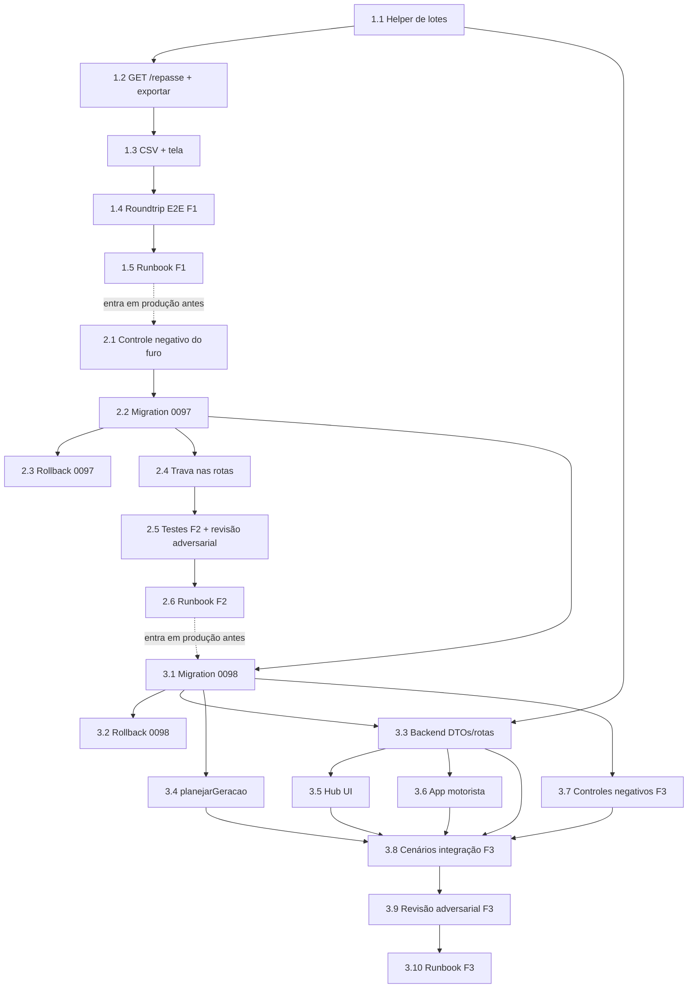

# Tarefas repasse-saldo-minimo - Identificador, aprovação restrita e saldo mínimo carregado

Escopo: implementar as três frentes independentes de
[spec.md](./spec.md) — F1 (identificador do motorista no repasse), F2
(papel `financeiro_aprovador` + trava de vínculo restrito) e F3 (saldo
mínimo carregado semana a semana) — cada uma com PR e deploy próprios,
na ordem F1 → F2 → F3 ([plan.md](./plan.md) Decision 14). Toda
integração/E2E roda **só** no ambiente isolado do hub
(`hub-dev`/`hub-test-*`/`hub-homolog`); nenhuma tarefa aqui toca
produção — o deploy em si é sempre do operador, pelos 5 gates do rito
de produção (`CLAUDE.md`).

**Legenda de status:**
- `[ ]` Pendente
- `[~]` Em andamento
- `[x]` Concluído
- `[!]` Bloqueado

**Legenda de criticidade:**
- `[C]` Crítico - Impacto financeiro direto ou bloqueante
- `[A]` Alto - Funcionalidade essencial
- `[M]` Médio - Necessário mas sem urgência imediata

---

## FASE 1 - F1: Identificador do motorista no repasse (US1, sem DDL)

### 1.1 Helper de busca de identificador em lotes `[A]`

Ref: spec.md FR-001..FR-005; research.md Decision 1; quickstart.md F1.2/F1.3

- [x] 1.1.1 Criar `lib/hub-postgrest-lotes.js` com `buscarEmLotes(caminho, ids, { campoId, tamanhoLote = 100 })`: monta `?id=in.(…)` em blocos de até 100 ids únicos e não-nulos, agrega os resultados
- [x] 1.1.2 Reusar `hubPostgrestRequest` (`lib/hub-postgrest.js`) dentro do helper — sem cliente HTTP novo
- [x] 1.1.3 Tratar erro de qualquer lote como falha total (nunca devolver lista parcial) — `502 { erro: 'ERRO_SERVIDOR' }` propagado pela rota chamadora
- [x] 1.1.4 Teste unit: 1.021 ids distintos → 11 chamadas, nenhuma com mais de 100 ids (quickstart F1.2)
- [x] 1.1.5 Teste unit: ids duplicados e `null` são ignorados antes do chunking
- [x] 1.1.6 Teste unit: erro num lote intermediário propaga falha total, sem CSV/linha parcial (quickstart F1.3)

### 1.2 Expor `idExterno` em `GET /repasse` e `GET /repasse/exportar` `[A]`

Ref: spec.md FR-001, FR-002; contracts/hub-repasse-api.md §GET /repasse, §GET /repasse/exportar; plan.md F1 passo 2

- [x] 1.2.1 `GET /repasse` (`hub-adiantamentos.js:1439`): buscar `Entregador.id_externo` dos `entregador_id` da página via 1.1, juntar como `idExterno` em cada item
- [x] 1.2.2 Repetir para a leitura de semana fechada/congelada (mesma rota, dado `situacao=fechado`)
- [x] 1.2.3 `GET /repasse/exportar` (`:1526`): mesmo join, para semana aberta e fechada
- [x] 1.2.4 Teste unit/integração: item sem `id_externo` resolvido nunca aparece sem identificador (falha explícita, FR-003)
- [x] 1.2.5 Roteiro F1.1 (happy path): tela e CSV, semana aberta e fechada, valor bate com `GET /motoristas`

### 1.3 CSV com `Identificador` na primeira coluna + tela com `CopyableUuid` `[A]`

Ref: spec.md FR-004, FR-005; contracts/hub-repasse-api.md §GET /repasse/exportar (tabela de cabeçalhos); research.md Decision 2

- [x] 1.3.1 `serializarCsvRemanescente` (`lib/adiantamento-remanescente.js:124-150`): cabeçalho `Identificador,Entregador,Créditos,Adiantamentos,Débitos,Remanescente`, coluna nova sempre primeira
- [x] 1.3.2 `lib/hub/adiantamentos-api.ts`: campo `idExterno: string` em `RepasseItem`
- [x] 1.3.3 `app/hub/dashboard/adiantamentos/repasse/page.tsx`: coluna "Identificador" com `CopyableUuid` (mesmo componente da tela de Motoristas), selecionável/copiável sem erro de formatação
- [x] 1.3.4 Teste vitest: renderização da coluna + `CopyableUuid` recebe o valor correto
- [x] 1.3.5 Texto da nota registrado em `docs/plans/repasse-saldo-minimo/RUNBOOK-DEPLOY-F1.md` §"Nota para o corpo do PR" (onda-016) — cola literal no corpo do PR quando ele for aberto

### 1.4 Roundtrip End-to-End F1 `[A]`

Ref: quickstart.md F1.4; contracts/hub-repasse-api.md

- [x] 1.4.1 Driver `infra/hub/testes/*.sh` (ou script ad-hoc no `hub-homolog`) chamando `GET /api/v1/adiantamentos/repasse` real, sem mock
- [x] 1.4.2 Validar o payload contra `contracts/hub-repasse-api.md` (camelCase, `idExterno` string uuid, shape completo)
- [x] 1.4.3 RODADO (onda-016, 2026-09-27): `npm test` backend 1622/1622 pass, 0 fail; `npx vitest run` frontend_v2 778/778 pass (86 arquivos); `npm test` frontend_motorista 105/105 pass

1.2.5/1.4.1/1.4.2 RODADO (onda-024, 2026-09-27) —
`infra/hub/testes/hub-repasse-saldo-minimo-roundtrip-integration.sh`, ambiente
`hub-test-*` efêmero, sem mock: `GET /repasse`/`GET /repasse/exportar` reais
para a semana ABERTA e para a FECHADA (idExterno presente nos dois estados;
CSV começa por `Identificador,Entregador,…` nos dois); cross-check real de
`idExterno` entre `GET /repasse` e `GET /motoristas` (usuário `admin_entidade`
à parte — `financeiro_aprovador` não tem `motoristas.listar`); shape do item
fechado validado campo-a-campo contra `contracts/hub-repasse-api.md`. 46/46
PASS, 0 fail.

### 1.5 Runbook de deploy F1 `[A]`

Ref: plan.md "Fases de entrega"; CLAUDE.md "Rito de produção" (5 gates) e "Rito do ciclo git"

- [x] 1.5.1 Criar `docs/plans/repasse-saldo-minimo/RUNBOOK-DEPLOY-F1.md`: sem DDL, sem pré-condição de negócio — só os 5 gates (autorização explícita, janela combinada, plano de rollback = imagem anterior anotada via `docker service ls`, `docker service update --image`, smoke test)
- [x] 1.5.2 Registrar no runbook a prova de bundle (string/campo `idExterno` presente na resposta servida, não só HTTP 200) — CLAUDE.md "Prova"
- [x] 1.5.3 RODADO (onda-016, 2026-09-27), números para o corpo do PR: `tsc --noEmit` frontend_v2 e frontend_motorista 0 erros nos dois; `next build` frontend_v2 e frontend_motorista sucesso (Turbopack/webpack, 0 erros); `npm run lint` frontend_v2: 5 erros/23 warnings, TODOS pré-existentes em arquivos não tocados por esta feature (`aparencia/page.tsx`, `grupo/page.tsx`, `empresa-selector.tsx`, `header.tsx`, `wordmark.tsx` — conferido via `git diff main` vazio) + 1 warning pré-existente em arquivo tocado (`configuracoes/page.tsx:190`, mesma linha já em `main`); `npm run lint` frontend_motorista: sem `eslint.config.js` — gap pré-existente em `main` (fora do escopo desta feature). 0 lint novo introduzido.

---

## FASE 2 - F2: Aprovação restrita e trava de papel restrito (US2, migration `0097`)

### 2.1 Controle negativo do furo — roda ANTES da migration 0097 `[C]`

Ref: spec.md FR-006..FR-012b; plan.md F2 passo 1; research.md Decision 6; quickstart.md F2.0

- [x] 2.1.1 Furo demonstrado via RLS direta (ver 2.1.2 — a rota de backend está fora de escopo porque `papelEhRestrito` já bloqueia incondicionalmente, ver EVIDENCIA-F2-CONTROLE-NEGATIVO.md); rota já coberta ao nível de unit (`hub-usuarios-trava-unit.test.js`, evidência salva)
- [x] 2.1.2 Rodado via `infra/hub/testes/hub-financeiro-aprovador-furo.sh` (hub-test-* efêmero, `db`+`postgrest`, sem build backend): schema em 0096, JWT de usuário comum (papel `leitura`) da entidade — `POST /UsuarioEntidade {papel_id:admin_plataforma}` -> HTTP 201 (passou); `POST /PapelPermissao` -> HTTP 409 (conflito de chave, não de permissão — autorização passou)
- [x] 2.1.3 `PUT /api/v1/usuarios/:id` trocando a senha de um usuário com vínculo `admin_plataforma` — trava é constante Node incondicional (`lib/hub-papeis-restritos.js`), não gated por migration; não há estado "antes" real por integração sem reverter código. Fechado via 2.5.4 (integração real, backend buildado): rota responde 403 `PAPEL_RESTRITO` de ponta a ponta — ver nota em `EVIDENCIA-2.5-F2-RBAC-INTEGRATION.md`
- [x] 2.1.4 Evidência salva em `docs/plans/repasse-saldo-minimo/EVIDENCIA-F2-POSTGREST-{ANTES,DEPOIS}.txt` + consolidada em `EVIDENCIA-F2-CONTROLE-NEGATIVO.md`, citada na migration `0097` (comentário de cabeçalho)
- [x] 2.1.5 `hub-financeiro-aprovador-furo.sh` roda o antes/depois na MESMA execução (mesmo projeto efêmero): pós-0097+0098, as duas chamadas de PostgREST agora recusam com `403`/`ERRCODE 42501` (RLS e REVOKE, respectivamente) — Cenário F2.4 parcial (as 2 chamadas de rota via backend ficam para 2.5.4, que exige build)

Equivalente de ROTA/UNIT escrito e rodado nesta onda (não substitui 2.1.1-2.1.5
literais, que exigem `hub-test-*`/PostgREST real): `tests/hub-usuarios-trava-unit.test.js`
+ `docs/plans/repasse-saldo-minimo/EVIDENCIA-F2-CONTROLE-NEGATIVO.md` — 7/15 falhas
antes da trava (prova do furo em `POST /usuarios`, `POST /usuarios/:id/vinculos`,
`PUT .../vinculos/:vinculoId`, `PUT /usuarios/:id`), 15/15 depois. Cobre 2.1.1/2.1.3/2.1.5
no nível de rota; 2.1.2 (PostgREST direto/RLS) continua pendente de ambiente.

### 2.2 Migration `0097_papel_financeiro_aprovador.sql` `[C]`

Ref: spec.md FR-006..FR-009, FR-012b; data-model.md Entities Papel/PapelPermissao/UsuarioEntidade; research.md Decisions 3, 4, 5; plan.md F2 passo 2

Depende de: 2.1 (evidência do furo capturada antes da correção)

- [x] 2.2.1 Helper SQL `hub_papel_restrito(p_papel_id int) → boolean` (`STABLE`, `SECURITY DEFINER`, `search_path` fixo), papéis restritos por nome: `admin_plataforma`, `financeiro_aprovador`
- [x] 2.2.2 `lib/hub-papeis-restritos.js`: constante `PAPEIS_RESTRITOS = ['admin_plataforma', 'financeiro_aprovador']` — espelho único no Node, consumido pelas rotas da tarefa 2.4
- [x] 2.2.3 Inserir papel `financeiro_aprovador` (`escopo=entidade`, `is_sistema=true`) + copiar todas as permissões vigentes de `financeiro` + `adiantamentos.pagamento_confirmar`
- [x] 2.2.4 `DELETE` de `adiantamentos.pagamento_confirmar` de todo `PapelPermissao` exceto `admin_plataforma` e `financeiro_aprovador`
- [x] 2.2.5 Refazer `usuarioentidade_insert_admin` (`WITH CHECK`) e `usuarioentidade_update_admin` (`USING` na linha atual + `WITH CHECK` na linha nova) a partir do corpo vigente `0039:46/58`, usando `hub_papel_restrito`
- [x] 2.2.6 `REVOKE INSERT, UPDATE ON "Papel", "PapelPermissao", "Permissao", "Modulo" FROM authenticated` (operador, block-005; research Decision 5) — conferir que nenhuma rota/lib/teste escreve direto nessas tabelas fora de `hub_papel_permissao_set` e seeds via `psql_t`
- [x] 2.2.7 Comentário SQL registrando a dívida "papel novo é cópia do financeiro na data da migration" + nota espelhada em `CLAUDE.md`
- [x] 2.2.8 Migration idempotente (tudo por nome, `IF NOT EXISTS`/`ON CONFLICT` onde aplicável)

Migration escrita, NÃO aplicada (pendente ambiente `hub-test-*`/`hub-homolog`,
restrição de memória desta onda): `infra/hub/migrations/0097_papel_financeiro_aprovador.sql`.
2.2.6 verificado por grep estático (`routes/hub-papeis.js` só escreve a matriz
via `rpc/hub_papel_permissao_set`; nenhuma rota/lib faz POST/PATCH direto em
Papel/PapelPermissao/Permissao/Modulo) — não substitui a verificação em
Postgres real.

### 2.3 Rollback `0097` `[C]`

Ref: plan.md F2 passo 3; quickstart.md F2.6; data-model.md Entity PapelPermissao (Privilégios)

- [x] 2.3.1 `0097-rollback.sql`: remove papel `financeiro_aprovador`, políticas voltam ao corpo `0039`, devolve `GRANT INSERT, UPDATE` de `0003:58` nas quatro tabelas
- [x] 2.3.2 Rollback **recusa** (com mensagem clara) se existir vínculo ativo com `financeiro_aprovador`
- [x] 2.3.3 `0097-rollback.test.sql`: caso sem vínculo (rollback aplica) e caso com vínculo (rollback recusa)
- [x] 2.3.4 Conferido com `infra/hub/testes/hub-repasse-saldo-minimo.sh` (driver novo, SQL-only, transacional contra `hub_homolog_db`, sempre `ROLLBACK` no fim — nunca persiste): `ROLLBACK_0097_CASO1=1` (sem vínculo) → rollback aplica, colunas/helper/GRANTs restaurados (exit 0); `ROLLBACK_0097_CASO2=1` (vínculo ativo) → recusa com `ERRCODE 42501` (exit 3, confirmado via `USING ERRCODE = '42501'` em `0097-rollback.sql:19`)

### 2.4 Trava nas rotas de escrita de vínculo `[C]`

Ref: spec.md FR-009..FR-012a; contracts/hub-usuarios-trava.md; research.md Decisions 4, 6; plan.md F2 passo 4

- [x] 2.4.1 `POST /usuarios` (`hub-usuarios.js:214`): recusar com `403 PAPEL_RESTRITO` quando `papelId` do 1º vínculo é restrito e o chamador não é `admin_plataforma`
- [x] 2.4.2 `POST /usuarios/:id/vinculos` (`:397`): mesma checagem sobre o `papelId` do novo vínculo
- [x] 2.4.3 `PUT /usuarios/:id/vinculos/:vinculoId` (`:478`): recusar quando o papel **atual** do vínculo é restrito (alterar ou desativar) OU o `papelId` novo é restrito
- [x] 2.4.4 `PUT /usuarios/:id` (`:375-432`): recusar alterar `senha`, `nome` ou `ativo` quando o alvo tem vínculo **ativo** com papel restrito EM QUALQUER EMPRESA e o chamador não é `admin_plataforma` (FR-012a) — vale mesmo quando o alvo é o próprio chamador. **CORRIGIDO (onda-022, block-009/dec-075/dec-077)**: a query de detecção antiga reusava `vinculosVisiveis` (`filtroEscopo=empresa_id=eq.entidadeAtiva` do CHAMADOR + claims escopadas à mesma entidade) — um `admin_entidade` só enxergava vínculos do alvo NA PRÓPRIA entidade; se o alvo tinha vínculo ATIVO restrito em OUTRA entidade, a trava não disparava (tomada de conta). Correção: `vinculosVisiveis` continua EXATAMENTE como estava, só para o 404 anti-vazamento; a trava agora chama `alvoTemPapelRestritoAtivo(usuarioId)` (novo helper em `lib/hub-rbac-cache.js`), que reusa o MESMO padrão privilegiado já existente em `usuarioEhAdminPlataforma` — emite `sub=usuarioAlvoId` na claim, o que satisfaz a RLS `usuarioentidade_select_proprio` (`usuario_id=claim.sub`, `0006_rls_policies.sql`) e por isso enxerga os vínculos do ALVO em QUALQUER empresa, nunca escopado pela entidade ativa do chamador. Sem cache (ao contrário de `usuarioEhAdminPlataforma`) e SEM capturar erro — erro de infra sobe e vira 500, nunca "não é restrito" (fail-open seria uma regressão de segurança pior que o furo original). Sem necessidade de RPC/migration nova (0097 não tocada). Verificados também os outros 3 pontos de escrita (2.4.1/2.4.2/2.4.3): NÃO têm a mesma falha — operam sobre linhas de `UsuarioEntidade` já escopadas por `empresa_id` (RLS `usuarioentidade_insert_admin`/`usuarioentidade_update_admin`, `0097`), nunca sobre campos GLOBAIS de `Usuario` como senha/nome/ativo
- [x] 2.4.5 Toda recusa grava auditoria `usuario_vinculo_negado` (`lib/hub-auditoria.js`) com `{ motivo: 'PAPEL_RESTRITO', rota, usuarioAlvoId, papelSolicitadoId?, papelAtualId? }`, sem dado pessoal — FR-012
- [x] 2.4.6 `app/hub/dashboard/usuarios/page.tsx:139`: seletor de papel some com os restritos para quem não é `admin_plataforma`
- [x] 2.4.7 Sem regressão: `admin_entidade` continua criando usuário e atribuindo papel não-restrito sem mudança de comportamento (FR-011)

### 2.5 Testes de integração F2 + revisão adversarial do diff `[C]`

Ref: quickstart.md F2.1–F2.6; plan.md F2 passo 7; memória do projeto "revisão adversarial antes do PR"

- [x] 2.5.1 RODADO (onda-020): driver novo `infra/hub/testes/hub-financeiro-aprovador-rbac-integration.sh` (backend real, build pós-0097/0098) — `financeiro` e `admin_entidade` puros recusados 403 `PERMISSAO_NEGADA` nas 4 rotas (`fechar`/`movimentos`/`confirmacao`/`retorno`) + 2 RPCs diretas no PostgREST recusadas HTTP 400 com `PERMISSAO_NEGADA` no corpo. Evidência em `EVIDENCIA-2.5-F2-RBAC-INTEGRATION.md`
- [x] 2.5.2 RODADO (onda-020): mesmo driver — `financeiro_aprovador` e `admin_plataforma` passam do gate nas mesmas 6 chamadas (erros de negócio esperados: `APURACAO_NAO_CONFIGURADA`/`NAO_ENCONTRADA`/`DADOS_INVALIDOS`/409 de ordem — nunca `PERMISSAO_NEGADA`). 33 PASS / 0 FAIL no total do driver
- [x] 2.5.3 RODADO (onda-016): query SQL direta contra `hub_homolog_db` (0092..0097 aplicadas dentro de transação, sempre `ROLLBACK` — nunca persiste) confirma `so_em_financeiro_aprovador = {adiantamentos.pagamento_confirmar}` e `so_em_financeiro = {}` (vazio) — diferença exatamente a esperada
- [x] 2.5.4 RODADO (onda-020, RE-RODADO onda-022 pós-correção): `admin_entidade` recusado 403 `PAPEL_RESTRITO` em `POST /usuarios/:id/vinculos` (papelId=admin_plataforma) e `PUT /usuarios/:id` (senha de alvo com vínculo admin_plataforma), 2 linhas `usuario_vinculo_negado` confirmadas na Auditoria (motivo=PAPEL_RESTRITO); `admin_plataforma` faz as mesmas duas operações com 201/200. **Cobertura CROSS-TENANT adicionada na onda-022** (driver `hub-financeiro-aprovador-rbac-integration.sh` — novo bloco "2.4.4 CROSS-TENANT"): alvo com vínculo `admin_plataforma` ATIVO na entidade E + vínculo COMUM (operador) ATIVO na entidade E2; `admin_entidade` que só existe em E2 tenta `PUT /usuarios/:id` (senha/nome/ativo) do alvo -> 403 `PAPEL_RESTRITO` nas 3 chamadas, 3 linhas `usuario_vinculo_negado` na Auditoria de E2. Rodada completa do driver: **fails=0** (todos os PASS de 2.5.1/2.5.2/2.5.4/2.4.4-cross-tenant/2.5.5). Controle negativo (unit, `tests/hub-usuarios-trava-unit.test.js`): com a regra ANTIGA restaurada temporariamente, os 3 asserts cross-tenant FALHAM (16 PASS / 3 FAIL) — prova que os novos testes pegam a regressão; com a correção, 19 PASS / 0 FAIL
- [x] 2.5.5 RODADO (onda-020): `admin_entidade` cria usuário com papel `operador` (201), troca vínculo pra `leitura` (200), desativa (200) — nenhuma regressão, papéis não-restritos não passam pela trava
- [x] 2.5.6 RODADO (onda-016): `hub-rbac-integration.sh` — todos os asserts passaram (FASE 4.1/4.2/4.3, ~45 PASS, 0 FAIL); `hub-papeis-integration.sh` — todos os asserts passaram (FASE 4.3, 21 PASS, 0 FAIL). Sem falha herdada com 0097/0098 presentes no ambiente `hub-test-*` (imagens/containers efêmeros, removidos ao final, confirmado sem sobra)
- [x] 2.5.7 RODADO (onda-021): subagente `general-purpose` independente (sem contexto desta execução) revisou o diff completo da F2. **VEREDITO: achado-critico-permissao** — escalada de privilégio cross-tenant em `PUT /usuarios/:id` (ver 2.4.4). Sem achado nos outros 3 pontos de escrita (2.4.1/2.4.2/2.4.3), na recusa `USING` sem erro, nem no `REVOKE` (2.2.6). 2 achados não-críticos (baixo): proxy de permissão no frontend do seletor de papel (`usuarios/page.tsx:594`), e 404 em vez de 403 num caso teórico de RLS. Bloqueio humano `block-009`/`dec-075` registrado. **CORRIGIDO e RE-REVISADO (onda-022, dec-077/dec-078..dec-082)**: 2.4.4 corrigido (ver acima); uma SEGUNDA revisão adversarial independente (subagente sem contexto desta execução NEM do veredito anterior), focada só no diff da correção, deu **VEREDITO: clean** (nenhum achado crítico; confirmou empiricamente contra `0006_rls_policies.sql`/`0097_papel_financeiro_aprovador.sql` que o furo fecha, sem fail-open, sem furo nos outros 3 pontos). 1 achado não-crítico (baixo) novo: `auditarPapelRestrito` de `PUT /usuarios/:id` não preenche `papelAtualId`/entidade do vínculo restrito — registrado no `RUNBOOK-DEPLOY-F2.md`, sem correção obrigatória. Detalhe completo em `RUNBOOK-DEPLOY-F2.md` §"Revisão adversarial da correção (onda-022)"

### 2.6 Runbook de deploy F2 `[C]`

Ref: plan.md "Ordem de deploy" (F2); quickstart.md F2.6.4; checklists/security.md CHK021–CHK023

- [x] 2.6.1 `docs/plans/repasse-saldo-minimo/RUNBOOK-DEPLOY-F2.md` criado (onda-020) com a ordem obrigatória: backend (trava de rota) → migration `0097` (trava de banco + papel, mesma transação) → `SIGUSR1` no `pgadmin_postgrest` → `frontend_v2`
- [x] 2.6.2 Pré-condições operacionais registradas no runbook (CHK021/CHK022/CHK023 + 0 lote pendente + fora da janela de fechamento) — confirmação em si é do operador antes do deploy, não bloqueia esta fase de tarefas
- [x] 2.6.3 Plano de rollback no runbook: `pg_dump -t` do estado RBAC antes de aplicar, `0097-rollback.sql` (2.3, recusa com vínculo ativo financeiro_aprovador), imagem anterior anotada via `docker service ls`
- [x] 2.6.4 Smoke test pós-deploy registrado no runbook: `financeiro` puro tenta fechar apuração → 403 `PERMISSAO_NEGADA`; `financeiro_aprovador` tenta → 2xx/erro de negócio; seletor de papel na tela de Usuários; Auditoria; prova de bundle

---

## FASE 3 - F3: Saldo mínimo carregado (US3, migration `0098`)

### 3.1 Migration `0098_repasse_saldo_minimo.sql` `[C]`

Ref: spec.md FR-013..FR-022, FR-025, FR-025a; data-model.md Entities AdiantamentoConfiguracao/ApuracaoRepasseItem/ApuracaoRepasse; research.md Decisions 7, 8, 9, 10, 11, 12; plan.md F3 passo 1

- [x] 3.1.1 Colunas nuláveis `numeric(12,2)` em `ApuracaoRepasseItem`: `saldo_anterior`, `saldo_anterior_nota`, `saldo_anterior_fora`, `valor_pago`, `valor_transportado`, `transportado_nota`, `transportado_fora`
- [x] 3.1.2 `CHECK apuracaorepasseitem_saldo_conserva` (só quando `valor_pago IS NOT NULL`): não-negativos, paga-tudo-ou-retém-tudo, e as duas equações de conservação (Decision 8)
- [x] 3.1.3 Coluna `repasse_valor_minimo numeric(14,2) NOT NULL DEFAULT 5.50 CHECK (> 0)` em `AdiantamentoConfiguracao`
- [x] 3.1.4 Coluna `piso_aplicado numeric(14,2)` (nulável) em `ApuracaoRepasse` — FR-025a
- [x] 3.1.5 Reescrever `hub_adiantamento_repasse_fechar` (corpo vigente `0092:67`): CTE `linhas` inclui quem só tem `saldo_anterior > 0` sem outra atividade (sem filtro de `ativo`), regra de cálculo por item (Decision 8), ordem estrita com `pg_advisory_xact_lock` por empresa + `APURACAO_FORA_DE_ORDEM` (Decision 9), `total = sum(valor_pago)` (Decision 11), grava `piso_aplicado` com o `repasse_valor_minimo` **vigente no momento do fechamento** lido na mesma transação (FR-025a, block-006) — manter assinatura (sem `DROP`). ⚠️ Revisão adversarial (3.9.1) achou assimetria em `transportado_nota`/`transportado_fora` quando `remanescente<0` com `saldo_anterior>0` — **resolvido** (`block-008`/`dec-055`, 2026-09-27): SQL fica como está (o transporte do saldo antigo já era correto); a correção real era no app (3.4.5). Migration ainda NÃO deployada (pendente ambiente `hub-test-*`/`hub-homolog`)
- [x] 3.1.6 `DROP`+`CREATE`+`GRANT` de `hub_adiantamento_repasse` (de `0088`), `hub_adiantamento_repasse_congelado` (de `0086`), `hub_adiantamento_repasse_motorista` (de `0088`), `hub_adiantamento_repasse_motorista_ultimo_fechado` (de `0086`) — cada uma com as colunas novas do contrato correspondente
- [x] 3.1.7 `hub_adiantamento_configuracao_salvar` (de `0091`): copiar/validar `repasse_valor_minimo` e exigir `hub_adiantamento_tem_permissao('adiantamentos.pagamento_confirmar')` quando o valor muda → `PERMISSAO_NEGADA_PISO` (FR-026)
- [x] 3.1.8 Migration idempotente; comentários citando FR-014..FR-020 e FR-025a nos trechos correspondentes

Migration escrita, NÃO aplicada (pendente ambiente `hub-test-*`/`hub-homolog`,
restrição de memória desta onda): `infra/hub/migrations/0098_repasse_saldo_minimo.sql`.
Partiu do corpo vigente de cada função (reconferido por grep em `0088`/`0086`/
`0091`/`0092` antes de escrever — nenhuma redefinição mais recente encontrada).

### 3.2 Rollback `0098` `[C]`

Ref: plan.md F3 passo 2; quickstart.md F3.14

- [x] 3.2.1 `0098-rollback.sql`: volta aos corpos vigentes (`0088`/`0086`/`0092`/`0091`) e remove as colunas novas, incluindo `piso_aplicado`
- [x] 3.2.2 Rollback **recusa** quando existir apuração pós-`0098` com `valor_transportado > 0` (perderia saldo devido)
- [x] 3.2.3 `0098-rollback.test.sql` cobrindo os dois casos; conferido com o mesmo driver (`ROLLBACK_0098_CASO1=1` → rollback aplica, colunas/funções restauradas, exit 0; `ROLLBACK_0098_CASO2=1`, motorista retido pós-0098 → recusa com `ERRCODE 42501`, exit 3)

`infra/hub/testes/sql/0098-rollback.sql` + `0098-rollback.test.sql` escritos
(2 casos, mesmo padrão de `0097-rollback.test.sql`). `ROLLBACK=1` e o driver
`.sh` dedicado continuam pendentes de ambiente (nenhum driver `hub-repasse-
saldo-minimo.sh` escrito ainda — mesma situação de 2.3.4).

### 3.3 Backend: DTOs e rotas do repasse `[C]`

Ref: contracts/hub-repasse-api.md; contracts/motorista-repasse-api.md; plan.md F3 passo 4

- [x] 3.3.1 `GET /repasse` e `GET /repasse/exportar`: `saldoAnterior`, `aPagar`, `transportado`, `retido` (derivado) por item e nos totais; semana aberta = previsão (piso vigente agora), semana fechada = valores congelados
- [x] 3.3.2 `serializarCsvRemanescente`: colunas `Saldo anterior,A pagar,Passou para a próxima semana`; linha de motorista retido sempre presente com `A pagar = 0,00` (FR-024); semana pré-regra com as três colunas vazias
- [x] 3.3.3 `POST /repasse/:periodo/fechar`: `total` passa a ser `sum(valor_pago)`; novo `409 APURACAO_FORA_DE_ORDEM`; atualizar texto de `components/hub/adiantamento-fechar-apuracao-dialog.tsx`
- [x] 3.3.4 `POST /repasse/:periodo/movimentos`: `select` traz as colunas novas; busca de `Entregador?id=in.(…)` em lotes de 100 (reusar helper 1.1)
- [x] 3.3.5 `GET`/`PUT /configuracoes`: `repasseValorMinimo` no GET; PUT aceita e valida (`> 0`, numérico), `403 PERMISSAO_NEGADA_PISO` quando quem chama só tem `adiantamentos.configurar`; campo desabilitado na tela sem a permissão (`configuracoes/page.tsx:565`)
- [x] 3.3.6 `GET /motorista/repasse`: `saldoAnterior`, `previsaoTotal`, `abaixoDoMinimo` (booleano, sem expor o piso) e os campos equivalentes em `ultimoFechado`
- [x] 3.3.7 Testes unit/integração por rota cobrindo os campos novos e os erros novos (`APURACAO_FORA_DE_ORDEM`, `PERMISSAO_NEGADA_PISO`)

3.3.3: `409 APURACAO_FORA_DE_ORDEM` mapeado em `routes/hub-adiantamentos.js` e
testado (`hub-adiantamentos-rotas-unit.test.js`); texto do dialog atualizado
(saldo retido explicado na descrição) + mensagem amigável do código em
`lib/hub/adiantamentos-api.ts` (fallback antigo era "Erro 409. Tente
novamente.", enganoso para um erro que retry nunca resolve). 3.3.5: backend
(mapper + validação `>0` + gate `PERMISSAO_NEGADA_PISO` + diff de auditoria) E
o campo na tela (3.5.2) feitos e testados. 3.3.7: unit tests verdes para
`GET /repasse` (campos F3), `GET /repasse/exportar` (CSV com as 3 colunas
novas E linha retido, end-to-end pela rota), `POST /repasse/:periodo/fechar`
(`APURACAO_FORA_DE_ORDEM`), `PUT /configuracoes` (piso: 0/-1/sem-permissão/
happy-path) e `GET /motorista/repasse` (saldoAnterior/previsaoTotal/
abaixoDoMinimo + ultimoFechado). `POST /repasse/:periodo/movimentos` no
nível de ROTA (cenário `RETIDO` e "pago com saldo carregado") fechado por
`dec-046` via o driver de integração real (3.8), não por unit — RODADO
(onda-024, 2026-09-27) em
`infra/hub/testes/hub-repasse-saldo-minimo-roundtrip-integration.sh`: motorista
retido é recusado (`motivo: RETIDO`), sem gerar `EnvioMassa`; um segundo
motorista, retido na semana 1 (2,00 < piso) e com produção de 8,00 na semana
2, gera UMA nota só com `valor = 10,00` (soma `valor_nota + saldo_anterior_nota`),
`gorjeta` vazia. **Achado real durante a extensão do driver** (não um problema
do teste): `ApuracaoRepasseMovimento` (migration 0092) tinha `ENABLE ROW LEVEL
SECURITY` + `GRANT INSERT` mas **nenhuma policy de INSERT** — todo POST
`/repasse/:periodo/movimentos` que gerasse ao menos uma nota falhava no
segundo insert (`42501 new row violates row-level security policy`), a
`EnvioMassa` ficava órfã (nota gerada, sem trilha) e a dedup de "já gerado"
(que lê essa trilha) nunca teria disparado — reexecutar geraria nota
DUPLICADA. Corrigido em `infra/hub/migrations/0099_apuracaorepassemovimento_insert_policy.sql`
(mesmo padrão `FOR INSERT WITH CHECK (id_empresa = ANY (hub_jwt_escopo_ids()))`
de `Entregador`/`Auditoria`). Driver final: 46/46 PASS, 0 fail.

### 3.4 `planejarGeracao`: retido vs. pago com saldo, uma nota só `[C]`

Ref: spec.md FR-020; research.md Decision 8 (componentes da nota); plan.md F3 passo 5

- [x] 3.4.1 Item retido (`valor_pago = 0`, `valor_transportado > 0` **e `remanescente >= 0`**) → recusado com motivo `RETIDO` ("Saldo abaixo do mínimo — entra no próximo repasse")
- [x] 3.4.2 Item pago com saldo anterior (`remanescente >= 0`) → `valor = valor_nota + saldo_anterior_nota`, `gorjeta = valor_fora_nota + saldo_anterior_fora`, numa nota só (nunca uma nota extra por semana retida)
- [x] 3.4.3 Item com `valor_pago IS NULL` (pré-regra) → comportamento de hoje, sem mudança
- [x] 3.4.4 Teste unit puro dos três casos (retido, pago com saldo, pré-regra)
- [x] 3.4.5 **dec-055/block-008**: `remanescente < 0` NUNCA é retido, mesmo com `valor_transportado = saldo_anterior > 0` (mesmo shape do item retido) — gera a nota da PRÓPRIA semana (`valor = valor_nota`, `gorjeta = valor_fora_nota`), SEM somar `saldo_anterior_nota`/`_fora` (que segue carregado intacto para a nota futura)

`tests/adiantamento-geracao-movimento-unit.test.js` — 23/23 verdes, incluindo
os 2 controles negativos originais (comentar o `if (retido)` derruba
exatamente os 2 testes esperados, conferido manualmente e revertido nesta
onda) e os 2 novos controles negativos de 3.4.5 (revertendo, numa cópia
isolada do módulo fora do git, a cláusula `remanescente >= 0` do `retido` e
a exclusão do saldo carregado quando `remanescente < 0` — cada revert
derruba exatamente a asserção correspondente, conferido manualmente nesta
onda).

### 3.5 Hub: colunas e campo de configuração `[A]`

Ref: plan.md F3 passo 6; contracts/hub-repasse-api.md

- [x] 3.5.1 `repasse/page.tsx`: colunas "Saldo anterior" e "A pagar"; badge "Passou para a próxima semana" na coluna Observação existente (sem coluna nova de status)
- [x] 3.5.2 `configuracoes/page.tsx:565`: campo "Valor mínimo para repasse" no card "Repasse semanal", desabilitado sem `adiantamentos.pagamento_confirmar`
- [x] 3.5.3 Teste vitest: badge aparece só quando `retido=true`; campo do piso desabilitado para `financeiro`/`admin_entidade`

`repasse/page.test.tsx` (10/10) e `configuracoes/page.test.tsx` (17/17) verdes.
Envio do piso ao salvar é sempre incondicional (mesmo sem `pagamento_confirmar`)
porque a rota só exige a permissão quando o valor MUDA de fato — reenviar o
valor carregado sem alteração nunca é recusado (routes/hub-adiantamentos.js).

### 3.6 App motorista: exibição do saldo retido `[A]`

Ref: spec.md FR-023; contracts/motorista-repasse-api.md; CLAUDE.md "Propor UI nova — mostrar antes onde a informação já aparece"; plan.md F3 passo 7

- [x] 3.6.1 **Antes de desenhar**: abrir `app/(app)/repasse/page.tsx`, a home do app e `app/(app)/movimento/page.tsx` (que já mostra `VALOR DA NOTA FISCAL`/`GORJETA`/`TOTAL PRODUZIDO`) e registrar na proposta onde cada número já aparece hoje
- [x] 3.6.2 Levantar e propor o texto exato do aviso de retenção (semana em curso e semana fechada) — item que fica como **bloqueio humano** (checklists/integridade-financeira.md CHK020) antes de implementar a UI, não antes desta tarefa de levantamento — aprovado pelo operador (block-007/dec-047): termo "Retido" sai de toda UI visível, rótulo unificado "Passou para a próxima semana" (hub, CSV, app)
- [x] 3.6.3 Implementar, após aprovação do texto: linha "Saldo da semana anterior" na semana em curso (entre "Produção do período" e a lista de adiantamentos, só quando `saldoAnterior>0`); linha final usa `previsaoTotal ?? remanescente`; aviso "abaixo do mínimo" quando `abaixoDoMinimo`; "Passou para a próxima semana: R$ X,XX" (valor = `transportado`, sem data) no card da semana fechada retida, no lugar do valor a receber
- [x] 3.6.4 Teste E2E (`hub-motorista-adiantamento-e2e-browser.sh`, container oficial Playwright): cenário F3.12 RODADO, 50/50 verdes (2 casos novos: saldo da semana anterior + aviso abaixo do mínimo; "Passou para a próxima semana" no card fechado retido) — evidência `docs/specs/adiantamento-motorista/evidencias/6.9/6.9.1-adiantamento-e2e-browser-run-20260927T045729Z.log`. Complementado por E2E do HUB (`hub-adiantamentos-e2e-browser.sh`, 13/13 verdes: coluna Identificador, badge "Passou para a próxima semana", campo do piso) — evidência `docs/specs/adiantamento-motorista/evidencias/7.10/7.10.1-adiantamentos-e2e-browser-run-20260927T050313Z.log`

### 3.7 Controles negativos F3 (conferir QUAIS falham) `[C]`

Ref: quickstart.md F3 "Controles negativos"; research.md Decision 10 (achado); SC-005

- [x] 3.7.1 Confirmado via `CONTROLE=sem-saldo-cte hub-repasse-saldo-minimo.sh`: a ASSERT do caso 2 ("item deveria existir mesmo sem nenhuma atividade na semana") falha como esperado (exit 3)
- [x] 3.7.2 Confirmado via `CONTROLE=sem-soma-saldo`: falha ainda mais cedo que a ASSERT dos casos 1/3/7 — o próprio `INSERT` do fechamento de W1 viola o `CHECK apuracaorepasseitem_saldo_conserva` (3.1.2), defesa em profundidade pegando antes da camada de teste (exit 3)
- [x] 3.7.3 Confirmado via `CONTROLE=sem-ordem`: a ASSERT do caso 6 falha ("esperado APURACAO_FORA_DE_ORDEM, veio FALHOU: ...", exit 3)
- [x] 3.7.4 Documentado no cabeçalho de `infra/hub/testes/hub-repasse-saldo-minimo.sh` (um parágrafo por `CONTROLE=`, citando a asserção/constraint exata que cada um derruba)

### 3.8 Cenários de integração F3 (driver `hub-repasse-saldo-minimo.sh` + `0098-saldo-minimo.test.sql`) `[C]`

Ref: quickstart.md F3 (tabela 9 casos), F3.10–F3.15

- [x] 3.8.1 9 casos da tabela quickstart F3 RODADOS e verdes via `infra/hub/testes/hub-repasse-saldo-minimo.sh` (SQL-only, transacional, `hub_homolog_db`, sempre ROLLBACK): casos 1,2,3,4,5a,5b,6,7,8,9 — todos `NOTICE: ok`, exit 0. Corrigidos DOIS bugs de FIXTURE achados na primeira rodada (não do produto): `0098-antes.sql` copiava `desconto_debitos`/`categorias_nota` do config VIGENTE real de hub-homolog (hoje `desconto_debitos=false`, `categorias_nota=NULL`) em vez de forçar valores determinísticos — mascarava débito não sendo deduzido e `valor_nota` nascendo NULL; e o caso 6 (ordem) usava `w0-7`, que colide com a semana que o próprio `0098-antes.sql` fecha (gera `APURACAO_JA_FECHADA` em vez de `APURACAO_FORA_DE_ORDEM`) — trocado para `w0-14` em `0098-saldo-minimo.test.sql`
- [x] 3.8.2 Cenário F3.10 RODADO no mesmo driver: usuário só com `adiantamentos.configurar` recusado (`PERMISSAO_NEGADA_PISO`); piso `0` e `-1` recusados (`DADOS_INVALIDOS_REPASSE_VALOR_MINIMO`) — `NOTICE: ok`, exit 0
- [x] 3.8.3 Cenário F3.11 RODADO (onda-023) no mesmo driver: RPC `hub_adiantamento_repasse_congelado` real (motorista do caso 1, W0 retido) alimentando `serializarCsvRemanescente` real (não mockada) — linha presente, `A pagar=0.00` (formato de `formatarCentavos` é ponto, não vírgula — conferido contra `tests/hub-adiantamentos-rotas-unit.test.js`), `transportado=3.00` coerente com o congelado — `NOTICE: ok`, exit 0
- [x] 3.8.4 Cenário F3.15 RODADO no mesmo driver: piso alterado para 8,00 antes do fechamento → motorista com 6,00 fica retido (não pago pelo piso antigo de 5,50), `piso_aplicado` grava 8,00; caso 8 confirma `piso_aplicado = NULL` numa apuração pré-0098 — `NOTICE: ok`, exit 0
- [x] 3.8.5 Cenário F3.13 RODADO (onda-023) em `hub-test-*` EFÊMERO (hub-homolog está em 0091, sem 0097/0098 — roundtrip real só é possível aqui; nunca persistido no hub-homolog): driver `infra/hub/testes/hub-repasse-saldo-minimo-roundtrip-integration.sh` — login hub real (papel `financeiro_aprovador`) + `POST /repasse/:periodo/fechar` real (201) + `GET /repasse` real pós-fechamento (situacao=fechado, item retido com todas as chaves do contrato, A pagar=0.00, transportado=3.00) + login do app motorista real (ContaMotorista) + `GET /motorista/repasse` real (`ultimoFechado` com todas as chaves do contrato, retido=true, aPagar=0.00, transportado=3.00, batendo com o lado hub) — 18/18 PASS, exit 0; ambiente efêmero removido ao final (containers/volumes/imagem local)
- [x] 3.8.6 `npm run test:hub:integration` RODADO (onda-019): 14/14 arquivos PASS, 0 fail, sem resíduo `hub-test-*`, `package-lock.json` intacto — tabela completa em `docs/plans/repasse-saldo-minimo/EVIDENCIA-3.8.6-TEST-HUB-INTEGRATION.md`; 0 falhas então sem necessidade de baseline via worktree. `npm run test:e2e:hub` (suíte hub-shell) RODADO (onda-024, 2026-09-27) via driver oficial `infra/hub/testes/hub-shell-e2e-browser.sh` (Playwright dentro do container `mcr.microsoft.com/playwright:v1.61.1-jammy`, contra `hub-homolog` já no ar, sem derrubá-lo): **139/139 PASS, 0 fail** (3.7m) — evidência `docs/plans/hub-frota/evidencias/S3/fase6-browser-run-20260927T174157Z.log`. 139/139 é 0 falha herdada e 0 falha nova — não precisou de comparação via worktree. `package-lock.json` foi reescrito pelo container (gotcha já catalogado no `CLAUDE.md`) e revertido com `git checkout` logo em seguida (`git diff` confirmado vazio depois)

### 3.9 Revisão adversarial do diff completo da F3 `[C]`

Ref: memória do projeto "revisão adversarial antes do PR"; owasp-security S5–S8 (plan.md)

- [x] 3.9.1 Revisão independente (fora do agente que implementou) do diff completo da F3 antes do PR, focada em: BOLA no app do motorista (S5 — RPCs filtram só pelos `entregador_id` das claims do chamador), fail-closed em erro de configuração/gravação, invariante de conservação sob concorrência (advisory lock), CSV injection nas colunas novas (S8) — feita por subagente independente (general-purpose); BOLA/fail-closed/conservação/CSV injection/vocabulário: **limpo**; achados: 1 HIGH (transportado_nota assimetria, ver 3.1.5), 1 MEDIUM (corrigido — dialog "Retido"), 1 LOW (corrigido — normalização repasseValorMinimo), 1 INFO (sem ação — lock hardcoded empresa=6, já é single-tenant)
- [x] 3.9.2 Registrar achados e resolução no PR (nenhum achado oculto, mesmo que fora do escopo original) — dec-052..dec-055, block-008 **resolvido** (2026-09-27, operador: opção A com correção — ver 3.1.5/3.4.5, checklists/integridade-financeira.md CHK022)

### 3.10 Runbook de deploy F3 `[C]`

Ref: plan.md "Recomendação de calendário" e "Pré-condição operacional confirmada" (block-006); checklists/integridade-financeira.md CHK020, CHK021

- [x] 3.10.1 Criar `docs/plans/repasse-saldo-minimo/RUNBOOK-DEPLOY-F3.md`: mudança de tipo de retorno de 4 RPCs → `DROP`+`CREATE`+`GRANT` + `SIGUSR1` no `pgadmin_postgrest`, executado pelo operador
- [x] 3.10.2 Registrar a pré-condição operacional confirmada: **o operador segura o botão "Fechar apuração" em produção até a F3 estar implantada** — F3 entra no ar antes do primeiro fechamento real (medido: 0 apurações fechadas em produção)
- [x] 3.10.3 Registrar as pré-condições que dependem do operador antes deste deploy: texto final do aviso no app do motorista aprovado (3.6.2/CHK020); confirmação de que não há apuração aberta na janela do deploy
- [x] 3.10.4 Plano de rollback: `0098-rollback.sql` (3.2) + imagem anterior anotada; `pg_dump -t` de `ApuracaoRepasse`/`ApuracaoRepasseItem` antes do deploy (dado financeiro)
- [x] 3.10.5 Smoke test pós-deploy: `GET /repasse` da semana aberta mostra `saldoAnterior`/`aPagar` sem erro; piso configurado aparece em `GET /configuracoes`

---

## Matriz de Dependências

## Resumo Quantitativo

| Fase | Tarefas | Subtarefas | Criticidade |
|------|---------|------------|-------------|
| 1 - Identificador (F1) | 5 | 22 | A |
| 2 - Aprovação restrita (F2) | 6 | 35 | C |
| 3 - Saldo mínimo carregado (F3) | 10 | 47 | C |
| **Total** | **21** | **104** | - |

## Escopo Coberto

| Item | Descrição | Fase |
|------|-----------|------|
| FR-001..FR-005 | Identificador único do motorista na tela e no CSV do repasse | 1 |
| FR-006..FR-012b | Papel `financeiro_aprovador` + trava de vínculo restrito (rota e banco) + auditoria | 2 |
| FR-013..FR-022, FR-025, FR-026 | Saldo mínimo carregado, transporte, conservação, ordem de fechamento | 3 |
| FR-025a | Piso vigente no momento do fechamento, gravado em `ApuracaoRepasse.piso_aplicado` (block-006) | 3 |
| FR-023, FR-024 | Visibilidade do saldo retido (app do motorista, tela/CSV do financeiro) | 3 |
| CHK007 | Resolvido na spec (FR-025a) antes de virar tarefa — implementado como qualquer outro FR | 3.1, 3.8 |
| CHK021 (integridade-financeira) | Pré-condição operacional de calendário registrada no runbook | 3.10 |
| CHK022 (integridade-financeira) | Resolvido (block-008/dec-055): semana negativa com saldo carregado gera nota própria, saldo antigo intocado — corrigido em `planejarGeracao` | 3.1, 3.4 |
| Revisão adversarial pré-PR | Tarefa explícita em F2 e F3 (memória do projeto) | 2.5, 3.9 |

## Escopo Excluído

| Item | Descrição | Motivo |
|------|-----------|--------|
| Ação de produto para baixar/quitar saldo retido sem movimento futuro | Tela/endpoint de baixa manual | Fora de escopo por decisão do operador (Clarifications spec.md, block-001) — baixa é escrita manual em produção pelo rito, caso a caso |
| Tela de consulta dedicada para tentativas negadas (FR-012) | UI nova de auditoria | Operador optou por reusar a tela de Auditoria já existente (block-004) |
| Teto máximo para o piso mínimo | Validação de limite superior | Spec exige só `> 0` (FR-025); decisão do operador, sem teto |
| Deploy em produção (qualquer fase) | `docker service update`, DDL em `chatmasterveloz` | Execução exclusiva do operador, pelos 5 gates do rito (CLAUDE.md) — o agente entrega runbook + comando pronto |

## FASE 4 - Convergência

> Fase gerada automaticamente pela skill `converge` (reconciliação
> spec-vs-código, onda-025). Cada tarefa abaixo corresponde a um achado (`Gap`)
> entre o que `spec.md`/`plan.md`/`tasks.md` descreveram e o estado
> presente do código. Tarefas sem o prefixo `[Revisar]` são acionáveis
> (`missing`/`partial`/`contradicts`); tarefas com `[Revisar]` são item de
> revisão (`unrequested`, FR-013) — nunca "implementar", o código já
> existe. Append-only: esta fase nunca reescreve fases/tarefas anteriores
> do arquivo (FR-009).

### 4.1 Runbooks por fase x branch única com F1+F2+F3 `[A]`

Ref: task 2.6.1 (plan.md "Fases de entrega"; spec.md "cada uma vai a produção sozinha"; dec-033) · tipo: `contradicts` · severidade: `MEDIUM`

O plan e o briefing §7 preveem uma branch, um PR e um deploy por fase (F1 → F2 → F3,
cada uma deployável sozinha). O que existe é uma branch única
(`feat/repasse-saldo-minimo`) com as três fases, sem commits, e arquivos
compartilhados entre fases (`routes/hub-adiantamentos.js`, `repasse/page.tsx`,
`lib/adiantamento-remanescente.js`). Os runbooks `RUNBOOK-DEPLOY-F1.md` e
`RUNBOOK-DEPLOY-F2.md` mandam subir "a imagem nova do backend" sem a 0098. Só que a
imagem única lê colunas que só a 0098 cria (`routes/hub-adiantamentos.js:1766`, select
de `valor_pago,valor_transportado,saldo_anterior_*` em `POST /repasse/:periodo/movimentos`;
select de `repasse_valor_minimo` em `PUT /configuracoes`). Seguido como está escrito,
o runbook F1 ou o F2 deixa essas rotas quebradas até a 0098 entrar. `{humano}`: a
estratégia é do operador (block da onda-025).

- [x] 4.1.1 Operador escolheu (b), block-010/dec-093 (2026-09-27): um PR só, um runbook consolidado — `docs/plans/repasse-saldo-minimo/RUNBOOK-DEPLOY.md`
- [x] 4.1.2 `RUNBOOK-DEPLOY.md` criado com a ordem única (0097→0098→0099→SIGUSR1→prova→backend→frontend_v2→frontend_motorista) e rollback em ordem inversa; validado em `hub-test-*` efêmero **fresh** (onda-026): `hub-financeiro-aprovador-rbac-integration.sh` 42 PASS/0 FAIL (cobre `PUT /usuarios/:id` trava + cross-tenant) e `hub-repasse-saldo-minimo-roundtrip-integration.sh` 46 PASS/0 FAIL (cobre GET /repasse, fechar, gerar notas) — ambos rodam `migrate.sh` completo do zero (equivalente a main até 0096 + 0097→0098→0099 em sequência) com backend real da branch; `RUNBOOK-DEPLOY-F1/F2/F3.md` marcados como histórico (banner no topo), não removidos (preservam "o que muda"/gates/revisão adversarial por fase)

<!-- converge-key: 7c951bdbb3d2 -->

### 4.2 Migration 0099 fora do plan e do RUNBOOK-DEPLOY-F3 `[A]`

Ref: task 3.10.1 / 3.10.4 · tipo: `partial` · severidade: `MEDIUM`

`infra/hub/migrations/0099_apuracaorepassemovimento_insert_policy.sql` (policy de
INSERT que faltava em `ApuracaoRepasseMovimento` desde a 0092; sem ela todo
`POST /repasse/:periodo/movimentos` deixa nota órfã e a dedup nunca dispara, o que
abre caminho para nota duplicada) não aparece no `plan.md` (§F3 e §Project Structure) nem
no `docs/plans/repasse-saldo-minimo/RUNBOOK-DEPLOY-F3.md` (ordem de aplicação,
registro em `SchemaMigration`, `SIGUSR1`, rollback, pré-condição). O único registro
está em `tasks.md` 3.3.7.

- [x] 4.2.1 Superseded pela consolidação (4.1 — RUNBOOK-DEPLOY-F3.md é histórico, não recebe mais edição): 0099 incluída na ordem de deploy do `RUNBOOK-DEPLOY.md` (passo 3, junto de 0097/0098, antes do `SIGUSR1`), com `INSERT` em `SchemaMigration` e prova via `pg_policy`/`pg_proc`/`information_schema.columns` na seção "Provar colunas/permissões/policy"
- [x] 4.2.2 `RUNBOOK-DEPLOY.md` §Rollback: `DROP POLICY IF EXISTS apuracaorepassemovimento_insert_por_escopo` documentado com o aviso de que remover volta a quebrar a geração de notas; explicado que reverter 0098 não obriga reverter 0099 (a policy não depende de colunas da 0098) — recomendado manter 0099 mesmo revertendo 0098
- [x] 4.2.3 `RUNBOOK-DEPLOY.md` pré-condição 7: "nenhum Gerar notas antes da 0099 aplicada" — automático pela ordem única (0097→0098→0099 na mesma janela, nunca 0099 depois)
- [x] 4.2.4 `plan.md` atualizado: F3 passo 9 (0099 como correção de defeito pré-existente da 0092) e §Project Structure (migration + drivers 0099 listados)

<!-- converge-key: 20cb26a79e8f -->

### 4.3 Números dos gates do PR desatualizados `[A]`

Ref: task 1.5.3 (CLAUDE.md "Rito do ciclo git", gate 1) · tipo: `partial` · severidade: `MEDIUM`

A tabela de gates de `docs/plans/repasse-saldo-minimo/RUNBOOK-DEPLOY-F3.md` ainda diz
"pendente" para tsc, `npm test`, `next build`, lint, integração e E2E. Tudo isso já rodou:
onda-016 (dec-063), onda-019 (3.8.6) e onda-024 (E2E 139/139). O `npm test` completo do
backend (1622/1622) é da onda-016, e depois dele o backend mudou: `routes/hub-usuarios.js`
e `lib/hub-rbac-cache.js` na onda-022, `package.json` na onda-023. Os frontends não
mudaram depois da onda-016. As "Referências" citam `FR-039/FR-040`, que não existem na
spec.

- [x] 4.3.1 `npm test` completo do backend RE-RODADO (onda-026): **1648 PASS / 0 FAIL**, exit 0, `duration_ms: 6385` (subiu de 1622 na onda-016 — arquivos novos desde então: `hub-postgrest-lotes-unit`, `hub-usuarios-trava-unit`, testes CROSS-TENANT)
- [x] 4.3.2 Tabela de gates consolidada em `RUNBOOK-DEPLOY.md` §Gates com todos os números (ondas 016/019/020/021/022/024/026) e a fonte de cada um; referência a `FR-039/FR-040` inexistente REMOVIDA (não repetida no runbook novo)

<!-- converge-key: 4847b0bacc6c -->

### 4.4 Contrato da trava sem a checagem em qualquer empresa `[A]`

Ref: FR-012a (block-009/dec-075/dec-079) · tipo: `partial` · severidade: `MEDIUM`

`docs/specs/repasse-saldo-minimo/contracts/hub-usuarios-trava.md` descreve a trava de
`PUT /usuarios/:id` só como "o alvo tem vínculo ativo com papel restrito". O código
(`routes/hub-usuarios.js` + `alvoTemPapelRestritoAtivo` em `lib/hub-rbac-cache.js`)
confere o vínculo restrito **em qualquer empresa**, com uma leitura separada da
consulta de visibilidade, e bloqueia se a leitura falhar (fail-closed, dec-079). O
contrato não diz isso, e as linhas citadas (`:214`/`:325`/`:397`/`:478`) já não batem.

- [x] 4.4.1 `contracts/hub-usuarios-trava.md` atualizado: linhas corrigidas (`:288`/`:487`/`:603`/`:424-425`, conferidas via `grep -n` no código atual), seção nova "Checagem cross-empresa" explicando `alvoTemPapelRestritoAtivo` (leitura privilegiada com `sub`=alvo, policy `usuarioentidade_select_proprio`) e fail-closed (erro de leitura sobe sem catch próprio → 500 no try/catch do handler, nunca prossegue para o PATCH)

<!-- converge-key: 1f68b862226f -->

### 4.5 Quickstart F3.12 com o texto antigo "Retido" `[A]`

Ref: FR-023 (block-007/dec-047) · tipo: `contradicts` · severidade: `MEDIUM`

`docs/specs/repasse-saldo-minimo/quickstart.md` (cenário F3.12) ainda espera, no card
da semana fechada, "Retido: R$ 3,00 — entra no repasse de <data>". O operador decidiu
outra coisa, e o app implementa a decisão (`frontend_motorista/app/(app)/repasse/page.tsx:243`):
"Passou para a próxima semana: R$ X,XX", sem data e sem a palavra "Retido" visível.

- [x] 4.5.1 `quickstart.md` F3.12 corrigido: Expected agora é "Passou para a próxima semana: R$ 3,00" (sem data, sem "Retido"), citando `page.tsx:242-243` e block-007/dec-047

<!-- converge-key: df723782c532 -->

### 4.6 [Revisar] Migration 0099 — fora do pedido, justificada `[M]`

Ref: task 3.3.7 · tipo: `unrequested` · severidade: `LOW`

`infra/hub/migrations/0099_apuracaorepassemovimento_insert_policy.sql` corrige um
defeito PRÉ-EXISTENTE da 0092: `ENABLE RLS` + `GRANT INSERT` sem policy de INSERT. Nenhum
FR desta spec pediu isso. O defeito apareceu no driver
`hub-repasse-saldo-minimo-roundtrip-integration.sh` (46/46 PASS depois da correção).
Classificado como "unrequested justificado": não é escopo novo silencioso.

- [x] 4.6.1 Revisado (dec-096): manter a 0099. Declarada como correção fora do escopo original em `RUNBOOK-DEPLOY.md` §"O que muda" e `plan.md` F3 passo 9; a declaração no CORPO DO PR em si fica pendente da abertura do PR (fora desta onda — commit/PR só com autorização explícita do operador, CLAUDE.md "Governança")

<!-- converge-key: 61f9a2454886 -->

### 4.7 [Revisar] Evidência de outra frente alterada pelo E2E `[M]`

Ref: task 3.8.6 · tipo: `unrequested` · severidade: `LOW`

A execução do E2E hub-shell (onda-024) regravou
`docs/plans/hub-frota/evidencias/S3/6.5.1-modulenav-admin_entidade.png`, evidência
versionada da frente hub-frota. A mesma branch também traz a mudança de modo
`100644 → 100755` em `infra/hub/testes/hub-adiantamentos-smoke-full-chain-integration.sh`.
Nenhuma das duas é pedido desta feature.

- [x] 4.7.1 Revisado (dec-097): PNG revertido (`git checkout -- docs/plans/hub-frota/evidencias/S3/6.5.1-modulenav-admin_entidade.png`, confirmado limpo em `git status`); `+x` de `hub-adiantamentos-smoke-full-chain-integration.sh` **mantido** — todos os outros 66 scripts de `infra/hub/testes/*.sh` já são `-rwxr-xr-x` (rodados diretamente, sem `bash` na frente), o `100644` era a inconsistência antiga, não o `100755` novo

<!-- converge-key: 641fc64529ad -->
