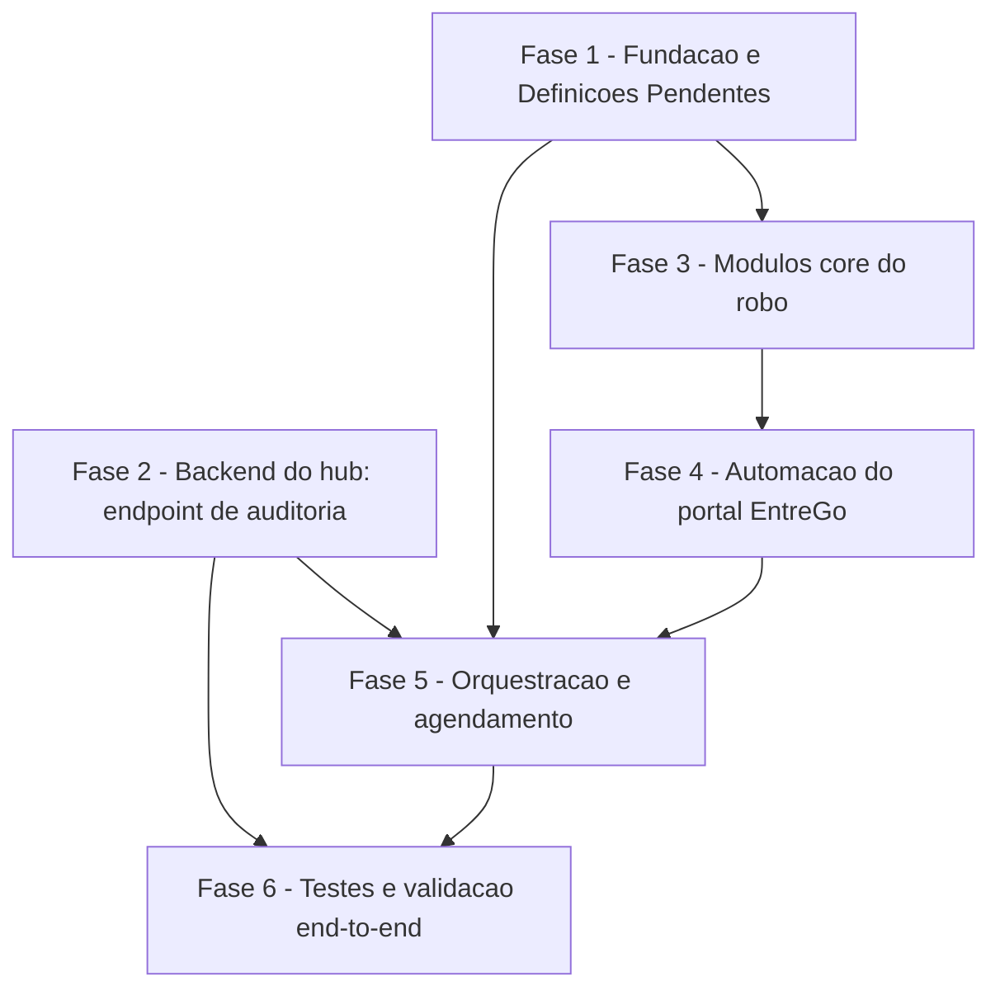

# Tarefas Robô EntreGô - Importação Diária Automática

Escopo: rotina Node.js agendada que coleta os relatórios Performance e Financeiro
do portal do franqueado EntreGô e os envia ao hub via `POST /api/v1/importacoes`,
com sessão persistida, 2FA por IMAP, alerta em falha e parada imediata diante de
qualquer sinal de proteção anti-bot. Baseado em
[spec.md](./spec.md) + [plan.md](./plan.md) + [research.md](./research.md) +
[data-model.md](./data-model.md) + [contracts/](./contracts/) +
[checklists/](./checklists/).

**Legenda de status:**
- `[ ]` Pendente
- `[~]` Em andamento
- `[x]` Concluido
- `[!]` Bloqueado

**Legenda de criticidade:**
- `[C]` Critico - Impacto financeiro direto ou bloqueante
- `[A]` Alto - Funcionalidade essencial
- `[M]` Medio - Necessario mas sem urgencia imediata

---

## FASE 1 - Fundação e Definições Pendentes

### 1.1 Validação empírica do CSV real do EntreGô `[C]`

Ref: research.md Decision 10 (risco declarado, não resolvido no plano)

- [x] 1.1.1 Obter as URLs pré-assinadas do S3 de 1 CSV de cada tipo
      (`performance`, `finance`) — via chamada real ao BFF
      (`contracts/entrego-portal.md`), ambiente controlado, com o operador
      logado (não produção automatizada)
- [x] 1.1.2 Baixar os 2 CSVs e inspecionar cabeçalho/colunas reais
- [x] 1.1.3 Comparar contra `lib/hub-import-normalizer.js` e
      `lib/hub-import-hash.js` (`CAMPOS_HASH_FATURAMENTO`/`CAMPOS_HASH_PERFORMANCE`)
      — os nomes de coluna batem 1:1? **Sim, 19/19 e 20/20, ordem idêntica
      (dec-027).**
- [x] 1.1.4 Documentar o resultado em `docs/specs/robo-entrego/research.md`
      (atualizar Decision 10 com o achado real — bate ou precisa de tradução de
      coluna) — **bloqueia FASE 3 (hub-client.js) até concluída** — CONCLUÍDA,
      FASE 3 destravada

### 1.2 Definição do comportamento de falha parcial `[A]`

Ref: checklists/security.md CHK011 (gap identificado no checklist de requisitos)

- [x] 1.2.1 Confirmar (ou registrar decisão explícita) que, quando 1 de 2
      relatórios falha definitivamente e o outro tem sucesso, as 3 reações de
      FR-013 disparam ISOLADAMENTE para o relatório que falhou (resolução
      padrão já proposta no checklist) — confirmado, dec-025
- [x] 1.2.2 Registrar essa decisão em `spec.md` (nota complementar a FR-013,
      sem reabrir `/clarify` para os demais requisitos) ou em Decisão auditável
      do orquestrador, conforme o fluxo em andamento permitir — feito nos dois
      (dec-025 + nota em spec.md FR-013)
- [x] 1.2.3 Propagar a decisão para `data-model.md` (`Execução
      Agendada.resultado = falha_parcial`) — já compatível, conferir se precisa
      de ajuste — confirmado compatível, nota adicionada

### 1.3 Setup do projeto `infra/robo-entrego/` `[A]`

Ref: plan.md §Project Structure

- [x] 1.3.1 Criar `infra/robo-entrego/package.json` com dependências
      (`playwright`, `imapflow`, `nodemailer`, `axios`) e `npm ci` gerando
      `package-lock.json` versionado
- [x] 1.3.2 Criar esqueleto de diretórios (`src/`, `test/`, `scripts/`, `sql/`)
- [x] 1.3.3 Criar `.env.robo-entrego.example` (template, sem valor real) com
      todos os campos de `data-model.md §Entity: Configuração da Rotina`
      (+ `HUB_BASE_URL`, exigido pela implementação real do `hub-client.js`,
      não listado na tabela original)
- [x] 1.3.4 Criar `config.json` inicial (não-segredo) com 1 horário placeholder

---

## FASE 2 - Backend do hub: endpoint de auditoria (aditivo)

### 2.1 Implementar `POST /api/v1/robo-entrego/eventos` `[A]`

Ref: contracts/hub-api.md §POST /api/v1/robo-entrego/eventos (proposta)

- [x] 2.1.1 Criar `app_homologacao/backend/routes/hub-robo-entrego.js` —
      resolve `entidade_ativa` do token (mesmo padrão de
      `routes/hub-importacoes.js:217-227`), valida `acao` contra a allowlist
      fechada (`robo_entrego.sucesso`\|`falha_definitiva`\|`suspeita_antibot`\|
      `falha_configuracao`), delega para `registrarAuditoria()`
      (`lib/hub-auditoria.js`) com `recurso: 'RoboEntrego'`
- [x] 2.1.2 Montar rota em `server.js`
      (`app.use('/api/v1/robo-entrego', hubRoboEntregoRoutes.router)`), com
      `requirePermission('importacoes.criar')` no mesmo padrão de
      `hub-importacoes.js`
- [x] 2.1.3 Aplicar `authRateLimiter` (ou equivalente) na rota (hardening do
      gate `owasp-security`, research.md Decision 9) — rate limiter próprio
      (`roboEntregoRateLimiter`, chave por usuário autenticado)
- [x] 2.1.4 Testes unit (`node --test`): `acao` fora da allowlist → `422`;
      `acao` válida sem `entidade_ativa` → `400`; `detalhes` passa por
      `scrubDetalhes` antes de gravar — `tests/hub-robo-entrego-unit.test.js`,
      6/6 verde (+ 634 pré-existentes, suíte `test:hub:unit` 640/640)

### 2.2 SQL de provisionamento do usuário de serviço `[A]`

Ref: data-model.md §Entity: Identidade de Serviço do Hub

- [x] 2.2.1 Criar `infra/robo-entrego/sql/001-usuario-servico-robo-entrego.sql`
      — INSERT idempotente em `Usuario` (senha com `bcrypt` via `pgcrypto`,
      nunca texto plano) + vínculo em `UsuarioEntidade` com papel dedicado
      `robo_entrego_servico` (`importacoes.criar` + `importacoes.consultar` —
      a segunda é necessária para o polling de 3.3.4, não estava na task
      original mas é exigida pela rota real) restrito a `id_empresa = 6`
- [x] 2.2.2 Documentar no README do robô que este SQL é um ARTEFATO para o
      operador aplicar — esta pipeline nunca o executa em produção —
      `infra/robo-entrego/README.md`

---

## FASE 3 - Módulos core do robô (Node)

Ref: plan.md §Project Structure `infra/robo-entrego/src/`
**Depende de**: FASE 1.1 concluída (formato do CSV confirmado)

### 3.1 `taxonomia-erro.js` + `log-execucao.js` `[A]`

Ref: research.md Decision 11 (tabela de classificação); data-model.md §Entity:
Execução Agendada

- [x] 3.1.1 Implementar a tabela de classificação de erro (transitório \|
      não-falha \| suspeita-antibot \| sucesso \| falha-do-hub) como função pura
      — `src/taxonomia-erro.js`
- [x] 3.1.2 Implementar escrita JSON Lines (append-only, 1 linha `inicio` + 1
      linha `fim` por `execucao_id`, conforme data-model.md) —
      `src/log-execucao.js`
- [x] 3.1.3 Teste unit: cada linha da tabela de research.md Decision 11 vira 1
      caso de teste (input → classificação esperada) —
      `test/taxonomia-erro.test.js`, 12 casos
- [x] 3.1.4 Teste unit: log nunca inclui campos de credencial (checar
      allowlist de chaves permitidas no objeto logado) —
      `test/log-execucao.test.js` (allowlist positiva, exclui `url_s3`
      explicitamente por ser sensível — data-model.md)

### 3.2 `imap-codigo.js` — leitura do 2FA `[C]`

Ref: research.md Decision 4 + hardening (Decision 4, gate `owasp-security`)

- [x] 3.2.1 Conectar via `imapflow` em **modo read-only** (`\Peek`, nunca
      marcar como lida/deletar) — `getMailboxLock(mailbox, {readOnly:true})`
      em `src/imap-codigo.js`
- [x] 3.2.2 Filtrar mensagens com assunto "Código de Acesso" recebidas APÓS um
      timestamp recebido como parâmetro (o timestamp do
      `POST authentication/validate` da tentativa corrente) — `search` por
      assunto+`since` (granularidade de dia do IMAP) + filtro fino
      client-side por `envelope.date` exato
- [x] 3.2.3 Extrair e validar o código com regex estrita `^\d{6}$` — rejeitar
      (erro explícito, nunca preencher formulário) qualquer conteúdo fora do
      formato — `extrairCodigo()`
- [x] 3.2.4 Teste unit: mensagem antes do timestamp é ignorada; mensagem sem
      match de regex é rejeitada; múltiplas mensagens não lidas → usa a mais
      recente (Edge Case da spec) — `test/imap-codigo.test.js`, 11 casos
      (mock do client ImapFlow, sem servidor real)

### 3.3 `hub-client.js` — login + upload + polling `[A]`

Ref: contracts/hub-api.md (login, importacoes, polling)

- [x] 3.3.1 `POST /api/v1/auth/login` com cookie jar — capturar
      `hub_accessToken`/`hub_refreshToken` — cookie jar MANUAL (Set-Cookie
      capturado e reenviado como header `Cookie:` bruto; sem
      `tough-cookie`/dependência nova, decisão de implementação deixada em
      aberto pelo contrato)
- [x] 3.3.2 Conferir `entidade_ativa` do token decodificado contra
      `HUB_ID_EMPRESA` da configuração — erro de CONFIGURAÇÃO (não retry) se
      não bater — `ErroConfiguracaoHub`
- [x] 3.3.3 `POST /api/v1/importacoes` (multipart, campo `file` + `tipo`) —
      tratar `201` (poll), `409` (sucesso idempotente), `422` (falha do hub,
      registrar `motivo`) — retorna `{sinal}` já no vocabulário de
      `taxonomia-erro.js`
- [x] 3.3.4 Polling em `GET /api/v1/importacoes/:id` até status terminal, com
      timeout total configurável — default 5s/5min (não especificado pela
      spec/plan; default de engenharia documentado no código, ajustável via
      opts)
- [x] 3.3.5 Teste unit (mock HTTP): os 3 ramos de resposta (`201`→poll,
      `409`→sucesso, `422`→falha) e o timeout de polling —
      `test/hub-client.test.js`, 20 casos (mock de `axiosInstance`, relógio
      e sleep injetáveis — sem tempo real nem HTTP real)

### 3.4 `alerta-email.js` `[M]`

Ref: research.md Decision 5

- [x] 3.4.1 Envio via `nodemailer`/SMTP Gmail, reusando a senha de app do IMAP
      — `criarTransportador()` (`smtp.gmail.com:465`)
- [x] 3.4.2 Suporte a múltiplos destinatários (lista separada por vírgula da
      configuração) — `enviarAlerta()`
- [x] 3.4.3 Teste unit: corpo do e-mail nunca inclui segredo/URL pré-assinada
      completa (só o necessário para diagnóstico) —
      `test/alerta-email.test.js`, 6 casos; `montarCorpoAlerta()` reusa a
      MESMA allowlist positiva de `log-execucao.js` (`filtrarRelatorio`)

---

## FASE 4 - Automação do portal EntreGô (Playwright)

Ref: contracts/entrego-portal.md; research.md Decisions 2-3
**Depende de**: FASE 3.2 (leitura do código)

### 4.1 Sessão persistida + sonda de validade `[C]`

Ref: research.md Decision 3

- [x] 4.1.1 Carregar `storageState` de
      `/var/lib/hub_secrets/robo-entrego/entrego-session.json` se existir
      (permissão `600`)
- [x] 4.1.2 Sonda `page.evaluate` de `GET .../authentication/me` — `401`
      dispara login completo (4.2), qualquer outra falha é transitória (retry)
- [x] 4.1.3 Persistir `storageState` novo após login completo bem-sucedido
- [x] 4.1.4 Teste (fixture/mock Playwright, sem tocar portal real): sessão
      válida não relogina; sessão `401` aciona o fluxo completo

### 4.2 Fluxo de login completo (4 passos) `[C]`

Ref: contracts/entrego-portal.md §Login

- [x] 4.2.1 Passo 1-2: preencher e-mail/senha, aguardar habilitação dos
      botões (`:not([disabled])`) antes de clicar
- [x] 4.2.2 Passo 3: localizar e clicar "OK, entendi" (sem `role="dialog"`,
      localizar por texto)
- [x] 4.2.3 Passo 4: preencher código (de 3.2), confirmar, aguardar
      `localStorage.redux.authentication.userData` existir como sinal de sucesso
- [x] 4.2.4 Capturar o timestamp exato do disparo de
      `POST authentication/validate` (passo 2) e repassar para `imap-codigo.js`
- [x] 4.2.5 Teste (fixture/mock): os 4 passos completam com dados de teste;
      timeout em qualquer passo é tratado (não trava indefinidamente)

### 4.3 Fetch dos relatórios + detecção de desafio anti-bot `[C]`

Ref: contracts/entrego-portal.md §GET .../urls; research.md Decision 11

- [x] 4.3.1 `page.evaluate` de `GET .../reports/{TIPO}/urls` para
      `PERFORMANCE` e `FINANCE`, com `initialDate`/`finalDate` = dia anterior
- [x] 4.3.2 Aguardar geração assíncrona ("processando"→"concluído") com
      timeout, tratando estouro como falha de tentativa (FR-004)
- [x] 4.3.3 Detecção conservadora de desafio anti-bot: resposta
      estruturalmente diferente do documentado, elemento esperado ausente
      dentro do timeout, ou HTML no lugar de JSON → interrupção IMEDIATA (nunca
      retry, nunca tentar interpretar)
- [x] 4.3.4 Download dos CSVs via `axios` puro (fora do Playwright — URL
      pré-assinada não precisa de sessão), validar `Content-Type` antes de
      aceitar o corpo como CSV
- [x] 4.3.5 Teste (fixture/mock): resposta fora do schema esperado dispara o
      caminho de "suspeita anti-bot", nunca o de retry transitório

---

## FASE 5 - Orquestração e agendamento

### 5.1 `index.js` — fluxo principal `[A]`

Ref: plan.md §Summary (fluxo completo); research.md Decision 11 (taxonomia)
**Depende de**: FASE 1.2 (definição de falha parcial), FASE 2-4 completas

- [x] 5.1.1 Orquestrar: login hub → conferir entidade → sessão EntreGô →
      (login completo se `401`) → fetch dos 2 relatórios → upload → polling →
      log de execução
- [x] 5.1.2 Aplicar retry com backoff (1/5/15 min) SOMENTE para falhas
      classificadas como transitórias (nunca para suspeita anti-bot)
- [x] 5.1.3 Ao esgotar tentativas (ou suspeita anti-bot confirmada): disparar
      as 3 reações de FR-013 — log, e-mail, `POST /api/v1/robo-entrego/eventos`
      — aplicando a definição de falha parcial da FASE 1.2
- [x] 5.1.4 Lock via `flock -n` no início — `resultado: pulado_lock` e saída
      imediata se já há execução em andamento
- [x] 5.1.5 Teste end-to-end com mocks (Scenarios 1-5, 7 de quickstart.md)

### 5.2 Infra de agendamento (systemd) `[A]`

Ref: research.md Decisions 6-8

- [x] 5.2.1 `scripts/docker-run.sh` — `docker run --rm` da imagem Playwright
      pinada, bind mounts de `src/`, `node_modules/` e
      `/var/lib/hub_secrets/robo-entrego/`
- [x] 5.2.2 `scripts/gerar-timer.sh` — lê `config.json`, regenera
      `OnCalendar=` múltiplo em `robo-entrego.timer`, roda
      `systemctl daemon-reload` (documentado, não executado por esta pipeline)
- [x] 5.2.3 `robo-entrego.service` (oneshot, `Nice=10`,
      `IOSchedulingClass=idle`, `Requires=docker.service`) e
      `robo-entrego.timer` — mesmo padrão de `infra/producao/backup-producao.*`
- [x] 5.2.4 Teste manual documentado (não executado): `systemctl start
      robo-entrego.service` roda uma execução isolada, sem esperar o timer

### 5.3 README operacional `[M]`

- [x] 5.3.1 Documentar instalação do timer, como rodar manualmente, como ler
      o log JSON Lines, como trocar horários (editar `config.json` +
      `scripts/gerar-timer.sh`)
- [x] 5.3.2 Documentar o rito de aplicação em produção (rito de produção do
      projeto — fora do escopo desta pipeline, mas o README aponta os passos)

---

## FASE 6 - Testes e validação end-to-end

**Depende de**: FASE 2 (endpoint novo), FASE 5 (orquestração)

### 6.1 Suíte unit consolidada `[A]`

- [x] 6.1.1 Rodar `node --test` em `infra/robo-entrego/test/` — todas as
      suítes das FASEs 2-4 verdes (verificado 2026-08-28: 116/116 testes,
      33 suites, 0 falhas)
- [x] 6.1.2 Cobertura mínima dos módulos com lógica de decisão
      (`taxonomia-erro.js`, `imap-codigo.js`, `hub-client.js`) — medida com
      `node --test --experimental-test-coverage`: taxonomia-erro.js 100%
      linhas/100% branch, imap-codigo.js 100% linhas/84% branch,
      hub-client.js 97.33% linhas/85% branch (linhas 61-62, 121, 138-139
      não cobertas — branches de erro secundários, não decisão principal)

### 6.2 Roundtrip real contra `hub-homolog` `[A]`

Ref: quickstart.md Scenario 6

- [x] 6.2.1 Subir `hub-homolog` (`infra/hub/RUNBOOK.md`), aplicar o SQL da
      FASE 2.2 nesse ambiente de teste — hub-homolog já estava no ar (7
      semanas); aplicado o SQL de 001-usuario-servico-robo-entrego.sql
      adaptado para `empresa_id=9001` (QA, único id existente neste banco
      isolado — produção usa `6`), idempotência confirmada (2ª execução
      sem erro, mesma linha). Bug real encontrado e CORRIGIDO no próprio
      artefato: `psql` não interpola `:'var'` dentro de `DO $$...$$`
      (nunca havia sido testado); fix via `set_config()`/`current_setting()`
      fora do bloco `DO`
- [x] 6.2.2 `curl` real: login + `POST /api/v1/robo-entrego/eventos` +
      `GET /api/v1/auditoria` confirmando a linha (payload real, não mock)
      — rebuild + restart de `hub_homolog_backend` (imagem anterior não
      tinha a rota nova) sob rito anti-starvation
      (`docker compose build --memory=2g`); login (200) → `POST
      /me/entidade` (200, necessário — ver 6.2.3) → `POST
      /robo-entrego/eventos` com `acao=robo_entrego.sucesso` → `201
      {"ok":true}`; allowlist testada com ação inválida → `422 INVALIDO`;
      linha confirmada em `GET /api/v1/auditoria` (login com a conta QA
      `admin_entidade`, que tem `auditoria.consultar` — o usuário de
      serviço do robô não precisa dessa permissão, least privilege
      preservado) com `recurso:"RoboEntrego"`, `acao`, `detalhes`
      (`scrubDetalhes` aplicado) e `entidadeId` corretos. Reproduzido
      depois com o `hub-client.js` REAL (não mock) contra o hub-homolog
      real, confirmando o fix de 6.2.3 fora de mocks
- [x] 6.2.3 Documentar qualquer divergência de nome de campo encontrada
      (drift do contrato proposto vs. implementação real) — **2 drifts
      reais, documentados em contracts/hub-api.md**: (1) CRÍTICO — o token
      de `POST /auth/login` NUNCA carrega `entidade_ativa`
      (`routes/hub-auth.js#gerarAccessToken` assina só `{sub,email}`); a
      claim só existe após `POST /api/v1/me/entidade`. `hub-client.js`
      assumia (como o contrato, incorretamente) que login já entregava a
      claim — sempre lançaria `ErroConfiguracaoHub` em produção.
      CORRIGIDO: `login()` agora encadeia `/auth/login` →
      `/me/entidade` → confere `entidade_ativa`; testes atualizados
      (hub-client.test.js) + validado com o cliente real contra
      hub-homolog (não só mock). (2) pré-existente, fora de escopo — os
      filtros `acao`/`recurso` de `GET /auditoria` usam regex
      `^[a-z0-9_]+$` (minúsculo, sem ponto), incompatível com os valores
      reais gravados (`robo_entrego.sucesso` tem `.`; `RoboEntrego` é
      CamelCase) — e já valia antes desta feature para outros recursos
      (`Usuario`, `UsuarioEntidade`). Filtro inutilizável para estes
      valores; contorno é listar sem filtro. Endpoint novo em si
      (`/robo-entrego/eventos`) bateu 1:1 com o contrato: `acao`/
      `detalhes`/`{"ok":true}` sem nenhuma divergência de nome de campo

### 6.3 Fluxo completo contra fixture/mock do portal `[A]`

Ref: quickstart.md Scenarios 1-5, 7

- [x] 6.3.1 Gravar fixture de `storageState` + respostas mockadas do BFF do
      EntreGô (nunca contra o portal de produção do franqueado nesta pipeline)
      — `test/e2e-fixture/fixtures/` (storage-state.json + login.html +
      login-challenge.html) e `test/e2e-fixture/lib/mock-bff.js` (rotas
      Playwright interceptadas do BFF, CORS refletido). Achado de desenho:
      `sondarSessaoValida`/`buscarUrlsRelatorio` chamam `fetch` de dentro do
      browser ANTES de qualquer `page.goto()` no caminho feliz (sessão já
      válida) — a página fica em `about:blank`/origem opaca; sem refletir
      `Access-Control-Allow-Origin`/`-Credentials` (e responder o preflight
      `OPTIONS` dos headers customizados `X-IFood-Logistics-Auth` etc.) o
      `fetch` falha por CORS antes de chegar no mock. Confirmado
      empiricamente rodando as funções REAIS de `src/entrego-portal.js`
      (não reimplementadas) contra o mock, dentro do container oficial
- [x] 6.3.2 Rodar os 5 cenários de quickstart.md (happy path, sessão expirada,
      anti-bot, retry, duplicado) contra a fixture — `test/e2e-fixture/
      scenarios.test.js`, rodando `executarRodada` REAL (src/index.js) com
      Chromium REAL (container `mcr.microsoft.com/playwright:v1.62.1-jammy`,
      via `scripts/testar-fixture-e2e.sh`); só `clienteHub`/`obterCodigo`/
      `transportador`/`axiosInstance` são mock (hub já validado real na
      6.2). **5/5 verdes**: Scenario 1 sessão reutilizada (sem tocar a
      página de login) 2/2 sucesso; Scenario 2 login completo de 4 passos
      (fixture `login.html`) + `storageState` persistido; Scenario 3
      anti-bot no login (fixture `login-challenge.html`, sem `input#email`)
      → `ErroAntibotSuspeito`, `falha_total`, `tentativas_totais=1` (zero
      retry, ~30s = timeout real de login não contornado); Scenario 4 dois
      `5xx` + backoff real (`dormir` injetado, sem esperar de verdade) →
      3ª tentativa sucesso, `tentativas=3`; Scenario 5 `409` do hub →
      `duplicado` tratado como sucesso, sem retry. `node --test` — 5 pass,
      0 fail. `package-lock.json` conferido inalterado após a execução (o
      driver usa `node --test` com o `playwright` já instalado via bind
      mount — nunca `npm install` dentro do container, então o gotcha do
      lockfile reescrito nem chega a se aplicar aqui)
- [x] 6.3.3 Rodar o cenário de lock (Scenario 7) com duas invocações
      simultâneas do `docker-run.sh` — `scripts/testar-lock.sh`, com
      `ROBO_ENTREGO_SECRETS_DIR` isolado em diretório scratch (nunca
      `/var/lib/hub_secrets/robo-entrego` real) e sem credenciais no
      ambiente (`node src/index.js` falha rápido em `lerConfiguracao()`
      ANTES de qualquer rede/Playwright — a 1ª invocação não chega a tocar
      o portal). **Confirmado**: das 2 invocações quase simultâneas,
      exatamente 1 encontrou `flock -n` ocupado e caiu no ramo
      `--pulado-lock` (mensagem `[docker-run] lock ocupado ... registrando
      pulado_lock` em stderr, emitida pelo wrapper bash fora do container);
      a outra rodou sem interferência. Achado de bancada (não é bug —
      confirma o próprio comentário de `docker-run.sh`): quando
      `ROBO_ENTREGO_SECRETS_DIR` difere do default hardcoded em
      `LOG_PATH_DEFAULT`, a linha `pulado_lock` do log JSON Lines é escrita
      dentro do filesystem efêmero do container (`--rm`), não fica visível
      no host — por isso a verificação usa a mensagem de stderr do wrapper
      (fora do container), não o arquivo de log

---

## Matriz de Dependencias

## Resumo Quantitativo

| Fase | Tarefas | Subtarefas | Criticidade |
|------|---------|------------|-------------|
| 1 - Fundação e Definições Pendentes | 3 | 11 | C/A |
| 2 - Backend do hub (endpoint auditoria) | 2 | 6 | A |
| 3 - Módulos core do robô | 4 | 16 | A/C/M |
| 4 - Automação do portal EntreGô | 3 | 14 | C |
| 5 - Orquestração e agendamento | 3 | 11 | A/M |
| 6 - Testes e validação end-to-end | 3 | 8 | A |
| **Total** | **18** | **66** | - |

## Escopo Coberto

| Item | Descrição | Fase |
|------|-----------|------|
| FR-001..FR-016 | Todos os requisitos funcionais da spec | 1-6 |
| CHK011 (security.md) | Definição de falha parcial entre relatórios | 1.2 |
| Endpoint novo de auditoria (proposta do plan) | `POST /api/v1/robo-entrego/eventos` | 2 |
| Riscos declarados em plan.md §Complexity Tracking | CSV real, causa do 401, assinatura anti-bot, endpoint novo | 1.1, 4.1, 4.3, 6.2 |

## Escopo Excluído

| Item | Descrição | Motivo |
|------|-----------|--------|
| Aplicação do SQL/timer em produção | Provisionamento real do usuário de serviço, instalação do timer no VPSTodo | Rito de produção do projeto — fora do escopo de execução desta pipeline SDD (CLAUDE.md, autorização por etapa) |
| Deploy do endpoint novo do backend | Build+push+`docker service update` da imagem com a rota nova | Idem — pipeline produz o código, não o publica |
| Teste contra o portal EntreGô real de produção do franqueado | Qualquer execução automatizada tocando o portal ao vivo | Risco de anti-bot em produção do franqueado; FASE 4/6 usam fixture/mock |
| CHK003/CHK008 (security.md) | Múltiplos códigos de e-mail no mesmo login; assinatura formal de desafio anti-bot | Marcados `{humano}` no checklist — decisão de produto, não bloqueante para este backlog |
| CHK006 (requirements.md) | Formalização da distinção transitório/definitivo na linguagem da spec | Observação de clareza, não-bloqueante; resolução técnica já existe em research.md |
