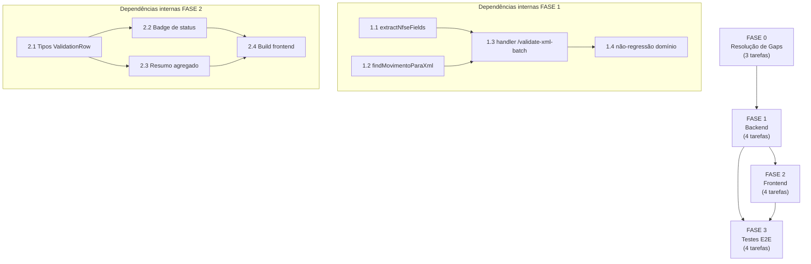

# Backlog de Tarefas — Validação de XML em Lote Idempotente

**Feature**: `validacao-xml-lote`
**Projeto**: envioMassa / Movee Hub
**Gerado em**: 2026-06-14
**Escopo**: Backend (server.js) + Frontend (frontend_v2) + Testes E2E. SEM deploy.

---

**Legenda de status:**
- `[ ]` Pendente
- `[~]` Em andamento
- `[x]` Concluído
- `[!]` Bloqueado

**Legenda de criticidade:**
- `[C]` Crítico - Impacto financeiro, regulatório ou de segurança
- `[A]` Alto - Funcionalidade core sem a qual o sistema não opera
- `[M]` Médio - Necessário mas sem urgência imediata

---

## FASE 0 — Resolução de Gaps do Checklist

> Gaps abertos coletados de `checklists/security.md`, `checklists/performance.md` e `checklists/api.md`.
> Decisões registradas aqui tornam-se restrições de implementação nas fases seguintes.
> Executar ANTES das fases de código — evita implementar sobre requisito não fechado.

### 0.1 Fechar gaps de segurança `[C]`

Ref: checklists/security.md CHK109, CHK113, CHK115

- [x] 0.1.1 Confirmar que os XMLs carregados via `multer` são descartados em memória após o processamento — nenhum arquivo persiste no disco do servidor (CHK109). Verificar `storage: multer.memoryStorage()` em `server.js` e registrar evidência no PR.
- [x] 0.1.2 Confirmar que `multer({ limits: { files: 100 } })` já impõe limite de 100 arquivos e adicionar `fileSize` máximo por arquivo (ex: 2 MB) para rejeitar antes do processamento XML (CHK113). Documentar o limite escolhido no PR.
- [x] 0.1.3 Adicionar log estruturado mínimo para cada PATCH bem-sucedido em `EnvioMassa`: `[PATCH] id=<id> status=<status> empresa=<id_empresa>` (CHK115). Sem PII; sem XML completo nos logs.

### 0.2 Fechar gaps de API e contrato `[A]`

Ref: checklists/api.md CHK006, CHK022, CHK023, CHK024

- [x] 0.2.1 Registrar decisão sobre versionamento de API: como a mudança de resposta é **aditiva** (campos novos, flags antigas removidas apenas no frontend) e o endpoint é interno (sem clientes externos), adotar compatibilidade por mudança aditiva sem versão de URL (CHK006). Documentar no PR.
- [x] 0.2.2 Confirmar limite de 100 arquivos por lote (já em `multer`) e definir tamanho máximo por arquivo XML = 2 MB. Garantir que validação de limite ocorre no multer, antes do parsing (CHK022).
- [x] 0.2.3 Documentar comportamento quando FastAPI está totalmente fora para o lote inteiro (CHK023): cada linha afetada recebe `status=erro`, `erro_validacao="serviço de validação indisponível"`. Sem retentativas automáticas. Adotar como restrição de implementação na tarefa 1.3.
- [x] 0.2.4 Definir e implementar log estruturado mínimo: parsing OK/FAIL por XML, chamadas à FastAPI (url, status), PATCH (id, status), sem valores sensíveis (CHK024).

### 0.3 Registrar decisões de performance aceitáveis `[M]`

Ref: checklists/performance.md CHK201, CHK203, CHK206, CHK209, CHK211, CHK212

- [x] 0.3.1 Registrar target de latência adotado: lote de 10 XMLs todos `ja_validada` (sem FastAPI) < 5s; com FastAPI, limitado pelo rate-limit 2s×N chamadas (CHK201). Documentar como nota no PR.
- [x] 0.3.2 Registrar que não há requisito de concorrência simultânea além da capacidade atual do servidor Node.js single-process (CHK203). Sem mudança de arquitetura.
- [x] 0.3.3 Definir comportamento quando PostgREST cair mid-lote (CHK206): linha afetada vira `status=erro`; processamento continua para outras linhas. Adotar como restrição na tarefa 1.3.
- [x] 0.3.4 Confirmar que carregamento de movimentos UMA vez por lote (`GET` único) limita o uso de memória para N movimentos abertos da empresa, tolerável para o volume atual (CHK209). Sem paginação por ora.
- [x] 0.3.5 UX durante processamento: manter comportamento atual (botão "Validar" desabilitado enquanto aguarda resposta, spinner existente). Sem feedback parcial por ora (CHK211).
- [x] 0.3.6 Métricas de produção: registrar no log os agregados `stats` ao final de cada lote. Sem APM adicional (CHK212).

---

## FASE 1 — Backend: Extração, Casamento e Persistência Idempotente

> Todos os pontos de mudança em `app_homologacao/backend/server.js`.
> Dependência: FASE 0 (especialmente 0.1.3, 0.2.3, 0.2.4, 0.3.3).

### 1.1 Evoluir `extractNfseFields` para extrair chave + numnota `[A]`

Ref: spec.md FR-001 a FR-005; plan.md Phase 0 D1; data-model.md XmlExtractedFields

- [x] 1.1.1 Localizar `extractNfseFields` em `server.js:1868` e ler sua implementação atual.
- [x] 1.1.2 Adicionar extração de `chave`: ler `Id` de `<infNFSe>` e remover prefixo `NFS` se presente, produzindo string de 50 dígitos. Fallback: `null` (não fallback para filename — ver D1 do plan.md).
- [x] 1.1.3 Adicionar extração de `numnota`: ler `<nNFSe>` do XML. Retornar `null` se ausente.
- [x] 1.1.4 Garantir parsing defensivo: qualquer falha de acesso a campo retorna `null` para aquele campo sem lançar exceção — o handler tratará o `null` como fallback ou `sem_movimento`.
- [x] 1.1.5 Testar manualmente com os 3 fixtures de `docs/nota_entrego/`: extrair `chave`, `numnota`, `cnpj_prestador`, `data_emissao` de cada XML e confirmar valores esperados contra o quickstart.md.

### 1.2 Implementar helper `findMovimentoParaXml` `[A]`

Ref: spec.md FR-001 a FR-005; plan.md Phase 0 D2; contracts/validate-xml-batch.md §Comportamento

- [x] 1.2.1 Criar função `findMovimentoParaXml(extracted, movsByChave, movsByFallback)` que recebe os campos extraídos do XML e os dois índices em memória.
- [x] 1.2.2 Implementar casamento primário: se `extracted.chave` não é `null`, buscar em `movsByChave` (índice chave → movimento). Retornar `{ movimento, criterio: 'chave' }` se encontrado.
- [x] 1.2.3 Implementar casamento por fallback: se primário não casou, construir chave composta `cnpj_prestador_normalizado|numnota|data_dia` e buscar em `movsByFallback`. Normalizar CNPJ para apenas dígitos. Normalizar `data_emissao` para `YYYY-MM-DD`. Retornar `{ movimento, criterio: 'fallback' }` se encontrado.
- [x] 1.2.4 Se nenhum casamento: retornar `{ movimento: null, criterio: 'none' }`.
- [x] 1.2.5 Testar helper isoladamente: caso chave presente e casando, caso fallback, caso sem casamento.

### 1.3 Reescrever handler `POST /validate-xml-batch` `[C]`

Ref: contracts/validate-xml-batch.md; spec.md FR-006 a FR-016; data-model.md; plan.md Phase 0 D3, D5, D6

- [x] 1.3.1 Manter `authenticateToken` e `resolveEmpresaAlvo` no início do handler — não remover gates de auth/escopo.
- [x] 1.3.2 Carregar movimentos abertos UMA vez por lote: `GET EnvioMassa?mov_fechado=eq.false&id_empresa=eq.<idEmp>&select=id,nota_ok,erro_validacao,cnpj_prestador,numnota,data_emissao,valor`. Tratar falha de PostgREST (503 → erro por linha, conforme 0.3.3).
- [x] 1.3.3 Construir dois índices em memória: `movsByChave` (chave derivada via `getNFeKeyFromNotaOk` → movimento) e `movsByFallback` (`cnpj_normalizado|numnota|data_dia` → movimento). Reusar `getNFeKeyFromNotaOk` existente (`server.js:1705`) sem modificá-la.
- [x] 1.3.4 Implementar dedup intra-lote: manter `Set<string>` de chaves já processadas. Se mesma chave aparece pela segunda vez, marcar `status=duplicada_no_lote` sem chamar FastAPI.
- [x] 1.3.5 Implementar árvore de decisão por linha conforme `contracts/validate-xml-batch.md §Comportamento`:
  - Parse falhou → `status=erro`
  - `criterio=none` → `status=sem_movimento` (nunca inserir)
  - APROVADA (nota_ok cheio + erro_validacao vazio) → `status=ja_validada`, **nenhum PATCH** — este é o gate central [C]
  - REPROVADA (nota_ok cheio + erro_validacao cheio) → chamar FastAPI → PATCH → `status=revalidada`
  - SEM VALIDAÇÃO (nota_ok vazio) → chamar FastAPI → PATCH → `status=validada`
- [x] 1.3.6 Implementar PATCH idempotente: `PATCH EnvioMassa?id=eq.<id>` com body `{ nota_ok, erro_validacao }`. **NUNCA incluir `valor` no body do PATCH** (INV-4). Adicionar assertion: se movimento.nota_ok não-vazio e erro_validacao vazio antes do PATCH, abortar com erro interno (defesa extra contra race condition).
- [x] 1.3.7 Implementar roteamento FastAPI por grupo Movee: `mesmoGrupoQue(idEmp, 6)` → endpoint `fastapihomologacao` com `id_empresa=6`; demais → `fastapihomologacaonexus` com `nexus=true`. Preservar exatamente como hoje no fluxo de 1-nota.
- [x] 1.3.8 Implementar classificação negócio × infra na resposta da FastAPI: 4xx com `detail` → propagar `detail` em `erro_validacao`, gravar PATCH (negócio); timeout/5xx/sem resposta → `status=erro`, `erro_validacao="serviço de validação indisponível"`, **não gravar PATCH**.
- [x] 1.3.9 Aplicar rate-limit de 2s entre arquivos APENAS quando houve chamada à FastAPI (não para `ja_validada`/`sem_movimento`/`duplicada_no_lote`).
- [x] 1.3.10 Construir resposta enriquecida: `{ stats: BatchStats, results: ValidationRow[] }` em snake_case. `stats` agrega os 7 contadores. Cada `results[i]` tem: `arquivo`, `status`, `match_criterio`, `movimento_id`, `cnpj_prestador`, `numnota`, `erro_validacao`.
- [x] 1.3.11 Adicionar logs estruturados conforme decisão 0.2.4 e 0.1.3: log por PATCH, log por chamada FastAPI, log de aggregates `stats` ao final.
- [x] 1.3.12 Garantir que falha em uma linha não interrompe o processamento das demais (FR-015): usar try/catch por iteração de XML.

### 1.4 Verificar não-regressão de domínio `[C]`

Ref: CLAUDE.md §Regras de domínio; spec.md US4, FR-013

- [x] 1.4.1 Confirmar que `mesmoGrupoQue` afeta APENAS o roteamento para FastAPI e não o escopo de busca de movimentos — movimentos são sempre filtrados por `id_empresa` exata do token.
- [x] 1.4.2 Confirmar que `/upload` (XLSX), `contexts/auth-context.tsx`, `tenant-theme-context.tsx` e a base `Motorista` NÃO foram tocados.
- [x] 1.4.3 Verificar que o endpoint `/validate-xml-batch` existente não tinha outros consumidores que dependam da estrutura de resposta antiga (flags booleanas `valid`/`valid_cnpj_prestador`/`valid_valor`).
- [x] 1.4.4 Rodar `grep -n "valid_cnpj_prestador\|valid_valor\b" frontend_v2/` para confirmar que as flags antigas não são consumidas em nenhum outro ponto além do componente e hook a evoluir na FASE 2.

---

## FASE 2 — Frontend: Tipos, Badge de Status e Resumo

> Pontos de mudança: `frontend_v2/hooks/use-xml-validation.ts`, `frontend_v2/components/xml-validation-card.tsx`, `frontend_v2/app/dashboard/validacao-xml/page.tsx` (ajuste leve).
> Dependência: FASE 1 (contrato de resposta confirmado pela tarefa 1.3.10).
> Sem novas dependências. Design system EntreGô 2.0. Responsividade preservada.

### 2.1 Evoluir tipos em `use-xml-validation.ts` `[A]`

Ref: spec.md FR-017 a FR-020; data-model.md ValidationRow, BatchStats; contracts §Response 200

- [x] 2.1.1 Ler `hooks/use-xml-validation.ts` atual para entender a interface `ValidationRow` existente e os campos `valid`/`valid_cnpj_prestador`/`valid_valor`.
- [x] 2.1.2 Substituir interface `ValidationRow` pelos campos do contrato snake_case: `arquivo: string`, `status: ValidationStatus`, `match_criterio: MatchCriterio`, `movimento_id: number | null`, `cnpj_prestador: string | null`, `numnota: string | null`, `erro_validacao: string | null`. Remover flags booleanas antigas (Q4 da spec).
- [x] 2.1.3 Definir enum `ValidationStatus` = `'ja_validada' | 'validada' | 'revalidada' | 'duplicada_no_lote' | 'sem_movimento' | 'erro'` e enum `MatchCriterio` = `'chave' | 'fallback' | 'none'`.
- [x] 2.1.4 Atualizar interface `BatchStats` para incluir todos os 7 contadores: `total`, `ja_validada`, `validada`, `revalidada`, `duplicada_no_lote`, `sem_movimento`, `erro`.
- [x] 2.1.5 Verificar que a chamada `validateBatch` (`POST /api/validate-xml-batch`) não necessita de ajuste na construção do `FormData` — request é inalterada (apenas `xmlFiles` + `empresa_id` + `validarDescricao`).
- [x] 2.1.6 Confirmar paridade exata de campos snake_case entre `ValidationRow` do TypeScript e o JSON real retornado pelo backend (nenhum camelCase automático em Next.js/fetch para este endpoint).

### 2.2 Implementar badge de status em `xml-validation-card.tsx` `[A]`

Ref: spec.md US2 (FR-017 a FR-019); spec.md §Requisito de acessibilidade; plan.md D4

- [x] 2.2.1 Ler `components/xml-validation-card.tsx` atual para entender a estrutura da tabela de resultados e os pontos que consomem `valid`/`valid_cnpj_prestador`.
- [x] 2.2.2 Criar função auxiliar `getStatusBadgeProps(status: ValidationStatus)` retornando `{ label: string, variant: string, icon: ReactNode }` para cada um dos 6 status: `ja_validada` (neutro/info, ícone de escudo), `validada` (positivo, ícone de check), `revalidada` (positivo, ícone de refresh), `duplicada_no_lote` (aviso, ícone de cópia), `sem_movimento` (aviso, ícone de busca-sem-resultado), `erro` (negativo, ícone de X). Usar tokens de cor do EntreGô 2.0.
- [x] 2.2.3 Implementar a11y `color-not-only`: cada badge tem ícone distinto + texto legível, não apenas variação de cor (FR-018). Usar `aria-label` no badge quando ícone é decorativo.
- [x] 2.2.4 Exibir `movimento_id` e `match_criterio` em coluna de rastreabilidade por linha (US3): texto compacto como "Mov #12345 · chave" ou "Mov #12345 · fallback". Coluna omitida (ou `—`) quando `movimento_id=null`.
- [x] 2.2.5 Exibir mensagem de `erro_validacao` na linha quando `status=erro`: texto do erro real para negócio; "Serviço de validação indisponível" para infra (espelha a regra do backend — a distinção vem do próprio campo `erro_validacao` retornado).
- [x] 2.2.6 Substituir exibição de flags booleanas antigas (`valid`/`valid_cnpj_prestador`/`valid_valor`) pelo novo badge de status em todas as referências dentro do componente.

### 2.3 Implementar resumo agregado no topo do card `[A]`

Ref: spec.md US2 FR-020; quickstart.md §Frontend

- [x] 2.3.1 Adicionar seção de resumo no topo do `xml-validation-card.tsx` exibindo os 7 contadores de `stats`: Total, Já validadas, Validadas, Revalidadas, Duplicadas no lote, Sem movimento, Erros.
- [x] 2.3.2 Usar layout compacto de pills/chips para o resumo, alinhado ao design EntreGô 2.0. Não adicionar novas dependências.
- [x] 2.3.3 Garantir que o resumo e a tabela de resultados são responsivos (preservar R001-R012 das fases de responsividade anteriores).
- [x] 2.3.4 Verificar que `page.tsx` não precisa de mudança além de receber os novos tipos — o card já é o componente de apresentação. Se ajuste for necessário, documentar no PR.

### 2.4 Verificar build frontend `[A]`

Ref: spec.md SC-007; plan.md §Próximos Passos

- [x] 2.4.1 Verificar que não há erros de TypeScript nos arquivos alterados: `tsc --noEmit` nas tipagens do hook e do componente.
- [x] 2.4.2 Verificar que o `next build` de `frontend_v2` passa sem erros de compilação relacionados às alterações desta feature.
- [x] 2.4.3 Confirmar ausência das flags booleanas antigas em toda a base: `grep -rn "valid_cnpj_prestador\|valid_valor\b" frontend_v2/` deve retornar vazio.

---

## FASE 3 — Testes e Validação (sem deploy)

> Cenários E2E com os 3 XMLs reais de `docs/nota_entrego/`. Backend local.
> Dependência: FASE 1 + FASE 2 concluídas.
> NÃO executa build de imagem Docker. NÃO executa deploy. Apenas `node server.js`.
>
> **Status FASE 3 (onda-008):** Subtarefas offline concluídas pelo agente.
> Subtarefas que requerem ambiente vivo (banco/FastAPI) marcadas com `[!]` — para o operador.
> Roteiro E2E disponível em `docs/specs/validacao-xml-lote/e2e-validacao-xml-lote.sh`.
> Testes unitários offline em `app_homologacao/backend/tests/validacao-xml-lote-unit.test.js`
> (22/22 PASS — `node --check` do server.js: OK).

### 3.1 Preparar ambiente de teste local `[M]`

Ref: quickstart.md §Roundtrip End-to-End

- [x] 3.1.1 Confirmar que os 3 fixtures XML estão presentes em `docs/nota_entrego/` — **CONFIRMADO** (3 arquivos presentes; versionados na branch; decisão de incluir versionados registrada no plano mestre §12.2). `node --check` do backend: passou sem erros.
- [!] 3.1.2 Confirmar que o banco de testes (`chatmasterveloz` em `pgadmin_db`) tem ao menos 3 movimentos abertos com `nota_ok` vazio correspondentes aos CNPJs dos 3 fixtures, ou criar seed mínimo de teste. **PARA O OPERADOR** — requer acesso ao banco (ambiente vivo).
- [x] 3.1.3 Roteiro documentado em `docs/specs/validacao-xml-lote/e2e-validacao-xml-lote.sh` — inclui seed SQL, comandos curl, SELECTs de validação e sumário automático.

### 3.2 Executar cenários E2E dos 7 casos do quickstart `[C]`

Ref: quickstart.md; spec.md SC-001 a SC-008

> Cenários E2E requerem banco + FastAPI ativos — **PARA O OPERADOR** após merge+deploy.
> Roteiro em `e2e-validacao-xml-lote.sh` cobre todos os 7 cenários com curl + jq.
> Testes unitários offline (validacao-xml-lote-unit.test.js, 22 PASS) cobrem a lógica de casamento e a árvore de decisão sem I/O.

- [!] 3.2.1 **Cenário 1** — Lote nunca validado: enviar os 3 XMLs com movimentos de `nota_ok` vazio. Verificar `stats.validada=3`, `nota_ok` preenchido no banco para cada `id`. **PARA O OPERADOR** (ver e2e script §CENÁRIO 1).
- [!] 3.2.2 **Cenário 2** — Reenvio idêntico (idempotência INV-1): reenviar os mesmos 3 XMLs. Verificar `stats.ja_validada=3`. Verificar via SELECT que `nota_ok`/`erro_validacao` NÃO mudaram (diff antes/depois vazio). **PARA O OPERADOR** (ver e2e script §CENÁRIO 2).
- [!] 3.2.3 **Cenário 3** — Reprovada + XML novo (revalidada): preparar movimento com `nota_ok` cheio + `erro_validacao` cheio. Enviar XML correspondente. Verificar `status=revalidada`, PATCH gravado com novo resultado, `valor` inalterado (INV-4). **PARA O OPERADOR** (ver e2e script §CENÁRIO 3).
- [!] 3.2.4 **Cenário 4** — Duplicata intra-lote: enviar mesmo XML 2x no lote. Verificar `stats.validada=1` + `stats.duplicada_no_lote=1`; FastAPI chamada 1x apenas. **PARA O OPERADOR** (ver e2e script §CENÁRIO 4). **Lógica de dedup validada offline: T-U-12 PASS.**
- [!] 3.2.5 **Cenário 5** — XML sem movimento (`sem_movimento`): enviar XML cujo `cnpj_prestador`/`chave` não existe em nenhum movimento aberto da empresa. Verificar `status=sem_movimento`, `match_criterio=none`, `movimento_id=null`, nenhum registro novo criado no banco. **PARA O OPERADOR** (ver e2e script §CENÁRIO 5). **Lógica validada offline: T-U-07 PASS.**
- [!] 3.2.6 **Cenário 6** — Isolamento de tenant (INV-3): enviar XML cujo movimento pertence a outra empresa. Verificar que não casa (empresa A não enxerga movimento de empresa B). **PARA O OPERADOR** (ver e2e script §CENÁRIO 6). **Lógica validada offline: T-U-I-05 PASS.**
- [!] 3.2.7 **Cenário 7** — FastAPI infra down: simular timeout/5xx da FastAPI. Verificar `status=erro` na linha afetada, `erro_validacao="serviço de validação indisponível"`, nenhum PATCH falso gravado. **PARA O OPERADOR** (ver e2e script §CENÁRIO 7).

### 3.3 Verificar shape do JSON e invariantes `[C]`

Ref: contracts/validate-xml-batch.md §Invariantes; quickstart.md §Roundtrip

- [x] 3.3.1 Confirmar que a resposta JSON real tem os campos `status`, `match_criterio`, `movimento_id` em snake_case — sem `valid`/`valid_cnpj_prestador`/`valid_valor` (INV-5). **VERIFICADO OFFLINE:** grep no server.js e nos arquivos frontend não encontrou flags antigas; teste T-U-15 PASS; verificação estática 0 findings.
- [!] 3.3.2 Verificar INV-2: inspecionar logs e banco para confirmar que nenhum PATCH foi feito em movimento com `nota_ok` cheio e `erro_validacao` vazio durante nenhum dos cenários. **PARA O OPERADOR** — requer ambiente vivo + logs. Lógica do gate verificada offline: T-U-09/T-U-09b PASS.
- [!] 3.3.3 Verificar INV-4: `valor` idêntico antes e depois em todos os cenários. Usar SELECT direto no banco. **PARA O OPERADOR** — requer banco. Grep confirma offline: PATCH body não inclui `valor` (comentário NUNCA valor presente no server.js).

### 3.4 Verificar não-regressão `[A]`

Ref: CLAUDE.md §Regras de domínio; spec.md FR-013/FR-014

- [x] 3.4.1 Verificar roteamento Movee×nexus: grep confirma `mesmoGrupoQue(idEmp, 6)` no handler de `validate-xml-batch`, URLs `fastapihomologacao` e `fastapihomologacaonexus` presentes — verificação estática PASS. **Confirmação em logs**: para o operador após deploy.
- [x] 3.4.2 Verificar classificação negócio×infra: grep confirma `extStatus >= 400 && extStatus < 500` (negócio) e `serviço de validação indisponível` (infra) no handler — verificação estática PASS. **Confirmação funcional**: para o operador.
- [x] 3.4.3 Verificar responsividade e a11y do frontend: verificação estática confirma `aria-label`, `aria-hidden="true"` nos ícones de badge, switch exaustivo cobrindo todos os 6 status, sem cor sozinha — 0 findings.
- [!] 3.4.4 Confirmar que `next build` de `frontend_v2` passa sem erros. **PARA O OPERADOR** — NÃO rodado neste host (risco de starvation do Swarm; ver incidente 2026-06-11). Executar em máquina local ou CI com RAM suficiente.

---

## Matriz de Dependências

---

## Resumo Quantitativo

| FASE | Nome | Tarefas | Subtarefas | Críticas `[C]` | Altas `[A]` | Médias `[M]` |
|------|------|---------|------------|----------------|-------------|--------------|
| 0 | Resolução de Gaps do Checklist | 3 | 13 | 1 | 1 | 1 |
| 1 | Backend: Extração, Casamento e Persistência | 4 | 22 | 3 | 1 | 0 |
| 2 | Frontend: Tipos, Badge e Resumo | 4 | 18 | 0 | 4 | 0 |
| 3 | Testes e Validação | 4 | 15 | 2 | 2 | 0 |
| **Total** | | **15** | **68** | **6** | **8** | **1** |

---

## Escopo Coberto

- `server.js`: evolução de `extractNfseFields`, novo helper `findMovimentoParaXml`, reescrita de `POST /validate-xml-batch` com árvore de decisão completa, gate de não-sobrescrita de aprovada, PATCH idempotente, classificação negócio×infra, rate-limit condicional, logs estruturados.
- `frontend_v2/hooks/use-xml-validation.ts`: substituição de interface com enum de status e novos campos de rastreabilidade.
- `frontend_v2/components/xml-validation-card.tsx`: badge por status (cor+ícone+texto, a11y), resumo de 7 contadores, coluna de rastreabilidade.
- Resolução de gaps abertos nos checklists de segurança, API e performance (registrados como decisões de implementação).
- Cenários E2E dos 7 casos do quickstart com os 3 XMLs reais de `docs/nota_entrego/`.

## Escopo Excluído

- **Sem DDL**: nenhuma coluna nova em `EnvioMassa`; chave derivada em runtime via `getNFeKeyFromNotaOk`.
- **Sem deploy**: entrega de PR ao operador; deploy e rito do operador (docs/RITO-PRODUCAO.md).
- **Sem novas dependências** no frontend: sem libs adicionais além do stack atual (Tailwind v4 + shadcn/ui + framer-motion + sonner).
- **Sem tocar**: `/upload` (XLSX), `auth-context.tsx`, `tenant-theme-context.tsx`, base `Motorista`, lógica de `mesmoGrupoQue` além do roteamento FastAPI.
- **Sem APM/observabilidade avançada**: logs estruturados mínimos conforme CHK115/CHK024; sem dashboards de métricas em produção nesta iteração.
- **Sem feedback parcial em tempo real**: UX mantém o spinner atual durante processamento do lote (CHK211 adiado).
- **Sem retentativas automáticas**: falha de linha é reportada como `erro`; reprocessar é responsabilidade do operador.
- Persistência da `chave_nfse` na base de dados (P2 do plano mestre decidido como sem DDL).
- Validação de descrição (`validarDescricao`) — comportamento existente preservado sem mudança.
